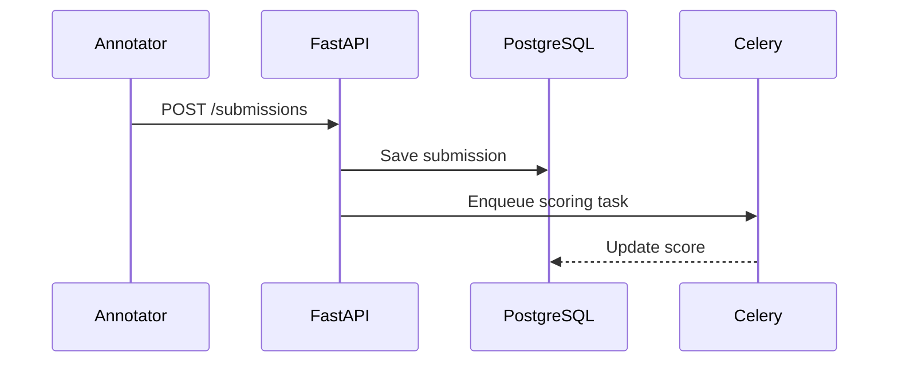

# Spec to Plan

Transform a completed `spec.md` into a structured `plan.md` with implementation steps, technical design, and task breakdown for the Label Suite project.

## Input

Read the target `specs/NNN-feature/spec.md` file and extract:
- Feature overview and motivation
- Acceptance Criteria (AC)
- User Stories (US)
- Non-functional requirements
- Constitution compliance notes

## Output Format

Generate `specs/NNN-feature/plan.md` using the plan template at `.specify/templates/plan-template.md`.

### Required Sections

```markdown
# Plan: [Feature Name]

## Spec Reference
- Spec: specs/NNN-feature/spec.md
- Spec Version: X.X
- Plan Author: [agent]
- Last Updated: YYYY-MM-DD

## Technical Overview

### Architecture Decision
[Brief description of the architectural approach chosen]

### Component Map
[List of files to create / modify]

| Action | File | Description |
|--------|------|-------------|
| CREATE | backend/app/routers/xxx.py | API endpoint |
| CREATE | backend/app/services/xxx.py | Business logic |
| CREATE | frontend/src/components/Xxx.tsx | UI component |
| MODIFY | backend/app/models/xxx.py | Add new fields |

### Sequence Diagram


## Implementation Steps

### Step 1: [Backend — Data Model]
**Estimated effort**: S / M / L
**Files**: backend/app/models/xxx.py
**Description**: [What to implement and why]
**AC covered**: AC-01, AC-02

### Step 2: [Backend — API Endpoint]
**Estimated effort**: S / M / L
**Files**: backend/app/routers/xxx.py, backend/app/schemas/xxx.py
**Description**: [Endpoint design, request/response schema]
**AC covered**: AC-03

### Step 3: [Backend — Business Logic]
**Estimated effort**: S / M / L
**Files**: backend/app/services/xxx.py
**Description**: [Core logic, scoring pipeline, Celery tasks if applicable]
**AC covered**: AC-04, AC-05

### Step 4: [Frontend — UI Component]
**Estimated effort**: S / M / L
**Files**: frontend/src/components/Xxx.tsx, frontend/src/pages/Xxx.tsx
**Description**: [React component design, state management]
**AC covered**: AC-06

### Step 5: [Tests]
**Estimated effort**: S / M / L
**Files**: backend/tests/test_xxx.py, frontend/tests/xxx.spec.ts
**Description**: [pytest unit tests + Playwright E2E tests]
**AC covered**: All ACs

## Security Checklist

- [ ] Test-set answer fields excluded from API response schemas
- [ ] RBAC validated (annotator vs administrator role separation)
- [ ] Input validated at API boundary (FastAPI schema validation)
- [ ] No `dangerouslySetInnerHTML` in frontend components
- [ ] Rate limiting applied to scoring submission endpoints

## Constitution Compliance

| Principle | Compliance | Notes |
|-----------|-----------|-------|
| I. Config-Driven | ✅ / ⚠️ / ❌ | |
| II. Minimal Coupling | ✅ / ⚠️ / ❌ | |
| III. Security First | ✅ / ⚠️ / ❌ | |
| IV. KISS / YAGNI | ✅ / ⚠️ / ❌ | |
| V. Test Coverage | ✅ / ⚠️ / ❌ | |
| VI. English First | ✅ / ⚠️ / ❌ | |

## Dependencies

| Dependency | Type | Reason |
|------------|------|--------|
| spec/NNN-other | Upstream | Requires [feature] to be implemented first |

## Risk & Assumptions

| Risk | Impact | Mitigation |
|------|--------|------------|
| [Risk description] | High / Med / Low | [Mitigation strategy] |
```

## Rules

1. Every implementation step must reference at least one AC
2. Security checklist is mandatory — never skip test-set leakage check
3. Constitution Compliance must be evaluated for all six principles
4. Keep steps small and independently testable
5. Prefer modifying existing files over creating new ones (YAGNI)
6. Celery async tasks require explicit mention in sequence diagram
7. Frontend steps must include TypeScript interface definitions

## Example

```
/spec-to-plan specs/001-annotation-submission/spec.md
```
