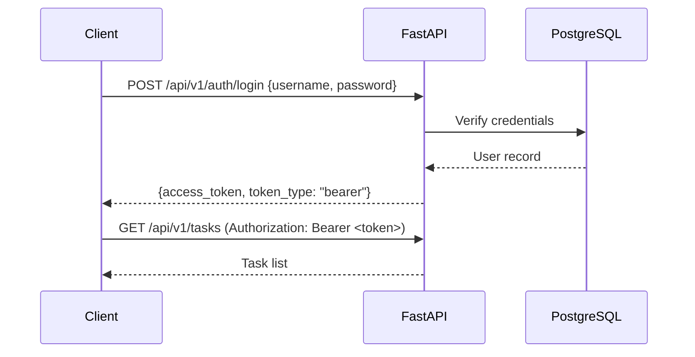

# API Specification

Generate a comprehensive REST API specification for a new FastAPI endpoint group following RESTful conventions and the project's security requirements.

## Usage

```
/api-spec "Submission API — annotator submits predictions"
/api-spec "Task Configuration API — admin manages annotation tasks"
/api-spec "Leaderboard API — public ranking endpoint"
```

## Output Format

```markdown
# API Specification: [API Group Name]

**Version**: v1
**Base URL**: `/api/v1`
**Auth**: Bearer JWT (except public endpoints)
**Date**: YYYY-MM-DD

---

## Authentication

All endpoints require `Authorization: Bearer <token>` except those marked `[PUBLIC]`.



---

## Endpoints

### POST /api/v1/submissions

**Summary**: Submit predictions for a task
**Auth**: Required (Annotator role)
**Rate Limit**: Configurable per task (default: 10/day)

**Request Body**:
```json
{
  "task_id": 42,
  "predictions": ["positive", "negative", "neutral"]
}
```

**Request Validation**:

| Field | Type | Required | Constraints | Description |
|-------|------|----------|-------------|-------------|
| task_id | integer | ✅ | > 0 | ID of the annotation task |
| predictions | array[string] | ✅ | non-empty | Predicted labels/values |

**Response — 201 Created**:
```json
{
  "submission_id": 101,
  "task_id": 42,
  "status": "queued",
  "created_at": "2026-03-18T10:00:00Z"
}
```

> **Security**: `answer`, `reference`, and `gold_label` fields are NEVER included in responses.

**Error Responses**:

| Status | Code | Description |
|--------|------|-------------|
| 401 | UNAUTHORIZED | Missing or invalid JWT token |
| 403 | FORBIDDEN | Task not assigned to this annotator |
| 422 | VALIDATION_ERROR | Invalid request body |
| 429 | RATE_LIMIT_EXCEEDED | Daily submission limit reached |

---

### GET /api/v1/submissions/{submission_id}

**Summary**: Get submission status and score
**Auth**: Required (owner annotator or admin)

**Path Parameters**:

| Parameter | Type | Description |
|-----------|------|-------------|
| submission_id | integer | Submission ID |

**Response — 200 OK**:
```json
{
  "submission_id": 101,
  "task_id": 42,
  "status": "completed",
  "score": 0.833,
  "metric": "f1_macro",
  "rank": 5,
  "created_at": "2026-03-18T10:00:00Z",
  "scored_at": "2026-03-18T10:00:28Z"
}
```

> **Security**: No `answer` or `reference` fields in response.

---

### GET /api/v1/leaderboard [PUBLIC]

**Summary**: Get public leaderboard for a task
**Auth**: Not required

**Query Parameters**:

| Parameter | Type | Required | Default | Description |
|-----------|------|----------|---------|-------------|
| task_id | integer | ✅ | — | Filter by task |
| page | integer | ❌ | 1 | Page number |
| page_size | integer | ❌ | 20 | Max 100 |

**Response — 200 OK**:
```json
{
  "data": [
    {
      "rank": 1,
      "team_name": "NLP Lab A",
      "score": 0.921,
      "metric": "f1_macro",
      "submitted_at": "2026-03-18T10:00:00Z"
    }
  ],
  "meta": {
    "task_id": 42,
    "total": 150,
    "page": 1,
    "page_size": 20
  }
}
```

---

## Data Models

### SubmissionCreate (Request)
```python
class SubmissionCreate(BaseModel):
    task_id: int = Field(gt=0)
    predictions: list[str] = Field(min_length=1)
```

### SubmissionResponse (Response)
```python
class SubmissionResponse(BaseModel):
    submission_id: int
    task_id: int
    status: Literal["queued", "processing", "completed", "failed"]
    score: float | None = None
    metric: str | None = None
    rank: int | None = None
    created_at: datetime
    scored_at: datetime | None = None
    # NOTE: answer/reference fields are intentionally omitted
```

---

## Standard Response Envelope

```python
# List response
{
  "data": [...],
  "meta": {"total": N, "page": N, "page_size": N}
}

# Single object response
{
  "data": {...}
}

# Error response
{
  "detail": "Error message",
  "code": "ERROR_CODE"
}
```

---

## Error Codes Reference

| HTTP Status | Application Code | Description |
|-------------|-----------------|-------------|
| 400 | BAD_REQUEST | Malformed request |
| 401 | UNAUTHORIZED | Authentication required |
| 403 | FORBIDDEN | Insufficient permissions |
| 404 | NOT_FOUND | Resource not found |
| 422 | VALIDATION_ERROR | Pydantic validation failure |
| 429 | RATE_LIMIT_EXCEEDED | Submission limit reached |
| 500 | INTERNAL_ERROR | Unexpected server error |

---

## Rate Limiting

| Endpoint | Limit | Window | Header |
|----------|-------|--------|--------|
| POST /submissions | Configurable per task | Per day | `X-RateLimit-Limit`, `X-RateLimit-Remaining` |
| POST /auth/login | 10 | Per minute | `Retry-After` |
| GET /leaderboard | 100 | Per minute | — |

**429 Response**:
```json
{
  "detail": "Daily submission limit of 10 reached",
  "code": "RATE_LIMIT_EXCEEDED",
  "retry_after": "2026-03-19T00:00:00Z"
}
```

---

## Naming Conventions

| Pattern | Convention | Example |
|---------|-----------|---------|
| URL path | kebab-case | `/annotation-tasks` |
| Query param | snake_case | `?task_id=42&page_size=20` |
| JSON field | snake_case | `submission_id`, `created_at` |
| HTTP method | Resource action | GET=read, POST=create, PUT=replace, PATCH=update, DELETE=remove |
```
