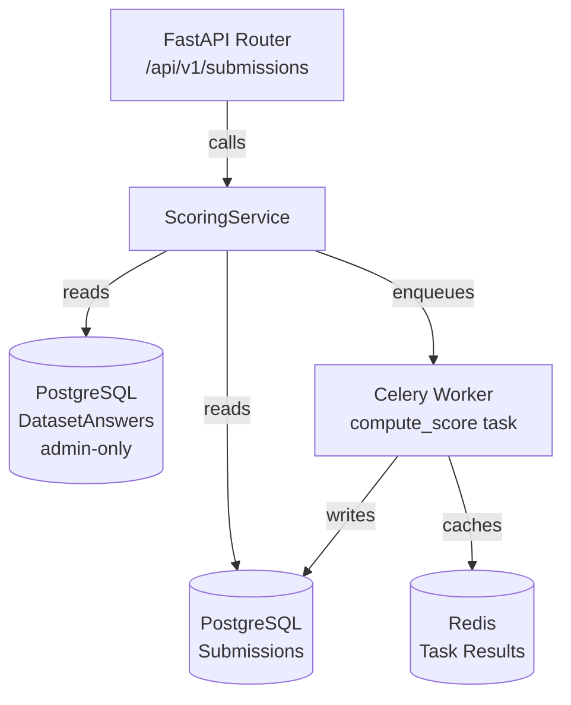
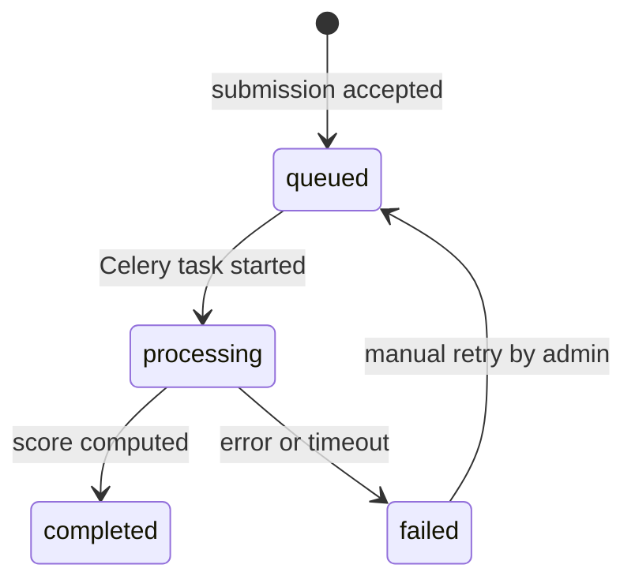
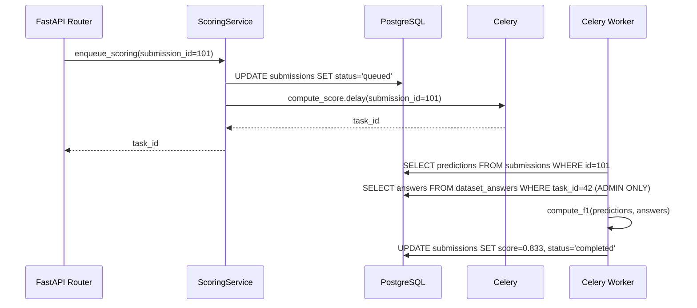

# Backend Service Specification

Generate a detailed backend service specification covering architecture, data models, business logic, error handling, and testing strategy.

## Usage

```
/backend-spec "ScoringService — compute evaluation metrics for submissions"
/backend-spec "TaskConfigService — load and validate YAML task configurations"
/backend-spec "LeaderboardService — aggregate and rank submission scores"
```

## Output Format

```markdown
# Backend Service Specification: [ServiceName]

**Module**: `backend/app/services/[service_name].py`
**Date**: YYYY-MM-DD
**Spec Reference**: specs/NNN-feature/spec.md

---

## Service Responsibilities

[Single paragraph describing what this service owns and what it explicitly does NOT own]

---

## Architecture Context



---

## Dependencies

| Dependency | Type | Timeout | Fallback |
|------------|------|---------|----------|
| PostgreSQL (submissions) | Required | 5s | Raise 503 |
| PostgreSQL (dataset_answers) | Required | 5s | Raise 503 |
| Redis (Celery broker) | Required | 2s | Raise 503 |
| Celery worker | Async | N/A | Task retries |

---

## Data Models

```python
from dataclasses import dataclass

@dataclass
class ScoreResult:
    submission_id: int
    metric: str
    score: float
    scored_at: datetime

@dataclass
class ScoringInput:
    predictions: list[str]
    references: list[str]  # fetched inside Celery task — never from API input
    metric: str
```

---

## Service Interface

```python
class ScoringService:
    """Handles evaluation metric computation for annotation submissions.

    Security: test-set answers are fetched internally and never
    passed through user-facing API boundaries.
    """

    def enqueue_scoring(self, submission_id: int) -> str:
        """Enqueue a Celery task to score the given submission.

        Args:
            submission_id: ID of the submission to score.

        Returns:
            Celery task ID for status polling.

        Raises:
            SubmissionNotFoundError: If submission does not exist.
            TaskNotAssignedError: If submission has no associated task config.
        """
        ...

    def get_score(self, submission_id: int) -> ScoreResult | None:
        """Retrieve the computed score for a submission.

        Returns None if scoring has not completed.
        """
        ...
```

---

## Business Logic

### Scoring Rules

| Rule | Description |
|------|-------------|
| Metric from config | The evaluation metric (f1_macro, accuracy, bleu) is defined in the task config — never overridden at submission time |
| Zero division | Empty predictions return score 0.0 (not an error) |
| Idempotent | Re-scoring the same submission produces the same result |
| Isolation | Test-set answers fetched inside Celery task; never logged or returned to API |

### State Machine



---

## Sequence Diagram (Happy Path)



---

## Error Handling

| Error | Type | HTTP Status | Response |
|-------|------|-------------|----------|
| Submission not found | SubmissionNotFoundError | 404 | `{"detail": "Submission 101 not found"}` |
| Task config missing | ConfigNotFoundError | 500 | Internal — log and alert |
| Scoring timeout | CeleryTimeoutError | N/A | Status → `failed`, retry up to 3× |
| Division by zero in metric | — | N/A | Return 0.0, log warning |

---

## Observability

**Structured Logging**:
```python
logger.info("scoring.enqueued", submission_id=101, task_id=42, metric="f1_macro")
logger.info("scoring.completed", submission_id=101, score=0.833, duration_ms=4200)
logger.error("scoring.failed", submission_id=101, error=str(exc))
# NOTE: never log answer/reference values
```

**Prometheus Metrics**:
- `scoring_task_duration_seconds` — histogram of Celery task duration
- `scoring_task_total{status}` — counter: completed / failed

---

## Security

```python
# Test-set answers are ONLY fetched inside Celery worker
# NEVER passed as task arguments or returned via API

@celery.task(bind=True, max_retries=3)
def compute_score(self, submission_id: int) -> None:
    """Scoring task — answers fetched here, not from API layer."""
    submission = db.query(Submission).filter_by(id=submission_id).first()
    # Fetch answers using admin-level DB access inside the task
    answers = db.query(DatasetAnswer).filter_by(
        task_id=submission.task_id
    ).all()
    score = compute_metric(submission.predictions, [a.answer for a in answers])
    submission.score = score
    submission.status = "completed"
    db.commit()
```

---

## Testing Strategy

| Test Type | Tool | Coverage Target | Key Scenarios |
|-----------|------|-----------------|---------------|
| Unit | pytest | ≥90% | All metric variants, edge cases |
| Integration | pytest + httpx | ≥80% | Full submission → score flow |
| Security | pytest | 100% | Answer never in API response |
| Performance | k6 / locust | — | ≤30s for 10k samples |
```
