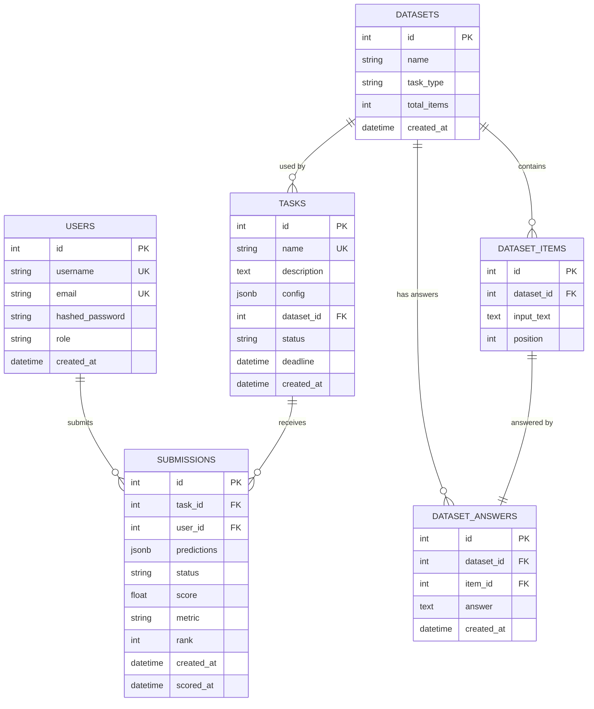

# Data Model

Generate a comprehensive PostgreSQL schema design including ERD, entity definitions, indexes, constraints, and security annotations.

## Usage

```
/data-model "Annotation submission and scoring results"
/data-model "Task configuration and dataset management"
/data-model "User and role management"
```

## Output Format

```markdown
# Data Model: [Domain Name]

**Database**: PostgreSQL
**ORM**: SQLAlchemy (async)
**Date**: YYYY-MM-DD
**Spec Reference**: specs/NNN-feature/spec.md

---

## Entity Relationship Diagram



---

## Entity Definitions

### users

| Column | Type | Nullable | Default | Description |
|--------|------|----------|---------|-------------|
| id | SERIAL PK | No | auto | User ID |
| username | VARCHAR(64) UK | No | — | Unique username |
| email | VARCHAR(255) UK | No | — | Unique email address |
| hashed_password | VARCHAR(255) | No | — | Bcrypt hashed password |
| role | VARCHAR(32) | No | 'annotator' | 'annotator' or 'administrator' |
| is_active | BOOLEAN | No | TRUE | Account active flag |
| created_at | TIMESTAMPTZ | No | NOW() | Account creation time |

### dataset_answers

| Column | Type | Nullable | Default | Description |
|--------|------|----------|---------|-------------|
| id | SERIAL PK | No | auto | Answer ID |
| dataset_id | INT FK | No | — | References datasets.id |
| item_id | INT FK | No | — | References dataset_items.id |
| answer | TEXT | No | — | **SENSITIVE** — gold label / reference answer |
| created_at | TIMESTAMPTZ | No | NOW() | |

> ⚠️ **Security**: `dataset_answers` is accessible ONLY to Celery workers and administrators. Annotator-role DB users and API responses must NEVER expose this table.

### submissions

| Column | Type | Nullable | Default | Description |
|--------|------|----------|---------|-------------|
| id | SERIAL PK | No | auto | Submission ID |
| task_id | INT FK | No | — | References tasks.id |
| user_id | INT FK | No | — | References users.id |
| predictions | JSONB | No | — | Array of predicted labels |
| status | VARCHAR(32) | No | 'queued' | queued / processing / completed / failed |
| score | FLOAT | Yes | NULL | Computed evaluation score |
| metric | VARCHAR(64) | Yes | NULL | Metric name (e.g., f1_macro) |
| rank | INT | Yes | NULL | Leaderboard rank at time of scoring |
| created_at | TIMESTAMPTZ | No | NOW() | |
| scored_at | TIMESTAMPTZ | Yes | NULL | When scoring completed |

---

## Indexes

| Index Name | Table | Columns | Type | Purpose |
|------------|-------|---------|------|---------|
| idx_submissions_task_user | submissions | (task_id, user_id) | BTREE | Leaderboard queries |
| idx_submissions_status | submissions | (status) | BTREE | Celery worker polling |
| idx_submissions_score | submissions | (task_id, score DESC) | BTREE | Ranking queries |
| idx_dataset_answers_dataset | dataset_answers | (dataset_id) | BTREE | Scoring lookup |
| idx_users_role | users | (role) | BTREE | RBAC filtering |

---

## Constraints

**Foreign Keys**:
```sql
ALTER TABLE submissions ADD CONSTRAINT fk_submission_task
    FOREIGN KEY (task_id) REFERENCES tasks(id) ON DELETE RESTRICT;

ALTER TABLE submissions ADD CONSTRAINT fk_submission_user
    FOREIGN KEY (user_id) REFERENCES users(id) ON DELETE RESTRICT;
```

**Check Constraints**:
```sql
ALTER TABLE users ADD CONSTRAINT chk_user_role
    CHECK (role IN ('annotator', 'administrator'));

ALTER TABLE submissions ADD CONSTRAINT chk_submission_status
    CHECK (status IN ('queued', 'processing', 'completed', 'failed'));

ALTER TABLE submissions ADD CONSTRAINT chk_submission_score
    CHECK (score IS NULL OR (score >= 0.0 AND score <= 1.0));
```

---

## Security Annotations

| Table | Sensitivity | Annotator Access | Admin Access |
|-------|-------------|-----------------|-------------|
| users | Medium | Own record only | Full |
| tasks | Low | Read (assigned) | Full |
| datasets | Low | Read (metadata) | Full |
| dataset_items | Low | Read | Full |
| **dataset_answers** | **CRITICAL** | **NONE** | **Full** |
| submissions | Medium | Own records | Full |

---

## Data Type Guidelines

| Use Case | PostgreSQL Type | SQLAlchemy Type | Notes |
|----------|----------------|-----------------|-------|
| Primary keys | SERIAL / BIGSERIAL | Integer | Auto-increment |
| Text fields | VARCHAR(N) | String(N) | Use length limit |
| Long text | TEXT | Text | No length limit |
| JSON/config | JSONB | JSONB | Supports indexing |
| Scores | FLOAT / DOUBLE PRECISION | Float | Use NUMERIC for financial |
| Timestamps | TIMESTAMPTZ | DateTime(timezone=True) | Always store UTC |
| Booleans | BOOLEAN | Boolean | |

---

## Audit Trail

All tables include:
```sql
created_at TIMESTAMPTZ NOT NULL DEFAULT NOW(),
updated_at TIMESTAMPTZ NOT NULL DEFAULT NOW()
```

Use a PostgreSQL trigger or SQLAlchemy `onupdate` to keep `updated_at` current.
```
