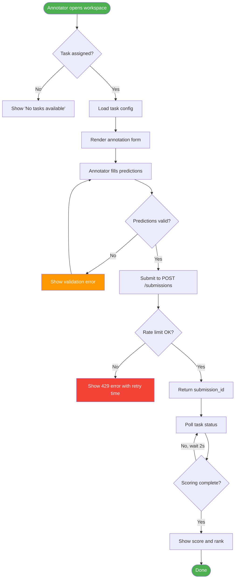
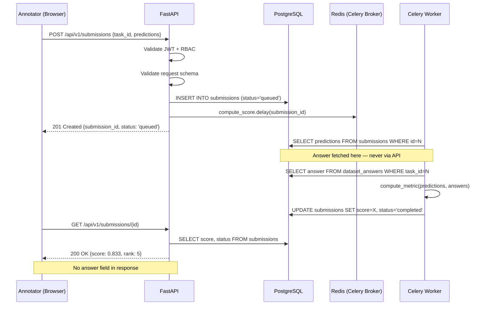
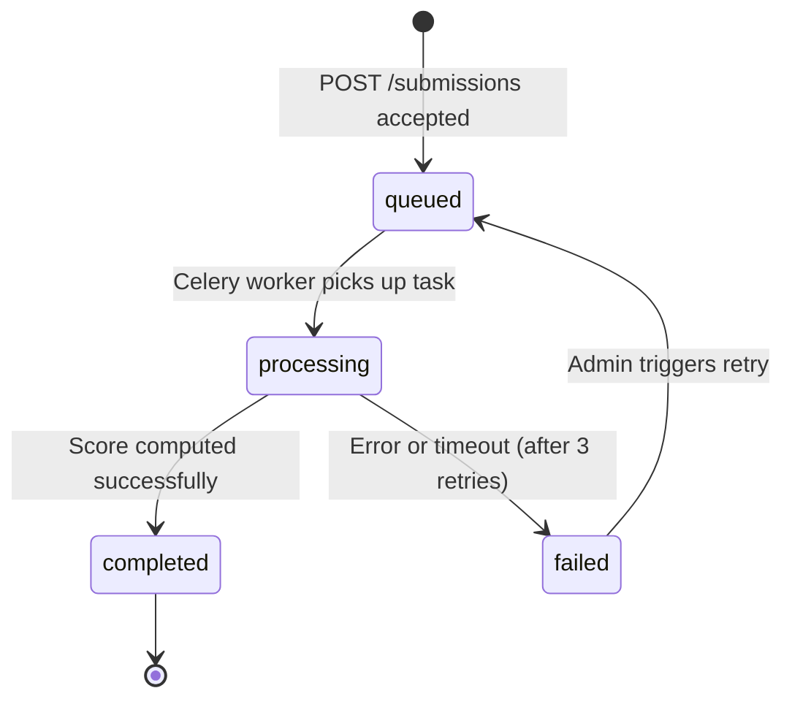
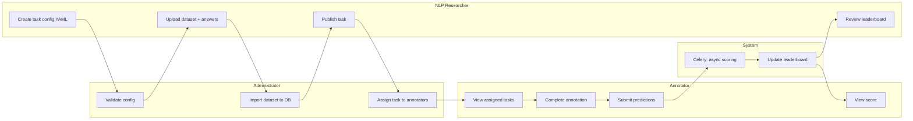
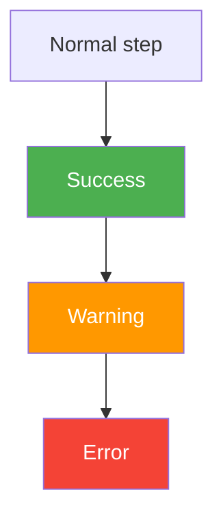

# Flowchart

Generate Mermaid diagrams for system flows, user journeys, sequence diagrams, and state machines.

## Usage

```
/flowchart "Annotation submission and async scoring flow"
/flowchart "Annotator user journey — from task selection to submission"
/flowchart "Celery task retry logic for scoring failures"
/flowchart "RBAC authorization decision flow"
```

## Diagram Types

### Process Flow (Flowchart)


### Sequence Diagram


### State Machine


### Swimlane (Cross-functional Flow)


## Node Shape Reference

| Shape | Mermaid Syntax | Use For |
|-------|---------------|---------|
| Rectangle | `[Text]` | Process step |
| Rounded | `([Text])` | Start/end |
| Diamond | `{Text}` | Decision |
| Parallelogram | `[/Text/]` | Input/output |
| Database | `[(Text)]` | Data store |
| Hexagon | `{{Text}}` | Preparation |
| Subroutine | `[[Text]]` | Called process |

## Styling Reference



## Best Practices

1. **Direction**: Use `TD` (top-down) for process flows, `LR` (left-right) for swimlanes
2. **Start/End**: Always use rounded nodes `([...])` for terminal states
3. **Decisions**: Diamond nodes `{...}` with Yes/No labels on arrows
4. **Security notes**: Add `Note over` annotations in sequence diagrams to highlight security boundaries
5. **Complexity**: If a flowchart exceeds 20 nodes, split into sub-diagrams
6. **Labels**: Keep node labels concise (≤ 5 words)
