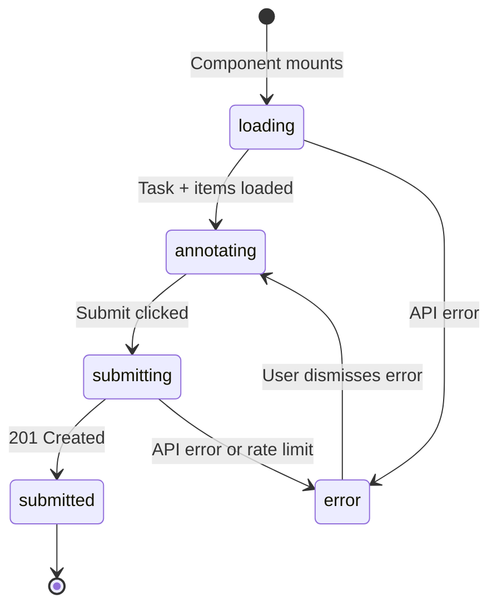

# Frontend Component Specification

Generate a detailed frontend specification for React + TypeScript components including wireframe, props interface, state management, API integration, and testing.

## Usage

```
/frontend-spec "AnnotationWorkspace — main annotation interface for annotators"
/frontend-spec "Leaderboard — ranked submission results table"
/frontend-spec "TaskConfigForm — admin form for creating annotation tasks"
```

## Output Format

```markdown
# Frontend Specification: [ComponentName]

**Component**: `frontend/src/components/[ComponentName].tsx`
**Page**: `frontend/src/pages/[PageName].tsx`
**Date**: YYYY-MM-DD
**Spec Reference**: specs/NNN-feature/spec.md

---

## Wireframe (ASCII)

```
┌─────────────────────────────────────────────────┐
│  Label Suite                 [User] [Logout]│
├─────────────────────────────────────────────────┤
│  Task: Text Classification — Sentiment Analysis  │
│  Deadline: 2026-03-31  |  Submissions: 2/10      │
├─────────────────────────────────────────────────┤
│                                                  │
│  Item 1 of 500                                   │
│  ┌────────────────────────────────────────────┐  │
│  │ "The product quality exceeded expectations"│  │
│  └────────────────────────────────────────────┘  │
│                                                  │
│  Label:  ○ Positive  ○ Negative  ○ Neutral       │
│                                                  │
│  [← Previous]              [Next →]              │
│                                                  │
│  ┌────────────────────────────────────────────┐  │
│  │  [Submit All Predictions]                  │  │
│  └────────────────────────────────────────────┘  │
└─────────────────────────────────────────────────┘
```

---

## TypeScript Interfaces

```typescript
// Task configuration from API (config-driven)
interface TaskConfig {
  task_id: number;
  name: string;
  task_type: 'text-classification' | 'sequence-labeling' | 'text-generation';
  labels?: string[];       // for classification tasks
  deadline: string;        // ISO 8601
  max_submissions: number;
  submissions_used: number;
}

// Individual annotation item
interface AnnotationItem {
  item_id: number;
  input_text: string;
  position: number;
  total: number;
}

// Component props
interface AnnotationWorkspaceProps {
  taskId: number;
  onSubmitSuccess: (submissionId: number) => void;
}

// Component state
interface AnnotationWorkspaceState {
  task: TaskConfig | null;
  currentItem: AnnotationItem | null;
  predictions: Record<number, string>;  // item_id → label
  currentIndex: number;
  status: 'loading' | 'annotating' | 'submitting' | 'submitted' | 'error';
  errorMessage: string | null;
}
```

---

## State Management

### Local State

| State | Type | Initial | Description |
|-------|------|---------|-------------|
| `predictions` | `Record<number, string>` | `{}` | item_id → label mapping |
| `currentIndex` | `number` | `0` | Current annotation item index |
| `status` | `string` | `'loading'` | Component lifecycle state |
| `errorMessage` | `string \| null` | `null` | User-facing error message |

### State Diagram



---

## Event Handlers

| Event | Handler | Description |
|-------|---------|-------------|
| Label selected | `handleLabelSelect(itemId, label)` | Update predictions map |
| Next clicked | `handleNext()` | Advance currentIndex |
| Previous clicked | `handlePrev()` | Decrement currentIndex |
| Submit clicked | `handleSubmit()` | POST /submissions |
| Error dismissed | `handleErrorDismiss()` | Clear errorMessage |

**Keyboard Events**:

| Key | Action |
|-----|--------|
| `→` / `n` | Next item |
| `←` / `p` | Previous item |
| `1`, `2`, `3` | Select label by index |
| `Enter` | Confirm and advance |

---

## API Integration

| Action | Method | Endpoint | On Success | On Error |
|--------|--------|----------|------------|----------|
| Load task | GET | `/api/v1/tasks/{taskId}` | Set task state | Show error |
| Load items | GET | `/api/v1/tasks/{taskId}/items` | Set items | Show error |
| Submit | POST | `/api/v1/submissions` | Show confirmation | Show 429 or error |
| Poll status | GET | `/api/v1/submissions/{id}` | Show score | Retry or show error |

---

## Validation Rules

| Rule | Condition | Error Message |
|------|-----------|---------------|
| All items labeled | `Object.keys(predictions).length < totalItems` | "Please label all items before submitting" |
| Past deadline | `new Date() > new Date(task.deadline)` | "Submission deadline has passed" |
| Rate limit | API returns 429 | "Daily limit reached. Try again tomorrow." |

---

## Loading & Error States

```tsx
// Loading skeleton
<div role="status" aria-label="Loading annotation task">
  <Skeleton height={80} />
  <Skeleton count={3} />
</div>

// Error state
<Alert variant="error" role="alert">
  <p>{errorMessage}</p>
  <button onClick={handleErrorDismiss}>Dismiss</button>
</Alert>

// Submission confirmation
<Alert variant="success" role="status" aria-live="polite">
  Predictions submitted! Submission ID: {submissionId}
</Alert>
```

---

## Security

- [ ] No `dangerouslySetInnerHTML` — annotation text rendered as `{item.input_text}` (escaped)
- [ ] JWT token stored in memory or httpOnly cookie — NOT localStorage
- [ ] No sensitive data (scores before completion) rendered from local state

---

## Accessibility (WCAG 2.1 AA)

| Requirement | Implementation |
|-------------|----------------|
| Keyboard navigation | Arrow keys + number keys for label selection |
| Screen reader | `aria-label` on radio buttons, `aria-live` on status updates |
| Focus management | After submit, focus moves to confirmation message |
| Color contrast | Labels distinguishable without color alone |
| Form labels | Each input associated with visible `<label>` |

---

## Responsive Design

| Breakpoint | Layout |
|------------|--------|
| Mobile (< 768px) | Single column; labels stacked vertically |
| Tablet (768–1024px) | Two-column: text left, labels right |
| Desktop (> 1024px) | Full workspace with sidebar navigation |

---

## Testing

| Test Type | Tool | Coverage |
|-----------|------|----------|
| Unit | Vitest + React Testing Library | Component render, state transitions |
| Integration | Vitest + MSW (API mock) | Submit flow, error handling |
| E2E | Playwright | Full annotator journey (P1 flow) |
| Accessibility | axe-playwright | WCAG 2.1 AA |

**Key Playwright Test Cases**:
```typescript
test('annotator completes annotation and submits', async ({ page }) => {
  await page.goto('/tasks/42/annotate');
  await page.getByRole('radio', { name: 'Positive' }).click();
  await page.getByRole('button', { name: 'Next' }).click();
  // ... annotate all items
  await page.getByRole('button', { name: 'Submit All Predictions' }).click();
  await expect(page.getByRole('status')).toContainText('Predictions submitted');
});
```

---

## Dependencies

| Package | Version | Purpose |
|---------|---------|---------|
| React | 18.x | UI framework |
| TypeScript | 5.x | Type safety |
| Vite | 5.x | Build tool |
| React Query | 5.x | API state management |
| React Hook Form | 7.x | Form state |
```
