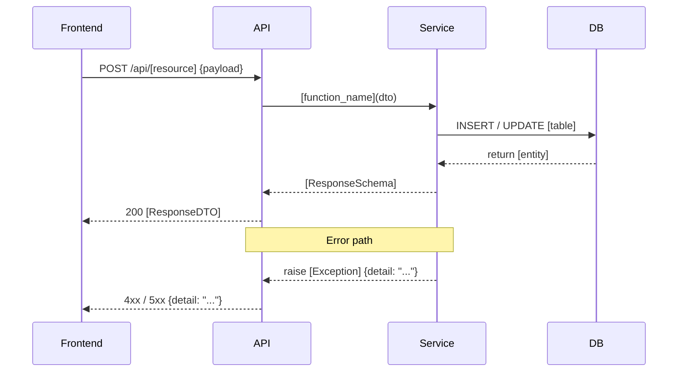

# Implementation Plan: [FEATURE]

**Branch**: `[###-feature-name]` | **Date**: [DATE] | **Spec**: [link]
**Input**: Feature specification from `/specs/[###-feature-name]/spec.md`

## Summary

[Extract from spec: primary requirement + technical approach]

## Technical Context

**Language/Version**: Python 3.12+ / TypeScript 5+
**Primary Dependencies**: FastAPI / React + Vite
**Storage**: PostgreSQL + Redis
**Testing**: pytest + Playwright
**Target Platform**: Web (Browser + REST API)
**Performance Goals**: [e.g., API p95 < 500ms]
**Constraints**: [e.g., Config-driven, no hardcoded task logic]

## Constitution Check

- [ ] I. Spec-First: Spec is complete and reviewed
- [ ] II. Generalization-First: Does the design support multiple NLP task types?
- [ ] III. Data Fairness: Does this involve test sets? If so, leakage prevention is planned
- [ ] IV. Test-First: Test plan is listed
- [ ] V. Simplicity: Any signs of over-engineering?
- [ ] VI. English-First: Code, comments, and commit messages in English; Traditional Chinese allowed in `docs/` and `specs/`

## Project Structure

### Documentation (this feature)

```text
specs/[###-feature]/
├── spec.md
├── plan.md
├── tasks.md
├── research.md        (optional)
├── data-model.md      (optional)
└── contracts/         (optional)
```

### Source Code

```text
frontend/
├── src/
│   ├── components/[feature]/
│   ├── pages/[feature]/
│   └── services/[feature].ts

backend/
├── app/
│   ├── api/routes/[feature].py
│   ├── models/[feature].py
│   ├── schemas/[feature].py
│   └── services/[feature].py
└── tests/
    ├── unit/test_[feature].py
    └── integration/test_[feature].py
```

## System Flow & Data Flow *(include if feature involves API calls, async tasks, or multi-layer data processing)*

<!--
  Show how data moves through the system layers: Frontend → API → Service → DB.
  Include error paths and async flows (Celery tasks, WebSocket, etc.) where relevant.
  Renders natively on GitHub — no extra tooling needed.
-->



| Layer | Component | Responsibility |
|-------|-----------|---------------|
| Frontend | `pages/[feature]` | Form state, API call, display result |
| API | `api/routes/[feature].py` | Request validation, auth check, delegate to service |
| Service | `services/[feature].py` | Business logic, DB interaction |
| DB | `models/[feature].py` | Persistence |

---

## Complexity Tracking

> Only fill in when a Constitution principle is violated and justification is required

| Violation | Why Needed | Simpler Alternative Rejected Because |
|---|---|---|
| [e.g., adding a third-party package] | [current need] | [why existing tools are insufficient] |
