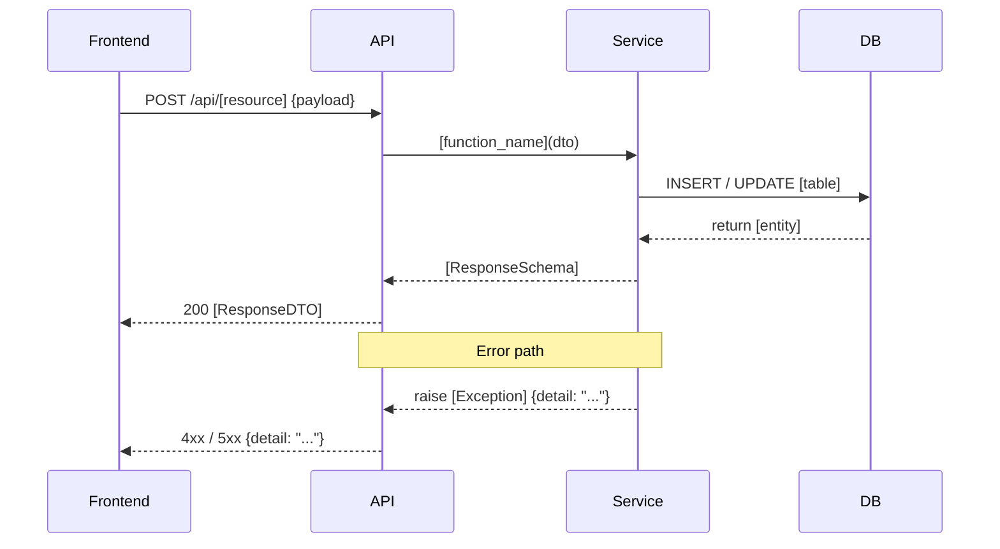

# 實作計畫：[功能名稱]

**規格**: [連結至 `specs/[module]/NNN-feature/spec.md`]

## 功能目標

> 從 `spec.md § 功能目標` 複製或精煉。若在 spec 與 plan 之間有修改，必須同步觸發 spec 版本升級。

[在此貼上或精煉來自 spec.md 的功能目標。]

## Technical Approach

[一段話。說明觸及哪些層（前端 / 後端 / 兩者）、核心技術決策，以及為何此方案能達成功能目標。不描述實作細節——這是目標與任務之間的橋樑。]

## 技術脈絡

**效能目標**: [例：API p95 < 500ms]
**限制**: [例：Config-driven，不得硬編碼 task 邏輯]

## 憲章檢查

- [ ] 功能目標：本計畫的功能目標與 spec.md 一致（若有修改，已觸發 spec 版本升級）
- [ ] I. Spec-First：規格已完成並審查
- [ ] II. Generalization-First：設計是否支援多種 NLP task type？
- [ ] III. Data Fairness：是否涉及 test set？若是，已規劃防止資料洩露
- [ ] IV. Test-First：測試計畫已列出
- [ ] V. Code Quality & Simplicity：是否有過度工程的跡象？型別提示、linter、無 debug 輸出已處理？命名是否自說明、不需看呼叫端才能理解意圖？功能入口點能否在兩層呼叫內從 router/endpoint/page component 定位？
- [ ] VI. English-First：程式碼、注釋與 commit message 使用英文；`docs/`、`specs/`、`design/prototype/`、`design/wireframes/` 與 `design/system/inventory.md` 允許繁體中文；`design/system/MASTER.md` 必須純英文
- [ ] VII. Design Consistency：UI 使用 MASTER.md tokens；prototype 畫面已遵循；共用元件已重用；所有非 page 元件已規劃 Storybook story（Default + 邊界狀態）；互動元件符合 WCAG 2.1 AA（鍵盤可操作、螢幕閱讀器可存取）
- [ ] VIII. Performance Baseline：列表端點已分頁；無無界查詢；API P95 ≤ 500ms 目標已確認；前端 FCP ≤ 3s；互動反饋 ≤ 100ms；非核心路由使用 code splitting
- [ ] IX. No Silent Failure：所有 error case 是否定義對應處理路徑？例外不可靜默吞噬；背景 job 必須暴露狀態、重試次數與失敗原因
- [ ] XI. Security & Privacy Baseline：是否涉及驗證流程、角色權限或使用者資料？若是，已規劃拒絕路徑測試；API response 不洩漏內部識別碼或敏感 metadata
- [ ] XXI. Frontend Runtime Safety：若前端受影響，async 競態、unmount 後 stale response、timer / subscription / listener cleanup 是否已納入元件設計？
- [ ] XXII. API Contract Completeness：所有新增端點是否都計畫更新 OpenAPI 文件？含 enum 值、nullable 欄位、pagination shape、error schema
- [ ] XXIV. Backend Consistency & Idempotency：mutating 端點是否定義 idempotency 或衝突行為？concurrent update 是否以 transaction / lock 保護？
- [ ] XXVI. Database-Enforced Integrity：是否設計 FK constraint、unique constraint；multi-step mutation 是否包在 transaction 內；migration 是否含 backfill 或資料驗證步驟？
- [ ] XXVIII. Canonical Domain Lifecycle：若涉及實體狀態機，是否定義合法轉換清單？非法轉換須在 service 層拒絕，不得僅靠 UI button 可見性控制

## 專案結構

### 文件（本功能）

```text
specs/[module]/NNN-feature/
├── spec.md
├── plan.md
├── tasks.md
├── checklists/
│   ├── ac-checklist.md
│   └── security-checklist.md
├── research.md        (optional)
├── data-model.md      (optional)
└── contracts/         (optional)
```

### 原始碼

<!--
  將 [module] 替換為功能模組名稱（例：task-management、annotation）
  將 [feature] 替換為功能名稱（例：batch-import、auto-label）。
  產生的 plan.md 不得保留任何佔位符括號。
-->

```text
frontend/
├── src/
│   ├── features/[module]/
│   │   ├── components/[feature]/
│   │   ├── pages/[feature]/
│   │   └── services/[feature].ts
│   └── shared/        (only when used by 2+ feature modules)

backend/
├── app/
│   ├── api/routes/[feature].py
│   ├── models/[feature].py
│   ├── schemas/[feature].py
│   └── services/[feature].py
└── tests/
    ├── unit/test_[feature].py
    └── integration/test_[feature].py
```

## 系統流程與資料流 *(功能涉及 API 呼叫、非同步任務或多層資料處理時必填)*

<!--
  描述資料如何在系統層間流動：Frontend → API → Service → DB。
  包含相關的錯誤路徑與非同步流程（Celery tasks、WebSocket 等）。
  在 GitHub 上可原生渲染，無需額外工具。
-->


```mermaid
sequenceDiagram
    participant Frontend
    participant API
    participant Service
    participant DB

    Frontend->>API: POST /api/[resource] {payload}
    API->>Service: [function_name](dto)
    Service->>DB: INSERT / UPDATE [table]
    DB-->>Service: return [entity]
    Service-->>API: [ResponseSchema]
    API-->>Frontend: 200 [ResponseDTO]

    Note over Service,API: Error path
    Service-->>API: raise [Exception] {detail: "..."}
    API-->>Frontend: 4xx / 5xx {detail: "..."}
```

| 層 | 元件 | 職責 |
|----|------|------|
| Frontend | `features/[module]/pages/[feature]` | 表單狀態、API 呼叫、結果顯示 |
| API | `api/routes/[feature].py` | 請求驗證、權限檢查、委派至 service |
| Service | `services/[feature].py` | 業務邏輯、DB 操作 |
| DB | `models/[feature].py` | 持久化 |

---

## Phase 0：研究

> 前置條件：技術脈絡已填寫。若無 NEEDS CLARIFICATION 項目，可跳過此階段。

1. **萃取未知事項** 從技術脈絡 — 每個 `NEEDS CLARIFICATION` → 一個研究任務
2. **派送研究任務** 給每個未知事項：

   ```text
   For each unknown:        Task "Research {unknown} for {feature context}"
   For each new dependency: Task "Find best practices for {dep} in label-suite stack"
   ```

3. **整合發現** 至 `research.md`：
   - 決策：[選擇了什麼]
   - 理由：[為何選擇]
   - 考慮過的替代方案：[評估了哪些其他選項]

4. **Exception 設計**（若功能涉及多個 error case）：確認 `app/core/errors.py` 是否已有對應 class，若無則列入 Phase 2

   | 操作 | Error 情境 | Exception Class | HTTP Status | Response body |
   |------|-----------|----------------|-------------|---------------|
   | 建立 [resource] | [entity] 不存在 | `ResourceNotFound` | 404 | `{detail: "..."}` |
   | 更新 [resource] | 無操作權限 | `PermissionDenied` | 403/404 | `{detail: "..."}` |
   | ... | | | | |

**產出**：`research.md`（含 Exception 設計決策）— 所有 NEEDS CLARIFICATION 在 Phase 1 開始前已解決

---

## Phase 1：設計與契約

> 前置條件：research.md 已完成（或若無未知事項則跳過 Phase 0）

1. **萃取實體** 從 spec.md → `data-model.md`
   - 實體名稱、欄位、關係、驗證規則
   - 狀態轉換（若適用）
   - **DB Index 分析**：列出每個查詢所需的 index，標記潛在的 N+1 或全表掃描風險

   | 查詢 | 篩選欄位 | Index 策略 | Loading Strategy | 風險 |
   |------|---------|-----------|-----------------|------|
   | 列表（分頁） | `task_id`, `status` | composite index | `selectinload(rel)` | — |
   | 單筆查詢 | `id` | primary key | `joinedload(rel)` | — |
   | ... | | | | |

   > **Loading Strategy 規則**：relationship 欄位必須明確指定（`selectinload` / `joinedload` / `lazy="raise"`）；禁止依賴預設 `lazy="select"` 以防止隱性 N+1。

2. **後端 API 清單** 從功能需求列出所有需要的端點

   | Method | Path | System Role | Task Role | Auth Dependency | 說明 |
   |--------|------|-------------|-----------|----------------|------|
   | GET | `/api/v1/[module]/[resource]` | user | annotator+ | `get_current_user` | 取得列表（分頁） |
   | POST | `/api/v1/[module]/[resource]` | user | project_leader | `require_task_role(TaskRole.PROJECT_LEADER, task_id)` | 建立 |
   | GET | `/api/v1/[module]/[resource]/{id}` | user | annotator+ | `get_current_user` | 取得單筆（無權限回 404） |
   | PATCH | `/api/v1/[module]/[resource]/{id}` | user | project_leader | `require_task_role(TaskRole.PROJECT_LEADER, task_id)` | 更新 |
   | DELETE | `/api/v1/[module]/[resource]/{id}` | user | project_leader | `require_task_role(TaskRole.PROJECT_LEADER, task_id)` | 刪除 |

   > **Auth 規則**：task-scoped endpoint 必須驗證 `task_membership`；無權限時回 404（不洩漏資源存在）。`super_admin` 可bypass task role check。

   接著產生完整 API 契約 → `contracts/`（請求 / 回應 schema，OpenAPI 相容）

2b. **Pydantic Schema 層次設計** 為每個實體決定 schema 繼承結構

   | Schema | 繼承自 | 用途 | 需排除的敏感欄位 |
   |--------|-------|------|----------------|
   | `[Entity]Base` | `BaseModel` | 共用欄位 | — |
   | `[Entity]Create` | `[Entity]Base` | POST body，所有必填欄位 | — |
   | `[Entity]Update` | `BaseModel` | PATCH body，所有欄位 `Optional` | — |
   | `[Entity]Response` | `[Entity]Base` | 回應，含 `id` / `created_at` | `answer_key`, `hashed_password` 等 |

   - 標記需要 `Field(...)` constraint 或 custom validator 的欄位
   - annotator-facing response 與 admin response 若有不同欄位，分拆為兩個 Response schema

3. **前端切版分析** 從 wireframe / spec 分析畫面如何切成元件

   | 區塊 | 元件名稱 | 職責 | 資料來源 | Stories 狀態 | ARIA / 鍵盤需求 | 響應式行為 |
   |------|---------|------|---------|------------|----------------|----------|
   | 頁面容器 | `[Feature]Page` | 路由入口、資料取得 | TanStack Query | — (page 層不寫 story) | — | — |
   | 主要內容 | `[Feature]List` | 列表渲染 | props | Default, Empty, Loading | `role="list"` | mobile: single column |
   | ... | | | | | | |

   > **Stories 規則**：Page 層不寫 story（太重，依賴路由）；其他所有元件都要寫。每個元件至少涵蓋 Default + 邊界狀態（Empty / Loading / Error / Disabled）。

   **元件層次**：
   ```
   [Feature]Page
   ├── [Feature]Header
   │   └── [Feature]Actions (按鈕群組)
   ├── [Feature]List
   │   └── [Feature]Item (×N)
   └── [Feature]Pagination
   ```

   - 標記哪些元件進 `shared/`（需被 2+ 個 feature module 使用才符合資格）
   - 標記哪些元件需要 Zustand（全域 UI 狀態）vs. TanStack Query（server state）vs. `useState`（local）

   **前端技術決策**（在切版分析後立即決定，避免 Generator 自行猜測）

   ```
   型別策略（擇一）：
   - [ ] 手寫 interface（src/features/[module]/types/[feature].ts）
   - [ ] openapi-typescript 自動生成（pnpm openapi-ts）
   - [ ] zod schema 推導（z.infer<typeof Schema>，同時做 runtime validation）

   表單策略（擇一）：
   - [ ] react-hook-form + zod（欄位 > 3 個或需複雜驗證）
   - [ ] controlled component（欄位 ≤ 3 個的簡單表單）

   TanStack Query 策略：
   - queryKey 格式：['[module]', '[resource]', params]（例：['annotation', 'list', { taskId }]）
   - 每個 mutation 對應 invalidate 目標：[列出 mutationFn → invalidateQueries key 的對應]
   - 需要 optimistic update 的操作：[列出，若無則標記「本功能無 optimistic update」]

   API 錯誤處理策略：
   - 4xx user error → toast（`useToast` hook）
   - 5xx server error → Error Boundary（頁面層）
   - 422 validation error → form field error（react-hook-form `setError`）
   - 403/404 → 導向 `/not-found` 或顯示 inline 訊息（擇一並說明原因）

   Loading 策略：
   - 首次載入大量資料 → skeleton screen
   - mutation 進行中 → button disabled + spinner
   - 背景 refetch → 不顯示 loading（stale-while-revalidate）
   ```

   **路由分析**：列出本功能新增或修改的路由

   | Path | 元件 | 是否需要 Route Guard | 重導向規則 |
   |------|------|-------------------|-----------|
   | `/[module]/[feature]` | `[Feature]Page` | ✅ authenticated | 未登入 → `/login` |
   | `/[module]/[feature]/:id` | `[Feature]DetailPage` | ✅ project_leader | 無權限 → 404 |
   | ... | | | |

   **i18n Key 清單**：列出本功能所有需要翻譯的字串（namespace: `[module]`）

   | Key | 中文預設值 | 出現位置 |
   |-----|----------|---------|
   | `[feature].title` | `[功能標題]` | `[Feature]Page` header |
   | `[feature].empty_state` | `尚無資料` | `[Feature]List` empty |
   | `[feature].actions.create` | `建立` | `[Feature]Actions` button |
   | ... | | |

   > i18n 檔案路徑：`frontend/locales/zh-TW/[module].json` 與 `frontend/locales/en/[module].json`

4. **更新系統流程圖** 在本計畫中
   - 追蹤資料路徑：Frontend → API → Service → DB
   - 明確列出每個操作的 error case 與對應 HTTP status（不可只寫「4xx / 5xx」）
   - **Celery 分析**：若任何操作預期處理時間 > 1 秒，或涉及評分 / 統計計算，必須加入 Celery worker 節點；若無，明確標記「本功能無非同步任務需求」

   | Celery Task | 觸發端點 | retry 策略 | idempotency guard | 狀態查詢方式 |
   |------------|---------|-----------|-----------------|------------|
   | `score_submission` | `POST /submissions` | `max_retries=3, countdown=5` | `submission_id` unique check | polling `GET /submissions/{id}/status` |
   | ... | | | | |

5. **萃取測試情境** 從使用者故事，依測試層分類

   | 情境 | 測試層 | 工具 | 路徑 |
   |------|-------|------|------|
   | service 層業務邏輯分支 | 單元測試 | pytest（mock DB） | `tests/unit/test_[feature].py` |
   | API auth / status code / permission | 整合測試 | pytest + httpx（real test DB） | `tests/integration/test_[feature].py` |
   | 元件渲染 / 互動 / 邊界狀態 | 元件測試 | Vitest + Testing Library | `src/features/[module]/__tests__/[Feature].test.tsx` |
   | 完整用戶流程 | E2E | Playwright | `e2e/[module]/[feature].spec.ts` |

**產出**：`data-model.md`（含 DB index 分析）、`contracts/`、API 清單、路由分析、切版元件層次（含 Stories 欄位）、i18n key 清單、系統流程圖已更新、測試情境已概述

---

## Phase 2：任務規劃方式

*本節描述 `/speckit.tasks` 將執行的內容 — 不得在 `/speckit.plan` 期間執行*

**任務產生策略**：

- 以 `.specify/templates/tasks-template.md` 為基礎
- 每個使用者故事（來自 spec.md）→ 一個 Phase
- **後端**：每個 API 清單項目 → 單元測試任務 [P] + 實作任務（route → service → schema）
- **後端**：每個實體 → 模型建立任務 [P] + migration 任務（含 DB index）
- **前端**：路由分析 → route 註冊任務（含 route guard 設定）
- **前端**：每個切版元件 → 元件測試任務 [P] + 實作任務 + Storybook story 任務（`.stories.tsx`）
- **前端**：每個頁面 → Playwright E2E 測試任務 [P] + page 組裝任務（page 層不寫 story）
- **前端**：i18n key 清單 → `locales/zh-TW/[module].json` + `locales/en/[module].json` 更新任務
- 共用元件（shared/）→ 獨立任務，先於依賴它的 feature 任務

**排序策略**：

- TDD 順序：測試在實作前（必須先失敗）
- 相依順序：model + migration → schema → service → endpoint → route → shared component → feature component + story + i18n → page
- 標記 [P] 用於平行執行（僅限獨立檔案，前後端可同時進行）

**預估產出**：`tasks.md` 中 [N] 個有序任務

**重要**：此階段由 `/speckit.tasks` 執行，不由 `/speckit.plan` 執行

---

## 複雜度追蹤

> 僅在違反憲章原則且需要正當理由時填寫

| 違反項目 | 需要原因 | 拒絕更簡單替代方案的理由 |
|---------|---------|----------------------|
| [例：新增第三方套件] | [當前需求] | [現有工具不足的原因] |

## 進度追蹤

**階段狀態**：

- [ ] Phase 0：研究完成（未知事項已解決）
- [ ] Phase 1：設計完成（契約、資料模型、系統流程）
- [ ] Phase 2：任務規劃方式已描述
- [ ] Phase 3：任務已產生（`/speckit.tasks`）
- [ ] Phase 4：實作完成（`/speckit.implement`）
- [ ] Phase 5：驗證通過（`/speckit.analyze` 零發現）

**把關狀態**：

- [ ] 初始憲章檢查：PASS
- [ ] 設計後憲章檢查：PASS
- [ ] 所有 NEEDS CLARIFICATION 已解決
- [ ] 複雜度偏差已記錄

## Changelog

| 版本 | 日期 | 變更摘要 |
|------|------|---------|
| 1.7.2 | 2026-05-29 | 憲章檢查 VII 加入 Storybook story 要求：所有非 page 元件需規劃 Default + 邊界狀態 story（配合憲章 v1.29.1） |
| 1.7.1 | 2026-05-29 | 憲章檢查 V 補充 Human Handoff Readiness：命名自說明、入口點兩層內可定位（配合憲章 v1.29.0） |
| 1.7.0 | 2026-05-29 | 憲章檢查補齊 IX、XI、XXI、XXII、XXIV、XXVI、XXVIII（配合憲章 v1.28.0，補足設計期相關原則） |
| 1.6.2 | 2026-05-28 | 憲章檢查 VII 加入 WCAG 2.1 AA 無障礙規則；VIII 加入 FCP ≤ 3s、互動反饋 ≤ 100ms、code splitting（配合憲章 v1.6.2） |
| 1.6.1 | 2026-05-28 | 將 ## Feature Goal 章節名稱改為 ## 功能目標；同步更新憲章檢查用詞 |
| 1.6.0 | 2026-05-28 | 將 ## 摘要 改為 ## Feature Goal（複製自 spec）+ ## Technical Approach；憲章檢查加入 Feature Goal 一致性項目 |
| 1.5.0 | 2026-05-27 | senior-backend + senior-frontend 評估後補全：Phase 0 加 Exception 設計表；DB index 表加 Loading Strategy 欄；API 清單欄位拆分為 System Role / Task Role / Auth Dependency；新增步驟 2b（Pydantic schema 層次）；切版分析表加 ARIA 和響應式欄；新增前端技術決策小節（queryKey / 表單 / 型別 / error mapping / loading）；系統流程圖加 Celery 分析；測試情境依層分類 |
| 1.4.0 | 2026-05-27 | Phase 1 加入 DB index 分析（實體步驟）、路由分析表、i18n key 清單表；Phase 2 任務策略加入對應任務；產出摘要更新 |
| 1.3.0 | 2026-05-27 | Phase 1 加入前端切版分析（元件層次表 + Stories 欄位）與後端 API 清單表；技術脈絡加入 Storybook；Phase 2 任務策略對應切版輸出 |
| 1.2.0 | 2026-05-27 | Phase 1 加入後端 API 清單與前端切版分析步驟；Phase 2 任務策略分拆前後端任務產生規則 |
| 1.1.0 | 2026-05-22 | 對齊 spec 實例格式：改為 --- frontmatter + 中文 H1，全面中文化章節標題與說明文字 |
| 1.0.2 | 2026-05-21 | Add Execution Flow and Progress Tracking sections |
| 1.0.1 | 2026-05-21 | Align spec paths with module-based SDD directory structure |
| 1.0.0 | [YYYY-MM-DD] | Initial spec |
