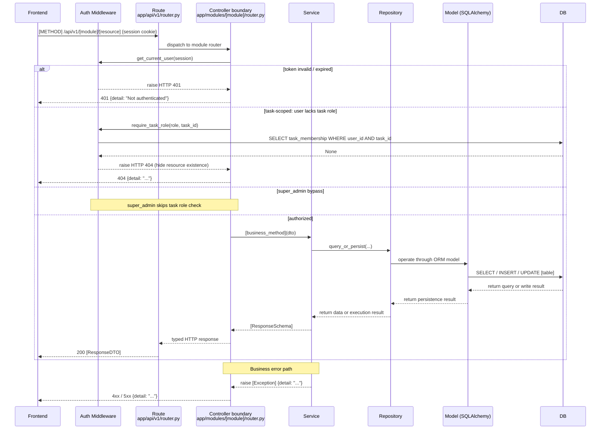

> **⚠️ Deprecated（ADR-033，issue #294）**：`/speckit.plan` 已退役，一般功能改用 OpenSpec `/opsx:propose` 產出 `design.md`。本樣板僅保留給 `specs/foundation/000-foundation/plan.md` 這類常設架構文件例外使用；新功能請勿再套用本樣板。

# 實作計畫：[功能名稱]

**規格**: [連結至 `specs/[module]/NNN-feature/spec.md`]

## 功能目標

> 從 `spec.md § 功能目標` 複製或精煉。若在 spec 與 plan 之間有修改，必須同步觸發 spec 版本升級。

[在此貼上或精煉來自 spec.md 的功能目標。]

## 技術方向

[一段話。說明觸及哪些層（前端 / 後端 / 兩者）、核心技術決策，以及為何此方案能達成功能目標。不描述實作細節——這是目標與任務之間的橋樑。]

## 技術脈絡

**效能目標**: [例：API p95 < 500ms]
**限制**: [例：Config-driven，不得硬編碼 task 邏輯]
**技術複雜度**: [低 / 中 / 高]

<!--
  技術複雜度三級制（取代工時估算）：
  - 低：邏輯單純、無外部依賴、可獨立完成（CRUD、簡單 UI 調整、參數配置）
  - 中：涉及多個模組協作或中等演算法（API 整合、狀態機、基礎數據分析）
  - 高：需要新架構、ML 模型或跨系統協調（即時計算引擎、分散式系統）
  多期交付時，對照 spec.md §範圍外 的分期邊界表，於本欄為每一階段分別標注複雜度。
  spec.md 與 plan.md 不得出現工時估算數字（人天、工時）——工時是工程師在
  Sprint Planning 的職責，且不同技術棧差異可達 3-5 倍，寫死數字很快過時。
-->

## 決策記錄（Decisions）*(有技術取捨或 clarify 決議時必填)*

<!--
  集中記錄本功能的關鍵技術決策，每筆決策必須含：決策內容、理由、被否決的替代方案。
  Clarify 決議：/speckit.clarify 的問答結論記錄於此（含日期），不散落於 spec 正文。
  實作偏差：實作階段偏離本計畫的決定也記錄於此，並同步 spec Changelog（對應 SDD 流程
  「post-implementation write-back」）。
  ADR 分工：跨功能、影響全專案的架構決策仍開 ADR（docs/adr/），此處記錄該 ADR 編號與
  本功能的採用方式；僅影響本功能的決策直接記錄於此，不開 ADR。
-->

### 技術決策

| ID | 決策 | 理由 | 被否決的替代方案 |
|----|------|------|----------------|
| D1 | [決策內容] | [為什麼] | [替代方案 + 否決原因] |

### Clarify 決議 *(執行過 /speckit.clarify 時必填)*

| 日期 | 問題 | 決議 | 影響範圍 |
|------|------|------|---------|
| YYYY-MM-DD | [Q] | [A] | [受影響的 FR/SC/章節] |

## 憲章檢查

- [ ] 功能目標：本計畫的功能目標與 spec.md 一致（若有修改，已觸發 spec 版本升級）
- [ ] I. Spec-First：規格已完成並審查
- [ ] II. Generalization-First：設計是否支援多種 NLP task type？
- [ ] III. Data Fairness：是否涉及 test set？若是，已規劃防止資料洩露
- [ ] IV. Test-First：測試計畫已列出
- [ ] V. Code Quality & Simplicity：是否有過度工程的跡象？型別提示、linter、無 debug 輸出已處理？命名是否自說明、不需看呼叫端才能理解意圖？功能入口點能否在兩層呼叫內從 router/endpoint/page component 定位？
- [ ] VI. English-First：程式碼、注釋與 commit message 使用英文；`docs/`、`specs/`、`design/prototype/`、`design/wireframes/` 與 `design/system/inventory.md` 允許繁體中文；`design/system/MASTER.md` 必須純英文
- [ ] VII. Design Consistency：UI 使用 MASTER.md tokens；prototype 畫面已遵循；共用元件已重用；所有非 page 元件已規劃 Storybook story（Default + 邊界狀態）；互動元件符合 WCAG 2.1 AA（鍵盤可操作、螢幕閱讀器可存取）
- [ ] VIII. Performance Baseline：列表端點已分頁；無無界查詢；API P95 ≤ 500ms 目標已確認；前端 FCP ≤ 3s；互動反饋 ≤ 100ms；非核心路由使用 code splitting
- [ ] IX. No Silent Failure：所有 error case 是否定義對應處理路徑？例外不可靜默吞噬；背景 job 必須暴露狀態、重試次數與失敗原因
- [ ] XI. Security & Privacy Baseline：是否涉及驗證流程、角色權限或使用者資料？若是，已規劃拒絕路徑測試；API response 不洩漏內部識別碼或敏感 metadata

### 領域憲章載入（依觸及範圍勾選；未觸及的範圍可跳過）

- [ ] 後端（touches `backend/`）：已讀取 `.specify/memory/backend-constitution.md`；本 plan 符合其所有適用規則
- [ ] 前端（touches `frontend/`）：已讀取 `.specify/memory/frontend-constitution.md`；本 plan 符合其所有適用規則
- [ ] 測試（所有 task）：已讀取 `.specify/memory/testing-constitution.md`；本 plan 符合其所有適用規則

## 專案結構

### 文件（本功能）

```text
specs/[module]/NNN-feature/
├── spec.md
├── plan.md
├── tasks.md
├── checklists/
│   ├── ac-checklist.md
│   └── security-checklist.md
├── research.md        (optional)
├── data-model.md      (optional)
└── contracts/         (optional)
```

### 原始碼

<!--
  將 [module] 替換為功能模組名稱（例：task-management、annotation）
  將 [feature] 替換為功能名稱（例：batch-import、auto-label）。
  產生的 plan.md 不得保留任何佔位符括號。
-->

```text
frontend/
├── src/
│   ├── features/[module]/
│   │   ├── components/[feature]/
│   │   ├── pages/[feature]/
│   │   ├── hooks/
│   │   ├── services/          # feature-local API 呼叫；每個 feature 一個 [feature].ts
│   │   ├── types/
│   │   └── __tests__/
│   ├── shared/        (only when used by 2+ feature modules；Foundation 已建立 components/, hooks/, services/api-client.ts, services/auth.ts, stores/, constants/, types/, api-types/, utils/, styles/, i18n/)
│   └── testing/       (Vitest setup；僅 Foundation 建立，feature PR 不需重建)

backend/
├── app/
│   └── modules/[module]/      # [module] 在 Python 包名中必須使用底線（task_management），前端目錄使用原始 slug（task-management）
│       ├── router.py
│       ├── schemas.py
│       ├── models.py
│       ├── dependencies.py
│       ├── service.py
│       ├── repository.py
│       ├── constants.py
│       ├── exceptions.py
│       ├── config.py           (optional)
│       └── utils.py            (optional)
└── tests/
    ├── conftest.py        # Foundation 已建立，勿重建
    ├── factories/         # 測試 factory helpers；Foundation 已建立目錄
    ├── core/              # app/core/ 骨架層專用（特例）
    │   └── test_[file].py
    └── [module]/          # domain module 測試
        └── test_[feature].py
```

> **拆分慣例（單檔超過 300 行時）：** 所有模組檔案均適用同一規則——超過 300 行時改為同名子目錄並按 feature 分檔，`__init__.py` 負責彙總對外介面，呼叫端 import 路徑不變。FR-131 路由異動偵測已擴展至涵蓋 `app/modules/*/router/` 目錄下的所有子檔案，與 `router.py` 單檔一致。
>
> ```text
> modules/[module]/
> ├── router/
> │   ├── __init__.py   # router.include_router(...) 彙總
> │   ├── [feature-a].py
> │   └── [feature-b].py
> ├── schemas/
> │   ├── __init__.py
> │   ├── [feature-a].py
> │   └── [feature-b].py
> ├── models/
> │   ├── __init__.py   # re-export 所有 Model（Alembic 自動發現需要）
> │   ├── [feature-a].py
> │   └── [feature-b].py
> ├── service/
> │   ├── __init__.py
> │   ├── [feature-a].py
> │   └── [feature-b].py
> └── repository/
>     ├── __init__.py
>     ├── [feature-a].py
>     └── [feature-b].py
> ```

## 系統流程與資料流 *(功能涉及 API 呼叫、非同步任務或多層資料處理時必填)*

<!--
  描述資料如何在系統層間流動：Frontend → Route → Controller boundary → Service → Repository → Model → DB。
  包含相關的錯誤路徑與非同步流程（Celery tasks、WebSocket 等）。
  在 GitHub 上可原生渲染，無需額外工具。
-->


```mermaid
sequenceDiagram
    participant Frontend
    participant Auth as Auth Middleware
    participant Route as Route<br/>app/api/v1/router.py
    participant Controller as Controller boundary<br/>app/modules/[module]/router.py
    participant Service
    participant Repository
    participant Model as Model (SQLAlchemy)
    participant DB

    Frontend->>Route: [METHOD] /api/v1/[module]/[resource] {session cookie}
    Route->>Controller: dispatch to module router
    Controller->>Auth: get_current_user(session)
    alt token invalid / expired
        Auth-->>Controller: raise HTTP 401
        Controller-->>Frontend: 401 {detail: "Not authenticated"}
    else task-scoped: user lacks task role
        Controller->>Auth: require_task_role(role, task_id)
        Auth->>DB: SELECT task_membership WHERE user_id AND task_id
        DB-->>Auth: None
        Auth-->>Controller: raise HTTP 404 (hide resource existence)
        Controller-->>Frontend: 404 {detail: "..."}
    else super_admin bypass
        Note over Controller,Auth: super_admin skips task role check
    else authorized
        Controller->>Service: [business_method](dto)
        Service->>Repository: query_or_persist(...)
        Repository->>Model: operate through ORM model
        Model->>DB: SELECT / INSERT / UPDATE [table]
        DB-->>Model: return query or write result
        Model-->>Repository: return persistence result
        Repository-->>Service: return data or execution result
        Service-->>Controller: [ResponseSchema]
        Controller-->>Route: typed HTTP response
        Route-->>Frontend: 200 [ResponseDTO]
    end

    Note over Service,Controller: Business error path
    Service-->>Controller: raise [Exception] {detail: "..."}
    Controller-->>Frontend: 4xx / 5xx {detail: "..."}
```

| 層 | 元件 | 職責 |
|----|------|------|
| Frontend | `features/[module]/pages/[feature]` | 表單狀態、API 呼叫、結果顯示 |
| Route | `app/api/v1/router.py` | API version 路由彙整與 module router registration |
| Controller boundary | `app/modules/[module]/router.py` | 請求驗證、權限檢查、委派至 service、包裝 HTTP response |
| Service | `app/modules/[module]/service.py` | 業務邏輯、transaction boundary |
| Repository | `app/modules/[module]/repository.py` | DB query/helper；不含業務邏輯與權限 |
| Model | `app/modules/[module]/models.py` | SQLAlchemy ORM schema、欄位與關聯定義 |
| DB | PostgreSQL / SQLite（依環境） | 持久化 |

---

## Phase 0：研究

> 前置條件：技術脈絡已填寫。若無 NEEDS CLARIFICATION 項目，可跳過此階段。

1. **萃取未知事項** 從技術脈絡 — 每個 `NEEDS CLARIFICATION` → 一個研究任務
2. **派送研究任務** 給每個未知事項：

   ```text
   For each unknown:        Task "Research {unknown} for {feature context}"
   For each new dependency: Task "Find best practices for {dep} in label-suite stack"
   ```

3. **整合發現** 至 `research.md`：
   - 決策：[選擇了什麼]
   - 理由：[為何選擇]
   - 考慮過的替代方案：[評估了哪些其他選項]

4. **Exception 設計**（若功能涉及多個 error case）：確認 `app/core/errors.py` 是否已有對應 class，若無則列入 Phase 2

   | 操作 | Error 情境 | Exception Class | HTTP Status | Response body |
   |------|-----------|----------------|-------------|---------------|
   | 建立 [resource] | [entity] 不存在 | `ResourceNotFound` | 404 | `{detail: "..."}` |
   | 更新 [resource] | 無操作權限 | `PermissionDenied` | 403/404 | `{detail: "..."}` |
   | ... | | | | |

**產出**：`research.md`（含 Exception 設計決策）— 所有 NEEDS CLARIFICATION 在 Phase 1 開始前已解決

---

## Phase 1：設計與契約

> 前置條件：research.md 已完成（或若無未知事項則跳過 Phase 0）

1. **萃取實體** 從 spec.md → `data-model.md`
   - 實體名稱、欄位、關係、驗證規則
   - 狀態轉換（若適用）：有複雜狀態機時（狀態數 ≥ 3 或有 guard condition），必須補充以下格式

     ```mermaid
     stateDiagram-v2
         [*] --> pending: 觸發條件（哪個 API call）
         pending --> active: API endpoint / guard condition
         active --> [*]: 終態
         note right of active: side effect（例：觸發 Celery task）
     ```

     | 狀態轉換 | 觸發 API | Guard Condition | Side Effect |
     |---------|---------|----------------|------------|
     | `pending → active` | `POST /[resource]/activate` | `status == 'pending'` | — |
     | `active → closed` | `POST /[resource]/close` | — | `score_submission.delay(id)` |
     | ... | | | |

     > 若無複雜狀態機，標記「本功能無多狀態實體」。

   - **DB Index 分析**：列出每個查詢所需的 index，標記潛在的 N+1 或全表掃描風險

   | 查詢 | 篩選欄位 | Index 策略 | Loading Strategy | 風險 |
   |------|---------|-----------|-----------------|------|
   | 列表（分頁） | `task_id`, `status` | composite index | `selectinload(rel)` | — |
   | 單筆查詢 | `id` | primary key | `joinedload(rel)` | — |
   | ... | | | | |

   > **Loading Strategy 規則**：relationship 欄位必須明確指定（`selectinload` / `joinedload` / `lazy="raise"`）；禁止依賴預設 `lazy="select"` 以防止隱性 N+1。

2. **後端 API 清單** 從功能需求列出所有需要的端點

   | Method | Path | System Role | Task Role | Auth Dependency | 說明 | Bruno 檔案 |
   |--------|------|-------------|-----------|----------------|------|-----------|
   | GET | `/api/v1/[module]/[resource]` | user | annotator+ | `get_current_user` | 取得列表（分頁） | `backend/bruno/[module]/[feature]/list-[resource].bru` |
   | POST | `/api/v1/[module]/[resource]` | user | project_leader | `require_task_role(TaskRole.PROJECT_LEADER, task_id)` | 建立 | `backend/bruno/[module]/[feature]/create-[resource].bru` |
   | GET | `/api/v1/[module]/[resource]/{id}` | user | annotator+ | `get_current_user` | 取得單筆（無權限回 404） | `backend/bruno/[module]/[feature]/get-[resource].bru` |
   | PATCH | `/api/v1/[module]/[resource]/{id}` | user | project_leader | `require_task_role(TaskRole.PROJECT_LEADER, task_id)` | 更新 | `backend/bruno/[module]/[feature]/update-[resource].bru` |
   | DELETE | `/api/v1/[module]/[resource]/{id}` | user | project_leader | `require_task_role(TaskRole.PROJECT_LEADER, task_id)` | 刪除 | `backend/bruno/[module]/[feature]/delete-[resource].bru` |

   > **Auth 規則**：task-scoped endpoint 必須驗證 `task_membership`；無權限時回 404（不洩漏資源存在）。`super_admin` 可bypass task role check。

   **事務邊界設計**（端點含多個寫入操作需原子性時必填；單一 DB 寫入標記「本端點無複合事務」）：

   | 端點 | 事務邊界 | 原子操作集合 | 失敗 Rollback 策略 |
   |------|---------|------------|-----------------|
   | `POST /[resource]` | `async with db.begin()` | `create_[a]` + `create_[b]` + `init_[c]` | 整體回滾，不允許孤兒資料 |
   | ... | | | |

   接著產生完整 API 契約 → `contracts/`（請求 / 回應 schema，OpenAPI 相容）

2b. **Pydantic Schema 層次設計** 為每個實體決定 schema 繼承結構

   | Schema | 繼承自 | 用途 | 需排除的敏感欄位 |
   |--------|-------|------|----------------|
   | `[Entity]Base` | `BaseModel` | 共用欄位 | — |
   | `[Entity]Create` | `[Entity]Base` | POST body，所有必填欄位 | — |
   | `[Entity]Update` | `BaseModel` | PATCH body，所有欄位 `Optional` | — |
   | `[Entity]Response` | `[Entity]Base` | 回應，含 `id` / `created_at` | `answer_key`, `hashed_password` 等 |

   - 標記需要 `Field(...)` constraint 或 custom validator 的欄位
   - annotator-facing response 與 admin response 若有不同欄位，分拆為兩個 Response schema

3. **前端切版分析** 從 wireframe / spec 分析畫面如何切成元件

   | 區塊 | 元件名稱 | 職責 | 資料來源 | Stories 狀態 | ARIA / 鍵盤需求 | 響應式行為 |
   |------|---------|------|---------|------------|----------------|----------|
   | 頁面容器 | `[Feature]Page` | 路由入口、資料取得 | TanStack Query | — (page 層不寫 story) | — | — |
   | 主要內容 | `[Feature]List` | 列表渲染 | props | Default, Empty, Loading | `role="list"` | mobile: single column |
   | ... | | | | | | |

   > **Stories 規則**：Page 層不寫 story（太重，依賴路由）；其他所有元件都要寫。每個元件至少涵蓋 Default + 邊界狀態（Empty / Loading / Error / Disabled）。

   **元件層次**：
   ```
   [Feature]Page
   ├── [Feature]Header
   │   └── [Feature]Actions (按鈕群組)
   ├── [Feature]List
   │   └── [Feature]Item (×N)
   └── [Feature]Pagination
   ```

   - 標記哪些元件進 `shared/`（需被 2+ 個 feature module 使用才符合資格）
   - 標記哪些元件需要 Zustand（全域 UI 狀態）vs. TanStack Query（server state）vs. `useState`（local）

   **畫面狀態轉換**（功能含 modal / multi-step submit / inline error / 提交後停留同頁時必填）：

   | 當前畫面狀態 | 觸發條件 | 下一狀態 | UI 呈現 |
   |------------|---------|---------|--------|
   | 列表 Loading | `useQuery` 成功 | 列表 Default | skeleton → 資料列 |
   | 列表 Default | 點擊「刪除」 | 確認 Modal 開啟 | modal overlay |
   | 確認 Modal | 點擊取消 | 列表 Default | modal 關閉 |
   | 確認 Modal | 點擊確認 | 列表 Mutating | modal 關閉 + button spinner |
   | 列表 Mutating | mutation 成功 | 列表 Default（已更新） | success toast + list refetch |
   | 列表 Mutating | mutation 失敗 | 列表 Default + error toast | — |
   | ... | | | |

   > 若功能為純路由跳轉、無 modal 或 multi-step 互動，標記「本功能無同頁狀態轉換」。

   **畫面 × API 對應**（必填）：列出每個畫面 / 元件觸發的 API 呼叫

   | 畫面 / 元件 | 觸發時機 | Method | Endpoint | TanStack Query key |
   |------------|---------|--------|----------|--------------------|
   | `[Feature]Page` 掛載 | 頁面初始化 | GET | `/api/v1/[module]/[resource]` | `['[module]', '[resource]', params]` |
   | `[Feature]Form` 送出 | 使用者操作 | POST | `/api/v1/[module]/[resource]` | — (mutation，invalidates list key) |
   | ... | | | | |

   > **填寫規則**：Endpoint 欄直接引用上方 API 清單的 Path，不另創名稱；Query key 格式必須與下方前端技術決策小節一致。此表讓 Reviewer 在 Phase 1 即可驗證「API 清單 ↔ 畫面覆蓋」完全對應，Generator 實作 service 層時以此為輸入依據。

   **前端技術決策**（在切版分析後立即決定，避免 Generator 自行猜測）

   ```
   型別策略（擇一）：
   - [ ] 手寫 interface（src/features/[module]/types/[feature].ts）
   - [ ] openapi-typescript 自動生成（pnpm openapi-ts）
   - [ ] zod schema 推導（z.infer<typeof Schema>，同時做 runtime validation）

   表單策略（擇一）：
   - [ ] react-hook-form + zod（欄位 > 3 個或需複雜驗證）
   - [ ] controlled component（欄位 ≤ 3 個的簡單表單）

   TanStack Query 策略：
   - queryKey 格式：['[module]', '[resource]', params]（例：['annotation', 'list', { taskId }]）
   - 每個 mutation 對應 invalidate 目標：[列出 mutationFn → invalidateQueries key 的對應]
   - 需要 optimistic update 的操作：[列出，若無則標記「本功能無 optimistic update」]

   API 錯誤處理策略：
   - 4xx user error → toast（`useToast` hook）
   - 5xx server error → Error Boundary（頁面層）
   - 422 validation error → form field error（react-hook-form `setError`）
   - 403/404 → 導向 `/not-found` 或顯示 inline 訊息（擇一並說明原因）

   Loading 策略（對應 TanStack Query 狀態欄位）：
   - `isLoading && !data` → skeleton screen（首次載入，無快取資料）
   - `isFetching && data` → 不顯示 loading（stale-while-revalidate，保留舊資料）
   - `mutation.isPending` → button disabled + spinner
   - `isError && !data` → Error Boundary（頁面層）或 inline error row
   ```

   **路由分析**：列出本功能新增或修改的路由

   | Path | 元件 | 是否需要 Route Guard | 重導向規則 | Guard 失敗行為 |
   |------|------|-------------------|-----------|--------------|
   | `/[module]/[feature]` | `[Feature]Page` | ✅ authenticated | 未登入 → `/login?redirect_to=...` | 保留 redirect_to，登入後返回 |
   | `/[module]/[feature]/:id` | `[Feature]DetailPage` | ✅ project_leader | — | 停留同頁 + inline 無權限提示 |
   | ... | | | | |

   **i18n Key 清單**：列出本功能所有需要翻譯的字串（namespace: `[module]`）

   | Key | 中文預設值 | 出現位置 |
   |-----|----------|---------|
   | `[feature].title` | `[功能標題]` | `[Feature]Page` header |
   | `[feature].empty_state` | `尚無資料` | `[Feature]List` empty |
   | `[feature].actions.create` | `建立` | `[Feature]Actions` button |
   | ... | | |

   > 前端 i18n 檔案路徑：`frontend/src/locales/zh-TW/[module].json` 與 `frontend/src/locales/en/[module].json`
   >
   > **i18n 邊界（ADR-026）**：此表僅記錄前端 UI 字串（標籤、標題、按鈕文字、空狀態、客戶端驗證訊息）。後端 API response 的 `detail` 訊息由後端依 `Accept-Language` header 回傳，**不得**放入前端 locale 檔；前端元件直接顯示 `error.response?.data?.detail`，不做額外 key 對映。

   **後端 i18n Key 清單**（若本功能新增 API response 訊息，必填；無則標記「本功能無新增後端訊息」）

   | Key | zh-TW 預設值 | en 值 | 出現端點 |
   |-----|------------|------|---------|
   | `[module].[resource].not_found` | `[resource] 不存在` | `[Resource] not found` | `GET/PATCH/DELETE /[resource]/{id}` |
   | `[module].[resource].created` | `[resource] 已建立` | `[Resource] created successfully` | `POST /[resource]` |
   | ... | | | |

   > 後端 i18n 檔案路徑：`backend/app/i18n/zh_TW/[module].py` 與 `backend/app/i18n/en/[module].py`

4. **更新系統流程圖** 在本計畫中
   - 追蹤資料路徑：Frontend → Route → Controller boundary → Service → Repository → Model → DB
   - 明確列出每個操作的 error case 與對應 HTTP status（不可只寫「4xx / 5xx」）
   - **Permission Check 分支**：task-scoped 端點必須在 sequenceDiagram 中補充 401 / 404 / super_admin bypass 分支（參考上方「系統流程與資料流」章節的 Auth Middleware 骨架）
   - **Celery 分析**：若任何操作預期處理時間 > 1 秒，或涉及評分 / 統計計算，必須加入 Celery worker 節點；若無，明確標記「本功能無非同步任務需求」

   | Celery Task | 觸發端點 | retry 策略 | idempotency guard | 狀態查詢方式 | Worker 成功 DB 操作 | Worker 失敗 DB 操作 |
   |------------|---------|-----------|-----------------|------------|------------------|------------------|
   | `score_submission` | `POST /submissions` | `max_retries=3, countdown=5` | `submission_id` unique check | polling `GET /submissions/{id}/status` | `status='scored', score=...` | `status='scoring_failed', error=...` |
   | ... | | | | | | |

5. **萃取測試情境** 從使用者故事，依測試層分類

   | 情境 | 測試層 | 工具 | 路徑 |
   |------|-------|------|------|
   | service 層業務邏輯分支 | 單元測試 | pytest（mock DB） | `tests/[module]/test_[feature].py` |
   | API auth / status code / permission | 整合測試 | pytest + httpx（real test DB） | `tests/[module]/test_[feature].py` |
   | 元件渲染 / 互動 / 邊界狀態 | 元件測試 | Vitest + Testing Library | `src/features/[module]/__tests__/[Feature].test.tsx` |
   | 完整用戶流程 | E2E | Playwright | `e2e/[module]/[feature].spec.ts` |

**產出**：`data-model.md`（含 DB index 分析）、`contracts/`、API 清單（含 Bruno 檔案欄 — `backend/bruno/[module]/[feature]/` 路徑規劃，.bru skeleton 建立留至 `/speckit.tasks`）、路由分析、切版元件層次（含 Stories 欄位）、i18n key 清單、系統流程圖已更新、測試情境已概述

---

## Phase 2：任務規劃方式

*本節描述 `/speckit.tasks` 將執行的內容 — 不得在 `/speckit.plan` 期間執行*

**任務產生策略**：

- 以 `.specify/templates/tasks-template.md` 為基礎
- 每個使用者故事（來自 spec.md）→ 一個 Phase
- **後端**：每個 API 清單項目 → 單元測試任務 [P] + 實作任務（schema → repository → service → route）+ Bruno `.bru` 更新任務（`PR-USN-BE-API`，依 FR-131）
- **後端**：每個實體 → 模型建立任務 [P] + repository 任務 + migration 任務（含 DB index）
- **前端**：路由分析 → route 註冊任務（含 route guard 設定）
- **前端**：每個切版元件 → 元件測試任務 [P] + 實作任務 + Storybook story 任務（`.stories.tsx`）
- **前端**：每個頁面 → Playwright E2E 測試任務 [P] + page 組裝任務（page 層不寫 story）
- **前端**：i18n key 清單 → `frontend/src/locales/zh-TW/[module].json` 與 `frontend/src/locales/en/[module].json` 兩個獨立更新任務（各觸及一個檔案）
- 共用元件（shared/）→ 獨立任務，先於依賴它的 feature 任務

**排序策略**：

- TDD 順序：測試在實作前（必須先失敗）
- 相依順序：model + migration → schema → repository → service → endpoint → route → shared component → feature component + story + i18n → page
- 標記 [P] 用於平行執行（僅限獨立檔案，前後端可同時進行）

**預估產出**：`tasks.md` 中 [N] 個有序任務

**重要**：此階段由 `/speckit.tasks` 執行，不由 `/speckit.plan` 執行

---

## 複雜度追蹤

> 僅在違反憲章原則且需要正當理由時填寫

| 違反項目 | 需要原因 | 拒絕更簡單替代方案的理由 |
|---------|---------|----------------------|
| [例：新增第三方套件] | [當前需求] | [現有工具不足的原因] |

## 進度追蹤

**階段狀態**：

- [ ] Phase 0：研究完成（未知事項已解決）
- [ ] Phase 1：設計完成（契約、資料模型、系統流程）
- [ ] Phase 2：任務規劃方式已描述
- [ ] Phase 3：任務已產生（`/speckit.tasks`）
- [ ] Phase 4：實作完成（`/speckit.implement`）
- [ ] Phase 5：驗證通過（`/speckit.analyze` 零發現）

**把關狀態**：

- [ ] 初始憲章檢查：PASS
- [ ] 設計後憲章檢查：PASS
- [ ] 所有 NEEDS CLARIFICATION 已解決
- [ ] 複雜度偏差已記錄

## Changelog

| 版本 | 日期 | 變更摘要 |
|------|------|---------|
| 1.15.0 | 2026-07-21 | 新增「決策記錄（Decisions）」章節：技術決策表（含否決方案）+ Clarify 決議表，集中原本散落於 spec 正文 / Changelog / ADR 的決策脈絡；明確與 ADR 的分工 |
| 1.14.0 | 2026-07-21 | 技術脈絡新增「技術複雜度」欄位（低 / 中 / 高三級制，取代工時估算）；明訂 spec / plan 不得出現工時估算數字，工時由工程師於 Sprint Planning 估算 |
| 1.13.6 | 2026-06-05 | 系統流程圖補齊 Route → Controller boundary → Service → Repository → SQLAlchemy Model → DB，對齊 Foundation backend component responsibility |
| 1.13.5 | 2026-06-05 | 後端模組拆分慣例擴充至全部五個檔案：`router`、`schemas`、`models`、`service`、`repository` 超過 300 行時均按 feature 拆子目錄；`models/__init__.py` 需 re-export 所有 Model 供 Alembic 自動發現 |
| 1.13.4 | 2026-06-05 | 後端模組拆分慣例說明：`router/`、`schemas/` 超過 300 行時按 feature 拆子目錄；`models.py`、`service.py`、`repository.py` 保持單一檔案 |
| 1.13.3 | 2026-06-05 | 補齊前端 `src/testing/`（Vitest setup 骨架層）；後端測試目錄區分 `tests/core/`（骨架層特例）與 `tests/[module]/`（domain module） |
| 1.13.2 | 2026-06-05 | 前端 `features/[module]/` 子目錄補齊 `__tests__/`，對齊 testing-frontend.md 與 foundation plan 實際路徑 |
| 1.13.1 | 2026-06-05 | Bruno API 檔案路徑改為 `backend/bruno/[module]/[feature]/<api>.bru`，對齊模組 → 功能 → API 分層追蹤 |
| 1.13.0 | 2026-06-05 | 補齊 `modules/[module]/` 完整子檔案：加入 `dependencies.py`、`repository.py`、`constants.py`、`exceptions.py`（+ optional `config.py`、`utils.py`）；系統流程表新增 Repository 層；Phase 2 任務策略與排序加入 repository 任務 |
| 1.12.0 | 2026-06-05 | 對齊 Foundation Spec module-first 架構：後端原始碼 section 改為 `app/modules/[module]/router.py`、`models.py`、`schemas.py`、`service.py`；測試目錄改為 `tests/[module]/test_[feature].py`；系統流程圖表格路徑同步更新；前端 feature 子目錄補齊 `hooks/`、`types/` |
| 1.11.0 | 2026-06-04 | 新增後端 i18n Key 清單表（依 ADR-026），列出本功能新增 API response 訊息的 key、zh-TW/en 值及對應端點；若無新增後端訊息則標記「本功能無新增後端訊息」；前端 i18n 邊界說明補充 ADR-026 參照 |
| 1.10.0 | 2026-06-04 | 補齊前後端開發者所需流程圖：sequenceDiagram 骨架加入 Auth Middleware permission check alt 分支（401/404/super_admin bypass）；Phase 1 步驟 1 新增條件必填 stateDiagram-v2（狀態數 ≥ 3 或有 guard condition）；步驟 2 新增事務邊界設計表；步驟 3 新增畫面狀態轉換表（modal/multi-step 必填）；Loading 策略改為 TanStack Query 狀態欄位格式；路由分析表新增 Guard 失敗行為欄；步驟 4 Celery 表新增 Worker 成功/失敗 DB 操作欄 |
| 1.9.0 | 2026-06-04 | Phase 1 步驟 3 新增必填「畫面 × API 對應」表（畫面/元件 → 觸發時機 → Method → Endpoint → TanStack Query key），橋接 API 清單與切版分析，讓 Reviewer 在 Phase 1 即可驗證兩者覆蓋一致 |
| 1.8.1 | 2026-06-03 | 修正 i18n key 清單與任務產生策略中的 locales 路徑為 `frontend/src/locales/{zh-TW,en}/[module].json`，對齊 frontend-constitution Rule IX |
| 1.8.0 | 2026-06-03 | 移除已廢棄的 XXI/XXII/XXIV/XXVI/XXVIII 原則 checkboxes（已移入 domain constitutions）；新增 Domain Constitution Loading 小節（後端/前端/測試各一個 checkbox），對齊 constitution v1.31.0；Phase 2 i18n 任務描述改為兩個獨立任務 |
| 1.7.2 | 2026-05-29 | 憲章檢查 VII 加入 Storybook story 要求：所有非 page 元件需規劃 Default + 邊界狀態 story（配合憲章 v1.29.1） |
| 1.7.1 | 2026-05-29 | 憲章檢查 V 補充 Human Handoff Readiness：命名自說明、入口點兩層內可定位（配合憲章 v1.29.0） |
| 1.7.0 | 2026-05-29 | 憲章檢查補齊 IX、XI、XXI、XXII、XXIV、XXVI、XXVIII（配合憲章 v1.28.0，補足設計期相關原則） |
| 1.6.2 | 2026-05-28 | 憲章檢查 VII 加入 WCAG 2.1 AA 無障礙規則；VIII 加入 FCP ≤ 3s、互動反饋 ≤ 100ms、code splitting（配合憲章 v1.6.2） |
| 1.6.1 | 2026-05-28 | 將 ## Feature Goal 章節名稱改為 ## 功能目標；同步更新憲章檢查用詞 |
| 1.6.0 | 2026-05-28 | 將 ## 摘要 改為 ## Feature Goal（複製自 spec）+ ## Technical Approach；憲章檢查加入 Feature Goal 一致性項目 |
| 1.5.0 | 2026-05-27 | senior-backend + senior-frontend 評估後補全：Phase 0 加 Exception 設計表；DB index 表加 Loading Strategy 欄；API 清單欄位拆分為 System Role / Task Role / Auth Dependency；新增步驟 2b（Pydantic schema 層次）；切版分析表加 ARIA 和響應式欄；新增前端技術決策小節（queryKey / 表單 / 型別 / error mapping / loading）；系統流程圖加 Celery 分析；測試情境依層分類 |
| 1.4.0 | 2026-05-27 | Phase 1 加入 DB index 分析（實體步驟）、路由分析表、i18n key 清單表；Phase 2 任務策略加入對應任務；產出摘要更新 |
| 1.3.0 | 2026-05-27 | Phase 1 加入前端切版分析（元件層次表 + Stories 欄位）與後端 API 清單表；技術脈絡加入 Storybook；Phase 2 任務策略對應切版輸出 |
| 1.2.0 | 2026-05-27 | Phase 1 加入後端 API 清單與前端切版分析步驟；Phase 2 任務策略分拆前後端任務產生規則 |
| 1.1.0 | 2026-05-22 | 對齊 spec 實例格式：改為 --- frontmatter + 中文 H1，全面中文化章節標題與說明文字 |
| 1.0.2 | 2026-05-21 | Add Execution Flow and Progress Tracking sections |
| 1.0.1 | 2026-05-21 | Align spec paths with module-based SDD directory structure |
| 1.0.0 | [YYYY-MM-DD] | Initial spec |
