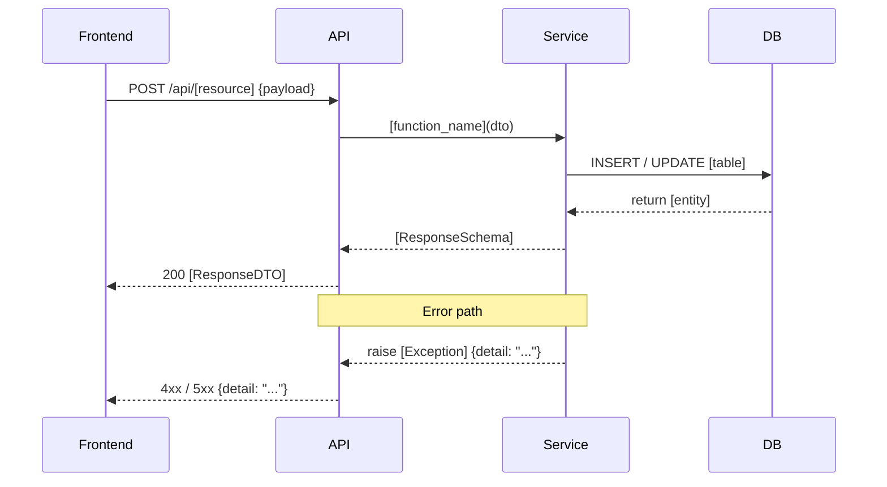

# Implementation Plan: [FEATURE]

**Branch**: `feat/[module]/NNN-feature` | **Date**: [DATE] | **Spec**: [link]
**Input**: Feature specification from `specs/[module]/NNN-feature/spec.md`

## Execution Flow (/speckit.plan scope)

```text
1. Load feature spec from Input path
   → If not found: ERROR "No feature spec at {path}"
2. Fill Technical Context
3. Evaluate Constitution Check below
   → If violations exist: Document in Complexity Tracking
   → If no justification possible: ERROR "Simplify approach first"
4. Execute Phase 0 → research (if unknowns exist)
   → If NEEDS CLARIFICATION remain: ERROR "Resolve unknowns before proceeding"
5. Execute Phase 1 → contracts, data-model, system flow
6. Re-evaluate Constitution Check
   → If new violations: Refactor design, return to Phase 1
7. Describe task generation approach (DO NOT create tasks.md)
8. STOP — ready for /speckit.tasks
```

**IMPORTANT**: /speckit.plan stops at step 7. Task creation is done by /speckit.tasks.

## Summary

[Extract from spec: primary requirement + technical approach]

## Technical Context

**Language/Version**: Python 3.12+ / TypeScript 5+
**Primary Dependencies**: FastAPI / React + Vite
**Storage**: PostgreSQL + Redis
**Testing**: pytest + Playwright
**Target Platform**: Web (Browser + REST API)
**Performance Goals**: [e.g., API p95 < 500ms]
**Constraints**: [e.g., Config-driven, no hardcoded task logic]

## Constitution Check

- [ ] I. Spec-First: Spec is complete and reviewed
- [ ] II. Generalization-First: Does the design support multiple NLP task types?
- [ ] III. Data Fairness: Does this involve test sets? If so, leakage prevention is planned
- [ ] IV. Test-First: Test plan is listed
- [ ] V. Code Quality & Simplicity: Any signs of over-engineering? Type hints, linter, no debug output addressed?
- [ ] VI. English-First: Code, comments, and commit messages in English; Traditional Chinese allowed in `docs/`, `specs/`, `design/prototype/`, `design/wireframes/`, and `design/system/inventory.md`; `design/system/MASTER.md` must be English only
- [ ] VII. Design Consistency: UI uses MASTER.md tokens; prototype screens followed; shared components reused
- [ ] VIII. Performance Baseline: List-view endpoints paginated; no unbounded queries; API P95 ≤ 500ms target confirmed

## Project Structure

### Documentation (this feature)

```text
specs/[module]/NNN-feature/
├── spec.md
├── plan.md
├── tasks.md
├── checklists/
│   ├── ac-checklist.md
│   └── security-checklist.md
├── research.md        (optional)
├── data-model.md      (optional)
└── contracts/         (optional)
```

### Source Code

```text
frontend/
├── src/
│   ├── features/[module]/
│   │   ├── components/[feature]/
│   │   ├── pages/[feature]/
│   │   └── services/[feature].ts
│   └── shared/        (only when used by 2+ feature modules)

backend/
├── app/
│   ├── api/routes/[feature].py
│   ├── models/[feature].py
│   ├── schemas/[feature].py
│   └── services/[feature].py
└── tests/
    ├── unit/test_[feature].py
    └── integration/test_[feature].py
```

## System Flow & Data Flow *(include if feature involves API calls, async tasks, or multi-layer data processing)*

<!--
  Show how data moves through the system layers: Frontend → API → Service → DB.
  Include error paths and async flows (Celery tasks, WebSocket, etc.) where relevant.
  Renders natively on GitHub — no extra tooling needed.
-->


```mermaid
sequenceDiagram
    participant Frontend
    participant API
    participant Service
    participant DB

    Frontend->>API: POST /api/[resource] {payload}
    API->>Service: [function_name](dto)
    Service->>DB: INSERT / UPDATE [table]
    DB-->>Service: return [entity]
    Service-->>API: [ResponseSchema]
    API-->>Frontend: 200 [ResponseDTO]

    Note over Service,API: Error path
    Service-->>API: raise [Exception] {detail: "..."}
    API-->>Frontend: 4xx / 5xx {detail: "..."}
```

| Layer | Component | Responsibility |
|-------|-----------|---------------|
| Frontend | `features/[module]/pages/[feature]` | Form state, API call, display result |
| API | `api/routes/[feature].py` | Request validation, auth check, delegate to service |
| Service | `services/[feature].py` | Business logic, DB interaction |
| DB | `models/[feature].py` | Persistence |

---

## Complexity Tracking

> Only fill in when a Constitution principle is violated and justification is required

| Violation | Why Needed | Simpler Alternative Rejected Because |
|---|---|---|
| [e.g., adding a third-party package] | [current need] | [why existing tools are insufficient] |

## Progress Tracking

**Phase Status**:

- [ ] Phase 0: Research complete (unknowns resolved)
- [ ] Phase 1: Design complete (contracts, data-model, system flow)
- [ ] Phase 2: Task planning described
- [ ] Phase 3: Tasks generated (`/speckit.tasks`)
- [ ] Phase 4: Implementation complete (`/speckit.implement`)
- [ ] Phase 5: Validation passed (`/speckit.analyze` zero findings)

**Gate Status**:

- [ ] Initial Constitution Check: PASS
- [ ] Post-Design Constitution Check: PASS
- [ ] All NEEDS CLARIFICATION resolved
- [ ] Complexity deviations documented

## Changelog

| Version | Date | Change Summary |
|---------|------|----------------|
| 1.0.2 | 2026-05-21 | Add Execution Flow and Progress Tracking sections |
| 1.0.1 | 2026-05-21 | Align spec paths with module-based SDD directory structure |
| 1.0.0 | [YYYY-MM-DD] | Initial spec |
