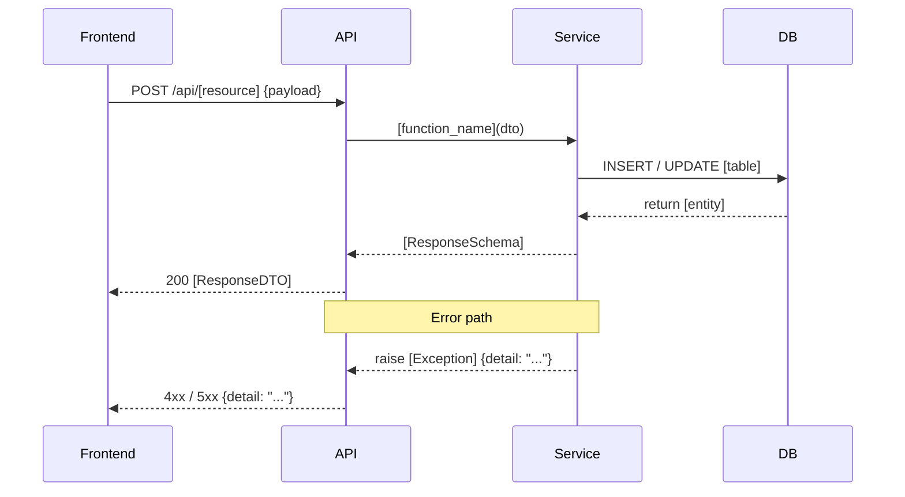

# 實作計畫：[功能名稱]

**規格**: [連結至 `specs/[module]/NNN-feature/spec.md`]
**輸入**: `specs/[module]/NNN-feature/spec.md`

## 執行流程（/speckit.plan 範圍）

```text
1. 從輸入路徑載入功能規格
   → 若未找到：ERROR "No feature spec at {path}"
2. 填寫技術脈絡
3. 評估下方憲章檢查
   → 若存在違反項目：記錄至複雜度追蹤
   → 若無正當理由：ERROR "Simplify approach first"
4. 執行 Phase 0 → 研究（若有未知事項）
   → 若仍有 NEEDS CLARIFICATION：ERROR "Resolve unknowns before proceeding"
5. 執行 Phase 1 → 契約、資料模型、系統流程
6. 重新評估憲章檢查
   → 若發現新違反：重構設計，返回 Phase 1
7. 描述任務產生方式（不得建立 tasks.md）
8. 停止 — 準備好進入 /speckit.tasks
```

**重要**：/speckit.plan 在第 7 步停止。任務建立由 /speckit.tasks 負責。

## 摘要

[從規格萃取：主要需求 + 技術方向]

## 技術脈絡

**語言 / 版本**: Python 3.12+ / TypeScript 5+
**主要相依套件**: FastAPI / React + Vite
**儲存**: PostgreSQL + Redis
**測試**: pytest + Vitest + Playwright + Storybook
**目標平台**: Web（瀏覽器 + REST API）
**效能目標**: [例：API p95 < 500ms]
**限制**: [例：Config-driven，不得硬編碼 task 邏輯]

## 憲章檢查

- [ ] I. Spec-First：規格已完成並審查
- [ ] II. Generalization-First：設計是否支援多種 NLP task type？
- [ ] III. Data Fairness：是否涉及 test set？若是，已規劃防止資料洩露
- [ ] IV. Test-First：測試計畫已列出
- [ ] V. Code Quality & Simplicity：是否有過度工程的跡象？型別提示、linter、無 debug 輸出已處理？
- [ ] VI. English-First：程式碼、注釋與 commit message 使用英文；`docs/`、`specs/`、`design/prototype/`、`design/wireframes/` 與 `design/system/inventory.md` 允許繁體中文；`design/system/MASTER.md` 必須純英文
- [ ] VII. Design Consistency：UI 使用 MASTER.md tokens；prototype 畫面已遵循；共用元件已重用
- [ ] VIII. Performance Baseline：列表端點已分頁；無無界查詢；API P95 ≤ 500ms 目標已確認

## 專案結構

### 文件（本功能）

```text
specs/[module]/NNN-feature/
├── spec.md
├── plan.md
├── tasks.md
├── checklists/
│   ├── ac-checklist.md
│   └── security-checklist.md
├── research.md        (optional)
├── data-model.md      (optional)
└── contracts/         (optional)
```

### 原始碼

<!--
  將 [module] 替換為功能模組名稱（例：task-management、annotation）
  將 [feature] 替換為功能名稱（例：batch-import、auto-label）。
  產生的 plan.md 不得保留任何佔位符括號。
-->

```text
frontend/
├── src/
│   ├── features/[module]/
│   │   ├── components/[feature]/
│   │   ├── pages/[feature]/
│   │   └── services/[feature].ts
│   └── shared/        (only when used by 2+ feature modules)

backend/
├── app/
│   ├── api/routes/[feature].py
│   ├── models/[feature].py
│   ├── schemas/[feature].py
│   └── services/[feature].py
└── tests/
    ├── unit/test_[feature].py
    └── integration/test_[feature].py
```

## 系統流程與資料流 *(功能涉及 API 呼叫、非同步任務或多層資料處理時必填)*

<!--
  描述資料如何在系統層間流動：Frontend → API → Service → DB。
  包含相關的錯誤路徑與非同步流程（Celery tasks、WebSocket 等）。
  在 GitHub 上可原生渲染，無需額外工具。
-->


```mermaid
sequenceDiagram
    participant Frontend
    participant API
    participant Service
    participant DB

    Frontend->>API: POST /api/[resource] {payload}
    API->>Service: [function_name](dto)
    Service->>DB: INSERT / UPDATE [table]
    DB-->>Service: return [entity]
    Service-->>API: [ResponseSchema]
    API-->>Frontend: 200 [ResponseDTO]

    Note over Service,API: Error path
    Service-->>API: raise [Exception] {detail: "..."}
    API-->>Frontend: 4xx / 5xx {detail: "..."}
```

| 層 | 元件 | 職責 |
|----|------|------|
| Frontend | `features/[module]/pages/[feature]` | 表單狀態、API 呼叫、結果顯示 |
| API | `api/routes/[feature].py` | 請求驗證、權限檢查、委派至 service |
| Service | `services/[feature].py` | 業務邏輯、DB 操作 |
| DB | `models/[feature].py` | 持久化 |

---

## Phase 0：研究

> 前置條件：技術脈絡已填寫。若無 NEEDS CLARIFICATION 項目，可跳過此階段。

1. **萃取未知事項** 從技術脈絡 — 每個 `NEEDS CLARIFICATION` → 一個研究任務
2. **派送研究任務** 給每個未知事項：

   ```text
   For each unknown:        Task "Research {unknown} for {feature context}"
   For each new dependency: Task "Find best practices for {dep} in label-suite stack"
   ```

3. **整合發現** 至 `research.md`：
   - 決策：[選擇了什麼]
   - 理由：[為何選擇]
   - 考慮過的替代方案：[評估了哪些其他選項]

**產出**：`research.md` — 所有 NEEDS CLARIFICATION 在 Phase 1 開始前已解決

---

## Phase 1：設計與契約

> 前置條件：research.md 已完成（或若無未知事項則跳過 Phase 0）

1. **萃取實體** 從 spec.md → `data-model.md`
   - 實體名稱、欄位、關係、驗證規則
   - 狀態轉換（若適用）

2. **後端 API 清單** 從功能需求列出所有需要的端點

   | Method | Path | 權限 | 說明 |
   |--------|------|------|------|
   | GET | `/api/v1/[module]/[resource]` | authenticated | 取得列表（分頁） |
   | POST | `/api/v1/[module]/[resource]` | project_leader | 建立 |
   | GET | `/api/v1/[module]/[resource]/{id}` | authenticated | 取得單筆 |
   | PATCH | `/api/v1/[module]/[resource]/{id}` | project_leader | 更新 |
   | DELETE | `/api/v1/[module]/[resource]/{id}` | project_leader | 刪除 |

   接著產生完整 API 契約 → `contracts/`（請求 / 回應 schema，OpenAPI 相容）

3. **前端切版分析** 從 wireframe / spec 分析畫面如何切成元件

   | 區塊 | 元件名稱 | 職責 | 資料來源 | Stories 狀態 |
   |------|---------|------|---------|------------|
   | 頁面容器 | `[Feature]Page` | 路由入口、資料取得 | TanStack Query | — (page 層不寫 story) |
   | 主要內容 | `[Feature]List` | 列表渲染 | props | Default, Empty, Loading |
   | ... | | | | |

   > **Stories 規則**：Page 層不寫 story（太重，依賴路由）；其他所有元件都要寫。每個元件至少涵蓋 Default + 邊界狀態（Empty / Loading / Error / Disabled）。

   **元件層次**：
   ```
   [Feature]Page
   ├── [Feature]Header
   │   └── [Feature]Actions (按鈕群組)
   ├── [Feature]List
   │   └── [Feature]Item (×N)
   └── [Feature]Pagination
   ```

   - 標記哪些元件進 `shared/`（需被 2+ 個 feature module 使用才符合資格）
   - 標記哪些元件需要 Zustand（全域 UI 狀態）vs. TanStack Query（server state）vs. `useState`（local）

4. **更新系統流程圖** 在本計畫中
   - 追蹤資料路徑：Frontend → API → Service → DB
   - 加入相關的錯誤路徑與非同步流程（Celery、WebSocket）

5. **萃取測試情境** 從使用者故事
   - 每個故事 → 整合測試情境大綱

**產出**：`data-model.md`、`contracts/`、API 清單、切版元件層次、系統流程圖已更新、測試情境已概述

---

## Phase 2：任務規劃方式

*本節描述 `/speckit.tasks` 將執行的內容 — 不得在 `/speckit.plan` 期間執行*

**任務產生策略**：

- 以 `.specify/templates/tasks-template.md` 為基礎
- 每個使用者故事（來自 spec.md）→ 一個 Phase
- **後端**：每個 API 清單項目 → 單元測試任務 [P] + 實作任務（route → service → schema）
- **後端**：每個實體 → 模型建立任務 [P]
- **前端**：每個切版元件 → 元件測試任務 [P] + 實作任務 + Storybook story 任務（`.stories.tsx`）
- **前端**：每個頁面 → Playwright E2E 測試任務 [P] + page 組裝任務（page 層不寫 story）
- 共用元件（shared/）→ 獨立任務，先於依賴它的 feature 任務

**排序策略**：

- TDD 順序：測試在實作前（必須先失敗）
- 相依順序：model → schema → service → endpoint → shared component → feature component → page
- 標記 [P] 用於平行執行（僅限獨立檔案，前後端可同時進行）

**預估產出**：`tasks.md` 中 [N] 個有序任務

**重要**：此階段由 `/speckit.tasks` 執行，不由 `/speckit.plan` 執行

---

## 複雜度追蹤

> 僅在違反憲章原則且需要正當理由時填寫

| 違反項目 | 需要原因 | 拒絕更簡單替代方案的理由 |
|---------|---------|----------------------|
| [例：新增第三方套件] | [當前需求] | [現有工具不足的原因] |

## 進度追蹤

**階段狀態**：

- [ ] Phase 0：研究完成（未知事項已解決）
- [ ] Phase 1：設計完成（契約、資料模型、系統流程）
- [ ] Phase 2：任務規劃方式已描述
- [ ] Phase 3：任務已產生（`/speckit.tasks`）
- [ ] Phase 4：實作完成（`/speckit.implement`）
- [ ] Phase 5：驗證通過（`/speckit.analyze` 零發現）

**把關狀態**：

- [ ] 初始憲章檢查：PASS
- [ ] 設計後憲章檢查：PASS
- [ ] 所有 NEEDS CLARIFICATION 已解決
- [ ] 複雜度偏差已記錄

## Changelog

| 版本 | 日期 | 變更摘要 |
|------|------|---------|
| 1.1.0 | 2026-05-22 | 對齊 spec 實例格式：改為 --- frontmatter + 中文 H1，全面中文化章節標題與說明文字 |
| 1.0.2 | 2026-05-21 | Add Execution Flow and Progress Tracking sections |
| 1.0.1 | 2026-05-21 | Align spec paths with module-based SDD directory structure |
| 1.0.0 | [YYYY-MM-DD] | Initial spec |
