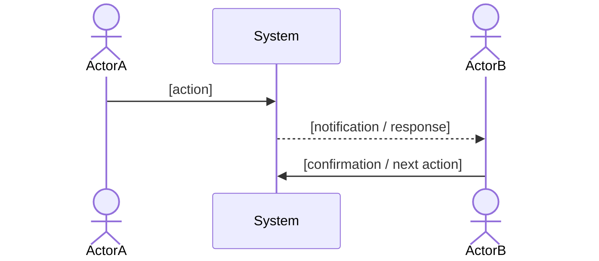
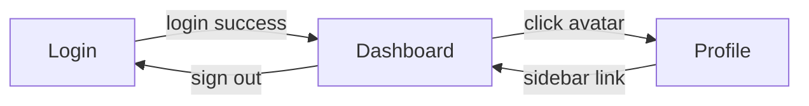

# Feature Specification: [FEATURE NAME]

**Feature Branch**: `[###-feature-name]`
**Created**: [DATE]
**Version**: 1.0.0
**Status**: Draft
**Input**: User description: "$ARGUMENTS"

## Process Flow *(include if feature involves a multi-step business process or cross-role workflow)*

<!--
  Describe the end-to-end business process BEFORE breaking it into user stories.
  Focus on WHO does WHAT and in what ORDER — not on technical implementation.
  Use a Mermaid sequenceDiagram and a step table. Renders natively on GitHub — no extra tooling needed.
-->

| Step | Role | Action | System Response |
|------|------|--------|----------------|
| 1 | [Role] | [What they do] | [What the system does] |

---

## User Scenarios & Testing *(required)*

<!--
  User Stories should be prioritized by importance. P1 is the highest priority.
  Each Story must be independently implementable and testable — completing P1 alone should deliver a viable MVP.
-->

### User Story 1 - [Brief Title] (Priority: P1)

[Describe this user journey in plain language]

**Why this priority**: [Explain the value and reason for this priority level]

**Independent Test**: [Describe how this can be tested independently, e.g., "Can be fully validated by [specific action] and delivers [specific value]"]

**Acceptance Scenarios**:

1. **Given** [initial state], **When** [action], **Then** [expected outcome]
2. **Given** [initial state], **When** [action], **Then** [expected outcome]

---

### User Story 2 - [Brief Title] (Priority: P2)

[Describe this user journey in plain language]

**Why this priority**: [Explain the value and reason for this priority level]

**Independent Test**: [Describe how this can be tested independently]

**Acceptance Scenarios**:

1. **Given** [initial state], **When** [action], **Then** [expected outcome]

---

### Edge Cases

- What happens when [boundary condition]?
- How does the system respond to [error scenario]?

## Requirements *(required)*

### Functional Requirements

<!--
  For each FR, state WHAT the system must do and WHO can do it.
  When a capability is role-restricted, the FR MUST explicitly name the allowed roles.
  Example: "FR-XXX: Only [role] MUST be able to [action] on [page]"
  RoleGuard rules: list every allowed role explicitly in each FR and guard.
  Do NOT rely on implicit inheritance or hierarchy tables; state roles explicitly.
-->

- **FR-001**: The system MUST [specific capability]
- **FR-002**: The system MUST [specific capability]
- **FR-003**: Users MUST be able to [key interaction]
- **FR-004**: Only [role_a] and [role_b] MUST be able to access [page/action] — enforced via RoleGuard

### User Flow & Navigation *(required)*

<!--
  Required for ALL features — even if no new pages are added.
  Describe how users enter this feature from existing routes and how they leave.
  1. Map every screen and its navigation triggers to prevent orphan pages.
  2. If the feature adds no new pages, document the existing page(s) involved,
     the entry triggers (e.g. sidebar link, button, redirect), and exit paths.
  3. Include a Mermaid flowchart for flows with 3+ screens or branching paths.
  Renders natively on GitHub — no extra tooling needed.
-->

| From | Trigger | To |
|------|---------|-----|
| [Page A] | [e.g. click avatar] | [Page B] |
| [Page B] | [e.g. sidebar link] | [Page A] |

**Entry points**: [Which existing pages link INTO the new pages?]
**Exit points**: [Which pages can users navigate to FROM the new pages?]

### Key Entities *(include if feature involves data)*

- **[Entity 1]**: [What it represents, key attributes]
- **[Entity 2]**: [What it represents, relationships to other entities]

## Spec Dependencies *(required — fill in at specify time; use "—" rows if none)*

<!--
  Upstream: specs that must be implemented before or alongside this feature.
  Downstream: specs that depend on THIS spec — notify them whenever this spec is versioned up.
  When updating this spec (version bump), open every downstream spec and assess impact.
-->

### Upstream (this spec depends on)

| Spec # | Feature | What this spec needs from it |
|--------|---------|------------------------------|
| — | — | — |

### Downstream (specs that depend on this)

| Spec # | Feature | What they rely on from this spec |
|--------|---------|----------------------------------|
| — | — | — |

---

## Success Criteria *(required)*

- **SC-001**: [Measurable metric, e.g., "Users can complete labeling task setup in under 2 minutes"]
- **SC-002**: [Measurable metric]
- **SC-003**: [User satisfaction metric]

---

## Changelog

| Version | Date | Change Summary |
|---------|------|----------------|
| 1.0.0 | [DATE] | Initial spec |
