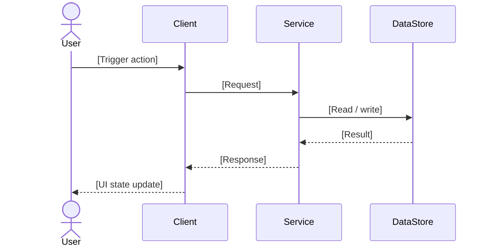
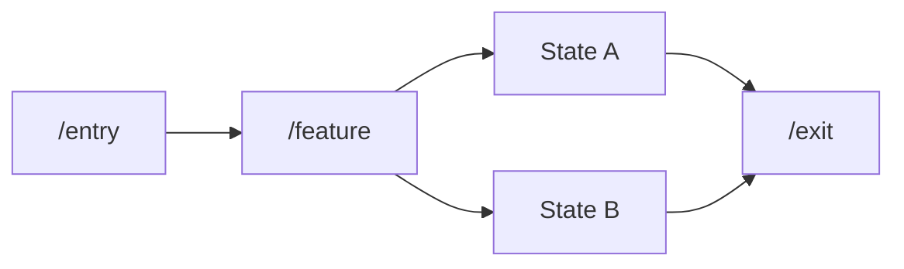

# Feature Specification: [FEATURE NAME]

**Feature Branch**: `[###-feature-name]`  
**Created**: [YYYY-MM-DD]  
**Version**: 1.0.0  
**Status**: Draft  
**Requirement Source**: [Prototype / PRD / Existing Spec / Stakeholder Request]

## Spec Constants

<!--
  Define reusable constants once, then reference them across FR/SC sections.
  Typical examples: breakpoints, supported viewport sets, SLA thresholds, limits.
-->

- `[CONSTANT_NAME] = [value]`
- `[CONSTANT_NAME] = [value]`

## Process Flow *(required for multi-step, role-based, or cross-system behavior)*

<!--
  Describe the end-to-end business process BEFORE splitting into user stories.
  Focus on WHO does WHAT and in what ORDER (business behavior, not implementation detail).
-->

| Step | Role | Action | System Response |
|------|------|--------|----------------|
| 1 | [Role] | [Action] | [Response] |
| 2 | [Role] | [Action] | [Response] |

---

## User Scenarios & Testing *(required)*

<!--
  User stories must be independently testable.
  Prioritize by business value: P1 > P2 > P3.
-->

### User Story 1 — [Title] (Priority: P1)

[Describe this user journey in plain language.]

**Why this priority**: [Why this must be delivered at this priority.]  
**Independent Test**: [How to validate this story in isolation.]

**Acceptance Scenarios**:

1. **Given** [initial context], **When** [action], **Then** [expected outcome]
2. **Given** [initial context], **When** [action], **Then** [expected outcome]

**Interface Definition (must match prototype where applicable)**:

- Section A: `[Section title]`
  - Subtitle: `[Subtitle]`
  - Required elements:
    - `[Element / metric / field / CTA]`
    - `[Element / metric / field / CTA]`
- Section B: `[Section title]`
  - Required elements:
    - `[Element / metric / field / CTA]`

**Behavior Rules**:

- [Visibility / state / transition rule]
- [i18n / a11y / role-based rendering rule]
- [Action trigger and expected result]

---

### User Story 2 — [Title] (Priority: P2)

[Describe this user journey in plain language.]

**Why this priority**: [Reason.]  
**Independent Test**: [Isolated validation approach.]

**Acceptance Scenarios**:

1. **Given** [initial context], **When** [action], **Then** [expected outcome]

**Interface Definition (if applicable)**:

- Section A: `[Section title]`
  - Required elements:
    - `[Element / field / CTA]`

**Behavior Rules**:

- [Rule]

---

### Edge Cases

- What happens when [invalid role / missing data / malformed state]?
- What happens when [conflicting conditions]?
- What happens when [i18n key missing / non-critical dependency unavailable]?
- What happens at [responsive boundary / threshold limit]?

## Requirements *(required)*

### Functional Requirements

<!--
  Use stable requirement IDs: FR-001, FR-001A, FR-001B...
  Include role constraints explicitly where applicable.
-->

- **FR-001**: The system MUST [capability].
- **FR-001A**: The system MUST [sub-capability refinement].
- **FR-002**: The system MUST [capability].
- **FR-003**: Only [explicit roles] MUST be able to [action / page].

### User Flow & Navigation *(required)*

| From | Trigger | To |
|------|---------|-----|
| [Route / State] | [User/system trigger] | [Route / State] |
| [Route / State] | [User/system trigger] | [Route / State] |

**Entry points**: [How users enter this feature.]  
**Exit points**: [Where users can leave this feature.]

### Key Entities *(required when feature includes data or state modeling)*

- **[EntityName]**: [Definition, key attributes, constraints.]
- **[EntityName]**: [Definition, relationship to other entities.]

---

## Spec Dependencies *(required — use “—” rows if none)*

### Upstream (this spec depends on)

| Spec # | Feature | What this spec needs from it |
|--------|---------|------------------------------|
| — | — | — |

### Downstream (specs that depend on this)

| Spec # | Feature | What they rely on from this spec |
|--------|---------|----------------------------------|
| — | — | — |

---

## Success Criteria *(required)*

<!--
  Success criteria should be observable and testable.
  Use SC IDs and reference constants when relevant.
-->

- **SC-001**: [Measurable behavioral outcome.]
- **SC-002**: [Measurable rendering / response / quality outcome.]
- **SC-003**: [Cross-role / cross-state correctness outcome.]

---

## Changelog

| Version | Date | Change Summary |
|---------|------|----------------|
| 1.0.0 | [YYYY-MM-DD] | Initial spec |
