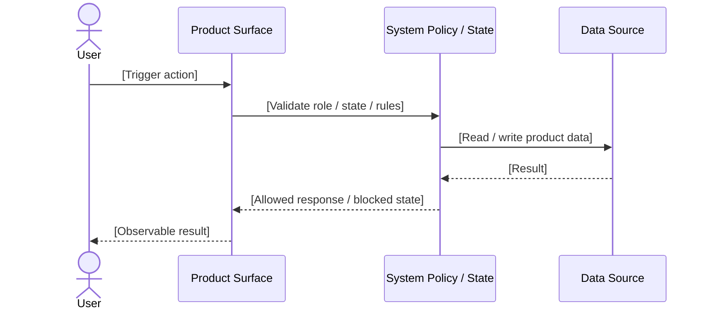
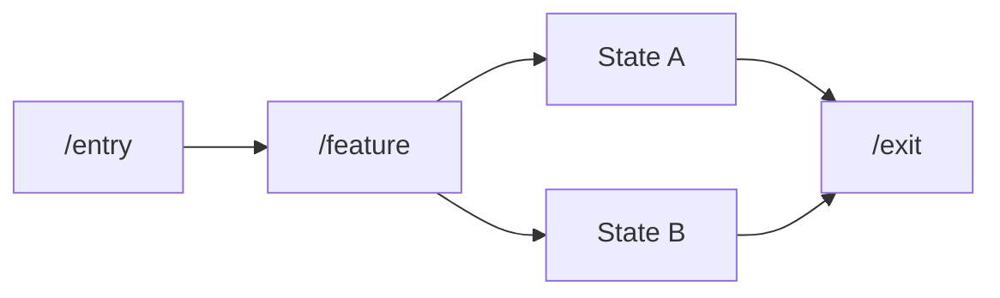

# Feature Specification: [FEATURE NAME]

**Feature Branch**: `feat/[module]/NNN-feature`
**Created**: [YYYY-MM-DD]
**Version**: 1.1.0
**Status**: Draft
**Requirement Source**: [Prototype / PRD / Existing Spec / Stakeholder Request]

## Input & Generation Rules

<!--
  Define how this spec was generated and where its scope boundaries are.
  Use pending clarification markers for unclear requirements; do not guess.
  Remove any optional content that does not apply instead of leaving "N/A".
-->

**Input Description**: [User / stakeholder / prototype input summarized in one sentence.]

**Generation Rules**:

1. Confirm this spec scope matches the Requirement Source before writing requirements.
2. If role permissions, navigation, data source, error behavior, i18n, a11y, responsive boundaries, performance targets, or downstream impact are unclear, mark the concrete question with a pending clarification marker.
3. Describe user-observable behavior, business rules, and acceptance criteria; avoid framework, API, database, or file-structure details unless they are part of the product contract.
4. If this spec adds or changes task type behavior, requirements MUST be config-driven through registry/schema/frozen task config; adding a new task type MUST NOT require modifying core code.
5. Annotator-facing API responses and UI MUST NOT expose test-set answers, ground truth, scoring keys, hidden labels, answer file paths, or equivalent privileged data.
6. If the spec diverges from prototype, IA, or upstream specs, document the difference, update Spec Dependencies, and add a Changelog row.

**Clarifications**:

- [Clarified scope boundary / non-goal.]
- [Clarified upstream dependency or prototype behavior.]
- [Clarified security, data, role, or task-config constraint.]

## Spec Constants

<!--
  Define reusable constants once, then reference them across FR/SC sections.
  Typical examples: breakpoints, supported viewport sets, SLA thresholds, limits.
-->

- `[CONSTANT_NAME] = [value]`
- `[CONSTANT_NAME] = [value]`

## Process Flow *(required for multi-step, role-based, or cross-system behavior)*

<!--
  Describe the end-to-end business process BEFORE splitting into user stories.
  Focus on WHO does WHAT and in what ORDER (business behavior, not implementation detail).
-->

```mermaid
sequenceDiagram
    actor User
    participant ProductSurface as Product Surface
    participant SystemPolicy as System Policy / State
    participant DataSource as Data Source

    User->>ProductSurface: [Trigger action]
    ProductSurface->>SystemPolicy: [Validate role / state / rules]
    SystemPolicy->>DataSource: [Read / write product data]
    DataSource-->>SystemPolicy: [Result]
    SystemPolicy-->>ProductSurface: [Allowed response / blocked state]
    ProductSurface-->>User: [Observable result]
```

| Step | Role | Action | System Response |
|------|------|--------|----------------|
| 1 | [Role] | [Action] | [Response] |
| 2 | [Role] | [Action] | [Response] |

---

## User Scenarios & Testing *(required)*

<!--
  User stories must be independently testable.
  Prioritize by business value: P1 > P2 > P3.
-->

### User Story 1 — [Title] (Priority: P1)

[Describe this user journey in plain language.]

**Why this priority**: [Why this must be delivered at this priority.]
**Independent Test**: [How to validate this story in isolation.]

**Acceptance Scenarios**:

1. **Given** [initial context], **When** [action], **Then** [expected outcome]
2. **Given** [initial context], **When** [action], **Then** [expected outcome]

**Interface Definition (must match prototype where applicable)**:

- Section A: `[Section title]`
  - Subtitle: `[Subtitle]`
  - Required elements:
    - `[Element / metric / field / CTA]`
    - `[Element / metric / field / CTA]`
- Section B: `[Section title]`
  - Required elements:
    - `[Element / metric / field / CTA]`

**Behavior Rules**:

- [Visibility / state / transition rule]
- [i18n / a11y / role-based rendering rule]
- [Action trigger and expected result]

---

### User Story 2 — [Title] (Priority: P2)

[Describe this user journey in plain language.]

**Why this priority**: [Reason.]
**Independent Test**: [Isolated validation approach.]

**Acceptance Scenarios**:

1. **Given** [initial context], **When** [action], **Then** [expected outcome]

**Interface Definition (if applicable)**:

- Section A: `[Section title]`
  - Required elements:
    - `[Element / field / CTA]`

**Behavior Rules**:

- [Rule]

---

### Edge Cases

- What happens when [invalid role / missing data / malformed state]?
- What happens when [conflicting conditions]?
- What happens when [i18n key missing / non-critical dependency unavailable]?
- What happens at [responsive boundary / threshold limit]?

## Requirements *(required)*

### Functional Requirements

<!--
  Use stable requirement IDs: FR-001, FR-001A, FR-001B...
  Include role constraints explicitly where applicable.
-->

- **FR-001**: The system MUST [capability].
- **FR-001A**: The system MUST [sub-capability refinement].
- **FR-002**: The system MUST [capability].
- **FR-003**: Only [explicit roles] MUST be able to [action / page].

### User Flow & Navigation *(required)*

```mermaid
flowchart LR
    Entry["/entry"] --> Feature["/feature"]
    Feature --> StateA["State A"]
    Feature --> StateB["State B"]
    StateA --> Exit["/exit"]
    StateB --> Exit
```

| From | Trigger | To |
|------|---------|-----|
| [Route / State] | [User/system trigger] | [Route / State] |
| [Route / State] | [User/system trigger] | [Route / State] |

**Entry points**: [How users enter this feature.]
**Exit points**: [Where users can leave this feature.]

### Key Entities *(required when feature includes data or state modeling)*

- **[EntityName]**: [Definition, key attributes, constraints.]
- **[EntityName]**: [Definition, relationship to other entities.]

---

## Spec Dependencies *(required — use “—” rows if none)*

### Upstream (this spec depends on)

| Spec # | Feature | What this spec needs from it |
|--------|---------|------------------------------|
| — | — | — |

### Downstream (specs that depend on this)

| Spec # | Feature | What they rely on from this spec |
|--------|---------|----------------------------------|
| — | — | — |

---

## Success Criteria *(required)*

<!--
  Success criteria should be observable and testable.
  Use SC IDs and reference constants when relevant.
-->

- **SC-001**: [Measurable behavioral outcome.]
- **SC-002**: [Measurable rendering / response / quality outcome.]
- **SC-003**: [Cross-role / cross-state correctness outcome.]

---

## Review & Acceptance Checklist

### Content Quality

- [ ] Spec focuses on user-observable behavior, business rules, and acceptance criteria.
- [ ] All required sections are completed; optional non-applicable sections are removed.
- [ ] No pending clarification markers remain.
- [ ] Requirements, acceptance scenarios, and success criteria are testable and unambiguous.
- [ ] Success criteria are measurable.
- [ ] Scope is clearly bounded.

### Label Suite Compliance

- [ ] Feature branch format follows `feat/[module]/NNN-feature`.
- [ ] No cross-feature import requirement is introduced; shared behavior is tracked through shared contracts or Spec Dependencies.
- [ ] Task behavior is config-driven where applicable; no hardcoded task type logic is required.
- [ ] Annotator-facing API / UI does not expose test-set answers, ground truth, or equivalent privileged data.
- [ ] Prototype / IA / upstream spec source of truth is listed and any divergence is documented.
- [ ] Upstream and downstream Spec Dependencies are complete.
- [ ] Relevant performance baseline, pagination, or responsive constraints are captured.

### Execution Status

- [ ] Input description parsed.
- [ ] Actors, interactions, data states, and constraints extracted.
- [ ] Ambiguities marked and resolved.
- [ ] User scenarios defined.
- [ ] Functional requirements defined.
- [ ] Key entities or state models defined.
- [ ] Review checklist passed.

---

## Changelog

| Version | Date | Change Summary |
|---------|------|----------------|
| 1.1.0 | 2026-05-21 | 新增輸入與產生規則、審查清單與執行狀態；補強 config-driven 與 ground-truth 安全檢查 |
| 1.0.1 | 2026-05-21 | 對齊模組化 SDD 目錄結構的 feature branch 格式 |
| 1.0.0 | [YYYY-MM-DD] | Initial spec |
