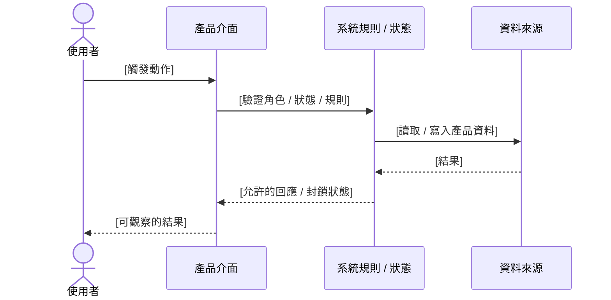
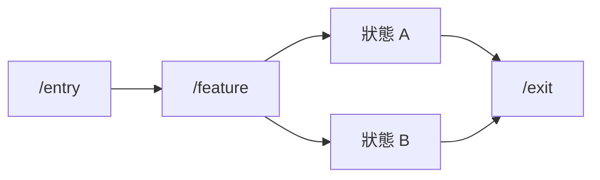

<!--
  生成規則 — 僅供 /speckit.specify 產生規格時遵循，不得輸出到 spec 實例。

  1. 確認本規格範圍與需求來源一致後再撰寫需求。
  2. 若角色權限、導頁、資料來源、錯誤行為、i18n、a11y、響應式邊界、效能目標或下游影響不明確，需以待釐清標記記錄具體問題。
  3. 描述使用者可觀察行為、業務規則與驗收條件，不描述框架、API、資料庫或檔案結構細節（除非屬於產品契約的一部分）。
  4. 若本規格新增或改動 task type 行為，需求必須透過 registry / schema / frozen task config 以 config-driven 方式實現；新增 task type 不得修改核心程式碼。
  5. 標注者端（Annotator）的 API 回應與 UI 絕對不得暴露 test-set 答案、ground truth、評分鍵、隱藏標籤、答案檔案路徑或等效的特殊權限資料。
  6. 若本規格與原型、IA 或上游規格不一致，需記錄差異、更新規格相依性，並新增 Changelog 項目。

  對不清楚的需求使用待釐清標記，不得自行假設。
  不適用的可選段落請直接刪除，不留 "N/A"。
-->

# 功能規格：[功能名稱]

## 功能目標

[一到三句話。陳述：誰受益、交付什麼結果、為何現在值得建構。這不是功能摘要，而是價值主張。

範例：「讓專案負責人無需工程支援即可設定多標籤標注任務，將任務設置時間從數天縮短至數分鐘。」]

**需求來源**: [原型 / PRD / 現有規格 / 利害關係人需求]

## 已釐清事項

<!-- 記錄 clarify 過程的結論；與「範圍外」章節的分工：已釐清事項記錄釐清結論，範圍外是對外承諾的邊界清單。 -->

- [已釐清的範圍邊界 / 非目標。]
- [已釐清的上游相依性或原型行為。]
- [已釐清的安全性、資料、角色或 task config 限制。]

## 規格常數

<!--
  共用常數（出現在 ≥2 份 spec 者）一律引用 specs/_shared/constants.md，不得在本章節重複定義。
  本章節只定義該 spec 特有的常數，並在 FR / SC 章節中引用。
-->

**引用共用常數**：見 [共用規格常數](../../_shared/constants.md) — 本規格使用：`[常數名]`、`[常數名]`

**本規格特有常數**：

- `[常數名稱] = [值]`

## 流程圖 *(多步驟、角色分工或跨系統行為時必填)*

<!--
  在拆分使用者故事之前，先描述端對端的業務流程。
  聚焦於「誰做了什麼」以及「以何種順序」（業務行為，非實作細節）。
  participant 只得使用業務層概念（角色、產品介面、系統規則、資料來源）；
  不得出現 API、Service、Repository、Database、框架或具體端點——
  該層級的 System Flow 屬於 plan.md「系統流程與資料流」章節。
-->

```mermaid
sequenceDiagram
    actor 使用者
    participant 產品介面 as 產品介面
    participant 系統規則 as 系統規則 / 狀態
    participant 資料來源 as 資料來源

    使用者->>產品介面: [觸發動作]
    產品介面->>系統規則: [驗證角色 / 狀態 / 規則]
    系統規則->>資料來源: [讀取 / 寫入產品資料]
    資料來源-->>系統規則: [結果]
    系統規則-->>產品介面: [允許的回應 / 封鎖狀態]
    產品介面-->>使用者: [可觀察的結果]
```

| 步驟 | 角色 | 動作 | 系統回應 |
|------|------|------|---------|
| 1 | [角色] | [動作] | [回應] |
| 2 | [角色] | [動作] | [回應] |

---

## 使用者情境與測試 *(必填)*

<!--
  使用者故事必須可獨立測試。
  依商業價值排序：P1 > P2 > P3。
  驗收情境 ID 格式：AC-<故事編號>.<序號>（例：AC-1.2 = 故事 1 第 2 條）。
  ID 一經發布即穩定：後續插入新情境時沿用字尾字母（例：AC-1.2A），不得重編既有 ID
  （比照 FR-004A 慣例），確保 changelog、checklist 與 traceability matrix 的引用不失效。
  故事編號同樣一經發布即穩定：編號是身分不是位置——新增故事一律取下一個未用編號，
  不得重編既有故事；顯示順序可依 P1 > P2 > P3 調整，AC ID 中的故事編號部分跟隨
  故事本身的編號，不隨顯示位置改變。
-->

### 使用者故事 1 — [標題]（優先級：P1）

[以白話文描述此使用者旅程。]

**此優先級原因**：[說明此功能必須以此優先級交付的原因。]
**獨立測試方式**：[說明如何獨立驗證此故事。]

**驗收情境**：

1. **AC-1.1**：**Given** [初始條件]，**When** [動作]，**Then** [預期結果]
2. **AC-1.2**：**Given** [初始條件]，**When** [動作]，**Then** [預期結果]

---

### 使用者故事 2 — [標題]（優先級：P2）

[以白話文描述此使用者旅程。]

**此優先級原因**：[原因。]
**獨立測試方式**：[獨立驗證方式。]

**驗收情境**：

1. **AC-2.1**：**Given** [初始條件]，**When** [動作]，**Then** [預期結果]

---

### 邊界情況

- [不合法角色 / 缺失資料 / 狀態異常] 時會發生什麼？
- [衝突條件] 時會發生什麼？
- [i18n key 缺失 / 非關鍵相依性不可用] 時會發生什麼？
- [響應式邊界 / 閾值限制] 時會發生什麼？

## 需求規格 *(必填)*

### 功能需求

<!--
  使用穩定的需求 ID：FR-001、FR-001A、FR-001B...
  需明確指出角色限制（若適用）。
-->

- **FR-001**：系統必須 [能力]。
- **FR-001A**：系統必須 [子能力細化]。
- **FR-002**：系統必須 [能力]。
- **FR-003**：僅 [明確角色] 才可 [動作 / 頁面]。

### 使用者流程與導頁

```mermaid
flowchart LR
    Entry["/entry"] --> Feature["/feature"]
    Feature --> StateA["狀態 A"]
    Feature --> StateB["狀態 B"]
    StateA --> Exit["/exit"]
    StateB --> Exit
```

| From | Trigger | To |
|------|---------|-----|
| [路由 / 狀態] | [使用者 / 系統觸發] | [路由 / 狀態] |
| [路由 / 狀態] | [使用者 / 系統觸發] | [路由 / 狀態] |

**Entry points**：[使用者如何進入此功能。]
**Exit points**：[使用者可從何處離開此功能。]

### 畫面狀態規格 *(涉及 UI 的功能必填)*

<!--
  每個畫面至少列舉以下六種狀態；不適用的狀態標記「不適用」並附一句原因，不得直接省略。
  本表僅描述使用者可觀察行為；具體 API 對應與重試策略（退避間隔等）屬 plan.md 的
  「畫面狀態轉換」與「畫面 × API 對應」表，不在此填寫。
  失敗 / 錯誤狀態必須寫出使用者可見的錯誤呈現與恢復選項（例：重試按鈕、返回導頁）。
-->

#### [畫面名稱]

| 狀態 | 呈現規格 | 進入 / 離開條件 |
|------|---------|----------------|
| 空白狀態 | [無任何資料時顯示什麼，例：引導卡片 + 建立按鈕] | [進入：首次使用且無資料；離開：建立第一筆資料] |
| 載入中 | [例：Skeleton 骨架屏] | [進入：頁面初始化；離開：資料載入完成或失敗] |
| 正常 | [有資料、一切正常的主要畫面] | [進入：載入成功且有資料] |
| 成功 | [操作完成的反饋，例：確認訊息] | [進入：使用者操作成功；離開：自動消失或使用者關閉] |
| 失敗 / 錯誤 | [錯誤訊息呈現 + 使用者可見的恢復選項] | [進入：操作失敗或載入失敗；離開：重試成功或返回] |
| 邊界狀態 | [產品特有狀態，例：凍結、待審核、逾期] | [進入 / 離開條件] |

### 關鍵實體 *(功能涉及資料或狀態建模時必填)*

- **[實體名稱]**：[定義、關鍵屬性、限制。]
- **[實體名稱]**：[定義、與其他實體的關係。]

---

## 規格相依性 *(本功能依賴其他規格，或被其他規格依賴時填寫)*

### 上游（本規格依賴的規格）

| 規格編號 | 功能 | 本規格需要的內容 |
|---------|------|----------------|
| — | — | — |

### 下游（依賴本規格的規格）

| 規格編號 | 功能 | 依賴本規格的內容 |
|---------|------|----------------|
| — | — | — |

---

## 成功標準 *(必填)*

<!--
  成功標準必須可觀察且可測試。
  使用 SC ID，並在適當時引用常數。
-->

- **SC-001**：[可量化的行為結果。]
- **SC-002**：[可量化的渲染 / 回應 / 品質結果。]
- **SC-003**：[跨角色 / 跨狀態的正確性結果。]

---

## 範圍外（Out of Scope）*(必填)*

<!--
  明確列出本版本不做什麼——這不是偷懶，而是主動管理期望：
  沒有 Out of Scope，工程師會自行腦補邊界、審查時會出現「我以為會有」的分歧。
  與「已釐清事項」的分工：已釐清事項記錄釐清過程的結論，本章節是對外承諾的邊界清單。
-->

- [不做的事 1]
- [不做的事 2]

### 分期邊界 *(多期交付時必填)*

| 階段 | 包含（In Scope） | 不包含（Out of Scope） |
|------|----------------|----------------------|
| MVP | [功能 A、功能 B] | [進階功能 X] |
| Phase 2 | [進階功能 X] | [功能 Y] |

---

<!--
  作者自檢清單 — /speckit.specify 產生後逐項自檢，不得輸出到 spec 實例；正式審查由 /spec-review 執行。

  內容品質：

  - [ ] 功能目標已明確陳述（受益者、交付結果、現階段優先原因），且與 SC-* 不重複（SC 描述行為，Goal 描述價值）。
  - [ ] 規格聚焦使用者可觀察行為與業務需求，未引入框架、API 或資料庫實作細節。
  - [ ] 所有必填章節已完成；不適用的可選章節已移除。
  - [ ] 無未解決的待釐清標記殘留。
  - [ ] 需求、驗收情境與成功標準皆可測試且明確。
  - [ ] 成功標準可量化。
  - [ ] 範圍已明確界定。
  - [ ] 涉及 UI 時，每個畫面已列舉六種狀態（空白 / 載入中 / 正常 / 成功 / 失敗 / 邊界），不適用者已標記原因。
  - [ ] 範圍外章節已填寫；多期交付時已提供分期邊界表。
  - [ ] 流程圖僅含業務層 participant，無 API / DB 層。

  Label Suite 合規性：

  - [ ] 功能分支格式符合 `feat/[module]/NNN-feature`。
  - [ ] 本規格不新增跨 feature import 或架構耦合需求；共用行為透過共用契約或規格相依性追蹤。
  - [ ] task 行為以 config-driven 方式實現（若適用）；不需要修改硬編碼的 task type 邏輯。
  - [ ] 標注者端 API / UI 不暴露 test-set 答案、ground truth 或等效的特殊權限資料。
  - [ ] 原型 / IA / 上游規格的 source of truth 已列出，且任何差異皆已記錄。
  - [ ] 上游與下游規格相依性已完整填寫。
  - [ ] 相關效能基準、分頁或響應式限制已記錄。
  - [ ] 共用常數未在本 spec 重複定義，已引用 specs/_shared/constants.md。
-->

---

## Changelog

| 版本 | 日期 | 變更摘要 |
|------|------|---------|
| 1.6.1 | 2026-08-25 | 移除已退役 /speckit.analyze 引用（ADR-033、issue #356）：共用常數重複定義與正式審查改由 spec 審查與 OpenSpec change 驗證把關 |
| 1.6.0 | 2026-07-21 | What/How 分離：生成規則與審查清單轉為 HTML 註解（不落地實例）、刪除執行狀態章節（STATUS.md 為唯一來源）、規格常數改為引用 specs/_shared/constants.md、流程圖禁止系統層 participant、輸入描述併入需求來源 |
| 1.5.1 | 2026-07-21 | 補充故事編號穩定規則：編號是身分不是位置，新增故事取下一個未用編號、不重編既有故事，AC ID 不隨顯示順序改變 |
| 1.5.0 | 2026-07-21 | 驗收情境條目新增穩定 ID（`AC-<故事編號>.<序號>`），與 FR-*/SC-* 一致；插入情境時沿用字尾字母（AC-1.2A）避免重編號 |
| 1.4.0 | 2026-07-21 | 新增「畫面狀態規格」章節（六狀態 × 呈現 / 進出條件，UI 功能必填）與「範圍外（Out of Scope）」必填章節（含分期邊界表）；審查清單同步新增兩項對應檢查 |
| 1.3.1 | 2026-05-28 | 將 ## Feature Goal 章節名稱改為 ## 功能目標；同步更新審查清單用詞 |
| 1.3.0 | 2026-05-28 | 新增 Feature Goal 章節（緊接 H1 之後）；審查清單加入 Feature Goal 品質項目 |
| 1.2.0 | 2026-05-22 | 對齊 spec 實例格式：改為 --- frontmatter + H1，章節標題與清單項目全面中文化 |
| 1.1.0 | 2026-05-21 | 新增輸入與產生規則、審查清單與執行狀態；補強 config-driven 與 ground-truth 安全檢查 |
| 1.0.1 | 2026-05-21 | 對齊模組化 SDD 目錄結構的 feature branch 格式 |
| 1.0.0 | [YYYY-MM-DD] | Initial spec |
