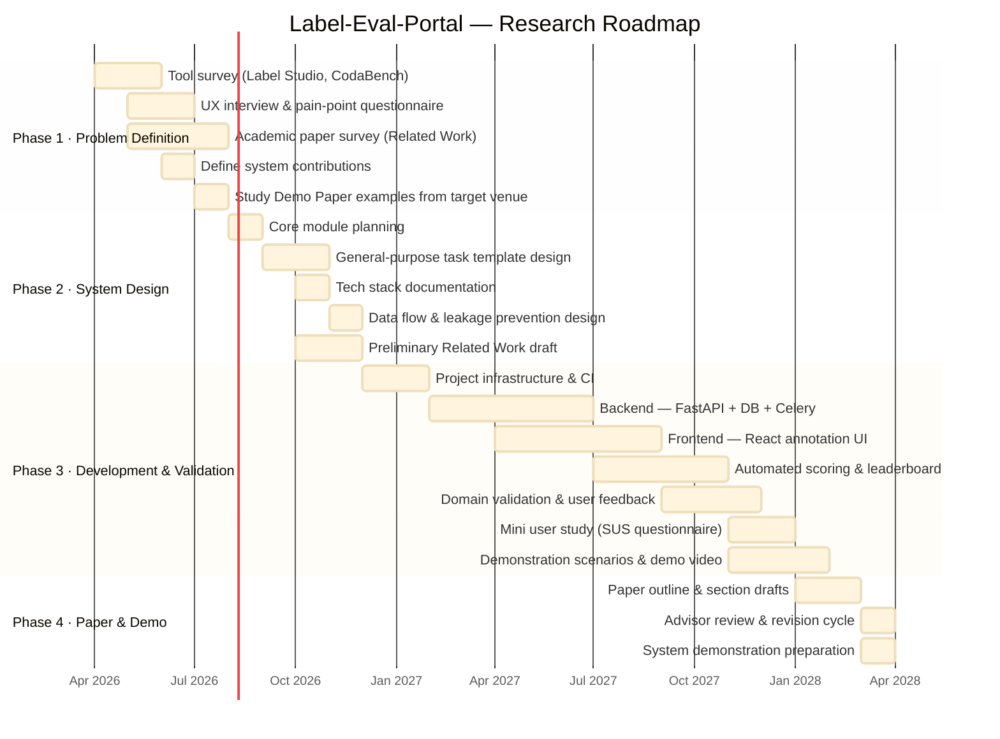

# Label-Eval-Portal

[繁體中文](README.zh-TW.md) | **English**

> A configurable web portal for collaborative dataset labeling, automated evaluation, and leaderboard generation in NLP research.

---

## Motivation

Existing labeling and evaluation platforms such as [Label Studio](https://labelstud.io/) and [CodaBench](https://codalab.lisn.upsaclay.fr/) are powerful but come with significant friction for research teams:

- **Complex setup:** Deploying Label Studio requires configuring a dedicated server, which is time-consuming and demands engineering effort beyond the scope of most research teams.
- **Poor usability:** Platforms like CodaBench provide evaluation and competition features, but their interfaces are unintuitive and hard to navigate.
- **Fragmented workflows:** Labeling, scoring, and result comparison are often handled by separate tools or ad-hoc scripts, forcing researchers to repeatedly build one-off systems from scratch.
- **No reusable templates:** Most teams end up developing task-specific tools that cannot be reused across different annotation tasks or datasets.

**Label-Eval-Portal** aims to eliminate these pain points by providing a lightweight, configurable, and general-purpose portal that any NLP research team can launch with minimal setup.

---

## Key Features

- **General-Purpose Templates:** Supports multiple NLP task types (e.g., classification, regression). Users can launch a labeling server with a simple Config file — no custom code required.
- **Automated Scoring & Leaderboard:** Integrated evaluation mechanism that automatically scores submissions and updates the leaderboard in real time.
- **Data Privacy & Fairness:** Third-party scoring mechanism keeps test-set answers hidden, ensuring fair evaluation and preventing models from overfitting to test data.
- **High Usability UI:** Addresses the poor usability of existing tools (e.g., CodaBench) with a more intuitive labeling and management interface.

---

## Key Contributions

1. **Configurable and General-Purpose**
   Define annotation tasks, evaluation metrics, and leaderboard settings through a simple configuration file — no custom code required for each new task.

2. **Integrated Workflow**
   Combines data labeling, automatic scoring, and leaderboard generation in a single platform, replacing fragmented multi-tool pipelines.

3. **Data Integrity**
   Implements mechanisms to prevent test-set answer leakage, ensuring fair and reproducible evaluation.

4. **Low Entry Barrier**
   Designed for researchers and annotators without deep engineering backgrounds — spin up a labeling server in minutes, not days.

5. **Open Source**
   Released as an open-source toolkit for the broader NLP research community, enabling reuse and community-driven improvement.

---

## Academic Contribution

This project is positioned as a **Demo Paper**, with its core value in:

- Lowering the barrier for NLP research teams to set up labeling and evaluation environments.
- Providing a reusable system toolkit that addresses the practical inefficiency of ad-hoc annotation workflows in the research community.

---

## Tech Stack

| Layer | Technology |
|---|---|
| **Frontend** | React + TypeScript + Vite |
| **Backend** | FastAPI (Python) |
| **Database** | PostgreSQL |
| **Cache / Queue** | Redis |
| **Async Tasks** | Celery |
| **Testing** | Playwright (E2E) + pytest |

> **Note:** This tech stack reflects the current design decision; implementation is tracked in Phase 3.

---

## Comparison with Existing Tools

| Feature | Label Studio | CodaBench | **Label-Eval-Portal** |
|---|---|---|---|
| Easy setup (no server config) | ✗ | ✗ | ✓ |
| Config-driven task definition | Partial | ✗ | ✓ |
| Integrated scoring + leaderboard | ✗ | ✓ | ✓ |
| Test-set leakage prevention | ✗ | Partial | ✓ |
| Designed for NLP research teams | ✓ | Partial | ✓ |
| Open source | ✓ | ✓ | ✓ |

---

## Research Roadmap

### Phase 1 — Problem Definition & Tool Survey (Month 1–4)
- [ ] Survey existing platforms (e.g., Label Studio, CodaBench) and identify pain points in setup, usability, and workflow integration
- [ ] Conduct UX interviews and distribute a pain-point questionnaire to target users (researchers, annotators)
- [ ] Survey related academic papers on annotation platforms and NLP evaluation benchmarks to establish positioning for the Related Work section
- [ ] Define the system's contribution: clarify how the portal is simpler and more usable than existing tools (e.g., Config-driven task launch)
- [ ] Study Demo Paper examples from target venue proceedings to understand structure, length, and demonstration requirements

### Phase 2 — System Design & General-Purpose Architecture (Month 5–8)
- [ ] Plan core modules: Labeling, Automated Evaluation, and Leaderboard
- [ ] Design general-purpose task templates — ensure the system supports diverse NLP tasks (e.g., classification, regression), not just a single use case
- [ ] Document and ratify tech stack decision (FastAPI + React + PostgreSQL + Redis + Celery)
- [ ] Design data flow to prevent test-set answer leakage
- [ ] Draft preliminary Related Work notes; confirm no existing system makes the same contribution claim

### Phase 3 — Development & Validation (Month 9–22)
- [ ] Project infrastructure setup (SDD workflow, CI, AI agents)
- [ ] Implement frontend interface and backend logic (leverage AI tools to assist development)
- [ ] Implement automated scoring and leaderboard generation
- [ ] Define evaluation criteria: task launch time, inter-annotator agreement (IAA), scoring accuracy vs. baseline
- [ ] Validate system on domain-specific NLP tasks (e.g., Chinese medical/healthcare, sentiment & psychological analysis)
- [ ] Conduct structured mini user study with lab members (SUS questionnaire); document results as paper evidence
- [ ] Define 2–3 demonstration scenarios covering core workflows (e.g., researcher launches task via config, annotator submits and views score, leaderboard updates)
- [ ] Capture system screenshots and record a demo walkthrough video

### Phase 4 — Paper Writing & Demo Preparation (Month 22–24)
- [ ] Draft paper outline and confirm structure with advisor (Introduction, System Overview, Key Features, Demonstration Scenarios, Related Work, Conclusion)
- [ ] Write thesis in English to Demo Paper length and format
- [ ] Complete advisor review cycle; address all feedback
- [ ] Prepare system demonstration to showcase practical impact

---

## Target Application Domains

- Chinese Medical & Healthcare NLP
- Sentiment & Psychological Analysis
- General NLP annotation tasks (classification, span labeling, etc.)

---

## Advisor

**Prof. Lung-Hao Lee** — [Natural Language Processing Lab](https://ainlp.tw/)

- Personal Page: [lunghao.weebly.com](https://lunghao.weebly.com/)

Research focus: Chinese NLP, text annotation, and language model evaluation.

---

## License

MIT License
