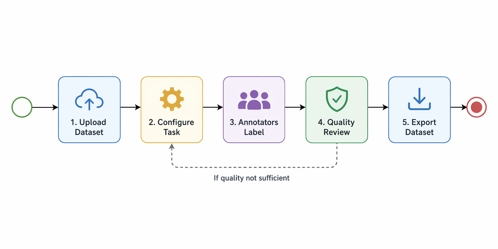
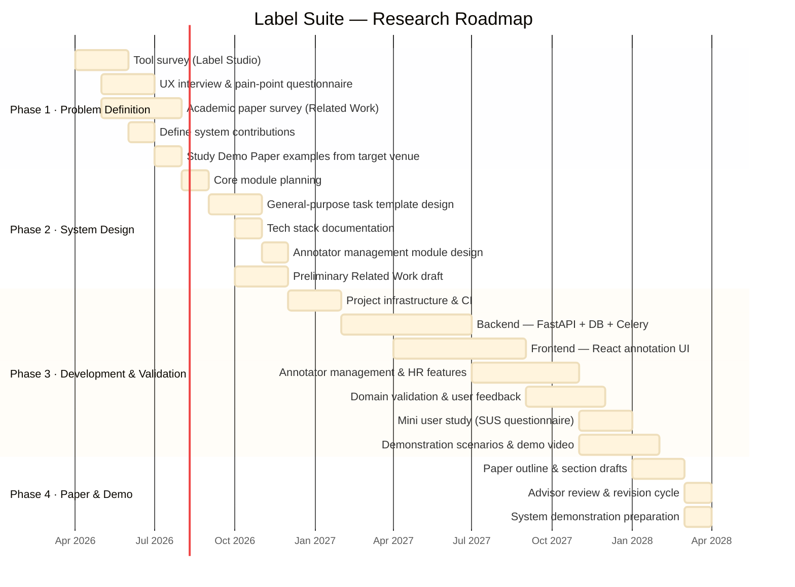

  

<h1 align="center">Label Suite</h1>

  <a href="README.zh-TW.md">繁體中文</a> | <strong>English</strong>

  A config-driven NLP annotation platform with integrated annotator management, designed for academic research labs.

---

## Motivation

Existing annotation platforms such as [Label Studio](https://labelstud.io/) are powerful but come with significant friction for academic research teams:

- **Complex setup:** Deploying Label Studio requires configuring a dedicated server, which is time-consuming and demands engineering effort beyond the scope of most research teams.
- **No annotator management:** Existing tools do not support lab-scale annotator management (e.g., part-time student accounts, working hours tracking, salary estimation), forcing teams to manage human resources through external spreadsheets.
- **Fragmented workflows:** Task configuration, labeling, and dataset analysis are often handled by separate tools or ad-hoc scripts, forcing researchers to repeatedly build one-off systems from scratch.
- **No dataset quality visibility:** Existing tools provide no built-in dataset statistics, forcing researchers to write analysis scripts after each labeling round.

**Label Suite** aims to eliminate these pain points by providing a lightweight, config-driven annotation platform that any NLP research team can launch with minimal setup.

---

## Annotation Workflow

---

## Key Features

- **Config-driven Task Launch:** Define NLP annotation tasks through simple YAML/JSON config files — no custom code required. Supports Single Sentence, Sentence Pairs, Sequence Labeling, and Generative Labeling.
- **Integrated Annotator Management:** Built-in account management, working hours tracking, and salary estimation for part-time research assistants.
- **Dry Run / Official Run Mechanism:** Validate labeling interfaces and configurations before formal data collection, with strict data isolation between modes.
- **Built-in Dataset Analytics:** Automatically computes and surfaces #Sentence, #Token, and #Label statistics in real time for quality monitoring.
- **High Usability UI:** Intuitive labeling interface designed for non-engineering annotators.

---

## Key Contributions

1. **Config-Driven and General-Purpose**
   Launch annotation tasks for diverse NLP task types through a simple configuration file — no custom code required for each new task.

2. **Annotator-centered Lab Management**
   First to integrate annotator account management, working hours tracking, and salary estimation into an NLP annotation portal, addressing the operational needs of academic labs.

3. **Built-in Dataset Analytics**
   Eliminates the need for post-hoc analysis scripts by automatically computing and surfacing dataset statistics within the portal.

4. **Integrated Annotation Workflow**
   Combines task configuration, data labeling, and dataset analysis in a single platform, replacing fragmented multi-tool pipelines.

5. **Low Entry Barrier**
   Designed for researchers and annotators without deep engineering backgrounds — spin up a labeling server in minutes, not days.

6. **Open Source**
   Released as an open-source toolkit for the broader NLP research community, enabling reuse and community-driven improvement.

---

## Academic Contribution

This project is positioned as a **Demo Paper**, with its core value in:

- Lowering the barrier for NLP research teams to set up annotation environments.
- Providing a reusable annotation toolkit with integrated annotator management that addresses the practical inefficiency of ad-hoc workflows in academic labs.

---

## Tech Stack

| Layer | Technology |
|---|---|
| **Frontend** | React + TypeScript + Vite |
| **Backend** | FastAPI (Python) |
| **Database** | PostgreSQL |
| **Cache / Queue** | Redis |
| **Async Tasks** | Celery |
| **Testing** | Playwright (E2E) + pytest |

> **Note:** This tech stack reflects the current design decision; implementation is tracked in Phase 3.

---

## Comparison with Label Studio

| Feature | Label Studio | **Label Suite** |
|---|---|---|
| Easy setup (no server config) | ✗ | ✓ |
| Config-driven task definition | Partial | ✓ |
| Annotator account management | ✗ | ✓ |
| Working hours tracking | ✗ | ✓ |
| Salary estimation | ✗ | ✓ |
| Built-in dataset statistics | ✗ | ✓ |
| Dry Run / Official Run isolation | ✗ | ✓ |
| Designed for NLP research teams | ✓ | ✓ |
| Open source | ✓ | ✓ |

---

## Research Roadmap

### Phase 1 — Problem Definition & Tool Survey (Month 1–4)
- [ ] Survey Label Studio and identify pain points in setup, usability, and annotator management
- [ ] Conduct UX interviews and distribute a pain-point questionnaire to target users (researchers, annotators)
- [ ] Survey related academic papers on annotation platforms to establish positioning for the Related Work section
- [ ] Define the system's contribution: clarify how Label Suite is simpler and more usable than Label Studio
- [ ] Study Demo Paper examples from target venue proceedings to understand structure, length, and demonstration requirements

### Phase 2 — System Design & General-Purpose Architecture (Month 5–8)
- [ ] Plan core modules: Annotator Management, Annotation Tasks, Dataset Analysis
- [ ] Design general-purpose task templates — ensure the system supports diverse NLP tasks (Single Sentence, Sentence Pairs, Sequence Labeling, Generative Labeling)
- [ ] Document and ratify tech stack decision (FastAPI + React + PostgreSQL + Redis + Celery)
- [ ] Design annotator management module (account lifecycle, working hours tracking, salary estimation)
- [ ] Draft preliminary Related Work notes; confirm no existing system makes the same contribution claim

### Phase 3 — Development & Validation (Month 9–22)
- [ ] Project infrastructure setup (SDD workflow, CI, AI agents)
- [ ] Implement frontend annotation interface and backend logic (leverage AI tools to assist development)
- [ ] Implement annotator management: account CRUD, working hours logging, salary estimation
- [ ] Implement Dry Run / Official Run mechanism with strict data isolation
- [ ] Implement built-in dataset analytics (#Sentence, #Token, #Label)
- [ ] Validate system on domain-specific NLP tasks (e.g., Chinese medical/healthcare, sentiment & psychological analysis)
- [ ] Conduct structured mini user study with lab members (SUS questionnaire); document results as paper evidence
- [ ] Define 2–3 demonstration scenarios covering core workflows (annotator onboarding, task launch via config, dataset analysis)
- [ ] Capture system screenshots and record a demo walkthrough video

### Phase 4 — Paper Writing & Demo Preparation (Month 22–24)
- [ ] Draft paper outline and confirm structure with advisor (Introduction, System Overview, Key Features, Demonstration Scenarios, Related Work, Conclusion)
- [ ] Write thesis in English to Demo Paper length and format
- [ ] Complete advisor review cycle; address all feedback
- [ ] Prepare system demonstration to showcase practical impact

---

## Target Application Domains

- Chinese Medical & Healthcare NLP
- Sentiment & Psychological Analysis
- General NLP annotation tasks (classification, span labeling, etc.)

---

## Advisor

**Prof. Lung-Hao Lee** — [Natural Language Processing Lab](https://ainlp.tw/)

- Personal Page: [lunghao.weebly.com](https://lunghao.weebly.com/)

Research focus: Chinese NLP, text annotation, and language model evaluation.

---

## License

MIT License
