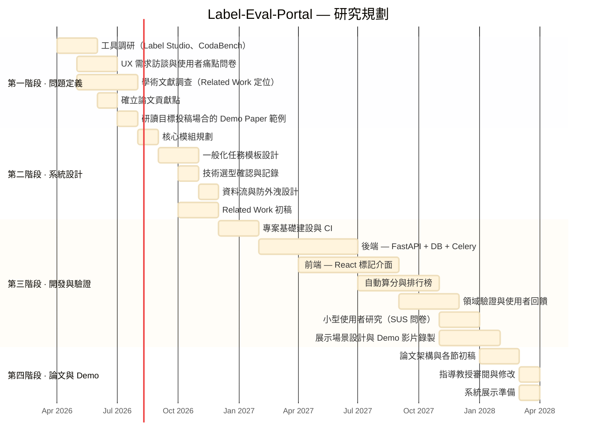

# Label-Eval-Portal

**繁體中文** | [English](README.md)

> 一個可配置的網頁入口平台，用於協作式資料標記、自動化評測與排行榜生成，專為 NLP 研究團隊設計。

---

## 研究動機

現有的標記與評測平台（如 [Label Studio](https://labelstud.io/) 與 [CodaBench](https://codalab.lisn.upsaclay.fr/)）功能強大，但對研究團隊而言存在明顯的使用障礙：

- **架設繁瑣：** Label Studio 需要自行配置伺服器，耗費大量工程時間，對多數研究團隊而言門檻過高。
- **介面不友善：** CodaBench 等平台雖提供評測與競賽功能，但操作介面不直覺，學習曲線陡峭。
- **工作流程分散：** 標記、算分與結果比較往往需要不同工具或自行撰寫腳本，導致研究團隊重複開發一次性系統。
- **缺乏可重用模板：** 多數團隊為特定任務開發的工具無法套用到其他標記任務，造成資源浪費。

**Label-Eval-Portal** 旨在消除上述痛點，提供一個輕量、可配置的通用平台，讓任何 NLP 研究團隊都能以最少的設定快速啟動。

---

## 核心功能

- **一般化任務公板（General-Purpose Templates）：** 支援分類、回歸等多種 NLP 任務，使用者僅需透過簡單的 Config 設定即可啟動標記伺服器，無需撰寫自訂程式碼。
- **自動化算分與排行榜（Automated Scoring & Leaderboard）：** 整合評測機制，上傳結果後可自動算分並即時更新排行榜。
- **防止資料污染（Data Privacy & Fairness）：** 提供第三方算分機制，測試集答案不公開，確保評測的公正性並避免模型過度擬合測試資料。
- **高易用性介面（High Usability UI）：** 改善現有工具（如 CodaBench）介面難用的痛點，提供更直覺的標記與管理體驗。

---

## 主要貢獻

1. **可配置、通用性強**
   透過簡單的設定檔（Config）定義標記任務、評測指標與排行榜規則，無需為每個新任務撰寫自訂程式碼。

2. **整合式工作流程**
   將資料標記、自動算分與排行榜生成整合於單一平台，取代現有的多工具分散式流程。

3. **資料完整性保障**
   實作防止測試集答案外洩的機制，確保評測結果公平且可重現。

4. **低使用門檻**
   專為沒有深厚工程背景的研究人員與標記人員設計，數分鐘內即可啟動標記伺服器。

5. **開放原始碼**
   以開源工具包形式釋出，供更廣泛的 NLP 研究社群使用與共同改善。

---

## 學術貢獻

本計畫定位為 **Demo Paper** 方向，其核心價值在於：

- 降低 NLP 研究團隊架設標記與評測環境的門檻。
- 提供可重複使用的系統工具，解決研究社群中低效標記的實務痛點。

---

## 技術選型

| 層級 | 技術 |
|---|---|
| **前端** | React + TypeScript + Vite |
| **後端** | FastAPI（Python） |
| **資料庫** | PostgreSQL |
| **快取 / 佇列** | Redis |
| **非同步任務** | Celery |
| **測試** | Playwright（E2E）+ pytest |

---

## 與現有工具比較

| 功能 | Label Studio | CodaBench | **Label-Eval-Portal** |
|---|---|---|---|
| 簡易架設（免伺服器配置） | ✗ | ✗ | ✓ |
| Config 驅動的任務定義 | 部分支援 | ✗ | ✓ |
| 整合算分 + 排行榜 | ✗ | ✓ | ✓ |
| 防止測試集資料外洩 | ✗ | 部分支援 | ✓ |
| 專為 NLP 研究團隊設計 | ✓ | 部分支援 | ✓ |
| 開放原始碼 | ✓ | ✓ | ✓ |

---

## 研究規劃 Roadmap

### 第一階段 — 問題定義與現有工具調研（第 1–4 個月）
- [ ] 調研現有平台（如 Label Studio、CodaBench），找出架設、易用性與工作流程整合上的痛點
- [ ] 進行 UX 需求訪談，並發放使用者痛點問卷（目標對象：研究人員、標記人員）
- [ ] 調查標記平台與 NLP 評測基準的相關學術論文，為 Related Work 建立定位基礎
- [ ] 確立論文貢獻點：定義系統如何比現有工具「更好用」或「更簡便」（例如：透過 Config 設定即可快速啟動標記任務）
- [ ] 研讀目標投稿場合的 Demo Paper 範例，了解結構、篇幅與展示需求

### 第二階段 — 系統設計與一般化架構（第 5–8 個月）
- [ ] 規劃核心模組：標記（Labeling）、自動算分（Evaluation）、排行榜（Leaderboard）
- [ ] 設計一般化任務公板（Template）：確保系統可套用於多種 NLP 任務（如分類、回歸），而非針對單一任務
- [ ] 確認並記錄技術選型（FastAPI + React + PostgreSQL + Redis + Celery）
- [ ] 設計資料流以防止測試集答案外洩
- [ ] 撰寫 Related Work 初稿；確認本系統貢獻具備新穎性

### 第三階段 — 開發與驗證（第 9–22 個月）
- [ ] 專案基礎建設（SDD 工作流程、CI、AI agents）
- [ ] 實作前端介面與後端邏輯（善用 AI 工具輔助開發）
- [ ] 實作自動算分與排行榜生成
- [ ] 定義評測指標：任務啟動時間、標記者間一致性（IAA）、算分準確率
- [ ] 於特定領域 NLP 任務進行驗證（如：中文醫療健康照護、情緒心理分析）
- [ ] 進行小型使用者研究（實驗室成員，SUS 問卷）；整理結果作為論文佐證
- [ ] 設計 2–3 個核心展示場景（如：研究員透過 Config 啟動任務、標記員提交並查看分數、排行榜即時更新）
- [ ] 截取系統畫面，並錄製 Demo 操作影片

### 第四階段 — 論文撰寫與 Demo 準備（第 22–24 個月）
- [ ] 擬定論文架構並與指導教授確認（Introduction、System Overview、Key Features、Demonstration Scenarios、Related Work、Conclusion）
- [ ] 以英文撰寫論文（Demo Paper 格式）
- [ ] 完成指導教授審閱流程，修改所有回饋
- [ ] 準備系統展示，呈現實務應用價值

---

## 目標應用領域

- 中文醫療健康 NLP
- 情感與心理分析
- 通用 NLP 標記任務（分類、區間標記等）

---

## 指導教授

**李龍豪 教授** — [自然語言處理實驗室](https://ainlp.tw/)

- 個人頁面：[lunghao.weebly.com](https://lunghao.weebly.com/)

研究方向：中文 NLP、文字標記、語言模型評測。

---

## 授權

MIT License
