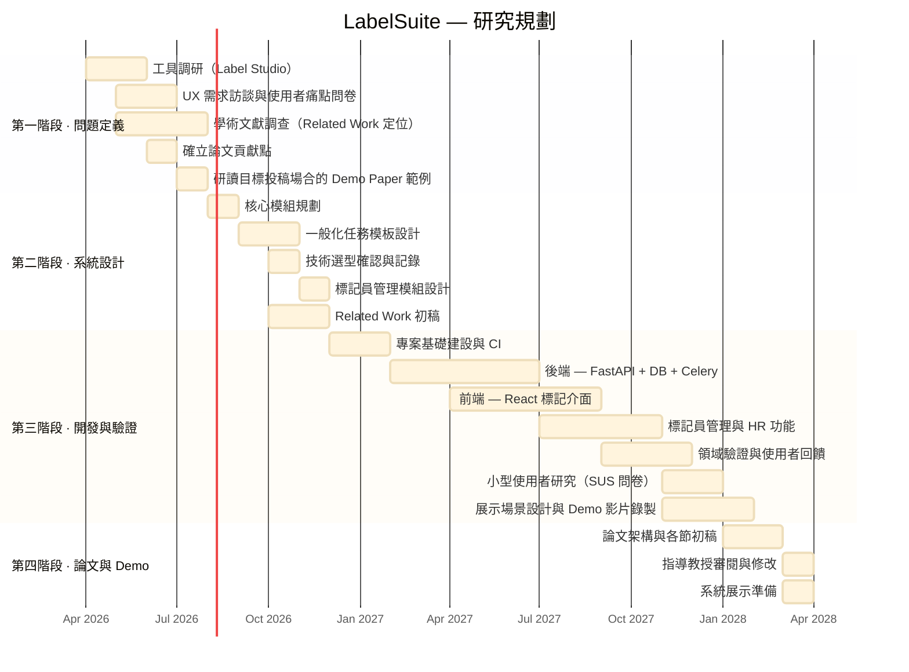

  

<h1 align="center">LabelSuite</h1>

  <strong>繁體中文</strong> | <a href="README.md">English</a>

  具整合式標記員管理之配置驅動 NLP 標記平台，專為學術研究實驗室設計。

---

## 研究動機

現有的標記平台（如 [Label Studio](https://labelstud.io/)）功能強大，但對學術研究團隊而言存在明顯的使用障礙：

- **架設繁瑣：** Label Studio 需要自行配置伺服器，耗費大量工程時間，對多數研究團隊而言門檻過高。
- **缺乏標記員管理：** 現有工具不支援實驗室規模的標記員管理（如工讀生帳號、工時追蹤、薪資試算），研究團隊被迫透過外部試算表管理人力。
- **工作流程分散：** 任務配置、標記執行與資料集分析往往需要不同工具或自行撰寫腳本，導致研究團隊重複開發一次性系統。
- **缺乏資料集品質可視性：** 現有工具未提供內建的資料集統計功能，研究人員每次標記後都需撰寫分析腳本才能了解資料品質。

**LabelSuite** 旨在消除上述痛點，提供一個輕量、配置驅動的標記平台，讓任何 NLP 研究團隊都能以最少的設定快速啟動。

---

## 核心功能

- **配置驅動任務啟動：** 透過簡單的 YAML/JSON 設定檔定義 NLP 標記任務，無需撰寫自訂程式碼。支援單一句子、句子對、序列標記與生成標記四種任務類型。
- **整合式標記員管理：** 內建帳號管理、工時追蹤與薪資試算，專為工讀生研究助理設計。
- **Dry Run / Official Run 機制：** 正式收集資料前先驗證標記介面與配置正確性，兩種模式資料嚴格隔離。
- **內建資料集分析：** 自動即時計算並呈現 #Sentence、#Token 與 #Label 統計，供品質監控使用。
- **高易用性介面：** 專為非工程背景標記員設計的直覺式標記介面。

---

## 主要貢獻

1. **可配置、通用性強**
   透過簡單的設定檔即可為多種 NLP 任務類型啟動標記任務，無需為每個新任務撰寫自訂程式碼。

2. **以標記員為中心的實驗室管理**
   首創將標記員帳號管理、工時追蹤與薪資試算整合於 NLP 標記門戶，解決學術實驗室的行政管理需求。

3. **內建資料集分析功能**
   無需事後撰寫分析腳本，系統自動計算並即時呈現資料集統計，讓研究人員在標記過程中持續監控資料品質。

4. **整合標記工作流程**
   將任務配置、資料標記與資料集分析整合於單一平台，取代現有的多工具分散式流程。

5. **低使用門檻**
   專為沒有深厚工程背景的研究人員與標記人員設計，數分鐘內即可啟動標記伺服器。

6. **開放原始碼**
   以開源工具包形式釋出，供更廣泛的 NLP 研究社群使用與共同改善。

---

## 學術貢獻

本計畫定位為 **Demo Paper** 方向，其核心價值在於：

- 降低 NLP 研究團隊架設標記環境的門檻。
- 提供具整合式標記員管理的可重用標記工具包，解決學術實驗室中低效臨時流程的實務痛點。

---

## 技術選型

| 層級 | 技術 |
|---|---|
| **前端** | React + TypeScript + Vite |
| **後端** | FastAPI（Python） |
| **資料庫** | PostgreSQL |
| **快取 / 佇列** | Redis |
| **非同步任務** | Celery |
| **測試** | Playwright（E2E）+ pytest |

> **註：** 此技術選型反映當前設計決策；實作進度追蹤於第三階段。

---

## 與 Label Studio 比較

| 功能 | Label Studio | **LabelSuite** |
|---|---|---|
| 簡易架設（免伺服器配置） | ✗ | ✓ |
| Config 驅動的任務定義 | 部分支援 | ✓ |
| 標記員帳號管理 | ✗ | ✓ |
| 工時追蹤 | ✗ | ✓ |
| 薪資試算 | ✗ | ✓ |
| 內建資料集統計 | ✗ | ✓ |
| Dry Run / Official Run 隔離 | ✗ | ✓ |
| 專為 NLP 研究團隊設計 | ✓ | ✓ |
| 開放原始碼 | ✓ | ✓ |

---

## 研究規劃 Roadmap

### 第一階段 — 問題定義與現有工具調研（第 1–4 個月）
- [ ] 調研 Label Studio，找出架設、易用性與標記員管理上的痛點
- [ ] 進行 UX 需求訪談，並發放使用者痛點問卷（目標對象：研究人員、標記人員）
- [ ] 調查標記平台的相關學術論文，為 Related Work 建立定位基礎
- [ ] 確立論文貢獻點：定義 LabelSuite 如何比 Label Studio 更好用、更簡便
- [ ] 研讀目標投稿場合的 Demo Paper 範例，了解結構、篇幅與展示需求

### 第二階段 — 系統設計與一般化架構（第 5–8 個月）
- [ ] 規劃核心模組：標記員管理、標記任務、資料集分析
- [ ] 設計一般化任務公板：確保系統可套用於多種 NLP 任務（單一句子、句子對、序列標記、生成標記）
- [ ] 確認並記錄技術選型（FastAPI + React + PostgreSQL + Redis + Celery）
- [ ] 設計標記員管理模組（帳號生命週期、工時追蹤、薪資試算）
- [ ] 撰寫 Related Work 初稿；確認本系統貢獻具備新穎性

### 第三階段 — 開發與驗證（第 9–22 個月）
- [ ] 專案基礎建設（SDD 工作流程、CI、AI agents）
- [ ] 實作前端標記介面與後端邏輯（善用 AI 工具輔助開發）
- [ ] 實作標記員管理：帳號 CRUD、工時記錄、薪資試算
- [ ] 實作 Dry Run / Official Run 機制，確保資料嚴格隔離
- [ ] 實作內建資料集分析（#Sentence、#Token、#Label）
- [ ] 於特定領域 NLP 任務進行驗證（如：中文醫療健康照護、情緒心理分析）
- [ ] 進行小型使用者研究（實驗室成員，SUS 問卷）；整理結果作為論文佐證
- [ ] 設計 2–3 個核心展示場景（標記員入職、透過 Config 啟動任務、資料集分析）
- [ ] 截取系統畫面，並錄製 Demo 操作影片

### 第四階段 — 論文撰寫與 Demo 準備（第 22–24 個月）
- [ ] 擬定論文架構並與指導教授確認（Introduction、System Overview、Key Features、Demonstration Scenarios、Related Work、Conclusion）
- [ ] 以英文撰寫論文（Demo Paper 格式）
- [ ] 完成指導教授審閱流程，修改所有回饋
- [ ] 準備系統展示，呈現實務應用價值

---

## 目標應用領域

- 中文醫療健康 NLP
- 情感與心理分析
- 通用 NLP 標記任務（分類、區間標記等）

---

## 指導教授

**李龍豪 教授** — [自然語言處理實驗室](https://ainlp.tw/)

- 個人頁面：[lunghao.weebly.com](https://lunghao.weebly.com/)

研究方向：中文 NLP、文字標記、語言模型評測。

---

## 授權

MIT License
