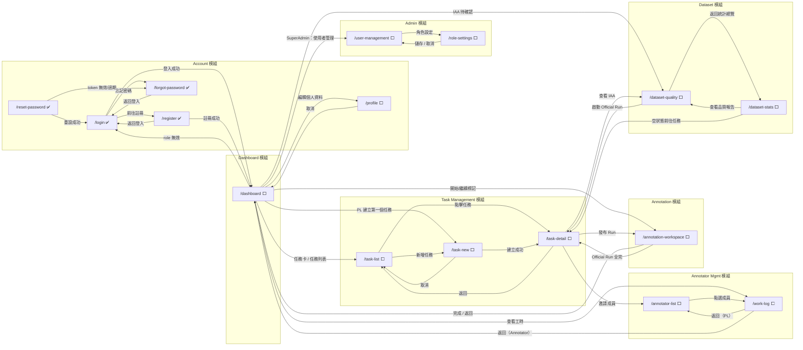

# Prototype Navigation Map

全局導航地圖 — 聚合所有 spec 的 User Flow & Navigation 表格，供 prototype 開發與測試使用。

**格式說明**
- **Incoming**：哪些頁面會連結到此頁（由誰進入）
- **Outgoing**：此頁會連結到哪些頁面（從此離開）
- **Inline**：頁面內操作，不觸發跳轉（modal、Toast、表單停留等）

---

## 建置狀態總覽

**狀態說明**

| 符號 | 意義 |
|------|------|
| ✅ | HTML + 測試均完成 |
| 🟡 | HTML 完成，測試待補 |
| ⬜ | 尚未建置 |

**複雜度**：★☆☆☆☆（極簡）→ ★★★★★（最複雜）

| # | Spec 名稱 | 頁面路徑 | 模組 | 複雜度 | 狀態 |
|---|-----------|----------|------|--------|------|
| 001 | 登入 — Email/Password | `account/login` | account | ★★☆☆☆ | ✅ 完成 |
| 003 | 註冊 — Email/Password | `account/register` | account | ★★☆☆☆ | ✅ 完成 |
| 004a | 忘記密碼 | `account/forgot-password` | account | ★☆☆☆☆ | ✅ 完成 |
| 004b | 重設密碼 | `account/reset-password` | account | ★★☆☆☆ | ✅ 完成 |
| 005 | 個人資料設定 | `account/profile` | account | ★★☆☆☆ | 🟡 HTML 完成 |
| 006 | 使用者管理 | `admin/user-management` | admin | ★★★☆☆ | 🟡 HTML 完成 |
| 007 | 角色設定 | `admin/role-settings` | admin | ★★☆☆☆ | 🟡 HTML 完成 |
| 008 | 標記員列表 | `annotator-management/annotator-list` | annotator-management | ★★★☆☆ | ⬜ 待建置 |
| 009 | 工時紀錄 | `annotator-management/work-log` | annotator-management | ★★★☆☆ | ⬜ 待建置 |
| 012 | 儀表板 | `dashboard/dashboard` | dashboard | ★★★★☆ | 🟡 HTML 完成 |
| 010 | 任務列表 | `task-management/task-list` | task-management | ★★★☆☆ | ⬜ 待建置 |
| 013 | 新增任務（多步驟） | `task-management/task-new` | task-management | ★★★★★ | ⬜ 待建置 |
| 014 | 任務詳情 | `task-management/task-detail` | task-management | ★★★★☆ | 🟡 HTML 完成 |
| 015 | 標記作業頁 | `annotation/annotation-workspace` | annotation | ★★★★★ | ⬜ 待建置 |
| 016 | 資料集統計總覽 | `dataset/dataset-stats` | dataset | ★★★★☆ | ⬜ 待建置 |
| 017 | 資料集品質監控 | `dataset/dataset-quality` | dataset | ★★★★☆ | ⬜ 待建置 |

---

## 全局導航流程圖

> 節點顏色：✅ 已完成（深色）/ ⬜ 待建置（淺色）。箭頭標籤說明觸發條件。

---

## Account 模組

### `/login` ✅
**Source spec**: 001, 002

| 方向 | 觸發條件 | 目標 |
|------|---------|------|
| Incoming | 登出（任意已登入頁面） | — |
| Incoming | 任意受保護路由未驗證存取 | — |
| Incoming | Google OAuth 取消 / state 驗證失敗 | — |
| Incoming | `/register` 點擊「返回登入」 | — |
| Incoming | `/forgot-password` 點擊「返回登入」 | — |
| Incoming | `/reset-password` 重設成功 | — |
| Incoming | `/dashboard` role 無效（清除 session） | — |
| Outgoing | Email/Password 登入成功 | `/dashboard` |
| Outgoing | 已登入使用者訪問（自動導向） | `/dashboard` |
| Outgoing | 登入成功 + `?next=` 參數 | 原始目標路由 |
| Outgoing | 點擊「前往註冊」 | `/register` |
| Outgoing | 點擊「忘記密碼」 | `/forgot-password` |
| Outgoing | 點擊「以 Google 登入」 | Google 授權頁（外部） |

---

### `/register` ✅
**Source spec**: 003

| 方向 | 觸發條件 | 目標 |
|------|---------|------|
| Incoming | `/login` 點擊「前往註冊」 | — |
| Outgoing | 送出成功 | `/dashboard` |
| Outgoing | 點擊「返回登入」 | `/login` |
| Outgoing | 已登入使用者訪問（自動導向） | `/dashboard` |
| Inline | 重複 Email 錯誤 | 停留，顯示錯誤訊息 |

---

### `/forgot-password` ✅
**Source spec**: 004

| 方向 | 觸發條件 | 目標 |
|------|---------|------|
| Incoming | `/login` 點擊「忘記密碼」 | — |
| Incoming | `/reset-password` token 無效 / 已過期 | — |
| Outgoing | 點擊「返回登入」 | `/login` |
| Outgoing | 已登入使用者訪問（自動導向） | `/dashboard` |
| Inline | 送出 Email（無論是否存在） | 停留，顯示通用提示 |

---

### `/reset-password` ✅
**Source spec**: 004

| 方向 | 觸發條件 | 目標 |
|------|---------|------|
| Incoming | 使用者信箱中的重設連結（`?token=<UUID>`） | — |
| Outgoing | 重設成功 | `/login`（顯示成功提示）|
| Outgoing | token 無效 / 已過期 | `/forgot-password` |
| Outgoing | 直接訪問不帶 token | `/forgot-password` |
| Inline | 密碼不一致 | 停留，顯示前端錯誤 |

---

### `/profile` ⬜
**Source spec**: 005

| 方向 | 觸發條件 | 目標 |
|------|---------|------|
| Incoming | Navbar 使用者頭像點擊 | — |
| Outgoing | 點擊「取消」或 Navbar Logo | `/dashboard` |
| Inline | 儲存成功 | 停留，Navbar 名稱即時更新 |

---

## Admin 模組

### `/user-management` ⬜
**Source spec**: 006

| 方向 | 觸發條件 | 目標 |
|------|---------|------|
| Incoming | Navbar → 系統管理（`super_admin` 限定） | — |
| Incoming | `/role-settings` 儲存 / 取消 | — |
| Outgoing | 點擊「角色設定」 | `/role-settings` |
| Inline | 帳號啟用 / 停用操作 | 停留，即時更新列表 |

---

### `/role-settings` ⬜
**Source spec**: 007

| 方向 | 觸發條件 | 目標 |
|------|---------|------|
| Incoming | `/user-management` 點擊「角色設定」 | — |
| Outgoing | 儲存 | `/user-management` |
| Outgoing | 取消 | `/user-management` |

---

## Annotator Management 模組

### `/annotator-list` ⬜
**Source spec**: 008, 009

| 方向 | 觸發條件 | 目標 |
|------|---------|------|
| Incoming | Navbar → 標記員管理 | — |
| Incoming | `/work-log` 返回（PL 視角） | — |
| Outgoing | 點選成員 | `/work-log`（該成員） |
| Inline | 邀請成員加入任務 | 停留（彈窗 / 下拉選單） |

---

### `/work-log` ⬜
**Source spec**: 009

| 方向 | 觸發條件 | 目標 |
|------|---------|------|
| Incoming | Navbar → 工時紀錄（`annotator` 點擊，看自己） | — |
| Incoming | `/annotator-list` 點選成員（PL 點擊，看成員） | — |
| Outgoing | 返回按鈕（PL 視角） | `/annotator-list` |
| Outgoing | 返回按鈕（Annotator 視角） | `/dashboard` |

---

## Dashboard 模組

### `/dashboard` ⬜
**Source spec**: 012, 013, 015

| 方向 | 觸發條件 | 目標 |
|------|---------|------|
| Incoming | `/login` 登入成功 | — |
| Incoming | `/register` 註冊成功 | — |
| Incoming | `/annotation-workspace` 全批次完成 / 返回 | — |
| Incoming | `/profile` 點擊取消 | — |
| Outgoing | `role` 未知 / 無效（清除 session） | `/login` |
| Outgoing | SuperAdmin：管理使用者快捷 | `/user-management` |
| Outgoing | SuperAdmin：任務卡點選 | `/task-list`（或 `/task-detail`）|
| Outgoing | SuperAdmin：IAA 待確認連結 | `/dataset-quality/:taskId` |
| Outgoing | User/Annotator：快速繼續 / 任務卡 | `/annotation-workspace/:taskId` |
| Outgoing | User/Annotator：查看工時紀錄 | `/work-log` |
| Outgoing | User/Annotator：編輯個人資料 | `/profile` |
| Outgoing | PL 空狀態 CTA「建立第一個任務」 | `/task-new` |

---

## Task Management 模組

### `/task-list` ⬜
**Source spec**: 010

| 方向 | 觸發條件 | 目標 |
|------|---------|------|
| Incoming | Navbar → 任務管理 | — |
| Incoming | `/task-detail` 點擊「返回」 | — |
| Incoming | `/task-new` 點擊「取消」 | — |
| Outgoing | 點擊任務 | `/task-detail` |
| Outgoing | 點擊「新增任務」 | `/task-new` |

---

### `/task-new` ⬜
**Source spec**: 013

多步驟表單（Step 1 → Step 2 → Step 3）

| 方向 | 觸發條件 | 目標 |
|------|---------|------|
| Incoming | `/task-list` 點擊「新增任務」 | — |
| Incoming | `/dashboard` 空狀態 CTA | — |
| Outgoing | Step 3 點擊「建立任務」成功 | `/task-detail/:taskId` |
| Outgoing | 任一步驟點擊「取消」 | `/task-list` |
| Inline | Step 1 ↔ Step 2 ↔ Step 3 | 同頁步驟切換 |
| Inline | 離開時選擇「儲存草稿」 | 草稿出現於 `/task-list`，不跳轉 |

---

### `/task-detail` ⬜
**Source spec**: 014

| 方向 | 觸發條件 | 目標 |
|------|---------|------|
| Incoming | `/task-list` 點擊任務 | — |
| Incoming | `/task-new` 建立成功（自動導向） | — |
| Incoming | `/dashboard` Reviewer 唯讀連結 | — |
| Incoming | `/annotation-workspace` Official Run 全部完成 | — |
| Incoming | `/dataset-quality` 達標後「啟動 Official Run」（PL） | — |
| Outgoing | 點擊「返回」 | `/task-list` |
| Outgoing | 點擊「邀請成員」 | `/annotator-list` |
| Outgoing | 點擊「查看 IAA 報告」 | `/dataset-quality/:taskId` |
| Outgoing | 發布 Dry/Official Run → annotator 進入 | `/annotation-workspace/:taskId` |
| Inline | 匯出操作 | 停留，Toast 通知 |

---

## Annotation 模組

### `/annotation-workspace` ⬜
**Source spec**: 015

| 方向 | 觸發條件 | 目標 |
|------|---------|------|
| Incoming | `/dashboard` Annotator「開始 / 繼續標記」 | — |
| Incoming | `/dashboard` Annotator「快速繼續」 | — |
| Incoming | `/dashboard` Reviewer 待審查任務卡 | — |
| Outgoing | 全批次完成 / 點擊「返回儀表板」 | `/dashboard` |
| Outgoing | Official Run 全部完成後（自動） | `/task-detail/:taskId` |
| Inline | 提交當前筆（尚有剩餘） | 停留，切換至下一筆 |

---

## Dataset 模組

### `/dataset-stats` ⬜
**Source spec**: 016

| 方向 | 觸發條件 | 目標 |
|------|---------|------|
| Incoming | Navbar → 資料集分析 → 統計總覽 | — |
| Incoming | `/dashboard`（PL / Reviewer）資料集分析快捷 | — |
| Incoming | `/dataset-quality` 點擊「返回統計總覽」 | — |
| Outgoing | 點擊「查看品質報告」 | `/dataset-quality/:taskId` |
| Outgoing | 空狀態「前往任務詳情」 | `/task-detail/:taskId` |

---

### `/dataset-quality` ⬜
**Source spec**: 017

| 方向 | 觸發條件 | 目標 |
|------|---------|------|
| Incoming | `/dashboard` PL 待處理事項「IAA 待確認」badge | — |
| Incoming | `/dataset-stats` 點擊「查看品質報告」 | — |
| Incoming | `/task-detail` 點擊「查看 IAA 報告」 | — |
| Outgoing | 點擊「返回統計總覽」 | `/dataset-stats/:taskId` |
| Outgoing | IAA 達標（PL）「前往任務詳情啟動 Official Run」 | `/task-detail/:taskId` |
| Outgoing | 資料不足「前往任務詳情」 | `/task-detail/:taskId` |

---

## 維護說明

每新增或修改一份 spec 的 **User Flow & Navigation** 區段時，同步更新此文件對應頁面的 Incoming / Outgoing 列。
