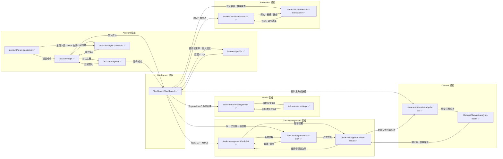

# Prototype Navigation Map

全局導航地圖 — 依照 `design/prototype/` 目前最新 HTML prototype 整理，供 prototype 開發與測試使用。

**格式說明**
- **Incoming**：哪些頁面會連結到此頁（由誰進入）
- **Outgoing**：此頁會連結到哪些頁面（從此離開）
- **Inline**：頁面內操作，不觸發跳轉（modal、Toast、表單停留、tab/panel 切換等）

---

## 建置狀態總覽

**狀態說明**

| 符號 | 意義 |
|------|------|
| ✅ | HTML + 測試均完成 |
| 🟡 | HTML 完成，測試待補 |
| ⬜ | 尚未建置 |

**複雜度**：★☆☆☆☆（極簡）→ ★★★★★（最複雜）

| # | 頁面名稱 | 頁面路徑 | 模組 | 複雜度 | 狀態 |
|---|----------|----------|------|--------|------|
| 001 | 登入 — Email/Password | `account/login` | account | ★★☆☆☆ | ✅ 完成 |
| 003 | 註冊 — Email/Password | `account/register` | account | ★★☆☆☆ | ✅ 完成 |
| 004a | 忘記密碼 | `account/forgot-password` | account | ★☆☆☆☆ | ✅ 完成 |
| 004b | 重設密碼 | `account/reset-password` | account | ★★☆☆☆ | ✅ 完成 |
| 005 | 個人資料設定 | `account/profile` | account | ★★☆☆☆ | ✅ 完成 |
| 006 | 使用者管理 | `admin/user-management` | admin | ★★★☆☆ | ✅ 完成 |
| 007 | 角色設定 | `admin/role-settings` | admin | ★★☆☆☆ | ✅ 完成 |
| 010 | 任務列表 | `task-management/task-list` | task-management | ★★★☆☆ | ✅ 完成 |
| 012 | 儀表板 | `dashboard/dashboard` | dashboard | ★★★★☆ | ✅ 完成 |
| 013 | 新增任務（多步驟） | `task-management/task-new` | task-management | ★★★★★ | ✅ 完成 |
| 014 | 任務詳情 | `task-management/task-detail` | task-management | ★★★★★ | ✅ 完成 |
| 015a | 標記清單 | `annotation/annotation-list` | annotation | ★★★★☆ | ✅ 完成 |
| 015b | 標記作業頁 | `annotation/annotation-workspace` | annotation | ★★★★★ | ✅ 完成 |
| 016a | 資料集分析列表 | `dataset/dataset-analysis-list` | dataset | ★★★★☆ | ✅ 完成 |
| 016b | 資料集分析詳情 | `dataset/dataset-analysis-detail` | dataset | ★★★★★ | ✅ 完成 |

**動態載入片段**

| 主頁 | 片段目錄 | 用途 |
|------|----------|------|
| `annotation/annotation-workspace` | `annotation/annotation-workspace.panels/` | 依任務類型載入分類、VA 評分、序列標記、關係抽取、句子配對等標記面板 |
| `task-management/task-detail` | `task-management/task-detail.panels/` | 任務概覽、成員管理、標記進度、標記結果、工時紀錄 tab |
| `dataset/dataset-analysis-detail` | `dataset/dataset-analysis-detail.partials/` | 依任務類型與 `tab=stats/quality` 載入統計與品質監控內容 |

---

## 全局導航流程圖

> 節點顏色：✅ 已完成 / ⬜ 待建置。箭頭標籤說明觸發條件。

```mermaid
flowchart LR
  subgraph account["Account 模組"]
    login["/account/login ✅"]
    register["/account/register ✅"]
    forgot["/account/forgot-password ✅"]
    reset["/account/reset-password ✅"]
    profile["/account/profile ✅"]
  end

  subgraph dash["Dashboard 模組"]
    dashboard["/dashboard/dashboard ✅"]
  end

  subgraph admin["Admin 模組"]
    usermgmt["/admin/user-management ✅"]
    rolesettings["/admin/role-settings ✅"]
  end

  subgraph tasks["Task Management 模組"]
    tasklist["/task-management/task-list ✅"]
    tasknew["/task-management/task-new ✅"]
    taskdetail["/task-management/task-detail ✅"]
  end

  subgraph annotation["Annotation 模組"]
    annotationlist["/annotation/annotation-list ✅"]
    workspace["/annotation/annotation-workspace ✅"]
  end

  subgraph dataset["Dataset 模組"]
    analysislist["/dataset/dataset-analysis-list ✅"]
    analysisdetail["/dataset/dataset-analysis-detail ✅"]
  end

  %% Entry and account flows
  login      -->|"登入成功"| dashboard
  login      -->|"前往註冊"| register
  login      -->|"忘記密碼"| forgot
  register   -->|"註冊成功"| dashboard
  register   -->|"返回登入"| login
  forgot     -->|"返回登入"| login
  reset      -->|"重設成功"| login
  reset      -->|"重新申請 / token 無效"| forgot
  profile    -->|"返回 / Logo"| dashboard

  %% Shared sidebar and dashboard dispatch
  dashboard  -->|"使用者選單：個人設定"| profile
  dashboard  -->|"任務卡 / 任務列表"| tasklist
  dashboard  -->|"標記任務列表"| annotationlist
  dashboard  -->|"快速繼續 / 快速審查"| workspace
  dashboard  -->|"資料集分析快捷"| analysislist
  dashboard  -->|"SuperAdmin：系統管理"| usermgmt
  dashboard  -->|"PL：建立第一個任務"| tasknew

  %% Admin
  usermgmt   -->|"角色設定 tab"| rolesettings
  rolesettings -->|"使用者管理 tab"| usermgmt

  %% Task Management
  tasklist   -->|"點擊任務"| taskdetail
  tasklist   -->|"新增任務"| tasknew
  tasknew    -->|"建立成功"| taskdetail
  tasknew    -->|"取消 / 離開"| tasklist
  taskdetail -->|"任務管理麵包屑"| tasklist
  taskdetail -->|"側欄：資料集分析"| analysislist

  %% Annotation
  annotationlist -->|"開始 / 繼續 / 審查"| workspace
  workspace  -->|"完成 / 返回清單"| annotationlist

  %% Dataset
  analysislist   -->|"點擊任務分析"| analysisdetail
  analysisdetail -->|"空狀態 / 任務詳情"| taskdetail
```

---

## Prototype Entry

### `/index.html`

| 方向 | 觸發條件 | 目標 |
|------|---------|------|
| Outgoing | Meta refresh / fallback link | `pages/account/login.html` |

### `/components-showcase.html`（Design System Showcase）

Living styleguide（issue #183）：即時列舉 `assets/tokens.css` 全部 token，並以 MASTER.md 正典 CSS 呈現元件卡（Buttons / Inputs / Toggle / Badges / Banner / Toast / Skeleton / Chip / Pagination / Breadcrumb / Color Dot / Divider / Accordion / Progress / KPI / State Panel / Avatar）。開發與設計參考頁，不在產品導航流程內，無 Incoming / Outgoing 連結。

---

## Account 模組

### `/account/login` ✅

| 方向 | 觸發條件 | 目標 |
|------|---------|------|
| Incoming | `/index.html` 自動導向 | — |
| Incoming | 登出（任意已登入頁面） | — |
| Incoming | `/account/register` 點擊「返回登入」 | — |
| Incoming | `/account/forgot-password` 點擊「返回登入」 | — |
| Incoming | `/account/reset-password` 重設成功 / 前往登入 | — |
| Outgoing | Email/Password 登入成功 | `/dashboard/dashboard` |
| Outgoing | 點擊「前往註冊」 | `/account/register` |
| Outgoing | 點擊「忘記密碼」 | `/account/forgot-password` |
| Inline | 表單驗證失敗 | 停留，顯示欄位錯誤 |

### `/account/register` ✅

| 方向 | 觸發條件 | 目標 |
|------|---------|------|
| Incoming | `/account/login` 點擊「前往註冊」 | — |
| Outgoing | 送出成功 | `/dashboard/dashboard` |
| Outgoing | 點擊「返回登入」 | `/account/login` |
| Inline | 重複 Email / 表單驗證錯誤 | 停留，顯示錯誤訊息 |

### `/account/forgot-password` ✅

| 方向 | 觸發條件 | 目標 |
|------|---------|------|
| Incoming | `/account/login` 點擊「忘記密碼」 | — |
| Incoming | `/account/reset-password` token 無效 / 重新申請 | — |
| Outgoing | 點擊「返回登入」 | `/account/login` |
| Inline | 送出 Email（無論是否存在） | 停留，顯示通用提示 |

### `/account/reset-password` ✅

| 方向 | 觸發條件 | 目標 |
|------|---------|------|
| Incoming | 使用者信箱中的重設連結（`?token=<UUID>`） | — |
| Outgoing | 重設成功後點擊「前往登入」 | `/account/login` |
| Outgoing | token 無效 / 已過期時點擊「重新申請」 | `/account/forgot-password` |
| Outgoing | 點擊「返回登入」 | `/account/login` |
| Inline | 密碼不一致 / 欄位驗證錯誤 | 停留，顯示前端錯誤 |

### `/account/profile` ✅

| 方向 | 觸發條件 | 目標 |
|------|---------|------|
| Incoming | Shared sidebar / 使用者 chip 點擊個人設定 | — |
| Outgoing | Navbar Logo / 側欄 Dashboard | `/dashboard/dashboard` |
| Outgoing | 側欄任務管理 | `/task-management/task-list` |
| Outgoing | 側欄標記作業 | `/annotation/annotation-list` |
| Outgoing | 側欄資料集分析 | `/dataset/dataset-analysis-list` |
| Outgoing | 側欄系統管理 | `/admin/user-management` |
| Outgoing | 登出 | `/account/login` |
| Inline | 儲存個人資料 / 通知設定 | 停留，顯示 Toast 或即時更新狀態 |

---

## Admin 模組

### `/admin/user-management` ✅

| 方向 | 觸發條件 | 目標 |
|------|---------|------|
| Incoming | Shared sidebar → 系統管理 | — |
| Incoming | `/admin/role-settings` 點擊「使用者管理」tab | — |
| Outgoing | 點擊「角色設定」tab | `/admin/role-settings` |
| Outgoing | Shared sidebar → Dashboard | `/dashboard/dashboard` |
| Outgoing | Shared sidebar → 任務管理 | `/task-management/task-list` |
| Outgoing | Shared sidebar → 標記作業 | `/annotation/annotation-list` |
| Outgoing | Shared sidebar → 資料集分析 | `/dataset/dataset-analysis-list` |
| Outgoing | 使用者 chip | `/account/profile` |
| Outgoing | 登出 | `/account/login` |
| Inline | 搜尋 / 篩選 / 啟用停用 / 邀請使用者 | 停留，即時更新列表或顯示 Toast |

### `/admin/role-settings` ✅

| 方向 | 觸發條件 | 目標 |
|------|---------|------|
| Incoming | `/admin/user-management` 點擊「角色設定」tab | — |
| Outgoing | 點擊「使用者管理」tab | `/admin/user-management` |
| Outgoing | Shared sidebar → Dashboard | `/dashboard/dashboard` |
| Outgoing | Shared sidebar → 任務管理 | `/task-management/task-list` |
| Outgoing | Shared sidebar → 標記作業 | `/annotation/annotation-list` |
| Outgoing | Shared sidebar → 資料集分析 | `/dataset/dataset-analysis-list` |
| Outgoing | 使用者 chip | `/account/profile` |
| Outgoing | 登出 | `/account/login` |
| Inline | 權限矩陣調整 / 儲存 / 還原 | 停留，顯示 dirty state、conflict 或 Toast |

---

## Dashboard 模組

### `/dashboard/dashboard` ✅

| 方向 | 觸發條件 | 目標 |
|------|---------|------|
| Incoming | `/account/login` 登入成功 | — |
| Incoming | `/account/register` 註冊成功 | — |
| Incoming | Shared sidebar / Logo | — |
| Outgoing | Shared sidebar → 任務管理 | `/task-management/task-list` |
| Outgoing | Shared sidebar → 標記作業 | `/annotation/annotation-list` |
| Outgoing | Shared sidebar → 資料集分析 | `/dataset/dataset-analysis-list` |
| Outgoing | Shared sidebar → 系統管理 | `/admin/user-management` |
| Outgoing | 使用者 chip | `/account/profile` |
| Outgoing | 登出 | `/account/login` |
| Outgoing | PL 空狀態 CTA「建立第一個任務」 | `/task-management/task-new` |
| Outgoing | 任務 / 待辦 / 快捷入口 | `/task-management/task-list`、`/annotation/annotation-list` 或 `/dataset/dataset-analysis-list` |
| Inline | 切換角色視角 / 通知選單 / 快捷鍵說明 | 停留，切換 dashboard state 或顯示 dropdown/modal |

---

## Task Management 模組

### `/task-management/task-list` ✅

| 方向 | 觸發條件 | 目標 |
|------|---------|------|
| Incoming | Shared sidebar → 任務管理 | — |
| Incoming | `/task-management/task-detail` 點擊任務管理麵包屑 | — |
| Incoming | `/task-management/task-new` 取消 / 離開 | — |
| Incoming | `/task-management/task-detail` annotator unauthorized redirect | — |
| Outgoing | 點擊任務 | `/task-management/task-detail` |
| Outgoing | 點擊「新增任務」 | `/task-management/task-new` |
| Outgoing | Shared sidebar → Dashboard | `/dashboard/dashboard` |
| Outgoing | Shared sidebar → 標記作業 | `/annotation/annotation-list` |
| Outgoing | Shared sidebar → 資料集分析 | `/dataset/dataset-analysis-list` |
| Outgoing | Shared sidebar → 系統管理 | `/admin/user-management` |
| Outgoing | 使用者 chip | `/account/profile` |
| Outgoing | 登出 | `/account/login` |
| Inline | 搜尋 / 篩選 / 排序 / run materialization | 停留，即時更新列表或顯示 Toast |

### `/task-management/task-new` ✅

多步驟表單（Step 1 → Step 2 → Step 3），建立成功時會帶入 `task_type` 與相關任務參數至詳情頁。

| 方向 | 觸發條件 | 目標 |
|------|---------|------|
| Incoming | `/task-management/task-list` 點擊「新增任務」 | — |
| Incoming | `/dashboard/dashboard` 空狀態 CTA | — |
| Outgoing | Step 3 點擊「建立任務」成功 | `/task-management/task-detail?task_id=<id>` |
| Outgoing | 任一步驟點擊「取消」或確認離開 | `/task-management/task-list` |
| Outgoing | Shared sidebar → Dashboard | `/dashboard/dashboard` |
| Outgoing | Shared sidebar → 標記作業 | `/annotation/annotation-list` |
| Outgoing | Shared sidebar → 資料集分析 | `/dataset/dataset-analysis-list` |
| Outgoing | 使用者 chip | `/account/profile` |
| Outgoing | 登出 | `/account/login` |
| Inline | Step 1 ↔ Step 2 ↔ Step 3 | 同頁步驟切換 |
| Inline | 資料集預覽 / guideline 上傳 / 離開確認 | 停留，顯示 modal、Toast 或 inline state |

### `/task-management/task-detail` ✅

此頁透過 `task-detail.panels/` 動態載入 tab 內容。

| 方向 | 觸發條件 | 目標 |
|------|---------|------|
| Incoming | `/task-management/task-list` 點擊任務 | — |
| Incoming | `/task-management/task-new` 建立成功 | — |
| Incoming | `/dataset/dataset-analysis-detail` 空狀態 / 前往任務詳情 | — |
| Outgoing | 任務管理麵包屑 | `/task-management/task-list` |
| Outgoing | Shared sidebar → Dashboard | `/dashboard/dashboard` |
| Outgoing | Shared sidebar → 標記作業 | `/annotation/annotation-list` |
| Outgoing | Shared sidebar → 資料集分析 | `/dataset/dataset-analysis-list` |
| Outgoing | Shared sidebar → 系統管理 | `/admin/user-management` |
| Outgoing | 使用者 chip | `/account/profile` |
| Outgoing | 登出 | `/account/login` |
| Inline | 任務概覽 / 成員管理 / 標記進度 / 標記結果 / 工時紀錄 tab | 停留，載入對應 panel |
| Inline | 設定、抽樣、guideline、run control、成員操作、匯出 | 停留，顯示 modal、Toast 或更新頁內狀態 |

---

## Annotation 模組

### `/annotation/annotation-list` ✅

| 方向 | 觸發條件 | 目標 |
|------|---------|------|
| Incoming | Shared sidebar → 標記作業 | — |
| Incoming | `/annotation/annotation-workspace` 完成 / 返回清單 | — |
| Outgoing | 開始 / 繼續標記 | `/annotation/annotation-workspace?task_id=<id>&sample_id=<id>&role=annotator&run_type=<type>&task_type=<type>` |
| Outgoing | Reviewer 審查任務 | `/annotation/annotation-workspace?task_id=<id>&sample_id=<id>&role=reviewer&run_type=<type>&task_type=<type>` |
| Outgoing | Shared sidebar → Dashboard | `/dashboard/dashboard` |
| Outgoing | Shared sidebar → 任務管理 | `/task-management/task-list` |
| Outgoing | Shared sidebar → 資料集分析 | `/dataset/dataset-analysis-list` |
| Outgoing | Shared sidebar → 系統管理 | `/admin/user-management` |
| Outgoing | 使用者 chip | `/account/profile` |
| Outgoing | 登出 | `/account/login` |
| Inline | 搜尋 / 篩選 / task type 切換 / 分頁 | 停留，即時更新任務清單 |

### `/annotation/annotation-workspace` ✅

此頁依 `task_type` 動態載入 `annotation-workspace.panels/` 中的標記面板。

| 方向 | 觸發條件 | 目標 |
|------|---------|------|
| Incoming | `/annotation/annotation-list` 開始 / 繼續 / 審查 | — |
| Outgoing | 完成批次 / 返回清單 | `/annotation/annotation-list?task_type=<type>` |
| Outgoing | Shared sidebar → Dashboard | `/dashboard/dashboard` |
| Outgoing | Shared sidebar → 任務管理 | `/task-management/task-list` |
| Outgoing | Shared sidebar → 資料集分析 | `/dataset/dataset-analysis-list` |
| Outgoing | Shared sidebar → 系統管理 | `/admin/user-management` |
| Outgoing | 使用者 chip | `/account/profile` |
| Outgoing | 登出 | `/account/login` |
| Inline | 提交當前筆（尚有剩餘） | 停留，切換至下一筆 |
| Inline | guideline 預覽、圖片預覽、樣本抽屜、Reviewer diff/修正 | 停留，顯示 modal 或更新 workspace state |

---

## Dataset 模組

### `/dataset/dataset-analysis-list` ✅

| 方向 | 觸發條件 | 目標 |
|------|---------|------|
| Incoming | Shared sidebar → 資料集分析 | — |
| Incoming | Dashboard 資料集分析快捷 | — |
| Outgoing | 點擊任務分析列 | `/dataset/dataset-analysis-detail?task_id=<id>&tab=stats` |
| Outgoing | Shared sidebar → Dashboard | `/dashboard/dashboard` |
| Outgoing | Shared sidebar → 任務管理 | `/task-management/task-list` |
| Outgoing | Shared sidebar → 標記作業 | `/annotation/annotation-list` |
| Outgoing | Shared sidebar → 系統管理 | `/admin/user-management` |
| Outgoing | 使用者 chip | `/account/profile` |
| Outgoing | 登出 | `/account/login` |
| Inline | 搜尋 / 狀態篩選 / task type 篩選 / 分頁 | 停留，即時更新列表 |

### `/dataset/dataset-analysis-detail` ✅

此頁以 `tab=stats` / `tab=quality` 在同一 HTML 中切換「統計總覽」與「品質監控」，並依 `task_type` 動態載入 partial。

| 方向 | 觸發條件 | 目標 |
|------|---------|------|
| Incoming | `/dataset/dataset-analysis-list` 點擊任務分析列 | — |
| Incoming | 直接以 `?task_id=<id>&tab=stats` 或 `?task_id=<id>&tab=quality` 進入 | — |
| Outgoing | 資料集分析麵包屑 | `/dataset/dataset-analysis-list` |
| Outgoing | 空狀態 / 前往任務詳情 | `/task-management/task-detail?task_id=<id>` |
| Outgoing | Shared sidebar → Dashboard | `/dashboard/dashboard` |
| Outgoing | Shared sidebar → 任務管理 | `/task-management/task-list` |
| Outgoing | Shared sidebar → 標記作業 | `/annotation/annotation-list` |
| Outgoing | Shared sidebar → 系統管理 | `/admin/user-management` |
| Outgoing | 使用者 chip | `/account/profile` |
| Outgoing | 登出 | `/account/login` |
| Inline | 統計總覽 / 品質監控 tab 切換 | 停留，更新 `tab` query 並載入對應 partial |
| Inline | task type partial 切換 / 匯出 / IAA 狀態檢視 | 停留，更新內容或顯示 Toast |

---

## Shared Sidebar 導覽

目前已整合 shared sidebar 的頁面共用以下預設目標：

| 導覽項目 | 目標 |
|----------|------|
| Brand / Dashboard | `/dashboard/dashboard` |
| 任務管理 | `/task-management/task-list` |
| 標記作業 | `/annotation/annotation-list` |
| 資料集分析 | `/dataset/dataset-analysis-list` |
| 系統管理 | `/admin/user-management` |
| 個人設定 | `/account/profile` |
| 登出 | `/account/login` |

---

## 維護說明

每新增、移除或修改 `design/prototype/pages/**/*.html` 的可進入頁面時，同步更新：

1. 建置狀態總覽
2. 全局導航流程圖
3. 對應頁面的 Incoming / Outgoing / Inline 表格
4. 若新增動態 partial 或 panel，也同步更新「動態載入片段」

## Changelog

| Version | Date | Change Summary |
|---------|------|----------------|
| 1.1.0 | 2026-08-20 | 新增 `/components-showcase.html`（Design System Showcase）條目：living styleguide 參考頁，不在產品導航流程內。 |
| 1.0.0 | 2026-05-20 | 依照最新 prototype 頁面同步導航地圖，包含標記清單、任務管理、資料集分析列表與詳情、動態 panels/partials，以及 shared sidebar 路由。 |
