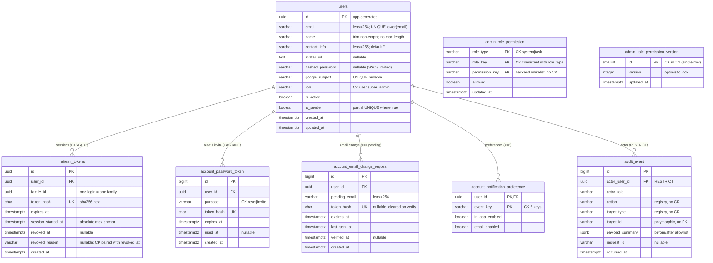

# account 與 admin 資料庫 schema（實體層）

> **受眾為寫 migration、repository 與 service 的工程師。** 圖面與表格保留 spec／ADR 的原始識別字，方便用 `grep` 回到來源條文。

- **定位**：[`core-data-model-er.md`](./core-data-model-er.md) 圖 2 回答「有哪些實體、彼此怎麼關聯」（概念層）；本文件回答「建哪些表與欄位、哪些規則 DB 擋不住、各用什麼測試驗證」（實體層）。
- **衍生視圖，不是正典**：與 spec 或 Accepted ADR 衝突時，以它們為準，並回頭修本文件。依據層級：feature spec ＞ foundation spec ＞ Accepted ADR ＞ Proposed ADR ＞ 本文件的設計建議。
- **範圍**：account 001–005、admin-006、admin-007。admin-007 規格仍為 **Draft**，且其表是否需要建立取決於 §5 D-9。
- **不歸屬任何單一 spec**：同一張 `users` 表被 001、003、005、006 共同修改，因此放在 `docs/diagrams/architecture/`，不隨任何 spec 進 `specs/_archive/`。各 spec 的 plan.md「實體與資料模型」段落應連結本文件，不各自複製欄位表。
- **狀態：草稿**。§5 仍有阻擋性待裁決，定案前不得據以產生 migration。
- **驗證方式**：本文件不執行 SQL。每條限制的正確性在實作時由 Alembic migration 的 upgrade／downgrade／roundtrip 測試，以及 §4 指定的測試驗證。

## 1. 關鍵設計決定

| 項目 | 決定 | 依據 |
|---|---|---|
| 權限判定 | 不加 `token_version` 欄；每個已認證請求重讀 `users.role`／`is_active` | ADR-021 修訂（明文否決 token versioning） |
| 表名與角色、狀態欄名 | 暫採 `users`、`refresh_tokens`、`role`、`is_active` | ADR-021 修訂、001 plan v2.1.0；與 FR-105、006 用語的衝突見 §5 N-1 |
| Google SSO 帳號的判定 | 維持 `hashed_password = null`，不改用 `google_subject IS NOT NULL` | 005 FR-008；ADR-035 修訂 |
| Google 連結時的既有密碼 | 同一交易清空 `hashed_password` 並撤銷該使用者全部 refresh token | ADR-035 修訂 |
| refresh token 重用偵測的撤銷範圍 | 該使用者全部 token | ADR-021；001 plan v2.1.0 |
| `users.name` 長度 | 不加上限 | 003 Clarifications（「不加長度上限」） |
| `users.email` 長度 | 254 | 001 plan v2.1.0 `String(254)` |
| 外部身分 | 不建獨立身分表，用 `users.google_subject` | ADR-035（單一 provider） |
| 角色權限矩陣表形 | 逐格一列（`admin_role_permission`）＋整份矩陣一個版本號（`admin_role_permission_version`，單列表） | 007 關鍵實體 RolePermissionMatrix、RolePermissionVersion |
| 矩陣樂觀鎖粒度 | 整份矩陣共用一個版本號，不逐格加版本 | 007 FR-005b、區塊 D（衝突時整頁重新載入） |
| `permission_key` 白名單 | 放在後端程式常數，不建權限鍵表 | 007 `PERMISSION_KEYS_SOURCE = backend_whitelist`、FR-003a |
| 約束命名 | 交給 `NAMING_CONVENTION`（`column_0_N_name`），不逐一手寫 `name=` | `backend/app/db/base.py` |

## 2. ERD

**表的來源**（001 plan v2.1.0 已定義 `users` 基本欄位與 `refresh_tokens`，以下只列其餘來源）：

| 表或欄位 | 來源 |
|---|---|
| `users.name`／`contact_info`／`avatar_url` | 005 實體 User；006 PlatformUser |
| `users.hashed_password` 可為 null | ADR-035 修訂（連結時設 null）、005 FR-008（SSO 帳號為 null）、006 FR-006a（受邀帳號尚未設密碼）；001 plan 仍寫 NOT NULL，見 §5 D-1 |
| `users.google_subject` | ADR-035 |
| `users.is_seeder` | 006 FR-008c；007 FR-008b |
| `refresh_tokens.family_id` | 005 FR-010 |
| `refresh_tokens.session_started_at` | foundation FR-076 |
| `refresh_tokens.revoked_reason` | foundation FR-075；限定只有被輪替的 token 可進入寬限期為設計建議 |
| `account_password_token` | 004；006 FR-006a；ADR-013（reset token 存於 DB） |
| `account_email_change_request` | 005 FR-004C–FR-004M |
| `account_notification_preference` | 005 FR-013B–FR-013E |
| `audit_event` | 006 FR-013、007 FR-010；表形依 ADR-032（**Proposed**，見 §5 D-4） |
| `admin_role_permission` | 007 關鍵實體 RolePermissionMatrix、「角色 × 權限預設矩陣（V1）」 |
| `admin_role_permission_version` | 007 關鍵實體 RolePermissionVersion、FR-005b |

## 3. 欄位字典

「可空」＝該欄可以是 null；「規則」欄的編號對應 §4。

### 3.1 users：平台帳號

一列＝一個能登入的人。email 註冊、Google 登入、管理員邀請建立的帳號都在這張表。

| 欄位 | 型別 | 可空 | 代表什麼 | 何時寫入／改變 | 規則 |
|---|---|---|---|---|---|
| `id` | uuid | 否 | 帳號的內部識別碼，由應用程式產生 | 建立帳號時 | X-04 |
| `email` | varchar(254) | 否 | 登入帳號，也是寄信地址 | 註冊／邀請時寫入；005 email 變更驗證成功或 006 管理員修改時改變 | U-01、U-02、E-06、E-08 |
| `name` | varchar | 否 | 顯示名稱 | 註冊時填；005 可改 | U-03 |
| `contact_info` | varchar(255) | 否（預設 `''`） | 使用者自填的聯絡方式文字，可為空字串 | 005 可改 | 005 FR-003 |
| `avatar_url` | text | 是 | 頭像位置；null＝未上傳，顯示預設頭像 | 005 上傳或移除並儲存時 | 005 FR-004H–FR-004J |
| `hashed_password` | varchar | **是** | 密碼雜湊。**null 有業務意義**：帳號沒有可用密碼（Google 帳號或尚未設密碼的受邀帳號），改密碼時不需輸入舊密碼 | 註冊、重設、改密碼時寫入；受邀帳號初始為 null；Google 連結時清為 null | U-09、U-10 |
| `google_subject` | varchar | 是 | Google 帳號的固定識別碼（OIDC `sub`）；Google 端 email 可變，因此以此識別 | 首次 Google 登入或連結時寫入 | U-10、U-11 |
| `role` | varchar | 否 | 平台層級角色 `user`／`super_admin`；**不是**任務內角色 | 建立時 `user`；006 升降級 | U-04、U-08、U-12 |
| `is_active` | boolean | 否 | false＝已停用：不能登入、不能 refresh，既有 access token 下個請求即 401 | 006 停用／啟用 | U-12–U-15 |
| `is_seeder` | boolean | 否 | 系統初始化時建立的超管，不可停用或降級；全表最多一位 | 只在初始化時設為 true | U-05–U-07 |
| `created_at` | timestamptz | 否 | 建立時間（UTC） | 建立時 | X-02 |
| `updated_at` | timestamptz | 否 | 最後修改時間 | 每次 UPDATE | X-02 |

### 3.2 refresh_tokens：登入 session

一列＝一張 refresh token。每次 refresh 換發新的一張、舊的標為已輪替，同一次登入的所有 token 以 `family_id` 串起。

| 欄位 | 型別 | 可空 | 代表什麼 | 何時寫入／改變 | 規則 |
|---|---|---|---|---|---|
| `id` | uuid | 否 | token 識別碼 | 發行時 | — |
| `user_id` | uuid → users | 否 | 所屬帳號（CASCADE） | 發行時 | — |
| `family_id` | uuid | 否 | 同一次登入（同一裝置）的輪替 token 共用此值；用於「改密碼保留目前裝置、登出其他裝置」 | 登入時產生；輪替時沿用 | R-04、R-08 |
| `token_hash` | char(64) | 否 | token 的 SHA-256 雜湊；DB 不存 token 原值 | 發行時 | — |
| `expires_at` | timestamptz | 否 | 到期時間 | 發行時 | R-07 |
| `session_started_at` | timestamptz | 否 | 這次登入最初的時間，輪替時不變；用於強制登入最長存續時間 | 登入時寫入；輪替時照抄 | R-04、R-07 |
| `revoked_at` | timestamptz | 是 | 撤銷時間；null＝未撤銷 | 輪替、登出、改密碼、停用等事件 | R-01、R-03 |
| `revoked_reason` | varchar | 是 | 撤銷原因；**只有 `rotated` 可進入寬限期重發** | 與 `revoked_at` 同時寫入 | R-01、R-02、R-05 |
| `created_at` | timestamptz | 否 | 發行時間 | 發行時 | — |

### 3.3 account_password_token：重設密碼／邀請設定密碼連結

一列＝一封信中的一次性連結。004 忘記密碼與 006 新增使用者後的設定密碼信共用此表。

| 欄位 | 型別 | 可空 | 代表什麼 | 何時寫入／改變 | 規則 |
|---|---|---|---|---|---|
| `id` | bigint | 否 | 流水號 | 建立時 | — |
| `user_id` | uuid → users | 否 | 連結所屬帳號（CASCADE） | 建立時 | — |
| `purpose` | varchar | 否 | `reset`＝忘記密碼；`invite`＝受邀帳號首次設定密碼 | 建立時 | P-03、P-06 |
| `token_hash` | char(64) | 否 | 連結 token 的雜湊 | 建立時 | — |
| `expires_at` | timestamptz | 否 | 到期時間 | 建立時 | P-01、P-06 |
| `used_at` | timestamptz | 是 | 使用或作廢時間；null＝未使用。**不另存狀態欄**：有效／已使用／已過期由 `used_at` 與 `expires_at` 推導 | 使用成功，或因改密碼、改 email、停用而作廢時 | P-01、P-02、P-05 |
| `created_at` | timestamptz | 否 | 寄出時間 | 建立時 | — |

### 3.4 account_email_change_request：email 變更申請

一列＝一次 email 變更申請。驗證完成前仍以舊 email 登入（005 FR-004D）。

| 欄位 | 型別 | 可空 | 代表什麼 | 何時寫入／改變 | 規則 |
|---|---|---|---|---|---|
| `id` | bigint | 否 | 流水號 | 建立時 | — |
| `user_id` | uuid → users | 否 | 申請人 | 建立時 | E-02 |
| `pending_email` | varchar(254) | 否 | 欲變更成的新 email，尚未生效 | 建立時；再次申請時覆蓋 | E-03 |
| `token_hash` | char(64) | 是 | 驗證連結 token 的雜湊；驗證成功後清為 null，因此非 null＝等待驗證中 | 建立／重新申請時寫入；驗證成功時清空 | E-01、E-04 |
| `expires_at` | timestamptz | 否 | 驗證連結到期時間 | 建立／重新申請時 | E-04 |
| `last_sent_at` | timestamptz | 否 | 最後一次寄出驗證信的時間，用於重送冷卻 | 每次寄信時 | E-05 |
| `verified_at` | timestamptz | 是 | 驗證完成時間；null＝未完成 | 驗證成功時 | E-01、E-02、E-07 |
| `created_at` | timestamptz | 否 | 申請時間 | 建立時 | — |

### 3.5 account_notification_preference：通知開關

一列＝某帳號對某通知事件的兩個開關；每人最多 6 列。

| 欄位 | 型別 | 可空 | 代表什麼 | 何時寫入／改變 | 規則 |
|---|---|---|---|---|---|
| `user_id` | uuid → users | 否 | 設定所屬帳號（主鍵之一） | 儲存設定時 | — |
| `event_key` | varchar | 否 | 通知事件（主鍵之一），限 005 定義的 6 個：`annotation_complete`、`review_complete`、`dry_run_all_done`、`formal_annotation_all_done`、`assignment_created_annotator`、`assignment_created_reviewer` | 儲存設定時 | N-01 |
| `in_app_enabled` | boolean | 否 | 是否發站內通知 | 儲存設定時 | N-03 |
| `email_enabled` | boolean | 否 | 是否寄 email | 儲存設定時 | N-03 |

### 3.6 audit_event：操作稽核紀錄

一列＝一次需留紀錄的操作（006 FR-013：新增、編輯、停用、啟用、角色變更；007 FR-010：角色權限矩陣儲存）。只能新增。

| 欄位 | 型別 | 可空 | 代表什麼 | 何時寫入／改變 | 規則 |
|---|---|---|---|---|---|
| `id` | bigint | 否 | 流水號 | 寫入時 | — |
| `actor_user_id` | uuid → users | 否 | 操作者；FK 為 RESTRICT，有稽核紀錄的帳號不可實體刪除。007 操作紀錄抽屜顯示的「操作者名稱」讀取時以此欄 join `users.name`（顯示目前名稱） | 與被稽核操作同一交易 | A-01、A-04 |
| `actor_role` | varchar | 否 | 操作**當下**的角色快照（ADR-032） | 同上 | — |
| `action` | varchar | 否 | 命名空間動詞，例如 `member.deactivated`；值由 registry 管理，DB 不加 CHECK | 同上 | — |
| `target_type` | varchar | 否 | 操作對象種類，例如 `user` | 同上 | — |
| `target_id` | varchar | 否 | 操作對象識別碼；對象可能在任何表，不加 FK | 同上 | X-04 |
| `payload_summary` | jsonb | 否 | 變更前後摘要，只含 allowlist 欄位 | 同上 | A-03 |
| `request_id` | varchar | 是 | 對應 API log 的請求 ID | 同上 | — |
| `occurred_at` | timestamptz | 否 | 伺服器端發生時間（UTC） | 同上 | A-02 |

### 3.7 admin_role_permission：角色權限矩陣的一格

一列＝某個角色對某個 `permission_key` 是否允許。只存 007 預設矩陣中有意義的格：system role × 平台層級鍵（9 個鍵 × 2 個角色），task role × 任務層級鍵（7 個鍵 × 3 個角色），共 39 列；矩陣中標「⛔（需 task role）」的格不存（見 §5 D-13）。

| 欄位 | 型別 | 可空 | 代表什麼 | 何時寫入／改變 | 規則 |
|---|---|---|---|---|---|
| `role_type` | varchar | 否 | `system`＝平台層級角色；`task`＝任務內角色。兩層不可互相推導（007 授權判斷規則） | migration 建立 | M-01 |
| `role_key` | varchar | 否 | `role_type='system'` 時為 `user`／`super_admin`；`task` 時為 `project_leader`／`reviewer`／`annotator` | migration 建立 | M-01 |
| `permission_key` | varchar | 否 | 007「權限鍵白名單（V1）」中的鍵，例如 `task.create`；白名單在後端程式，DB 不加 CHECK | migration 建立；白名單增減時由 migration 補列或刪列 | M-02、M-08 |
| `allowed` | boolean | 否 | 是否允許。**注意**：007 預設矩陣中 reviewer 的 `task.detail.view` 標為「✅（唯讀）」，boolean 表達不了，見 §5 D-10 | migration 寫入 V1 預設值；007 儲存時改變 | M-03、M-04 |
| `updated_at` | timestamptz | 否 | 最後一次被改變的時間 | 該格值改變時 | X-02 |

### 3.8 admin_role_permission_version：矩陣版本號

整張表只有一列（`id = 1`）。每次儲存成功，版本號加一；儲存時帶上讀取當下的版本號，不一致就拒絕（007 FR-005b）。操作者與變更內容記在 `audit_event`，這張表不重複記。

| 欄位 | 型別 | 可空 | 代表什麼 | 何時寫入／改變 | 規則 |
|---|---|---|---|---|---|
| `id` | smallint | 否 | 固定為 1，保證單列 | migration 建立 | M-06 |
| `version` | integer | 否 | 目前矩陣版本，初始為 1；前端讀取時一併取得，儲存時送回 | 每次有實際變更的儲存 +1 | M-06、M-07 |
| `updated_at` | timestamptz | 否 | 最後一次儲存時間 | 與 `version` 同時 | X-02 |

## 4. 限制清單（ERD 表達不了的規則）

類型：**CK**＝CHECK 與欄位互動／**SM**＝狀態轉換／**CC**＝併發保護／**CD**＝條件式必填或禁填／**XT**＝跨表連動（同一交易）／**PT**＝跨方言可攜性。

測試層級：**M**＝migration roundtrip（SQLite＋CI PG）／**DB**＝直接寫入違規資料並斷言 `IntegrityError`（SQLite 與 PG 各跑一次）／**PG**＝只在 CI 的 PostgreSQL 跑／**SVC**＝service 層測試／**API**＝route 整合測試。測試名稱是預定名稱，實作時可調整，但每條都必須有對應測試。

### 4.1 users

| ID | 類型 | 規則 | 執行位置 | 實作時驗證 | 來源 |
|---|---|---|---|---|---|
| U-01 | CK | email 不分大小寫唯一；同一列只改大小寫不衝突 | DB 表達式唯一索引 `lower(email)` | DB：大小寫不同的兩列不可並存；同列改大小寫成功 | **設計建議**，規格未明文，見 §5 D-8 |
| U-02 | PT | SQLite `lower()` 只處理 ASCII，PG 不是；應用層先正規化 email 再寫入，兩種 DB 的唯一性語意才一致 | 應用層＋DB | SVC：非 ASCII 大小寫的 email 在兩種 DB 判定一致 | ADR-024（SQLite／PG 雙層） |
| U-03 | CK | `trim(name)` 非空；不加長度上限 | DB＋Pydantic | DB：全空白失敗；10,000 字元成功 | 003 FR-005A、003 Clarifications |
| U-04 | CK | `role IN ('user','super_admin')` | DB | DB：未知值失敗 | 006 PlatformUser、ADR-021 |
| U-05 | CK | seeder 必定是 active super_admin：`NOT is_seeder OR (role='super_admin' AND is_active)` | DB | DB：seeder 列停用或降級各失敗 | 006 FR-008c；007 FR-008b |
| U-06 | CK | 最多一位 seeder | DB 部分唯一索引 `WHERE is_seeder` | DB：第二筆失敗；M：downgrade 後索引消失 | 006 FR-008c |
| U-07 | SM | `is_seeder` 只能在初始化時設為 true，之後不可改回 false 或移轉；seeder 列不可刪除。U-05 只檢查單列當下狀態，不涵蓋旗標本身的變更，因此需另外保證 | 應用層不提供此路徑＋PG trigger | SVC：清除旗標被拒；PG：直接 UPDATE 旗標或 DELETE seeder 列被 trigger 擋下 | 006 FR-008c；007 FR-008b（含刪除） |
| U-08 | CC | 任何時刻至少一位 active super_admin，**併發**停用或降級時也必須成立。不得採「先查數量、再更新」的兩步寫法（SQLite 驅動延遲開始交易，兩步之間沒有鎖） | 單一條件式 UPDATE（條件內含 active super_admin 數量 > 1），依 rowcount 判定；或 SQLite 改用 `BEGIN IMMEDIATE` | SVC（SQLite）與 PG：兩個連線同時停用彼此 → 恰一個成功，active super_admin ≥ 1 | 006 FR-008d |
| U-09 | CD | `hashed_password` 為 null 時可免舊密碼設定密碼；判定條件不得改為 `google_subject IS NOT NULL`，否則已設密碼又連結 Google 的帳號會被免除舊密碼驗證 | 應用層 | API：有密碼且有 `google_subject` 的帳號改密碼時缺 `current_password` → 拒絕 | 005 FR-006、FR-008 |
| U-10 | XT | Google 連結（email 相符且 `email_verified=true`）時同一交易：寫入 `google_subject`、`hashed_password=null`、撤銷全部 refresh token；`email_verified` 非 true → 拒絕，不寫任何列 | 應用層單一交易 | SVC：連結後密碼為 null、token 全撤銷；`email_verified=false` → 無任何寫入；中途失敗 → 全部回滾 | ADR-035 修訂 |
| U-11 | CD | `google_subject` 唯一，且允許多筆 null | DB | DB：兩筆 null 成功、兩筆相同值失敗（SQLite＋PG） | ADR-035 |
| U-12 | SM | 停用與降級立即生效：每個已認證請求重讀 `role`、`is_active`；停用 → 401、降級 → 403；`/auth/refresh` 也檢查 `is_active` | 應用層（`get_current_user`、`require_role`） | API：停用後同一 access token → 401；降級後打 super_admin 端點 → 403；停用後 refresh → 401 | ADR-021 修訂 |
| U-13 | XT | 停用時同一交易：`is_active=false`、撤銷全部 refresh token、作廢未使用的 password token、清除 pending email 變更申請 | 應用層單一交易 | SVC：停用前發出的邀請連結與 email 驗證連結皆失效 | 006 FR-008a；password token 與 email 申請的作廢為設計建議 |
| U-14 | XT | 重新啟用不恢復任何已撤銷的 token | 應用層 | SVC：停用→啟用後，舊 refresh token 仍 401 | 006 FR-008b；001 plan（refresh token 單向轉換） |
| U-15 | CC | Google callback 也檢查 `is_active`；停用帳號不得取得 session | 應用層 | API：停用帳號走 callback → 拒絕，不寫 refresh token | ADR-021 修訂 |

### 4.2 refresh_tokens

| ID | 類型 | 規則 | 執行位置 | 實作時驗證 | 來源 |
|---|---|---|---|---|---|
| R-01 | CK | `revoked_at` 與 `revoked_reason` 同時為 null 或同時非 null | DB | DB：只填其一 → 失敗 | 設計建議（配合 R-05） |
| R-02 | CK | `revoked_reason IN ('rotated','logout','password_changed','email_changed','password_reset','user_disabled','reuse_detected','account_linked')` | DB | DB：未知值失敗 | 005 FR-010、FR-004K；006 FR-008a；ADR-021；ADR-035 |
| R-03 | SM | 只能由有效轉為已撤銷，不可回復 | 應用層（repository 不提供回復方法）；R-01 擋下只清一欄 | SVC：repository 無回復方法；同時清兩欄在 DB 層仍可寫，列為已知限制 | 001 plan 狀態轉換 |
| R-04 | XT | 輪替：舊列標 `rotated`＋新增一列（沿用 `family_id`、`session_started_at`）於同一交易 | 應用層 | SVC：新增失敗 → 舊列仍有效 | foundation FR-016；001 plan |
| R-05 | CC | 寬限期重發僅限 `revoked_reason='rotated'` 且 `now - revoked_at <= REFRESH_TOKEN_GRACE_PERIOD`；其他撤銷原因一律拒絕 | 應用層（時間比較在 SQL 端） | API：兩個並發 refresh 都成功；登出後寬限期內重用 → 401；超過寬限期重用已輪替 token → 該使用者全部 token 撤銷 | foundation FR-075；ADR-021；限定 `rotated` 為設計建議 |
| R-06 | CC | 寬限期內重發次數的上限 | 應用層；可能需新增欄位 | 待 §5 D-3 定案後補測試 | foundation FR-075 |
| R-07 | CK | `expires_at > session_started_at`；且 `expires_at <= session_started_at + REFRESH_TOKEN_ABSOLUTE_MAX_TTL` | DB（第一條）＋應用層（第二條含設定值，不寫死在 DB） | DB：違反第一條失敗；SVC：接近上限時輪替不延長超過上限 | foundation FR-076 |
| R-08 | XT | 改密碼成功：撤銷同一使用者其他 `family_id` 的 token，保留目前 family | 應用層 | API：兩裝置登入，A 改密碼 → B refresh 401、A refresh 成功 | 005 FR-010 |
| R-09 | XT | email 驗證成功：撤銷該使用者全部 token（含目前裝置） | 應用層 | API：驗證後原裝置 refresh → 401 | 005 FR-004K |

### 4.3 account_password_token

| ID | 類型 | 規則 | 執行位置 | 實作時驗證 | 來源 |
|---|---|---|---|---|---|
| P-01 | SM | 狀態由資料推導：`used_at` 非 null → used；否則 `now > expires_at` → expired；否則 valid | 應用層 | SVC：三種狀態各一 | 004 FR-009 |
| P-02 | CC | 一次性使用：`UPDATE ... SET used_at=now WHERE id=:id AND used_at IS NULL AND expires_at > now`，rowcount=0 視為失效 | 條件式 UPDATE | SQLite 與 PG：同一 token 兩個連線同時使用 → 恰一個成功 | ADR-013（one-time token） |
| P-03 | CK | 同一使用者同一 `purpose` 最多一筆未使用 token | DB 部分唯一索引 `(user_id, purpose) WHERE used_at IS NULL` | DB：第二筆未使用失敗；M：PG 與 SQLite 的部分索引都生效 | 設計建議 |
| P-04 | CC | 同一 email 併發的忘記密碼請求觸發 P-03 衝突時，回應必須與一般情況相同 | 應用層處理 `IntegrityError` | API：並發兩請求，兩個回應的 status 與 body 相同，且與不存在的 email 相同 | 004 FR-004 |
| P-05 | XT | 改密碼成功、email 驗證成功、停用帳號時，作廢該使用者全部未使用 token | 應用層同一交易 | SVC：改 email 後，舊信箱中的重設連結失效 | 設計建議（延伸 005 FR-004K、006 FR-008a 的撤銷範圍） |
| P-06 | CD | `purpose='invite'` 的有效期限 | — | 待 §5 D-2 | 006 FR-006a |
| P-07 | XT | 006 新增使用者＝建立帳號＋建立 invite token＋寄信；寄信失敗不得留下使用者列。不得在持有 DB 寫入鎖時呼叫外部寄信服務 | 應用層 | SVC：模擬寄信失敗 → `users` 無此 email；API：回應顯示寄信錯誤 | 006 FR-006b |

### 4.4 account_email_change_request

| ID | 類型 | 規則 | 執行位置 | 實作時驗證 | 來源 |
|---|---|---|---|---|---|
| E-01 | CK | `verified_at` 為 null ⇔ `token_hash` 非 null | DB | DB：兩者同時為 null、同時非 null 各失敗 | 005 FR-004E |
| E-02 | CK | 每位使用者最多一筆等待驗證的申請（`verified_at IS NULL`） | DB 部分唯一索引 | DB：第二筆失敗；已驗證的歷史列可多筆 | 005 FR-004M |
| E-03 | SM | 新申請覆蓋同一列的 `pending_email`、`token_hash`、`expires_at`、`last_sent_at`，舊 token 立即失效 | 應用層 | API：申請 a 再申請 b → a 的連結失效 | 005 FR-004M |
| E-04 | CC | 驗證以條件式 UPDATE 完成：`SET verified_at=now, token_hash=NULL WHERE id=:id AND token_hash=:h AND verified_at IS NULL AND expires_at > now`，rowcount=1 才更新 `users.email` | 條件式 UPDATE | PG：驗證舊連結與送出新申請同時發生 → 不得以舊的 `pending_email` 寫入 | 005 FR-004M |
| E-05 | CC | 重送冷卻：`WHERE last_sent_at <= now - cooldown` 條件式 UPDATE | 應用層 | API：冷卻時間內連點兩次 → 只寄一封 | 005 FR-004L |
| E-06 | XT | 驗證時新 email 已被他人使用 → 觸發 U-01，回「Email 已被使用」，本列不變 | DB＋應用層 | API：兩人申請同一 email，先驗證者成功，後者得到可理解的錯誤 | 005 邊界情況 |
| E-07 | XT | 驗證成功同一交易：更新 `users.email`、清除 token、撤銷全部 refresh token（R-09）、作廢 password token（P-05） | 應用層 | SVC：任一步失敗 → 全部回滾 | 005 FR-004E、FR-004F、FR-004K |
| E-08 | XT | 管理員在 006 修改 email 時，同一交易清除該使用者等待中的變更申請，避免之後的驗證覆蓋管理員的修改 | 應用層 | SVC：使用者申請 x → 管理員改為 y → 使用者點連結失效，email 維持 y | 006 FR-007 |

### 4.5 account_notification_preference

| ID | 類型 | 規則 | 執行位置 | 實作時驗證 | 來源 |
|---|---|---|---|---|---|
| N-01 | CK | `event_key` 限 005 定義的 6 個值 | DB＋Pydantic `Literal` | DB：未知值失敗；M：downgrade 移除 CHECK | 005 FR-013E |
| N-02 | CD | 沒有資料列時的預設值 | — | 待 §5 D-5 | 005 |
| N-03 | XT | 儲存為整份覆蓋：同一交易 upsert 6 列 | 應用層 | SVC：連續儲存兩次結果一致，列數恆為 6 | 005 FR-013E |

### 4.6 audit_event

| ID | 類型 | 規則 | 執行位置 | 實作時驗證 | 來源 |
|---|---|---|---|---|---|
| A-01 | XT | 與被稽核的異動同一交易寫入；任一方失敗則兩者皆不留 | 應用層 | SVC：模擬稽核寫入失敗 → 使用者列不變 | 006 FR-013；ADR-032 |
| A-02 | SM | 只能新增，禁止 UPDATE | 應用層＋DB trigger（兩種 DB 各一份） | SQLite 與 PG：直接 UPDATE 被 trigger 擋下；M：downgrade 移除 trigger | ADR-032（Proposed） |
| A-03 | CD | `payload_summary` 只含 allowlist 欄位（`name`、`email`、`role`、`is_active`、`contact_info`），不得含 `hashed_password`、任何 token 或雜湊 | 應用層 allowlist | SVC：改密碼、停用等操作後，`payload_summary` 不含上述鍵 | 006 FR-013；ADR-032 |
| A-04 | CK | `actor_user_id` 的 FK 為 RESTRICT | DB | SQLite 與 PG：刪除有稽核紀錄的使用者 → 失敗（SQLite 依賴 X-01） | 設計建議 |
| A-05 | CD | 角色權限矩陣的稽核紀錄至少保存 1 年；日後的清理作業不得刪除未滿 1 年的這類紀錄 | 清理作業的條件 | SVC：清理作業執行後，未滿 1 年的矩陣稽核紀錄仍在 | 007 FR-010；ADR-032 的保存期限尚未訂定 |
| A-06 | CD | 矩陣儲存的 `payload_summary` 記錄版本號前後值與每個變更格的 `role_type`、`role_key`、`permission_key`、前後值；diff 由伺服器比對儲存前後的資料列算出，不採用前端送來的 diff | 應用層 | SVC：前端送出的 diff 與實際變更不一致時，稽核紀錄以實際變更為準 | 007 FR-010、區塊 C；伺服器端計算為設計建議 |

### 4.7 admin_role_permission 與 admin_role_permission_version

以下規則的前提是 §5 D-9 選 (a) 或 (b)；若選 (c)，這兩張表與本節整節刪除。

| ID | 類型 | 規則 | 執行位置 | 實作時驗證 | 來源 |
|---|---|---|---|---|---|
| M-01 | CK | `role_type IN ('system','task')`，且 `role_key` 與 `role_type` 一致：system 限 `user`／`super_admin`，task 限 `project_leader`／`reviewer`／`annotator` | DB | DB：`('task','super_admin', …)` 失敗；未知 `role_type` 失敗 | 007 `SYSTEM_ROLES`、`TASK_ROLES`、授權判斷規則 |
| M-02 | CD | `permission_key` 必須在後端白名單內，且層級相符：system 列只能用平台層級鍵，task 列只能用任務層級鍵 | 應用層（白名單常數附帶層級屬性） | API：送出白名單外的鍵 → 拒絕；送出 system × `task.detail.view` → 拒絕 | 007 FR-003a、SC-009、預設矩陣中的「⛔（需 task role）」；層級屬性為設計建議 |
| M-03 | CK | `super_admin` 的所有 `admin.*` 格必須為 true | DB CHECK：`NOT (role_type='system' AND role_key='super_admin' AND permission_key LIKE 'admin.%') OR allowed` | DB：把其中任一格改為 false 失敗；API：錯誤訊息指出是哪一格 | 007 FR-008a、邊界情況（指出哪個組合有問題） |
| M-04 | CK | `user` 的所有 `admin.*` 格必須為 false | DB CHECK（形式同 M-03） | DB：把其中任一格改為 true 失敗 | 由 007 FR-002 與使用者故事 3 行為規則（admin 兩頁僅允許 `super_admin`）推得；是否另訂其他不可變更的格見 §5 D-13 |
| M-05 | CD | 儲存後的列集合必須恰好等於「白名單 × 適用角色」；不得缺列或多列 | 應用層 | SVC：送出缺一格的矩陣 → 拒絕且資料不變 | 007 FR-003b、FR-003c；設計建議 |
| M-06 | CC | 樂觀鎖：`UPDATE admin_role_permission_version SET version = version + 1 … WHERE id = 1 AND version = :expected`，rowcount = 0 → 回傳版本衝突，本次所有變更不寫入 | 條件式 UPDATE | SQLite 與 PG：兩個連線帶同一版本號同時儲存 → 恰一個成功，另一個收到衝突 | 007 FR-005b、SC-007 |
| M-07 | XT | 儲存在同一交易內完成：M-06 版本檢查、更新變更的格、寫入 `audit_event`（A-01、A-06）。沒有任何格改變的儲存不加版本、不寫稽核紀錄 | 應用層單一交易 | SVC：稽核寫入失敗 → 矩陣與版本號皆不變；空變更儲存 → 版本號不變、無稽核紀錄 | 007 FR-004、FR-010；空變更的處理為設計建議 |
| M-08 | SM | 白名單新增鍵時，同一個 migration 為每個適用角色補列，初始值取 V1 預設矩陣；未列在預設矩陣的新鍵預設 false。授權判斷查不到列時一律視為不允許 | migration＋應用層 | M：新增鍵的 migration 後列數正確；SVC：刪除某列後該權限判斷為不允許 | 設計建議，見 §5 D-12 |
| M-09 | CD | 讀取矩陣、讀取矩陣稽核紀錄、儲存矩陣三個端點都在伺服器端以 `require_role(super_admin)` 驗證 | 應用層 | API：`user` 呼叫三個端點皆 403；未登入 401 | 007 FR-002、FR-008、使用者故事 3 行為規則；ADR-021 修訂 |

### 4.8 跨表與基礎設施

| ID | 類型 | 規則 | 執行位置 | 實作時驗證 | 來源 |
|---|---|---|---|---|---|
| X-01 | PT | SQLite 必須開啟 `PRAGMA foreign_keys=ON`，否則 FK、CASCADE、RESTRICT 在 quick-start 層都不生效 | engine connect 事件 | DB（SQLite）：寫入不存在的 `user_id` → 失敗 | ADR-024（SQLite／PG 雙層） |
| X-02 | PT | SQLite 讀回 `DateTime(timezone=True)` 不帶時區，與 aware datetime 比較會丟例外；以 TypeDecorator 讀回補 UTC，或時間比較一律在 SQL 端 | ORM 型別 | DB（SQLite）：寫入 UTC、讀回後與 `datetime.now(timezone.utc)` 比較不丟例外 | ADR-024（SQLite／PG 雙層） |
| X-03 | PT | Alembic `render_as_batch=True`，否則 SQLite 無法 ALTER 既有表 | `alembic/env.py` | M：對既有表加欄的 migration 在 SQLite roundtrip 通過 | ADR-024（SQLite／PG 雙層） |
| X-04 | PT | UUID 字串形式統一為小寫含連字號；SQLite 的 `Uuid` 以 32 位無連字號儲存，SQL 端直接比對字串不會相等 | 應用層在 Python 端比對；`target_id` 寫入前正規化 | DB（SQLite＋PG）：`audit_event.target_id` 與 `str(users.id)` 比對相等 | ADR-024（SQLite／PG 雙層） |
| X-05 | M | 每張表的 upgrade／downgrade／roundtrip 在 SQLite 與 PG 都通過；約束名稱符合 `NAMING_CONVENTION` | Alembic | M：`upgrade head → downgrade base → upgrade head`；PG 查 `pg_constraint` 名稱 | ADR-024；`backend/app/db/base.py` |

## 5. 待裁決（影響 migration）

| ID | 題目 | 選項 | 建議 | 阻擋 migration |
|---|---|---|---|---|
| N-1 | 表名與欄名：ADR-021、001 plan 用 `users`、`refresh_tokens`、`role`、`is_active`；foundation FR-105 要求單數並以模組前綴；006 PlatformUser 用 `system_role`、`status` | (a) 沿用 ADR／plan 名稱，新表依 FR-105（本文件現況，兩種風格混用）(b) 全部依 FR-105，回頭修 ADR-021、ADR-035、001 plan (c) 全部依 ADR 名稱 | (a) 或 (b)，必須在第一個 migration 前定案 | **是** |
| D-1 | 001 plan 的 `hashed_password NOT NULL` 與 ADR-035、005 FR-008、006 受邀帳號衝突 | 改為可空（001 plan 小改版） | 改為可空 | **是** |
| D-2 | invite token 有效期限（006 未定義）；被作廢的 token 在 004 三種狀態中顯示為哪一種 | 沿用 reset 的期限或另訂；作廢顯示為 used | 補 006 條文 | 否 |
| D-3 | 寬限期內重發次數上限（R-06） | (a) 同一張已輪替 token 只能重發一次，新增 `grace_reissued_at` 欄 (b) 不設上限 | (a) | **是**（決定是否多一欄） |
| D-4 | 稽核依 Proposed ADR-032 建共用表，或 006 自建表；另外 ADR-032 事件模型含 `task_id`、表名為 `audit_events`，本文件兩者皆未採用 | (a) ADR-032 先轉 Accepted，表形完全依 ADR (b) 006 自建 `admin_user_audit_log`。另外 ADR-032 的 admin 動作清單沒有矩陣儲存的動作，保存期限也未訂，而 007 FR-010 要求至少 1 年（A-05） | (a)，`task_id` 保留為可空欄以供後續模組使用；ADR-032 補矩陣儲存動作與保存期限 | **是** |
| D-5 | 通知偏好沒有資料列時的預設值 | 全開／全關 | 補 005 條文 | 否 |
| D-6 | foundation FR-077 要求高風險事件能立即作廢 access token；ADR-021 修訂只處理角色與停用並否決 token versioning，改密碼與改 email 沒有指定機制 | (a) 接受 access token 剩餘有效期作為窗口，並記錄於 ADR-021 (b) 每個請求比對密碼／email 變更時間與 JWT `iat` (c) 重新評估 token versioning | 需維護者於 ADR 層裁決 | **是**（可能多一欄） |
| D-7 | seeder 由誰、何時建立 | bootstrap 指令／data migration／環境變數指定首位 super_admin | bootstrap 指令 | 否 |
| D-8 | email 唯一性是否不分大小寫（U-01）；規格只規定 006 搜尋不分大小寫（006 FR-004a） | (a) 不分大小寫，表達式唯一索引 (b) 區分大小寫，一般唯一索引 | (a)，並補 003 條文 | **是**（決定索引形狀） |
| D-9 | 矩陣是否真的參與授權判斷。007 使用者故事 2 寫「新配置成為平台後續授權判斷基準」，但 ADR-021 的 `require_role` 以程式內的角色集合判斷、007 使用者故事 3 要求 admin 兩頁用 RoleGuard 僅允許 `super_admin`、014 AC-2.2／AC-2.4 以固定的 task role 決定能否進入頁面，且沒有任何其他 spec 或 ADR 引用 `permission_key` | (a) 矩陣為授權依據：所有守門改查 `permission_key`，需新 ADR，並改寫 006、014、015 以鍵描述權限；每次請求讀矩陣或依 foundation FR-054 快取 (b) 矩陣可編輯並留稽核，但守門仍依角色，007 需改寫使用者故事 2 並在畫面上說明 (c) V1 矩陣改為唯讀展示，刪除編輯、樂觀鎖、稽核需求（007 MAJOR 改版），不建 §3.7、§3.8 兩張表 | 需維護者依論文需求裁決；技術面傾向 (c)：沒有下游使用者，且 (a) 無法表達 014／015 中「reviewer 唯讀」「只看自己的工時」這類規則 | **是**（決定兩張表是否存在） |
| D-10 | reviewer 的 `task.detail.view` 在預設矩陣標為「✅（唯讀）」，但 `allowed` 是 boolean；白名單也沒有「編輯任務詳情」的鍵 | (a) 新增鍵 `task.detail.edit`，`allowed` 維持 boolean (b) `allowed` 改為三值（不允許／唯讀／完整） | (a) | **是**（D-9 選 (a)、(b) 時；決定欄位型別或列數） |
| D-11 | 007 授權判斷規則允許同一人在同一任務同時有多個 task role，但 014 FR-005d 在新增成員時排除已在任務中的人，`TaskMembership` 每列只有一個 `task_role` | (a) 允許多角色，`task_membership` 唯一鍵為 `(task_id, user_id, task_role)`，014 補條文 (b) 一人一角色，唯一鍵為 `(task_id, user_id)`，007 刪除多角色條文 | 屬 task-management 盤點範圍，於該模組盤點時裁決 | 否（不影響本文件的表） |
| D-12 | 白名單新增鍵時的預設值（M-08） | (a) 取 V1 預設矩陣，未列者為 false (b) 一律 false (c) 一律 true | (a) | 否 |
| D-13 | 除了 M-03、M-04，是否還有不可變更的格。例如 `user` 的 `dashboard.view` 若可關閉，007 FR-007 的無權限導向目標 `/dashboard` 本身就不可進入；「⛔（需 task role）」的格是否完全不存 | 列出固定格清單並補 007 條文；⛔ 格不存 | 固定 `dashboard.view`；⛔ 格不存 | 否（不改表形，只改 CHECK 與種子資料） |

## 6. 刻意不做

- 不建外部身分表：單一 provider，用 `users.google_subject`（ADR-035）。
- 不建登入失敗計數或鎖定欄位：005 FR-009 明文不啟用鎖定或節流。
- 不為 `role`、`is_active`、`created_at` 建索引：目前規模不需要。
- 不建 `token_version`：ADR-021 修訂否決（但見 §5 D-6）。
- 不提供使用者實體刪除，只能停用。
- 不建權限鍵表：白名單以後端程式常數為唯一來源（007 `PERMISSION_KEYS_SOURCE`）。
- 不在矩陣表存操作者：操作者與變更內容只記在 `audit_event`，避免兩處不一致。

## 7. 維護方式

- 上游 spec 或 ADR 異動涉及本文件的表、欄位或規則時，同一個 PR 更新本文件。
- §5 每項定案後：刪除該列、把結果寫回 §1 或 §4 對應位置，並在來源欄引用定案的 spec／ADR 版本。
- 實作時若測試證明某條規則寫錯，先修本文件，再修程式。
- 新增其他模組的表時另開文件，不擴充本檔範圍；本檔只描述 account 與 admin（006、007）。
