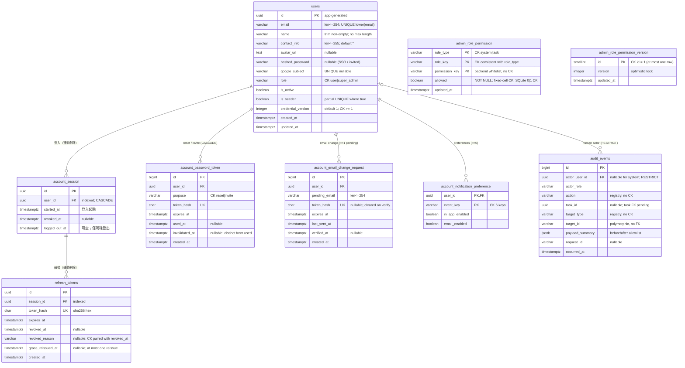

# account 與 admin 資料庫 schema（實體層）

> **受眾為寫 migration、repository 與 service 的工程師。** 圖面與表格保留 spec／ADR 的原始識別字，方便用 `grep` 回到來源條文。

- **定位**：[`core-data-model-er.md`](./core-data-model-er.md) 圖 2 回答「有哪些實體、彼此怎麼關聯」（概念層）；本文件回答「建哪些表與欄位、哪些規則 DB 擋不住、各用什麼測試驗證」（實體層）。
- **衍生視圖，不是正典**：依 [`SDD 權威矩陣`](../../sdd-workflow.md#0-權威矩陣與衝突裁決)，衝突裁決順序為主憲法 → 適用的 domain constitution → Accepted ADR → canonical feature spec → 衍生視圖；Proposed ADR 不改變現行規則。發現衝突時須回到正典裁決並修正本文件。
- **範圍**：account 001–005、account-020、admin-006、admin-007。admin-007 規格仍為 **Draft**；Accepted ADR-037 已裁決保留兩張可編輯矩陣候選表。
- **不歸屬任何單一 spec**：同一張 `users` 表被 001、003、005、006 共同修改，因此放在 `docs/diagrams/architecture/`，不隨任何 spec 進 `specs/_archive/`。各 spec 的 plan.md「實體與資料模型」段落應連結本文件，不各自複製欄位表。
- **狀態：草稿**。九張表均為候選，尚未建立 migration；其他模組的實體鍵與 FK 仍需另行設計，不得據此宣稱已部署。
- **NoteCraft 規劃檢視**：[`database-schema.er.json`](./database-schema.er.json) 對應 `/view/diagrams/architecture/database-schema.er` 的 Wiki／Diagram。本文件 §3 供應其中 account/admin 的 9 張候選表（64 欄、6 個候選單欄 FK）；[dataset 字典](./dataset-db-schema.md)另供應 5 張／31 欄／6 FK，[task/run 字典](./task-run-db-schema.md)供應 13 張／112 欄／15 FK，[annotation/review 字典](./annotation-review-db-schema.md)供應 8 張／82 欄／14 FK，[匯出字典](./task-export-db-schema.md)供應 2 張候選表／27 欄／2 個候選單欄 FK，全圖合計 37 張候選表／316 欄／43 個候選單欄 FK。兩張權限矩陣表已由 ADR-037 確認保留為候選，目前已落地業務表仍為 0。quality／IAA 專用表依 MVP 範圍延後，工時仍在[盤點總帳](./database-table-inventory.md)待逐表設計。改動任一欄位字典後執行 `node scripts/check-database-schema.mjs` 檢查投影差異。
- **驗證方式**：本文件不執行 SQL。每條限制的正確性在實作時由 Alembic migration 的 upgrade／downgrade／roundtrip 測試，以及 §4 指定的測試驗證。

## 1. 關鍵設計決定

| 項目 | 決定 | 依據 |
|---|---|---|
| 權限判定與憑證作廢 | 每個已認證請求重讀 `users.role`／`is_active`／`credential_version`；JWT 的 `credential_version` 不符即拒絕。`credential_version` 僅處理憑證失效，不承載角色版本 | ADR-021、account-020 FR-002／FR-010 |
| 表名與角色、狀態欄名 | 沿用既有契約 `users`、`refresh_tokens`、`role`、`is_active`；登入工作階段表採 `account_session`；既有 auth 表名仍依正典契約保留。例外均由 FR-105 明列 | ADR-021、foundation FR-105、account-020；原 N-1 已裁決 |
| 共用稽核表 | 唯一共用候選表名為 `audit_events`，作為 FR-105 的明列例外；人員事件以 `actor_user_id → users` 留參照，系統事件的 actor 為 null；`task_id` 先保留可空 UUID 作用域，不虛構尚未定案的 task FK | Accepted ADR-032、foundation FR-105、006 FR-013、007 FR-010；原 D-4 已裁決 |
| Google SSO 帳號的判定 | 維持 `hashed_password = null`，不改用 `google_subject IS NOT NULL` | 005 FR-008；ADR-035 修訂 |
| Google 連結時的既有密碼 | 同一交易清空 `hashed_password` 並撤銷該使用者全部 refresh token | ADR-035 修訂 |
| refresh token 重用偵測的撤銷範圍 | 寬限期內最多一次重發；逾期重用撤銷該使用者全部有效工作階段，並拒絕請求 | ADR-021、account-020 FR-003／FR-004 |
| session 表形 | 一次登入一列 `account_session`；輪替權杖只持有 `session_id`，使用者與開始時間由登入工作階段取得；`logged_out_at` 僅記錄可驗證的明確登出成功，`revoked_at` 記錄任何原因造成的失效 | ADR-021、account-020 FR-001／FR-002 |
| email 識別 | 寫入前以 NFC＋casefold 正規化，DB 保留 `lower(email)` 唯一表達式索引 | account-020 FR-009；原 D-8 已裁決 |
| `users.name` 長度 | 不加上限 | 003 Clarifications（「不加長度上限」） |
| `users.email` 長度 | 254 | 001 plan v2.2.0 `String(254)`；account-020 FR-009 |
| 外部身分 | 不建獨立身分表，用 `users.google_subject` | ADR-035（單一 provider） |
| 角色權限矩陣表形 | 逐格一列（`admin_role_permission`）＋整份矩陣一個版本號（`admin_role_permission_version`，`id=1`）；兩表均為未部署候選 | Accepted ADR-037、007 關鍵實體 RolePermissionMatrix、RolePermissionVersion |
| 矩陣授權與樂觀鎖 | 已啟用鍵的適用 `allowed=true` 格是授權必要條件，仍須當前角色／membership 與資源條件；整份矩陣共用一個版本，空變更也先驗證預期版本 | Accepted ADR-037、007 FR-005b／FR-008 |
| `permission_key` 白名單 | 放在後端程式常數，不建權限鍵表 | 007 `PERMISSION_KEYS_SOURCE = backend_whitelist`、FR-003a |
| 邀請連結與作廢 | invite 有效 24 小時；成功使用記 `used_at`，作廢記 `invalidated_at`；重發先作廢舊連結 | 006 FR-006c、004 FR-009A；原 D-2 已裁決 |
| 通知偏好缺列 | 六項事件的兩種頻道均視為開啟；讀取不建列，儲存一次寫足六列 | 005 FR-013F；原 D-5 已裁決 |
| seeder 建立與保護 | 明確、冪等 bootstrap 指令只建立新帳號，拒絕提升既有非 seeder；SQLite／PG 均禁止清除或刪除 seeder，角色異動交易序列化後核對最後一位 active 超管 | 006 FR-008e／FR-008f；原 D-7 已裁決 |
| 約束命名 | 交給 `NAMING_CONVENTION`（`column_0_N_name`），不逐一手寫 `name=` | `backend/app/db/base.py` |

## 2. ERD

```mermaid
erDiagram
    users {
        uuid id PK "app-generated"
        varchar email "len<=254; UNIQUE lower(email)"
        varchar name "trim non-empty; no max length"
        varchar contact_info "len<=255; default ''"
        text avatar_url "nullable"
        varchar hashed_password "nullable (SSO / invited)"
        varchar google_subject "UNIQUE nullable"
        varchar role "CK user|super_admin"
        boolean is_active
        boolean is_seeder "partial UNIQUE where true"
        integer credential_version "default 1; CK >= 1"
        timestamptz created_at
        timestamptz updated_at
    }
    account_session {
        uuid id PK
        uuid user_id FK "indexed; CASCADE"
        timestamptz started_at "登入起點"
        timestamptz revoked_at "nullable"
        timestamptz logged_out_at "可空；僅明確登出"
    }
    refresh_tokens {
        uuid id PK
        uuid session_id FK "indexed"
        char token_hash UK "sha256 hex"
        timestamptz expires_at
        timestamptz revoked_at "nullable"
        varchar revoked_reason "nullable; CK paired with revoked_at"
        timestamptz grace_reissued_at "nullable; at most one reissue"
        timestamptz created_at
    }
    account_password_token {
        bigint id PK
        uuid user_id FK
        varchar purpose "CK reset|invite"
        char token_hash UK
        timestamptz expires_at
        timestamptz used_at "nullable"
        timestamptz invalidated_at "nullable; distinct from used"
        timestamptz created_at
    }
    account_email_change_request {
        bigint id PK
        uuid user_id FK
        varchar pending_email "len<=254"
        char token_hash UK "nullable; cleared on verify"
        timestamptz expires_at
        timestamptz last_sent_at
        timestamptz verified_at "nullable"
        timestamptz created_at
    }
    account_notification_preference {
        uuid user_id PK,FK
        varchar event_key PK "CK 6 keys"
        boolean in_app_enabled
        boolean email_enabled
    }
    audit_events {
        bigint id PK
        uuid actor_user_id FK "nullable for system; RESTRICT"
        varchar actor_role
        varchar action "registry, no CK"
        uuid task_id "nullable; task FK pending"
        varchar target_type "registry, no CK"
        varchar target_id "polymorphic, no FK"
        jsonb payload_summary "before/after allowlist"
        varchar request_id "nullable"
        timestamptz occurred_at
    }
    admin_role_permission {
        varchar role_type PK "CK system|task"
        varchar role_key PK "CK consistent with role_type"
        varchar permission_key PK "backend whitelist, no CK"
        boolean allowed "NOT NULL; fixed-cell CK; SQLite 0|1 CK"
        timestamptz updated_at
    }
    admin_role_permission_version {
        smallint id PK "CK id = 1 (at most one row)"
        integer version "optimistic lock"
        timestamptz updated_at
    }

    users ||--o{ account_session : "登入（連動刪除）"
    account_session ||--o{ refresh_tokens : "輪替（連動刪除）"
    users ||--o{ account_password_token : "reset / invite (CASCADE)"
    users ||--o{ account_email_change_request : "email change (<=1 pending)"
    users ||--o{ account_notification_preference : "preferences (<=6)"
    users |o--o{ audit_events : "human actor (RESTRICT)"
```

**表的來源**（001 plan v2.2.0、account-020 與 ADR-021 定義登入表形；以下列跨規格來源）：

| 表或欄位 | 來源 |
|---|---|
| `users.name`／`contact_info`／`avatar_url` | 005 實體 User；006 PlatformUser |
| `users.hashed_password` 可為 null | ADR-035、005 FR-008、006 FR-006a、001 plan v2.2.0；原 D-1 已裁決 |
| `users.credential_version` | ADR-021、account-020 FR-002／FR-010 |
| `users.google_subject` | ADR-035 |
| `users.is_seeder` | 006 FR-008c；007 FR-008b |
| `account_session`／`refresh_tokens.session_id` | ADR-021、account-020 FR-001／FR-002、005 FR-010 |
| `account_session.started_at` | foundation FR-076、account-020 FR-002 |
| `account_session.logged_out_at` | account-020 FR-001／FR-008、ADR-021；僅明確登出成功時寫入 |
| `refresh_tokens.grace_reissued_at`／`revoked_reason` | foundation FR-075、account-020 FR-003／FR-004 |
| `account_password_token` | 004 FR-009A；006 FR-006a／FR-006c；ADR-013（reset token 存於 DB） |
| `account_email_change_request` | 005 FR-004C–FR-004M |
| `account_notification_preference` | 005 FR-013B–FR-013E |
| `audit_events` | 006 FR-013、007 FR-010；表形依 Accepted ADR-032；`task_id` 只表示作用域，尚無 task FK |
| `admin_role_permission` | 007 關鍵實體 RolePermissionMatrix、「角色 × 權限預設矩陣（V1）」 |
| `admin_role_permission_version` | 007 關鍵實體 RolePermissionVersion、FR-005b |

## 3. 欄位字典

「可空」＝該欄可以是 null；「規則」欄的編號對應 §4。

### 3.1 users：平台帳號

一列＝一個能登入的人。email 註冊、Google 登入、管理員邀請建立的帳號都在這張表。

| 欄位 | 型別 | 可空 | 代表什麼 | 何時寫入／改變 | 規則 |
|---|---|---|---|---|---|
| `id` | uuid | 否 | 帳號的內部識別碼，由應用程式產生 | 建立帳號時 | X-04 |
| `email` | varchar(254) | 否 | 登入帳號，也是寄信地址 | 註冊／邀請時寫入；005 email 變更驗證成功或 006 管理員修改時改變 | U-01、U-02、E-06、E-08 |
| `name` | varchar | 否 | 顯示名稱 | 註冊時填；005 可改 | U-03 |
| `contact_info` | varchar(255) | 否（預設 `''`） | 使用者自填的聯絡方式文字，可為空字串 | 005 可改 | 005 FR-003 |
| `avatar_url` | text | 是 | 頭像位置；null＝未上傳，顯示預設頭像 | 005 上傳或移除並儲存時 | 005 FR-004H–FR-004J |
| `hashed_password` | varchar | **是** | 密碼雜湊。**null 有業務意義**：帳號沒有可用密碼（Google 帳號或尚未設密碼的受邀帳號），改密碼時不需輸入舊密碼 | 註冊、重設、改密碼時寫入；受邀帳號初始為 null；Google 連結時清為 null | U-09、U-10 |
| `google_subject` | varchar | 是 | Google 帳號的固定識別碼（OIDC `sub`）；Google 端 email 可變，因此以此識別 | 首次 Google 登入或連結時寫入 | U-10、U-11 |
| `role` | varchar | 否 | 平台層級角色 `user`／`super_admin`；**不是**任務內角色 | 建立時 `user`；006 升降級 | U-04、U-08、U-12 |
| `is_active` | boolean | 否 | false＝已停用：不能登入、不能 refresh，既有 access token 下個請求即 401 | 006 停用／啟用 | U-12–U-15 |
| `is_seeder` | boolean | 否 | 系統初始化時建立的超管，不可停用或降級；全表最多一位 | 只在初始化時設為 true | U-05–U-07 |
| `credential_version` | integer | 否（預設 `1`） | 憑證世代，必須 ≥ 1；access JWT `credential_version` 與之比對，高風險事件遞增 | 建帳時為 1；改密碼、重設密碼、email 變更、Google 連結、管理員改 email 等事件遞增 | U-16 |
| `created_at` | timestamptz | 否 | 建立時間（UTC） | 建立時 | X-02 |
| `updated_at` | timestamptz | 否 | 最後修改時間 | 每次 UPDATE | X-02 |

### 3.2 account_session：一次登入的工作階段

一列＝一次登入／一個裝置的工作階段。使用者與最初登入時間只存在這張表，所有輪替權杖以外鍵指向它。`revoked_at` 記錄任何原因造成的工作階段失效；`logged_out_at` 只在可驗證的明確登出成功時記錄，不得從權杖輪替、到期、作廢或前端關閉頁面推定。

| 欄位 | 型別 | 可空 | 代表什麼 | 何時寫入／改變 | 規則 |
|---|---|---|---|---|---|
| `id` | uuid | 否 | 一次登入的內部識別碼，由應用程式產生 | 建立 session 時 | F-01 |
| `user_id` | uuid → users | 否 | 這次登入所屬帳號；FK 採 CASCADE，另建 B-tree 索引 | 登入時 | F-01、F-02 |
| `started_at` | timestamptz | 否 | 最初登入時間，為 refresh token 絕對最長存續時間的唯一基準 | 登入時 | F-01、F-03 |
| `revoked_at` | timestamptz | 是 | 工作階段因任何原因失效的時間；null＝未撤銷，不能單獨證明明確登出 | 明確登出、跨裝置作廢、高風險事件或重用偵測時 | F-02、F-04、F-05 |
| `logged_out_at` | timestamptz | 是 | 可驗證的明確登出成功時間；null＝未證實明確登出 | 明確登出成功且與 `revoked_at` 同一交易寫入時 | F-05 |

### 3.3 refresh_tokens：登入工作階段的輪替權杖

一列＝一張更新權杖。每次更新換發新的一張、舊的標為已輪替；同一次登入的使用者與開始時間只從 `account_session` 取得。

| 欄位 | 型別 | 可空 | 代表什麼 | 何時寫入／改變 | 規則 |
|---|---|---|---|---|---|
| `id` | uuid | 否 | token 識別碼 | 發行時 | — |
| `session_id` | uuid → account_session | 否 | 所屬登入工作階段；FK 採 CASCADE，另建 B-tree 索引 | 發行時沿用工作階段的 id | R-04、R-08 |
| `token_hash` | char(64) | 否 | token 的 SHA-256 雜湊；DB 不存 token 原值 | 發行時 | — |
| `expires_at` | timestamptz | 否 | 到期時間 | 發行時 | R-07 |
| `revoked_at` | timestamptz | 是 | 撤銷時間；null＝未撤銷 | 輪替、登出、改密碼、停用等事件 | R-01、R-03 |
| `revoked_reason` | varchar | 是 | 撤銷原因；**只有 `rotated` 可進入寬限期重發** | 與 `revoked_at` 同時寫入 | R-01、R-02、R-05 |
| `grace_reissued_at` | timestamptz | 是 | 已輪替 token 的一次寬限重發時間；null＝尚未使用此機會 | 原 token 在寬限期內首次再送達時，以條件式 UPDATE 寫入 | R-06 |
| `created_at` | timestamptz | 否 | 發行時間 | 發行時 | — |

### 3.4 account_password_token：重設密碼／邀請設定密碼連結

一列＝一封信中的一次性連結。004 忘記密碼與 006 新增使用者後的設定密碼信共用此表。

| 欄位 | 型別 | 可空 | 代表什麼 | 何時寫入／改變 | 規則 |
|---|---|---|---|---|---|
| `id` | bigint | 否 | 流水號 | 建立時 | — |
| `user_id` | uuid → users | 否 | 連結所屬帳號（CASCADE） | 建立時 | — |
| `purpose` | varchar | 否 | `reset`＝忘記密碼；`invite`＝受邀帳號首次設定密碼 | 建立時 | P-03、P-06 |
| `token_hash` | char(64) | 否 | 連結 token 的雜湊 | 建立時 | — |
| `expires_at` | timestamptz | 否 | 到期時間 | 建立時 | P-01、P-06 |
| `used_at` | timestamptz | 是 | 成功設定密碼的時間；null＝尚未成功使用，不代表仍有效 | 一次性連結成功使用時 | P-01、P-02、P-08 |
| `invalidated_at` | timestamptz | 是 | 連結作廢時間；null＝未作廢，仍須核對期限與 `used_at` | 重發、改密碼、改 email 或停用時 | P-01、P-03、P-05、P-08、P-09 |
| `created_at` | timestamptz | 否 | 寄出時間 | 建立時 | — |

### 3.5 account_email_change_request：email 變更申請

一列＝一次 email 變更申請。驗證完成前仍以舊 email 登入（005 FR-004D）。

| 欄位 | 型別 | 可空 | 代表什麼 | 何時寫入／改變 | 規則 |
|---|---|---|---|---|---|
| `id` | bigint | 否 | 流水號 | 建立時 | — |
| `user_id` | uuid → users | 否 | 申請人 | 建立時 | E-02 |
| `pending_email` | varchar(254) | 否 | 欲變更成的新 email，尚未生效 | 建立時；再次申請時覆蓋 | E-03 |
| `token_hash` | char(64) | 是 | 驗證連結 token 的雜湊；驗證成功後清為 null，因此非 null＝等待驗證中 | 建立／重新申請時寫入；驗證成功時清空 | E-01、E-04 |
| `expires_at` | timestamptz | 否 | 驗證連結到期時間 | 建立／重新申請時 | E-04 |
| `last_sent_at` | timestamptz | 否 | 最後一次寄出驗證信的時間，用於重送冷卻 | 每次寄信時 | E-05 |
| `verified_at` | timestamptz | 是 | 驗證完成時間；null＝未完成 | 驗證成功時 | E-01、E-02、E-07 |
| `created_at` | timestamptz | 否 | 申請時間 | 建立時 | — |

### 3.6 account_notification_preference：通知開關

一列＝某帳號對某通知事件的兩個開關；每人最多 6 列。

| 欄位 | 型別 | 可空 | 代表什麼 | 何時寫入／改變 | 規則 |
|---|---|---|---|---|---|
| `user_id` | uuid → users | 否 | 設定所屬帳號（主鍵之一） | 儲存設定時 | — |
| `event_key` | varchar | 否 | 通知事件（主鍵之一），限 005 定義的 6 個：`annotation_complete`、`review_complete`、`dry_run_all_done`、`formal_annotation_all_done`、`assignment_created_annotator`、`assignment_created_reviewer` | 儲存設定時 | N-01 |
| `in_app_enabled` | boolean | 否 | 是否發站內通知 | 儲存設定時 | N-03 |
| `email_enabled` | boolean | 否 | 是否寄 email | 儲存設定時 | N-03 |

### 3.7 audit_events：共用操作稽核紀錄

一列＝一次需留紀錄的操作（006 FR-013：新增、編輯、停用、啟用、角色變更；007 FR-010：角色權限矩陣儲存）。只能新增。

| 欄位 | 型別 | 可空 | 代表什麼 | 何時寫入／改變 | 規則 |
|---|---|---|---|---|---|
| `id` | bigint | 否 | 流水號 | 寫入時 | — |
| `actor_user_id` | uuid → users | 是 | 人員事件的操作者；系統事件為 null。FK 為 RESTRICT，有人員稽核紀錄的帳號不可實體刪除。007 抽屜的人員操作者名稱讀取時 join `users.name`（目前名稱） | 與被稽核操作同一交易 | A-01、A-04 |
| `actor_role` | varchar | 否 | 操作**當下**的角色快照（ADR-032） | 同上 | — |
| `action` | varchar | 否 | 命名空間動詞，例如 `member.deactivated`；值由 registry 管理，DB 不加 CHECK | 同上 | — |
| `task_id` | uuid | 是 | 事件所屬任務；跨模組作用域的候選鍵，任務表及 PK 定案前不加 FK | 有任務作用域的事件寫入時 | A-07 |
| `target_type` | varchar | 否 | 操作對象種類，例如 `user` | 同上 | — |
| `target_id` | varchar | 否 | 操作對象識別碼；對象可能在任何表，不加 FK | 同上 | X-04 |
| `payload_summary` | jsonb | 否 | 變更前後摘要，只含 allowlist 欄位 | 同上 | A-03 |
| `request_id` | varchar | 是 | 對應 API log 的請求 ID | 同上 | — |
| `occurred_at` | timestamptz | 否 | 伺服器端發生時間（UTC） | 同上 | A-02 |

### 3.8 admin_role_permission：角色權限矩陣的一格

一列＝某個角色對某個已啟用 `permission_key` 是否允許。三欄 `(role_type, role_key, permission_key)` 組成非空複合 PK。V1 只種入適用格：system role × 平台層級鍵（9 個鍵 × 2 個角色）與 task role × 任務層級鍵（8 個鍵 × 3 個角色），共 **42 列**；⛔ 錯層格沒有資料列，不能以 `allowed=false` 代替。角色鍵與權限鍵沒有可參照的實體父表，不虛構 FK（ADR-037）。

| 欄位 | 型別 | 可空 | 代表什麼 | 何時寫入／改變 | 規則 |
|---|---|---|---|---|---|
| `role_type` | varchar | 否 | `system`＝平台層級角色；`task`＝任務內角色。兩層不可互相推導（007 授權判斷規則） | migration 建立 | M-01 |
| `role_key` | varchar | 否 | `role_type='system'` 時為 `user`／`super_admin`；`task` 時為 `project_leader`／`reviewer`／`annotator` | migration 建立 | M-01 |
| `permission_key` | varchar | 否 | 007「權限鍵白名單（V1）」中的鍵，例如 `task.create`；白名單在後端程式，DB 不加 CHECK | migration 建立；白名單增減時由 migration 補列或刪列 | M-02、M-08 |
| `allowed` | boolean | 否 | 是否允許；reviewer 的 `task.detail.view=true`、`task.detail.edit=false` 分別表達可檢視與不可編輯。PostgreSQL 使用原生 boolean，SQLite 另限制 0／1 | migration 寫入 V1 預設值；007 儲存時僅可改可配置格 | M-03、M-04、M-10、M-11 |
| `updated_at` | timestamptz | 否 | 最後一次被改變的時間 | 該格值改變時 | X-02 |

### 3.9 admin_role_permission_version：矩陣版本號

migration 種入唯一允許的 `id = 1` 列。PK 與 CHECK 只能保證最多一列，不能保證該列未被刪除；缺列時授權與儲存均拒絕。每次儲存先驗證預期版本，只有格子實際改變才以 CAS 加一。操作者與變更內容記在 `audit_events`，這張表不重複記（ADR-037）。

| 欄位 | 型別 | 可空 | 代表什麼 | 何時寫入／改變 | 規則 |
|---|---|---|---|---|---|
| `id` | smallint | 否 | 固定為 1；PK＋CHECK 防止第二個識別值，缺列另由讀取端拒絕 | migration 種入 | M-06 |
| `version` | integer | 否 | 目前矩陣版本，初始為 1；前端讀取時一併取得，儲存時送回 | 每次有實際變更的儲存 +1 | M-06、M-07 |
| `updated_at` | timestamptz | 否 | 最後一次儲存時間 | 與 `version` 同時 | X-02 |

## 4. 限制清單（ERD 表達不了的規則）

類型：**CK**＝CHECK 與欄位互動／**SM**＝狀態轉換／**CC**＝併發保護／**CD**＝條件式必填或禁填／**XT**＝跨表連動（同一交易）／**PT**＝跨方言可攜性。

測試層級：**M**＝migration roundtrip（SQLite＋CI PG）／**DB**＝直接寫入違規資料並斷言 `IntegrityError`（SQLite 與 PG 各跑一次）／**PG**＝只在 CI 的 PostgreSQL 跑／**SVC**＝service 層測試／**API**＝route 整合測試。測試名稱是預定名稱，實作時可調整，但每條都必須有對應測試。

### 4.1 users

| ID | 類型 | 規則 | 執行位置 | 實作時驗證 | 來源 |
|---|---|---|---|---|---|
| U-01 | CK | 寫入 canonical email；`lower(email)` 為 DB 第二層唯一防線，同一列只改大小寫不衝突 | DB 表達式唯一索引 `lower(email)` | DB：大小寫不同的兩列不可並存；同列改大小寫成功 | account-020 FR-009；原 D-8 已裁決 |
| U-02 | PT | 註冊、邀請、登入、改 email 均在比對及寫入前用 Unicode NFC＋casefold，然後檢查長度 ≤254；SQLite 與 PG 的 `lower()` Unicode 行為不同，不依賴它作主要識別規則 | 應用層＋DB | SVC：ASCII、非 ASCII、組合字元及正規化後超長 email 在兩種 DB 判定一致 | account-020 FR-009；ADR-024 |
| U-03 | CK | `trim(name)` 非空；不加長度上限 | DB＋Pydantic | DB：全空白失敗；10,000 字元成功 | 003 FR-005A、003 Clarifications |
| U-04 | CK | `role IN ('user','super_admin')` | DB | DB：未知值失敗 | 006 PlatformUser、ADR-021 |
| U-05 | CK | seeder 必定是 active super_admin：`NOT is_seeder OR (role='super_admin' AND is_active)` | DB | DB：seeder 列停用或降級各失敗 | 006 FR-008c；007 FR-008b |
| U-06 | CK | 最多一位 seeder | DB 部分唯一索引 `WHERE is_seeder` | DB：第二筆失敗；M：downgrade 後索引消失 | 006 FR-008c |
| U-07 | SM | `is_seeder` 只能由明確的冪等 bootstrap 建立新帳號時設為 true，不得把既有非 seeder 列升權；之後不可改回 false 或移轉，seeder 列不可刪除。U-05 只檢查單列當下狀態，不涵蓋旗標本身變更 | 應用層不提供此路徑＋SQLite／PG 各自的 trigger | SQLite 與 PG：直接 UPDATE 旗標或 DELETE seeder 列均被擋下；bootstrap 同身份重跑無副作用，既有非 seeder 或不同身份失敗且舊 session 權限不變 | 006 FR-008e／FR-008f；007 FR-008b |
| U-08 | CC | 任何時刻至少一位 active super_admin，併發停用或降級時亦須成立。PostgreSQL 對不同目標列執行「單一條件式 UPDATE（內含 COUNT）」仍可能 write skew，不得視為安全 | PG：同一交易先取得固定鍵 `pg_advisory_xact_lock`，再重讀數量並變更；SQLite：在讀取／變更前 `BEGIN IMMEDIATE`；所有角色／狀態寫入路徑共用此協定 | SVC（SQLite 與 PG）：正常有 seeder 時併發停用兩位非 seeder 可均成功且仍保有 seeder；恰兩位 active、無 seeder 的遷移前測試資料中，併發停用最多一個成功，最後仍有 active super_admin | 006 FR-008d／FR-008f |
| U-09 | CD | `hashed_password` 為 null 時可免舊密碼設定密碼；判定條件不得改為 `google_subject IS NOT NULL`，否則已設密碼又連結 Google 的帳號會被免除舊密碼驗證 | 應用層 | API：有密碼且有 `google_subject` 的帳號改密碼時缺 `current_password` → 拒絕 | 005 FR-006、FR-008 |
| U-10 | XT | Google 連結（canonical email 相符且 `email_verified=true`）時同一交易：寫入 `google_subject`、`hashed_password=null`、`credential_version+1`、撤銷全部工作階段；`email_verified` 非 true → 拒絕，不寫任何列 | 應用層單一交易 | SVC：連結後密碼為 null、版本增加、工作階段全撤銷；`email_verified=false` → 無任何寫入；中途失敗 → 全部回滾 | ADR-035、account-020 FR-007 |
| U-11 | CD | `google_subject` 唯一，且允許多筆 null | DB | DB：兩筆 null 成功、兩筆相同值失敗（SQLite＋PG） | ADR-035 |
| U-12 | SM | 停用與降級立即生效：每個已認證請求重讀 `role`、`is_active`；停用 → 401、降級 → 403；`/auth/refresh` 也檢查 `is_active` | 應用層（`get_current_user`、`require_role`） | API：停用後同一 access token → 401；降級後打 super_admin 端點 → 403；停用後 refresh → 401 | ADR-021 修訂 |
| U-13 | XT | 停用時同一交易：`is_active=false`、撤銷全部工作階段、作廢未使用的 password token、清除 pending email 變更申請 | 應用層單一交易 | SVC：停用前發出的邀請連結與 email 驗證連結皆失效 | 006 FR-008a、account-020 FR-007；password token 與 email 申請的作廢為設計建議 |
| U-14 | XT | 重新啟用不恢復任何已撤銷的 token | 應用層 | SVC：停用→啟用後，舊 refresh token 仍 401 | 006 FR-008b；001 plan（refresh token 單向轉換） |
| U-15 | CC | Google callback 也檢查 `is_active`；停用帳號不得取得 session | 應用層 | API：停用帳號走 callback → 拒絕，不寫入工作階段或更新權杖 | ADR-021、account-020 FR-007 |
| U-16 | CK／XT | `credential_version >= 1`，非空且預設 1；高風險憑證事件在原資料寫入交易內遞增。每個已認證請求比對 JWT claim、當前使用者及工作階段所屬帳號／撤銷狀態；角色和停用仍讀 DB | DB CHECK＋應用層 | DB：0 與 null 不可寫；API：舊版本或 `sid` 與 `sub` 不符拒絕；SVC：事件失敗時版本不變 | account-020 FR-002／FR-006／FR-007／FR-010 |

### 4.2 account_session

| ID | 類型 | 規則 | 執行位置 | 實作時驗證 | 來源 |
|---|---|---|---|---|---|
| F-01 | CK | `id` 為非空唯一 UUID PK；`user_id` 為非空 FK 至 `users.id`，`started_at` 非空且以 UTC 保存 | DB | DB：不存在的 user FK 及 null 值失敗；M：SQLite＋PG roundtrip | account-020 FR-001 |
| F-02 | XT | `user_id` 建 B-tree 索引以支援帳號層級撤銷；單裝置登出只撤銷對應 `sid` 工作階段，全部登出以 `user_id` 找到有效工作階段 | DB 索引＋應用層同一交易 | SVC：登出 A 不影響 B；DB：可用該索引按使用者查工作階段 | account-020 FR-007／FR-008 |
| F-03 | XT | `started_at` 是絕對存續上限的唯一來源；每個已認證請求與 refresh 都必須查到未撤銷的工作階段、啟用的使用者，並檢查 `now < started_at + REFRESH_TOKEN_ABSOLUTE_MAX_TTL`；登入及 refresh 核發的 access JWT `exp` 亦不得超過此上限 | 應用層；跨表和設定值不能由 token 列 CHECK | API：即使 JWT 自身未到期，工作階段超過上限仍拒絕；SVC：接近上限輪替不延長 | account-020 FR-002／FR-003／SC-009、foundation FR-076 |
| F-04 | SM | `revoked_at` 一旦設定不可回復；單裝置明確登出、密碼修改、email 變更、停用或逾期重用依 FR-004／FR-006／FR-007 範圍設定 | 應用層 | SVC：重新啟用不恢復工作階段；逾期重用撤銷使用者全部工作階段 | account-020 FR-004／FR-006／FR-007／FR-008 |
| F-05 | CK／XT | `logged_out_at` 只在可驗證的明確登出成功時與 `revoked_at` 同交易寫入；資料庫檢查 `logged_out_at IS NULL OR (revoked_at IS NOT NULL AND logged_out_at <= revoked_at)`。僅以 cookie 登出、權杖到期或安全撤銷時維持 null；資料庫檢查無法判定事件原因 | DB CHECK＋應用層單一交易 | DB：有登出時間卻無撤銷時間，或登出時間晚於撤銷時間均失敗；SVC：明確登出同時寫入兩欄，其他失效原因不寫登出時間 | account-020 FR-001／FR-008、ADR-021 |

### 4.3 refresh_tokens

| ID | 類型 | 規則 | 執行位置 | 實作時驗證 | 來源 |
|---|---|---|---|---|---|
| R-01 | CK | `revoked_at` 與 `revoked_reason` 同時為 null 或同時非 null；`grace_reissued_at` 非 null 時必須已以 `rotated` 撤銷 | DB | DB：只填撤銷配對其中一欄或未輪替卻填 grace 時失敗 | account-020 FR-004；設計建議 |
| R-02 | CK | `revoked_reason IN ('rotated','logout','password_changed','email_changed','password_reset','user_disabled','reuse_detected','account_linked')` | DB | DB：未知值失敗 | 005 FR-010、FR-004K；006 FR-008a；ADR-021；ADR-035 |
| R-03 | SM | 只能由有效轉為已撤銷，不可回復 | 應用層（repository 不提供回復方法）；R-01 擋下只清一欄 | SVC：repository 無回復方法；同時清兩欄在 DB 層仍可寫，列為已知限制 | 001 plan 狀態轉換 |
| R-04 | XT | 輪替：舊列標 `rotated`＋新增同一 `session_id` 的新列，兩者在同一交易；`session_id` 為非空真實 FK 並建 B-tree 索引 | DB＋應用層 | DB：不存在的工作階段 FK 失敗；SVC：新增失敗則舊列仍有效 | account-020 FR-001／FR-003、foundation FR-016 |
| R-05 | CC | 寬限期重發僅限 `revoked_reason='rotated'` 且 `now - revoked_at <= 30s`；其他撤銷原因拒絕。寬限期外重用須撤銷同一使用者全部有效工作階段 | 應用層（時間比較在 SQL 端） | API：並發首次 refresh 與一次寬限重發成功；登出 token 重用 → 401；逾期重用 → 全部工作階段撤銷 | account-020 FR-004、ADR-021 |
| R-06 | CC | 寬限資格只可再用一次：條件式 UPDATE `grace_reissued_at=now WHERE grace_reissued_at IS NULL` 與新 token 發行同一交易；第三次在寬限期內使用回 409，不核發、不撤銷其他工作階段 | 應用層，以 rowcount 判定原子占用 | SQLite＋PG 多連線：最多一次額外成功；第三次 409 且工作階段不變 | account-020 FR-004；原 D-3 已裁決 |
| R-07 | XT | token 本列 `expires_at` 必須晚於 `created_at`；發行／輪替前查 `account_session.started_at`，將 refresh 與 access JWT 到期時間限制在絕對存續上限內。跨表 TTL 不能用 token 列 CHECK | DB（本列時間）＋應用層（跨表上限） | DB：本列倒置時間失敗；SVC：接近工作階段上限時兩種 token 均不延長超過上限 | account-020 FR-003、foundation FR-076 |
| R-08 | XT | 改密碼成功：更新 hash、`credential_version+1`、撤銷同一使用者其他工作階段，保留目前 `sid` 工作階段；目前裝置以原工作階段的更新權杖取得新版 JWT | 應用層同一交易 | API：兩裝置登入，A 改密碼 → B refresh 401、A refresh 成功；兩者舊 JWT 均失效 | account-020 FR-006、005 FR-010 |
| R-09 | XT | email 驗證成功、管理員改 email、密碼重設及 Google 連結：`credential_version+1` 並撤銷全部工作階段（含目前裝置） | 應用層同一交易 | API：事件後全部舊 access／refresh 失效 | account-020 FR-007 |

### 4.3 account_password_token

| ID | 類型 | 規則 | 執行位置 | 實作時驗證 | 來源 |
|---|---|---|---|---|---|
| P-01 | SM | 內部狀態由資料推導：`used_at` 非 null → used；`invalidated_at` 非 null → invalidated；否則 `now >= expires_at` → expired；其餘 valid。invalidated／expired 對外均回「連結無法使用」，不可冒稱已使用或成功 | 應用層 | SVC：四種內部狀態與通用不可用回應；作廢列無成功結果 | 004 FR-009A、006 FR-006c |
| P-02 | CC | 一次性使用：`UPDATE ... SET used_at=now WHERE id=:id AND used_at IS NULL AND invalidated_at IS NULL AND expires_at > now`，rowcount=0 視為失效 | 條件式 UPDATE | SQLite 與 PG：同一 token 兩個連線同時使用 → 恰一個成功；作廢列無法使用 | ADR-013、004 FR-009A |
| P-03 | CK | 同一使用者同一 `purpose` 最多一筆未使用且未作廢 token；過期但未作廢的列仍占名額，重新核發前必須明確作廢 | DB 部分唯一索引 `(user_id, purpose) WHERE used_at IS NULL AND invalidated_at IS NULL` | DB：第二筆未使用且未作廢失敗；M：PG 與 SQLite 的部分索引都生效；SVC：過期舊列可於作廢後替換 | 006 FR-006c；設計建議 |
| P-04 | CC | 同一 email 併發的忘記密碼請求觸發 P-03 衝突時，回應必須與一般情況相同 | 應用層處理 `IntegrityError` | API：並發兩請求，兩個回應的 status 與 body 相同，且與不存在的 email 相同 | 004 FR-004 |
| P-05 | XT | 改密碼成功、使用者 email 驗證成功、**管理員改 email 成功**或停用帳號時，以 `invalidated_at` 作廢該使用者全部未使用且未作廢 token；不得寫 `used_at` | 應用層與原帳號異動同一交易 | SVC：使用者驗證 email 或管理員改 email 後，舊重設／邀請連結均失效，`used_at` 仍為 null；任一步失敗全部回滾 | 004 FR-009A、006 FR-006c；延伸 005 FR-004K、006 FR-007 |
| P-06 | CD | `purpose='invite'` 有效期限為核發後 24 小時；`reset` 仍依 ADR-013 的 30 分鐘 | 應用層發行時計算 `expires_at` | SVC：invite 在 24 小時前可用、達 24 小時拒絕；reset 保持 30 分鐘 | 006 FR-006c、ADR-013 |
| P-07 | XT | 006 新增使用者＝建立帳號＋建立 invite token＋寄信；寄信失敗不得留下使用者列。不得在持有 DB 寫入鎖時呼叫外部寄信服務 | 應用層 | SVC：模擬寄信失敗 → `users` 無此 email；API：回應顯示寄信錯誤 | 006 FR-006b |
| P-08 | CK | `used_at` 與 `invalidated_at` 不可同時非 null，成功使用與作廢互斥 | DB CHECK | SQLite 與 PG：兩時間均有值時直接 INSERT／UPDATE 失敗 | 004 FR-009A、006 FR-006c |
| P-09 | CC | 重發 reset／invite 時，在同一交易先作廢同一 `(user_id, purpose)` 未使用且未作廢的舊列，再建立新列；不得以到期時間作部分索引條件 | 應用層交易＋P-03 唯一索引 | SQLite 與 PG：兩個重發競爭時，最後至多一筆未作廢列；過期舊列不阻擋替換 | 006 FR-006c、004 FR-009A |

### 4.4 account_email_change_request

| ID | 類型 | 規則 | 執行位置 | 實作時驗證 | 來源 |
|---|---|---|---|---|---|
| E-01 | CK | `verified_at` 為 null ⇔ `token_hash` 非 null | DB | DB：兩者同時為 null、同時非 null 各失敗 | 005 FR-004E |
| E-02 | CK | 每位使用者最多一筆等待驗證的申請（`verified_at IS NULL`） | DB 部分唯一索引 | DB：第二筆失敗；已驗證的歷史列可多筆 | 005 FR-004M |
| E-03 | SM | 新申請覆蓋同一列的 `pending_email`、`token_hash`、`expires_at`、`last_sent_at`，舊 token 立即失效 | 應用層 | API：申請 a 再申請 b → a 的連結失效 | 005 FR-004M |
| E-04 | CC | 驗證以條件式 UPDATE 完成：`SET verified_at=now, token_hash=NULL WHERE id=:id AND token_hash=:h AND verified_at IS NULL AND expires_at > now`，rowcount=1 才更新 `users.email` | 條件式 UPDATE | PG：驗證舊連結與送出新申請同時發生 → 不得以舊的 `pending_email` 寫入 | 005 FR-004M |
| E-05 | CC | 重送冷卻：`WHERE last_sent_at <= now - cooldown` 條件式 UPDATE | 應用層 | API：冷卻時間內連點兩次 → 只寄一封 | 005 FR-004L |
| E-06 | XT | 驗證時新 email 已被他人使用 → 觸發 U-01，回「Email 已被使用」，本列不變 | DB＋應用層 | API：兩人申請同一 email，先驗證者成功，後者得到可理解的錯誤 | 005 邊界情況 |
| E-07 | XT | 驗證成功同一交易：更新 canonical `users.email`、清除 token、`credential_version+1`、撤銷全部工作階段（R-09）、作廢 password token（P-05） | 應用層 | SVC：任一步失敗 → 全部回滾；舊 access／refresh 均失效 | 005 FR-004E／FR-004F／FR-004K、account-020 FR-007／FR-009 |
| E-08 | XT | 管理員在 006 修改 email 時，同一交易寫 canonical email、`credential_version+1`、撤銷全部工作階段、依 P-05 作廢未使用的 reset／invite 連結，並清除待驗證變更申請，避免舊連結覆蓋管理員修改 | 應用層 | SVC：使用者申請 x → 管理員改為 y → 舊驗證／重設／邀請連結皆失效，email 維持 y，舊 JWT 失效；失敗全部回滾 | 006 FR-007、004 FR-009A、account-020 FR-007／FR-009 |

### 4.5 account_notification_preference

| ID | 類型 | 規則 | 執行位置 | 實作時驗證 | 來源 |
|---|---|---|---|---|---|
| N-01 | CK | `event_key` 限 005 定義的 6 個值 | DB＋Pydantic `Literal` | DB：未知值失敗；M：downgrade 移除 CHECK | 005 FR-013E |
| N-02 | CD | 沒有資料列時，該事件的站內與 email 兩頻道均視為 true；讀取不建列 | 應用層讀取投影 | SVC：新帳號六事件全開且讀取後仍為 0 列 | 005 FR-013F／SC-011A |
| N-03 | XT | 儲存為整份覆蓋：同一交易 upsert 6 列 | 應用層 | SVC：連續儲存兩次結果一致，列數恆為 6 | 005 FR-013E |

### 4.6 audit_events

| ID | 類型 | 規則 | 執行位置 | 實作時驗證 | 來源 |
|---|---|---|---|---|---|
| A-01 | XT | 與被稽核的異動同一交易寫入；任一方失敗則兩者皆不留 | 應用層 | SVC：模擬稽核寫入失敗 → 使用者列不變 | 006 FR-013；ADR-032 |
| A-02 | SM | 只能新增，禁止一般路徑 UPDATE／DELETE；後續若需清理，須另行審核保留政策與特權程序 | 應用層＋DB trigger（兩種 DB 各一份） | SQLite 與 PG：直接 UPDATE／DELETE 均被 trigger 擋下；M：downgrade 移除 trigger | Accepted ADR-032 |
| A-03 | CD | `payload_summary` 僅含事件 registry 明列的非敏感欄位與變更摘要；不得含密碼、token、原始聯絡資料、標記答案、測試集正解或其快照 | 應用層 allowlist | SVC：密碼、聯絡資料及標記相關事件不會把敏感值寫入摘要 | 006 FR-013；Accepted ADR-032 |
| A-04 | CK | `((actor_user_id IS NULL AND actor_role = 'system') OR (actor_user_id IS NOT NULL AND actor_role <> 'system'))`；非空 actor FK 為 RESTRICT | DB CHECK＋FK | SQLite 與 PG：角色／actor 不一致失敗；刪除有稽核紀錄的使用者失敗（SQLite 依賴 X-01） | Accepted ADR-032 |
| A-05 | CD | **所有**稽核事件至少保存一個日曆年，不設自動刪除；未來的保留或清理政策須另行審核，不能透過一般寫入路徑刪除 | 應用層與維運政策 | SVC：無自動刪除路徑；DB：一般 DELETE 被 A-02 擋下 | 007 FR-010；Accepted ADR-032 |
| A-06 | CD | 矩陣事件固定 `action='role_permissions.changed'`、`target_type='role_permission_matrix'`、`target_id='1'`，不設多型目標 FK；`payload_summary` 記版本前後值及各變更格的 `role_type`、`role_key`、`permission_key`、前後值。diff 由伺服器比對已儲存列，不採前端提供值 | 應用層 | SVC：目標穩定為字串 `1`；前端 diff 不符時以資料庫觀察值為準 | Accepted ADR-032／ADR-037、007 FR-010 |
| A-07 | PT | `task_id` 是可空 UUID 候選作用域；任務表及 PK 定案前不建立 task FK。建立該 FK 必須由任務模組後續設計與 migration 驗證 | 實體層／後續 migration | Source：`task_id` 無 FK；後續 task 設計核定後再驗證參照完整性 | Accepted ADR-032；任務實體層待定 |

### 4.7 admin_role_permission 與 admin_role_permission_version

Accepted ADR-037 已確認保留兩張可編輯矩陣候選表。以下是後續獨立 migration／runtime slice 的待驗證規則，不表示目前已有資料表。

| ID | 類型 | 規則 | 執行位置 | 實作時驗證 | 來源 |
|---|---|---|---|---|---|
| M-01 | CK | `role_type IN ('system','task')`，且 `role_key` 與 `role_type` 一致：system 限 `user`／`super_admin`，task 限 `project_leader`／`reviewer`／`annotator` | DB | DB：`('task','super_admin', …)` 失敗；未知 `role_type` 失敗 | 007 `SYSTEM_ROLES`、`TASK_ROLES`、授權判斷規則 |
| M-02 | CD | `permission_key` 必須在後端已啟用白名單內，且層級相符；system 列只用平台鍵，task 列只用任務鍵。⛔ 錯層格完全不存，未知鍵、缺列或錯層均拒絕授權 | 應用層（白名單含層級） | API：未知鍵與 system × `task.detail.view` 被拒絕；直接刪一個適用格後授權失敗 | Accepted ADR-037、007 FR-003a／FR-011 |
| M-03 | CK | `super_admin` 的所有 `admin.*` 格固定 true | DB CHECK：`substr(permission_key,1,6) <> 'admin.' OR role_type <> 'system' OR role_key <> 'super_admin' OR allowed`（SQLite／PG 同一前綴語意） | DB：任一現有或新 `admin.*` 格改 false 失敗 | Accepted ADR-037、007 FR-008a |
| M-04 | CK | `user` 的所有 `admin.*` 格固定 false | DB CHECK：`substr(permission_key,1,6) <> 'admin.' OR role_type <> 'system' OR role_key <> 'user' OR NOT allowed` | DB：任一現有或新 `admin.*` 格改 true 失敗 | Accepted ADR-037、007 FR-008a |
| M-05 | CD | 儲存後列集合恰等於「已啟用白名單 × 適用角色」；不得缺列、多列、重複或跨層格。複合 PK 禁止重複，其餘由服務驗證 | DB＋應用層 | SVC：缺格／多格／錯層整份儲存均拒絕且資料不變；DB：重複三元鍵失敗 | Accepted ADR-037、007 FR-003b／FR-003c |
| M-06 | CC | migration 種入 `id=1, version=1`，PK＋`CHECK(id=1)` 限制最多一列；缺列拒絕。每次儲存先核對預期版本（含空變更）；有實際差異才 `UPDATE admin_role_permission_version SET version=version+1 … WHERE id=1 AND version=:expected`，rowcount=0 回傳衝突且不寫格子 | DB CHECK＋條件式 UPDATE | SQLite 與 PG：缺列、過期版本空儲存被拒絕；同版本雙寫恰一個成功 | Accepted ADR-037、007 FR-005b／FR-010 |
| M-07 | XT | M-06 CAS、變更格及 `audit_events` 的 `role_permissions.changed`（A-01、A-06）在同一交易；diff 比對伺服器觀察列。無變更且版本正確時不遞增或寫事件 | 應用層單一交易 | SVC：稽核失敗使格與版本回滾；有效空儲存版本及事件皆不變 | Accepted ADR-032／ADR-037、007 FR-010 |
| M-08 | SM | V1 種入 9×2＋8×3＝42 列。後續新鍵先經審核定義層級、操作映射、完整列及安全測試；可配置適用格初值皆為 false，固定格依 M-03／M-04／M-10 例外種入；啟用前未知鍵與缺列均拒絕 | migration＋應用層 | M：V1 恰 42 列；新鍵啟用前拒絕，核准後完整種子與固定值一致 | Accepted ADR-037、007 FR-011 |
| M-09 | CD | 矩陣讀取／稽核／儲存端點都要求資料庫當前 active `super_admin` 且相應 `admin.*` 格為 true；一般 `user` 無法藉格子取得 admin 權限 | 應用層 | API：一般使用者呼叫三端點皆 403；未登入 401；撤權後下次請求拒絕 | Accepted ADR-037、007 FR-002／FR-008 |
| M-10 | CK | 兩個 system role 的 `dashboard.view` 格固定 true | DB CHECK：`role_type <> 'system' OR permission_key <> 'dashboard.view' OR allowed` | SQLite 與 PG：任一 system role 的 dashboard 格改 false 失敗 | Accepted ADR-037、007 FR-008a |
| M-11 | CK | `allowed` 非空；SQLite 額外 `CHECK(allowed IN (0,1))` 防止 boolean affinity 接受其他整數，PostgreSQL 原生 boolean | DB | DB：SQLite 寫入 2 失敗；兩種 DB 寫入 NULL 失敗 | Accepted ADR-037 |

### 4.8 跨表與基礎設施

| ID | 類型 | 規則 | 執行位置 | 實作時驗證 | 來源 |
|---|---|---|---|---|---|
| X-01 | PT | SQLite 必須開啟 `PRAGMA foreign_keys=ON`，否則 FK、CASCADE、RESTRICT 在 quick-start 層都不生效 | engine connect 事件 | DB（SQLite）：寫入不存在的 `user_id` → 失敗 | ADR-024（SQLite／PG 雙層） |
| X-02 | PT | SQLite 讀回 `DateTime(timezone=True)` 不帶時區，與 aware datetime 比較會丟例外；以 TypeDecorator 讀回補 UTC，或時間比較一律在 SQL 端 | ORM 型別 | DB（SQLite）：寫入 UTC、讀回後與 `datetime.now(timezone.utc)` 比較不丟例外 | ADR-024（SQLite／PG 雙層） |
| X-03 | PT | Alembic `render_as_batch=True`，否則 SQLite 無法 ALTER 既有表 | `alembic/env.py` | M：對既有表加欄的 migration 在 SQLite roundtrip 通過 | ADR-024（SQLite／PG 雙層） |
| X-04 | PT | UUID 字串形式統一為小寫含連字號；SQLite 的 `Uuid` 以 32 位無連字號儲存，SQL 端直接比對字串不會相等。`target_type='user'` 時正規化 `target_id`，其他 target 類型依各自識別規則處理 | 應用層在 Python 端比對；user target 寫入前正規化 | DB（SQLite＋PG）：`audit_events.target_id` 在 user target 時與 `str(users.id)` 比對相等 | ADR-024（SQLite／PG 雙層） |
| X-05 | M | 每張表的 upgrade／downgrade／roundtrip 在 SQLite 與 PG 都通過；約束名稱符合 `NAMING_CONVENTION` | Alembic | M：`upgrade head → downgrade base → upgrade head`；PG 查 `pg_constraint` 名稱 | ADR-024；`backend/app/db/base.py` |

### 4.9 查詢與索引對照（候選）

| 查詢／寫入路徑 | 索引或鍵 | 理由與界線 |
|---|---|---|
| 每請求驗證 `sub`／`sid`、單列 refresh | `users.id`、`account_session.id`、`refresh_tokens.id` 的 PK | 按主鍵定位；`credential_version` 只在定位後比對，不另建索引 |
| 註冊／邀請／登入／改 email 比對帳號 | `UNIQUE lower(users.email)` | canonical 值的第二層唯一防線；Unicode 識別仍以應用層 NFC＋casefold 為準 |
| 依 token 原值雜湊查找 | `UNIQUE refresh_tokens.token_hash` | 唯一定位；不存明文 token |
| 使用者全裝置撤銷與列出工作階段 | `account_session.user_id` B-tree | FK 並作 `WHERE user_id = ?`；全帳號作廢要能尋得所有工作階段 |
| 輪替／刪除工作階段時查找 token | `refresh_tokens.session_id` B-tree | FK 並作 `WHERE session_id = ?`；避免工作階段至權杖 全表掃描 |
| 密碼／邀請 token、email 變更依 user 查找 | `account_password_token.user_id`、`account_email_change_request.user_id` B-tree | 各 FK 查詢及參照動作；部分唯一索引只涵蓋 pending 列，不取代全 FK 索引 |
| 使用者／角色抽屜讀取目標歷程 | `audit_events(target_type, target_id, occurred_at DESC, id DESC)` | 以目標識別與穩定的倒序鍵分頁；`target_id` 為多型字串，不虛構目標 FK |
| 任務內稽核事件時間線 | `audit_events(task_id, occurred_at, id)` | 任務作用域查詢與穩定升序；`task_id` 目前只是候選欄，仍無 task FK |
| 依操作者讀取事件與 actor FK 參照動作 | `audit_events(actor_user_id, occurred_at DESC, id DESC)` | 前導 actor 欄涵蓋 FK 查找，不再另建單欄索引 |
| 通知設定按 user 查找 | `account_notification_preference(user_id, event_key)` 複合 PK | 前導欄已涵蓋 user FK，無需重複單欄索引 |
| 依角色、層級與鍵判斷權限 | `admin_role_permission(role_type, role_key, permission_key)` 複合 PK | 三元定位由 PK 涵蓋；V1 僅 42 列，整份矩陣讀取無需額外索引 |
| 檢查矩陣版本 | `admin_role_permission_version.id` PK | `id=1` 單列 CAS；`version` 無需單欄索引 |

`revoked_at`、`expires_at`、`grace_reissued_at`、`credential_version` 暫不各建單欄索引；等實際查詢與 EXPLAIN 證據再調整。上述索引與限制仍是 migration 前候選，未在 SQLite／PostgreSQL 部署。

## 5. 待裁決（影響 migration）

| ID | 題目 | 選項 | 建議 | 阻擋 migration |
|---|---|---|---|---|
| — | account/admin 範圍內 D-9～D-13 已依 Accepted ADR-037 裁決 | 後續 task／dataset 實體鍵與 FK 在各模組盤點 | — | 不再阻擋本範圍表形 |

**已裁決**：N-1 採既有 auth 命名例外與新表模組前綴（ADR-021、foundation FR-105）；D-1 密碼可空（001 plan v2.2.0、account-020 FR-010）；D-2 invite 24 小時且 `invalidated_at` 區別作廢（006 FR-006c、004 FR-009A）；D-3 最多一次寬限重發（account-020 FR-004）；D-4 共用 `audit_events`（Accepted ADR-032）；D-5 缺列通知全開（005 FR-013F）；D-6 以每請求 `credential_version` 比對實現高風險事件立即失效（ADR-021）；D-7 冪等 bootstrap（006 FR-008e／FR-008f）；D-8 採 canonical email 與 `lower(email)` 唯一索引（account-020 FR-009）。D-9 矩陣為必要授權輸入並保留兩表，稽核目標固定 `role_permission_matrix`／`1`；D-10 加入 `task.detail.edit`，維持 boolean；D-11 同一任務可有多角色，邏輯識別為 `(task_id, user_id, task_role)`，物理 task FK 與索引留在 task 模組；D-12 新鍵可配置格預設 false，完成審核與完整種子後方啟用；D-13 固定 admin／dashboard 格，⛔ 錯層格不儲存（Accepted ADR-037、admin-007 v1.2.0）。上述皆為規劃裁決，尚未實作 migration 或 runtime。

## 6. 刻意不做

- 不建外部身分表：單一 provider，用 `users.google_subject`（ADR-035）。
- 不建登入失敗計數或鎖定欄位：005 FR-009 明文不啟用鎖定或節流。
- 不為 `role`、`is_active`、`created_at` 建索引：目前規模不需要。
- 不建角色／狀態用 `token_version`；高風險憑證事件使用 `credential_version`，仍每請求重讀角色與啟用狀態（ADR-021、account-020 FR-002／FR-010）。
- 不提供使用者實體刪除，只能停用。
- 不建權限鍵表：白名單以後端程式常數為唯一來源（007 `PERMISSION_KEYS_SOURCE`）。
- 不在矩陣表存操作者：操作者與變更內容只記在 `audit_events`，避免兩處不一致。

## 7. 維護方式

- 上游 spec 或 ADR 異動涉及本文件的表、欄位或規則時，同一個 PR 更新本文件。
- §5 每項定案後：刪除該列、把結果寫回 §1 或 §4 對應位置，並在來源欄引用定案的 spec／ADR 版本。
- 實作時若測試證明某條規則寫錯，先修本文件，再修程式。
- 新增其他模組的表時另開文件，不擴充本檔範圍；本檔只描述 account 與 admin（006、007）。
