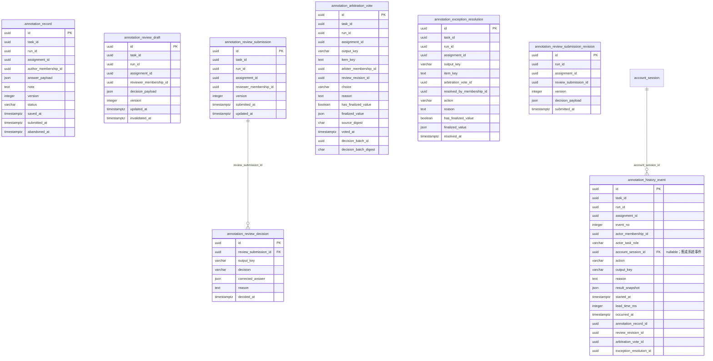

# annotation／review 資料庫 schema（實體候選）

> Issue #1160 的衍生物理欄位字典。以下 **8 張表、91 個欄位均為未部署候選**；不是 ORM、migration、已建立的 SQLite／PostgreSQL schema，也不是新產品需求。業務正典為 [014](../../../specs/task-management/014-task-detail/spec.md)、[015](../../../specs/annotation/015-annotation-workspace/spec.md)、[ADR-024](../../adr/024-database-quickstart-sqlite-tiered.md)、[ADR-037](../../adr/037-permission-matrix-authorization.md)；候選寫入邊界見 [DBA 設計](../../superpowers/specs/2026-10-07-annotation-review-physical-design.md)。父端身分見 [task／run 字典](./task-run-db-schema.md)，公開資料與私有答案分界見 [dataset 字典](./dataset-db-schema.md)。

## 1. 範圍與狀態

一個正式標記／審核單位由 `(run_id, assignment_id)` 識別，並在同列保存其 `task_id`，使複合 FK 能把單位、membership 與候選名冊綁在同一 task。八張表只保存標記、審核草稿與提交、仲裁、例外收尾及責任事件；`ReviewAssignment`、`ReviewUnit`、`DisputeItem`、`GoldRecord` 均不因此建表。`sample_id`、R1、路由上的 `annotator_id`／`reviewer_id` 及 `run_type` 是顯示或查詢上下文，不是持久化的授權或唯一鍵。由 assignment → run → cycle 與公開 dataset item 解析 task、釘住版本和樣本，不在每表複製這些欄位。此切分符合 foundation FR-105 的 `lower_case_snake`、單數和模組前綴。

所有 `id` 是非空 UUID PK。六張擁有單位欄位的表使用 **複合** `(task_id,run_id,assignment_id)` FK → `task_annotation_assignment(task_id,task_run_id,id)`；父表須先建立同序 UNIQUE `(task_id,task_run_id,id)`，否則 SQLite 會在寫入時產生 `foreign key mismatch`。`annotation_review_decision` 經 submission 單欄 FK 取得單位，不另存 `run_id`；`annotation_review_submission_revision` 另存 `run_id`、`assignment_id`，以 `(run_id,assignment_id,review_submission_id)` 複合 FK 綁定同單位 head。下圖只畫本批八表**直接的單欄 FK**（僅 decision→submission 與 history→`account_session`）；membership、候選名冊、revision、vote、resolution、history 來源等複合 FK 在字典／§4 列明，沒有以概念線冒充資料庫 FK。

## 2. ERD

## 3. 欄位字典

六欄中的 `uuid`、`json`、`timestamptz` 是 PostgreSQL 型別語意；SQLite 對應見 §6。`→` 只標記**單欄** FK；複合 FK 的參與欄位不加 `→`，於 §4 明列。每個欄位寫入者均是已授權的服務交易，不從 URL 或 prototype bucket 直接寫入。未明列的資料庫預設均**未定案**；時間由寫入交易提供 UTC 值。`json` 僅用於依釘住 config 驗證、形狀會隨 output registry 變化的答案／決策快照，責任鍵、狀態、時間仍獨立成欄。

### 3.1 annotation_record：標記草稿與提交嘗試

同一 assignment 的未儲存 `pending` 由缺列推導。受派者重派前，舊 `saved` 轉 `abandoned` 並保留作者與答案；新受派者另建一列。reviewer 首次提交後凍結標記來源已由 015 FR-105 納入規劃契約；資料庫交易與約束尚未實作。來源：015 FR-049／FR-051／`AnnotationRecord`、014 FR-005l。

| 欄位 | 型別 | 可空 | 代表什麼 | 何時寫入／改變 | 規則 |
|---|---|---|---|---|---|
| `id` | uuid | 否 | 此次草稿／提交嘗試的 PK | 首次儲存；不改 | R-01 |
| `task_id` | uuid | 否 | 所在 task，複合單位鍵與 membership 鍵 | 首次儲存；不改 | X-01 |
| `run_id` | uuid | 否 | 所在發布 run，複合單位鍵 | 首次儲存；不改 | X-01 |
| `assignment_id` | uuid | 否 | 穩定工作 slot，複合單位鍵 | 首次儲存；不改 | X-01 |
| `author_membership_id` | uuid | 否 | 當時受派 annotator membership | 首次儲存；不改 | X-04 |
| `answer_payload` | json | 否 | 版本化 `OutputAnswer[]`，依釘住 config 驗證 | 儲存／提交前可更新 | R-03 |
| `note` | text | 是 | 受派者備註；缺值是真正未提供 | 儲存／提交前可更新 | R-03 |
| `version` | integer | 否 | 正整數樂觀鎖版本 | 每次成功寫入 +1 | X-02 |
| `status` | varchar(16) | 否 | `saved`／`submitted`／`abandoned` | 儲存、提交或未提交重派 | R-04 |
| `saved_at` | timestamptz | 否 | 最近一次成功保存 UTC 時間 | 建立／儲存／提交 | X-03 |
| `submitted_at` | timestamptz | 是 | 正式提交 UTC 時間 | 提交一次 | R-04 |
| `abandoned_at` | timestamptz | 是 | 舊草稿退役 UTC 時間 | 未提交重派時一次 | R-04 |

### 3.2 annotation_review_draft：reviewer 私有未提交草稿

一列僅屬同一 reviewer 與同一審核單位。`decision_payload` 僅保存 FR-014S 承諾的逐 outKey 決策與理由，不擴充為修正控件內未提交的文字／數值編輯。送出後清除有效草稿；因稽核留存而保留舊列時，應以 `invalidated_at` 失效並排除還原。草稿的**存在與否**亦不得向其他 reviewer 或 annotator 洩漏。來源：015 FR-014S／FR-062／FR-093。

| 欄位 | 型別 | 可空 | 代表什麼 | 何時寫入／改變 | 規則 |
|---|---|---|---|---|---|
| `id` | uuid | 否 | 私有草稿 PK | 第一次草稿寫入；不改 | D-01 |
| `task_id` | uuid | 否 | 所在 task，複合單位鍵與 membership 鍵 | 建立；不改 | X-01 |
| `run_id` | uuid | 否 | 所在 run，複合單位鍵 | 建立；不改 | X-01 |
| `assignment_id` | uuid | 否 | 受審 slot，複合單位鍵 | 建立；不改 | X-01 |
| `reviewer_membership_id` | uuid | 否 | 唯一可讀寫此草稿的 reviewer | 建立；不改 | X-04 |
| `decision_payload` | json | 否 | 未提交的逐 outKey 三向決策與理由 | 本人編輯時更新 | D-03 |
| `version` | integer | 否 | 草稿樂觀鎖版本 | 每次成功寫入 +1 | X-02 |
| `updated_at` | timestamptz | 否 | 最近成功寫入 UTC 時間 | 建立／更新 | X-03 |
| `invalidated_at` | timestamptz | 是 | 提交、失權或指派變更後的失效時間 | 失效時一次 | D-04 |

### 3.3 annotation_review_submission：唯一已提交 reviewer head

UNIQUE 單位鍵阻擋兩位 reviewer 並列正式提交。首次提交者的 sticky 身分由此列推導；再次明示提交僅能由同一 reviewer 更新 head，舊版存到 §3.8 的不可變 revision。首票後禁止改判已由 015 FR-103／FR-105 納入規劃契約；資料庫交易尚未實作。來源：015 FR-051／FR-093／FR-103。

| 欄位 | 型別 | 可空 | 代表什麼 | 何時寫入／改變 | 規則 |
|---|---|---|---|---|---|
| `id` | uuid | 否 | 目前提交 head PK | 首次正式提交；不改 | S-01 |
| `task_id` | uuid | 否 | 所在 task，複合單位鍵與 membership 鍵 | 首次提交；不改 | X-01 |
| `run_id` | uuid | 否 | 所在 run，複合單位鍵 | 首次提交；不改 | X-01 |
| `assignment_id` | uuid | 否 | 受審 slot，複合單位鍵 | 首次提交；不改 | X-01 |
| `reviewer_membership_id` | uuid | 否 | 唯一正式提交者 | 首次提交；不改 | X-04 |
| `version` | integer | 否 | 已提交修訂的正整數序號／樂觀鎖 | 每次合法改判 +1 | S-03 |
| `submitted_at` | timestamptz | 否 | 首次提交 UTC 時間 | 首次提交；不改 | X-03 |
| `updated_at` | timestamptz | 否 | 最新合法改判 UTC 時間 | 每次提交 | X-03 |

### 3.4 annotation_review_decision：每個 outKey 的目前決策

一列只保存 head 中一個 `output_key` 的目前決策；完整性（每個釘住的 `outputs[]` 恰一次）由提交交易核對。修正值有合法 JSON null 的可能，不能以 SQL NULL 是否存在取代 registry 驗證。來源：015 FR-014S／FR-092／FR-103。

| 欄位 | 型別 | 可空 | 代表什麼 | 何時寫入／改變 | 規則 |
|---|---|---|---|---|---|
| `id` | uuid | 否 | 逐輸出決策 PK | 正式提交時建立 | J-01 |
| `review_submission_id` | uuid → annotation_review_submission | 否 | 所屬已提交 head | 建立；不改 | J-01 |
| `output_key` | varchar(120) | 否 | 釘住 config 的一個 outKey | 建立；改判時換子列 | J-02 |
| `decision` | varchar(16) | 否 | `approve`／`modify`／`bypass` | 提交／改判時寫 | J-03 |
| `corrected_answer` | json | 是 | `modify` 的已驗證修正值；SQL NULL 表示不適用 | `modify` 時寫 | J-03 |
| `reason` | text | 是 | `modify`／`bypass` 的理由 | 提交／改判時寫 | J-03 |
| `decided_at` | timestamptz | 否 | 該決策本次提交 UTC 時間 | 提交／改判時寫 | X-03 |

### 3.5 annotation_arbitration_vote：一爭議鍵一次裁定

`DisputeItem` 由標記來源與 reviewer revision 推導，這張表僅保存對其鍵的票。`item_key` 用型別化 canonical encoding 表示 FR-052 粒度；`sequence_tagging` 的 span 粒度已由 015 FR-059／FR-061 收斂；`item_key` 的精確編碼、版本及碰撞測試仍待 migration 前固定，不能宣稱鍵已可落地。一次 batch 提交全部爭議鍵、每鍵最多一票已納入 015 的 V1 規劃契約，尚未實作。來源：015 FR-052／FR-059／FR-061／FR-062。

| 欄位 | 型別 | 可空 | 代表什麼 | 何時寫入／改變 | 規則 |
|---|---|---|---|---|---|
| `id` | uuid | 否 | 不可變票 PK | 仲裁交易建立；不改 | V-01 |
| `task_id` | uuid | 否 | 所在 task，複合單位鍵與 membership 鍵 | 建立；不改 | X-01 |
| `run_id` | uuid | 否 | 所在 run，複合單位鍵 | 建立；不改 | X-01 |
| `assignment_id` | uuid | 否 | 受審 slot，複合單位鍵 | 建立；不改 | X-01 |
| `output_key` | varchar(120) | 否 | 爭議的 outKey | 建立；不改 | V-02 |
| `item_key` | text | 否 | 型別化、無碰撞的推導子項鍵 | 建立；不改 | V-02 |
| `arbiter_membership_id` | uuid | 否 | 當次合格且非當事的仲裁者 | 建立；不改 | X-04 |
| `review_revision_id` | uuid | 否 | 投票所見的不可變 reviewer 版本 | 建立；不改 | V-04 |
| `choice` | varchar(16) | 否 | `adopt_a`／`adopt_b`／`reject` | 建立；不改 | V-05 |
| `reason` | text | 否 | 每張仲裁票的裁定理由；三種 choice 都必填且非空白 | 建立；不改 | V-05 |
| `has_finalized_value` | boolean | 否 | 本票是否產生定案值；區分合法 JSON null | 建立；不改 | V-06 |
| `finalized_value` | json | 是 | A／B 的定案值；SQL NULL 表示沒有值 | 建立；不改 | V-06 |
| `source_digest` | char(64) | 否 | 標記提交與 reviewer revision 的來源摘要 | 建立；不改 | V-04 |
| `voted_at` | timestamptz | 否 | 投票 UTC 時間 | 建立；不改 | X-03 |
| `decision_batch_id` | uuid | 否 | 同一次原子仲裁請求的冪等 ID | 建立；不改 | V-07 |
| `decision_batch_digest` | char(64) | 否 | 該 batch 完整 canonical 內容摘要 | 建立；不改 | V-07 |

### 3.6 annotation_exception_resolution：一 reject 鍵的終局收尾

只在 PL 明示確認後新增。`exclude_from_dataset` 排除**爭議輸出項目**，不是刪 `dataset_item`、run item 或 assignment。`custom_answer` 僅 Official；其與整個 assignment 排除／完成分母的關係仍待 014／015 正典對齊。來源：015 FR-095、014 FR-018。

| 欄位 | 型別 | 可空 | 代表什麼 | 何時寫入／改變 | 規則 |
|---|---|---|---|---|---|
| `id` | uuid | 否 | 不可變收尾 PK | 確認交易建立；不改 | E-01 |
| `task_id` | uuid | 否 | 所在 task，複合單位鍵與 membership 鍵 | 建立；不改 | X-01 |
| `run_id` | uuid | 否 | 所在 run，複合單位鍵 | 建立；不改 | X-01 |
| `assignment_id` | uuid | 否 | 受審 slot，複合單位鍵 | 建立；不改 | X-01 |
| `output_key` | varchar(120) | 否 | 被收尾的爭議 outKey | 建立；不改 | E-02 |
| `item_key` | text | 否 | 被收尾的型別化爭議子項鍵 | 建立；不改 | E-02 |
| `arbitration_vote_id` | uuid | 否 | 唯一 `reject` 票 | 建立；不改 | E-03 |
| `resolved_by_membership_id` | uuid | 否 | 確認的 project leader membership | 建立；不改 | X-04 |
| `action` | varchar(32) | 否 | 四種 `EXCEPTION_POOL_ACTIONS` 之一 | 建立；不改 | E-05 |
| `reason` | text | 否 | 非空白的收尾理由 | 建立；不改 | E-05 |
| `has_finalized_value` | boolean | 否 | 是否有定案值；合法 JSON null 仍可為 true | 建立；不改 | E-06 |
| `finalized_value` | json | 是 | 採用／自訂的已驗證答案；排除時 SQL NULL | 建立；不改 | E-06 |
| `resolved_at` | timestamptz | 否 | 確認 UTC 時間 | 建立；不改 | X-03 |

### 3.7 annotation_history_event：不可變責任事件

一列是一個單位的一次動作；不同 outKey 的 reviewer 決策各寫一列。`event_no` 保證同時間戳仍有總排序，清單時間與耗時由事件推導。未提交 reviewer 草稿**不產生對其他角色可見的事件**；本設計按 FR-014S 不為其寫 history。快照與理由可能含敏感答案，須在資料供給層遮蔽。來源：015 FR-016B／FR-086～FR-091／FR-097。

| 欄位 | 型別 | 可空 | 代表什麼 | 何時寫入／改變 | 規則 |
|---|---|---|---|---|---|
| `id` | uuid | 否 | append-only 事件 PK | 動作交易建立；不改 | H-01 |
| `task_id` | uuid | 否 | 所在 task，複合單位鍵與 membership 鍵 | 建立；不改 | X-01 |
| `run_id` | uuid | 否 | 所在 run，複合單位鍵 | 建立；不改 | X-01 |
| `assignment_id` | uuid | 否 | 發生動作的 slot，複合單位鍵 | 建立；不改 | X-01 |
| `event_no` | integer | 否 | 單位內正整數單調序號 | 動作交易分配；不改 | H-01 |
| `actor_membership_id` | uuid | 否 | 當次真實操作者 | 建立；不改 | X-04 |
| `actor_task_role` | varchar(24) | 否 | 當次選用任務角色快照 | 建立；不改 | H-02 |
| `account_session_id` | uuid → account_session | 是 | 從已驗證 JWT `sid` 取得的實際登入工作階段；舊／系統事件可空，不以其他人的 session 補值 | 新認證動作交易必填；建立後不改 | H-06 |
| `action` | varchar(24) | 否 | FR-086 八個目前有效動作之一 | 建立；不改 | H-03 |
| `output_key` | varchar(120) | 是 | 動作所涉 outKey；整單位動作可空 | 建立；不改 | H-03 |
| `reason` | text | 是 | 當次理由；依 action 驗必填 | 建立；不改 | H-03 |
| `result_snapshot` | json | 是 | 經 registry 驗證的答案／決策快照 | 建立；不改 | H-04 |
| `started_at` | timestamptz | 是 | 該階段可見時間起點 UTC | 建立；不改 | H-04 |
| `lead_time_ms` | integer | 是 | 該階段非負耗時毫秒 | 建立；不改 | H-04 |
| `occurred_at` | timestamptz | 否 | 動作完成 UTC 時間 | 建立；不改 | X-03 |
| `annotation_record_id` | uuid | 是 | 由標記草稿／提交產生時的來源 | 建立；不改 | H-05 |
| `review_revision_id` | uuid | 是 | 正式審核事件所依不可變修訂；可由修訂回查 submission head | 建立；不改 | H-05 |
| `arbitration_vote_id` | uuid | 是 | 由仲裁票產生時的來源 | 建立；不改 | H-05 |
| `exception_resolution_id` | uuid | 是 | 由例外收尾產生時的來源 | 建立；不改 | H-05 |

### 3.8 annotation_review_submission_revision：不可變審核修訂

每次正式提交一個完整、已驗證的 outKey 決策快照；不代表第二位 reviewer，也不另建指派。仲裁票參照投票時的 revision，避免後續改判把來源改掉。015 FR-103／FR-105 已規劃首票後不可改判；此表與交易尚未落地。來源：015 FR-103／FR-052、DBA 設計「持久化切分」。

| 欄位 | 型別 | 可空 | 代表什麼 | 何時寫入／改變 | 規則 |
|---|---|---|---|---|---|
| `id` | uuid | 否 | 不可變修訂 PK | 每次正式提交建立；不改 | N-01 |
| `run_id` | uuid | 否 | 所屬 head 的 run，同單位複合鍵 | 建立；不改 | N-01 |
| `assignment_id` | uuid | 否 | 所屬 head 的 slot，同單位複合鍵 | 建立；不改 | N-01 |
| `review_submission_id` | uuid | 否 | 所屬唯一 reviewer head | 建立；不改 | N-01 |
| `version` | integer | 否 | 與 head 本次版本一致的正整數 | 建立；不改 | N-02 |
| `decision_payload` | json | 否 | 本次全部 outKey、修正值和理由快照 | 建立；不改 | N-03 |
| `submitted_at` | timestamptz | 否 | 本次修訂 UTC 提交時間 | 建立；不改 | X-03 |

## 4. PK、UNIQUE、FK 與 CHECK 候選

**DB** 是候選資料庫限制；**SVC** 是授權服務在同一交易驗證；**SEC** 是 restricted-client 與答案隔離測試。下列限制未經 migration／雙庫測試。`ON DELETE RESTRICT` 僅是保留責任鏈的暫定方向，刪除／匿名化政策見 §7。

| ID | 位置 | 候選限制與驗證方向 | 來源 |
|---|---|---|---|
| X-01 | DB | 六張有 `(task_id,run_id,assignment_id)` 的表皆設複合 FK → `task_annotation_assignment(task_id,task_run_id,id)`，ON DELETE RESTRICT；父端先建同序 UNIQUE `(task_id,task_run_id,id)`。這同時阻止 assignment 與子列的 task 不一致。`annotation_review_decision` 經 submission 解析，不複製單位鍵；revision 另存 `(run_id,assignment_id)`，見 N-01 | 014 `AnnotationAssignment`、015 FR-049／FR-051 |
| X-02 | DB＋SVC | `version > 0`；寫入採 `WHERE id=? AND version=?` compare-and-swap，受影響 0 列回衝突；DB CHECK 不代替交易鎖 | 015 FR-014S／FR-103 |
| X-03 | SVC | 所有時間為 UTC；SQLite 讀回正規化。發生時間不取代單位內 `event_no` 的總排序 | 015 FR-088、ADR-024 |
| X-04 | DB＋SVC | 先於 `task_membership` 設 UNIQUE `(task_id,id)`，再以同 task 複合 FK（ON DELETE RESTRICT）綁定：`(task_id,author_membership_id)`、draft／submission 各自的 `(task_id,reviewer_membership_id)`、`(task_id,arbiter_membership_id)`、`(task_id,resolved_by_membership_id)`、`(task_id,actor_membership_id)` → `task_membership(task_id,id)`，共六組。DB 只保證 membership 屬同 task；active、角色與當前授權仍由 SVC 驗證 | ADR-037、014 FR-005l |
| R-01 | DB | `annotation_record.id` PK；部分 UNIQUE `(run_id,assignment_id) WHERE status IN ('saved','submitted')`，容許保留多個舊 abandoned 嘗試；另設 UNIQUE `(run_id,assignment_id,id)` 作 H-05 的同單位父鍵 | 015 `AnnotationRecord`、DBA 設計 |
| R-02 | DB＋SVC | `author_membership_id` 以 X-04 的 `(task_id,author_membership_id)` 複合 FK 綁定同 task membership；服務驗當前 active annotator、當前 assignment 受派者；FK 本身不證明角色 | ADR-037、014 FR-005l |
| R-03 | SVC＋SEC | `answer_payload` 以釘住 config／registry 驗每個 OutputAnswer，不以 JSON 型別代替 schema；note 與答案做欄位 allowlist，絕不讀私有 hidden answer | 015 FR-049、主憲法 II／III |
| R-04 | DB＋SVC | CHECK `status IN ('saved','submitted','abandoned')`；`submitted` 須有 `submitted_at` 且無 `abandoned_at`，`abandoned` 須有 `abandoned_at` 且無 `submitted_at`，`saved` 兩欄皆空；舊 saved 退役與 assignment 重派同交易，submitted 不走此路。reviewer 首交後凍結來源依 015 FR-105 規劃，交易鎖待實作 | 014 FR-005l、015 FR-051／FR-101 |
| D-01 | DB | draft PK；部分 UNIQUE `(run_id,assignment_id,reviewer_membership_id) WHERE invalidated_at IS NULL`，保留失效舊列而不誤還原 | 015 FR-014S |
| D-02 | DB＋SVC＋SEC | reviewer membership 以 X-04 的 `(task_id,reviewer_membership_id)` 複合 FK 綁定同 task；目前有效指派與 active 角色每次讀寫重查，本人以外不能看內容或「有草稿」訊號。草稿是 reviewer 的私有工作副本，故只設 X-04 同 task FK、不綁名冊（roster）FK；名冊綁定由 S-02 在正式提交時強制 | 015 FR-014S／FR-062／FR-093、ADR-037 |
| D-03 | SVC | `decision_payload` 僅記 FR-014S 範圍，outKey 與三向決策依釘住 config 驗證，決策取消亦寫入；草稿不進提交 bucket、不產 history | 015 FR-014S |
| D-04 | SVC | 提交、失權或指派變更同交易失效舊草稿；先前 reviewer 恢復資格不自動還原；此細節已由 014 FR-005f／FR-005l 與 015 FR-014S／FR-105 補述，待 runtime 驗證 | DBA 設計 V1 草稿重派 |
| S-01 | DB | submission PK、UNIQUE `(run_id,assignment_id)`，每單位至多一個已提交 reviewer head；另設 UNIQUE `(run_id,assignment_id,id)` 作 revision 複合 FK 的同單位父鍵 | 015 FR-051／FR-093 |
| S-02 | DB＋SVC | reviewer membership 以 X-04 的 `(task_id,reviewer_membership_id)` 複合 FK 綁定同 task；另設 `(run_id,reviewer_membership_id)` 複合 FK → `task_run_reviewer_candidate(task_run_id,reviewer_membership_id)`（與其 PK 同序），使 reviewer 必在該 run 的候選名冊；服務再驗 active 及 sticky 身分，不能以 URL `reviewer_id` 授權 | 015 FR-049／FR-093、ADR-037 |
| S-03 | DB＋SVC | head `version > 0`；同 reviewer 明示改判時更新 head、逐 outKey decision、完整 revision、history 與草稿失效同交易；有票後凍結已列入 015 FR-103／FR-105；交易與競爭測試待實作 | 015 FR-103、DBA 設計 |
| J-01 | DB | decision PK、FK → submission；UNIQUE `(review_submission_id,output_key)` | 015 FR-092 |
| J-02 | SVC | `output_key` 必須屬釘住 config 的 `outputs[]`，同次提交對每個 outKey 恰一列；跨表／JSON 範圍不能由單列 CHECK 保證 | 015 FR-044／FR-092 |
| J-03 | DB＋SVC | CHECK decision 三值；`approve/bypass` 不帶 corrected_answer，`modify/bypass` 要非空白 reason；`modify` 的 corrected_answer 必須是經 registry 驗證的值，合法 JSON null 與 SQL NULL 不同。完整性由 SVC 檢查後同交易替換目前子列 | 015 FR-092／FR-103 |
| V-01 | DB | vote PK、UNIQUE `(run_id,assignment_id,output_key,item_key)`；每鍵至多一票的 V1 候選阻止並發重投。另設 UNIQUE `(run_id,assignment_id,id)` 與 UNIQUE `(run_id,assignment_id,output_key,item_key,id)`，分別作 H-05 與 E-02 的父鍵 | DBA 設計 V1 單次裁定 |
| V-02 | SVC | `output_key × item_key` 由 FR-052 差異推導；item_key 用型別化 canonical encoding、含版本且無分隔碰撞；sequence_tagging 粒度已由 015 收斂；entity_recognition 位置落差及精確鍵編碼待 §7 裁決 | 015 FR-052／FR-059 |
| V-03 | DB＋SVC | arbiter membership 以 X-04 的 `(task_id,arbiter_membership_id)` 複合 FK 綁定同 task；仲裁者**豁免**候選名冊 FK，因 project_leader 的 FR-023 fallback 不在 `task_run_reviewer_candidate`。服務驗 active、可仲裁名冊、非當事與 ADR-037 資源條件；project leader 的 FR-023 fallback 同樣需服務授權 | 015 FR-060、014 FR-023 |
| V-04 | DB＋SVC | `(run_id,assignment_id,review_revision_id)` 複合 FK → `annotation_review_submission_revision(run_id,assignment_id,id)`，使票與 revision 必在同單位；來源摘要包含該 revision、對應標記提交版本與 canonical A/B，讀寫驗 digest 未漂移 | 015 FR-052／FR-061、DBA 設計 |
| V-05 | DB＋SVC | CHECK choice `adopt_a/adopt_b/reject`；所有三種 choice 的 reason 均 NOT NULL，CHECK trim(reason) <> ''；`adjudicated` history event 同交易帶入該票理由；票不可 UPDATE/DELETE 由 A-01 強制 | 015 FR-061／FR-089 |
| V-06 | DB＋SVC | `reject` 時 `has_finalized_value=false` 且 `finalized_value` 為 SQL NULL；`adopt_a/b` 時 flag=true、JSON 值有效，**JSON null** 可為合法 B 值；SQLite／PG 序列化不得把 JSON null 轉成 SQL NULL | 015 FR-061、DBA 設計 |
| V-07 | DB＋SVC | 同 batch 票共用 `decision_batch_id`／digest；`decision_batch_digest` 逐票重複是明示的不可變反正規化，SVC 同交易核對同 `(run_id,assignment_id,decision_batch_id)` 的所有票 digest 完全一致，否則整批拒絕／回滾。按此三欄查重送，完整同內容回原票，異內容拒絕；全部目前爭議鍵同交易一票為 V1 候選 | DBA 設計 V1 單次裁定 |
| E-01 | DB | resolution PK、UNIQUE `(run_id,assignment_id,output_key,item_key)` 與 UNIQUE `(arbitration_vote_id)`；同 reject 票及同鍵只可確認一次。另設 UNIQUE `(run_id,assignment_id,id)` 作 H-05 的同單位父鍵 | 015 FR-095 |
| E-02 | DB＋SVC | `(run_id,assignment_id,output_key,item_key,arbitration_vote_id)` 複合 FK → `annotation_arbitration_vote(run_id,assignment_id,output_key,item_key,id)`，由 DB 保證收尾的單位與鍵等於被參照 vote | 015 FR-059／FR-095 |
| E-03 | DB＋SVC | `arbitration_vote_id` 參與 E-02 複合 FK；只能參照 `choice='reject'` 的票，後者由 SVC 驗證，不能把已定案票送進例外池 | 015 FR-095 |
| E-04 | DB＋SVC | resolved_by membership 以 X-04 的 `(task_id,resolved_by_membership_id)` 複合 FK 綁定同 task；服務驗 active project_leader 與當前權限 | 015 FR-095、ADR-037 |
| E-05 | DB＋SVC | CHECK `action IN ('adopt_annotator','adopt_reviewer','custom_answer','exclude_from_dataset')`、trim(reason) 非空；`custom_answer` 僅 Official，run_type 經 run 解析後由 SVC 驗 | 015 FR-095 |
| E-06 | DB＋SVC | `exclude_from_dataset` 時 flag=false 且 SQL 值 NULL；其他動作有已驗證定案值，`custom_answer` 不得為 JSON null；`adopt_reviewer` 的合法 JSON null 依 output schema 驗證 | 015 FR-095、DBA 設計 |
| H-01 | DB＋SVC | event PK、UNIQUE `(run_id,assignment_id,event_no)`、CHECK `event_no>0`；序號與業務寫入同交易分配，事件 append-only（A-01） | 015 FR-016B／FR-097 |
| H-02 | DB＋SVC | actor membership 以 X-04 的 `(task_id,actor_membership_id)` 複合 FK 綁定同 task；當次角色快照與 membership、權限矩陣同 task 驗證，不依事件中的角色快照賦予現時權限 | 015 FR-050、ADR-037 |
| H-03 | DB＋SVC | CHECK action 僅 `draft_saved/submitted/modified/accepted/bypassed/adjudicated/exception_resolved/excluded`；另 CHECK `action <> 'draft_saved' OR actor_task_role = 'annotator'`，`draft_saved` 只屬標記員（事件已有當次角色快照欄，故以 DB 限制而非僅靠服務）；審核員草稿不寫任何 history 事件（SVC 規則，D-03 草稿存於 `annotation_review_draft`，不得產生 `draft_saved`，否則違反盲審隔離）；outKey、reason 是否必需按 action／FR-089 驗，歷史舊值若日後遷入需另有相容策略 | 015 FR-086／FR-089、FR-014S／FR-062 |
| H-04 | DB＋SVC＋SEC | `submitted`／`modified`／`adjudicated` 的 `result_snapshot` 必填非空，含完整 `outputs[]`，排除原始文本與資料集欄位；寫入前依 registry 驗證。CHECK `lead_time_ms IS NULL OR lead_time_ms>=0`；同一次作業的 `started_at` 與 `lead_time_ms` 恰寫一次：多筆 reviewer 決策事件共用 `review_revision_id` 時，僅第一筆事件（最小 `event_no`）帶 `started_at` 與 `lead_time_ms`，其餘事件的 `started_at` 與 `lead_time_ms` 均為 SQL NULL；單事件作業兩欄成對寫入，由 SVC 同交易驗證，舊版重複事件保留原樣。FR-090 在資料供給層先排除其他標記員的整筆事件（含列、摘要及計數），再按角色遮蔽允許事件的快照、理由與耗時 | 015 FR-087～FR-091、主憲法 III |
| H-05 | DB＋SVC | 四個來源 ID 各為同單位複合 FK，ON DELETE RESTRICT：`(run_id,assignment_id,annotation_record_id)` → `annotation_record(run_id,assignment_id,id)`、`(run_id,assignment_id,review_revision_id)` → `annotation_review_submission_revision(run_id,assignment_id,id)`、`(run_id,assignment_id,arbitration_vote_id)` → `annotation_arbitration_vote(run_id,assignment_id,id)`、`(run_id,assignment_id,exception_resolution_id)` → `annotation_exception_resolution(run_id,assignment_id,id)`。來源欄位可空，採 MATCH SIMPLE（來源為 NULL 時該 FK 不檢查）；另設 DB CHECK `((annotation_record_id IS NOT NULL) + (review_revision_id IS NOT NULL) + (arbitration_vote_id IS NOT NULL) + (exception_resolution_id IS NOT NULL)) = 1`，每個事件恰有一個來源 ID。此寫法為 SQLite／PostgreSQL 可攜形式（不依賴 PostgreSQL 專有的計數函式）；PostgreSQL 不允許 boolean 相加時，改用 `(col IS NOT NULL)::int` 或 `CASE WHEN col IS NOT NULL THEN 1 ELSE 0 END`，語意不變。審核來源指向不可變 revision，經 revision → submission 回查 head，避免舊事件隨 head 改判而失去版本身分；各 action 與來源種類的對應仍由 SVC 在同交易先建立來源再寫事件時核對。舊 action 值與無來源列不能通過 H-03／本 CHECK，日後若有遷移須另訂政策 | 015 FR-097／FR-103 |
| H-06 | DB＋SVC＋SEC | `account_session_id` 是可空真 FK → `account_session.id`，ON DELETE RESTRICT；舊／系統事件可空，新認證使用者動作須在同一交易從已驗證 `sid` 寫入，拒絕客戶端自報 ID。SVC 核對 session 的 `user_id` 等於 actor membership 所屬使用者；無法證實者不得猜測 session 歸屬。事件查詢以授權投影隔離其他人的工作階段與敏感答案，標記者 API 不下發跨人 session ID | 015 FR-088、FR-097；014 FR-007d |
| N-01 | DB | revision PK；`(run_id,assignment_id,review_submission_id)` 複合 FK → `annotation_review_submission(run_id,assignment_id,id)`，故 revision 與 head 同單位；另設 UNIQUE `(run_id,assignment_id,id)` 作 V-04 與 H-05 的父鍵。與 head 不同的 immutable 行（append-only 見 A-01） | 015 FR-103、DBA 設計 |
| N-02 | DB | UNIQUE `(review_submission_id,version)`、CHECK `version>0`；head.version 與最新 revision.version 在交易中對齊 | 015 FR-103 |
| N-03 | SVC＋SEC | `decision_payload` 是當次所有 outKey 已驗證快照；不可原地更新，查詢受同 reviewer／仲裁資格與答案遮蔽限制 | 015 FR-052／FR-062／FR-103 |
| A-01 | DB | `annotation_history_event`、`annotation_arbitration_vote`、`annotation_review_submission_revision` 完全 append-only：SQLite 與 PostgreSQL 各掛一個 `BEFORE UPDATE`／`BEFORE DELETE` trigger；PostgreSQL 對 app role `REVOKE UPDATE, DELETE, TRUNCATE`（只授予 SELECT／INSERT，PUBLIC 與 default privileges 不得再授）；更正一律新增列，無執行期更正路徑；更正路徑之外，唯一允許的 UPDATE 是 ADR-038 特權匿名化，由 migration role 執行 | 015 FR-097／FR-105；ADR-024 增補 (2026-10-08)；ADR-038 |

## 5. 候選索引與查詢對應

先用 PK／UNIQUE 的左側前綴，僅為尚未覆蓋的 FK 反查或實際清單 predicate 加索引。各索引會增加草稿、審核與歷程寫入成本；落地前以 SQLite 查詢計畫及 PostgreSQL `EXPLAIN` 驗證，不因 JSONB 存在就預建 GIN。

| 查詢／參照 | 候選索引 | 覆蓋與成本 |
|---|---|---|
| 同單位目前標記列 | 部分 UNIQUE `annotation_record(run_id,assignment_id) WHERE status IN ('saved','submitted')`；完整索引 `(run_id,assignment_id,author_membership_id)` | 前者限制至多一有效列；後者連 abandoned 也覆蓋 assignment 複合 FK 反查與舊作者歷程 |
| 本人有效審核草稿 | 部分 UNIQUE `annotation_review_draft(run_id,assignment_id,reviewer_membership_id) WHERE invalidated_at IS NULL`；完整索引 `(run_id,assignment_id)`、部分索引 `(reviewer_membership_id,run_id) WHERE invalidated_at IS NULL` | 第一個擋重複；完整索引覆蓋失效舊列的 assignment FK 反查；本人入口只讀有效草稿，無權者不得探知存在 |
| 單位審核與 reviewer 工作 | UNIQUE `annotation_review_submission(run_id,assignment_id)`；`(reviewer_membership_id,submitted_at,id)` | 單位查詢用唯一鍵；本人工作列表有界排序另付寫入成本 |
| 逐 outKey 與 revision | UNIQUE `annotation_review_decision(review_submission_id,output_key)`；UNIQUE `annotation_review_submission_revision(review_submission_id,version)` | 同 head 及最新版本用左前綴；不建重複單欄 FK 索引 |
| 爭議鍵與冪等 batch | UNIQUE `annotation_arbitration_vote(run_id,assignment_id,output_key,item_key)`；`(run_id,assignment_id,decision_batch_id)` | 第一個擋重投，第二個找重送；若真實請求能由第一個覆蓋再評估成本 |
| 例外待辦與票反查 | UNIQUE `annotation_exception_resolution(run_id,assignment_id,output_key,item_key)`、UNIQUE `(arbitration_vote_id)` | 待辦用 reject 票 LEFT JOIN resolution；E-02 的複合 vote 反查由 UNIQUE `(arbitration_vote_id)` 或以五欄鍵起首的索引覆蓋 |
| 單位責任歷程 | UNIQUE `annotation_history_event(run_id,assignment_id,event_no)`；如 DESC 排序實測不足再建 `(run_id,assignment_id,event_no DESC)` | 同單位最新事件可倒讀唯一索引；避免先預建重複 DESC 索引 |
| 工時完成事件歸屬 | `annotation_history_event(account_session_id,run_id,occurred_at,id)` | 依真實 session、run 與報表日掃描已提交事件；左前綴覆蓋 session FK 反查，不另建同欄索引；舊／系統空值列不可推定 session |
| X-01 單位複合 FK 反查 | 六張單位表各設以 `(task_id,run_id,assignment_id)` 起首的索引（可由既有 UNIQUE／複合索引左前綴覆蓋者不重建） | 刪除或更新 assignment 時 RESTRICT 檢查須能反查子列，避免全表掃描；以查詢計畫確認後刪除重複索引 |
| membership／來源複合 FK 反查 | 六組 membership 複合 FK 各以 `(task_id,<membership 欄>)` 起首的完整索引；`annotation_history_event` 四個來源 FK 各以 `(run_id,assignment_id,<來源 id>)` 起首的索引（部分索引須能涵蓋歷史列）；`annotation_arbitration_vote(run_id,assignment_id,review_revision_id)`；`annotation_review_submission_revision` 的 `(run_id,assignment_id,review_submission_id)` 由 N-02 的 UNIQUE 與 N-01 父鍵覆蓋評估後再決定 | FK 反查須涵蓋歷史／失效列，不能只靠部分索引；session FK 已由上列索引左前綴覆蓋；submission reviewer 的既列複合索引已覆蓋，draft 的本人部分索引仍需 reviewer 完整索引。實作時刪除任何被查詢計畫證明重複的索引 |

## 6. SQLite／PostgreSQL、交易與資料隔離

- **雙庫型別**：PostgreSQL 使用 `uuid`、`jsonb`、`timestamptz`；SQLite Lite 透過同一 ORM adapter 映射 UUID／JSON／UTC 時間。SQLite 無 PostgreSQL `TINYINT` 或 `SELECT FOR UPDATE` 語意；`varchar(n)` 長度上限在 SQLite 須另以 CHECK／應用驗證。`json` 的 SQL NULL 與合法 JSON null 務必可區分，且用 `has_finalized_value` 明示存在性。每個 SQLite 連線啟用 `PRAGMA foreign_keys=ON`，PG／SQLite 均驗複合 FK、部分唯一與 CHECK。
- **交易競爭**：標記寫入、reviewer 提交／改判、仲裁與例外確認均鎖同一 assignment；PG 可鎖該行，SQLite 以序列化寫交易／條件更新及 UNIQUE 作最後防線。標記 `version` CAS，review head、decision、revision、history 和草稿失效同交易；batch 全爭議項票與事件同交易；例外 resolution 與事件同交易。不能靠時間戳判定衝突或靠前端 disabled 取代伺服器檢查。
- **即時授權**：每條讀寫路徑重新核 active membership、所選 task role、ADR-037 權限矩陣、assignment、run candidate／roster 及資源條件。歷史 membership／reviewer 黏著保留責任，不授予當前讀權。未提交 reviewer 草稿只由本人讀寫且不能在他人 API 的行數、摘要或事件中洩漏。
- **答案隔離**：八表不存 `dataset_item_private.hidden_answer`、`declared_split`、gold/test 旗標，也不連私有答案 FK。`answer_payload`、審核修正、仲裁定案、例外理由與 history snapshot 仍可能含敏感答案；annotator API 使用 allowlist 投影並依 FR-062／FR-090 遮蔽。PostgreSQL 對私有表另設 DB 角色讀取隔離；SQLite 由 repository 邊界與洩漏測試保證，不能把共用 `audit_events` 的查詢權套到本批敏感表。
- **落地驗證**：獨立 migration PR 先寫 Red，再測 SQLite／PostgreSQL 的 upgrade、downgrade、roundtrip、FK／UNIQUE、CAS、同時提交、失權、JSON null、來源 digest 漂移與 private answer denial。這份字典或 NoteCraft 可顯示並不代表 DDL 已可執行。

## 7. migration 前待決與正典修訂

1. **爭議鍵落地前決策**：015 v12.0.0 已將 FR-059(4)、FR-061(7)(a) 與 `OutputAnswer` 對齊 `{start,end,label}` span，並以 AC-7.4 規劃不碰撞驗收。仍須在 migration 前固定 `item_key` 的型別化 canonical encoding、版本與實際無碰撞測試；`entity_recognition` CompactAnswer 的位置落差尚待獨立裁決。§3.5 目前只定候選型別。
2. **V1 規劃契約與實作界線**：首次 reviewer 提交後凍結 annotator 來源、首票後凍結 reviewer 改判、同單位全爭議鍵一次 batch／每鍵一票、未提交草稿重派保留舊嘗試，已回寫 014 v7.0.0／015 v12.0.0 的 FR／AC／SC；本文件仍只是未部署候選字典，尚無 ORM、migration、API 或雙資料庫並發證據。未來重啟仲裁須另立明示流程，不能暗藏多票／覆寫規則。
3. **父端與完成語意**：`task_annotation_assignment` 的完整 status 值域、未指派／排除轉換仍待 task/run 字典 §7 收斂；`exclude_from_dataset` 是輸出項目層級，與整個 assignment 的 `task_annotation_exclusion`、run 完成分母及導出語意須在 014／015 對齊。不可由此新增 GoldRecord、IAA、品質或 export 表。
4. **稽核與保留**：保存、刪除與匿名化依 ADR-038 定案。`annotation_history_event` 和共用 `audit_events` 的寫入責任及去重、舊值事件 migration 相容仍於實作時確認。事件列不刪，append-only 強制依 A-01；`reason` 為 PII 欄位，一個日曆年後可經特權路徑（migration role）匿名化。`result_snapshot`、`decision_payload` 與仲裁票 payload 隨 dataset 版本／run 保存，版本下架程序與期限 待定（#1224）。工時候選先以一年為最低保留期，session 與事件引用採 RESTRICT，無引用、已撤銷或逾上限，且其 token 皆已到期（expires_at）的 session 由清理工作刪除；各期限上限與執行週期 待定（#1224）。

**交付狀態：8 張未部署候選表、91 欄；單欄 FK 2 個，另有 20 組複合 FK。** 數量與限制是審查基線，須經來源一致性檢查、OpenSpec Source-Verify 與未來雙資料庫 Red／Green 才能作為落地參考，NoteCraft 投影也不等於已部署 Schema。
