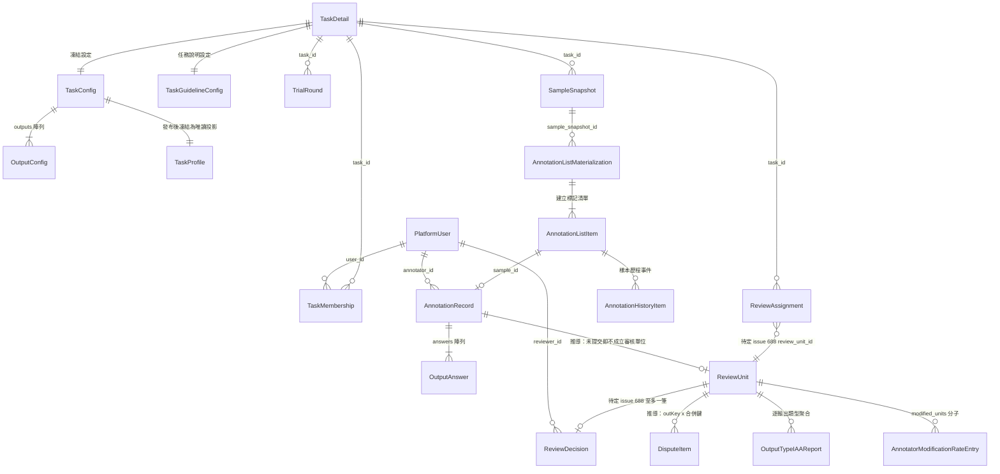
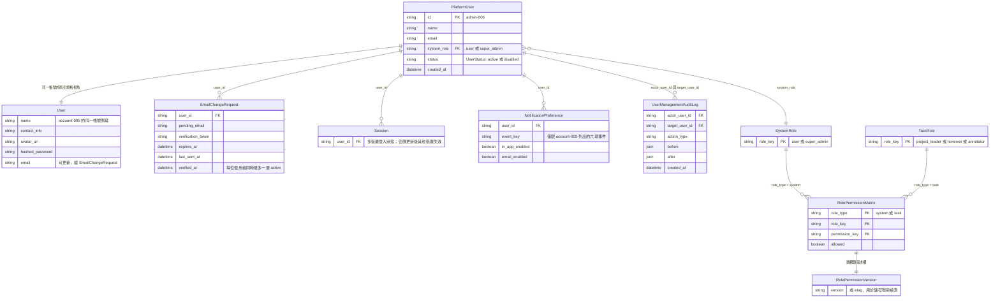
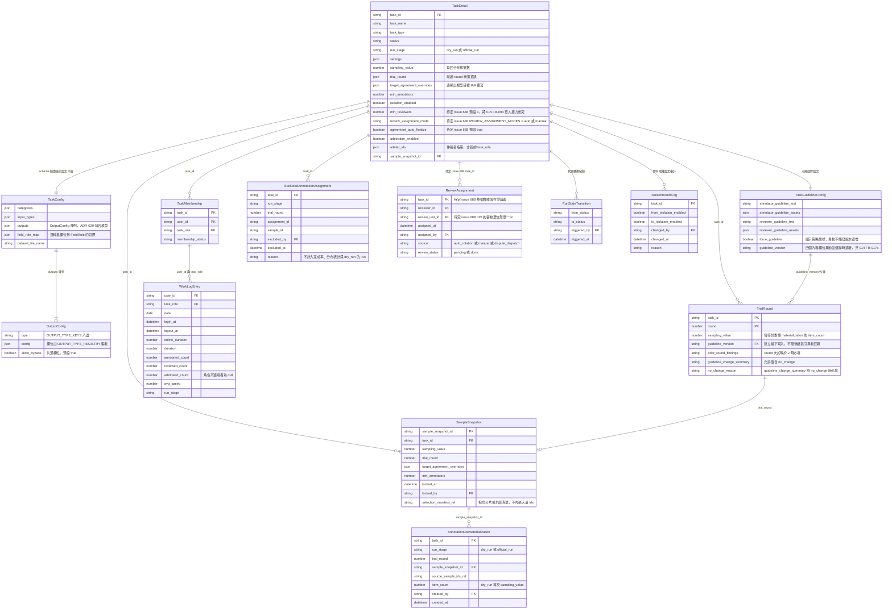
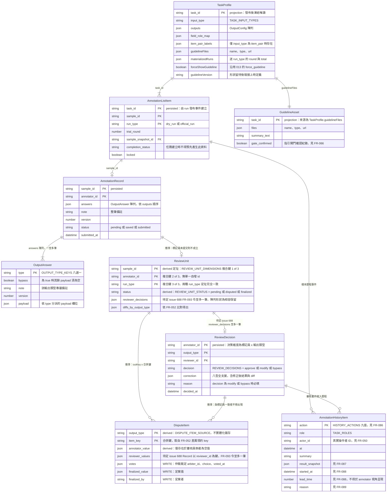
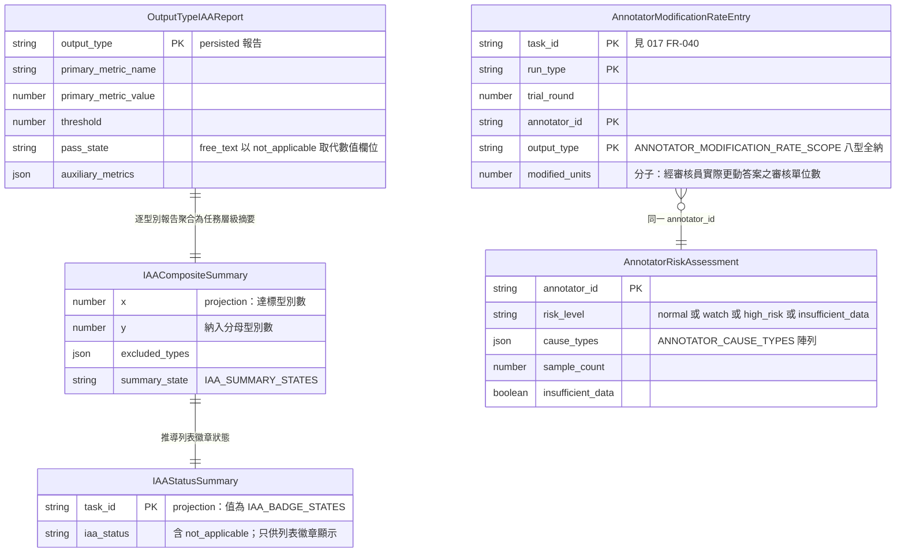
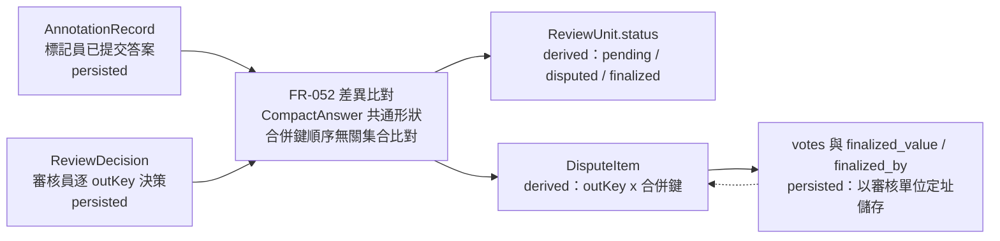

# 核心資料模型 ER 圖（跨模組）

> 對應 issue #669。本圖整合 11 份 feature spec 的「關鍵實體」段落，是動工寫 migration 前的唯一整合視圖。
> **受眾為工程師與 migration 作者**，因此圖面一律保留 spec 的原始識別字（`sample_id`、`run_type`、`min_reviewers` …），不做中文化——翻譯後就無法用 `grep` 回到正典條文。

- **正典來源**：各 `specs/[module]/NNN-feature/spec.md` 的 `### 關鍵實體` 段落。本圖為**衍生視圖**，不是正典；spec 與本圖衝突時以 spec 為準。
- **不歸屬任何單一 spec**，因此放在 `docs/diagrams/architecture/`，不隨任何 spec 進 `specs/_archive/`。
- **本圖不新增、不修改任何規格**。所有實體名、欄位名、FR ID 皆可在來源 spec 中以 `grep` 逐字定位。

---

## 讀圖規則（先讀這段再看圖）

本專案的資料模型有三種截然不同的實體性質，**混淆它們會直接寫錯 migration**：

| 標記 | 性質 | 落地行為 | 例子 |
|------|------|---------|------|
| `[persisted]` | 持久化實體 | 應建資料表 | `TaskDetail`、`AnnotationRecord` |
| `[derived]` | 推導實體 | **不得建表**，每次讀取時即時算出 | `ReviewUnit.status`、`DisputeItem` |
| `[projection]` | 唯讀投影 / 凍結快照 | 不獨立寫入，讀自上游實體 | `TaskProfile`、`IAACompositeSummary` |

兩個最容易踩雷的點：

1. **`ReviewUnit` 沒有單一主鍵。** 它以 `sample_id × annotator_id × run_type` 三欄複合定址（`REVIEW_UNIT_DIMENSIONS`，annotation-015 FR-051）。同一樣本由 N 位標記員標記，就是 N 個各自獨立、狀態互不影響的審核單位。任何「給 ReviewUnit 一個自增 id」的設計都會讓這條不變式失守。
2. **`DisputeItem` 是推導出來的，不是存下來的。** 它依 `outKey × 合併鍵` 由 FR-052 的差異比對即時推導（`DISPUTE_ITEM_SOURCE = derived-from-review-diffs`，annotation-015 FR-059）。**只有 `votes[]` 與 `finalized_value` / `finalized_by` 是真正的寫入狀態**，其餘欄位一旦落地就會與審核單位狀態機漂移。

---

## 圖 1 — 核心骨幹（整合總覽）

只畫貫穿全系統的主鏈：帳號 → 任務 → run 抽樣 → 標記清單 → 標記 → 審核 → 品質。欄位細節見圖 2～圖 5。

---

## 圖 2 — 身分與權限（account 001～005、admin 006／007）

> 本圖是概念層。account 001～005＋admin-006 的實體層（欄位型別、限制、索引、待裁決事項）見 [`account-admin-db-schema.md`](./account-admin-db-schema.md)。

---

## 圖 3 — 任務設定與 run 生命週期（task-management 010／013／014）

---

## 圖 4 — 標記與審核（annotation 015，v6.0.0）

全 spec 最複雜的實體群。**`ReviewUnit` 的複合鍵與 `DisputeItem` 的推導性質是本圖的核心。**

---

## 圖 5 — 品質與統計（dataset 016／017）

跨模組銜接：`AnnotatorModificationRateEntry.modified_units` 的分子取自 annotation-015 FR-052 的差異比對結果，**不是**審核單位狀態欄——017 明載其「非 `REVIEW_UNIT_STATUS.MODIFIED`」。

---

## 圖 6 — 為什麼 `ReviewUnit.status` 與 `DisputeItem` 不能建表

這是本 issue 的核心動機：若把推導結果落地成資料表，狀態機就會與寫入來源漂移。

- 每次讀取時重算，因此**結構上不可能**與審核單位狀態機漂移（FR-059 原文：「推導使爭議池在結構上不可能與審核單位狀態機漂移」）。
- `ReviewUnit.status` 沒有「設定為 disputed」這類操作，狀態隨決策自然推進（FR-051）。
- 唯一該落地的寫入狀態是仲裁票與定案值（虛線回饋箭頭）。
- 同理，014 的「審核負荷統計」與 015 FR-091 的清單彙總三項也都明訂「不儲存」／「不得另存第二份彙總資料」。

---

## 實體索引（來源可 grep 定位）

| 實體 | 性質 | 來源 spec | 版本 |
|------|------|----------|------|
| `PlatformUser`、`SystemRoleAssignment`、`UserStatus`、`UserManagementAuditLog` | persisted | `specs/admin/006-user-management/spec.md` | 1.0.9 |
| `RolePermissionMatrix`、`RolePermissionVersion`、`SystemRole`、`TaskRole` | persisted | `specs/admin/007-role-settings/spec.md` | 1.1.13 |
| `User`、`EmailChangeRequest`、`Session`、`NotificationPreference` | persisted | `specs/account/005-profile-settings/spec.md` | 1.2.10 |
| `TaskSummary`、`TaskMembership`、`TaskListQuery` | persisted／view | `specs/task-management/010-task-list/spec.md` | 2.1.1 |
| `TaskDraftInput`、`OutputConfig`、`TaskConfig`、`TaskGuidelineConfig`、`RunInitConfig` | persisted | `specs/task-management/013-task-new/spec.md` | 7.0.1 |
| `TaskDetail`、`ReviewAssignment`、`TrialRound`、`SampleSnapshot`、`AnnotationListMaterialization`、`ExcludedAnnotationAssignment`、`WorkLogEntry`、`RunStateTransition`、`IsolationAuditLog` | persisted | `specs/task-management/014-task-detail/spec.md` | 2.11.2 |
| `TaskProfile`、`GuidelineAsset` | projection | `specs/annotation/015-annotation-workspace/spec.md` | 6.0.0 |
| `AnnotationListItem`、`AnnotationRecord`、`OutputAnswer`、`ReviewDecision`、`AnnotationHistoryItem` | persisted | `specs/annotation/015-annotation-workspace/spec.md` | 6.0.0 |
| `ReviewUnit`、`DisputeItem` | **derived** | `specs/annotation/015-annotation-workspace/spec.md` | 6.0.0 |
| `IAAStatusSummary`、`TaskSummaryRow` | projection | `specs/dataset/016-dataset-analysis-list/spec.md` | 2.1.2 |
| `OutputTypeIAAReport`、`IAACompositeSummary`、`AnnotatorModificationRateEntry`、`AnnotatorRiskAssessment` | persisted／projection | `specs/dataset/017-dataset-analysis-detail/spec.md` | 2.2.1 |

已廢止、名稱保留不重用（**不得重新啟用**）：`AdjudicationItem`、`GoldRecord`（annotation-015 v4.0.0 廢止，見 FR-053）。

未入圖的來源 spec：`account/001`～`004`、`dashboard/012`、`shared/008` 的「關鍵實體」全為表單狀態、語言偏好或畫面 view model（`LoginFormState`、`LanguageState`、`DashboardViewModel` 等），不構成持久化資料模型，故不入 ER 圖。

---

## 規格待定：與 issue #688 重疊的關聯

issue #688 已複驗 `specs/task-management/014-task-detail/spec.md`（v2.11.2）與 `specs/annotation/015-annotation-workspace/spec.md`（v6.0.0）在審核指派模型上的六處矛盾。**本圖不裁定誰對**，凡涉及審核指派基數的關聯一律標為 `待定 issue 688`：

| 圖上位置 | 標記內容 | 衝突點 |
|---------|---------|-------|
| 圖 1、圖 4 | `ReviewUnit` 到 `ReviewDecision` 的關聯線 | 一對一還是一對多——015 FR-093 令每個指派對象恰一位審核員；014 的 `min_reviewers` 允許多位 |
| 圖 1、圖 3 | `ReviewAssignment` 到 `ReviewUnit` 的關聯線 | `ReviewAssignment.review_unit_id` 假設審核單位有單一 id，但 015 FR-051 的審核單位是三欄複合鍵，無單一 id 可指 |
| 圖 3 | `TaskDetail.min_reviewers` | 015 v5.0.0 已將 `MIN_REVIEWERS_DEFAULT` 廢止（單人接力下門檻恆為 1） |
| 圖 3 | `TaskDetail.review_assignment_mode` | `REVIEW_ASSIGNMENT_MODES = auto \| manual`；015 FR-093 規定審核工作「必須由系統自動指派」，`manual` 無對應 |
| 圖 3 | `TaskDetail.agreement_auto_finalize` | 預設 `true`；015 v5.0.0 已廢止 `DISPUTE_CONVERGENCE_RULE`，單人接力下不存在自動收斂路徑 |
| 圖 3 | `ReviewAssignment` 整個實體 | `source = auto_rotation \| manual \| dispute_dispatch` 三值中的 `manual` 與 `auto_rotation`（輪派至湊滿 `min_reviewers`）皆建立在已廢止的多審核員模型上 |
| 圖 4 | `ReviewUnit.reviewer_decisions`、`DisputeItem.reviewer_values` | 015 自身已註明「陣列／Record 形狀保留以維持既有讀取端相容」，實際基數為至多一筆 |

另有一項不屬 #688、但同樣待釐清：`reviewer_ids` 欄位在**全部 `specs/**/spec.md` 中零命中**（已複驗），卻已被實作端使用——這正是 #688 標題所指的缺漏。本圖不畫該欄位。

---

## 維護方式

Mermaid 原始碼即本檔內容，GitHub 與 VS Code 皆原生算繪，改一行就看得出改了什麼。**不另出 `.png`**（見 `docs/diagrams/README.md`）。

上游 spec 的「關鍵實體」段落異動時，須同步更新本圖與上方實體索引表的版本欄。
