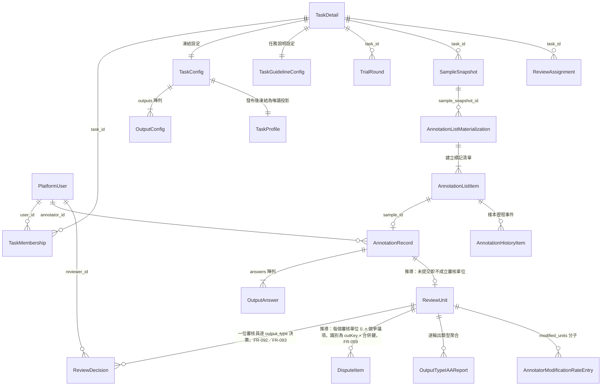
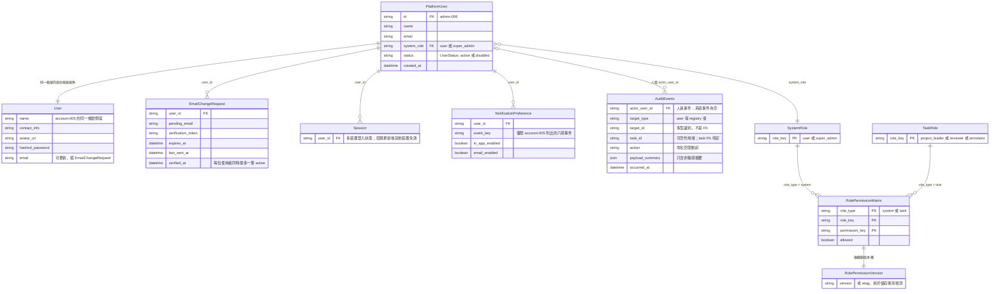
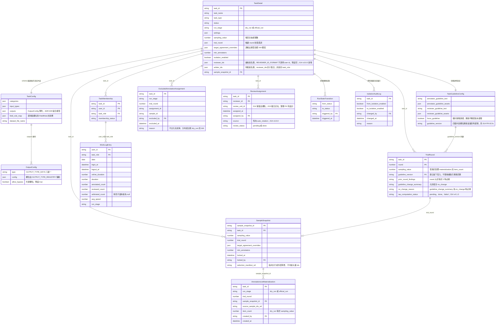
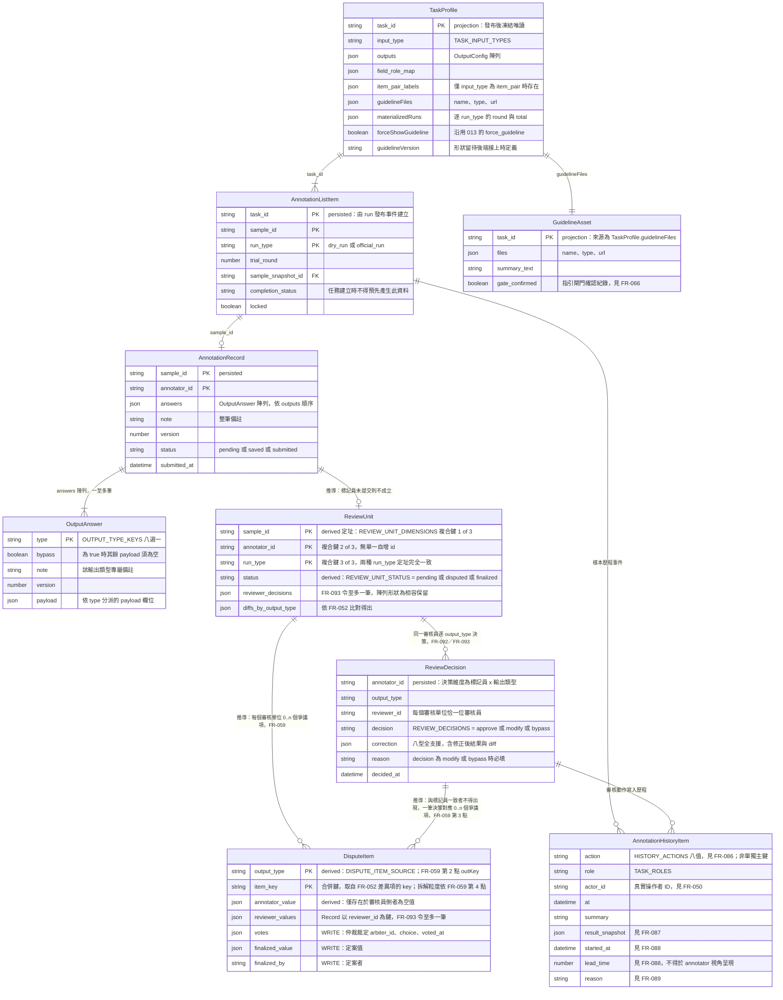
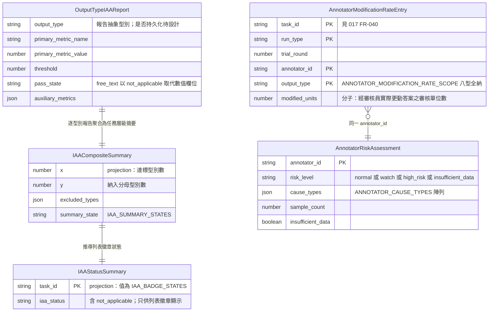
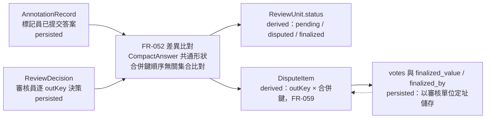

# 核心資料模型 ER 圖（跨模組）

> 對應 issue #669。本圖整合多份 feature spec 的「關鍵實體」段落，供 migration 前檢查概念關聯。
> **受眾為工程師與 migration 作者**，因此圖面一律保留 spec 的原始識別字（`sample_id`、`run_type`、`reviewer_ids` …），不做中文化——翻譯後就無法用 `grep` 回到正典條文。

> **維護提示（2026-10-06）**：本圖部分實體細節仍是舊版規格快照，尤其圖 3、圖 4 與下方實體索引／待定表。現行 `task-management-014` 為 v5.2.1、`annotation-015` 為 v10.1.0、`dataset-017` 為 v3.1.0；寫 migration 前請先讀 [資料表盤點與 ERD 落地清單](./database-table-inventory.md)，並對照各 spec 現行「關鍵實體」。本圖是概念圖，**不得直接轉成資料表或外鍵**。

- **正典來源**：各 `specs/[module]/NNN-feature/spec.md` 的 `### 關鍵實體` 段落。本圖為**衍生視圖**，不是正典；spec 與本圖衝突時以 spec 為準。
- **不歸屬任何單一 spec**，因此放在 `docs/diagrams/architecture/`，不隨任何 spec 進 `specs/_archive/`。
- **本圖不新增、不修改任何規格**。所有實體名、欄位名、FR ID 皆可在來源 spec 中以 `grep` 逐字定位。

---

## 讀圖規則（先讀這段再看圖）

本專案的資料模型有三種截然不同的實體性質，**混淆它們會直接寫錯 migration**：

| 標記 | 性質 | 落地行為 | 例子 |
|------|------|---------|------|
| `[persisted]` | 持久化實體 | 應建資料表 | `TaskDetail`、`AnnotationRecord` |
| `[derived]` | 推導實體 | **不得建表**，每次讀取時即時算出 | `ReviewUnit.status`、`DisputeItem` |
| `[projection]` | 唯讀投影 / 凍結快照 | 不獨立寫入，讀自上游實體 | `TaskProfile`、`IAACompositeSummary` |

兩個最容易踩雷的點：

1. **`ReviewUnit` 沒有單一主鍵。** 它以 `sample_id × annotator_id × run_type` 三欄複合定址（`REVIEW_UNIT_DIMENSIONS`，annotation-015 FR-051）。同一樣本由 N 位標記員標記，就是 N 個各自獨立、狀態互不影響的審核單位。任何「給 ReviewUnit 一個自增 id」的設計都會讓這條不變式失守。
2. **`DisputeItem` 是推導出來的，不是存下來的。** 它由 FR-052 的差異比對即時推導（015 FR-059 以審核單位內的 `outKey × 合併鍵` 識別爭議項，014 FR-010u(5) 的計數單位已於 v5.2.1 改引 015 FR-061 第 7 點，見 [#1150](https://github.com/singyichen/label-suite/issues/1150)；`DISPUTE_ITEM_SOURCE = derived-from-review-diffs`，annotation-015 FR-059）。**只有 `votes[]` 與 `finalized_value` / `finalized_by` 是真正的寫入狀態**，其餘欄位一旦落地就會與審核單位狀態機漂移。

---

## 圖 1 — 核心骨幹（整合總覽）

只畫貫穿全系統的主鏈：帳號 → 任務 → run 抽樣 → 標記清單 → 標記 → 審核 → 品質。欄位細節見圖 2～圖 5。

```mermaid
erDiagram
    PlatformUser  ||--o{ TaskMembership : "user_id"
    PlatformUser  ||--o{ AnnotationRecord : "annotator_id"
    PlatformUser  ||--o{ ReviewDecision : "reviewer_id"

    TaskDetail    ||--o{ TaskMembership : "task_id"
    TaskDetail    ||--|| TaskConfig : "凍結設定"
    TaskDetail    ||--|| TaskGuidelineConfig : "任務說明設定"
    TaskDetail    ||--o{ TrialRound : "task_id"
    TaskDetail    ||--o{ SampleSnapshot : "task_id"
    TaskDetail    ||--o{ ReviewAssignment : "task_id"

    TaskConfig    ||--|{ OutputConfig : "outputs 陣列"
    TaskConfig    ||--|| TaskProfile : "發布後凍結為唯讀投影"

    SampleSnapshot ||--o{ AnnotationListMaterialization : "sample_snapshot_id"
    AnnotationListMaterialization ||--|{ AnnotationListItem : "建立標記清單"

    AnnotationListItem ||--o| AnnotationRecord : "sample_id"
    AnnotationListItem ||--o{ AnnotationHistoryItem : "樣本歷程事件"
    AnnotationRecord   ||--|{ OutputAnswer : "answers 陣列"

    AnnotationRecord ||--o| ReviewUnit : "推導：未提交即不成立審核單位"
    ReviewUnit  ||--o{ ReviewDecision : "一位審核員逐 output_type 決策，FR-092／FR-093"
    ReviewUnit  ||--o{ DisputeItem : "推導：每個審核單位 0..n 個爭議項，識別為 outKey × 合併鍵，FR-059"

    ReviewUnit ||--o{ OutputTypeIAAReport : "逐輸出類型聚合"
    ReviewUnit ||--o{ AnnotatorModificationRateEntry : "modified_units 分子"
```

---

## 圖 2 — 身分與權限（account 001～005、admin 006／007）

```mermaid
erDiagram
    PlatformUser {
        string id PK "admin-006"
        string name
        string email
        string system_role FK "user 或 super_admin"
        string status "UserStatus: active 或 disabled"
        datetime created_at
    }
    User {
        string name "account-005 的同一帳號側寫"
        string contact_info
        string avatar_url
        string hashed_password
        string email "可更新，經 EmailChangeRequest"
    }
    EmailChangeRequest {
        string user_id FK
        string pending_email
        string verification_token
        datetime expires_at
        datetime last_sent_at
        datetime verified_at "每位使用者同時最多一筆 active"
    }
    Session {
        string user_id FK "多裝置登入狀態；密碼更新後其他裝置失效"
    }
    NotificationPreference {
        string user_id FK
        string event_key "僅限 account-005 列出的六項事件"
        boolean in_app_enabled
        boolean email_enabled
    }
    AuditEvents {
        string actor_user_id FK "人員事件；系統事件為空"
        string target_type "user 等 registry 值"
        string target_id "多型識別，不是 FK"
        string task_id "可空作用域；task FK 待定"
        string action "命名空間動詞"
        json payload_summary "只含非敏感摘要"
        datetime occurred_at
    }
    SystemRole {
        string role_key PK "user 或 super_admin"
    }
    TaskRole {
        string role_key PK "project_leader 或 reviewer 或 annotator"
    }
    RolePermissionMatrix {
        string role_type PK "system 或 task"
        string role_key PK
        string permission_key PK
        boolean allowed
    }
    RolePermissionVersion {
        string version "或 etag，用於儲存衝突檢測"
    }

    PlatformUser ||--|| User : "同一帳號的兩份規格視角"
    PlatformUser }o--|| SystemRole : "system_role"
    PlatformUser ||--o{ EmailChangeRequest : "user_id"
    PlatformUser ||--o{ Session : "user_id"
    PlatformUser ||--o{ NotificationPreference : "user_id"
    PlatformUser |o--o{ AuditEvents : "人員 actor_user_id"
    SystemRole   ||--o{ RolePermissionMatrix : "role_type = system"
    TaskRole     ||--o{ RolePermissionMatrix : "role_type = task"
    RolePermissionMatrix ||--|| RolePermissionVersion : "樂觀鎖版本欄"
```

> 本圖是概念層。`UserManagementAuditLog` 是依 `target_type='user'`、`target_id` 篩選共用 `audit_events` 的讀取投影，不另建表或 target FK；系統事件的 `actor_user_id` 為空。account 001～005＋admin-006／007 的實體層（欄位型別、限制、索引、待裁決事項）見 [`account-admin-db-schema.md`](./account-admin-db-schema.md)。

---

## 圖 3 — 任務設定與 run 生命週期（task-management 010／013／014）

```mermaid
erDiagram
    TaskDetail {
        string task_id PK
        string task_name
        string task_type
        string status
        string run_stage "dry_run 或 official_run"
        json settings
        number sampling_value "每回合抽樣筆數"
        json trial_round "唯讀 round 狀態資訊"
        json target_agreement_overrides "逐輸出類型目標 IAA 覆寫"
        number min_annotators
        boolean isolation_enabled
        json reviewer_ids "審核員名冊，REVIEWER_ID_FORMAT 不透明 user id，預設空；014 v3.0.0 新增"
        json arbiter_ids "仲裁者名冊，reviewer_ids 的子集合，非新的 task_role"
        string sample_snapshot_id FK
    }
    TaskConfig {
        json categories
        json input_types
        json outputs "OutputConfig 陣列，ADR-029 組合模型"
        json field_role_map "資料集欄位到 FieldRole 的對應"
        string dataset_file_name
    }
    OutputConfig {
        string type "OUTPUT_TYPE_KEYS 八選一"
        json config "欄位由 OUTPUT_TYPE_REGISTRY 驅動"
        boolean allow_bypass "共通欄位，預設 true"
    }
    TaskGuidelineConfig {
        string annotator_guideline_text
        json annotator_guideline_assets
        string reviewer_guideline_text
        json reviewer_guideline_assets
        boolean force_guideline "顯示策略旗標，異動不觸發版本遞增"
        string guideline_version "四個內容欄位異動並儲存時遞增，見 014 FR-017a"
    }
    TaskMembership {
        string task_id PK
        string user_id PK
        string task_role FK
        string membership_status
    }
    TrialRound {
        string task_id PK
        number round PK
        number sampling_value "恆等於對應 materialization 的 item_count"
        string guideline_version FK "建立當下寫入，不隨後續指引異動回填"
        string prior_round_findings "round 大於等於 2 時必填"
        string guideline_change_summary "允許值含 no_change"
        string no_change_reason "guideline_change_summary 為 no_change 時必填"
        string iaa_computation_status "pending、done、failed；014 v4.1.0"
    }
    SampleSnapshot {
        string sample_snapshot_id PK
        string task_id FK
        number sampling_value
        number trial_round
        json target_agreement_overrides
        number min_annotators
        datetime locked_at
        string locked_by FK
        string selection_manifest_ref "指向分片或外部清單，不內嵌大量 ids"
    }
    AnnotationListMaterialization {
        string task_id FK
        string run_stage "dry_run 或 official_run"
        number trial_round
        string sample_snapshot_id FK
        string source_sample_ids_ref
        number item_count "dry_run 等於 sampling_value"
        string created_by FK
        datetime created_at
    }
    ExcludedAnnotationAssignment {
        string task_id FK
        string run_stage
        number trial_round
        string assignment_id
        string sample_id
        string excluded_by FK
        datetime excluded_at
        string reason "不計入完成率、分布統計與 dry_run 的 IAA"
    }
    ReviewAssignment {
        string task_id FK
        string reviewer_id FK
        string review_unit_id "014 保留此欄名；015 複合定址，實體 FK 待設計"
        datetime assigned_at
        string assigned_by FK
        string source "恆為 auto_rotation；014 v3.0.0"
        string review_status "pending 或 done"
    }
    WorkLogEntry {
        string user_id FK
        string task_role FK
        date date
        datetime login_at
        datetime logout_at
        number online_duration
        number duration
        number annotated_count
        number reviewed_count
        number arbitrated_count "角色不適用者為 null"
        number avg_speed
        string run_stage
    }
    RunStateTransition {
        string from_status
        string to_status
        string triggered_by FK
        datetime triggered_at
    }
    IsolationAuditLog {
        string task_id FK
        boolean from_isolation_enabled
        boolean to_isolation_enabled
        string changed_by FK
        datetime changed_at
        string reason
    }

    TaskDetail ||--|| TaskConfig : "schema 驗證後的設定內容"
    TaskDetail ||--|| TaskGuidelineConfig : "任務說明設定"
    TaskDetail ||--o{ TaskMembership : "task_id"
    TaskDetail ||--o{ TrialRound : "task_id"
    TaskDetail ||--o{ SampleSnapshot : "task_id"
    TaskDetail ||--o{ RunStateTransition : "狀態轉換紀錄"
    TaskDetail ||--o{ IsolationAuditLog : "資料隔離設定審計"
    TaskDetail ||--o{ ExcludedAnnotationAssignment : "task_id"
    TaskDetail ||--o{ ReviewAssignment : "task_id"
    TaskConfig ||--|{ OutputConfig : "outputs 陣列"
    TaskGuidelineConfig ||--o{ TrialRound : "guideline_version 外鍵"
    TrialRound ||--o| SampleSnapshot : "trial_round"
    SampleSnapshot ||--o{ AnnotationListMaterialization : "sample_snapshot_id"
    TaskMembership ||--o{ WorkLogEntry : "user_id 與 task_role"
```

---

## 圖 4 — 標記與審核（annotation 015，v10.1.0）

全 spec 最複雜的實體群。**`ReviewUnit` 的複合鍵與 `DisputeItem` 的推導性質是本圖的核心。**

> `DisputeItem` 相關的關聯線與主鍵（`output_type`＋`item_key`）的粒度依 015 FR-059：識別為審核單位內的 `outKey × 合併鍵`；集合型輸出逐合併鍵各一項、`sequence_tagging` 逐 token 位置、`multi_dim` 逐維度，其餘輸出型別整個 outKey 至多一項。下方 ER 以 `output_type`＋`item_key` 兩欄表示此識別，`item_key` 為各拆解粒度下的合併鍵／token 位置／維度。

```mermaid
erDiagram
    TaskProfile {
        string task_id PK "projection：發布後凍結唯讀"
        string input_type "TASK_INPUT_TYPES"
        json outputs "OutputConfig 陣列"
        json field_role_map
        json item_pair_labels "僅 input_type 為 item_pair 時存在"
        json guidelineFiles "name、type、url"
        json materializedRuns "逐 run_type 的 round 與 total"
        boolean forceShowGuideline "沿用 013 的 force_guideline"
        string guidelineVersion "形狀留待後端接上時定義"
    }
    AnnotationListItem {
        string task_id PK "persisted：由 run 發布事件建立"
        string sample_id PK
        string run_type PK "dry_run 或 official_run"
        number trial_round
        string sample_snapshot_id FK
        string completion_status "任務建立時不得預先產生此資料"
        boolean locked
    }
    AnnotationRecord {
        string sample_id PK "persisted"
        string annotator_id PK
        json answers "OutputAnswer 陣列，依 outputs 順序"
        string note "整筆備註"
        number version
        string status "pending 或 saved 或 submitted"
        datetime submitted_at
    }
    OutputAnswer {
        string type PK "OUTPUT_TYPE_KEYS 八選一"
        boolean bypass "為 true 時其餘 payload 須為空"
        string note "該輸出類型專屬備註"
        number version
        json payload "依 type 分派的 payload 欄位"
    }
    ReviewDecision {
        string annotator_id "persisted：決策維度為標記員 x 輸出類型"
        string output_type
        string reviewer_id "每個審核單位恰一位審核員"
        string decision "REVIEW_DECISIONS = approve 或 modify 或 bypass"
        json correction "八型全支援，含修正後結果與 diff"
        string reason "decision 為 modify 或 bypass 時必填"
        datetime decided_at
    }
    ReviewUnit {
        string sample_id PK "derived 定址：REVIEW_UNIT_DIMENSIONS 複合鍵 1 of 3"
        string annotator_id PK "複合鍵 2 of 3，無單一自增 id"
        string run_type PK "複合鍵 3 of 3，兩種 run_type 定址完全一致"
        string status "derived：REVIEW_UNIT_STATUS = pending 或 disputed 或 finalized"
        json reviewer_decisions "FR-093 令至多一筆，陣列形狀為相容保留"
        json diffs_by_output_type "依 FR-052 比對得出"
    }
    DisputeItem {
        string output_type PK "derived：DISPUTE_ITEM_SOURCE；FR-059 第 2 點 outKey"
        string item_key PK "合併鍵，取自 FR-052 差異項的 key；拆解粒度依 FR-059 第 4 點"
        json annotator_value "derived：僅存在於審核員側者為空值"
        json reviewer_values "Record 以 reviewer_id 為鍵，FR-093 令至多一筆"
        json votes "WRITE：仲裁裁定 arbiter_id、choice、voted_at"
        json finalized_value "WRITE：定案值"
        string finalized_by "WRITE：定案者"
    }
    AnnotationHistoryItem {
        string action "HISTORY_ACTIONS 八值，見 FR-086；非單獨主鍵"
        string role "TASK_ROLES"
        string actor_id "真實操作者 ID，見 FR-050"
        datetime at
        string summary
        json result_snapshot "見 FR-087"
        datetime started_at "見 FR-088"
        number lead_time "見 FR-088，不得於 annotator 視角呈現"
        string reason "見 FR-089"
    }
    GuidelineAsset {
        string task_id PK "projection：來源為 TaskProfile.guidelineFiles"
        json files "name、type、url"
        string summary_text
        boolean gate_confirmed "指引閘門確認紀錄，見 FR-066"
    }

    TaskProfile ||--|{ AnnotationListItem : "task_id"
    TaskProfile ||--|| GuidelineAsset : "guidelineFiles"
    AnnotationListItem ||--o| AnnotationRecord : "sample_id"
    AnnotationListItem ||--o{ AnnotationHistoryItem : "樣本歷程事件"
    AnnotationRecord ||--|{ OutputAnswer : "answers 陣列，一至多筆"
    AnnotationRecord ||--o| ReviewUnit : "推導：標記員未提交則不成立"
    ReviewUnit ||--o{ ReviewDecision : "同一審核員逐 output_type 決策，FR-092／FR-093"
    ReviewUnit ||--o{ DisputeItem : "推導：每個審核單位 0..n 個爭議項，FR-059"
    ReviewDecision ||--o{ DisputeItem : "推導：與標記員一致者不得出現，一筆決策對應 0..n 個爭議項，FR-059 第 3 點"
    ReviewDecision ||--o{ AnnotationHistoryItem : "審核動作寫入歷程"
```

---

## 圖 5 — 品質與統計（dataset 016／017）

```mermaid
erDiagram
    IAAStatusSummary {
        string task_id PK "projection：值為 IAA_BADGE_STATES"
        string iaa_status "含 not_applicable；只供列表徽章顯示"
    }
    OutputTypeIAAReport {
        string output_type "報告抽象型別；是否持久化待設計"
        string primary_metric_name
        number primary_metric_value
        number threshold
        string pass_state "free_text 以 not_applicable 取代數值欄位"
        json auxiliary_metrics
    }
    IAACompositeSummary {
        number x "projection：達標型別數"
        number y "納入分母型別數"
        json excluded_types
        string summary_state "IAA_SUMMARY_STATES"
    }
    AnnotatorModificationRateEntry {
        string task_id PK "見 017 FR-040"
        string run_type PK
        number trial_round
        string annotator_id PK
        string output_type PK "ANNOTATOR_MODIFICATION_RATE_SCOPE 八型全納"
        number modified_units "分子：經審核員實際更動答案之審核單位數"
    }
    AnnotatorRiskAssessment {
        string annotator_id PK
        string risk_level "normal 或 watch 或 high_risk 或 insufficient_data"
        json cause_types "ANNOTATOR_CAUSE_TYPES 陣列"
        number sample_count
        boolean insufficient_data
    }

    OutputTypeIAAReport ||--|| IAACompositeSummary : "逐型別報告聚合為任務層級摘要"
    IAACompositeSummary ||--|| IAAStatusSummary : "推導列表徽章狀態"
    AnnotatorModificationRateEntry }o--|| AnnotatorRiskAssessment : "同一 annotator_id"
```

跨模組銜接：`AnnotatorModificationRateEntry.modified_units` 的分子取自 annotation-015 FR-052 的差異比對結果，**不是**審核單位狀態欄；現行 `REVIEW_UNIT_STATUS` 只有 `pending | disputed | finalized`。

---

## 圖 6 — 為什麼 `ReviewUnit.status` 與 `DisputeItem` 不能建表

這是本 issue 的核心動機：若把推導結果落地成資料表，狀態機就會與寫入來源漂移。

```mermaid
flowchart LR
    AR["AnnotationRecord<br/>標記員已提交答案<br/>persisted"]
    RD["ReviewDecision<br/>審核員逐 outKey 決策<br/>persisted"]
    DIFF["FR-052 差異比對<br/>CompactAnswer 共通形狀<br/>合併鍵順序無關集合比對"]
    RU["ReviewUnit.status<br/>derived：pending / disputed / finalized"]
    DI["DisputeItem<br/>derived：outKey × 合併鍵，FR-059"]
    W["votes 與 finalized_value / finalized_by<br/>persisted：以審核單位定址儲存"]

    AR --> DIFF
    RD --> DIFF
    DIFF --> RU
    DIFF --> DI
    DI --> W
    W -.-> DI
```

- 每次讀取時重算，因此**結構上不可能**與審核單位狀態機漂移（FR-059 原文：「推導使爭議池在結構上不可能與審核單位狀態機漂移」）。
- `ReviewUnit.status` 沒有「設定為 disputed」這類操作，狀態隨決策自然推進（FR-051）。
- 唯一該落地的寫入狀態是仲裁票與定案值（虛線回饋箭頭）。
- 同理，014 的「審核負荷統計」與 015 FR-091 的清單彙總三項也都明訂「不儲存」／「不得另存第二份彙總資料」。

---

## 實體索引（來源可 grep 定位）

| 實體 | 性質 | 來源 spec | 版本 |
|------|------|----------|------|
| `PlatformUser`、`SystemRoleAssignment`、`UserStatus` | persisted／domain state | `specs/admin/006-user-management/spec.md` | 1.2.1 |
| `UserManagementAuditLog` | projection：從 `audit_events` 依目標使用者篩選，不另建表 | `specs/admin/006-user-management/spec.md` FR-013 | 1.2.1 |
| `AuditEvents` | persisted candidate：共用 `audit_events`；task FK 待定 | ADR-032、`specs/admin/006-user-management/spec.md` FR-013 | 1.2.1 |
| `RolePermissionMatrix`、`RolePermissionVersion`、`SystemRole`、`TaskRole` | persisted | `specs/admin/007-role-settings/spec.md` | 1.1.14 |
| `User`、`EmailChangeRequest`、`Session`、`NotificationPreference` | persisted | `specs/account/005-profile-settings/spec.md` | 1.2.10 |
| `TaskSummary`、`TaskMembership`、`TaskListQuery` | persisted／view | `specs/task-management/010-task-list/spec.md` | 2.1.1 |
| `TaskDraftInput`、`OutputConfig`、`TaskConfig`、`TaskGuidelineConfig`、`RunInitConfig` | persisted | `specs/task-management/013-task-new/spec.md` | 7.0.1 |
| `TaskDetail`、`ReviewAssignment`、`TrialRound`、`SampleSnapshot`、`AnnotationListMaterialization`、`ExcludedAnnotationAssignment`、`WorkLogEntry`、`RunStateTransition`、`IsolationAuditLog` | persisted | `specs/task-management/014-task-detail/spec.md` | 5.1.0 |
| `TaskProfile`、`GuidelineAsset` | projection | `specs/annotation/015-annotation-workspace/spec.md` | 10.1.0 |
| `AnnotationListItem`、`AnnotationRecord`、`OutputAnswer`、`ReviewDecision`、`AnnotationHistoryItem` | persisted／embedded | `specs/annotation/015-annotation-workspace/spec.md` | 10.1.0 |
| `ReviewUnit`、`DisputeItem` | **derived**；仲裁寫入狀態需另有落點 | `specs/annotation/015-annotation-workspace/spec.md` | 10.1.0 |
| `IAAStatusSummary`、`TaskSummaryRow` | projection | `specs/dataset/016-dataset-analysis-list/spec.md` | 2.1.2 |
| `OutputTypeIAAReport`、`IAACompositeSummary`、`AnnotatorModificationRateEntry`、`AnnotatorRiskAssessment` | 報告／投影；儲存策略待設計 | `specs/dataset/017-dataset-analysis-detail/spec.md` | 3.1.0 |

已廢止、名稱保留不重用（**不得重新啟用**）：`AdjudicationItem`、`GoldRecord`（annotation-015 v4.0.0 廢止，見 FR-053）。

未入圖的來源 spec：`account/001`～`004`、`dashboard/012`、`shared/008` 的「關鍵實體」全為表單狀態、語言偏好或畫面 view model（`LoginFormState`、`LanguageState`、`DashboardViewModel` 等），不構成持久化資料模型，故不入 ER 圖。

---

## 規格與實體層待定

#688 已於 014 v3.0.0（`reviewer_ids`／`arbiter_ids` 取代 `min_reviewers` 等四欄位）與 015 v5.0.0（單人接力、`REVIEW_UNIT_STATUS` 三態）解決。015 FR-093 規定每個指派對象恰有一位審核員；FR-092 仍允許該審核員對多個 `output_type` 各寫一筆 `ReviewDecision`，因此圖 1／圖 4 的業務關聯為一對多。下列規格與實體層問題尚未定案，**本圖不裁定**（爭議項粒度已由 #1150 解決，見表後）：

| 圖上位置 | 標記內容 | 未定點 |
|---------|---------|-------|
| 圖 1、圖 3 | `ReviewAssignment.review_unit_id` 與 `ReviewAssignment` 到 `ReviewUnit` 的關聯線 | 014 `ReviewAssignment` 仍列 `review_unit_id`，但 015 FR-051 的審核單位以 `sample_id × annotator_id × run_type` 複合定址，無單一 id 可指；015 FR-093(5) 又規定黏住須由提交推導，不得另存第二份指派資料。正典未統一（非 #1150 範圍），所以圖中不畫未定的實體 FK；見[資料表盤點 §5](./database-table-inventory.md#5-在第一批-migration-前要關閉的決策) |

**已解決（#1150，2026-10-06）**：爭議項粒度以 015 FR-059 第 2、4 點與 FR-061 第 7 點為準（審核單位內 `outKey × 合併鍵`），014 FR-010u(5) 於 v5.2.1 改引該計數單位；`ReviewUnit` 與 `ReviewDecision` 到 `DisputeItem` 的基數已畫入圖 1、圖 4、圖 6。#1151（例外池以 outKey 為鍵）、#1146（arbiterIds 名冊）亦觸及同一塊資料模型，修完後須回頭核對。

---

## 維護方式

Mermaid 原始碼即本檔內容，GitHub 與 VS Code 皆原生算繪，改一行就看得出改了什麼。**不另出 `.png`**（見 `docs/diagrams/README.md`）。

上游 spec 的「關鍵實體」段落異動時，須同步更新本圖與上方實體索引表的版本欄。
