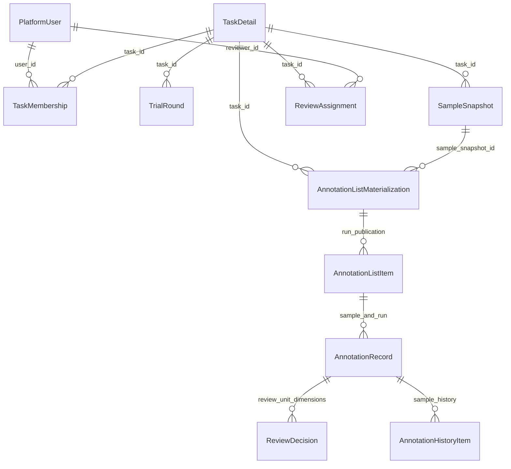

# 資料表盤點與 ERD 落地清單

> 2026-10-06 盤點快照。用途是讓 migration 作者從現行規格追到資料表、欄位與關聯；這是衍生視圖，不新增產品需求。衝突依 [`SDD 權威矩陣`](../../sdd-workflow.md#0-權威矩陣與衝突裁決) 裁決：主憲法 → 適用的 domain constitution → Accepted ADR → canonical feature spec；Proposed ADR 不改變現行規則。

## 1. 目前資料庫狀態

`backend/alembic/versions/` 只有 `.gitkeep`，`backend/app/` 尚無 ORM model。因此目前**沒有可由程式碼證實已建立的業務表**。下列名稱是 migration 前的規劃，不是已部署 schema；也不能把 prototype 的 `localStorage` 或 fixture 當作 PostgreSQL 表。

| 層級 | 目前可用資料 | 用法 |
|---|---|---|
| 實際 schema | Alembic revision／ORM：0 張業務表 | 日後以 migration 和資料庫 metadata 反查已落地狀態 |
| 實體層草案 | [account/admin schema](./account-admin-db-schema.md)：9 張候選表、63 欄、6 個候選 FK；[dataset schema](./dataset-db-schema.md)：5 張候選表、31 欄、6 個候選 FK | 兩份字典合計 14 張候選表、94 欄、12 個候選 FK；仍須獨立 migration 與雙資料庫驗證，均非已部署 schema |
| 概念層 | [跨模組 ER 圖](./core-data-model-er.md)：規格實體、推導值與投影 | 用於發現缺表與錯誤的關聯假設，不能直接當 DDL |

**NoteCraft 規劃檢視**：[`database-schema.er.json`](./database-schema.er.json) 會顯示在 `/view/diagrams/architecture/database-schema.er` 的 Wiki／Diagram。目前收錄 account/admin 與 dataset 的 **14 張候選表、94 欄與 12 個候選 FK**；其中 dataset 的 5 張表依 [dataset-021](../../../specs/dataset/021-dataset-ingestion-and-lineage/spec.md) 與[實體字典](./dataset-db-schema.md)描述完整版本、來源批次、可見 item 與私有答案。**已落地業務表仍為 0**。task／run／annotation／review／quality 的表形與跨模組 FK 在下方總帳保留待決，不以假線加入圖。修改任一 §3 字典或 JSON 時執行 `node scripts/check-database-schema.mjs`；欄位與 FK 計數由檢查器重新計算。

## 2. 盤點方法：沿用 TrendMile 的「盤點 → Schema → 投影」

已核對本機 TrendMile 的 `docs/notification-and-spec-skeleton` 分支與 git 歷史。它的 ER 圖不是先畫出來再補欄位，而是逐步形成：

| 時間與證據 | 當時做的事 | 對 Label Suite 的借鏡 |
|---|---|---|
| 2026-08-12，`f51b117` | 同批建立 [PRD](https://github.com/trendlink/trendmile/blob/docs/notification-and-spec-skeleton/docs/00-prd.mdx)、[欄位盤點](https://github.com/trendlink/trendmile/blob/docs/notification-and-spec-skeleton/docs/80-field-inventory.mdx)、[待釐清問題](https://github.com/trendlink/trendmile/blob/docs/notification-and-spec-skeleton/docs/90-open-questions.mdx) | 一開始就同時保留需求、資料現況與未決事項，不讓圖先替未決事項拍板 |
| 盤點表 §1～§4 | 從 Notion 匯出的 173 欄扣掉 27 欄棄用項，將 146 欄對應至業務模組；再用 PRD §6 流程反查，找出 Notion 沒有的七張表。每個模組並列「原始資料表」與六欄的「系統 Schema」（欄位、型別、必填、預設、鍵／限制、說明），並附 DDL 與結構決議 | 同時走「既有資料 → 新表」和「操作流程 → 缺表」兩個方向；記下正規化與推導值決定 |
| [模組規格撰寫順序](https://github.com/trendlink/trendmile/blob/docs/notification-and-spec-skeleton/docs/specs/00-writing-order.mdx) §「一份規格的撰寫流程」 | 模組 spec 先與 PRD、盤點表對齊，逐題裁決未決事項，最後才產視覺化元件；TrendMile 明訂盤點表 §2 是表結構權威，spec 負責業務語意 | Label Suite 仍遵守自己的權威矩陣：feature／foundation spec 與 Accepted ADR 在上，實體層文件及 ER 圖是衍生視圖，不直接照搬 TrendMile 的權威順序 |
| 2026-09-18，`2618b74`；2026-09-29，`4e5ad98` | 將 ER 資料收斂至 [`81-schema-er-diagram.er.json`](https://github.com/trendlink/trendmile/blob/docs/notification-and-spec-skeleton/docs/81-schema-er-diagram.er.json)，由 [plugin](https://github.com/trendlink/trendmile/blob/docs/notification-and-spec-skeleton/.notecraft/plugins/er-diagram-renderer/derive.ts) 推導連線、父子表和導覽樹；再依四個 PostgreSQL schema 分組。`/view/81-schema-er-diagram.er` 是此 JSON 的檢視頁，沒有同名 `.er` 原始檔 | 圖形資料要能追溯到欄位字典；關聯從欄位的 FK 指向推導，不另維護邊清單 |
| [`check-prd.mjs`](https://github.com/trendlink/trendmile/blob/docs/notification-and-spec-skeleton/.claude/skills/prd-writing/scripts/check-prd.mjs) §14 | 比對盤點表與 ER JSON 的表、欄、PK、FK 目標；結構差異報 error，型別字串差異報 warn | Label Suite 日後若有實體層圖形資料源，也要做雙向一致性檢查；不能只驗證圖能渲染 |

本機執行 TrendMile 的 `node .claude/skills/prd-writing/scripts/check-prd.mjs` 得到 **0 error、7 warn**。另直接計算 ER JSON 為 **37 張表、72 個帶 `fk` 的欄位**；檔內手寫摘要仍寫 36／69。現行檢查器沒有檢查這類摘要數字，所以 Label Suite 不應手填可計算的統計值。

Label Suite 的對應做法：

1. **盤點現況**：以 Alembic／ORM 確認「已建表」，以各 `spec.md` 的「關鍵實體」與 FR 確認「需要保存的資料」。逐個操作流程反查：建立任務、上傳資料、發布 run、標記、審核、仲裁、品質計算、匯出、稽核。
2. **判斷資料性質**：只有獨立寫入且需要跨請求保存的資料才列為候選表。`OutputConfig`、`OutputAnswer` 這類嵌入設定或答案，與 `ReviewUnit.status`、列表統計這類推導值，不因有「實體」名稱就建表。
3. **逐模組定實體 schema**：一表一列記名稱、owner、PK／唯一鍵、FK、欄位型別／nullability、CHECK／索引、寫入者、生命週期、規格來源與決策狀態。account/admin 與 dataset 已有候選字典；其餘模組應各有同等深度的實體層文件。
4. **由欄位清單產 ER 圖**：實體層 ERD 的 FK 線只能來自已選定的 FK 欄位；現階段的概念關聯圖則必須明示「規劃關聯」，不得冒充資料庫 FK。尚未決定鍵形狀的關聯標為待定。圖的摘要數字由來源計算。
5. **雙向查漏**：每個 spec 的持久化需求要能定位到表／欄位或明確標為待決；每張候選表要能回指規格或 Accepted ADR。當實體層欄位字典與機器可讀圖資料都齊備時，再比對表、欄、PK、FK 目標與型別，並檢查手寫摘要。每次上游改版同步更新盤點與 ER 圖。

本專案的概念層跨模組圖依 [圖表工具規範](../README.md) 使用 Markdown 內嵌 Mermaid；有完整欄位字典的實體層候選表再投影到 NoteCraft Wiki／Diagram。兩種圖都可逐行 diff。`archify` 沒有 ER schema，`diagram-design` 的單圖上限不足以容納全域表數。

## 3. 候選資料表總帳

**狀態語彙**：「實體草案」＝已有欄位字典，但尚未 migration；「需設計」＝規格要求可保存資料，尚未決定完整表形；「可內嵌」＝需保存但未必獨立建表；「推導／投影」＝不因本身而建表。下表只記來源直接支持的鍵與關聯，不把 `task_id` 等上下文欄位補成已決定的主鍵。

### 帳號與管理

| 候選表 | 狀態 | 已知識別／關聯 | 正典與待決 |
|---|---|---|---|
| `users` | 實體草案 | `id` PK；canonical email 以 `lower(email)` 唯一；`hashed_password` 可空；`credential_version` 非空 | [account/admin §3.1](./account-admin-db-schema.md#31-users平台帳號)、account-020；N-1／D-1／D-6／D-8 已裁決 |
| `account_token_family` | 實體草案 | `id` PK；`user_id → users`；`started_at` 為 session 起點 | [account/admin §3.2](./account-admin-db-schema.md#32-account_token_family一次登入的-token-家族)、account-020 FR-001／FR-003 |
| `refresh_tokens` | 實體草案 | `id` PK；`family_id → account_token_family`；不重複保存 user／登入起點 | account/admin §3.3、account-020 FR-001／FR-004；D-3 已裁決 |
| `account_password_token` | 實體草案 | `id` PK；`user_id → users` | account/admin §3.4 |
| `account_email_change_request` | 實體草案 | `id` PK；`user_id → users` | account/admin §3.5 |
| `account_notification_preference` | 實體草案 | `(user_id, event_key)` PK；`user_id → users` | account/admin §3.6 |
| `audit_events` | 實體草案 | `id` PK；人員事件的 `actor_user_id → users`、系統事件 actor 為 null；`task_id` 可空 UUID，尚無 task FK | account/admin §3.7；Accepted ADR-032，D-4 已裁決 |
| `admin_role_permission` | 實體草案 | `(role_type, role_key, permission_key)` 非空複合 PK；V1 僅 42 列適用格 | account/admin §3.8／§4.7；Accepted ADR-037；尚未 migration |
| `admin_role_permission_version` | 實體草案 | `id = 1` 的候選單列版本，缺列拒絕 | account/admin §3.9／§4.7；Accepted ADR-037；尚未 migration |

### 資料集與來源

五張表均為**實體草案、尚未部署**；物理欄位、同資料集父版本複合 FK、分類 manifest、讀寫邊界及索引見 [dataset 實體字典](./dataset-db-schema.md) §3～§6。來源為 [dataset-021](../../../specs/dataset/021-dataset-ingestion-and-lineage/spec.md) FR-001～FR-011；`dataset-016/017` 只消費分析投影。

| 候選表 | 狀態 | 已知識別／關聯 | 正典與待決 |
|---|---|---|---|
| `dataset` | 實體草案 | `id` PK；`created_by_user_id → users` | dataset-021 FR-001／FR-002；名稱非唯一身分，建立者 FK 依 account 表落地 |
| `dataset_version` | 實體草案 | `id` PK；`dataset_id → dataset`；`parent_version_id → dataset_version`，同 dataset 的複合 FK；`(dataset_id, version_no)` 唯一 | dataset-021 FR-002／FR-008；`draft → sealed` 完整快照，manifest 編碼與保留政策待 runtime 前定義 |
| `dataset_import_batch` | 實體草案 | `id` PK；`dataset_version_id → dataset_version`；`(dataset_version_id, source_ordinal)` 唯一 | dataset-021 FR-003／FR-006；逐檔來源、前處理與受限 `classification_manifest`，artifact 讀取須隔離 |
| `dataset_item` | 實體草案 | `id` PK；`dataset_import_batch_id → dataset_import_batch`；`(dataset_import_batch_id, source_row_no)` 唯一 | dataset-021 FR-004／FR-007；`public_payload` 僅公開 allowlist，task/run item membership 待下游 |
| `dataset_item_private` | 實體草案 | `dataset_item_id` 同時 PK／FK → `dataset_item` | dataset-021 FR-005～FR-007；來源 split／hidden answer 隔離，儲存後只授權 scoring worker 讀答案 |

### 任務與 run

| 規格實體 → 候選資料落點 | 狀態 | 已知識別／關聯 | 正典與待決 |
|---|---|---|---|
| `TaskDetail` → 任務主表 | 需設計 | `task_id`；建立者與使用者關聯 | [013 關鍵實體](../../../specs/task-management/013-task-new/spec.md#關鍵實體)、[014 關鍵實體](../../../specs/task-management/014-task-detail/spec.md#關鍵實體)；表名、config 版本與資料集 FK 未定 |
| `TaskConfig`、`OutputConfig`、`TaskGuidelineConfig` → 任務設定／版本 | 可內嵌 | `outputs[]` 由 registry 驗證；`guideline_version` 被 trial round 引用 | 013／014 關鍵實體；須決定 JSONB 快照與指引歷史的保存邊界 |
| `TaskMembership` → 成員關聯表 | 需設計 | `(task_id, user_id, task_role)` 為邏輯唯一識別；一人可在同一任務持多角色 | 014 關鍵實體、Accepted ADR-037；物理 PK、task FK 與 user-leading 查詢索引待 task 模組定案 |
| `TrialRound` → 試標回合表 | 需設計 | `(task_id, round)`；`guideline_version` | 014 關鍵實體；`iaa_computation_status` 為現行欄位 |
| `SampleSnapshot` → 抽樣快照表 | 需設計 | `sample_snapshot_id`、`task_id`；選樣 manifest | 014 關鍵實體；manifest 指向何處與樣本 FK 未定 |
| `AnnotationListMaterialization` → run 發布紀錄 | 需設計 | `task_id`、`run_stage`、`trial_round?`、`sample_snapshot_id` | 014 關鍵實體；正式 run 的唯一鍵待定 |
| `ExcludedAnnotationAssignment` → 排除紀錄表 | 需設計 | `assignment_id`、`task_id`、`sample_id` | 014 關鍵實體／FR-005h；assignment 本體的鍵與 FK 待定 |
| `ReviewAssignment` → 審核指派資料落點 | 部分裁決（#1165） | `task_id`、`reviewer_id`、`sample_id`、`annotator_id`、`run_type` | 維護者 2026-10-06 裁定：以三欄複合外鍵指向審核單位（[015 FR-051](../../../specs/annotation/015-annotation-workspace/spec.md) `REVIEW_UNIT_DIMENSIONS`），不設 `review_unit_id`；014 v5.2.2 已改關鍵實體。仍待釐清：`dry_run` per_sample 粒度（FR-093）的列形狀，以及 FR-093(5) 禁止另存第二份黏住指派資料 |
| `WorkLogEntry` → 工時事件表 | 需設計 | `user_id`、`task_role`、`date`、`run_stage` | 014 關鍵實體；事件／日彙總與 PK 待定 |
| `RunStateTransition` → 狀態歷程表 | 需設計 | `triggered_by`、時間、前後狀態 | 014 關鍵實體；任務 FK 應由 migration 設計確認 |
| `IsolationAuditLog` → 隔離設定稽核表 | 需設計 | `task_id`、`changed_by`、時間 | 014 關鍵實體；與共用 `audit_events` 的事件語意和去重方式待 task 模組定案 |

### 標記、審核與品質

| 規格實體 → 候選資料落點 | 狀態 | 已知識別／關聯 | 正典與待決 |
|---|---|---|---|
| `AnnotationListItem` → 清單項目表 | 需設計 | `task_id`、`sample_id`、`run_type`、`sample_snapshot_id` | [015 關鍵實體](../../../specs/annotation/015-annotation-workspace/spec.md#關鍵實體-必填)；run／round 鍵與樣本來源待定 |
| `AnnotationRecord`、`OutputAnswer` → 標記提交 | 需設計／可內嵌 | `sample_id`、`annotator_id`；`answers[]` 是 config-driven payload | 015 關鍵實體／FR-049；答案可放受控 JSONB，但提交唯一鍵須含 task／run／round 等作用域並與規格對齊 |
| `ReviewDecision` → 逐 output 決策 | 需設計 | `annotator_id`、`reviewer_id`、`output_type`；從審核單位讀取 | 015 關鍵實體／FR-051；`sample_id`、`run_type` 的實體 FK 與唯一鍵待定 |
| `DisputeItem.votes[]`、`finalized_*` → 仲裁寫入狀態 | 需設計 | 審核單位以 `(sample_id, annotator_id, run_type)` 定址；爭議項以審核單位內 `outKey × 合併鍵` 識別（015 FR-059，#1150 已裁定） | 015 FR-052／FR-059／FR-061；分歧項本體由答案 diff 推導，不建完整 `DisputeItem` 表；014 FR-010u(5) 於 v5.2.1 改引 015 FR-061 第 7 點的計數單位 |
| `AnnotationHistoryItem` → 操作歷程 | 需設計 | `actor_id`、`action`、`at`；與樣本／任務的 FK 待定 | 015 關鍵實體／FR-086；事件 append-only 與稽核表分工待定 |
| `OutputTypeIAAReport` → 品質計算結果 | 需裁決 | `output_type`、metric、threshold、`pass_state` | [017 關鍵實體](../../../specs/dataset/017-dataset-analysis-detail/spec.md#關鍵實體-必填)／FR-039；spec 稱抽象報告，是否持久化與版本鍵未定 |

另需盤點但**尚無可直接引用的實體表形**：匯出紀錄與產物版本（[主憲法 XVI](../../../specs/_governance/constitution.md)）。來源／批次／項目與私有答案已在 dataset 候選字典有表形；task/run、annotation/review/quality 的外鍵和寫入作用域仍待各 owning spec 裁決，不應直接憑概念圖發明欄位。

### 已在規格明列的欄位（尚未指派 SQL 型別）

以下是逐字欄位清單，不是 `CREATE TABLE`。`[]`／`?` 沿用來源規格的陣列／選填寫法；需要資料庫約束的 nullability、長度與 FK 仍須在實體層設計。帳號與管理模組的完整型別和限制已在 [account/admin §3](./account-admin-db-schema.md#3-欄位字典)，此處不複製。

| 規格實體 | 來源明列欄位 | 尚缺的資料庫決定 |
|---|---|---|
| `TaskDetail` | `task_id`, `task_name`, `task_type`, `status`, `run_stage`, `settings`, `sampling_value`, `trial_round`, `target_agreement_overrides`, `min_annotators`, `isolation_enabled`, `reviewer_ids[]`, `arbiter_ids[]`, `sample_snapshot_id` | `settings`、config 與 `trial_round` 中哪些是儲存、哪些是讀取投影；dataset 識別 |
| `TaskConfig` | `categories[]`, `input_types[]`, `outputs[]`, `field_role_map`, `dataset_file_name` | `outputs[]` JSONB 驗證與版本、資料集檔案的持久化參照 |
| `TaskGuidelineConfig` | `annotator_guideline_text`, `annotator_guideline_assets[]`, `reviewer_guideline_text`, `reviewer_guideline_assets[]`, `force_guideline`, `guideline_version` | 歷史版本是否獨立保存；`TrialRound.guideline_version` 如何形成可約束的 FK |
| `TaskMembership` | `task_id`, `user_id`, `task_role`, `membership_status` | 邏輯唯一鍵 `(task_id, user_id, task_role)` 已定；物理 task 表／FK、索引待設計 |
| `ReviewAssignment` | `task_id`, `reviewer_id`, `sample_id`, `annotator_id`, `run_type`, `assigned_at`, `assigned_by`, `source`, `review_status` | `(sample_id, annotator_id, run_type)` 為指向 `ReviewUnit` 的複合 FK（`ReviewUnit` 為 derived、無實體表，故不建 DB 層 FK 約束）；`source` 現行恆為 `auto_rotation` |
| `TrialRound` | `task_id`, `round`, `sampling_value`, `guideline_version`, `prior_round_findings`, `guideline_change_summary`, `no_change_reason?`, `iaa_computation_status`, `created_by`, `created_at` | `(task_id, round)` 的約束、指引版本參照及回合狀態 CHECK |
| `SampleSnapshot` | `sample_snapshot_id`, `task_id`, `sampling_value`, `trial_round`, `target_agreement_overrides`, `min_annotators`, `locked_at`, `locked_by`, `selection_manifest_ref` | manifest 儲存位置與不可變性保證 |
| `AnnotationListMaterialization` | `task_id`, `run_stage`, `trial_round?`, `sample_snapshot_id`, `source_sample_ids_ref`, `item_count`, `created_by`, `created_at` | Dry／Official run 的唯一鍵、發布冪等性 |
| `ExcludedAnnotationAssignment` | `task_id`, `run_stage`, `trial_round?`, `assignment_id`, `sample_id`, `excluded_by`, `excluded_at`, `reason` | `assignment_id` 指向哪個持久化作業、排除紀錄唯一鍵 |
| `WorkLogEntry` | `user_id`, `task_role`, `date`, `login_at`, `logout_at`, `online_duration`, `duration`, `annotated_count`, `reviewed_count`, `arbitrated_count`, `avg_speed`, `run_stage` | 原始登入／登出事件與統計值是否分表 |
| `RunStateTransition` | `from_status`, `to_status`, `triggered_by`, `triggered_at` | `task_id`、事件 PK 與狀態機稽核約束尚未明列 |
| `IsolationAuditLog` | `task_id`, `from_isolation_enabled`, `to_isolation_enabled`, `changed_by`, `changed_at`, `reason` | 與通用稽核事件去重或引用 |
| `AnnotationListItem` | `task_id`, `sample_id`, `run_type`, `trial_round?`, `sample_snapshot_id`, completion／lock 狀態 | `sample_id` 的 dataset 作用域與清單唯一鍵 |
| `AnnotationRecord` | `sample_id`, `answers[]`, `note?`, `version`, `status`, `annotator_id`, `submitted_at?` | 規格尚未在此實體列出 task／run／round 鍵；答案 envelope 和版本併發控制 |
| `ReviewDecision` | `annotator_id`, `output_type`, `decision`, `correction?`, `reason?`, `reviewer_id`, `decided_at` | 規格尚未在此實體列出 sample／run 鍵；每個 output 的唯一決策鍵 |
| `DisputeItem` 寫入部分 | `votes[]?`, `finalized_value?`, `finalized_by?` | 審核單位鍵已知；爭議項鍵為審核單位鍵加 `outKey × 合併鍵`（015 FR-059，#1150 已裁定）；不儲存由 FR-052 推導的 A/B 值 |
| `AnnotationHistoryItem` | `action`, `role`, `actor_id`, `at`, `summary`, `result_snapshot`, `started_at`, `lead_time`, `reason` | 事件 PK／父記錄作用域；`HISTORY_ACTIONS` 現行八值 |
| `OutputTypeIAAReport` | `output_type`, `primary_metric_name`, `primary_metric_value`, `threshold`, `pass_state`, `auxiliary_metrics[]` | 是否持久化與計算版本；`free_text` 無數值門檻 |

這份清單也暴露「畫圖前要先補規格」的三個缺口：`RunStateTransition` 沒列 `task_id`，`AnnotationRecord` 沒列 run 作用域，`ReviewDecision` 沒列 sample／run 作用域。它們不是說系統一定缺這些資料，而是目前的**關鍵實體欄位段落不足以定義可約束的 FK**。

## 4. ER 圖：目前可確認的關聯骨架

下圖使用規格實體名稱，表示**規劃關聯**；不是實際資料庫表名或已建立的 FK。帳號實體層的完整欄位與 ERD 見 [account/admin §2](./account-admin-db-schema.md#2-erd)。未定鍵形狀的 `ReviewAssignment → ReviewUnit` 刻意不畫。

`AnnotationRecord → ReviewDecision` 的實際 FK 需等待審核單位複合鍵與 `ReviewDecision` 的 task／run／round 作用域定案。Mermaid 線只表業務關聯，不能替代 migration 的 FK 清單。

## 5. 在第一批 migration 前要關閉的決策

| 優先 | 問題 | 為何阻擋 | 來源 |
|---|---|---|---|
| 已裁決 | 通用稽核表形 | D-4 採 `audit_events`，所有事件至少留一個日曆年；`task_id` FK 仍待 task 表及 PK 定案 | Accepted ADR-032、account/admin §3.7／§4.6 |
| 已裁決 | 角色權限矩陣如何參與授權 | 兩張表保留為未部署候選；42 列初始格、固定格、CAS 與稽核目標依 ADR-037；runtime 與 migration 另案實作 | Accepted ADR-037、admin-007 v1.2.0、account/admin §4.7 |
| P0 | 標記資料的任務／run／round 唯一鍵與審核指派 FK | 審核指派指向審核單位的鍵已由 #1165 裁定為三欄複合（014 v5.2.2）；剩 `dry_run` per_sample 粒度與 FR-093(5) 的落點；重複樣本會串錯決策 | 014／015 關鍵實體、015 FR-049／FR-051／FR-093 |
| 候選已定／實作前待驗 | dataset item、隱藏答案與 lineage 的五表邊界 | dataset-021 與字典已定逐檔分類、公開／私有分表及完整版本；manifest 編碼、保留政策、task/run 綁定與雙資料庫實測仍需後續工作 | dataset-021 FR-001～FR-011、[dataset 字典](./dataset-db-schema.md)；主憲法 III／XIV／XVI |
| P1 | 設定／指引／IAA 報告是否獨立表與版本鍵 | 決定 `TaskConfig`、`TaskGuidelineConfig`、`OutputTypeIAAReport` 的持久化形狀 | 013／014／017 關鍵實體 |

每項定案後，先更新對應 spec／ADR，再填實體層的欄位字典與限制清單，最後更新本總帳和 ERD。這遵循 [SDD 工作流程](../../sdd-workflow.md) 的 Source-Verify／write-back 原則；未完成前本文件不能當作可執行 migration 規格。
