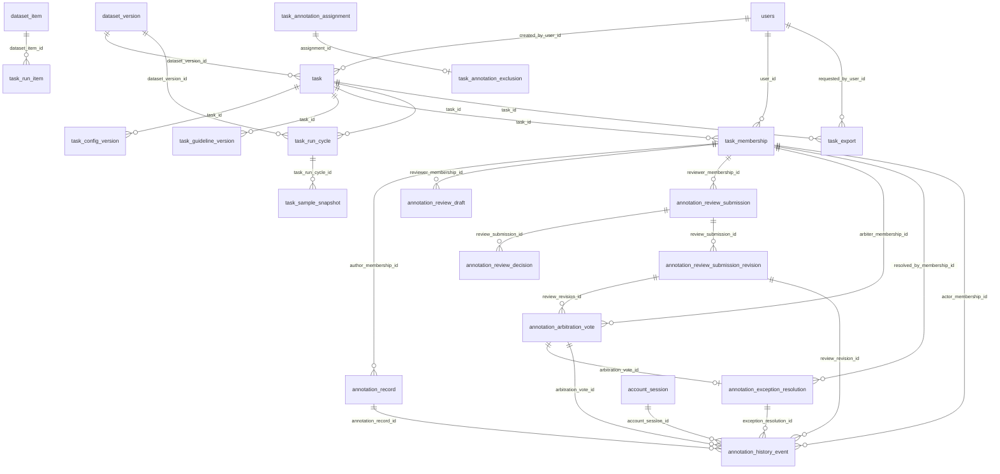

# 資料表盤點與 ERD 落地清單

> 2026-10-08 盤點快照。用途是讓資料庫遷移作者從現行規格追到資料表、欄位與關聯；這是衍生視圖，不新增產品需求。衝突依 [`SDD 權威矩陣`](../../sdd-workflow.md#0-權威矩陣與衝突裁決) 裁決：主憲法 → 適用的 domain constitution → Accepted ADR → canonical feature spec；Proposed ADR 不改變現行規則。

> **MVP 範圍裁決（2026-10-07）**：資料集分析（016／017）的統計、逐型 IAA 報告、品質排名與異常偵測不屬目前 MVP；其專用資料表等正式開發該模組時再規劃。這不取消任務詳情（014）與 Accepted ADR-022 已要求的試標回合 `iaa_computation_status` 及狀態轉換前置條件；MVP 若實作完整試標流程，仍須有可信的計算狀態與結果來源。不可把「分析頁延後」推論成 `waiting_iaa_confirmation` 可以跳過必要檢查。

## 1. 目前資料庫狀態

`backend/alembic/versions/` 只有 `.gitkeep`，`backend/app/` 尚無 ORM model。因此目前**沒有可由程式碼證實已建立的業務表**。下列名稱是資料庫遷移前的規劃，不是已部署資料結構；也不能把 prototype 的 `localStorage` 或 fixture 當作 PostgreSQL 表。

| 層級 | 目前可用資料 | 用法 |
|---|---|---|
| 實際資料結構 | Alembic revision／ORM：0 張業務表 | 日後以資料庫遷移和資料庫 metadata 反查已落地狀態 |
| 實體層草案 | [帳號／管理資料結構](./account-admin-db-schema.md)：9 張／64 欄／6 單欄 FK；[資料集資料結構](./dataset-db-schema.md)：5 張／31 欄／6 單欄 FK；[任務／執行資料結構](./task-run-db-schema.md)：13 張／111 欄／15 單欄 FK；[工時資料結構](./task-work-db-schema.md)：1 張／11 欄／0 單欄 FK；[標記／審核資料結構](./annotation-review-db-schema.md)：8 張／83 欄／15 單欄 FK；[任務匯出資料結構](./task-export-db-schema.md)：2 張／27 欄／2 單欄 FK | 六份字典合計 38 張候選表、327 欄、44 個單欄 FK；複合 FK 另見各字典 §4。仍須獨立資料庫遷移與雙資料庫驗證，均非已部署資料結構 |
| 概念層 | [跨模組 ER 圖](./core-data-model-er.md)：規格實體、推導值與投影 | 用於發現缺表與錯誤的關聯假設，不能直接當 DDL |

**NoteCraft 規劃檢視**：[開啟 Wiki／Diagram](/view/diagrams/architecture/database-schema.er)（來源資料：`database-schema.er.json`）。目前收錄帳號／管理、資料集、任務／執行、工時、標記／審核與匯出的 **38 張候選表、327 欄與 44 個候選單欄 FK**。標記／審核的 8 張表依[實體字典](./annotation-review-db-schema.md)展示標記、審核草稿／提交、修訂、仲裁、例外與歷程；歷程可選擇關聯已驗證的登入工作階段。兩張匯出表保存請求原檔與有序執行範圍；`requested_at` 與內容快照 `exported_at` 分開。工時原始區間、複合 FK 與日投影見[工時實體字典](./task-work-db-schema.md) §3–§7；**已落地業務表仍為 0**。資料集分析專用表依 MVP 範圍裁決延後。修改任一 §3 字典或 JSON 時執行 `node scripts/check-database-schema.mjs`；欄位與 FK 計數由檢查器重新計算。

## 名詞說明：任務發布與執行

資料表名稱與欄位名稱沿用英文識別碼，供程式和資料庫精確引用；以下是閱讀 Wiki／Diagram 與本總帳時使用的中文意思。

| 識別碼／術語 | 中文意思 | 資料表中的位置 |
|---|---|---|
| `run` | **一次執行或發布**：將某個任務的一批公開資料項目發布為一次試標或正式標記。每發布一次就新增一筆執行紀錄；草稿階段尚未發布，所以沒有對應的執行紀錄。 | `task_run` 保存發布類型、所屬週期、所用指引與發布時間。 |
| `cycle` | **一輪發布週期**：在首次試標發布時建立，固定該輪資料集版本、任務設定、抽樣種子與演算法；同輪可有多次試標，最後可發布正式標記。若退回草稿，舊週期只關閉、不刪除；再次試標時另開新週期。 | `task_run_cycle` 保存這輪固定版本與開關時間。 |
| `trial round` | **一次試標回合**：同一發布週期內第 1、2… 次試標，各回合可記錄不同指引版本與試標發現。 | `task_trial_round` 保存回合序號；該次發布另有一筆 `task_run`。 |
| `draft`／`dry_run`／`official_run` | **草稿／試標／正式標記**。草稿可編輯；試標用來演練與檢查；正式標記是該任務對外使用的標記批次。 | `task_run.run_type` 的值保留 `dry_run` 或 `official_run`，畫面說明使用中文。 |
| `PK`／`FK` | **主鍵／外鍵**。主鍵識別本表一筆資料；外鍵指向另一張表，避免引用不存在的資料。 | 圖上的標記表示候選設計，尚未在資料庫建立。 |

例如一個任務可先有第 1 輪發布週期，其中先發布第 1 次試標、再發布第 2 次試標，最後發布正式標記。這是同一個發布週期、兩個試標回合、三筆執行紀錄。

## 2. 盤點方法：沿用 TrendMile 的「盤點 → 資料結構 → 投影」

已核對本機 TrendMile 的 `docs/notification-and-spec-skeleton` 分支與 git 歷史。它的 ER 圖不是先畫出來再補欄位，而是逐步形成：

| 時間與證據 | 當時做的事 | 對 Label Suite 的借鏡 |
|---|---|---|
| 2026-08-12，`f51b117` | 同批建立 [PRD](https://github.com/trendlink/trendmile/blob/docs/notification-and-spec-skeleton/docs/00-prd.mdx)、[欄位盤點](https://github.com/trendlink/trendmile/blob/docs/notification-and-spec-skeleton/docs/80-field-inventory.mdx)、[待釐清問題](https://github.com/trendlink/trendmile/blob/docs/notification-and-spec-skeleton/docs/90-open-questions.mdx) | 一開始就同時保留需求、資料現況與未決事項，不讓圖先替未決事項拍板 |
| 盤點表 §1～§4 | 從 Notion 匯出的 173 欄扣掉 27 欄棄用項，將 146 欄對應至業務模組；再用 PRD §6 流程反查，找出 Notion 沒有的七張表。每個模組並列「原始資料表」與六欄的「系統資料結構」（欄位、型別、必填、預設、鍵／限制、說明），並附 DDL 與結構決議 | 同時走「既有資料 → 新表」和「操作流程 → 缺表」兩個方向；記下正規化與推導值決定 |
| [模組規格撰寫順序](https://github.com/trendlink/trendmile/blob/docs/notification-and-spec-skeleton/docs/specs/00-writing-order.mdx) §「一份規格的撰寫流程」 | 模組 spec 先與 PRD、盤點表對齊，逐題裁決未決事項，最後才產視覺化元件；TrendMile 明訂盤點表 §2 是表結構權威，spec 負責業務語意 | Label Suite 仍遵守自己的權威矩陣：feature／foundation spec 與 Accepted ADR 在上，實體層文件及 ER 圖是衍生視圖，不直接照搬 TrendMile 的權威順序 |
| 2026-09-18，`2618b74`；2026-09-29，`4e5ad98` | 將 ER 資料收斂至 [`81-schema-er-diagram.er.json`](https://github.com/trendlink/trendmile/blob/docs/notification-and-spec-skeleton/docs/81-schema-er-diagram.er.json)，由 [plugin](https://github.com/trendlink/trendmile/blob/docs/notification-and-spec-skeleton/.notecraft/plugins/er-diagram-renderer/derive.ts) 推導連線、父子表和導覽樹；再依四個 PostgreSQL 資料結構分組。`/view/81-schema-er-diagram.er` 是此 JSON 的檢視頁，沒有同名 `.er` 原始檔 | 圖形資料要能追溯到欄位字典；關聯從欄位的 FK 指向推導，不另維護邊清單 |
| [`check-prd.mjs`](https://github.com/trendlink/trendmile/blob/docs/notification-and-spec-skeleton/.claude/skills/prd-writing/scripts/check-prd.mjs) §14 | 比對盤點表與 ER JSON 的表、欄、PK、FK 目標；結構差異報 error，型別字串差異報 warn | Label Suite 日後若有實體層圖形資料源，也要做雙向一致性檢查；不能只驗證圖能渲染 |

本機執行 TrendMile 的 `node .claude/skills/prd-writing/scripts/check-prd.mjs` 得到 **0 error、7 warn**。另直接計算 ER JSON 為 **37 張表、72 個帶 `fk` 的欄位**；檔內手寫摘要仍寫 36／69。現行檢查器沒有檢查這類摘要數字，所以 Label Suite 不應手填可計算的統計值。

Label Suite 的對應做法：

1. **盤點現況**：以 Alembic／ORM 確認「已建表」，以各 `spec.md` 的「關鍵實體」與 FR 確認「需要保存的資料」。逐個操作流程反查：建立任務、上傳資料、發布試標或正式標記、標記、審核、仲裁、品質計算、匯出、稽核。
2. **判斷資料性質**：只有獨立寫入且需要跨請求保存的資料才列為候選表。`OutputConfig`、`OutputAnswer` 這類嵌入設定或答案，與 `ReviewUnit.status`、列表統計這類推導值，不因有「實體」名稱就建表。
3. **逐模組定實體資料結構**：一表一列記名稱、負責模組、PK／唯一鍵、FK、欄位型別／可空性、CHECK／索引、寫入者、生命週期、規格來源與決策狀態。帳號／管理、資料集、任務／執行、工時、標記／審核及匯出已有候選字典；品質／IAA 專用表延後 MVP 後。
4. **由欄位清單產 ER 圖**：實體層 ERD 的 FK 線只能來自已選定的 FK 欄位；現階段的概念關聯圖則必須明示「規劃關聯」，不得冒充資料庫 FK。尚未決定鍵形狀的關聯標為待定。圖的摘要數字由來源計算。
5. **雙向查漏**：每個 spec 的持久化需求要能定位到表／欄位或明確標為待決；每張候選表要能回指規格或 Accepted ADR。當實體層欄位字典與機器可讀圖資料都齊備時，再比對表、欄、PK、FK 目標與型別，並檢查手寫摘要。每次上游改版同步更新盤點與 ER 圖。

本專案的概念層跨模組圖依 [圖表工具規範](../README.md) 使用 Markdown 內嵌 Mermaid；有完整欄位字典的實體層候選表再投影到 NoteCraft Wiki／Diagram。兩種圖都可逐行 diff。`archify` 沒有 ER 資料結構，`diagram-design` 的單圖上限不足以容納全域表數。

## 3. 候選資料表總帳

**狀態語彙**：「實體草案」＝已有欄位字典，但尚未資料庫遷移；「需設計」＝規格要求可保存資料，尚未決定完整表形；「可內嵌」＝需保存但未必獨立建表；「推導／投影」＝不因本身而建表。下表只記來源直接支持的鍵與關聯，不把 `task_id` 等上下文欄位補成已決定的主鍵。

### 帳號與管理

| 候選表 | 狀態 | 已知識別／關聯 | 正典與待決 |
|---|---|---|---|
| `users` | 實體草案 | `id` PK；canonical email 以 `lower(email)` 唯一；`hashed_password` 可空；`credential_version` 非空 | [帳號／管理 §3.1](./account-admin-db-schema.md#31-users平台帳號)、account-020；N-1／D-1／D-6／D-8 已裁決 |
| `account_session` | 實體草案 | `id` PK；`user_id → users`；`started_at` 為登入起點；`revoked_at` 記錄任何失效，`logged_out_at` 僅記錄明確登出成功 | [帳號／管理 §3.2](./account-admin-db-schema.md#32-account_session一次登入的工作階段)、account-020 FR-001／FR-008 |
| `refresh_tokens` | 實體草案 | `id` PK；`session_id → account_session`；不重複保存使用者／登入起點 | 帳號／管理 §3.3、account-020 FR-001／FR-004；D-3 已裁決 |
| `account_password_token` | 實體草案 | `id` PK；`user_id → users` | 帳號／管理 §3.4 |
| `account_email_change_request` | 實體草案 | `id` PK；`user_id → users` | 帳號／管理 §3.5 |
| `account_notification_preference` | 實體草案 | `(user_id, event_key)` PK；`user_id → users` | 帳號／管理 §3.6 |
| `audit_events` | 實體草案 | `id` PK；人員事件的 `actor_user_id → users`、系統事件 actor 為 null；`task_id` 可空 UUID，尚無 task FK | 帳號／管理 §3.7；Accepted ADR-032，D-4 已裁決 |
| `admin_role_permission` | 實體草案 | `(role_type, role_key, permission_key)` 非空複合 PK；V1 僅 42 列適用格 | 帳號／管理 §3.8／§4.7；Accepted ADR-037；尚未資料庫遷移 |
| `admin_role_permission_version` | 實體草案 | `id = 1` 的候選單列版本，缺列拒絕 | 帳號／管理 §3.9／§4.7；Accepted ADR-037；尚未資料庫遷移 |

### 資料集與來源

五張表均為**實體草案、尚未部署**；物理欄位、同資料集父版本複合 FK、分類清單、讀寫邊界及索引見 [資料集實體字典](./dataset-db-schema.md) §3～§6。來源為 [dataset-021](../../../specs/dataset/021-dataset-ingestion-and-lineage/spec.md) FR-001～FR-011；`dataset-016/017` 只消費分析投影。

| 候選表 | 狀態 | 已知識別／關聯 | 正典與待決 |
|---|---|---|---|
| `dataset` | 實體草案 | `id` PK；`created_by_user_id → users` | dataset-021 FR-001／FR-002；名稱非唯一身分，建立者 FK 依 account 表落地 |
| `dataset_version` | 實體草案 | `id` PK；`dataset_id → dataset`；`parent_version_id → dataset_version`，同 dataset 的複合 FK；`(dataset_id, version_no)` 唯一 | dataset-021 FR-002／FR-008；`draft → sealed` 完整快照，清單編碼與保留政策待執行階段前定義 |
| `dataset_import_batch` | 實體草案 | `id` PK；`dataset_version_id → dataset_version`；`(dataset_version_id, source_ordinal)` 唯一 | dataset-021 FR-003／FR-006；逐檔來源、前處理與受限 `classification_manifest`，產物讀取須隔離 |
| `dataset_item` | 實體草案 | `id` PK；`dataset_import_batch_id → dataset_import_batch`；`(dataset_import_batch_id, source_row_no)` 唯一 | dataset-021 FR-004／FR-007；`public_payload` 僅公開允許清單，發布成員由 `task_run_item` 候選表保存 |
| `dataset_item_private` | 實體草案 | `dataset_item_id` 同時 PK／FK → `dataset_item` | dataset-021 FR-005～FR-007；來源 split／hidden answer 隔離，儲存後只授權計分處理程序讀答案 |

### 任務、發布週期與執行

以下 13 張表均為**實體草案、尚未部署**；六欄字典、複合 FK、索引及待決見 [任務／執行實體字典](./task-run-db-schema.md) §3～§7。身分契約來自 013 v8.3.1、014 v10.0.0、015 v12.0.0、ADR-022／037；SQL 型別與保留政策仍須獨立資料庫遷移切片驗證。

| 規格實體 → 候選資料落點 | 狀態 | 已知識別／關聯 | 正典與待決 |
|---|---|---|---|
| `TaskDetail` → `task` | 實體草案 | `id` PK；建立者與當前 `dataset_version` 單欄 FK；當前設定／guideline 非空，須以同 task 延後複合 FK 在交易提交時驗證 | 013／014；歷史版本只由不可變發布週期/執行追溯，初建預配置 task、config、guideline UUID 並同交易建立；循環 FK 的 SQLite／PostgreSQL migration 尚待實測 |
| `TaskConfig` → `task_config_version`；`OutputConfig` 內嵌 | 實體草案／內嵌 | `id` PK、`(task_id,version_no)` 唯一、`schema_version_no=version_no`；完整設定為經驗證 JSON | 013／014；registry 定義與 canonical bytes 保留政策待執行階段定案 |
| `TaskGuidelineConfig` → `task_guideline_version` | 實體草案 | `id` PK、`(task_id,version_no)` 唯一；四個內容欄位與資產參照同列不可變 | 013／014 FR-017a；`force_guideline` 留在 `task`，資產生命週期待決 |
| `TaskMembership` → `task_membership` | 實體草案 | `id` PK、`(task_id,user_id,task_role)` 唯一；task／user 單欄 FK | ADR-037、014；一人可多角色，active 狀態須即時查 |
| 審核員／仲裁員名冊 → `task_reviewer_roster_member` | 實體草案 | `(task_id,reviewer_membership_id)` 複合 PK／FK；`can_arbitrate` 為審核員子集合 | 014 FR-010s-1／FR-010t；建立執行時凍結候選排序 |
| 執行生命週期 → `task_run_cycle` | 實體草案 | `id` PK、`(task_id,cycle_no)` 唯一；封存 dataset/設定；每個任務同時最多一個未關閉的發布週期 | 014 FR-010f、ADR-022；隨機種子／演算法版本須可重播 |
| `TrialRound` → `task_trial_round` | 實體草案 | `id` PK、`(task_run_cycle_id,round_no)` 唯一；同 task 指引版本複合 FK | 014 FR-017a；IAA 計算狀態不代表達標 |
| `SampleSnapshot` → `task_sample_snapshot` | 實體草案 | `id` PK；同發布週期執行一對一，記錄隨機種子、私有不可變清單回執與 SHA-256 digest | 014 FR-010f／FR-010f-6；只含規範排序的公開 UUID，寫入並驗證後由 DB 交易保存引用；不得含私有答案 |
| `AnnotationListMaterialization` → `task_run` | 實體草案 | `id` PK；試標指向同發布週期回合，正式標記的回合為 null；每個任務最多發布一次正式標記 | 014 FR-010f；同 task guideline、冪等 key 與 item_count 候選約束見字典 §4 |
| 發布時審核候選 → `task_run_reviewer_candidate` | 實體草案 | `(task_run_id,reviewer_membership_id)` 複合 PK；保存當時候選及順序 | 014 FR-010t、015 FR-093；不是審核員固定歸屬的紀錄 |
| `AnnotationListItem` 公開成員 → `task_run_item` | 實體草案 | `(task_run_id,dataset_item_id)` 複合 PK；`(task_run_cycle_id,dataset_item_id)` 唯一 | 014 FR-010b／FR-010f；同發布週期不重選，資料項目所屬版本由服務交易驗證 |
| `AnnotationAssignment` → `task_annotation_assignment` | 實體草案 | `id` PK；對同一次執行的資料項目，以及同任務的成員資格，建立複合 FK；每資料項目的 slot_no 唯一 | 014 FR-010f-4／FR-010f-7；不另存工作位 `status`，顯示狀態由終局排除、目前標記紀錄及受派者推導 |
| `ExcludedAnnotationAssignment` → `task_annotation_exclusion` | 實體草案 | `id` PK；`assignment_id` 唯一且 FK 指向穩定工作位 | 014 FR-005h；append-only，`run_id`／`cycle_id` 由 assignment 解析 |
| `ReviewAssignment` → 審核負荷查詢視圖 | 已裁決為非持久化（014 v6.0.0） | 試標黏著 `run_id × dataset_item_id`；正式標記黏著 `run_id × assignment_id` | 依 015 FR-051／FR-093(5) 的 submission、執行候選快照與即時資格推導；不建立第二份指派表或 FK。#1165 於 014 v5.2.2 的三欄邏輯參照僅為舊版候選沿革，已被 v6.0.0 取代 |
| `WorkLogEntry` → 工時日投影 | 非持久化查詢投影 | 以登入工作階段、任務、執行、成員資格、工作種類及台北日期定址；時長、三種完成數與逐類速度從來源推導 | 014 v9.0.0 FR-007b／FR-007d／FR-010u；不建立 `WorkLogEntry` 表 |
| 可觀測前景工作區間 → `task_work_interval` | 實體草案 | `id` PK；三組同任務／同使用者複合 FK；`(user_id) WHERE ended_at IS NULL` 部分唯一 | [工時實體字典](./task-work-db-schema.md) §3–§7；尚未遷移與雙庫實測 |
| `RunStateTransition` → `task_status_transition` 候選 | 需設計 | `task_id`、操作者、時間、前後狀態 | 014／ADR-022；與 `audit_events` 的事件分工及表形待裁決，未列入本批 13 表 |
| `IsolationAuditLog` → 隔離設定稽核表 | 需設計 | `task_id`、`changed_by`、時間 | 014 關鍵實體；與共用 `audit_events` 的事件語意和去重方式待 task 模組定案 |

### 匯出紀錄與原始產物

兩張表均為**實體草案、尚未部署**；欄位型別、主鍵、真單欄 FK、同任務複合 FK、索引、保存期限與安全邊界見[任務匯出實體字典](./task-export-db-schema.md) §3～§7。正典來源為 014 v8.0.1，背景產物與資料庫交易須在獨立實作中驗證。

| 規格實體 → 候選資料落點 | 狀態 | 已知識別／關聯 | 正典與待決 |
|---|---|---|---|
| 匯出請求及歷史 → `task_export` | 實體草案 | `id` PK；`task_id → task`、`requested_by_user_id → users` 真單欄 FK；一次請求一份原始產物，保存摘要及期限 | 014 FR-010i／FR-021；受限儲存、授權、原子發布與雙庫實測待執行階段 |
| 有序執行範圍 → `task_export_run` | 實體草案 | `(export_id,run_id)` 複合 PK；`(task_id,export_id)`、`(task_id,run_id)` 兩組同任務複合 FK；`position` 保持 manifest 順序 | 014 FR-009a／FR-010i；不把複合 FK 誤畫成單欄關聯 |

### 標記、審核與品質

標記／審核八張表均為**實體草案、尚未部署**；六欄字典、六組 assignment 複合 FK、索引與待決見 [標記／審核實體字典](./annotation-review-db-schema.md) §3～§7。014 v8.0.1／015 v12.0.0 已規劃來源凍結、一次仲裁與草稿隔離；尚無 ORM、資料庫遷移或 API。品質／IAA 專用表留待資料集分析模組正式開發。

| 規格實體 → 候選資料落點 | 狀態 | 已知識別／關聯 | 正典與待決 |
|---|---|---|---|
| `AnnotationListItem` → `task_run_item`／assignment 投影 | 推導／投影 | 執行資料項目為 `(task_run_id,dataset_item_id)`；標記工作以穩定 assignment ID 定址 | 014／015；不另建清單表 |
| `AnnotationRecord` → `annotation_record` | 實體草案 | `id` PK、`run_id × assignment_id` 複合 FK、作者成員資格單欄 FK；有效列部分唯一 | 015 FR-049／FR-105；答案為釘住設定驗證的 JSON，重派前舊草稿轉 abandoned |
| 未提交審核員決策 → `annotation_review_draft` | 實體草案 | `id` PK、單位複合 FK、審核員成員資格 FK；有效草稿部分唯一 | 015 FR-014S；只本人可見，失權即失效 |
| 正式 `ReviewDecision` → `annotation_review_submission`／`annotation_review_decision`／`annotation_review_submission_revision` | 實體草案 | 單位唯一 head、逐 outKey 唯一決策、不可變 revision | 015 FR-093／FR-103／FR-105；首票後凍結改判，提交必須完整且同交易 |
| `DisputeItem` → 推導值；寫入票 → `annotation_arbitration_vote` | 推導／實體草案 | `run_id × assignment_id × output_key × item_key` 唯一票；指向不可變 review revision | 015 FR-052／FR-059／FR-061／FR-065；爭議 A/B 由來源推導，不建 `DisputeItem` 表 |
| `reject` 收尾 → `annotation_exception_resolution` | 實體草案 | 同爭議鍵與 vote 各最多一筆 resolution；PL 成員資格 FK | 015 FR-095；exclude 只排除輸出項目，不刪公開資料項目 |
| `AnnotationHistoryItem` → `annotation_history_event` | 實體草案 | 單位內 `event_no` 唯一；審核事件指向不可變 revision；可空 `account_session_id → account_session` | 015 v12.1.0 FR-086～FR-091／FR-097；僅寫可驗證 session，舊事件與系統動作可空，敏感快照須按角色遮蔽 |
| `OutputTypeIAAReport` → 品質計算結果 | 需裁決 | `output_type`、metric、threshold、`pass_state` | dataset-017 FR-039；是否持久化與版本鍵未定 |

工時原始區間已有[工時候選字典](./task-work-db-schema.md)，匯出請求與原始產物已有[匯出候選字典](./task-export-db-schema.md)；狀態轉換與隔離設定稽核仍待完整實體表形。來源／批次／項目與私有答案已在 dataset 候選字典有表形；任務／執行及標記／審核已有候選型別與 FK。保留政策、跨表資格、爭議鍵與工時執行期約束仍待資料庫遷移及雙庫驗證。

### 非持久化投影與尚待實體字典承接的規格欄位

以下包含不建表的查詢投影及仍待完整物理字典的項目；已規劃的欄位及可空性以六份 §3 字典為準，不在本總帳維護第二份欄位清單。

| 規格實體 | 來源明列欄位 | 尚缺的資料庫決定 |
|---|---|---|
| `ReviewAssignment`（非持久化查詢視圖） | `run_id`, `assignment_id`, `reviewer_id`, `pending`, `done`, `assigned`（由來源推導，非 SQL 欄位） | 不建立表、PK 或 FK；試標黏著以同執行的 dataset 資料項目為單位，正式標記以 assignment 為單位 |
| `WorkLogEntry`（非持久化查詢投影） | `account_session_id`, `task_id`, `run_id`, `membership_id`, `work_kind`, `report_date` 為列鍵；顯示 `user_id`, `task_role`, `run_stage`, `login_at`, `logout_at`, `online_duration`, `duration`, `annotated_count`, `reviewed_count`, `arbitrated_count` 與逐類單位的速度 | 原始前景工作區間已由 `task_work_interval` 承接；各完成數與逐類速度按 014 v9.0.0 推導，不建立日彙總表 |
| `RunStateTransition` | `from_status`, `to_status`, `triggered_by`, `triggered_at` | `task_id`、事件 PK 與 `audit_events` 去重仍待裁決 |
| `IsolationAuditLog` | `task_id`, `from_isolation_enabled`, `to_isolation_enabled`, `changed_by`, `changed_at`, `reason` | 與通用稽核事件的寫入責任與去重 |
| `OutputTypeIAAReport` | `output_type`, `primary_metric_name`, `primary_metric_value`, `threshold`, `pass_state`, `auxiliary_metrics[]` | 是否持久化與計算版本；`free_text` 無數值門檻 |

014／015 已補執行／assignment 作用域，標記／審核的八表亦有候選 SQL 欄型與 FK；工時區間已形成第六份實體字典。仍須先定爭議鍵編碼、保留與例外排除分母，再做獨立資料庫遷移／雙庫測試。`RunStateTransition` 與共用稽核的分工尚未裁決。

## 4. ER 圖：目前可確認的關聯骨架

下圖使用已列在六份欄位字典的候選表名，**只表示候選單欄 FK**；同 task／同發布週期／同執行與工時歸屬的複合 FK 另見 [任務／執行字典 §4](./task-run-db-schema.md#4-限制清單)、[工時字典 §4](./task-work-db-schema.md#4-主鍵複合外鍵與工作邊界)、[標記／審核字典 §4](./annotation-review-db-schema.md#4-pkunique-fk-與-check-候選)及[匯出字典 §4](./task-export-db-schema.md#4-鍵限制與生命週期)。這不是已部署約束。完整欄位與互動圖見 [NoteCraft Wiki／Diagram](/view/diagrams/architecture/database-schema.er)。`ReviewAssignment` 與 `WorkLogEntry` 是非持久化查詢視圖，因此不畫成資料表或 FK。

`task_work_interval` 的任務／執行／成員／登入工作階段關聯，以及 `task_run_item → task_run`、`task_run → task_sample_snapshot`、`task_annotation_assignment → task_run_item` 等同作用域關聯由複合 FK 候選約束表達，不能在這裡畫成單欄線。`annotation_record` 等六表到 assignment 的同單位關聯為複合 FK，不畫成單欄線；`ReviewUnit` 與 `DisputeItem` 仍為推導值。

## 5. 在第一批資料庫遷移前要關閉的決策

| 優先 | 問題 | 為何阻擋 | 來源 |
|---|---|---|---|
| 已裁決／實作前待驗 | 通用稽核表形 | D-4 採 `audit_events`，所有事件至少留一個日曆年；`task.id` 已有 UUID 候選，但 audit 的 `task_id` 真實 FK、刪除保留與遷移順序仍待正典及資料庫遷移裁決，不從候選表推定已落地 | Accepted ADR-032、帳號／管理 §3.7／§4.6、任務／執行 §3.1 |
| 已裁決 | 角色權限矩陣如何參與授權 | 兩張表保留為未部署候選；42 列初始格、固定格、CAS 與稽核目標依 ADR-037；執行階段與資料庫遷移另案實作 | Accepted ADR-037、admin-007 v1.2.0、帳號／管理 §4.7 |
| 候選已定／實作前待驗 | 標記與審核的執行身分及黏著推導 | 014 v9.0.0／015 v12.1.0 已定 `run_id × assignment_id` 審核單位，試標 `run_id × dataset_item_id`、正式標記 `run_id × assignment_id` 推導黏著；不得建立 `ReviewAssignment` 表或將 #1165 三欄舊邏輯參照轉成 FK。八張標記／審核候選表及 15 個單欄 FK 已列字典；仍待資料庫遷移、爭議鍵編碼、保留政策與雙庫實測 | 014／015 關鍵實體、015 FR-049／FR-051／FR-093 |
| 候選已定／實作前待驗 | 資料項目、隱藏答案與來源沿革的五表邊界 | dataset-021 與字典已定逐檔分類、公開／私有分表及完整版本；清單編碼、保留政策、任務／執行綁定與雙資料庫實測仍需後續工作 | dataset-021 FR-001～FR-011、[資料集字典](./dataset-db-schema.md)；主憲法 III／XIV／XVI |
| MVP 後 | IAA 報告是否獨立表與版本鍵 | `TaskConfig`／`TaskGuidelineConfig` 已有候選版本表；`OutputTypeIAAReport` 的持久化與版本鍵留待資料集分析模組正式開發時裁決。MVP 試標流程仍須遵守 014／ADR-022 的回合計算狀態與轉換條件 | 013／014／017 關鍵實體、任務／執行字典 §3 |

每項定案後，先更新對應 spec／ADR，再填實體層的欄位字典與限制清單，最後更新本總帳和 ERD。這遵循 [SDD 工作流程](../../sdd-workflow.md) 的 Source-Verify／write-back 原則；未完成前本文件不能當作可執行資料庫遷移規格。

## 6. 後續盤點：品質分析延後；工時與匯出已有候選字典

工時與匯出已畫入 NoteCraft，分別有一張及兩張**未部署候選表**，見上方總帳與[工時字典](./task-work-db-schema.md)、[匯出字典](./task-export-db-schema.md)；這仍不代表 ORM 或資料庫遷移已建立。資料集分析專用的品質表依 MVP 範圍裁決延後，正式開發 016／017 時再走正典 → 字典 → ER 圖。

| 主題 | 現行規格已確定 | 候選落點與尚待正典裁決 | 完成條件 |
|---|---|---|---|
| 品質／IAA（MVP 後） | [017 FR-039](../../../specs/dataset/017-dataset-analysis-detail/spec.md) 規定只用單一試標回合的標記員原始答案，排除明確排除作業與 bypass；[014 FR-010o-4](../../../specs/task-management/014-task-detail/spec.md) 將計算狀態放在試標回合，失敗可同回合重試。`free_text` 不計自動 IAA，`sequence_tagging` 可計分但沒有門檻；「無法計算」與計算失敗不同。 | `task_iaa_result` 只是正式開發時可評估的候選，**本輪不建立字典或加入 NoteCraft**。屆時由 017／014 定案是否持久化、輸出鍵唯一性、演算法／輸入摘要版本、重算政策、數值精度、保留期。017 的 `SampleDivergenceFlag` 明言分開儲存，`LowConsistencySampleList` 也提到寫入路徑；兩者**不可先歸為純即時計算**。 | 正式開發 016／017 時回寫儲存與版本契約，再出六欄字典、FK／CHECK／索引、雙庫驗收與 NoteCraft 投影。MVP 另驗 014 已要求的回合計算狀態、`De = 0` 與轉換條件。 |
| 工時 | 014 v9.0.0 已定前景工作區間、逐類完成數／速度、台北日期切割、失聯與未知值；015 v12.1.0 明確區分歷程耗時與工時。 | `task_work_interval` 為原始來源；`WorkLogEntry` 只做唯讀投影。`account_session` 保留可驗證登入／登出時間，標記歷程可空關聯已驗證的 session。詳見[工時實體字典](./task-work-db-schema.md)。 | 正典、字典與 NoteCraft 投影已完成；ORM／migration、並發約束、心跳服務、跨日投影、隱私保留與 SQLite／PostgreSQL 實測仍待獨立實作。 |
| 匯出 | [014 v8.0.1 FR-009a／FR-010i-1／2、FR-020／021](../../../specs/task-management/014-task-detail/spec.md) 已定一次請求一份不可變原始產物、逐 run 有序 manifest、重新下載相同 bytes；`json-min` v2 零列仍有 manifest。 | [匯出候選字典](./task-export-db-schema.md) 的 `task_export`／`task_export_run` 共 27 欄、2 個真單欄 FK；同 task 關聯是兩組複合 FK，不畫假線。接受時間 `requested_at` 與內容快照 `exported_at` 分離；原檔保存 30 日，歷史 metadata 一年；下載需驗目前權限、期限與 SHA-256。 | 正典、字典與 NoteCraft 投影已完成；ORM／migration、受限儲存、跨庫複合 FK、下載授權、原檔校驗與保留刪除仍待獨立實作驗證。 |

後續先釐清 §5 的循環建立次序、抽樣清單回執、assignment 狀態及刪除保留政策，再對 MVP 範圍執行 issue #1160 的「正典需求 ↔ 欄位字典 ↔ ER JSON」雙向驗收。資料集分析專用表另於 M6 開發時盤點；真正的 ORM／migration／API 與 SQLite／PostgreSQL 約束測試屬獨立實作階段，不能因 NoteCraft 可顯示候選表便勾選其部署驗收。
