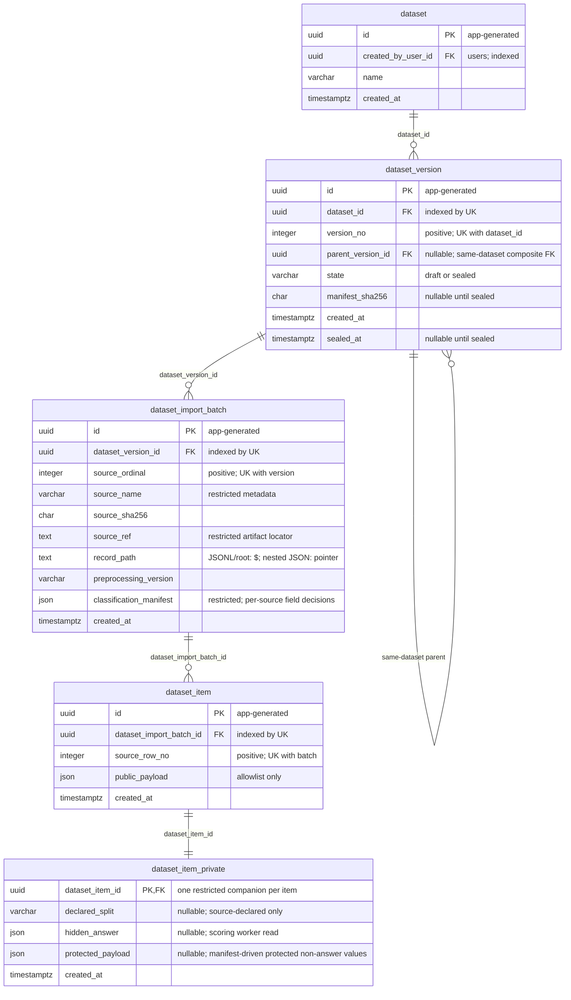

# dataset 資料庫 schema（實體層候選）

> **受眾**：後續 ORM、migration、repository 與安全測試作者。這是 issue #1160 的規劃字典，不是已部署 schema；目前 `backend/alembic/versions/` 沒有業務 migration，`backend/app/` 沒有 dataset ORM。

- **權威與範圍**：主憲法 III／XIV／XVI、backend／testing constitution、Accepted ADR-005／ADR-024、[dataset-021 Draft 正典規格](../../../specs/dataset/021-dataset-ingestion-and-lineage/spec.md) 及 foundation FR-105／FR-106 優先於本衍生文件。本文件只描述 `dataset` 擁有的五張候選表；`users` 是 account 候選父表。`dataset-016/017` 的分析投影不是匯入表。
- **設計定位**：[設計候選](../../superpowers/specs/2026-10-06-dataset-lineage-design.md)比較了私有伴隨表、混合 JSON 與檔案唯一儲存。依 dataset-021 FR-001～FR-011，本字典採公開 item＋1:1 私有列＋受限原始來源 artifact。task/run 的候選跨模組 FK 已在 [task/run 字典](./task-run-db-schema.md) 描述；annotation、export 的實體 FK 仍待 owning spec 定義。本文件不反向畫未定的線。
- **狀態**：五張表全為**候選、尚未部署**。欄位及限制須經 SDD、Red 測試、獨立 ORM／migration PR、SQLite＋真實 PostgreSQL roundtrip 後才能稱為實際 schema；NoteCraft `.er.json` 只能投影本字典已列欄位與單欄 FK。

## 1. 設計決定與資料責任

| 決定 | 結果 | 來源 |
|---|---|---|
| 命名 | 五張單數 `dataset` 前綴表；UUID 身分由應用程式產生；時間欄用 `_at` | foundation FR-105／FR-106；dataset-021 FR-001 |
| 版本 | `dataset_version` 為完整快照；`draft → sealed` 後不可原地修改，父版本只記 lineage；sealed 不可變由 DB trigger 強制（V-07／V-08） | dataset-021 FR-002／FR-008、AC-3.1／3.2；ADR-024 增補 |
| 來源與分類 | 每個已接受檔案一個有序 batch，該 batch 保存欄位分類 manifest；item 的版本、來源及 preprocessing 由 item→batch→version FK 鏈取得 | dataset-021 FR-003／FR-004／FR-006、AC-1.1／1.2／2.1 |
| 資料公平性 | `dataset_item.public_payload` 僅含明確允許的可見欄位；`dataset_item_private` 裝來源宣告的 split、hidden answer，以及 manifest 分類為受保護但非答案的欄位值（`protected_payload`） | 主憲法 III；ADR-005；dataset-021 FR-005～FR-007 |
| 原始 JSON | 建立者只於匯入前以本機所選檔案預覽；匯入後 `source_ref` 指向受限、不可變來源 artifact，一般 API 不重現受保護原始檔 | task-013 FR-002b／FR-003g-5；dataset-021 AC-2.5 |

## 2. ERD

下列為**候選 FK**。`dataset_version.parent_version_id` 的單欄線只表示自參照；「父版本須同 dataset」靠 §4 的複合 FK。`dataset.created_by_user_id → users.id` 的 account 父表見[account/admin 字典](./account-admin-db-schema.md)，不在此重複定義。

## 3. 欄位字典

「可空」只指 SQL `NULL`；應用程式仍須驗證空字串、JSON 形狀、版本狀態與私有列完整性。「規則」編號見 §4。型別為 PostgreSQL 表示法；SQLite 對應見 §6。`→` 表示候選單欄 FK，複合父版本 FK 另於 §4 定義。

### 3.1 dataset：邏輯資料集

一列＝一個資料集身分，不存 item 總數或「目前版本」投影。寫入者為授權匯入／建立服務；讀取者為經授權的管理與任務建立流程。建立者 FK 對 `users` 仍待 account 表實際落地。

| 欄位 | 型別 | 可空 | 代表什麼 | 何時寫入／改變 | 規則 |
|---|---|---|---|---|---|
| `id` | uuid | 否 | 應用程式產生的穩定資料集身分（PK） | 建立時；不改 | D-01 |
| `created_by_user_id` | uuid → users | 否 | 授權建立者帳號 | 建立時；不改 | D-01、S-01 |
| `name` | varchar | 否 | 建立者指定名稱，不作全域唯一身分 | 建立時；draft 期間可改名 | D-02 |
| `created_at` | timestamptz | 否 | 建立時間（UTC） | 建立時；不改 | X-01 |

### 3.2 dataset_version：完整資料集快照

一列＝單一 dataset 的一個完整版本。授權匯入服務建立 draft；授權封存服務在一筆交易內寫 manifest、`sealed_at` 及 `sealed`。已 sealed 的來源與項目不可改；讀取者為授權管理流程及後續只接受 sealed 版本的 task/run 服務。

| 欄位 | 型別 | 可空 | 代表什麼 | 何時寫入／改變 | 規則 |
|---|---|---|---|---|---|
| `id` | uuid | 否 | 版本身分（PK） | 建立時；不改 | V-01 |
| `dataset_id` | uuid → dataset | 否 | 所屬邏輯資料集 | 建立時；不改 | V-01、V-02 |
| `version_no` | integer | 否 | 同 dataset 內正整數版本號 | 建立時；不改 | V-02、V-03 |
| `parent_version_id` | uuid → dataset_version | 是 | 同 dataset 的直接父版本；首版為 null | 建立後繼版本時；不改 | V-03、V-04 |
| `state` | varchar(16) | 否 | `draft` 或 `sealed` | 建立時為 draft；成功封存時改 sealed | V-05、V-06、V-07 |
| `manifest_sha256` | char(64) | 是 | 有序完整快照 manifest 摘要；draft 為 null | 封存交易一次寫入 | V-05、V-06 |
| `created_at` | timestamptz | 否 | 版本建立時間（UTC） | 建立時；不改 | X-01 |
| `sealed_at` | timestamptz | 是 | 成功封存時間（UTC）；draft 為 null | 封存交易一次寫入 | V-05、X-01 |

### 3.3 dataset_import_batch：單一來源檔批次

一列＝此版本中一個已接受的來源檔；同一版可有多個有序 batch。**`classification_manifest` 由本表擁有**，因各檔即使使用相同欄名，也可能有不同可見性與敏感性判定。授權匯入程序在讀取上傳串流時建立來源 checksum、欄位清單、PII 審查結果及分類 manifest；draft 可修正，sealed 後不可改。`source_name`／`source_ref`／`record_path`／`classification_manifest` 均為受限 metadata，不進標記者 response、cache 或 trace。原始 artifact 匯入後在一般應用流程中不提供讀取；建立者只在**匯入前**預覽本機選取的來源檔。

| 欄位 | 型別 | 可空 | 代表什麼 | 何時寫入／改變 | 規則 |
|---|---|---|---|---|---|
| `id` | uuid | 否 | 來源批次身分（PK） | 接受來源檔時；不改 | B-01 |
| `dataset_version_id` | uuid → dataset_version | 否 | 所屬完整快照 | draft 匯入時；不改 | B-01、V-06 |
| `source_ordinal` | integer | 否 | 多檔中的正整數順序 | draft 接受時；sealed 後不改 | B-02 |
| `source_name` | varchar | 否 | 來源檔名稱；受限 metadata | draft 接受時；sealed 後不改 | B-03、S-01 |
| `source_sha256` | char(64) | 否 | 匯入串流的 SHA-256，對應受限不可變 artifact | 匯入前串流驗證時寫入；sealed 後不改 | B-03、V-06 |
| `source_ref` | text | 否 | 受限不可變 artifact 的內部位置，不是下載 URL | draft 儲存來源時；sealed 後不改 | B-03、S-01 |
| `record_path` | text | 否 | 紀錄集合位置：JSONL／根陣列用 `$`，巢狀 JSON 用 RFC 6901 JSON Pointer（如 `/data/items`） | draft 解析時；sealed 後不改 | B-03 |
| `preprocessing_version` | varchar(80) | 否 | 此批次使用的前處理版本；不得由 item 內容猜測 | draft 匯入時；sealed 後不改 | B-03、N-01 |
| `classification_manifest` | json | 否 | 此檔全部來源欄位路徑的公開／受保護分類與 PII 審查證據；不含答案值 | 匯入前由授權建立流程確認，匯入時寫入；draft 修正僅限公開改為受保護（其他方向須重新上傳該批來源），sealed 後不改 | B-04、I-03、S-01 |
| `created_at` | timestamptz | 否 | 批次接受時間（UTC） | 接受時；不改 | X-01 |

### 3.4 dataset_item：可下發項目

一列＝某 batch 選定紀錄路徑下的一筆已接受來源紀錄。授權匯入服務於 draft 寫入；下游標記流程只讀經明確 allowlist 驗證的 `public_payload`，不得序列化與 private 的 ORM 關聯。來源內原有 `id` 不作 PK；同內容可存在不同 batch 或完整後繼版本。

| 欄位 | 型別 | 可空 | 代表什麼 | 何時寫入／改變 | 規則 |
|---|---|---|---|---|---|
| `id` | uuid | 否 | 穩定項目身分（PK） | 接受紀錄時；不改 | I-01 |
| `dataset_import_batch_id` | uuid → dataset_import_batch | 否 | 來源批次；經此 FK 追到來源、前處理與版本 | draft 接受時；不改 | I-01、N-01 |
| `source_row_no` | integer | 否 | 一基來源位置：JSONL 為實際行號，JSON 陣列為元素序號；不以來源自帶 `id` 取代 | draft 接受時；不改 | I-02 |
| `public_payload` | json | 否 | 經驗證的可見欄位 JSON 投影；可含建立者明選的 Output 預標記 | draft 建立／修正；sealed 後不改 | I-03、S-01 |
| `created_at` | timestamptz | 否 | 項目接受時間（UTC） | 接受時；不改 | X-01 |

### 3.5 dataset_item_private：來源 split、隱藏答案與受保護欄位值

一列＝一筆 item 的受限伴隨資料；即使來源沒有答案也要有一列，防止私有列有無成為 test 身分訊號。授權匯入程序只寫入／draft 修正；**儲存後 hidden answer 只由授權 scoring worker 讀取**。`protected_payload` 存放該批 `classification_manifest` 分類為受保護、但不是答案的欄位值，與 `hidden_answer` 分欄、讀取權分開授權。標記者、一般建立者與一般 API 不得讀取此表、其來源路徑或基於它的 metadata。

| 欄位 | 型別 | 可空 | 代表什麼 | 何時寫入／改變 | 規則 |
|---|---|---|---|---|---|
| `dataset_item_id` | uuid → dataset_item | 否 | 項目 ID；同時為 PK 與 FK | 與 item 同一交易建立；不改 | P-01、P-02 |
| `declared_split` | varchar(16) | 是 | **來源宣告**的 split；不是 run 的抽樣結果 | draft 匯入／修正；sealed 後不改 | P-03、S-01 |
| `hidden_answer` | json | 是 | 受保護答案 envelope；null＝來源未提供 | draft 匯入／修正；sealed 後不改 | P-03、S-01 |
| `protected_payload` | json | 是 | 受保護但非答案的欄位值 envelope（鍵取自該批 classification_manifest 受保護集合）；null＝無此類欄位 | draft 匯入／修正（公開改受保護時由 public_payload 搬入）；sealed 後不改（V-08） | P-04、S-01 |
| `created_at` | timestamptz | 否 | 私有列建立時間（UTC） | 與 item 同一交易建立；不改 | X-01 |

## 4. 限制清單（ERD 表達不了的規則）

**DB** 指 SQLite 與 PostgreSQL 均須由 PK／FK／UNIQUE／CHECK 擋下；**SVC** 指需要服務交易與授權判定；**SEC** 指 `@pytest.mark.security` 遞迴檢查。規則 ID 對應 §3；migration 落地前都只是預定驗證，不表示已測試通過。

| ID | 執行位置 | 限制與驗證方向 | 來源 |
|---|---|---|---|
| D-01 | DB | `id` UUID PK、`created_by_user_id` 非空真實 FK → `users.id`；不存在的建立者被拒絕 | dataset-021 FR-001／FR-002；backend constitution VI |
| D-02 | SVC | 名稱須為有效非空文字；`name` 不作唯一鍵，重名不影響版本與項目身份 | dataset-021 FR-001；本字典決策 |
| V-01 | DB | `dataset_version.id` PK、`dataset_id` 非空 FK；另設 UNIQUE (`id`, `dataset_id`) 作同 dataset 複合自參照 FK 的目標 | dataset-021 FR-002 |
| V-02 | DB | UNIQUE (`dataset_id`, `version_no`)；`version_no > 0` | dataset-021 FR-002、AC-1.3 |
| V-03 | DB | `parent_version_id` 可空；複合 FK (`parent_version_id`, `dataset_id`) → `dataset_version(id, dataset_id)`；CHECK (`parent_version_id IS NULL OR parent_version_id <> id`)。Mermaid 單欄線不能替代複合 FK | dataset-021 FR-002、AC-1.3 |
| V-04 | SVC | 父版本鏈不得成環，後繼 `version_no` 必須大於父版本；封存前在交易內核對，並行建立時由唯一鍵與明確衝突處理保護 | dataset-021 FR-002、SC-002 |
| V-05 | DB | `state IN ('draft','sealed')`；draft 時 `manifest_sha256` 與 `sealed_at` 同為 null，sealed 時同為非 null；SHA-256 固定 64 個 hex 字元（值格式於 Pydantic 與 DB 一致驗證） | dataset-021 FR-008、AC-3.1 |
| V-06 | SVC | `draft → sealed` 同一交易驗每批分類 manifest 與 PII 審查、匯入時取得的來源 digest 證據、每 item 私有列、有序 manifest（含各批分類 manifest 摘要），再寫 digest、時間、狀態及 audit event；重試冪等（已 sealed 時先讀後回，不送出 no-op UPDATE，否則會被 V-07 拒絕）、競爭衝突（seal 交易讀 item 與算 digest 前先以 `FOR UPDATE` 鎖版本列）、失敗回滾。seal 不為 checksum 重新讀取含答案的已儲存原始 artifact；sealed 後 batch/item/private/source 不可原地改，需新完整版本（DB 強制見 V-07／V-08） | dataset-021 FR-008、AC-3.1／3.2；backend constitution XII |
| V-07 | DB | `dataset_version` 各掛一個 `BEFORE UPDATE`／`BEFORE DELETE` trigger（SQLite 與 PostgreSQL 各一份）：`OLD.state='sealed'` 時拒絕任何 UPDATE（含 `sealed → draft`）與 DELETE；draft 編修與 `draft → sealed` 轉換允許；另掛 `BEFORE INSERT` trigger，拒絕直接以 `sealed` 新增的列（版本一律先建 draft，封存須經 FR-008 驗證交易；種子與還原同樣先建 draft 再 seal）；app role 無 `TRUNCATE` | dataset-021 FR-008、AC-3.2；ADR-024 增補 (2026-10-08) |
| V-08 | DB | `dataset_import_batch`／`dataset_item`／`dataset_item_private` 各掛 `BEFORE INSERT`／`BEFORE UPDATE`／`BEFORE DELETE` trigger：所屬版本（item → batch → version）為 sealed 時拒絕；UPDATE 同時檢查 `OLD` 與 `NEW` 所屬版本以擋改掛；PostgreSQL 以 `FOR SHARE` 讀版本列與並行 seal 序列化；app role 無 `TRUNCATE` | dataset-021 FR-008、AC-3.2、FR-011；ADR-024 增補 (2026-10-08) |
| B-01 | DB | batch PK、非空 version FK；來源檔必須屬於一個確定版本 | dataset-021 FR-003 |
| B-02 | DB | UNIQUE (`dataset_version_id`, `source_ordinal`) 與 `source_ordinal > 0`；同版來源順序不可重複 | dataset-021 FR-003、AC-1.2 |
| B-03 | DB＋SVC | `source_sha256` 為 64 hex；`source_name`、`source_ref`、`record_path`、`preprocessing_version` 非空白。匯入程序在來源尚未成為已儲存 artifact 前，串流計算 SHA-256、驗證內容並取得不可變儲存回執；seal 核對受信回執／digest 與 batch 值，不從一般維護路徑重讀 artifact。`record_path='$'` 代表 JSONL／根 JSON 陣列；巢狀 JSON 用有效 RFC 6901 Pointer | dataset-021 FR-003／FR-008、AC-1.1 |
| B-04 | SVC | `classification_manifest` 為非空、版本化且經 Pydantic 驗證的 JSON：每個來源欄位路徑恰分類為公開或受保護，兩集合互斥，並記錄 PII 審查完成證據；不得把答案值寫入 manifest。每批獨立持久化，對照該批實際欄位與 `field_role_map` 後才產生 item 投影；draft 修正 manifest 僅允許公開改為受保護：只刪除該欄位的公開投影，並把該欄位已存於 `public_payload` 的公開值（非答案）搬入同一 item 私有列的 `protected_payload`，不讀取已儲存的含答案資料；受保護改公開或為尚未分類的欄位新增分類，一律須重新上傳該批來源並走串流匯入器重建，不得原地重建 | dataset-021 FR-006、AC-2.1／2.2／2.6 |
| I-01 | DB | item PK、非空 batch FK；不複製 version/source/preprocessing 至 item | dataset-021 FR-001／FR-004 |
| I-02 | DB | UNIQUE (`dataset_import_batch_id`, `source_row_no`) 與 `source_row_no > 0`；來源自帶 `id` 不全域去重 | dataset-021 FR-004、AC-1.2 |
| I-03 | SVC＋SEC | `public_payload` 只接受所屬 batch `classification_manifest` 的公開欄位 allowlist；protected 與 Input／Evidence／Output 不得重疊，分類或 PII 審查缺漏則不能 seal。用任意名稱與巢狀合成答案測漏，不以 `gold_*` 名稱猜測 | dataset-021 FR-006／FR-007、AC-2.1／2.2；task-013 FR-002c-8／FR-003g-5 |
| P-01 | DB | `dataset_item_id` 同時為 PK／FK；同一 item 最多一筆 private 列，無孤兒 private | dataset-021 FR-005、AC-2.3 |
| P-02 | SVC | item 與 private 在同一交易建立；封存前檢查每 item 恰有一列。單向 FK 無法獨力保證每 item 至少一列 | dataset-021 FR-005／FR-008 |
| P-03 | SVC | null 只表示來源未宣告；實際 test 集若需要答案而為 null，由後續 scoring／publish 契約拒絕。來源 split 不等於 run split；合法 split 詞彙與答案 JSON shape 待 runtime 前正典定案 | dataset-021 FR-005、FR-010 |
| P-04 | SVC | `protected_payload` 只存該批 `classification_manifest` 受保護集合內、非答案的欄位值，鍵完全由 manifest 驅動、不寫死欄名；不存 `hidden_answer` 答案，兩者分欄；null＝該 item 無此類欄位。讀取權與 `hidden_answer` 分開授權，不新增讀取角色；公開改受保護時，值由 `public_payload` 搬入並同步移除公開投影 | dataset-021 FR-005、FR-006、AC-2.6 |
| S-01 | DB 權限＋SVC＋SEC | PostgreSQL 的標記者服務讀取角色不能 `SELECT` private 表（含 `protected_payload`）或受限來源；SQLite 由 repository／response allowlist 隔離。匯入程序只在來源尚未儲存時讀取上傳串流並寫入受限資料；**儲存後任何含答案內容只允許授權 scoring-worker 路徑讀取**，一般維護、建立者與預覽路徑不可讀 raw artifact 或 private 答案；draft 修正 manifest 同樣不讀取已儲存的含答案資料，也不新增任何可讀答案的角色；`protected_payload` 走同一受限私有路徑，讀取權與 `hidden_answer` 分開授權，scoring worker 不因可讀答案而自動取得此欄讀取權，不新增讀取角色。所有標記者 response、state、log、cache、trace、fixture 不含 split、答案或來源位置 | 主憲法 III；backend constitution III／VI／VII；testing constitution VIII；dataset-021 FR-005～FR-007、AC-2.6 |
| X-01 | SVC | 時間以 UTC 正規化；PostgreSQL 用 `TIMESTAMPTZ`，SQLite 以應用層正規化讀寫，不能假定 SQLite 保存時區資訊 | ADR-024；dataset-021 FR-009 |

**刪除與保留**：外鍵先採 `RESTRICT` 候選，禁止無限制 cascade 消除 sealed 版本或被引用 item。受限來源、公開項目、私有答案及派生資源的保留／刪除／匿名化政策須先依 dataset-021 FR-011 補齊，再訂正式 `ON DELETE` 與資料遷移策略。

## 5. 索引與查詢成本

所有索引仍為候選。B-tree 的既有 PK／UNIQUE 前導欄可覆蓋 FK 查找時，不另建重複單欄索引；新增索引會增加匯入及版本複製的寫入、儲存成本。

| 查詢／約束 | 候選索引 | 成本與理由 |
|---|---|---|
| 依建立者列資料集並支援 creator FK | `dataset(created_by_user_id, id)` | 額外 B-tree；需 bounded pagination。`id` PK 不支援以建立者起首查詢 |
| 某資料集的版本列表與版本號唯一性 | UNIQUE `dataset_version(dataset_id, version_no)` | 同時覆蓋 `dataset_id` FK 與升／降序版本查找；無重複 `dataset_id` 索引 |
| 查子版本、支援複合父 FK | `dataset_version(parent_version_id, dataset_id)`；父目標 UNIQUE (`id`, `dataset_id`) | 兩個 B-tree 增加版本寫入成本；同 dataset 完整性值得支付，父目標 UNIQUE 也供 SQLite 複合 FK 使用 |
| 依版本順序讀來源批次 | UNIQUE `dataset_import_batch(dataset_version_id, source_ordinal)` | 覆蓋 version FK 與順序；不另建 `source_sha256` 唯一索引，重匯合法 |
| 依批次順序掃 item／重複行序防護 | UNIQUE `dataset_item(dataset_import_batch_id, source_row_no)` | 覆蓋 batch FK；跨 batch 的版本掃描以索引 join 並分頁，不為此複製 `dataset_version_id` 到 item |
| 授權 scoring worker 由 item 定位答案 | `dataset_item_private(dataset_item_id)` PK | 一對一定位已有 PK；不索引 `hidden_answer`／`declared_split`，避免成本與私有條件查詢擴散 |

目前沒有足以支持 JSON GIN、source checksum 或單獨狀態索引的查詢證據；PostgreSQL 與 SQLite 共用查詢不得依賴 JSONB 專屬 operator。索引是否滿足未來大量版本掃描，須由實際查詢與 PostgreSQL `EXPLAIN ANALYZE` 再驗證。

## 6. 型別、敏感性與讀寫邊界

| 字典型別 | SQLAlchemy 候選 | PostgreSQL production | SQLite quick start |
|---|---|---|---|
| `uuid` | `Uuid(as_uuid=True)` | `UUID` | `CHAR(32)` 相容儲存 |
| `integer` | `Integer` | `INTEGER` | `INTEGER` |
| `varchar`／`char(64)`／`text` | `String`／`Text` | `VARCHAR`／`CHAR`／`TEXT` | 文字 affinity；長度／格式另驗證 |
| `json` | `JSON().with_variant(JSONB(), "postgresql")` | `JSONB` | JSON 文字儲存；共同路徑不用 PG 專屬 operator |
| `timestamptz` | `DateTime(timezone=True)`＋UTC 應用層正規化 | `TIMESTAMPTZ` | 文字序列化；不能單靠 DB 保證 UTC |

| 資料 | 敏感性 | 可寫／可讀角色與生命週期 |
|---|---|---|
| `dataset`、`dataset_version` | 受角色保護的管理 metadata | 授權匯入／封存服務寫；具任務資格的管理服務讀。封存後版本內容不可變；不要把內部版本狀態做為 gold/test 標記 |
| `dataset_import_batch` 與來源 artifact | 高敏感；檔名、路徑、分類及原始 JSON 可含答案或 PII | 匯入程序在**儲存前**讀來源串流並寫入；seal 讀 metadata 與匯入 digest 回執，不重讀原始內容。儲存後原始 artifact 若需讀取，只能走授權 scoring-worker 路徑；一般維護、建立者及標記者不可讀；來源 ref 不進一般 API |
| `dataset_item.public_payload` | 經分類後可供已指派標記者使用 | 匯入服務於 draft 寫；授權任務／assignment 讀取端只取允許欄位；sealed 後不改 |
| `dataset_item_private` | 最高敏感；split、hidden answer、受保護欄位值（`protected_payload`，讀取權與 hidden answer 分開授權；scoring worker 不因讀答案而自動可讀此欄，不指定讀取角色） | 匯入程序僅寫入／draft 修正；儲存後答案**只有授權 scoring worker 讀取**；無標記者、一般建立者或通用 API 讀取權；sealed 後不改 |

**3NF 路徑**：`dataset_item.dataset_import_batch_id` 決定 batch，batch 的 `dataset_version_id` 決定 version，version 的 `dataset_id` 決定 dataset。`source_name`、`source_sha256`、`record_path`、`preprocessing_version` 與該來源的 `classification_manifest` 只在 batch 保存一次；item 不重複 version、source、preprocessing 或分類欄位。`dataset_version.parent_version_id` 只表祖先關係，不讓子版本動態引用父版本的 item 集合；完整後繼版本建立自己的 batch/item 快照。私有答案與來源 split 因 1:1 item PK 獨立於公開 payload。`manifest_sha256` 是封存時固定的完整性證據，不能取代來源與 item FK。

## 7. 待下游承接及維護

- **task/run 候選 FK 已另列**：dataset-021 FR-010 要求任務綁 `sealed dataset_version_id`，run snapshot 固定 item IDs 與 seed。[task/run 實體字典](./task-run-db-schema.md)列出 `task`／`task_run_cycle` 對本文件 `dataset_version` 的候選單欄 FK，以及 `task_run_item` 對公開 `dataset_item` 的候選單欄 FK。跨表 sealed 與 item 所屬版本資格仍由發布交易驗證；本文件不反向複製子表欄位，也不宣稱 FK 已部署。
- **annotation/export 待定**：annotation 的 schema version 及 export 的 dataset／schema／config version、時間與條件快照須由其 owning spec 決定；dataset-016/017 的唯讀摘要或 IAA 報告不因名稱而建表。
- **runtime 前仍需定義**：manifest canonical bytes 與私有摘要處理、split 詞彙、hidden-answer envelope、保留／刪除政策、完整版本複製與併發封存策略。這些不由 ER renderer 代決。
- **投影順序**：先以正典 spec／ADR 裁決以上項目，再更新本欄位字典與限制；最後同步盤點總帳與 NoteCraft JSON，執行雙向一致性檢查。本文的 PK/FK 線在 ORM、migration 與雙資料庫測試完成前始終只代表候選設計。
