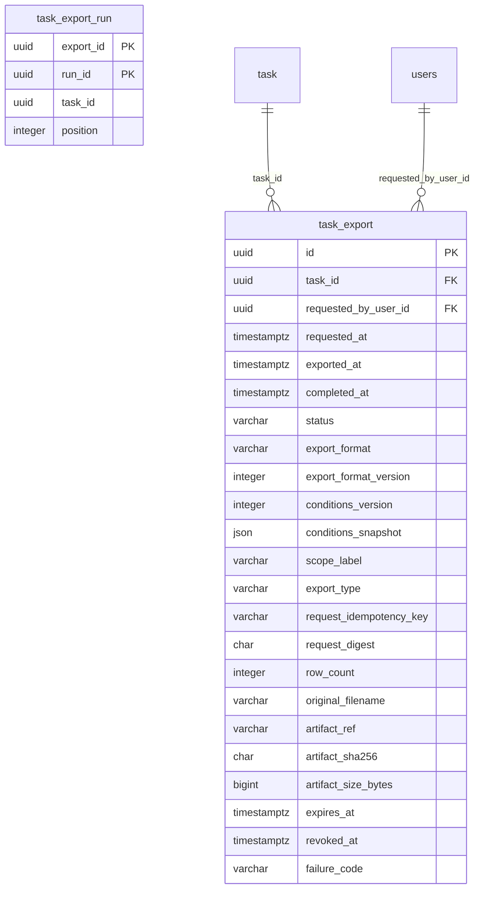

# 任務匯出資料庫資料結構（實體候選）

> 本文件是 issue #1160 的衍生欄位字典。下列兩張表皆為**未部署候選**，不是 ORM、Alembic migration 或可直接執行的 DDL。正典為 [014 任務詳情](../../../specs/task-management/014-task-detail/spec.md)（版本以正典 Changelog 為準）FR-009a、FR-010i、FR-015e／g／h、FR-020／021／024，以及[主憲法 XVI、XXII](../../../specs/_governance/constitution.md)；[設計裁決](../../superpowers/specs/2026-10-08-mvp-export-record-design.md)說明原始產物方案。任務與執行的現有候選鍵見[任務／執行字典](./task-run-db-schema.md)。

## 1. 範圍與狀態

一筆 `task_export` 是**一次匯出請求與一份原始檔案**，一筆 `task_export_run` 是該檔案納入的**一次試標或正式標記執行**。單次匯出可含多個 run；有序 `manifest.runs[]` 必須逐 run 記錄當時封存的資料集、設定、schema、指引及抽樣快照身分。`json-min` 格式版本 2 的零列檔案也要保留完整 manifest。來源：014 FR-010i-1／FR-015h。

首次匯出只走一條驗證與內容產生路徑，完整原始位元組先原子保存，再將歷史列標為可下載。條件快照供審計與重製驗證；重新下載讀同一原始檔案，不重新查詢標記或切詞。30 日後產物不得下載，匯出歷史 metadata 保存一年。圖與字典只描述規劃，**已部署表數為 0**。

## 2. ERD

下圖只畫本候選設計中確定存在的**單欄外鍵**。`task_export_run` 以兩組同任務**複合外鍵**連接匯出與 run，故 Mermaid 不畫可能誤導的單欄連線；完整約束見 §4。`dataset_item_private`、隱藏答案及未提交審核草稿都不在本圖或匯出查詢路徑。

## 3. 欄位字典

### 3.1 task_export：一次請求與一份不可變產物

`requested_at` 是請求獲接受時固定的完整精度 UTC 時間；`exported_at` 是背景工作真正讀取結果時的一致性快照時間，只有產物校驗成功並轉為 `ready` 才固定，供 manifest 與檔名共用。`completed_at` 另記產物可下載的時間。三者分別表示接受、內容快照與完成，不能互相代替。來源：014 FR-010i-1／2、FR-021。

| 欄位 | 型別 | 可空 | 代表什麼 | 何時寫入／改變 | 規則 |
|---|---|---|---|---|---|
| `id` | uuid | 否 | 匯出主鍵 | 接受請求；不改 | E-01 |
| `task_id` | uuid → task | 否 | 所屬任務 | 接受請求；不改 | E-01 |
| `requested_by_user_id` | uuid → users | 否 | 原始請求人；不代表日後下載權 | 接受請求；不改 | E-01、E-08 |
| `requested_at` | timestamptz | 否 | 請求接受時間 UTC，供歷史排序 | 接受請求；不改 | E-02 |
| `exported_at` | timestamptz | 是 | 實際結果讀取快照時間 UTC；未完成時為空 | 原檔校驗成功並轉 `ready` 時與產物一併固定 | E-02、E-04 |
| `completed_at` | timestamptz | 是 | 原檔完成且校驗通過的時間 UTC | 轉 `ready` 時寫入 | E-04 |
| `status` | varchar(16) | 否 | `pending`／`processing`／`ready`／`failed` | 接受請求及合法轉換 | E-04 |
| `export_format` | varchar(16) | 否 | `json`／`json-min` | 接受請求；不改 | E-03 |
| `export_format_version` | integer | 否 | 檔案格式版本；新 `json-min` 為 2 | 接受請求；不改 | E-03 |
| `conditions_version` | integer | 否 | 條件快照的驗證規格版本 | 接受請求；不改 | E-03 |
| `conditions_snapshot` | json | 否 | 經驗證的有序 `selected_runs[]`、共用篩選、語言及序列選項；不含結果快照時間 | 接受請求；不改 | E-03、E-07 |
| `scope_label` | varchar(120) | 否 | 歷史列的任務範圍文案 | 接受請求；不改 | E-03 |
| `export_type` | varchar(24) | 否 | 歷史列的全部／篩選匯出類型 | 接受請求；不改 | E-03 |
| `request_idempotency_key` | varchar(120) | 否 | 同任務、同請求人的匯出重試鍵 | 接受請求；不改 | E-05 |
| `request_digest` | char(64) | 否 | 包含請求人與匯出選項的規範化請求 SHA-256 | 接受請求；不改 | E-05 |
| `row_count` | integer | 是 | 實際輸出結果列數；零列仍有 manifest | 轉 `ready` 時寫入 | E-04 |
| `original_filename` | varchar(255) | 是 | 首次下載所用檔名 | 轉 `ready` 時寫入；不改 | E-04、E-06 |
| `artifact_ref` | varchar(1024) | 是 | 受限儲存中的**內部物件鍵**，不是下載網址 | 原檔保存成功後寫入 | E-06、E-08 |
| `artifact_sha256` | char(64) | 是 | 原始檔案位元組的 SHA-256 | 原檔校驗後寫入；不改 | E-06 |
| `artifact_size_bytes` | bigint | 是 | 原始檔案大小，單位 byte | 原檔校驗後寫入；不改 | E-06 |
| `expires_at` | timestamptz | 是 | 原檔下載期限 UTC，完成後 30 日 | 轉 `ready` 時寫入；不延長 | E-06、E-09 |
| `revoked_at` | timestamptz | 是 | 來源刪除或政策撤銷後停止下載的時間 | 撤銷時寫入；不清空 | E-08、E-09 |
| `failure_code` | varchar(64) | 是 | 失敗原因的安全代碼，不存內部路徑或答案 | 轉 `failed` 時寫入 | E-04、E-08 |

`scope_label`／`export_type` 只供歷史列顯示，不混入 `conditions_snapshot` 的重製條件。`conditions_snapshot` 在接受時固定，有序 `selected_runs[]` 每項記錄 `run_id`、`run_stage`、`cycle_id`、`dataset_version_id`、`config_version_id`、`schema_version`、`guideline_version_id`、`sample_snapshot_id`；共用 `filters` 記錄提交狀態、標記員範圍、審核員及審核狀態等條件，並保存格式、語言、序列／切詞選項與原請求人。`conditions_snapshot` 不含 `exported_at`；內容快照時間取同列欄位，供重製驗證，不作重新下載時的資料查詢指令。混合 Dry／Official 匯出的頂層 `run_stage` 必須為 `all`，每個 run 的結果保持分開，不跨 run 合併或去重，實際階段以 `selected_runs[]` 為準。

### 3.2 task_export_run：匯出納入的執行與順序

版本值不在本表重複保存：`task_run` 固定指引與 snapshot，`task_run_cycle` 固定 sealed dataset 與 config，schema 版本由固定 config 解析；結果寫入不可變產物的 `manifest.runs[]`。關聯列及順序與 manifest 必須一致。來源：014 FR-010i／FR-010i-1／2。

| 欄位 | 型別 | 可空 | 代表什麼 | 何時寫入／改變 | 規則 |
|---|---|---|---|---|---|
| `export_id` | uuid | 否 | 複合主鍵中的匯出身分 | 接受請求；不改 | R-01 |
| `run_id` | uuid | 否 | 複合主鍵中的執行身分 | 接受請求；不改 | R-01 |
| `task_id` | uuid | 否 | 兩端同任務複合 FK 的作用域 | 接受請求；不改 | R-02 |
| `position` | integer | 否 | manifest 中從 1 開始的 run 順序 | 接受請求；不改 | R-03 |

`task_id` 可由兩端父表推得，但刻意保留：`(task_id,export_id)` 與 `(task_id,run_id)` 兩組複合外鍵在資料庫層防止把其他任務的 run 掛到本匯出。這是受約束的冗餘，不承載第二份業務狀態，也不以應用層檢查取代 FK。

## 4. 鍵、限制與生命週期

| ID | 執行位置 | 候選限制與驗證方向 | 來源 |
|---|---|---|---|
| E-01 | DB | `task_export.id` PK；`task_id → task.id`、`requested_by_user_id → users.id` 真單欄 FK；UNIQUE `(task_id,id)` 供同任務子參照 | 014 FR-010i-2 |
| E-02 | SVC | `requested_at` 為請求接受時間；`exported_at` 取實際結果讀取快照的 UTC 完整精度時間，manifest 與檔名共用此值；不得把接受時間冒充內容時間 | 014 FR-010i-1／2、FR-021 |
| E-03 | DB＋SVC | 格式只允許 `json`／`json-min`；格式與條件版本均 >0；版本化 JSON 須經對應 schema 驗證；新 `json-min` 用版本 2 的 `{manifest,rows[]}` | 014 FR-010i-2、FR-015h |
| E-04 | DB＋SVC | `pending → processing → ready`、`pending/processing → failed`，以及可重試失敗在同一列原子 `failed → processing`；`ready` 為不可逆終態，不允許 `failed → ready`；重試用狀態條件式 UPDATE 搶占原 `id`，清空前次 `failure_code` 與未固定產物 metadata，先持久記錄前次失敗事件；`ready` 必須有 `exported_at`、`completed_at`、`row_count >= 0`、檔名、參照、摘要、大小與到期時間，並在同一交易原子固定不可變原始產物的 metadata；未 `ready` 的 `exported_at` 必須為空，其他狀態不得開放下載。跨欄空值條件可用 CHECK，轉換順序由服務保護 | 014 FR-015e、FR-021；後端憲法 XII |
| E-05 | DB＋SVC | UNIQUE `(task_id,requested_by_user_id,request_idempotency_key)`，避免兩位已授權請求人同 key 互相衝突或誤取他人紀錄。先驗當前授權，再依三欄查重；同人同 key 同 digest 回原紀錄，異 digest 拒絕。digest 取規範化原始命令，納入 task、請求人、格式／版本、有序 run、共用篩選、語言、序列／切詞選項；排除伺服器產生的 `requested_at`／`exported_at`、完成時間與產物資訊。尚未 `ready` 的 worker 重試（含服務判定可重試的 `failed`）可在較晚結果快照重新執行，只依 `export.id` 沿用原列；`requested_at`、`conditions_snapshot`、冪等鍵／digest 與所選 run 及順序不改；不可重試失敗維持 `failed`，重新提交同 key 不新增列；`ready` 後冪等重試只回同一原始產物，不得以 worker 帳號建立另一列 | 014 FR-010i-2／FR-021、設計裁決 |
| E-06 | SVC＋STORAGE | 在同一一致性讀取快照內擷取內容，原檔先寫受限暫存、驗內容與 SHA-256、大小，再原子發布物件及 `ready` 列；部分失敗清理暫存並留下可追溯失敗；若重試需清除 `failure_code`，先將該次失敗持久記為受限稽核／作業事件，實作階段確定既有事件儲存與保留期。重新下載核對摘要與大小，交付原始 bytes 和原檔名 | 014 FR-021、主憲法 XVI |
| E-07 | SVC | 快照 `selected_runs[]`、有序 `task_export_run` 與產物 `manifest.runs[]` 逐項同序同身分；每 run 自帶階段與固定版本，共用 `filters` 對所選 run 一致套用。歷史列「試標／正式／兩者」由所選階段集合推導；空結果仍有完整 manifest。版本從不可變 run／cycle 鏈解析，不讀 task 當前指標 | 014 FR-009a／FR-010i／FR-015h |
| E-08 | SEC | 每次下載重驗目前 `dataset.export`、active membership、任務範圍與來源有效性；不得回傳 `artifact_ref`、私有答案或未提交審核草稿 | 014 FR-021／024、主憲法 III |
| E-09 | SVC＋STORAGE | 原檔自完成起保存 30 日；`now >= expires_at`、`revoked_at` 非空、來源刪除、物件缺失或校驗失敗均拒絕下載；歷史 metadata 保存一年，到期不延長原檔期限。依 ADR-038：原檔 30 日後實體刪除；`task_export` metadata 與 `task_export_run` manifest 一年後實體刪除，子（`task_export_run`）先於父、同一交易；清理週期 待定（#1224） | 014 FR-021、主憲法 XXII；ADR-038 |
| E-10 | SVC＋STORAGE | 應用層清理工作。到期清掃：掃描狀態為 `ready` 且 `now >= expires_at`（`expires_at` 已過）的列，實體刪除原始物件，該列拒絕下載的事實不變；刪除須冪等，物件已不存在視為成功而非錯誤。孤兒物件對帳以 `artifact_ref` 為鍵雙向比對：物件存在但無列（無列孤兒，例如發布物件後 `ready` 交易失敗）則刪物件；`ready` 列且 `now < expires_at`（未過期）而 `artifact_ref` 指向的物件缺失（無物件）時，該列維持拒絕下載並寫入可追溯的稽核／作業事件；已過期列的物件依設計已被刪除，不屬缺失。異常只記為事件，不在該列上加旗標，兩向皆不得改寫已 `ready` 的 metadata。已過期列因 `(status,expires_at)` 索引不記錄物件是否已刪，每輪清掃都會被重新選到（已知上限，靠冪等刪除吸收；規模成長時的升級路徑留待 ADR-038／#1224）。清掃與對帳的週期與時限不在本文件決定，沿用 E-09，待 ADR-038／#1224。測試意圖（SVC）：過期 `ready` 列的物件被清除且重複清掃不報錯、無列物件被偵測、未過期而缺物件的列不可下載且留有事件、已過期列不產生缺物件事件 | 014 FR-021；E-06、E-09；ADR-038 |
| R-01 | DB | 複合 PK `(export_id,run_id)`；兩欄皆 NOT NULL，沒有第二份序號主鍵 | 014 FR-010i-2 |
| R-02 | DB | 父端先建 UNIQUE `task_export(task_id,id)` 與 `task_run(task_id,id)`；子端 `(task_id,export_id)`、`(task_id,run_id)` 分別建立複合 FK，防止跨任務關聯 | 014 FR-010i-1；任務／執行字典 U-01 |
| R-03 | DB＋SVC | CHECK `position > 0`、UNIQUE `(export_id,position)`；至少一個 run 且位置連續、manifest 順序一致由完成交易驗證 | 014 FR-009a／FR-010i-1 |

`expires_at`／`revoked_at` 是期限與撤銷事實，不另新增 `expired`／`revoked` 狀態；歷史列顯示「已過期」是投影。原始 `ready` 列不可因重新下載而改內容、檔名或排序；下載亦不得新增 `task_export`。稽核動作依 ADR-032 發出 `task.exported` 等事件，稽核表不代替此匯出歷史表。

## 5. 索引與查詢成本

以下只列候選；PK／UNIQUE 的左前綴已覆蓋時不再重複建單欄索引。真正建立後以 SQLite 查詢計畫及 PostgreSQL `EXPLAIN` 驗證。

| 查詢／參照 | 候選索引 | 理由與成本 |
|---|---|---|
| 任務匯出歷史與分頁 | `task_export(task_id,requested_at DESC,id DESC)` | 支援同任務新到舊排序與穩定游標；增加一次匯出寫入成本 |
| 同請求人冪等重試 | UNIQUE `task_export(task_id,requested_by_user_id,request_idempotency_key)` | 擋同人同任務並發重送，容許不同請求人使用相同 key；左前綴亦覆蓋 task FK 反查 |
| 匯出內 run 與順序 | PK `task_export_run(export_id,run_id)`、UNIQUE `(export_id,position)` | 覆蓋由 export 查 run 及排序；不另加 `export_id` 索引 |
| run 的匯出歷史反查 | `task_export_run(run_id,export_id)` | 反向查與父 run 刪除限制；PK 不覆蓋 run 起首查詢 |
| 請求人 FK 反查 | `task_export(requested_by_user_id)` | 使用者封存／刪除與審計查詢；按實際操作頻率驗證 |
| 到期清掃 | `task_export(status,expires_at)` | 清掃只掃 `ready` 且已過期的列，免全表掃描；多一個索引的寫入成本只在轉 `ready` 與狀態變更時 |
| 孤兒物件對帳 | `task_export(artifact_ref)` | 由物件鍵反查是否有列（無列孤兒），以及驗證列所指物件；物件鍵多為唯一，是否宣告 UNIQUE 於實作時依 E-06 發布流程決定 |

不預建條件 JSON 的 PostgreSQL GIN 索引；目前查詢以任務和時間定位歷史，快照供單列追溯與重製驗證。若未來需要按 JSON key 搜尋，再用實際查詢與執行計畫證明成本。

## 6. SQLite／PostgreSQL 與安全邊界

- **雙資料庫**：ADR-024 規劃 SQLite Lite 與 PostgreSQL 正式機。UUID 用適配型別；`json` 在 PostgreSQL 對應 JSONB、SQLite 對應 JSON／文字並由應用層執行版本化 schema 驗證；時間一律 UTC，SQLite 讀回須補回時區語意。SHA-256 用 64 字元十六進位字串；大小為非負 `bigint`。不依賴 PostgreSQL 專有 `TINYINT`。
- **複合 FK**：SQLite 每連線啟用 `PRAGMA foreign_keys=ON`；父端同序 UNIQUE 必須先建，否則子表可能在寫入時發生 `foreign key mismatch`。兩種資料庫均測跨任務 run 關聯被拒、同一匯出重複 run／順序被拒。
- **原子產物**：資料庫交易與檔案／物件儲存不能假裝為同一個 ACID 交易。實作須採暫存物件、驗證、發布與補償清理；只有可讀且摘要吻合的原檔才可標 `ready`。SQLite Lite 可用受限本地檔案，正式機用受限物件儲存；資料庫只保存內部物件鍵，不保存長效公開 URL。
- **結果快照**：PostgreSQL 在一致的讀交易中擷取全部輸出來源，SQLite 在建立讀快照後同樣以單一讀交易擷取；`exported_at` 是該次快照的時間標記，不是事後可用時間戳重放的嚴格 commit 截點。大檔串流的 PostgreSQL 長交易與 SQLite 讀鎖成本須於 runtime 階段量測。未通過校驗不得標 `ready`，也不得固定 `exported_at`。
- **即時授權與公平性**：`requested_by_user_id` 只供責任追溯，下載權取自當前 active membership、`dataset.export` 矩陣格與 task 資源範圍；角色停用或來源刪除即拒絕。產物產生路徑只讀可公開的 `dataset_item.public_payload` 與獲准的已提交標記／審核結果，不 join `dataset_item_private`，不輸出 hidden answer、test/gold 分類、未提交審核草稿或受限來源位置。
- **內容完整性**：重新下載每次驗 SHA-256 與大小；檢查失敗只能回繁體中文可理解原因及受控錯誤碼，不傳內部儲存路徑。已保存的有效詞級匯出不因切詞引擎後續不可用而失敗；新匯出仍依 FR-020 阻擋缺版本引擎。

## 7. 遷移與執行階段待驗

1. 兩表型別、長度、CHECK、複合 FK、索引及儲存介面都需在獨立 ORM／Alembic migration PR 驗證 upgrade、downgrade 與 SQLite／真實 PostgreSQL roundtrip；本文件不能替代部署測試。
2. `pending`／`processing`／`failed` 的重試與安全錯誤碼、檔案暫存清理、物件發布失敗補償、worker 併發及跨服務儲存權限須在 runtime 規格與測試落地。`ready` 的跨欄完整性應先測試，不能只靠 UI 控制。
3. 資料集或任務刪除時的原檔撤銷、物件清理、歷史 metadata 刪除或匿名化，以及引用中的 run／版本保留順序依 ADR-038 處理：原檔 30 日後實體刪除、metadata 與 manifest 一年後實體刪除，來源資料集或任務的刪除順序遵循 dataset-021 FR-011；清理週期 待定（#1224）。不得以 `ON DELETE CASCADE` 靜默抹除一年內的匯出歷史。舊版僅有條件快照而無有效原檔的紀錄不能憑目前結果補建。
4. 將本候選字典投影到 NoteCraft 時，只能畫真單欄 FK；複合約束、權限、到期與物件校驗仍須在 Wiki 文字顯示。完成來源一致性檢查與雙資料庫實測前，只能稱為**候選資料結構**。
