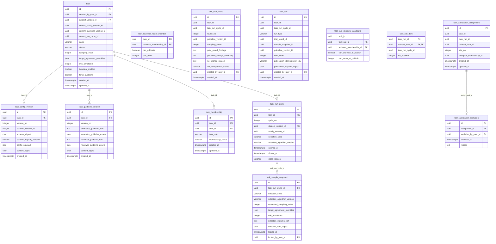

# 任務／執行資料庫資料結構（實體候選）

> 本文件是 issue #1160 的衍生欄位字典。13 張表均為**未部署候選**，不是 Alembic 資料庫遷移、ORM 或可直接套用的 DDL。正典為 [013](../../../specs/task-management/013-task-new/spec.md)、[014](../../../specs/task-management/014-task-detail/spec.md)、[015](../../../specs/annotation/015-annotation-workspace/spec.md)、[ADR-022](../../adr/022-task-state-machine-location.md) 與 [ADR-037](../../adr/037-permission-matrix-authorization.md)；資料來源表形見 [資料集字典](./dataset-db-schema.md)。[設計裁決](../../superpowers/specs/2026-10-06-task-run-identity-design.md)已被上述正典採納，但本字典的 SQL 型別、索引與刪除規則仍須在獨立資料庫遷移工作驗證。

## 1. 範圍與狀態

閱讀用語：`task_run` 是**一次試標或正式標記的執行紀錄**；`task_run_cycle` 是**一輪發布週期**；`task_trial_round` 是**週期內的一次試標回合**。英文名稱是資料庫識別碼，中文說明與例子見[資料表盤點總帳](./database-table-inventory.md#名詞說明任務發布與執行)。

一列 `task` 是可編輯的當前任務；每個 `task_run_cycle` 固定一個已封存的資料集版本與不可變設定版本；每次發布各有獨立 `task_sample_snapshot` 與 `task_run`。`task_run_item` 保存當次選中的公開資料項目，`task_annotation_assignment` 是固定的標記工作位。退回草稿後保留舊發布週期、執行、工作指派，再從新發布週期的 R1 開始。表名採 foundation FR-105 的單數、模組前綴；`users` 為既有例外。

`TaskDetail`、`AnnotationListItem`、`ReviewUnit`、`ReviewAssignment` 是讀取投影或推導單位；其中 `ReviewAssignment` 已明定**不持久化**。`OutputConfig` 包在不可變設定版本中。標記提交、審核決策、仲裁、標記一致性計算與匯出 的實體表不屬此批；不得替它們預畫外鍵。所有下列型別和限制標為「候選」，沒有一項宣稱已在 SQLite／PostgreSQL 執行。

## 2. ERD

下圖列出 13 張候選表的全部欄位，線只畫**本批表之間的單欄外鍵**。指向外部 `users`、`dataset_version`、`dataset_item` 的單欄外鍵在字典標明；同任務、同發布週期、同執行的複合外鍵見 §4。ERD 線不表示表已建立。`dataset_item_private` 不接入發布路徑。

## 3. 欄位字典

六欄中的「規則」參照 §4。`uuid`、`json`、`timestamptz` 是 PostgreSQL 表示法；SQLite 對應見 §6。`?` 不作型別或空值定案。未明列預設值的欄位**沒有候選 DB 預設**；建立者與時間由服務於交易中寫入。所有外鍵與主鍵都仍是規劃約束。

### 3.1 task：當前任務

一列只保存當前可變設定及版本指標，不複製歷史執行的資料集、設定與指引。建立者為有 `task.create` 權限的使用者；後續編輯仍須查即時成員資格、矩陣及狀態。來源：013 關鍵實體、014 FR-014／關鍵實體、ADR-037。

| 欄位 | 型別 | 可空 | 代表什麼 | 何時寫入／改變 | 規則 |
|---|---|---|---|---|---|
| `id` | uuid | 否 | 穩定任務主鍵 | 建立；不改 | T-01 |
| `created_by_user_id` | uuid → users | 否 | 建立者 | 建立；不改 | T-01 |
| `dataset_version_id` | uuid → dataset_version | 否 | 當前綁定的已封存完整版本 | 建立；草稿可重綁 | T-02 |
| `current_config_version_id` | uuid | 否 | 當前不可變設定版本 | 建立時預配置 UUID；草稿儲存更新 | T-03 |
| `current_guideline_version_id` | uuid | 否 | 當前不可變指引內容版本 | 建立時預配置 UUID；草稿／waiting 指引內容儲存更新 | T-03 |
| `current_run_cycle_id` | uuid | 是 | 當前開啟發布週期；無執行時為空值 | 首次試標發布／退回草稿／結案 | T-04 |
| `name` | varchar | 否 | 任務名稱；非身份鍵 | 建立；草稿編輯 | T-01 |
| `status` | varchar(32) | 否 | ADR-022 任務狀態 | 建立為草稿；合法轉換更新 | T-05 |
| `sampling_value` | integer | 否 | 下一次試標的要求筆數 | 建立；允許階段編輯 | T-06 |
| `target_agreement_overrides` | json | 否 | 由設定驅動的 IAA 目標覆寫；候選空物件預設 | 建立／允許階段編輯 | T-06 |
| `min_annotators` | integer | 否 | 試標重疊標記及發布檢查下限 | 建立／允許階段編輯 | T-06 |
| `isolation_enabled` | boolean | 否 | 隔離顯示政策；候選 true 預設 | 建立／草稿編輯 | T-06 |
| `force_guideline` | boolean | 否 | 指引顯示政策；不屬內容版本 | 建立／草稿編輯 | T-06 |
| `created_at` | timestamptz | 否 | 建立時間 UTC | 建立 | X-01 |
| `updated_at` | timestamptz | 否 | 當前任務最後修改時間 UTC | 修改 | X-01 |

初建時預配置 task、config v1、guideline v1 三個 UUID；task 的兩個當前版本指標從插入起非空。同任務循環複合 FK 延後至交易提交檢查；task、兩版本及建立者 membership 缺一列或跨 task 參照，整筆建立交易失敗。`current_run_cycle_id` 在首次發布前仍可空。`task_type`、`trial_round`、`sample_snapshot_id`、`reviewer_ids[]`、`arbiter_ids[]` 均由版本／執行／名冊投影，不加第二份欄位（013 FR-006a、014 關鍵實體）。

### 3.2 task_config_version：不可變的任務設定與資料結構

一列是同任務的一個完整設定與資料結構版本，`outputs[]`、`field_role_map` 和內嵌資料結構快照共存；輸出類型不另建硬編表。來源：013／014 `TaskConfig`。

| 欄位 | 型別 | 可空 | 代表什麼 | 何時寫入／改變 | 規則 |
|---|---|---|---|---|---|
| `id` | uuid | 否 | 設定版本主鍵 | 成功儲存時；不改 | C-01 |
| `task_id` | uuid → task | 否 | 擁有任務 | 建立；不改 | C-01 |
| `version_no` | integer | 否 | 同任務正整數版本 | 每次完整儲存 +1 | C-02 |
| `schema_version_no` | integer | 否 | 同列資料結構版本，等於 `version_no` | 同次儲存 | C-02 |
| `schema_digest` | char(64) | 否 | 規格化 outputs／field roles SHA-256；可跨版相同 | 建立；不改 | C-03 |
| `schema_registry_version` | varchar | 否 | 可追溯、保留的驗證定義版本 | 建立；不改 | C-03 |
| `config_payload` | json | 否 | 經 registry 驗證的完整設定與資料結構快照 | 建立；不改 | C-03 |
| `content_digest` | char(64) | 否 | 完整版本內容摘要；候選算法待核定 | 建立；不改 | C-03 |
| `created_at` | timestamptz | 否 | 建立時間 UTC | 建立；不改 | X-01 |

### 3.3 task_guideline_version：不可變指引內容

即使 Step 4 留空也建立 v1；`force_guideline` 留在任務。資產欄存受控參照清單，不存原始檔案位元組。來源：013 `TaskGuidelineConfig`、014 FR-017a。

| 欄位 | 型別 | 可空 | 代表什麼 | 何時寫入／改變 | 規則 |
|---|---|---|---|---|---|
| `id` | uuid | 否 | 指引版本主鍵 | 建立；不改 | G-01 |
| `task_id` | uuid → task | 否 | 擁有任務 | 建立；不改 | G-01 |
| `version_no` | integer | 否 | 同任務正整數內容版本 | 內容實變時 +1 | G-02 |
| `annotator_guideline_text` | text | 否 | 標記員說明文字；空字串代表留空 | 建立；不改 | G-03 |
| `annotator_guideline_assets` | json | 否 | 標記員附件參照清單；候選空陣列預設 | 建立；不改 | G-03 |
| `reviewer_guideline_text` | text | 否 | 審核員說明文字；空字串代表留空 | 建立；不改 | G-03 |
| `reviewer_guideline_assets` | json | 否 | 審核員附件參照清單；候選空陣列預設 | 建立；不改 | G-03 |
| `content_digest` | char(64) | 否 | 四欄內容摘要 | 建立；不改 | G-03 |
| `created_at` | timestamptz | 否 | 建立時間 UTC | 建立；不改 | X-01 |

### 3.4 task_membership：一人於一任務的一個角色

同一人可在同一任務持有多個角色；停用一列不移除另一角色，也不刪歷史。來源：ADR-037、014 `TaskMembership`／FR-005l。

| 欄位 | 型別 | 可空 | 代表什麼 | 何時寫入／改變 | 規則 |
|---|---|---|---|---|---|
| `id` | uuid | 否 | 穩定成員資格主鍵 | 建立；不改 | M-01 |
| `task_id` | uuid → task | 否 | 任務作用域 | 建立；不改 | M-01 |
| `user_id` | uuid → users | 否 | 真實使用者 | 建立；不改 | M-01 |
| `task_role` | varchar(24) | 否 | `project_leader`／`annotator`／`reviewer` | 建立；不改 | M-02 |
| `membership_status` | varchar(16) | 否 | 當前成員狀態 | 建立／停用／復用 | M-03 |
| `created_at` | timestamptz | 否 | 加入時間 UTC | 建立 | X-01 |
| `updated_at` | timestamptz | 否 | 最後狀態變更 UTC | 修改 | X-01 |

### 3.5 task_reviewer_roster_member：當前審核名冊

一列是一個當前選入審核名冊的審核員成員資格；`can_arbitrate` 令仲裁名冊自然為子集合。發布時凍結到候選表，當前名冊變更不改舊執行。來源：014 FR-010s-1／FR-010t、ADR-037。

| 欄位 | 型別 | 可空 | 代表什麼 | 何時寫入／改變 | 規則 |
|---|---|---|---|---|---|
| `task_id` | uuid | 否 | 複合主鍵一部分；同任務範圍 | 勾選加入；不改 | R-01 |
| `reviewer_membership_id` | uuid | 否 | 複合主鍵一部分；審核員成員 | 勾選加入；不改 | R-01 |
| `can_arbitrate` | boolean | 否 | 同一名冊內的仲裁資格；候選 false 預設 | 編輯名冊 | R-02 |
| `sort_order` | integer | 否 | 可重現選人順序 | 編輯名冊 | R-03 |

### 3.6 task_run_cycle：一輪草稿、試標與正式標記的版本邊界

一輪發布週期固定已封存資料集、同任務設定與資料結構、隨機種子和演算法；退回草稿僅關閉、不刪除。來源：014 FR-010f／FR-010f-5、ADR-022。

| 欄位 | 型別 | 可空 | 代表什麼 | 何時寫入／改變 | 規則 |
|---|---|---|---|---|---|
| `id` | uuid | 否 | 發布週期主鍵 | R1 發布；不改 | Y-01 |
| `task_id` | uuid → task | 否 | 擁有任務 | R1 發布；不改 | Y-01 |
| `cycle_no` | integer | 否 | 同任務正整數序號 | R1 發布；不改 | Y-02 |
| `dataset_version_id` | uuid → dataset_version | 否 | 已封存完整資料版本 | R1 發布；不改 | Y-03 |
| `config_version_id` | uuid | 否 | 同任務的不可變設定與資料結構 | R1 發布；不改 | Y-03 |
| `selection_seed` | varchar | 否 | 此發布週期抽樣重播隨機種子 | R1 發布；不改 | Y-04 |
| `selection_algorithm_version` | varchar | 否 | 抽樣演算法版本 | R1 發布；不改 | Y-04 |
| `opened_at` | timestamptz | 否 | 發布週期開啟 UTC 時間 | R1 發布 | X-01 |
| `closed_at` | timestamptz | 是 | 退回草稿或正式標記完結時間 | 發布週期關閉一次 | Y-02 |
| `close_reason` | varchar | 是 | 關閉原因；退回時有明確拒絕原因 | 發布週期關閉一次 | Y-02 |

### 3.7 task_trial_round：發布週期內的一次試標回合

R1 與 Rn 的序號只在發布週期內唯一；`sampling_value` 保存實際資料項目數。來源：014 FR-010f-2／FR-010o-4／`TrialRound`。

| 欄位 | 型別 | 可空 | 代表什麼 | 何時寫入／改變 | 規則 |
|---|---|---|---|---|---|
| `id` | uuid | 否 | 回合主鍵 | 試標發布；不改 | Q-01 |
| `task_id` | uuid | 否 | 同任務複合參照作用域 | 試標發布；不改 | Q-01 |
| `task_run_cycle_id` | uuid | 否 | 所屬發布週期 | 試標發布；不改 | Q-01 |
| `round_no` | integer | 否 | 發布週期內正整數序號 | 試標發布；不改 | Q-02 |
| `guideline_version_id` | uuid | 否 | 發布時同任務的指引版本 | 試標發布；不改 | Q-03 |
| `sampling_value` | integer | 否 | 該回合實際資料項目數 | 試標發布；不改 | Q-04 |
| `prior_round_findings` | text | 是 | 上輪問題；R1 可空 | 試標發布；不改 | Q-05 |
| `guideline_change_summary` | text | 是 | 本輪指引修訂摘要；R1 可空 | 試標發布；不改 | Q-05 |
| `no_change_reason` | text | 是 | 指引無變化時原因 | 試標發布；不改 | Q-05 |
| `iaa_computation_status` | varchar(16) | 否 | `pending`／`done`／`failed`；候選 pending 預設 | 發布；計算結果更新 | Q-06 |
| `created_by_user_id` | uuid → users | 否 | 發布者 | 試標發布；不改 | Q-01 |
| `created_at` | timestamptz | 否 | 發布時間 UTC | 試標發布 | X-01 |

### 3.8 task_sample_snapshot：單次發布的不可變抽樣回執

每執行一份，保存隨機種子、演算法、摘要值和外部有序清單回執；真正成員仍由 `task_run_item` 決定。清單規範位元組版本為 `label-suite-run-items-v1`：UTF-8 第一行固定 `label-suite-run-items-v1\n`，其後按 `task_run_item.list_position` 逐行寫小寫帶連字號 UUID 與 `\n`，沒有其他空白或欄位；`selected_item_digest` 是完整位元組的 SHA-256 十六進位摘要。`selection_manifest_ref` 為私有、不可覆寫的內容定址物件鍵，不是客戶端 URL。來源：014 FR-010f／`SampleSnapshot`。

| 欄位 | 型別 | 可空 | 代表什麼 | 何時寫入／改變 | 規則 |
|---|---|---|---|---|---|
| `id` | uuid | 否 | 快照主鍵 | 發布；不改 | S-01 |
| `task_run_cycle_id` | uuid → task_run_cycle | 否 | 所屬發布週期 | 發布；不改 | S-01 |
| `selection_seed` | varchar | 否 | 該次選取使用的隨機種子 | 發布；不改 | S-02 |
| `selection_algorithm_version` | varchar | 否 | 該次演算法版本 | 發布；不改 | S-02 |
| `requested_sampling_value` | integer | 是 | 試標要求筆數；正式標記為空值 | 發布；不改 | S-03 |
| `target_agreement_overrides` | json | 否 | 發布時採用的 IAA 覆寫快照；候選空物件 | 發布；不改 | S-03 |
| `min_annotators` | integer | 否 | 發布時使用的試標人數下限 | 發布；不改 | S-03 |
| `selection_manifest_ref` | text | 否 | 不含答案的私有、不可覆寫內容定址清單回執鍵 | 發布；不改 | S-04 |
| `selected_item_digest` | char(64) | 否 | 規範清單完整 UTF-8 位元組的 SHA-256 十六進位摘要 | 發布；不改 | S-04 |
| `locked_at` | timestamptz | 否 | 鎖定時間 UTC | 發布 | X-01 |
| `locked_by_user_id` | uuid → users | 否 | 執行發布者 | 發布；不改 | S-01 |

### 3.9 task_run：一次試標或正式標記的發布

試標有同發布週期回合，正式標記無回合；每任務生命週期至多一筆正式標記。執行釘住指引，不能以任務的當前指標重建歷史。來源：014 FR-010f-2／f-3／f-6／`AnnotationListMaterialization`。

| 欄位 | 型別 | 可空 | 代表什麼 | 何時寫入／改變 | 規則 |
|---|---|---|---|---|---|
| `id` | uuid | 否 | 穩定執行主鍵 | 發布；不改 | U-01 |
| `task_id` | uuid | 否 | 同任務複合參照作用域 | 發布；不改 | U-01 |
| `task_run_cycle_id` | uuid | 否 | 本次發布週期 | 發布；不改 | U-01 |
| `run_type` | varchar(16) | 否 | `dry_run`／`official_run` | 發布；不改 | U-02 |
| `trial_round_id` | uuid | 是 | 試標同發布週期回合；正式標記必為空值 | 發布；不改 | U-02 |
| `sample_snapshot_id` | uuid | 否 | 本次專屬快照 | 發布；不改 | U-03 |
| `guideline_version_id` | uuid | 否 | 同任務指引；試標須與回合一致 | 發布；不改 | U-04 |
| `item_count` | integer | 否 | 與實際執行資料項目數一致 | 發布；不改 | U-05 |
| `publication_idempotency_key` | varchar | 否 | 同任務、同發布目標的重試鍵；不同回合可重用 | 發布；不改 | U-06 |
| `publication_request_digest` | char(64) | 否 | 相同 key 的請求內容比對摘要 | 發布；不改 | U-06 |
| `created_by_user_id` | uuid → users | 否 | 發布者 | 發布；不改 | U-01 |
| `created_at` | timestamptz | 否 | 發布時間 UTC | 發布；不改 | X-01 |

### 3.10 task_run_reviewer_candidate：發布時候選名冊快照

此表只凍結審核分派輸入，不保存實際審核員黏著或授權。即時資格每次重新查 current 成員資格與矩陣；已提交審核員由 015 FR-093(5) 推導。來源：014 FR-010t／關鍵實體、015 FR-093。

| 欄位 | 型別 | 可空 | 代表什麼 | 何時寫入／改變 | 規則 |
|---|---|---|---|---|---|
| `task_id` | uuid | 否 | 同任務複合參照作用域 | 發布；不改 | V-01 |
| `task_run_id` | uuid | 否 | 複合主鍵的執行 | 發布；不改 | V-01 |
| `reviewer_membership_id` | uuid | 否 | 複合主鍵的審核員成員資格 | 發布；不改 | V-01 |
| `can_arbitrate_at_publish` | boolean | 否 | 發布當時資格快照，非當前授權 | 發布；不改 | V-02 |
| `sort_order_at_publish` | integer | 否 | 發布當時穩定排序 | 發布；不改 | V-02 |

### 3.11 task_run_item：依序納入執行的公開資料項目

一列是一個執行選中的 `dataset_item`。同發布週期所有試標／正式標記執行不能重複選同資料項目；外部清單只是這些列的回執。來源：014 FR-010b／FR-010f／`RunItem`。

| 欄位 | 型別 | 可空 | 代表什麼 | 何時寫入／改變 | 規則 |
|---|---|---|---|---|---|
| `task_run_id` | uuid | 否 | 複合主鍵的執行 | 發布；不改 | I-01 |
| `dataset_item_id` | uuid → dataset_item | 否 | 複合主鍵的公開資料項目 | 發布；不改 | I-01 |
| `task_run_cycle_id` | uuid | 否 | 經 parent 執行約束的發布週期；防重選 | 發布；不改 | I-02 |
| `list_position` | integer | 否 | 執行內正整數排序 | 發布；不改 | I-03 |

### 3.12 task_annotation_assignment：固定的標記工作位

一個工作指派 ID 不因停用、退回未指派池或重指派而改變；受派者可空不表示已排除。正式執行每資料項目恰一工作位，試標按重疊人數建立。工作位不另存可變 `status`；顯示狀態依終局排除、目前已提交標記、空受派者、目前已儲存草稿、其餘已指派工作位之順序推導。來源：014 FR-005l／FR-010f-4／`AnnotationAssignment`；015 的 submission 後續以此 ID 定址。

| 欄位 | 型別 | 可空 | 代表什麼 | 何時寫入／改變 | 規則 |
|---|---|---|---|---|---|
| `id` | uuid | 否 | 固定的標記工作位主鍵 | 發布；不改 | A-01 |
| `task_id` | uuid | 否 | 同任務複合參照作用域 | 發布；不改 | A-01 |
| `task_run_id` | uuid | 否 | 所屬執行 | 發布；不改 | A-01 |
| `dataset_item_id` | uuid | 否 | 該執行內的公開資料項目 | 發布；不改 | A-01 |
| `slot_no` | integer | 否 | 同執行資料項目的正整數工作位序 | 發布；不改 | A-02 |
| `assignee_membership_id` | uuid | 是 | 目前受派 annotator；空值＝待重派 | 發布／停用退回／重派 | A-03 |
| `created_at` | timestamptz | 否 | 建立時間 UTC | 發布 | X-01 |
| `updated_at` | timestamptz | 否 | 最後改動 UTC | 修改 | X-01 |

### 3.13 task_annotation_exclusion：終局排除證據

每工作指派最多一筆，V1 不撤銷、不刪除，與原工作位分離避免空值 assignee 被誤判排除。來源：014 FR-005h／`ExcludedAnnotationAssignment`。

| 欄位 | 型別 | 可空 | 代表什麼 | 何時寫入／改變 | 規則 |
|---|---|---|---|---|---|
| `id` | uuid | 否 | 排除證據主鍵 | 排除時；不改 | E-01 |
| `assignment_id` | uuid → task_annotation_assignment | 否 | 被排除的穩定工作位 | 排除時；不改 | E-01 |
| `excluded_by_user_id` | uuid → users | 否 | 執行排除的 project leader | 排除時；不改 | E-02 |
| `excluded_at` | timestamptz | 否 | 排除時間 UTC | 排除時；不改 | X-01 |
| `reason` | text | 否 | 必填原因 | 排除時；不改 | E-02 |

## 4. 限制清單

**DB**＝候選 PK／FK／UNIQUE／CHECK；**SVC**＝必須在授權服務交易驗證；**SEC**＝restricted-client／答案隔離測試。複合 FK 父端要有同順序的 UNIQUE；Mermaid 不會畫出這些複合關聯。所有限制在獨立 migration 與 SQLite／PostgreSQL 測試通過前均未落地。

| ID | 執行位置 | 候選限制與驗證方向 | 來源 |
|---|---|---|---|
| T-01 | DB | `task.id` PK；`created_by_user_id → users.id`、`dataset_version_id → dataset_version.id` 真 FK；名稱非空白在服務驗證 | 013 建立、014 `TaskDetail` |
| T-02 | SVC | task 建立／draft 重綁與發布只接受 sealed `dataset_version`；舊 cycle 永遠追其原版 | dataset-021 FR-008／FR-010、014 FR-010f |
| T-03 | DB＋SVC | 兩指標 NOT NULL；`(task.id,current_config_version_id) → task_config_version(task_id,id)`、`(task.id,current_guideline_version_id) → task_guideline_version(task_id,id)` 均為同任務 `DEFERRABLE INITIALLY DEFERRED` 複合 FK；預配置 task 與兩版本 UUID，同交易插入 task、兩版本及建立者 membership，提交時拒絕缺列或跨 task 參照 | 013 FR-006a、014 FR-017a |
| T-04 | DB＋SVC | `(task.id,current_run_cycle_id) → task_run_cycle(task_id,id)`；退回 draft 清指標且關閉 cycle；沒有 task 級 current snapshot | ADR-022、014 FR-010f-5 |
| T-05 | DB＋SVC | 狀態值域限 ADR-022 現行五態；轉換與 side effects 同交易，CHECK 無法判前後合法轉換 | ADR-022 Transition Table |
| T-06 | DB＋SVC | `sampling_value >= 1`、`min_annotators >= 2`；boolean NOT NULL；目標覆寫由 config/IAA registry 驗證，NULL/空物件不混淆 | 013 `RunInitConfig`、014 FR-010q |
| C-01 | DB | config PK、`task_id` FK；UNIQUE `(task_id,id)` 為同 task 子參照目標 | 013／014 `TaskConfig` |
| C-02 | DB | `version_no > 0`、`schema_version_no = version_no`、UNIQUE `(task_id,version_no)`；digest 可跨版本重複 | 013 `TaskConfig` |
| C-03 | SVC | `config_payload` 為已驗證不可變 JSON，registry 定義可重播；摘要按 canonical bytes 計算，不能用任意 JSON 欄位代替主鍵 | 013 `TaskConfig`、主憲法 II |
| G-01 | DB | guideline PK、`task_id` FK；UNIQUE `(task_id,id)` 為同 task 版本參照目標 | 013 `TaskGuidelineConfig` |
| G-02 | DB | `version_no > 0`、UNIQUE `(task_id,version_no)`；四內容欄任一真實變更才新增版本 | 014 FR-017a |
| G-03 | SVC | 四內容欄保留 immutable；資產 JSON 驗證、digest 與檔案保留政策須一致；`force_guideline` 不觸發新版本 | 013 `TaskGuidelineConfig`、014 FR-017a |
| M-01 | DB | membership PK、task/user 真 FK；UNIQUE `(task_id,id)` 供受派者與 roster 複合 FK；另建同序 UNIQUE `(task_id,id,user_id)` 供工時區間驗證同一任務、成員與使用者，防跨人掛載 | ADR-037、014 `TaskMembership`／FR-007d；[工時字典](./task-work-db-schema.md) W-02 |
| M-02 | DB | UNIQUE `(task_id,user_id,task_role)`；一人多角色是多列，角色限現行 `TASK_ROLES` | ADR-037 §Boundaries、014 `TaskMembership` |
| M-03 | SVC | 停用後即時失權，已提交歷史保留；未提交 slot 退回池但不更換 assignment ID | ADR-037 §Persistence、014 FR-005l |
| R-01 | DB＋SVC | roster 複合 PK `(task_id,reviewer_membership_id)`、FK → membership `(task_id,id)`；服務另驗角色 reviewer 與 active | 014 FR-010s-1 |
| R-02 | SVC | `can_arbitrate=true` 只表示已選 reviewer 子集合；仲裁仍需非當事人及即時授權 | 014 FR-010s-1、015 FR-060 |
| R-03 | DB | `sort_order > 0`；UNIQUE `(task_id,sort_order)` | 014 FR-010t、015 FR-093 |
| Y-01 | DB | cycle PK、task/version FK；UNIQUE `(task_id,id)`；`(task_id,config_version_id)` 複合 FK → config `(task_id,id)` | 014 `RunCycle` |
| Y-02 | DB＋SVC | `cycle_no > 0`、UNIQUE `(task_id,cycle_no)`、部分唯一 `(task_id) WHERE closed_at IS NULL`；關閉原因與指標原子更新 | 014 FR-010f-5、ADR-022 |
| Y-03 | SVC | 發布時驗 dataset sealed、config 同 task 且不可變；cycle 不能轉移已釘版本 | 014 FR-010f／FR-014 |
| Y-04 | SVC | seed/演算法版本能重播同一公開資格池；不以 `declared_split` 或答案影響選取 | 014 FR-010f |
| Q-01 | DB | round PK、actor user FK；`(task_id,task_run_cycle_id)`→cycle `(task_id,id)`；UNIQUE `(task_run_cycle_id,id)` 與 `(id,guideline_version_id)` 供子參照 | 014 `TrialRound` |
| Q-02 | DB | `round_no > 0`、UNIQUE `(task_run_cycle_id,round_no)`；新 cycle 可再有 R1 | 014 FR-010f-2 |
| Q-03 | DB | `(task_id,guideline_version_id)`→guideline `(task_id,id)`，不得用裸版本號連到他人 task | 014 FR-017a／`TrialRound` |
| Q-04 | SVC | round `sampling_value = task_run.item_count = COUNT(task_run_item)`；CHECK 不能跨表計數 | 014 FR-010f-2／f-6 |
| Q-05 | SVC | Rn 修訂記錄與 `no_change` 原因依 FR-017 驗證；R1 可空不是偽造空字串 | 014 FR-017 |
| Q-06 | DB＋SVC | IAA 狀態僅 `pending/done/failed`；`done` 含數學上無法計算但已結束，不表示達標 | 014 FR-010o-4 |
| S-01 | DB | snapshot PK、cycle/locked_by user FK；UNIQUE `(task_run_cycle_id,id)` 供同 cycle run 參照 | 014 `SampleSnapshot` |
| S-02 | SVC | snapshot 一旦發布不可覆寫；R1 不預先寫 Official ID 清單 | 014 FR-010f、ADR-022 |
| S-03 | DB＋SVC | DB 只驗 `requested_sampling_value IS NULL OR requested_sampling_value > 0`；snapshot 沒有 `run_type`，所以 Dry 必填、Official 必為 null 須在發布交易由 SVC 對 run 驗證。threshold JSON 的 output type 也由 SVC 依釘住 config 驗證；snapshot 保存發布當下值 | 014 `SampleSnapshot`／FR-010o-1 |
| S-04 | SVC＋SEC | 依 `task_run_item.list_position` 將版本首行與小寫 UUID 逐行編為 UTF-8 規範位元組，以完整位元組 SHA-256 驗 `selected_item_digest`；先寫私有不可覆寫內容定址 manifest 並讀回驗證位元組、摘要與持久性，再提交 DB 引用。清單與回執均無 hidden answer、gold/test、`declared_split` 或受限 `source_ref` | 014 FR-010f／f-6、dataset 字典 §4 S-01 |
| U-01 | DB | run PK、actor user FK；`(task_id,task_run_cycle_id)`→cycle `(task_id,id)`；UNIQUE `(task_id,id)`、`(task_run_cycle_id,id)` | 014 `AnnotationListMaterialization` |
| U-02 | DB | CHECK Dry 必有 round、Official round 必空；`(task_run_cycle_id,trial_round_id)`→round `(task_run_cycle_id,id)`；Dry round 唯一，部分唯一 `(task_id) WHERE run_type='official_run'` 限一生一筆 | 014 FR-010f-2／f-3 |
| U-03 | DB | `(task_run_cycle_id,sample_snapshot_id)`→snapshot `(task_run_cycle_id,id)`，UNIQUE `sample_snapshot_id`；每 run 專屬 snapshot | 014 FR-010f、ADR-022 |
| U-04 | DB | `(task_id,guideline_version_id)`→guideline `(task_id,id)`；Dry 再用 `(trial_round_id,guideline_version_id)`→round `(id,guideline_version_id)` 限相等 | 014 FR-010f-2／f-3、FR-017a |
| U-05 | DB＋SVC | DB CHECK `item_count > 0`；提交前由服務驗證其等於實際 run-item 列數，Official 取當 cycle 剩餘且必須 >0 | 014 FR-010f-3／f-6 |
| U-06 | DB＋SVC | Dry 部分 UNIQUE `(task_id,trial_round_id,publication_idempotency_key)` WHERE run_type = 'dry_run'；Official 部分 UNIQUE `(task_id,publication_idempotency_key)` WHERE run_type = 'official_run'；不得另建涵蓋所有 run 的 task／key 唯一鍵。發布目標先穩定定址：Dry 以同任務 `(cycle_no,round_no)` 解析既有或預配置且跨重試不變的 `trial_round_id`，Official 以該任務唯一正式發布定址；狀態門檻與重新抽樣前先按目標與 key 查已提交 run。相同正規化命令摘要回原 run／snapshot，異摘要或同目標異 key 拒絕；不同 Dry 回合可重用 key。並發受 U-02 的單一目標約束、兩個部分唯一索引及交易保護，提交結果不明先查同目標 DB 冪等鍵 | 014 FR-010f-6 |
| V-01 | DB | candidate 複合 PK `(task_run_id,reviewer_membership_id)`；`(task_id,task_run_id)`→run `(task_id,id)`、`(task_id,reviewer_membership_id)`→membership `(task_id,id)` | 014 `RunReviewerCandidate` |
| V-02 | DB＋SVC | UNIQUE `(task_run_id,sort_order_at_publish)`；快照不賦予停用者當前權限，也不產生 sticky 指派列 | 014 FR-010t、015 FR-093(5) |
| I-01 | DB | run-item 複合 PK `(task_run_id,dataset_item_id)`；公開 `dataset_item_id` 真 FK | 014 `RunItem` |
| I-02 | DB＋SVC | `(task_run_cycle_id,task_run_id)`→run `(task_run_cycle_id,id)`；UNIQUE `(task_run_cycle_id,dataset_item_id)` 阻擋當 cycle 任兩 run 重選；item→batch→version 與 sealed 資格需發布交易驗證 | 014 FR-010b／FR-010f-6、dataset 字典 §4 I-01 |
| I-03 | DB | `list_position > 0`、UNIQUE `(task_run_id,list_position)`；順序與 manifest digest 一致由服務驗 | 014 `RunItem` |
| A-01 | DB | assignment PK；UNIQUE `(task_run_id,id)` 為標記／審核六張子表的 `(run_id,assignment_id)` 複合 FK 提供同序父鍵；`(task_id,task_run_id)`→run `(task_id,id)`、`(task_run_id,dataset_item_id)`→run item 複合 FK、`(task_id,assignee_membership_id)`→membership `(task_id,id)` | 014 `AnnotationAssignment`、標記／審核字典 X-01 |
| A-02 | DB＋SVC | `slot_no > 0`、UNIQUE `(task_run_id,dataset_item_id,slot_no)`；Official 每 item 只一 slot、Dry 依活躍標記員數為服務交易規則 | 014 FR-010f-4 |
| A-03 | DB＋SVC | 非空 assignee 的部分 UNIQUE `(task_run_id,dataset_item_id,assignee_membership_id)`；active annotator 角色及重指派資格由服務當次驗 | 014 FR-005l／FR-010f-4 |
| A-04 | SVC | 無工作位 `status` 欄；唯讀顯示優先序為存在 exclusion→已排除、目前 `annotation_record.submitted`→已完成、assignee 空值→未指派、目前 `annotation_record.saved`→草稿中、其餘→已指派待處理。停用／重派時鎖定同一 slot，舊未提交 saved 草稿同交易轉 `abandoned` 後更新受派者；已提交歷史不抹除，排除不由空受派者推定 | 014 FR-005f／h／l、015 `AnnotationRecord` |
| E-01 | DB＋SVC | exclusion PK、assignment FK、UNIQUE `(assignment_id)`；V1 append-only、不可撤銷須由服務守住，DB trigger 是否加入待 §7 核定 | 014 FR-005h |
| E-02 | DB＋SVC | 排除者真實 user FK；僅授權 project leader 可寫，原因非空白，保留 audit evidence | 014 FR-005h、ADR-037 |
| X-01 | SVC | 所有時間 UTC；SQLite 讀回須正規化時區，PG 用 `TIMESTAMPTZ` | ADR-024、account 字典 §4 X-02 |

## 5. 索引與查詢成本

以下都是**候選**。先用既有 PK／UNIQUE 左側前綴覆蓋 FK 和 WHERE，再補沒有覆蓋的索引；避免對每欄另建單欄索引。實作後依真實查詢與 `EXPLAIN` 在 SQLite／PostgreSQL 分別驗證。

| 查詢／參照 | 候選索引 | 理由與成本 |
|---|---|---|
| 我的任務與 user FK | `task_membership(user_id,membership_status,task_id)` | user 起首查詢；增加成員變更寫入成本；ADR-037 要求 |
| 同任務 config／指引版本 | UNIQUE `(task_id,version_no)` 各一 | 同時覆蓋 task FK 前綴；不另加 task_id 索引 |
| 當前 reviewer 名冊 | PK `(task_id,reviewer_membership_id)`、UNIQUE `(task_id,sort_order)` | 同 task 名冊與排序；membership 反查另評估 `(reviewer_membership_id,task_id)` |
| cycle 歷史與開啟唯一 | UNIQUE `(task_id,cycle_no)`、部分 UNIQUE `(task_id) WHERE closed_at IS NULL` | 防並行雙開；額外部分索引小而必要 |
| run 歷史及重試 | `(task_run_cycle_id,run_type,created_at,id)`；Dry 部分 UNIQUE `(task_id,trial_round_id,publication_idempotency_key)` WHERE run_type = 'dry_run'；Official 部分 UNIQUE `(task_id,publication_idempotency_key)` WHERE run_type = 'official_run' | 歷程索引支援有界查詢；兩個部分索引分別約束試標回合與正式發布，允許跨回合重用 key；增加發布成本 |
| 當 cycle 已用 item | UNIQUE `(task_run_cycle_id,dataset_item_id)` | 防重選並加速剩餘池反查；PK `(task_run_id,dataset_item_id)` 已支援單 run item |
| run 清單順序 | UNIQUE `(task_run_id,list_position)` | 避免全表排序；重複 run_id 單欄索引無益 |
| 標記／審核子表的工作位參照 | UNIQUE `(task_run_id,id)` | 六張子表以同序複合 FK 指向工作位；此鍵左側前綴亦覆蓋 run 反查，不另建重複的 `task_run_id` 單欄索引 |
| 受派者待辦 | `(assignee_membership_id,task_run_id,id)` | PK/slot 唯一鍵無法覆蓋 assignee 起首查詢；依待辦實測調整 |
| FK 反查 | `task(created_by_user_id)`、`task(dataset_version_id)`、`task_run_cycle(dataset_version_id)`、`task_run_item(dataset_item_id)`、`task_annotation_exclusion(excluded_by_user_id)` | 父刪除檢查或業務反查；若複合索引左前綴已涵蓋則移除重複項 |

JSON config 與覆寫不先建 GIN；只有實際 JSON key predicate 與執行計畫證明需要時才加入 PostgreSQL 專用索引，SQLite Lite 仍須可運作。

## 6. SQLite／PostgreSQL 與安全邊界

- **雙資料庫**：ADR-024 規劃 SQLite Lite、PostgreSQL 正式機。UUID 在 PostgreSQL 用 `uuid`，SQLite 用 SQLAlchemy `Uuid` 或等效 adapter，應用層統一小寫帶連字號格式；`json` 以 PostgreSQL JSONB／SQLite JSON 對應，所有 payload 先經版本化 schema 驗證。`timestamptz` 讀寫一律 UTC；SQLite 讀回不保證時區資訊。沒有 PostgreSQL `TINYINT`。
- **FK／migration**：SQLite 每連線 `PRAGMA foreign_keys=ON`；所有複合父鍵先建對應 UNIQUE，否則 SQLite 可能在寫入時報 `foreign key mismatch`。task 與兩版本的循環複合 FK 候選為 `DEFERRABLE INITIALLY DEFERRED`，以提交時檢查的 `NO ACTION` 保持可延後驗證；普通歷史刪除暫採 RESTRICT／等效拒絕，不使用 CASCADE 或 SET NULL 抹去責任鏈。Alembic 的 SQLite ALTER 採 batch mode；獨立 migration PR 須實測兩庫循環建表、提交時缺版／跨 task 拒絕、upgrade／downgrade／roundtrip 和真實 PostgreSQL integration。文件中的候選語法不等於遷移已成功。
- **發布交易與回執**：PostgreSQL 鎖定 task／目前版本；SQLite 使用序列化寫交易或等效機制，不能假設 `SELECT FOR UPDATE` 在 SQLite 生效。新發布先寫私有、不可覆寫回執並讀回驗證位元組、摘要與持久性；回執失敗則 DB 不提交。其後單一 DB 交易提交 cycle／round、snapshot 引用、run、run items、候選名冊、assignments、轉換與稽核事件，提交後才宣稱成功。物件儲存與 DB 並非同一 ACID 交易；DB 回滾留下的無引用回執僅在超過交易／重試保護期、確認無活躍寫入租約且 DB 無引用後清理，絕不刪除已引用回執。提交結果不明先查 DB 冪等鍵；已提交 run 的回執缺失或摘要不符時拒絕讀取並告警，只能依 SQL 正典位元組受控修復，不得靜默替換清單。相同 key 同摘要重試回原 run、不重新抽樣；異摘要、同 round 另一 key、第二筆 Official、跨版 item 或途中失敗均拒絕或整筆 DB 回滾。兩庫均須實測併發與部分唯一索引。
- **公平性**：抽樣與公開 run item 只讀 `dataset_item.public_payload` 及其 batch→version 身分，不讀 `dataset_item_private.hidden_answer`、`declared_split` 或受限來源 artifact；Manifest 不包含答案或 test/gold 標記。PostgreSQL 限制標記者 DB role 對私有表的 `SELECT`，SQLite 靠 repository／response allowlist 並測漏。候選表不保留任何私有答案欄。
- **即時權限**：發布候選快照保存歷史輸入，當前讀寫仍每次查 active membership、權限矩陣及資源條件；已停用 reviewer 的舊提交可保留責任鏈，但不能獲得新授權。審核黏著按 015 FR-093(5) 從 submission 推導，不建立 `ReviewAssignment` 表。

## 7. 待決與不得推測事項

1. **migration 可用性**：13 張表的 SQL 長度、部分預設、append-only DB trigger、索引精確成本與 migration 順序仍是候選。初建 task 的兩個當前版本指標已選非空及延後同任務複合 FK；SQLite／PostgreSQL 循環建表、提交檢查與 downgrade 尚待獨立實測。普通刪除採 RESTRICT／等效拒絕的候選方向；資料類別保存期限、刪除／匿名化請求、受限資產與被引用物件的清理順序須由產品／隱私政策另行裁決。ADR-032 稽核事件至少一曆年的下限，不自動成為全部 task/run、答案或檔案的保存上限；RESTRICT 也不是無限保存許可。
2. **其他規格內容編碼**：`config_payload`／guideline 資產 JSON 的 canonical bytes、registry 保留與檔案生命週期，以及 seed／演算法版本型別與重播策略仍須在 runtime 前定義。公開 item manifest 的版本化規範位元組、摘要及私有回執協定已於 §3.8／§6 定義；物件儲存故障、清理與受控修復仍待獨立實測。
3. **工作 slot 實作**：assignment 顯示狀態已定為衍生投影，不另存 enum；未提交草稿退役與受派者變更的交易競爭，以及 Official「每 item 恰一 slot」的服務／DB 驗證仍待實測。本字典不憑原型狀態增設第二份持久化值域。
4. **其他實體**：`task_status_transition` 的獨立歷程與 `audit_events` 去重方式、`WorkLogEntry` 原始事件與日彙總、`IsolationAuditLog` 仍待裁決；IAA 專用報告表依 MVP 範圍延後。[標記／審核／仲裁字典](./annotation-review-db-schema.md)與[匯出字典](./task-export-db-schema.md)已有未部署候選表形，不算入本文件 13 張。ADR-022 的 `run_state_transitions` 是明示歷史示例；若另建狀態歷程，候選名為 `task_status_transition`。
5. **跨模組 FK**：dataset 字典的 item 版本經 `dataset_item → dataset_import_batch → dataset_version` 取得；本批不能捏造 `dataset_item.dataset_version_id` 或只靠 item FK 宣稱已保證同 cycle 版本。annotation/review 的 `run_id × assignment_id` 複合約束須由其 owning spec 的實體字典決定。

**交付狀態：候選 13 表，已投影到 [NoteCraft Wiki／Diagram](./database-schema.er.json)，尚無業務 ORM／Alembic migration。** 上述待決事項關閉且雙資料庫測試通過後，才能稱為可執行 schema。
