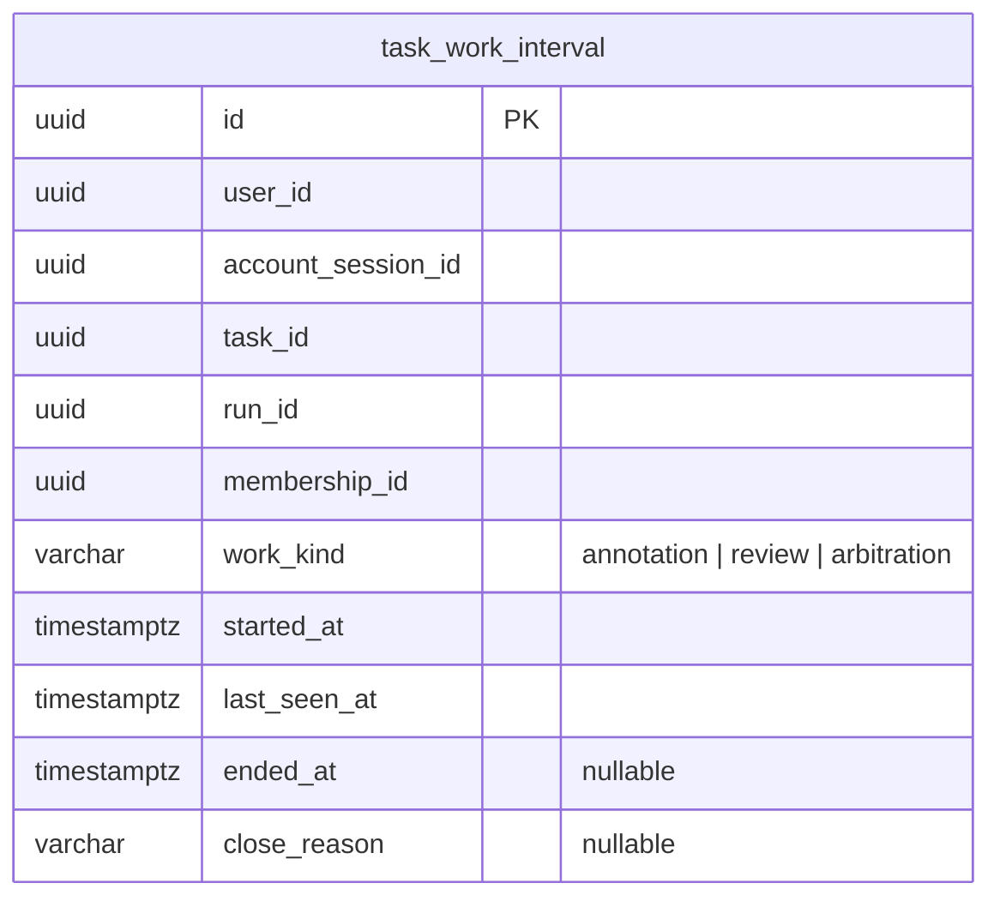

# 任務工時資料庫 schema（實體候選）

> Issue #1160 的衍生欄位字典。本文件的 `task_work_interval` 是一張**未部署候選表**，尚無 ORM、migration 或可執行的 SQLite／PostgreSQL DDL。業務正典為 [014 任務詳情](../../../specs/task-management/014-task-detail/spec.md) FR-007d／FR-010u、[015 標記工作區](../../../specs/annotation/015-annotation-workspace/spec.md) FR-088，以及 [account-020](../../../specs/account/020-auth-session-security/spec.md) 的登入工作階段規則；設計依據見 [工時實體設計](../../superpowers/specs/2026-10-08-worklog-physical-design.md)。

## 1. 範圍與狀態

一列是同一使用者於同一實際登入工作階段、任務、發布執行、成員資格與工作種類下的一段**連續可觀測前景工作區間**。登入、頁面開啟或一次提交均不能單獨證明曾持續工作。`last_seen_at` 是服務端收到的最後有效工作心跳時間；失聯後不得以排程執行時間補齊空白。所有時間由伺服器以 UTC 寫入。

`WorkLogEntry` 是唯讀報表投影，**不建同名資料表**；其完成筆數取自有來源鍵的 `annotation_history_event`，登入與明確登出時間取自 `account_session`。本表不存累計分鐘、完成筆數、速度、答案、資料集分割、任務角色或 run 階段，避免混合不同計數單位及複製可推導狀態。這份規劃圖不能當成已部署 Schema。

## 2. ERD

圖只展示本表欄位，不畫其三組複合外鍵。Mermaid 單欄關聯會把必要的同任務、同使用者限制畫錯；真實複合鍵見 §4。`account_session` 與標記歷程的單欄關聯另見[帳號字典](./account-admin-db-schema.md)及[標記／審核字典](./annotation-review-db-schema.md)。

## 3. 欄位字典

「可空」表示 SQL NULL；`→` 只用於實際單欄 FK，本表身分欄位均參與§4 的**複合** FK，故型別欄不標單欄箭頭。`timestamptz` 表示 UTC 即時點，SQLite 的實際儲存轉換由同一 ORM adapter 處理；`varchar(n)` 的長度也須在 SQLite 由 CHECK／服務驗證。

### 3.1 task_work_interval：連續可觀測工作區間

同一人在多分頁或裝置上只能有一段未關閉工作。切換任務、run、工作種類或失去有效工作條件時先關閉舊段，新的工作另建一列；原始區間跨午夜也不拆列。來源：014 FR-007d、015 FR-088。

| 欄位 | 型別 | 可空 | 代表什麼 | 何時寫入／改變 | 規則 |
|---|---|---|---|---|---|
| `id` | uuid | 否 | 區間的非業務 UUID 主鍵 | 首次開段；不改 | W-01 |
| `user_id` | uuid | 否 | 工作的真實使用者；與 session、membership 組合驗證同一人 | 開段；不改 | W-02 |
| `account_session_id` | uuid | 否 | 當時已驗證登入工作階段，不能由客戶端自報 | 開段；不改 | W-02 |
| `task_id` | uuid | 否 | 任務作用域，供兩組同任務複合鍵 | 開段；不改 | W-02 |
| `run_id` | uuid | 否 | 試標或正式標記的實際發布執行 | 開段；不改 | W-02 |
| `membership_id` | uuid | 否 | 當時選用的任務成員資格；角色由父表讀取 | 開段；不改 | W-02、W-03 |
| `work_kind` | varchar(16) | 否 | 工作種類 `annotation`／`review`／`arbitration`，不得混作同一速度單位 | 開段；不改 | W-03 |
| `started_at` | timestamptz | 否 | 服務端確認可見、聚焦且可編輯工作開始的 UTC 時刻 | 開段；不改 | W-04 |
| `last_seen_at` | timestamptz | 否 | 最近一個有效前景工作心跳的 UTC 時刻 | 有效心跳單調更新 | W-04、W-05 |
| `ended_at` | timestamptz | 是 | 可觀測工作停止的 UTC 時刻；未結束時為空 | 關段時一次寫入 | W-04、W-05 |
| `close_reason` | varchar(32) | 是 | 結束原因；未結束時為空，與 `ended_at` 成對 | 關段時一次寫入 | W-04、W-05 |

## 4. 主鍵、複合外鍵與工作邊界

**DB** 是候選資料庫限制；**SVC** 是授權服務同交易驗證；**SEC** 是受限報表與私有答案隔離驗證。以下均須後續 SQLite／PostgreSQL migration 和雙庫測試，不因文件通過檢查便視為已落地。

| ID | 位置 | 候選限制與驗證方向 | 來源 |
|---|---|---|---|
| W-01 | DB | `id` 為非空 UUID PK，所有身份與 `started_at`、`last_seen_at` 均 NOT NULL；無每日彙總列或第二主鍵 | 014 FR-007d |
| W-02 | DB＋SVC | 三組真複合 FK：`(task_id,run_id) → task_run(task_id,id)`；`(task_id,membership_id,user_id) → task_membership(task_id,id,user_id)`；`(user_id,account_session_id) → account_session(user_id,id)`。父表建立同順序 UNIQUE，引用刪除先採 ON DELETE RESTRICT。SVC 從已驗證 `sid` 與當前授權取得使用者、session、task、run、membership，不信任客戶端自報身分 | 014 FR-007d／FR-010u、account-020 FR-001 |
| W-03 | DB＋SVC | `work_kind IN ('annotation','review','arbitration')`；服務核對 membership 任務角色、目前 active 權限及該 run 可操作資格。工作種類只描述時間段，不複製角色字串 | 014 FR-007d、ADR-037 |
| W-04 | DB | CHECK `started_at <= last_seen_at AND (ended_at IS NULL OR last_seen_at <= ended_at)`；`ended_at` 與 `close_reason` 成對同有同無。關段後兩欄及最後心跳不可回退或清空，由狀態交易和測試保證 | 014 FR-007d |
| W-05 | SVC | 進入可編輯且可見聚焦的工作區才開段；候選心跳每 30 秒，10 分鐘無互動停止，失焦、背景化、任務／run／工作種類切換、明確登出及安全作廢均關段。90 秒無有效心跳時，以最後有效 `last_seen_at` 作 `ended_at`，不以偵測時間充作工時。關段與新開段同交易，重送須冪等 | 014 FR-007d、015 FR-088 |
| W-06 | DB＋SVC | 部分 `UNIQUE (user_id) WHERE ended_at IS NULL`：同一使用者跨分頁與裝置最多一段未關閉區間；服務以條件 UPDATE 關舊段後開新段，不將同時重送計為兩段 | 014 FR-007d |
| W-07 | SVC＋SEC | 唯讀 `WorkLogEntry` 以 `account_session × task × run × membership × work_kind × report_date` 分組；報表日固定 Asia/Taipei，原始跨日段只在查詢時按當地午夜裁切。完成筆數從驗證 session 歸屬的不可變事件去重；沒有可信區間時工時與速度為「未知／—」，不可偽造零分鐘。標記、審核單位、仲裁爭議項各用自身件／時，不相加為單一速度；標記者不得看到他人的 session ID 或私有答案 | 014 FR-007b／FR-007d／FR-010u、015 FR-088 |

登入時間為 `account_session.started_at`；登出時間只取明確登出成功所寫的 `logged_out_at`，null 顯示「未知」。`revoked_at` 可由到期、撤銷或安全事件造成，**不能冒充登出時間**。同一登入工作階段在多個任務／run 的報表列重複顯示在線時差時，該時差不得跨列相加；在線時差也不代表前景工時。標記完成按 `run_id × assignment_id` 去重，審核按首次完整提交所屬 `annotation_review_submission.id` 去重，仲裁按終局爭議鍵去重；後續改判及逐 outKey 事件不增算一個審核單位。舊事件無可驗證 session 時不得硬分配給某次登入。

## 5. 索引與查詢成本

先使用 PK／UNIQUE 的左前綴；下列只是候選，migration 後依 SQLite `EXPLAIN QUERY PLAN` 與 PostgreSQL `EXPLAIN` 的實際查詢決定是否保留。索引會增加心跳 UPDATE 與事件寫入成本。

| 查詢／參照 | 候選索引 | 覆蓋與成本 |
|---|---|---|
| 唯一開啟區間 | 部分 UNIQUE `task_work_interval(user_id) WHERE ended_at IS NULL` | DB 防跨裝置雙開；僅涵蓋未關閉列，報表仍需完整索引 |
| 任務／run 日報表 | `task_work_interval(task_id,run_id,started_at,id)` | 覆蓋 run 複合 FK 的左側前綴與有界時間掃描；舊段跨日仍由應用層切日 |
| 登入工作階段歷程 | `task_work_interval(account_session_id,started_at,id)` | 由實際 session 反查與排序；索引不替代 `(user_id,account_session_id)` 複合 FK 的一致性 |
| 同任務 membership 反查 | `task_work_interval(task_id,membership_id,user_id)` | 父 membership 刪除受限時覆蓋複合 FK 反查；若雙庫查詢計畫證明可由其他索引覆蓋，再避免重複建置 |

## 6. SQLite／PostgreSQL、保留與私隱

- **雙庫約束**：SQLite Lite 每個連線啟用 `PRAGMA foreign_keys=ON`；複合外鍵的父表必須有同欄序 UNIQUE，否則寫入時可能報 `foreign key mismatch`。同一 ORM adapter 映射 UUID 與 UTC 時間；SQLite 的 `varchar(n)` 不保證長度，應用驗證或 CHECK 補齊。PostgreSQL 使用原生 UUID／`timestamptz`。兩庫都要驗 CHECK、部分唯一索引、刪除受限及跨使用者、跨任務插入拒絕。
- **並發**：PostgreSQL 在同一交易鎖定使用者目前開啟區間並執行條件式關閉；SQLite 於開始讀取／修改前使用 `BEGIN IMMEDIATE`，再靠部分唯一索引擋競爭。心跳只在同一開啟列及有效 session 下前進，失聯恢復另建段，不把離線空白回填。
- **保留**：`task_work_interval`、受其引用的 `account_session` 及帶 session 歸屬的 `annotation_history_event` 先以一年為最低候選保留期；資料主體刪除／匿名化與最長期限尚待產品隱私政策。普通硬刪先採 RESTRICT，不設自動清理；refresh token 可按安全政策清理，但歷史 session 在仍受合法引用時保留。
- **資料隔離**：本表只存身分及時間，仍屬個人活動資料。報表須重驗目前 membership 與資源權限，限制可讀範圍、分頁及期間；標記者 API 不提供其他成員的 session／工時，也不從標記歷程洩露私有答案、其他人的事件或 test-set 正解。

## 7. 後續落地驗證

獨立 migration PR 須先用 Red 測試建立 SQLite／PostgreSQL upgrade、downgrade、roundtrip、三組複合 FK、同序父 UNIQUE、部分唯一、CHECK 與 RESTRICT；再驗多裝置競爭、失聯與明確登出、跨午夜、同日多次登入、無工時但有提交、審核多 outKey 去重、仲裁去重及權限隔離。文件與 NoteCraft 僅供審閱，不能代替執行期證據。心跳門檻與確切個資保留期限在正式落地前仍須依正典與政策審核。

**交付狀態：1 張未部署候選表、11 欄、0 個單欄 FK，另有 3 組真複合 FK。**
