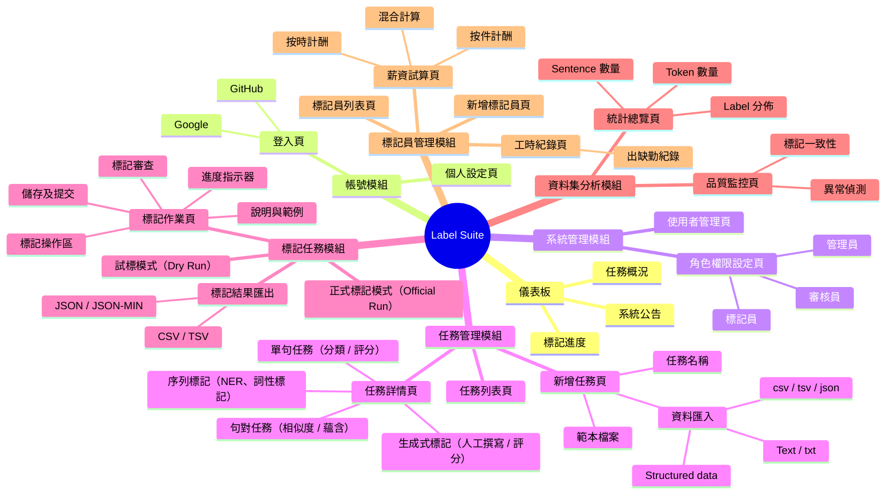

# Label Suite — Functional Map

> **原始檔：** [`docs/Label Suite.xmind`](./Label%20Suite.xmind)
> **線上版：** [在 XMind 開啟](https://app.xmind.com/embed/PKjJEIHD?sheet-id=34e508c5-955b-4ab0-93a2-94036e5eccd9)

---

