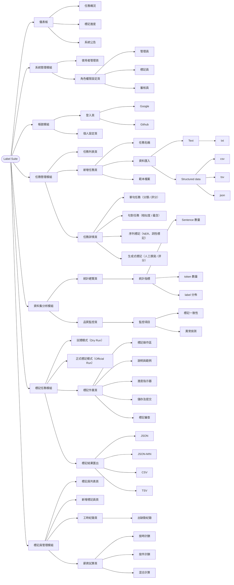

# Label Suite — Functional Map

> **線上版：** [在 XMind 開啟](https://app.xmind.com/share/PKjJEIHD)

---

```mermaid
flowchart LR
  n0(["Label Suite"])
  n0 --> n1["儀表板"]
  n1 --> n2["任務概況"]
  n1 --> n3["標記進度"]
  n1 --> n4["系統公告"]
  n0 --> n5["系統管理模組"]
  n5 --> n6["使用者管理頁"]
  n5 --> n7["角色權限設定頁"]
  n7 --> n8["管理員"]
  n7 --> n9["標記員"]
  n7 --> n10["審核員"]
  n0 --> n11["帳號模組"]
  n11 --> n12["登入頁"]
  n12 --> n13["Google"]
  n12 --> n14["Github"]
  n11 --> n15["個人設定頁"]
  n0 --> n16["任務管理模組"]
  n16 --> n17["任務列表頁"]
  n16 --> n18["新增任務頁"]
  n18 --> n19["任務名稱"]
  n18 --> n20["資料匯入"]
  n20 --> n21["Text"]
  n21 --> n22["txt"]
  n20 --> n23["Structured data"]
  n23 --> n24["csv"]
  n23 --> n25["tsv"]
  n23 --> n26["json"]
  n18 --> n27["範本檔案"]
  n16 --> n28["任務詳情頁"]
  n28 --> n29["單句任務（分類 / 評分）"]
  n28 --> n30["句對任務（相似度 / 蘊含）"]
  n28 --> n31["序列標記（NER、詞性標記）"]
  n28 --> n32["生成式標記（人工撰寫 / 評分）"]
  n0 --> n33["資料集分析模組"]
  n33 --> n34["統計總覽頁"]
  n34 --> n35["統計指標"]
  n35 --> n36["Sentence 數量"]
  n35 --> n37["token 數量"]
  n35 --> n38["label 分佈"]
  n33 --> n39["品質監控頁"]
  n39 --> n40["監控項目"]
  n40 --> n41["標記一致性"]
  n40 --> n42["異常偵測"]
  n0 --> n43["標記任務模組"]
  n43 --> n44["試標模式（Dry Run）"]
  n43 --> n45["正式標記模式（Official Run）"]
  n43 --> n46["標記作業頁"]
  n46 --> n47["標記操作區"]
  n46 --> n48["說明與範例"]
  n46 --> n49["進度指示器"]
  n46 --> n50["儲存及提交"]
  n46 --> n51["標記審查"]
  n43 --> n52["標記結果匯出"]
  n52 --> n53["JSON"]
  n52 --> n54["JSON-MIN"]
  n52 --> n55["CSV"]
  n52 --> n56["TSV"]
  n0 --> n57["標記員管理模組"]
  n57 --> n58["標記員列表頁"]
  n57 --> n59["新增標記員頁"]
  n57 --> n60["工時紀錄頁"]
  n60 --> n61["出缺勤紀錄"]
  n57 --> n62["薪資試算頁"]
  n62 --> n63["按時計酬"]
  n62 --> n64["按件計酬"]
  n62 --> n65["混合計算"]
```
