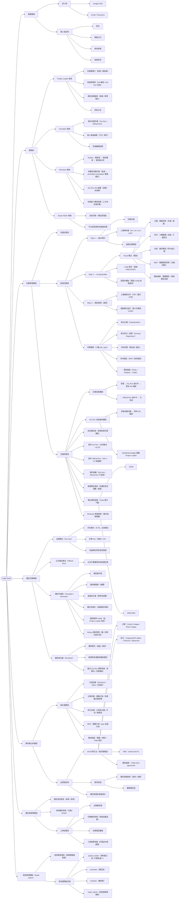

# Label Suite — Functional Map

> **線上版：** [在 XMind 開啟](https://app.xmind.com/share/PKjJEIHD)（線上版可能落後本文件，以本文件為準）
>
> **版本：** v3（2026-04-02）— 依 [IA v3](../ia/information-architecture.md) 同步更新

---

```mermaid
flowchart LR
  n0(["Label Suite"])

  %% ── 帳號模組 ──
  n0 --> nACC["帳號模組"]
  nACC --> nLOGIN["登入頁"]
  nLOGIN --> nLG["Google SSO"]
  nLOGIN --> nLE["Email / Password"]
  nACC --> nPROF["個人設定頁"]
  nPROF --> nPN["姓名"]
  nPROF --> nPC["聯絡方式"]
  nPROF --> nPPW["修改密碼"]
  nPROF --> nPR["查看角色"]

  %% ── 儀表板 ──
  n0 --> nDASH["儀表板"]
  nDASH --> nDPL["Project Leader 視角"]
  nDPL --> nDPL1["任務總覽卡（狀態 / 進度條）"]
  nDPL --> nDPL2["待處理事項（IAA 確認 / Dry Run 完成）"]
  nDPL --> nDPL3["標記員進度區（速度 / 異常警示）"]
  nDPL --> nDPL4["系統公告"]
  nDASH --> nDAN["Annotator 視角"]
  nDAN --> nDAN1["我的任務列表（Dry Run / Official Run）"]
  nDAN --> nDAN2["個人進度摘要（今日 / 累計）"]
  nDAN --> nDAN3["快速繼續按鈕"]
  nDASH --> nDRV["Reviewer 視角"]
  nDRV --> nDRV0["Navbar：儀表板 ｜ 標記審查 ｜ 資料集分析"]
  nDRV --> nDRV1["待審查任務列表（點選 → annotation-workspace 審查模式）"]
  nDRV --> nDRV2["Dry Run IAA 摘要（達標 / 未達標）"]
  nDRV --> nDRV3["快速進入審查按鈕（上次未完成任務）"]
  nDASH --> nDSA["Super Admin 視角"]
  nDSA --> nDSA1["全局任務 + 標記員進度"]
  nDSA --> nDSA2["平台使用者角色帳號快覽"]

  %% ── 任務管理模組 ──
  n0 --> nTASK["任務管理模組"]
  nTASK --> nTL["任務列表頁"]
  nTASK --> nTN["新增任務頁"]
  nTN --> nTN1["Step 1 — 基本資料"]
  nTN1 --> nTN1A["任務名稱"]
  nTN1 --> nTN1B["上傳資料集（txt / csv / tsv / json）"]
  nTN1 --> nTN1C["選擇任務類型"]
  nTN --> nTN2["Step 2 — Config Builder"]
  nTN2 --> nTN2A["Visual 模式（預設）"]
  nTN2A --> nTN2A1["分類：標籤清單（多選 / 單選）"]
  nTN2A --> nTN2A2["評分：分數範圍 / 刻度 / 介面型式"]
  nTN2A --> nTN2A3["句對：關係類型 / 評分或分類"]
  nTN2A --> nTN2A4["NER：實體類型清單（名稱+顏色）"]
  nTN2A --> nTN2A5["關係抽取：實體類型 + 關係類型清單"]
  nTN2 --> nTN2B["Code 模式（進階 YAML/JSON）"]
  nTN2 --> nTN2C["從範本開始（預設 config 快速套用）"]
  nTN --> nTN3["Step 3 — 標記說明（選填）"]
  nTN3 --> nTN3A["上傳說明文件（PDF / 圖片 / 文字）"]
  nTN3 --> nTN3B["強制顯示設定（進入任務前 modal）"]
  nTN --> nTNTYPE["任務類型（5 種 task_type）"]
  nTNTYPE --> nTT1["單句分類（Classification）"]
  nTNTYPE --> nTT2["單句評分 / 回歸（Scoring / Regression）"]
  nTNTYPE --> nTT3["句對任務（相似度 / 蘊含）"]
  nTNTYPE --> nTT4["序列標記（NER / 詞性標記）"]
  nTNTYPE --> nTT5["關係抽取（Entity + Relation + Triple）"]
  nTASK --> nTD["任務詳情頁"]
  nTD --> nTDS["任務狀態轉換"]
  nTDS --> nTDS1["草稿 → Dry Run 進行中 → 等待 IAA 確認"]
  nTDS --> nTDS2["→ Official Run 進行中 → 已完成"]
  nTD --> nTDN["Dry Run 完成通知機制"]
  nTDN --> nTDN1["狀態自動切換 → 等待 IAA 確認"]
  nTDN --> nTDN2["Dashboard badge 提醒 Project Leader"]
  nTD --> nTD1["指派標記員（從標記員列表選取）"]
  nTD --> nTD2["發布 Dry Run（共同樣本 ~20 句）"]
  nTD --> nTD3["發布 Official Run（IAA ≥ 0.8 後啟動）"]
  nTD --> nTD4["資料隔離（Dry Run / Official Run 不混用）"]
  nTD --> nTD5["查看標記進度（各標記員完成數 / 速度）"]
  nTD --> nTD6["匯出標記結果（Toast 提示下載）"]
  nTD6 --> nEX1["JSON"]
  nTD6 --> nEX2["JSON-MIN"]
  nTD --> nTDRV["Reviewer 唯讀視角（操作按鈕隱藏）"]

  %% ── 標記任務模組 ──
  n0 --> nANN["標記任務模組"]
  nANN --> nDR["試標模式（Dry Run）"]
  nDR --> nDR1["共同樣本 ~20 句，全員標記"]
  nDR --> nDR2["計算 IAA（目標 ≥ 0.8）"]
  nDR --> nDR3["討論標記準則直至達標"]
  nANN --> nOR["正式標記模式（Official Run）"]
  nOR --> nOR1["分派不重疊資料給各標記員"]
  nANN --> nAW["標記作業頁（Annotator / Reviewer）"]
  nAW --> nAW1["標記操作區"]
  nAW --> nAW2["說明與範例（側欄）"]
  nAW --> nAW3["進度指示器（即時完成數）"]
  nAW --> nAW4["儲存及提交（自動儲存草稿）"]
  nAW --> nAW5["強制說明 modal（由 Project Leader 設定）"]
  nAW --> nAW6["History 標記歷程（誰 / 何時 / 改成什麼）"]
  nANN --> nREV["審核員功能（Reviewer）"]
  nREV --> nREV1["審查模式（通過 / 退回）"]
  nREV --> nREV2["直接修改或刪除錯誤標記"]
  nREV --> nREV3["產出 Dry Run 標準答案（多數決 / 手動確認）"]

  %% ── 資料集分析模組 ──
  n0 --> nDS["資料集分析模組"]
  nDS --> nST["統計總覽頁"]
  nST --> nST0["共用指標（Sentence / Token / 完成率）"]
  nST --> nST1["分類任務：標籤分佈 / 多標籤共現矩陣"]
  nST --> nST2["評分任務：分佈直方圖 / 平均 / 標準差"]
  nST --> nST3["NER：實體分佈 / span 長度分佈"]
  nST --> nST4["關係抽取：實體 + 關係 + Triple 統計"]
  nDS --> nQC["品質監控頁"]
  nQC --> nIAA["IAA 計算方法（依任務類型）"]
  nIAA --> nIAA1["分類：Cohen's Kappa / Fleiss' Kappa"]
  nIAA --> nIAA2["評分：Krippendorff's Alpha / Pearson / Spearman"]
  nIAA --> nIAA3["NER：Entity-level F1"]
  nIAA --> nIAA4["關係抽取：Triple-level agreement"]
  nQC --> nAD["異常偵測"]
  nAD --> nAD1["標記速度異常（過快 / 過慢）"]
  nAD --> nAD2["離群標記值"]
  nQC --> nSPD["標記員個別速度統計"]

  %% ── 標記員管理模組 ──
  n0 --> nAMGR["標記員管理模組"]
  nAMGR --> nAL["標記員列表頁（啟用 / 停用）"]
  nAMGR --> nANW["新增標記員頁（名稱 / Email）"]
  nAMGR --> nWL["工時紀錄頁"]
  nWL --> nWL1["出缺勤紀錄"]
  nWL --> nWL2["任務標記時間（系統自動追蹤）"]
  nWL --> nWL3["任務標記數量"]
  nWL --> nWL4["工時結算依據（計薪由外部處理）"]

  %% ── 系統管理模組 ──
  n0 --> nSYS["系統管理模組（Super Admin）"]
  nSYS --> nUM["使用者管理頁（跨專案帳號管理）"]
  nSYS --> nRS["角色權限設定頁"]
  nRS --> nRS1["project_leader（資料建立者 / 計畫負責人）"]
  nRS --> nRS2["annotator（標記員）"]
  nRS --> nRS3["reviewer（審核員）"]
  nRS --> nRS4["super_admin（系統超級管理員）"]
```
