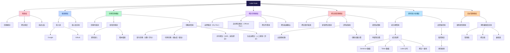

# Label Suite — IA 資訊架構

```mermaid
graph TD
  Root["Label Suite"]

  Root --> M0["儀表板"]
  Root --> M1["帳號模組"]
  Root --> M2["任務管理模組"]
  Root --> M3["標記任務模組"]
  Root --> M4["標記員管理模組"]
  Root --> M5["資料集分析模組"]
  Root --> M6["系統管理模組"]

  M0 --> M0a["任務概況"]
  M0 --> M0b["標記進度"]
  M0 --> M0c["系統公告"]

  M1 --> M1a["登入頁"]
  M1a --> M1a1["Google"]
  M1a --> M1a2["Github"]
  M1 --> M1b["個人設定頁"]

  M2 --> M2a["任務列表頁"]
  M2 --> M2b["新增任務頁"]
  M2b --> M2b1["資料匯入"]
  M2b --> M2b2["範本檔案"]
  M2 --> M2c["任務詳情頁"]
  M2c --> M2c1["單句任務（分類 / 評分）"]
  M2c --> M2c2["句對任務（相似度 / 蘊含）"]
  M2c --> M2c3["序列標記（NER、詞性標記）"]
  M2c --> M2c4["生成式標記（人工撰寫 / 評分）"]

  M3 --> M3a["試標模式（Dry Run）"]
  M3 --> M3b["正式標記模式（Official Run）"]
  M3 --> M3c["標記作業頁"]
  M3 --> M3d["標記結果匯出"]

  M4 --> M4a["標記員列表頁"]
  M4 --> M4b["新增標記員頁"]
  M4 --> M4c["工時紀錄頁"]
  M4c --> M4c1["出缺勤紀錄"]
  M4c --> M4c2["任務次數計算"]
  M4 --> M4d["薪資試算頁"]
  M4d --> M4d1["時薪制計算"]

  M5 --> M5a["統計總覽頁"]
  M5a --> M5a1["統計指標"]
  M5a1 --> M5a1a["Sentence 數量"]
  M5a1 --> M5a1b["Token 數量"]
  M5a1 --> M5a1c["Label 分布"]
  M5a1 --> M5a1d["標記一致性"]
  M5 --> M5b["品質監控頁"]
  M5b --> M5b1["監控項目"]
  M5b1 --> M5b1a["異常偵測"]

  M6 --> M6a["使用者管理頁"]
  M6 --> M6b["角色權限設定頁"]
  M6b --> M6b1["管理員"]
  M6b --> M6b2["標記員"]
  M6b --> M6b3["審核員"]

  style Root fill:#1E1B4B,color:#fff
  style M0 fill:#FECDD3,color:#881337
  style M1 fill:#BFDBFE,color:#1E3A8A
  style M2 fill:#BBF7D0,color:#14532D
  style M3 fill:#E9D5FF,color:#4C1D95
  style M4 fill:#FECACA,color:#7F1D1D
  style M5 fill:#BAE6FD,color:#0C4A6E
  style M6 fill:#FED7AA,color:#7C2D12
```
