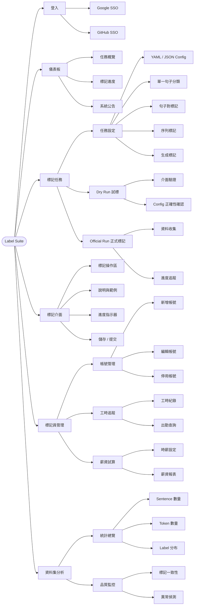

# Label Suite — 資訊架構（Information Architecture）

> **Draft / Outdated** — This file is an early graph LR draft kept for reference only.
> For the current authoritative IA, see [`ia-diagram.md`](ia-diagram.md).

