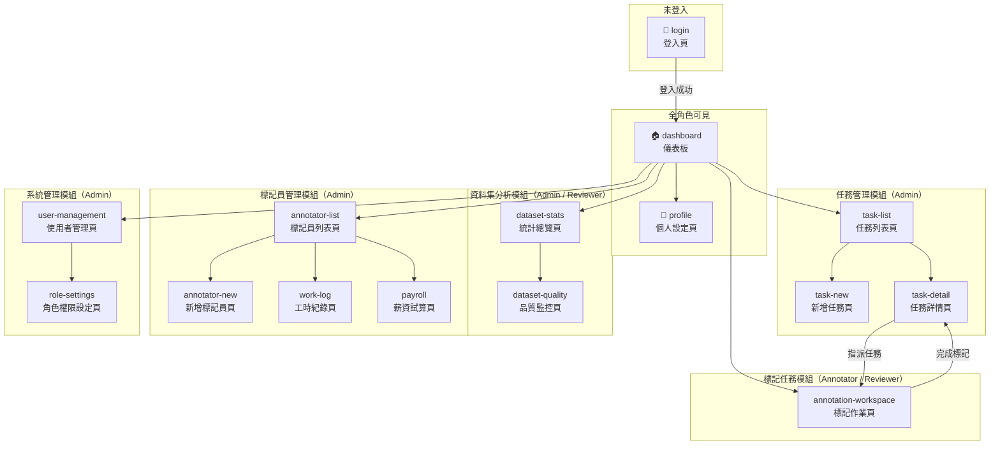
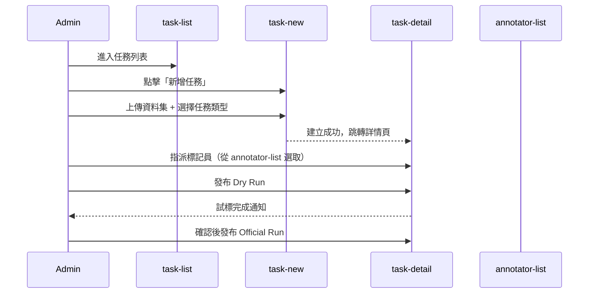
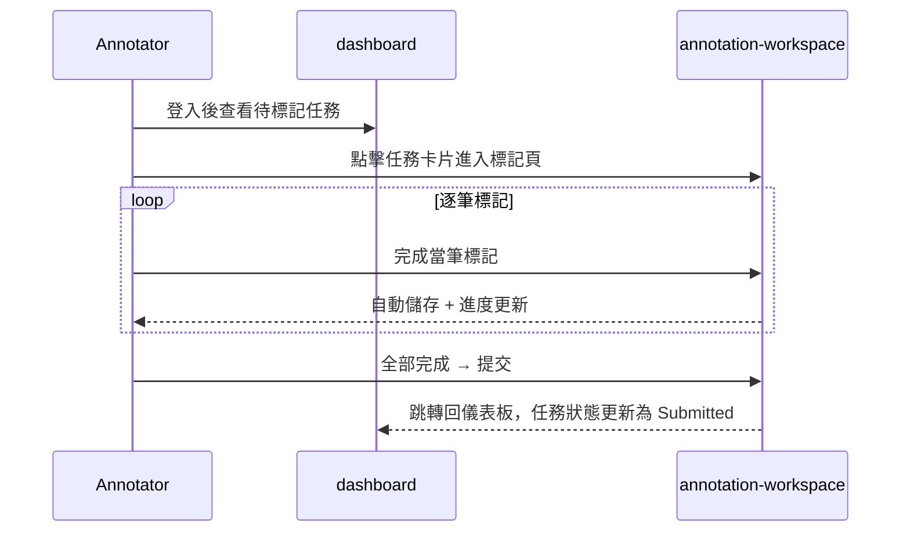
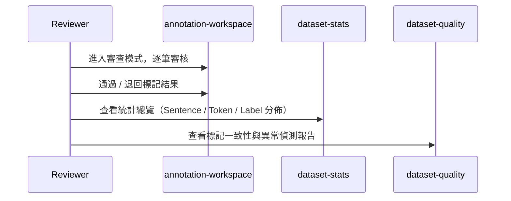

# Label Suite — 資訊架構 v2

> **用途：** 作為 SDD 開發的參考基準。每份 `spec.md` 撰寫前，應先對照本文件確認頁面歸屬、使用者角色、進入條件與導覽關係。
>
> **基礎來源：** [`functional-map.md`](../functional-map/functional-map.md)
> **版本：** v2（2026-04-01）

---

## 1. 使用者角色

| 角色 | 識別碼 | 主要職責 | 可存取模組 |
|------|--------|----------|------------|
| 管理員 | `admin` | 建立任務、管理使用者、設定系統 | 全部 |
| 標記員 | `annotator` | 執行標記作業、查看自己的進度 | 儀表板（個人）、帳號模組、標記任務模組 |
| 審核員 | `reviewer` | 審查標記結果、查看品質報告 | 儀表板、標記任務模組（審查）、資料集分析模組 |

---

## 2. 頁面清單與角色存取矩陣

| 頁面 ID | 頁面名稱 | 所屬模組 | Admin | Annotator | Reviewer | 備註 |
|---------|----------|----------|:-----:|:---------:|:--------:|------|
| `login` | 登入頁 | 帳號模組 | ✅ | ✅ | ✅ | 未登入唯一可進入的頁面 |
| `profile` | 個人設定頁 | 帳號模組 | ✅ | ✅ | ✅ | |
| `dashboard` | 儀表板 | — | ✅ | ✅（限個人） | ✅ | 登入後預設落地頁 |
| `task-list` | 任務列表頁 | 任務管理模組 | ✅ | ❌ | ❌ | |
| `task-new` | 新增任務頁 | 任務管理模組 | ✅ | ❌ | ❌ | |
| `task-detail` | 任務詳情頁 | 任務管理模組 | ✅ | ❌ | ✅（唯讀） | |
| `annotation-workspace` | 標記作業頁 | 標記任務模組 | ❌ | ✅ | ✅（審查模式） | |
| `dataset-stats` | 統計總覽頁 | 資料集分析模組 | ✅ | ❌ | ✅ | |
| `dataset-quality` | 品質監控頁 | 資料集分析模組 | ✅ | ❌ | ✅ | |
| `annotator-list` | 標記員列表頁 | 標記員管理模組 | ✅ | ❌ | ❌ | |
| `annotator-new` | 新增標記員頁 | 標記員管理模組 | ✅ | ❌ | ❌ | |
| `work-log` | 工時紀錄頁 | 標記員管理模組 | ✅ | ❌ | ❌ | |
| `payroll` | 薪資試算頁 | 標記員管理模組 | ✅ | ❌ | ❌ | |
| `user-management` | 使用者管理頁 | 系統管理模組 | ✅ | ❌ | ❌ | |
| `role-settings` | 角色權限設定頁 | 系統管理模組 | ✅ | ❌ | ❌ | |

---

## 3. 頁面導覽結構圖

---

## 4. 模組詳細說明

### 帳號模組

#### `login` 登入頁
- **進入方式：** 未登入時唯一可見頁面；所有未授權跳轉均導回此頁
- **功能：** Email / Password 登入、Google SSO、GitHub SSO
- **離開方式：** 登入成功 → `dashboard`

#### `profile` 個人設定頁
- **進入方式：** Navbar 使用者頭像 → `profile`
- **功能：** 修改顯示名稱、上傳頭像、修改密碼、查看角色
- **離開方式：** 儲存成功 → 停留；取消 → `dashboard`

---

### 儀表板

#### `dashboard` 儀表板
- **進入方式：** 登入後預設落地頁；Navbar Logo 點擊
- **功能（Admin）：** 全系統任務概況、所有標記員進度、系統公告
- **功能（Annotator）：** 個人被指派的任務清單、個人標記進度
- **功能（Reviewer）：** 待審查任務清單、整體進度
- **離開方式：** 導覽列 → 各模組

---

### 任務管理模組

#### `task-list` 任務列表頁
- **進入方式：** 儀表板 Navbar → 任務管理
- **功能：** 顯示所有任務（含狀態 badge）、搜尋 / 篩選、進入任務詳情
- **離開方式：** 點選任務 → `task-detail`；「新增任務」按鈕 → `task-new`

#### `task-new` 新增任務頁
- **進入方式：** `task-list` → 新增任務
- **功能：** 填寫任務名稱、上傳資料集（txt / csv / tsv / json）、選擇任務類型、上傳範本
- **任務類型：**
  - 單句任務（分類 / 評分）
  - 句對任務（相似度 / 蘊含）
  - 序列標記（NER、詞性標記）
  - 生成式標記（人工撰寫 / 評分）
- **離開方式：** 建立成功 → `task-detail`；取消 → `task-list`

#### `task-detail` 任務詳情頁
- **進入方式：** `task-list` 點選任務
- **功能：** 查看任務設定、指派標記員、發布試標 / 正式標記、查看標記進度
- **離開方式：** 「開始標記」→ `annotation-workspace`；返回 → `task-list`

---

### 標記任務模組

#### `annotation-workspace` 標記作業頁
- **進入方式：** `dashboard` 任務卡片；`task-detail` 指派後
- **兩種模式：**
  - **Dry Run（試標）：** 正式開始前的介面驗證，結果不計入正式資料
  - **Official Run（正式標記）：** 正式資料收集
- **功能（Annotator）：** 標記操作區、說明與範例、進度指示器、儲存 / 提交
- **功能（Reviewer）：** 審查模式，可通過 / 退回標記結果
- **離開方式：** 提交 → 停留（下一筆）或返回 `dashboard`；中途離開 → 自動儲存草稿

---

### 資料集分析模組

#### `dataset-stats` 統計總覽頁
- **進入方式：** Navbar → 資料集分析 → 統計總覽
- **功能：** Sentence 數量、Token 數量、Label 分佈視覺化圖表
- **離開方式：** 切換至 `dataset-quality`

#### `dataset-quality` 品質監控頁
- **進入方式：** `dataset-stats` 切換；或 Navbar 直接進入
- **功能：** 標記一致性分析（Inter-Annotator Agreement）、異常偵測（低信心標記 / 離群值）
- **離開方式：** 返回 `dataset-stats`

---

### 標記員管理模組

#### `annotator-list` 標記員列表頁
- **進入方式：** Navbar → 標記員管理
- **功能：** 查看所有標記員帳號、啟用 / 停用、進入個別詳情
- **離開方式：** 「新增標記員」→ `annotator-new`；點選標記員 → `work-log`

#### `annotator-new` 新增標記員頁
- **進入方式：** `annotator-list` → 新增
- **功能：** 填寫基本資料、設定薪資計算方式（按時 / 按件 / 混合）
- **離開方式：** 儲存 → `annotator-list`；取消 → `annotator-list`

#### `work-log` 工時紀錄頁
- **進入方式：** `annotator-list` → 點選標記員
- **功能：** 出缺勤紀錄、每日工時、標記任務次數
- **離開方式：** 返回 `annotator-list`；導向 `payroll`

#### `payroll` 薪資試算頁
- **進入方式：** `work-log` → 薪資試算；或 `annotator-list` 薪資按鈕
- **功能：**
  - 按時計酬（時薪 × 工時）
  - 按件計酬（件數 × 單價）
  - 混合計算（自訂比例）
- **離開方式：** 返回 `annotator-list`

---

### 系統管理模組

#### `user-management` 使用者管理頁
- **進入方式：** Navbar → 系統管理 → 使用者管理
- **功能：** 查看所有使用者、新增 / 編輯 / 停用帳號、指派角色
- **離開方式：** 點選角色設定 → `role-settings`

#### `role-settings` 角色權限設定頁
- **進入方式：** `user-management` → 角色設定
- **功能：** 設定管理員 / 標記員 / 審核員的功能存取範圍
- **離開方式：** 儲存 → `user-management`

---

## 5. 核心使用者旅程

### 旅程 A — 管理員建立任務並指派標記員

### 旅程 B — 標記員完成標記作業

### 旅程 C — 審核員審查並查看品質報告

---

## 6. 與 SDD 的對應關係

每次執行 `/speckit.specify` 前，對照以下欄位確認範圍：

| SDD 問題 | 本文件對應位置 |
|----------|----------------|
| 這個 spec 屬於哪個模組？ | § 4 模組詳細說明 |
| 哪些角色會用到這個功能？ | § 2 頁面清單與角色存取矩陣 |
| 這個頁面從哪裡進入？ | § 4 各頁面「進入方式」 |
| 完成後去哪裡？ | § 4 各頁面「離開方式」 |
| 這個功能跑完整 user journey 是什麼？ | § 5 核心使用者旅程 |
| 有沒有跨模組的資料依賴？ | § 3 頁面導覽結構圖 |
