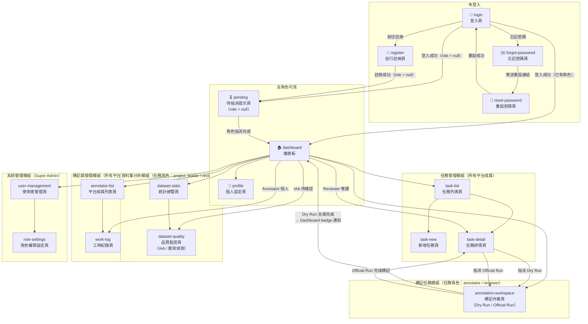
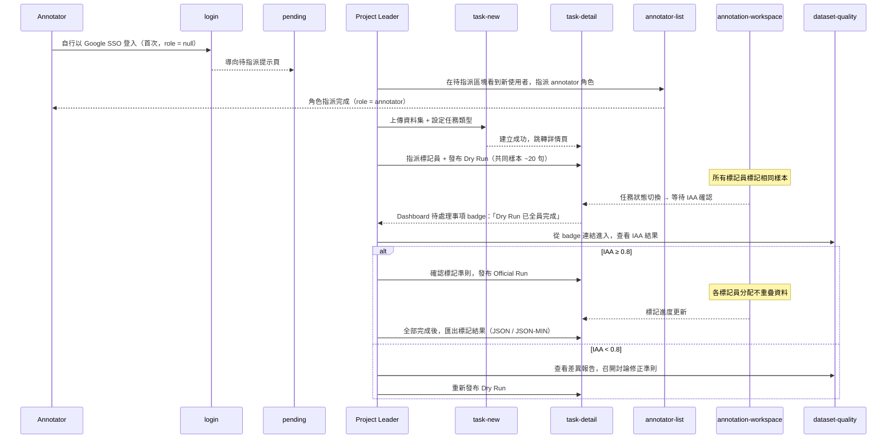
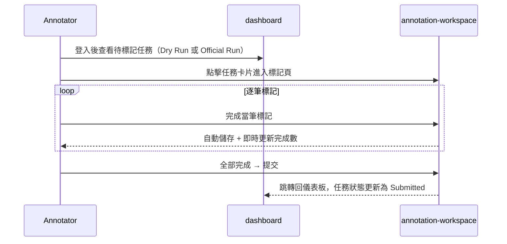
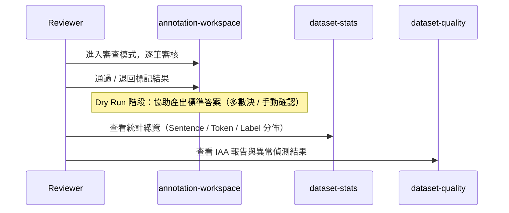
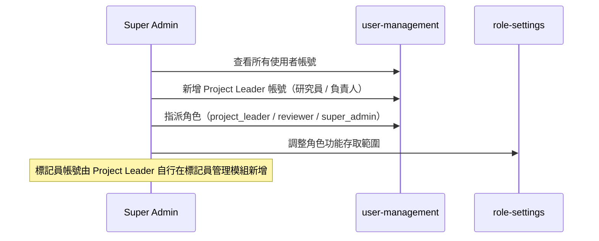

# Label Suite — 資訊架構

> **用途：** 作為 SDD 開發的參考基準。每份 `spec.md` 撰寫前，應先對照本文件確認頁面歸屬、使用者角色、進入條件與導覽關係。
>
> **基礎來源：** [`functional-map.md`](../functional-map/functional-map.md)
> **版本：** v7（2026-04-05）

---

## 1. 使用者角色

本系統採用**雙層角色模型**：系統角色（System Role）決定平台存取權；任務角色（Task Role）決定任務內的操作權限。

### 系統角色（System Role）— JWT 單值，平台層級

| 角色 | 識別碼 | 主要職責 | 指派方式 |
|------|--------|----------|----------|
| 平台成員 | `annotator` | 使用平台所有功能、建立任務、被邀請加入任務 | Super Admin 或 PL（系統角色）指派 |
| 系統超級管理員 | `super_admin` | 平台維護、跨專案使用者管理、系統角色指派 | Super Admin 指派 |

> **新使用者預設狀態：** 任何人皆可透過 Google SSO 登入或 Email / Password 自行註冊（`/register`）進入系統，帳號建立後預設 `role = null`（無角色）。無角色使用者僅能看到 `/pending` 待指派提示頁。Super Admin 在 `user-management` 中指派系統角色；擁有 `annotator` 系統角色的成員也可在 `annotator-list` 中對待指派使用者指派 `annotator` 角色。

### 任務角色（Task Role）— `task_membership` 表，任務層級

| 任務角色 | 識別碼 | 職責 | 指派方式 |
|----------|--------|------|----------|
| 計畫負責人 | `project_leader` | 管理任務設定、指派成員、發布 Dry Run / Official Run、匯出資料 | 建立任務時**自動指派**給任務建立者 |
| 審核員 | `reviewer` | 審查標記結果、協助產出標準答案、查看品質報告 | 由任務 `project_leader` 指派 |
| 標記員 | `annotator` | 執行標記作業（試標 / 正式標）、查看個人進度 | 由任務 `project_leader` 指派 |

> **Task Role 重點：** 同一使用者可在任務 A 擔任 `project_leader`，同時在任務 B 擔任 `annotator`。任務層級的授權透過查詢 `task_membership(task_id, user_id, task_role)` 表決定，不依賴 JWT 系統角色。系統角色不再有繼承關係。

---

## 2. 頁面清單與角色存取矩陣

| 頁面 ID | 頁面名稱 | 所屬模組 | annotator（系統）| super_admin | 任務角色限制 | 備註 |
|---------|----------|----------|:----------------:|:-----------:|-------------|------|
| `login` | 登入頁 | 帳號模組 | ✅ | ✅ | — | 未登入入口；含「前往註冊」連結 |
| `register` | 自行註冊頁 | 帳號模組 | ✅ | ✅ | — | 未登入可進入；填寫名稱、Email、密碼，建立後 `role = null` |
| `forgot-password` | 忘記密碼頁 | 帳號模組 | ✅ | ✅ | — | 未登入可進入；填寫 Email，系統寄送重設連結（Resend）|
| `reset-password` | 重設密碼頁 | 帳號模組 | ✅ | ✅ | — | 未登入可進入；需帶有效 token 參數，逾期導回 `/forgot-password` |
| `pending` | 待指派提示頁 | 帳號模組 | — | — | — | 僅限 `role = null` 的已登入使用者 |
| `profile` | 個人設定頁 | 帳號模組 | ✅ | ✅ | — | |
| `dashboard` | 儀表板 | — | ✅ | ✅ | — | 內容依任務角色動態調整 |
| `task-list` | 任務列表頁 | 任務管理模組 | ✅ | ✅ | — | 僅顯示自己有成員資格的任務 |
| `task-new` | 新增任務頁 | 任務管理模組 | ✅ | ✅ | — | 建立後自動成為任務 `project_leader` |
| `task-detail` | 任務詳情頁 | 任務管理模組 | ✅ | ✅ | 任一任務角色 | 操作按鈕依任務角色顯示 |
| `annotation-workspace` | 標記作業頁 | 標記任務模組 | ✅ | ✅ | `annotator` 或 `reviewer`（任務）| 模式依任務角色切換 |
| `dataset-stats` | 統計總覽頁 | 資料集分析模組 | ✅ | ✅ | `project_leader` 或 `reviewer`（任務）| |
| `dataset-quality` | 品質監控頁 | 資料集分析模組 | ✅ | ✅ | `project_leader` 或 `reviewer`（任務）| |
| `annotator-list` | 平台成員列表頁 | 標記員管理模組 | ✅ | ✅ | — | 任務 PL 瀏覽以邀請成員；含待指派區塊 |
| `work-log` | 工時紀錄頁 | 標記員管理模組 | ✅ | ✅ | — | 一般成員僅自己；`project_leader`（任務）可查看任務成員 |
| `user-management` | 使用者管理頁 | 系統管理模組 | ❌ | ✅ | — | 平台級系統角色管理 |
| `role-settings` | 角色權限設定頁 | 系統管理模組 | ❌ | ✅ | — | |

---

## 3. 頁面導覽結構圖

---

## 4. 模組詳細說明

### 帳號模組

#### `login` 登入頁
- **進入方式：** 未登入時唯一可見頁面；所有未授權跳轉均導回此頁
- **功能：** Google SSO 登入、Email / Password 登入、「前往註冊」連結（→ `register`）
- **離開方式：** 登入成功（已有角色）→ `dashboard`；登入成功（`role = null`）→ `pending`

#### `register` 自行註冊頁
- **進入方式：** `login` → 「前往註冊」連結；未登入時可直接訪問
- **功能：** 填寫名稱、Email、密碼，建立 Email / Password 帳號
- **離開方式：** 註冊成功（`role = null`）→ `pending`；取消 → `login`

#### `forgot-password` 忘記密碼頁
- **進入方式：** `login` → 「忘記密碼」連結；未登入時可直接訪問
- **功能：** 填寫 Email，系統透過 Resend 寄送含有效期 token（30 分鐘）的重設連結至該信箱
- **離開方式：** 送出後停留並顯示「若 Email 存在，重設信已寄出」（不揭露 Email 是否存在）；「返回登入」→ `login`

#### `reset-password` 重設密碼頁
- **進入方式：** Email 重設連結（`/reset-password?token=<UUID>`）
- **功能：** 輸入並確認新密碼；後端驗證 token 有效性與時效後更新密碼雜湊，並使該 token 失效
- **離開方式：** 重設成功 → `login`；token 無效或已過期 → 顯示錯誤並提示重新申請 → `forgot-password`

#### `profile` 個人設定頁
- **進入方式：** Navbar 使用者頭像 → `profile`
- **功能：** 修改姓名、修改聯絡方式、修改密碼、查看角色
- **離開方式：** 儲存成功 → 停留；取消 → `dashboard`

---

### 儀表板

#### `dashboard` 儀表板
- **進入方式：** 登入後預設落地頁；Navbar Logo 點擊
- **離開方式：** 導覽列 → 各模組；卡片快捷入口 → 對應頁面

**Project Leader 視角：**
- **任務總覽卡：** 所有任務列表，每筆顯示任務名稱、任務類型、當前狀態（草稿 / Dry Run 進行中 / 等待 IAA 確認 / Official Run 進行中 / 已完成）、整體完成率進度條
- **待處理事項區：** IAA 結果待確認（附快速連結至 `dataset-quality`）、Dry Run 已全員完成待啟動 Official Run
- **標記員進度區：** 各標記員本任務完成數 / 今日完成數 / 平均速度，速度異常者標示警示
- **系統公告區**
- **空狀態（尚未建立任何任務）：** 說明文字 + 「建立第一個任務」按鈕（→ `task-new`）

**Annotator 視角：**
- **我的任務列表：** 分「Dry Run」與「Official Run」兩區，每筆顯示任務名稱、已完成數 / 總分配數、狀態（未開始 / 進行中 / 已提交）
- **個人進度摘要：** 今日完成數、累計完成數、距離本任務完成還剩幾筆
- **快速繼續按鈕：** 直接進入上次未完成的任務（`annotation-workspace`）
- **空狀態（尚未被指派任務）：** 說明文字「尚未有指派任務，請等待管理員分配」，次要按鈕：「查看個人工時紀錄」（→ `work-log`）、「編輯個人資料」（→ `profile`）

**Reviewer 視角：**
- **Navbar（Reviewer）：** 儀表板 ｜ 標記審查（→ `annotation-workspace` 審查模式）｜ 資料集分析（→ `dataset-stats`）
- **待審查任務列表：** 每筆顯示任務名稱、待審核筆數、已審核 / 總筆數；點選任務卡 → 直接進入 `annotation-workspace` 審查模式
- **Dry Run IAA 摘要：** 顯示當前 Dry Run 的 IAA 分數（依任務類型顯示對應指標），達標 / 未達標狀態
- **快速進入審查按鈕：** 進入上次未完成的審查任務（`annotation-workspace`）
- **空狀態（目前無待審查任務）：** 說明文字，次要按鈕：「查看統計報告」（→ `dataset-stats`）

**Super Admin 視角：**
- 同 Project Leader 全局視角（所有任務 + 標記員進度）
- **平台使用者快覽：** 各角色帳號數量、快速進入 `user-management`
- **空狀態（平台剛部署，尚無任務與使用者）：** 說明文字「平台尚未有任何資料」，次要按鈕：「管理使用者」（→ `user-management`）

---

### 任務管理模組

#### `task-list` 任務列表頁
- **進入方式：** Navbar → 任務管理
- **功能：** 顯示所有任務（含狀態 badge）、搜尋 / 篩選、進入任務詳情
- **空狀態（尚未建立任何任務）：** 說明文字 + 「建立第一個任務」按鈕（→ `task-new`）
- **離開方式：** 點選任務 → `task-detail`；「新增任務」按鈕 → `task-new`

#### `task-new` 新增任務頁
- **進入方式：** `task-list` → 新增任務
- **流程：** 分三步驟完成（Step 1 → Step 2 → Step 3）
- **Step 1 — 基本資料：**
  - 填寫任務名稱
  - 上傳資料集（txt / csv / tsv / json）
  - 選擇任務類型（決定 Step 2 的 Config Builder 內容）
- **Step 2 — Config Builder（介面輔助設定，無需手寫 config）：**
  - 提供「從範本開始」入口：常用任務類型的預設 config（如三分類情感、NER 醫療實體），可直接套用後微調，降低設定門檻
  - **Visual 模式（預設）：**
    - **分類任務：** 新增 / 編輯標籤清單（Label Name + 說明），支援多標籤 / 單標籤切換
    - **評分 / 回歸任務：** 設定分數範圍（最小值 / 最大值）、刻度單位、介面顯示方式（滑桿 / 數字輸入 / 選項按鈕）
    - **句對任務：** 選擇關係類型（相似度 / 蘊含 / 自訂），設定評分或分類標籤
    - **序列標記（NER）：** 新增 / 編輯實體類型清單（Entity Name + 顏色 + 說明）
    - **關係抽取：** 設定實體類型清單（同 NER）+ 關係類型清單（Relation Name + 說明），標記介面呈現 Entity List / Relation Type / Triple List 三區
  - **Code 模式（進階）：** 直接檢視 / 編輯系統產生的 YAML/JSON config 原始碼，供技術人員驗證或手動調整；Visual 與 Code 模式可互相切換
- **Step 3 — 標記說明（選填）：**
  - 上傳標記範本 / 說明文件（PDF / 圖片 / 文字），顯示於 `annotation-workspace` 的「說明與範例」區
  - 可設定「開始標記前強制顯示」：Annotator 每次進入任務時先跳出說明 modal，確認後才進入標記介面
- **任務類型（共 5 種 `task_type`）：**
  - 單句分類（Classification）
  - 單句評分 / 回歸（Scoring / Regression）
  - 句對任務（相似度 / 蘊含）
  - 序列標記（NER、詞性標記）
  - 關係抽取（Entity + Relation + Triple）
- **空狀態：** 不適用（此頁為建立流程，永遠有內容）
- **任務建立完成：** 系統自動在 `task_membership` 建立一筆紀錄，任務建立者的任務角色設為 `project_leader`
- **離開方式：** 建立成功 → `task-detail`；取消 → `task-list`

#### `task-detail` 任務詳情頁
- **進入方式：** `task-list` 點選任務（有任務成員資格的使用者皆可進入）
- **任務狀態轉換：**
  - `草稿` → `Dry Run 進行中` → `等待 IAA 確認` → `Official Run 進行中` → `已完成`
  - **Dry Run 完成通知：** 當所有標記員完成 Dry Run 後，系統自動切換狀態至「等待 IAA 確認」，並在 Dashboard 待處理事項區新增 badge 提醒任務 `project_leader`
- **功能（任務角色：project_leader）：**
  - 查看任務設定與任務類型
  - 邀請平台成員加入任務並指派任務角色（`reviewer` 或 `annotator`）— 從 `annotator-list` 選取
  - 發布試標（Dry Run）：選取共用樣本集（建議 20 句），發布給所有任務標記員
  - 發布正式標記（Official Run）：在 IAA 達標（≥ 0.8）後啟動，分派不重疊資料給各標記員
  - 查看標記進度（各標記員完成數 / 速度）
  - 匯出標記結果（JSON / JSON-MIN）
- **功能（任務角色：reviewer）：** 唯讀視角；指派、發布、匯出等操作按鈕隱藏
- **功能（任務角色：annotator）：** 不可進入任務詳情，僅能從 dashboard 進入 annotation-workspace
- **資料隔離原則：** Dry Run 資料與 Official Run 資料必須隔離，不得混入正式標記集
- **離開方式：** 返回 → `task-list`；匯出為頁面內操作（Toast 提示下載），不觸發頁面跳轉

---

### 標記任務模組

#### `annotation-workspace` 標記作業頁
- **進入方式（Annotator）：** `dashboard` 任務卡片「開始 / 繼續標記」按鈕；快速繼續按鈕
- **進入方式（Reviewer）：** `dashboard` 待審查任務列表中的任務卡；Navbar → 標記審查
- **兩種模式（run_type）：**
  - **Dry Run（試標）：** 所有標記員標記相同樣本，結果不計入正式資料，用於計算 IAA 與討論標記準則
  - **Official Run（正式標記）：** 每位標記員分配不重疊的資料，結果計入正式資料集
- **功能（Annotator）：** 標記操作區、說明與範例（側欄）、進度指示器（即時顯示完成數）、儲存 / 提交
  - **標記說明強制顯示：** 若 Project Leader 在任務設定中啟用，Annotator 每次進入任務前會先看到說明 modal，確認後才進入標記介面
- **功能（Reviewer）：** 審查模式，可通過 / 退回標記結果、直接修改或刪除錯誤標記、協助產出 Dry Run 標準答案（多數決或手動確認）
- **標記歷程（History）：** 每筆資料的所有標記修改紀錄（誰、何時、改成什麼），Reviewer 可追溯標記變更歷程
- **離開方式：** 提交 → 停留（下一筆）或返回 `dashboard`；中途離開 → 自動儲存草稿

---

### 資料集分析模組

> 本模組依任務類型動態調整顯示內容。所有頁面均以當前任務的 `task_type` 作為分析維度切換依據。

#### `dataset-stats` 統計總覽頁
- **進入方式：** Navbar → 資料集分析 → 統計總覽
- **共用指標（所有任務）：** Sentence 數量、Token 數量、整體完成率
- **任務類型特定指標：**
  - **分類任務：** 各標籤次數 / 比例長條圖、多標籤共現矩陣
  - **評分 / 回歸任務：** 分數分佈直方圖、平均值 / 標準差 / 中位數
  - **序列標記（NER）：** 實體類型分佈、每句平均實體數、Entity span 長度分佈
  - **關係抽取：** 實體類型分佈 + 關係類型分佈、Triple 數量統計
  - **句對任務：** 依標籤或分數呈現（同分類 / 評分）
- **空狀態（尚無標記資料）：** 說明文字「尚無標記資料，請先發布 Dry Run」，次要按鈕「前往任務詳情」（→ `task-detail`）
- **離開方式：** 切換至 `dataset-quality`

#### `dataset-quality` 品質監控頁
- **進入方式：** `dataset-stats` 切換；Navbar 直接進入；或 Dashboard 待處理事項區「IAA 待確認」連結（Project Leader）
- **IAA 計算方法（依任務類型）：**
  - **分類任務：** Cohen's Kappa（兩人）/ Fleiss' Kappa（多人），目標 ≥ 0.8
  - **評分 / 回歸任務：** Krippendorff's Alpha、Pearson / Spearman 相關係數
  - **序列標記（NER）：** Entity-level F1（標記員兩兩比較）
  - **關係抽取：** Triple-level agreement（Entity + Relation 完全一致才算匹配）
  - **句對任務：** 同分類或評分（依 config 類型）
- **異常偵測（所有任務）：** 標記速度異常（過快 / 過慢）、離群標記值
- **標記員個別速度統計**
- **空狀態（Dry Run 尚未完成）：** 說明文字「IAA 報告將在 Dry Run 完成後產生」，次要按鈕「前往任務詳情」（→ `task-detail`）
- **離開方式：** 返回 `dataset-stats`

---

### 標記員管理模組

#### `annotator-list` 平台成員列表頁
- **進入方式：** Navbar → 標記員管理
- **功能：**
  - 查看所有系統角色為 `annotator` 的平台成員、啟用 / 停用
  - **待指派區塊：** 顯示已登入或已註冊但 `role = null` 的新使用者，任何 `annotator`（系統）或 `super_admin` 可在此指派 `annotator` 系統角色
  - 任務 `project_leader` 可從此列表選取成員，邀請加入自己的任務並指派任務角色
- **空狀態（尚無任何平台成員）：** 說明文字，提示使用者至 `/register` 或 Google SSO 自行加入
- **離開方式：** 點選成員 → `work-log`

#### `work-log` 工時紀錄頁
- **進入方式（Project Leader）：** `annotator-list` → 點選標記員 → 查看該標記員紀錄
- **進入方式（Annotator）：** Navbar → 工時紀錄 → 僅顯示自己的紀錄
- **功能：** 出缺勤紀錄、任務標記時間（系統自動追蹤）、任務標記數量
- **資料範圍：** Project Leader 可查看所有標記員；Annotator 只能查看自己的紀錄
- **用途說明：** 作為工時結算的依據記錄；實際計薪由系統外部處理，系統不提供計薪功能
- **空狀態（尚無工時紀錄）：** 說明文字「尚無工時紀錄」，無需額外按鈕
- **離開方式：** 返回 `annotator-list`（Project Leader）；返回 `dashboard`（Annotator）

---

### 系統管理模組

> 本模組僅 `super_admin` 可存取。`project_leader` 的人員管理（標記員帳號）在「標記員管理模組」中進行。

#### `user-management` 使用者管理頁
- **進入方式：** Navbar → 系統管理 → 使用者管理
- **功能：** 查看所有平台使用者（跨專案）、新增 / 編輯 / 停用帳號、指派角色（含 project_leader / annotator / reviewer / super_admin）
- **空狀態（尚無任何使用者）：** 說明文字「尚未建立任何使用者帳號」 + 「新增第一位使用者」按鈕
- **離開方式：** 點選角色設定 → `role-settings`

#### `role-settings` 角色權限設定頁
- **進入方式：** `user-management` → 角色設定
- **功能：** 設定各角色（project_leader / annotator / reviewer / super_admin）的功能存取範圍
- **離開方式：** 儲存 → `user-management`

---

## 5. 核心使用者旅程

### 旅程 A — 完整專案生命週期（Project Leader 視角）

### 旅程 B — 標記員完成標記作業

### 旅程 C — 審核員審查並查看品質報告

> 審核員在組織上可由 Project Leader 兼任。透過 RBAC 繼承，單一 `project_leader` 帳號即繼承所有 `reviewer` 能力，無需建立兩個獨立帳號。

### 旅程 D — Super Admin 使用者管理

---

## 6. 與 SDD 的對應關係

每次執行 `/speckit.specify` 前，對照以下欄位確認範圍：

| SDD 問題 | 本文件對應位置 |
|----------|----------------|
| 這個 spec 屬於哪個模組？ | § 4 模組詳細說明 |
| 哪些角色會用到這個功能？ | § 2 頁面清單與角色存取矩陣 |
| 這個頁面從哪裡進入？ | § 4 各頁面「進入方式」 |
| 完成後去哪裡？ | § 4 各頁面「離開方式」 |
| 這個功能跑完整 user journey 是什麼？ | § 5 核心使用者旅程 |
| 有沒有跨模組的資料依賴？ | § 3 頁面導覽結構圖 |

---

## 7. Spec 拆分計畫

### 拆分原則

IA 共 14 個頁面，但不是每個頁面對應一個 spec。拆分以「功能邊界」為單位：

| 原則 | 說明 |
|------|------|
| **獨立可測試** | 該 spec 完成後能獨立驗收，不依賴其他 spec |
| **同一操作流程** | 多個頁面屬於同一個連續操作（如精靈步驟），合為一個 spec |
| **角色視角差異大** | 同一頁面但不同角色有截然不同的功能，拆成獨立 spec |

### Spec 清單

排序依複雜度由簡至繁，同時考量功能依賴關係。
Config Builder、標記作業、統計總覽、IAA 均依任務類型拆分，每種類型可獨立實作與測試。

| # | Spec 名稱 | 頁面 | 模組 | 複雜度 | 狀態 |
|---|-----------|------|------|--------|------|
| 001 | 登入 — Email/Password + 頁面 UI | `login` | account | ★☆☆☆☆ | ⬜ 待重做 |
| 002 | 登入 — Google SSO 整合 | `login` | account | ★★☆☆☆ | ⬜ 待重做 |
| 003 | 自行註冊（Email/Password）| `register` | account | ★☆☆☆☆ | ⬜ 待做 |
| 004 | 忘記密碼 / 重設密碼（Resend）| `forgot-password` · `reset-password` | account | ★★☆☆☆ | ⬜ 待做 |
| 005 | 個人設定（資料編輯 + 修改密碼）| `profile` | account | ★☆☆☆☆ | ⬜ 待重做 |
| 006 | 使用者列表與管理 | `user-management` | admin | ★★☆☆☆ | ⬜ 待做 |
| 007 | 角色權限設定 | `role-settings` | admin | ★★☆☆☆ | ⬜ 待做 |
| 008 | 平台成員列表（搜尋、啟用/停用、待指派）| `annotator-list` | annotator-management | ★★☆☆☆ | ⬜ 待做 |
| 009 | 工時紀錄 | `work-log` | annotator-management | ★★☆☆☆ | ⬜ 待做 |
| 010 | 任務列表（搜尋、篩選、空狀態）| `task-list` | task-management | ★★☆☆☆ | ⬜ 待做 |
| 011 | 儀表板 — Annotator | `dashboard` | dashboard | ★★☆☆☆ | ⬜ 待做 |
| 012 | 儀表板 — Super Admin | `dashboard` | dashboard | ★★★☆☆ | ⬜ 待做 |
| 013 | 儀表板 — Reviewer（任務角色）| `dashboard` | dashboard | ★★★☆☆ | ⬜ 待做 |
| 014 | 儀表板 — Project Leader（任務角色）| `dashboard` | dashboard | ★★★☆☆ | ⬜ 待做 |
| 015 | 任務詳情 — 資訊顯示與狀態 | `task-detail` | task-management | ★★★☆☆ | ⬜ 待做 |
| 016 | 任務詳情 — 成員邀請與 Dry Run 發布 | `task-detail` | task-management | ★★★★☆ | ⬜ 待做 |
| 017 | 任務詳情 — Official Run 發布與匯出 | `task-detail` | task-management | ★★★★☆ | ⬜ 待做 |
| 018 | 任務建立 Step 1 — 基本資料與任務類型選擇 | `task-new` | task-management | ★★☆☆☆ | ⬜ 待做 |
| 019 | 任務建立 Step 3 — 標記說明與強制顯示設定 | `task-new` | task-management | ★★☆☆☆ | ⬜ 待做 |
| 020 | Config Builder — 分類任務（Classification）| `task-new` | task-management | ★★★☆☆ | ⬜ 待做 |
| 021 | Config Builder — 評分/回歸任務（Scoring）| `task-new` | task-management | ★★★☆☆ | ⬜ 待做 |
| 022 | Config Builder — 句對任務（Sentence Pair）| `task-new` | task-management | ★★★☆☆ | ⬜ 待做 |
| 023 | Config Builder — 序列標記（NER）| `task-new` | task-management | ★★★★☆ | ⬜ 待做 |
| 024 | Config Builder — 關係抽取（Relation Extraction）| `task-new` | task-management | ★★★★☆ | ⬜ 待做 |
| 025 | Config Builder — Code 模式與範本快速套用 | `task-new` | task-management | ★★★☆☆ | ⬜ 待做 |
| 026 | 標記作業 — 分類任務 | `annotation-workspace` | annotation | ★★★☆☆ | ⬜ 待做 |
| 027 | 標記作業 — 評分/回歸任務 | `annotation-workspace` | annotation | ★★★☆☆ | ⬜ 待做 |
| 028 | 標記作業 — 句對任務 | `annotation-workspace` | annotation | ★★★☆☆ | ⬜ 待做 |
| 029 | 標記作業 — 序列標記（NER）| `annotation-workspace` | annotation | ★★★★☆ | ⬜ 待做 |
| 030 | 標記作業 — 關係抽取 | `annotation-workspace` | annotation | ★★★★★ | ⬜ 待做 |
| 031 | 標記審查（任務角色：reviewer）| `annotation-workspace` | annotation | ★★★★☆ | ⬜ 待做 |
| 032 | 統計總覽 — 共用基礎指標（Sentence / Token / 完成率）| `dataset-stats` | dataset | ★★★☆☆ | ⬜ 待做 |
| 033 | 統計總覽 — 分類任務（含句對分類模式）| `dataset-stats` | dataset | ★★★★☆ | ⬜ 待做 |
| 034 | 統計總覽 — 評分/回歸任務（含句對評分模式）| `dataset-stats` | dataset | ★★★★☆ | ⬜ 待做 |
| 035 | 統計總覽 — 序列標記（NER）| `dataset-stats` | dataset | ★★★★☆ | ⬜ 待做 |
| 036 | 統計總覽 — 關係抽取 | `dataset-stats` | dataset | ★★★★☆ | ⬜ 待做 |
| 037 | 品質監控 — 異常偵測與標記員速度統計 | `dataset-quality` | dataset | ★★★☆☆ | ⬜ 待做 |
| 038 | IAA — 分類任務（含句對分類模式）| `dataset-quality` | dataset | ★★★★☆ | ⬜ 待做 |
| 039 | IAA — 評分/回歸任務（含句對評分模式）| `dataset-quality` | dataset | ★★★★☆ | ⬜ 待做 |
| 040 | IAA — 序列標記（NER）| `dataset-quality` | dataset | ★★★★★ | ⬜ 待做 |
| 041 | IAA — 關係抽取 | `dataset-quality` | dataset | ★★★★★ | ⬜ 待做 |

> 狀態標示：⬜ 待做 · 🔄 進行中 · ✅ 完成
