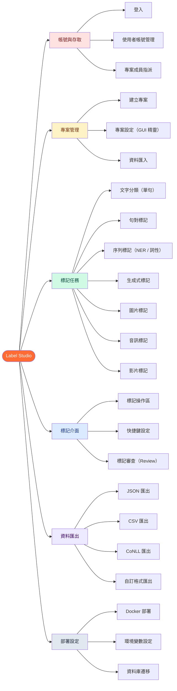

# Label Studio — 功能地圖

> 資料來源：docs/research/tool-analysis.md

```mermaid
graph LR
  Root(["Label Studio"])

  Root --> M1["帳號與存取"]
  Root --> M2["專案管理"]
  Root --> M3["標記任務"]
  Root --> M4["標記介面"]
  Root --> M5["資料匯出"]
  Root --> M6["部署設定"]

  M1 --> M1a["登入"]
  M1 --> M1b["使用者帳號管理"]
  M1 --> M1c["專案成員指派"]

  M2 --> M2a["建立專案"]
  M2 --> M2b["專案設定（GUI 精靈）"]
  M2 --> M2c["資料匯入"]

  M3 --> M3a["文字分類（單句）"]
  M3 --> M3b["句對標記"]
  M3 --> M3c["序列標記（NER / 詞性）"]
  M3 --> M3d["生成式標記"]
  M3 --> M3e["圖片標記"]
  M3 --> M3f["音訊標記"]
  M3 --> M3g["影片標記"]

  M4 --> M4a["標記操作區"]
  M4 --> M4b["快捷鍵設定"]
  M4 --> M4c["標記審查（Review）"]

  M5 --> M5a["JSON 匯出"]
  M5 --> M5b["CSV 匯出"]
  M5 --> M5c["CoNLL 匯出"]
  M5 --> M5d["自訂格式匯出"]

  M6 --> M6a["Docker 部署"]
  M6 --> M6b["環境變數設定"]
  M6 --> M6c["資料庫遷移"]

  style Root fill:#FF6B35,color:#fff
  style M1 fill:#FEE2E2,color:#7F1D1D
  style M2 fill:#FEF3C7,color:#78350F
  style M3 fill:#D1FAE5,color:#064E3B
  style M4 fill:#DBEAFE,color:#1E3A8A
  style M5 fill:#EDE9FE,color:#3B0764
  style M6 fill:#E2E8F0,color:#1E293B
```
