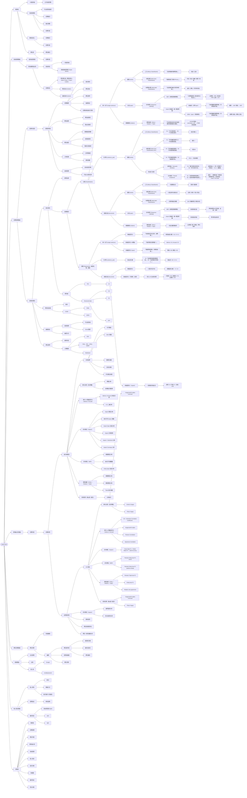

# Label Suite — Functional Map

> **線上版：** [在 XMind 開啟](https://app.xmind.com/share/PKjJEIHD)（以本文件為準）
>
> **版本：** v6（2026-05-19）— 從 XMind 同步更新，新增偏好設定（dark/light）與導覽頁模組

---

```mermaid
flowchart LR
  n0(["Label Suite"])
  n0 --> n1["儀表板"]
  n1 --> n2["一般使用者"]
  n2 --> n3["工作流程導覽"]
  n1 --> n4["系統管理員"]
  n4 --> n5["平台使用者統計"]
  n4 --> n6["任務概況"]
  n4 --> n7["最近提醒"]
  n4 --> n8["任務列表"]
  n1 --> n9["專案負責人"]
  n9 --> n10["任務概況"]
  n9 --> n11["任務列表"]
  n1 --> n12["標記員"]
  n12 --> n13["標記概況"]
  n12 --> n14["任務列表"]
  n0 --> n15["系統管理模組"]
  n15 --> n16["使用者管理頁"]
  n15 --> n17["角色權限設定頁"]
  n17 --> n18["系統角色"]
  n18 --> n19["一般使用者"]
  n18 --> n20["系統超級管理員 (Super Admin)"]
  n17 --> n21["任務角色"]
  n21 --> n22["資料建立者 / 專案負責人 (Data Creator / Project Leader)"]
  n21 --> n23["標記員(Annotator)"]
  n21 --> n24["審核員(Reviewer)"]
  n0 --> n25["任務管理模組"]
  n25 --> n26["任務列表頁"]
  n26 --> n27["任務詳情頁"]
  n27 --> n28["任務概覽"]
  n28 --> n29["基本資料"]
  n28 --> n30["標記設定"]
  n28 --> n31["標記說明"]
  n28 --> n32["抽樣設定"]
  n28 --> n33["任務狀態與執行控制"]
  n27 --> n34["標記結果"]
  n34 --> n35["標記結果表"]
  n34 --> n36["匯出記錄表"]
  n27 --> n37["標記進度"]
  n37 --> n38["整體進度摘要"]
  n37 --> n39["成員進度表"]
  n37 --> n40["階段分段進度"]
  n27 --> n41["工時紀錄"]
  n41 --> n42["工時明細表"]
  n41 --> n43["異常提醒"]
  n27 --> n44["成員管理"]
  n44 --> n45["目前成員清單"]
  n44 --> n46["可加入成員名單"]
  n25 --> n47["新增任務頁"]
  n47 --> n48["基本資料"]
  n48 --> n49["任務名稱*"]
  n48 --> n50["任務類型*"]
  n50 --> n51["分類 (Classification)"]
  n51 --> n52["單一句子 (single sentence)"]
  n52 --> n53["整體 (whole)"]
  n53 --> n54["二元 (Binary Classification)"]
  n54 --> n55["「這家餐廳的服務很差。」"]
  n55 --> n56["負面 / 正面"]
  n53 --> n57["多類分類 (Multi-class Classification)"]
  n57 --> n58["「蘋果發表了新款 iPhone。」"]
  n58 --> n59["科技 / 政治 / 娛樂 / 體育 / 財經"]
  n53 --> n60["多標籤分類 (Multi-label Classification)"]
  n60 --> n61["「這部電影有暴力和恐怖情節。」"]
  n61 --> n62["[暴力, 恐怖]（可同時多個）"]
  n52 --> n63["片段 (span)"]
  n63 --> n64["序列標記 (Sequence Labeling)"]
  n64 --> n65["NER（多類型實體標籤）"]
  n65 --> n66["「台積電創辦人張忠謀於台南出生。」"]
  n66 --> n67["台積電→ORG, 張忠謀→PER, 台南→LOC"]
  n64 --> n68["Aspect 詞抽取（單一類型標籤）"]
  n68 --> n69["純抽取（只標 span）"]
  n69 --> n70["「這家餐廳的服務很差，但環境還不錯。」"]
  n70 --> n71["服務 → ASP, 環境 → ASP"]
  n68 --> n72["ABSA（span + 情感極性）"]
  n72 --> n73["「這家餐廳的服務很差，但環境還不錯。」"]
  n73 --> n74["(服務, 負面), (環境, 正面)"]
  n52 --> n75["實體關係 (relation)"]
  n75 --> n76["關係抽取（Entity + Relation + Triple）"]
  n76 --> n77["「乳房疼痛大部分與月經週期的賀爾蒙變化相關。」"]
  n77 --> n78["(SYMP:疼痛) → associated_with → (TIME:月經週期)"]
  n51 --> n79["句子對 (sentence_pair)"]
  n79 --> n80["整體 (whole)"]
  n80 --> n81["二元 (Binary Classification)"]
  n81 --> n82["S1:「今天天氣很好」 S2:「今天陽光普照」"]
  n82 --> n83["是否同義: 1"]
  n80 --> n84["多類分類 (Multi-class Classification) (NLI)"]
  n84 --> n85["S1:「所有貓都是動物 S2:「有些動物是貓」"]
  n85 --> n86["蘊含 ✅"]
  n84 --> n87["S1:「所有貓都是動物」 S2:「所有動物都是貓」"]
  n87 --> n88["矛盾 ❌"]
  n84 --> n89["S1:「所有貓都是動物」 S2:「貓喜歡吃魚」"]
  n89 --> n90["中立 ➖（完全無關）"]
  n80 --> n91["相似度 / 蘊含"]
  n91 --> n92["語意相似（Semantic Similarity）"]
  n92 --> n93["S1:「銀行調高存款利率」 S2:「央行宣布升息」"]
  n93 --> n94["語意相似: 1（同一件事的不同說法）  0 or 1 / 連續值"]
  n91 --> n95["文本蘊含（Textual Entailment）"]
  n95 --> n96["S1:「這隻狗是哺乳動物。」 S2:「這隻狗需要呼吸空氣。」"]
  n96 --> n97["蘊含 ✅（需要知道「哺乳動物需要呼吸」這個常識） entail / not-entail"]
  n51 --> n98["整篇文章 (document)"]
  n98 --> n99["整體 (whole)"]
  n99 --> n100["二元 (Binary Classification)"]
  n100 --> n101["一篇新聞全文"]
  n101 --> n102["真實 / 假新聞"]
  n99 --> n103["多類分類 (Multi-class Classification)"]
  n103 --> n104["一篇法院判決書全文"]
  n104 --> n105["民事 / 刑事 / 行政 / 憲法"]
  n99 --> n106["多標籤分類 (Multi-label Classification)"]
  n106 --> n107["一篇學術論文摘要"]
  n107 --> n108["[NLP, 機器學習, 情感分析]"]
  n98 --> n109["片段 (span)"]
  n109 --> n110["序列標記 (Sequence Labeling)"]
  n110 --> n111["NER（多類型實體標籤）"]
  n111 --> n112["多段財報文章"]
  n112 --> n113["跨段落標出公司名稱、金額、日期"]
  n110 --> n114["Aspect 詞抽取（單一類型標籤）"]
  n114 --> n115["多段產品評論"]
  n115 --> n116["跨句標出面向詞"]
  n98 --> n117["實體關係 (relation)"]
  n117 --> n118["關係抽取（Entity + Relation + Triple）"]
  n118 --> n119["一篇企業新聞報導"]
  n119 --> n120["(台積電, 客戶, 輝達)   跨句識別"]
  n50 --> n121["迴歸 (Regression) - 維度名稱、範圍"]
  n121 --> n122["單一句子 (single sentence)"]
  n122 --> n123["單維度評分"]
  n123 --> n124["「這個產品完全沒用，浪費錢。」"]
  n124 --> n125["情感強度分數：0.12（0~1）"]
  n122 --> n126["多維度評分 VA雙軸"]
  n126 --> n127["「我好緊張又很興奮！」"]
  n127 --> n128["Valence: 0.6, Arousal: 0.9"]
  n122 --> n129["多維度評分 Aspect"]
  n129 --> n130["「餐廳環境很棒，但餐點普通。」"]
  n130 --> n131["環境: 0.85, 餐點: 0.50"]
  n121 --> n132["句子對 (sentence_pair)"]
  n132 --> n133["相似度分數"]
  n133 --> n134["S1:「這部電影讓我感動落淚。」 S2:「這部電影非常感人。」"]
  n134 --> n135["相似度: 0.92（0~1）"]
  n121 --> n136["整篇文章 (document)"]
  n136 --> n137["單維度評分"]
  n137 --> n138["一篇高中生作文"]
  n138 --> n139["整體品質分數：7.2 / 10"]
  n136 --> n140["多維度評分（可讀性／品質）"]
  n140 --> n141["一篇 LLM 生成的回答"]
  n141 --> n142["可讀性: 0.80, 流暢度: 0.75, 正確性: 0.60"]
  n136 --> n143["多維度評分（Aspect）"]
  n143 --> n144["一篇電影評論全文"]
  n144 --> n145["劇情: 0.9, 特效: 0.7, 演技: 0.85"]
  n48 --> n146["資料集*"]
  n146 --> n147["Text"]
  n147 --> n148["txt"]
  n146 --> n149["Structured data"]
  n149 --> n150["csv"]
  n149 --> n151["tsv"]
  n149 --> n152["json"]
  n47 --> n153["標記設定檔"]
  n153 --> n154["範本"]
  n153 --> n155["CODE"]
  n155 --> n156["YAML"]
  n155 --> n157["JSON"]
  n47 --> n158["啟動設定"]
  n158 --> n159["成員管理"]
  n159 --> n160["平台使用者"]
  n159 --> n161["Email 邀請"]
  n158 --> n162["抽樣方式"]
  n47 --> n163["標記說明"]
  n163 --> n164["說明內容"]
  n163 --> n165["上傳檔案"]
  n165 --> n166["PDF"]
  n165 --> n167["PNG、JPG、JPEG、WEBP"]
  n165 --> n168["Markdown"]
  n0 --> n169["資料集分析模組"]
  n169 --> n170["任務列表"]
  n170 --> n171["任務詳情"]
  n171 --> n172["統計總覽頁"]
  n172 --> n173["共用指標"]
  n173 --> n174["句子數量"]
  n173 --> n175["token 數量"]
  n173 --> n176["整體完成度"]
  n173 --> n177["已提交樣本"]
  n173 --> n178["平均標記時間"]
  n172 --> n179["單句分類（含多標籤）"]
  n179 --> n180["標籤分佈"]
  n179 --> n181["多標籤共現矩陣"]
  n172 --> n182["單句 VA 雙維度評分（Valence / Arousal）"]
  n182 --> n183["Valence / Arousal 分佈直方圖"]
  n182 --> n184["V-A 二維分佈"]
  n172 --> n185["序列標記（Aspect）"]
  n185 --> n186["Aspect 類型分佈"]
  n185 --> n187["每句平均 Aspect 數量"]
  n185 --> n188["Aspect Span 長度分佈"]
  n185 --> n189["Aspect 共現矩陣"]
  n185 --> n190["Aspect × Sentiment 分佈"]
  n185 --> n191["Aspect Coverage 分析"]
  n172 --> n192["序列標記（NER）"]
  n192 --> n193["實體類型分佈"]
  n192 --> n194["每句平均實體數"]
  n192 --> n195["Entity Span 長度分佈"]
  n172 --> n196["關係抽取（Entity + Relation + Triple）"]
  n196 --> n197["實體類型分佈"]
  n196 --> n198["關係類型分佈"]
  n196 --> n199["Triple 統計摘要"]
  n172 --> n200["句對任務（相似度 / 蘊含）"]
  n200 --> n201["分佈統計"]
  n171 --> n202["品質監控頁"]
  n202 --> n203["IAA 報告"]
  n203 --> n204["單句分類（含多標籤）"]
  n204 --> n205["Krippendorff's Alpha（nominal）"]
  n204 --> n206["Cohen's Kappa"]
  n204 --> n207["Fleiss' Kappa"]
  n203 --> n208["單句 VA 雙維度評分（Valence / Arousal）"]
  n208 --> n209["ICC（Intraclass Correlation Coefficient）"]
  n208 --> n210["Krippendorff's Alpha"]
  n208 --> n211["Pearson Correlation"]
  n208 --> n212["Spearman Correlation"]
  n203 --> n213["序列標記（Aspect）"]
  n213 --> n214["Exact Span F1 · Partial Match F1 · Label Accuracy"]
  n203 --> n215["序列標記（NER）"]
  n215 --> n216["Pairwise Entity-level F1（strict）"]
  n215 --> n217["Pairwise Entity-level F1（partial overlap）"]
  n203 --> n218["關係抽取（Entity + Relation + Triple）"]
  n218 --> n219["Pairwise Triple-level F1"]
  n218 --> n220["Entity-level F1"]
  n218 --> n221["Relation-only agreement"]
  n203 --> n222["句對任務（相似度 / 蘊含）"]
  n222 --> n223["Krippendorff's Alpha（nominal）"]
  n222 --> n224["Fleiss' Kappa"]
  n202 --> n225["序列標記（Aspect）"]
  n225 --> n226["邊界錯誤分析"]
  n225 --> n227["高分歧樣本分析"]
  n202 --> n228["異常偵測"]
  n202 --> n229["標記員風險評估"]
  n202 --> n230["標記一致性偏離分析"]
  n0 --> n231["標記任務模組"]
  n231 --> n232["標記清單"]
  n232 --> n233["快速繼續"]
  n232 --> n234["編輯"]
  n234 --> n235["標記操作區"]
  n235 --> n236["進度指示器"]
  n235 --> n237["儲存及提交"]
  n235 --> n238["標記審核"]
  n234 --> n239["說明與檔案"]
  n234 --> n240["標記清單"]
  n0 --> n241["帳號模組"]
  n241 --> n242["忘記密碼"]
  n241 --> n243["註冊"]
  n241 --> n244["登入頁"]
  n244 --> n245["Google"]
  n244 --> n246["email/password"]
  n0 --> n247["個人設定模組"]
  n247 --> n248["個人資料"]
  n248 --> n249["姓名*"]
  n248 --> n250["聯絡方式"]
  n248 --> n251["電子郵件*(可變更)"]
  n247 --> n252["密碼設定"]
  n252 --> n253["修改密碼"]
  n247 --> n254["偏好設定"]
  n254 --> n255["系統(預設為 light)"]
  n254 --> n256["dark"]
  n254 --> n257["light"]
  n0 --> n258["導覽頁"]
  n258 --> n259["儀表板"]
  n258 --> n260["任務管理"]
  n258 --> n261["標記作業"]
  n258 --> n262["資料集分析"]
  n258 --> n263["系統管理"]
  n258 --> n264["個人設定"]
  n258 --> n265["語言切換"]
  n258 --> n266["快捷鍵"]
  n258 --> n267["偏好設定"]
  n258 --> n268["登出功能"]
```
