# Label Suite — Functional Map

> **定位：** 非權威視覺索引；現行行為以 active feature specs 為準，交付狀態見 [`specs/STATUS.md`](../../../specs/STATUS.md)。XMind [線上版](https://app.xmind.com/share/PKjJEIHD) 僅供探索。
>
> **最後驗證：** 2026-08-19（013–017、ADR-029／031）

---

```mermaid
flowchart LR
  n0(["Label Suite"])
  n0 --> n1["儀表板"]
  n1 --> n2["一般使用者"]
  n2 --> n3["工作流程導覽"]
  n1 --> n4["系統管理員"]
  n4 --> n5["平台使用者統計"]
  n4 --> n6["任務概況"]
  n4 --> n7["最近提醒"]
  n4 --> n8["任務列表"]
  n1 --> n9["專案負責人"]
  n9 --> n10["任務概況"]
  n9 --> n11["任務列表"]
  n1 --> n12["標記員"]
  n12 --> n13["標記概況"]
  n12 --> n14["任務列表"]
  n0 --> n15["系統管理模組"]
  n15 --> n16["使用者管理頁"]
  n15 --> n17["角色權限設定頁"]
  n17 --> n18["系統角色"]
  n18 --> n19["一般使用者"]
  n18 --> n20["系統超級管理員 (Super Admin)"]
  n17 --> n21["任務角色"]
  n21 --> n22["專案負責人 (Project Leader)"]
  n21 --> n23["標記員(Annotator)"]
  n21 --> n24["審核員(Reviewer)"]
  n0 --> n25["任務管理模組"]
  n25 --> n26["任務列表頁"]
  n26 --> n27["任務詳情頁"]
  n27 --> n28["任務概覽"]
  n28 --> n29["基本資料"]
  n28 --> n30["標記設定"]
  n28 --> n31["標記說明"]
  n28 --> n32["抽樣設定"]
  n28 --> n33["任務狀態與執行控制"]
  n33 --> lifecycle["draft → dry_run_in_progress → waiting_iaa_confirmation → official_run_in_progress → completed；完成前須正式提交、review 定案、爭議與仲裁完成、品質可用"]
  n27 --> n34["標記結果"]
  n34 --> n35["標記結果表"]
  n34 --> n36["匯出記錄表"]
  n27 --> n37["標記進度"]
  n37 --> n38["整體進度摘要"]
  n37 --> n39["成員進度表"]
  n37 --> n40["階段分段進度"]
  n27 --> n41["工時紀錄"]
  n41 --> n42["工時明細表"]
  n41 --> n43["異常提醒"]
  n27 --> n44["成員管理"]
  n44 --> n45["目前成員清單"]
  n44 --> n46["可加入成員名單"]
  n25 --> n47["新增任務頁"]
  n47 --> n48["基本資料"]
  n48 --> n49["任務名稱*"]
  n48 --> task_config["input_type + outputs[] + field_role_map；資料集僅收 JSON"]
  task_config --> output_keys["sequence_tagging · entity_recognition · relation_identification · single_label · multi_label · single_dim · multi_dim · free_text；T001–T013 僅為驗收 fixtures"]
  task_config --> consumers["Consumers：Dashboard / Task List / Task Detail / Annotation / Dataset"]
  n47 --> n153["標記設定檔"]
  n153 --> n154["範本"]
  n153 --> n155["CODE"]
  n155 --> n156["YAML"]
  n155 --> n157["JSON"]
  n47 --> n158["啟動設定"]
  n158 --> n162["抽樣方式"]
  n47 --> n163["標記說明"]
  n163 --> n164["說明內容"]
  n163 --> n165["上傳檔案"]
  n165 --> n166["PDF"]
  n165 --> n167["PNG、JPG、JPEG、WEBP"]
  n165 --> n168["Markdown"]
  n0 --> n169["資料集分析模組"]
  n169 --> n170["任務列表"]
  n170 --> dataset_tags["登入後可進；僅列具 project_leader / reviewer membership 的任務；outputs[].type 多 tag / 篩選 / IAA 摘要"]
  n170 --> n171["任務詳情"]
  n171 --> n172["統計總覽：共用摘要 + outputs[] 逐型統計"]
  n171 --> n202["品質監控：outputs[] 逐型 IAA（引用 017 registry；free_text 不適用）+ 一致性與邊界視圖"]
  n0 --> n231["標記任務模組"]
  n231 --> n232["標記清單"]
  n232 --> n233["快速繼續"]
  n232 --> n234["編輯"]
  n234 --> n235["標記操作區"]
  n235 --> n236["進度指示器"]
  n235 --> n237["儲存及提交"]
  n235 --> n238["標記審核"]
  n238 --> review_unit["review unit：sample × annotator × run；pending / approved / modified / disputed / finalized；合格且非當事 reviewer 仲裁"]
  n234 --> n239["說明與檔案"]
  n234 --> n240["標記清單"]
  n0 --> n241["帳號模組"]
  n241 --> n242["忘記密碼"]
  n241 --> n243["註冊"]
  n241 --> n244["登入頁"]
  n244 --> n245["Google"]
  n244 --> n246["email/password"]
  n0 --> n247["個人設定模組"]
  n247 --> n248["個人資料"]
  n248 --> n249["姓名*"]
  n248 --> n250["聯絡方式"]
  n248 --> n251["電子郵件*(可變更)"]
  n247 --> n252["密碼設定"]
  n252 --> n253["修改密碼"]
  n247 --> n254["偏好設定"]
  n254 --> n255["系統(預設為 light)"]
  n254 --> n256["dark"]
  n254 --> n257["light"]
  n0 --> n258["導覽頁"]
  n258 --> n259["儀表板"]
  n258 --> n260["任務管理"]
  n258 --> n261["標記作業"]
  n258 --> n262["資料集分析"]
  n258 --> n263["系統管理"]
  n258 --> n264["個人設定"]
  n258 --> n265["語言切換"]
  n258 --> n266["快捷鍵"]
  n258 --> n267["偏好設定"]
  n258 --> n268["登出功能"]
```

