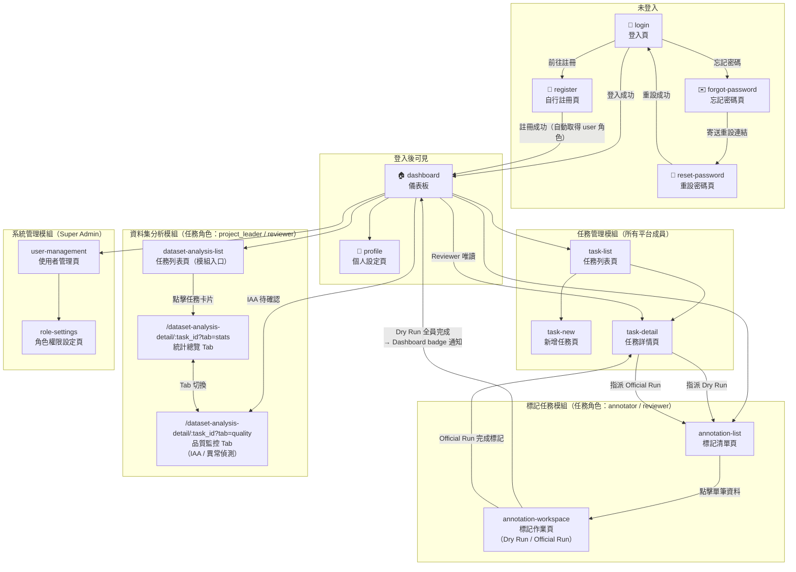
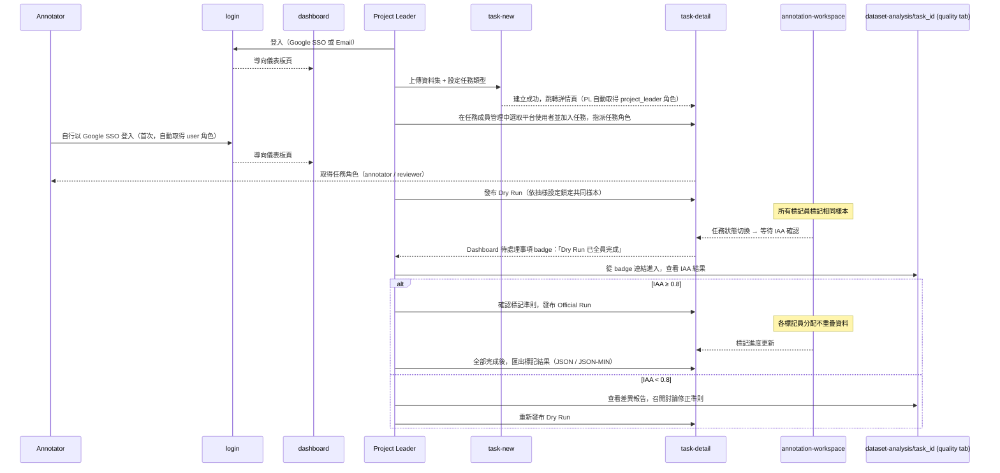
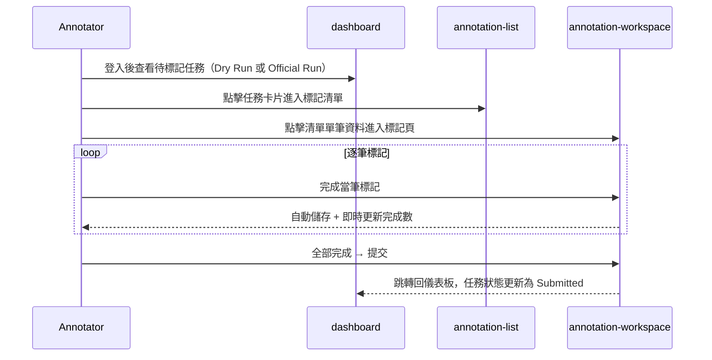
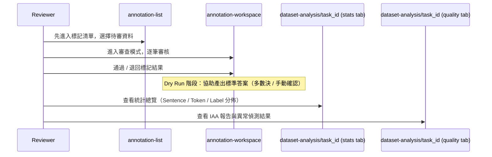
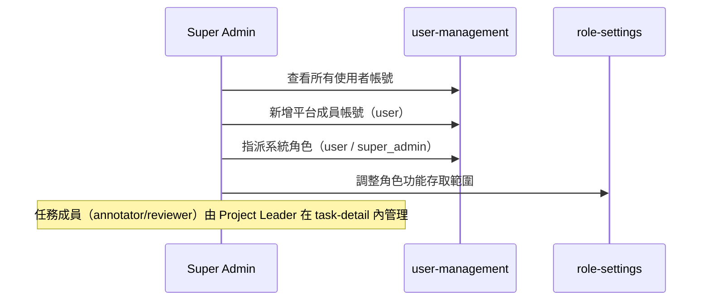

# Label Suite — 資訊架構

> **用途：** 作為 SDD 開發的參考基準。每份 `spec.md` 撰寫前，應先對照本文件確認頁面歸屬、使用者角色、進入條件與導覽關係。
>
> **基礎來源：** [`functional-map.md`](../functional-map/functional-map.md)
> **版本：** 1.3.2（2026-04-24）

---

## 1. 使用者角色

本系統採用**雙層角色模型**：系統角色（System Role）決定平台存取權；任務角色（Task Role）決定任務內的操作權限。

### 系統角色（System Role）— JWT 單值，平台層級

| 角色 | 識別碼 | 主要職責 | 指派方式 |
|------|--------|----------|----------|
| 平台成員 | `user` | 使用平台所有功能、建立任務、被邀請加入任務 | 自行註冊後自動取得 |
| 系統管理員 | `super_admin` | 平台維護、跨專案使用者管理、系統角色指派 | Super Admin 指派 |

> **新使用者預設狀態：** 任何人皆可透過 Google SSO 登入或 Email / Password 自行註冊（`/register`）進入系統，帳號建立後**立即取得 `user` 系統角色**，無需等待審核。

### 任務角色（Task Role）— `task_membership` 表，任務層級

| 任務角色 | 識別碼 | 職責 | 指派方式 |
|----------|--------|------|----------|
| 專案負責人 | `project_leader` | 管理任務設定、指派成員、發布 Dry Run / Official Run、匯出資料 | 建立任務時**自動指派**給任務建立者 |
| 審核員 | `reviewer` | 審查標記結果、協助產出標準答案、查看品質報告 | 由任務 `project_leader` 指派 |
| 標記員 | `annotator` | 執行標記作業（試標 / 正式標）、查看個人進度 | 由任務 `project_leader` 指派 |

> **Task Role 重點：** 同一使用者可在任務 A 擔任 `project_leader`，同時在任務 B 擔任 `annotator`。任務層級的授權透過查詢 `task_membership(task_id, user_id, task_role)` 表決定，不依賴 JWT 系統角色。系統角色不再有繼承關係。

---

## 2. 頁面清單與角色存取矩陣

| 頁面 ID | 頁面名稱 | 所屬模組 | user（系統）| super_admin | 任務角色限制 | 備註 |
|---------|----------|----------|:----------------:|:-----------:|-------------|------|
| `login` | 登入頁 | 帳號模組 | ✅ | ✅ | — | 未登入入口；含「前往註冊」連結 |
| `register` | 自行註冊頁 | 帳號模組 | ✅ | ✅ | — | 未登入可進入；填寫名稱、Email、密碼，建立後立即取得 `user` 系統角色 |
| `forgot-password` | 忘記密碼頁 | 帳號模組 | ✅ | ✅ | — | 未登入可進入；填寫 Email，系統寄送重設連結（Resend）|
| `reset-password` | 重設密碼頁 | 帳號模組 | ✅ | ✅ | — | 未登入可進入；prototype 預設 `valid` 並可切換 `expired/used` 狀態，錯誤時引導回 `forgot-password` |
| `profile` | 個人設定頁 | 帳號模組 | ✅ | ✅ | — | |
| `dashboard` | 儀表板 | — | ✅ | ✅ | — | 內容依任務角色動態調整 |
| `task-list` | 任務列表頁 | 任務管理模組 | ✅ | ✅ | — | `user` 僅顯示自己有成員資格的任務；`super_admin` 預設顯示全平台任務；每列含「操作」欄（編輯 / 刪除） |
| `task-new` | 新增任務頁 | 任務管理模組 | ✅ | ✅ | — | 建立後自動成為任務 `project_leader` |
| `task-detail` | 任務詳情頁 | 任務管理模組 | ✅ | ✅ | `project_leader` 或 `reviewer`（任務） | 含「任務概覽」、「成員管理」、「標記進度」、「工時紀錄」四個 tab，預設停留在「任務概覽」tab；`annotator` 不得進入，只能從 dashboard 進入 `annotation-list` |
| `annotation-list` | 標記清單頁 | 標記任務模組 | ✅ | ✅ | `annotator` 或 `reviewer`（任務） | 標記模組入口頁；顯示可執行任務與資料筆次清單，點擊單筆後進入 `annotation-workspace` |
| `annotation-workspace` | 標記作業頁 | 標記任務模組 | ✅ | ✅ | `annotator` 或 `reviewer`（任務）| 單筆標記工作區；模式依任務角色切換 |
| `dataset-analysis-list` | 資料集分析任務列表頁（模組入口） | 資料集分析模組 | ✅ | ✅ | `project_leader` 或 `reviewer`（任務） | 模組 L1 入口；`annotator` 導回 `dashboard` |
| `/dataset-analysis-detail/:task_id` | 任務分析詳情頁（統計總覽 / 品質監控雙 Tab） | 資料集分析模組 | ✅ | ✅ | `project_leader` 或 `reviewer`（任務） | Tab 由 `?tab=stats`/`?tab=quality` 標示；task_id 無效導回 `dataset-analysis-list` |
| `user-management` | 使用者管理頁 | 系統管理模組 | ❌ | ✅ | — | 平台級系統角色管理；含「使用者管理」與「角色設定」兩個 tab，預設停留在「使用者管理」tab |
| `role-settings` | 角色權限設定頁（`user-management` 內 tab） | 系統管理模組 | ❌ | ✅ | — | 不獨立為路由；透過 `user-management` 頁內 tab 切換進入 |

---

## 2.1 Sidebar Navbar（跨模組共用）

> 本節定義「登入後」全站共用的側欄導覽 IA。未登入頁（`login` / `register` / `forgot-password` / `reset-password`）不使用 Sidebar，僅保留品牌列與語言切換。

### A. 導覽層級模型

| 層級 | 說明 | 例子 |
|------|------|------|
| L0 | 全域主導覽（Sidebar Navbar） | 儀表板、任務管理、標記作業、資料集分析、系統管理、個人設定 |
| L1 | 模組入口頁（Landing） | `task-list`、`annotation-list`、`dataset-analysis-list`、`user-management` |
| L2 | 模組內次層頁（Contextual Navigation） | `task-new` / `task-detail`（含 4 個 tab）、`annotation-workspace`、`/dataset-analysis-detail/:task_id`（含雙 Tab） |

### B. L0 主導覽群組（Sidebar）

| 群組 | 導覽項 | 目標頁 | 所屬模組 |
|------|--------|--------|----------|
| Core | 儀表板 | `dashboard` | dashboard |
| Work | 任務管理 | `task-list` | task-management |
| Work | 標記作業 | `annotation-list` | annotation |
| Work | 資料集分析 | `dataset-analysis-list` | dataset |
| Admin | 系統管理 | `user-management` | admin |
| Account | 個人設定 | `profile` | account |

> `annotation-list`、`annotation-workspace`、`/dataset-analysis-detail/:task_id`、`task-detail` 皆屬「任務上下文頁」，進入時若缺少任務上下文（task_id / membership）需導回對應 Landing（通常為 `task-list`、`/dataset-analysis` 或 `dashboard`）。

### C. 角色可見性矩陣（L0）

| 導覽項 | user（系統） | super_admin | 任務角色 gating 規則 |
|--------|:-------------:|:-----------:|----------------------|
| 儀表板（`dashboard`） | ✅ | ✅ | 無 |
| 任務管理（`task-list`） | ✅ | ✅ | 無 |
| 標記作業（`annotation-list`） | ✅ | ✅ | 需為當前任務 `annotator` 或 `reviewer`，否則導回 `dashboard` |
| 資料集分析（`/dataset-analysis`） | ✅ | ✅ | 需為當前任務 `project_leader` 或 `reviewer`，否則導回 `dashboard` |
| 系統管理（`user-management`） | ❌ | ✅ | 僅 `super_admin` 可見 |
| 個人設定（`profile`） | ✅ | ✅ | 無 |

### D. Active 狀態規則（L0 與 L2）

| 目前頁面 | L0 Active 項 | L2 / 頁內次導覽規則 |
|----------|-------------|----------------------|
| `dashboard` | 儀表板 | 依角色顯示對應區塊（User / PL / Annotator / Reviewer / Super Admin） |
| `profile` | 個人設定 | 個人資料 / 密碼設定 / 角色資訊（頁內錨點） |
| `task-list` | 任務管理 | 任務列表篩選（狀態 / 搜尋） |
| `task-new` | 任務管理 | Step 1 / Step 2 / Step 3 精靈導覽 |
| `task-detail` | 任務管理 | 任務概覽 tab（預設）/ 成員管理 tab / 標記進度 tab / 工時紀錄 tab |
| `annotation-list` | 標記作業 | 標記任務清單（篩選 / 搜尋 / 完成狀態） |
| `annotation-workspace` | 標記作業 | 單筆作業操作區（Annotator / Reviewer 模式切換） |
| `dataset-analysis-list` | 資料集分析 | 任務列表（依角色篩選） |
| `/dataset-analysis-detail/:task_id?tab=stats` | 資料集分析 | 共用指標 + task_type 特定指標 |
| `/dataset-analysis-detail/:task_id?tab=quality` | 資料集分析 | IAA / 異常偵測 / 速度統計 |
| `user-management` | 系統管理 | 使用者管理 tab（預設）/ 角色設定 tab |

### E. Desktop / Mobile 導覽 IA

| 規格 | Desktop（`> MOBILE_BP`） | Mobile（`<= MOBILE_BP`） |
|------|---------------------------|---------------------------|
| 導覽型態 | 左側固定 Sidebar | 上方品牌列 + 下方橫向主導覽 |
| 可見資訊 | Logo、語言切換、L0 項目、使用者資訊、登出 | Logo、語言切換、使用者名稱、登出、L0 精簡主導覽 |
| Active 呈現 | 左側 item 高亮 + `aria-current` | 底部 item 高亮 + `aria-current` |
| 內容區避讓 | 內容區向右避讓 Sidebar 寬度 | 內容區需避讓頂部與底部導覽高度 |

### F. 模組導覽責任分工（資訊架構層）

| 模組 | L0 責任 | L2 / 內部導覽責任 |
|------|---------|--------------------|
| account | 提供 `profile` 入口與一致 user chip | profile 頁內分段（個人資料 / 密碼 / 角色） |
| dashboard | 提供全站入口與角色落地 | 角色視圖切換（由資料驅動，不新增 L0 項） |
| task-management | 任務主流程入口（`task-list`） | 新增任務精靈（L2 獨立頁）、任務詳情 tab 切換（任務概覽 / 成員管理 / 標記進度 / 工時紀錄） |
| annotation | 標記/審查入口（需任務上下文） | `annotation-list` 清單導向與 `annotation-workspace` 單筆作業提交路徑 |
| dataset | 分析模組入口（`/dataset-analysis` 任務列表） | `?tab=stats` ↔ `?tab=quality` 雙 Tab 頁內切換（`/dataset-analysis-detail/:task_id`） |
| admin | 平台管理入口（僅 super_admin） | 使用者管理 ↔ 角色權限設定 |

### G. 一致性原則（Navbar IA Contract）

- 同一語系下，`dashboard` 與 `profile` 的 Sidebar Navbar 結構、順序、命名與互動位置必須一致。
- 新增模組時僅能擴充 L0 導覽項，不得覆寫既有項目的語意。
- 任務上下文頁可作為 L0 功能入口，但必須先執行 task context resolve；缺少 task_id / membership 時，導回該模組 Landing（通常為 `task-list` 或 `dashboard`）。
- 權限不足時採「可見但導回＋提示」或「直接隱藏」策略，需在 spec 明確定義，不可混用。

---

## 3. 頁面導覽結構圖

---

## 4. 模組詳細說明

### 帳號模組

#### `login` 登入頁
- **進入方式：** 未登入時唯一可見頁面；所有未授權跳轉均導回此頁
- **功能：** Google SSO 入口、Email / Password 登入、「前往註冊」連結（→ `register`）
- **語言切換：** 導覽列語言按鈕採單一語言代碼顯示（`ZH` 或 `EN`），切換後即時更新文案與 `aria-label`
- **離開方式：** 登入成功 → `dashboard`

#### `register` 自行註冊頁
- **進入方式：** `login` → 「前往註冊」連結；未登入時可直接訪問
- **功能：** 填寫名稱、Email、密碼，建立 Email / Password 帳號；建立後自動取得 `user` 系統角色
- **語言切換：** 導覽列語言按鈕採單一語言代碼顯示（`ZH` 或 `EN`），切換後即時更新文案與 `aria-label`
- **離開方式：** 註冊成功 → `dashboard`；取消 → `login`

#### `forgot-password` 忘記密碼頁
- **進入方式：** `login` → 「忘記密碼」連結；未登入時可直接訪問
- **功能：** 填寫 Email 送出後顯示通用成功提示（不揭露 Email 是否存在）；prototype 以成功面板模擬寄信結果
- **語言切換：** 導覽列語言按鈕採單一語言代碼顯示（`ZH` 或 `EN`），切換後即時更新文案與 `aria-label`
- **離開方式：** 送出後停留並顯示「若 Email 存在，重設信已寄出」（不揭露 Email 是否存在）；「返回登入」→ `login`

#### `reset-password` 重設密碼頁
- **進入方式：** 正式流程由 Email 重設連結進入；prototype 可直接開啟頁面並透過狀態切換模擬 token 情境
- **功能：** 輸入並確認新密碼；prototype 支援 `valid / expired / used` 三種 token 狀態切換，用於驗證成功與錯誤路徑
- **語言切換：** 導覽列語言按鈕採單一語言代碼顯示（`ZH` 或 `EN`），切換後即時更新文案與 `aria-label`
- **離開方式：** 重設成功 → `login`；token 無效或已過期 → 顯示錯誤並提示重新申請 → `forgot-password`

#### `profile` 個人設定頁
- **進入方式：** Navbar 使用者頭像 → `profile`
- **功能：** 修改姓名、修改聯絡方式、修改密碼、查看角色
- **語言切換：** 導覽列語言按鈕採單一語言代碼顯示（`ZH` 或 `EN`），切換後即時更新文案與 `aria-label`
- **離開方式：** 儲存成功 → 停留；取消 → `dashboard`

---

### 儀表板

#### `dashboard` 儀表板
- **進入方式：** 登入後預設落地頁；Navbar Logo 點擊
- **離開方式：** 導覽列 → 各模組；卡片快捷入口 → 對應頁面

**角色分流邏輯（與 spec 012 一致）：**
- 先讀取 `system role`
  - `super_admin`：顯示 Super Admin Dashboard
  - `user`：再讀取 `task_membership` 判斷主視圖
    - 無任務關係：一般使用者 Dashboard
    - 有 `project_leader` 任務：Project Leader Dashboard
    - 有 `annotator` 任務：Annotator Dashboard
    - 有 `reviewer` 任務：Reviewer Dashboard
- 若 `role` 無效：導回 `/login`
- **備註：** 當 `user` 同時具多種 task role 時，依產品規則選擇單一主視圖呈現（不再採區塊拼接）

**一般使用者視角（`user` + 無任務關係）：**
- **歡迎區塊：** 歡迎文案 +「建立第一個任務」主 CTA
- **指標卡（4 張）：** 目前角色、我建立的任務、我被指派的任務、我被指派的審核
- **引導區塊：** 3 張角色轉換引導卡（Project Leader / Annotator / Reviewer）

**Project Leader 視角（任務角色：`project_leader`）：**
- **任務概況：** 總任務、進行中、等待 IAA 確認、速度異常
- **任務列表：** 任務名稱、摘要、Task Type / Run Type / Status badge、進度條、查看全部

**Annotator 視角（任務角色：`annotator`）：**
- **標記概況：** 待標記、今日完成、平均速度
- **任務列表：** 任務名稱、進度摘要、Task Type / Run Type / Status badge、進度條、快速繼續

**Reviewer 視角（任務角色：`reviewer`）：**
- **審核概況：** 待審總數、今日已審、IAA 摘要
- **任務列表：** 任務名稱、審查摘要、Task Type / Run Type / Status badge、進度條、快速審核

**Super Admin 視角（系統角色：`super_admin`）：**
- **平台使用者統計：** 總用戶、專案負責人、標記員、審核員
- **任務概況：** 總任務、進行中、等待 IAA 確認、速度異常
- **最近提醒：** 系統提醒清單
- **任務列表：** 任務名稱、摘要、Task Type / Run Type / Status badge、進度條、查看全部

**導覽與語言切換（RWD）：**
- `> MOBILE_BP`：左側側邊欄；語言切換按鈕位於品牌列（Logo + Label Suite）右側，顯示單一語言代碼（`ZH` 或 `EN`）
- `<= MOBILE_BP`：側邊欄轉底部橫向導覽；頂部品牌列保留語言切換、當前人員名稱與登出按鈕
- 語言切換需即時更新文案與可存取屬性（`aria-label` / `title`），不重新載入頁面

---

### 任務管理模組

#### `task-list` 任務列表頁
- **進入方式：** Navbar → 任務管理
- **功能：** 依角色顯示可見任務（含狀態 badge）、搜尋 / 篩選、進入任務詳情
  - `user`：僅可見自己有任務成員資格的任務
  - `super_admin`：預設顯示全平台任務
- **操作欄：** 每列提供 `編輯` / `刪除`
  - `編輯`：導向 `task-detail`（帶入 `task_id`）
  - `刪除`：執行軟刪除（soft delete），任務從預設列表隱藏，不做物理刪除
- **離開方式：** 點選任務或 `編輯` → `task-detail`；「新增任務」按鈕 → `task-new`

#### `task-new` 新增任務頁
- **進入方式：** `task-list` → 新增任務
- **流程：** 分三步驟完成（Step 1 → Step 2 → Step 3）
- **Step 1 — 基本資料：**
  - 填寫任務名稱
  - 上傳資料集（txt / csv / tsv / json）
  - 選擇任務類型（決定 Step 2 的 標記設定檔 內容）
- **Step 2 — 標記設定檔（介面輔助設定，無需手寫 config）：**
  - **架構原則：** `task_type` 由 registry / schema 驅動，不得寫死於前端流程；新增任務類型不得要求修改核心流程或路由
  - 提供「從範本開始」入口：常用任務類型的預設 config（如多標籤分類、VA 評分、醫療 NER、關係抽取），可直接套用後微調，降低設定門檻
  - **Visual 模式（預設）：**
    - **單句分類型（示例）：** 新增 / 編輯標籤清單（Label Name + 說明），支援多標籤 / 單標籤切換（對應 MultiLabel 實務）
    - **單句評分 / 回歸型（示例）：** 設定分數範圍（最小值 / 最大值）、刻度單位、介面顯示方式（滑桿 / 數字輸入 / 選項按鈕）（對應 VA 實務）
    - **序列標記型（示例）：** 新增 / 編輯實體類型清單（Entity Name + 顏色 + 說明），支援 Aspect 抽取 / NER 類情境
    - **關係抽取型（示例）：** 設定實體類型清單（同 NER）+ 關係類型清單（Relation Name + 說明），標記介面呈現 Entity List / Relation Type / Triple List 三區（可擴充至五元組流程）
    - **句對型（示例，非當前研究主力）：** 選擇關係類型（相似度 / 蘊含 / 自訂），設定評分或分類標籤
  - **Code 模式（進階）：** 直接檢視 / 編輯系統產生的 YAML/JSON config 原始碼，供技術人員驗證或手動調整；Visual 與 Code 模式可互相切換
- **Step 3 — 標記說明（選填）：**
  - 上傳標記範本 / 說明文件（PDF / 圖片 / 文字），顯示於 `annotation-workspace` 的「說明與範例」區
  - 可設定「開始標記前強制顯示」：Annotator 每次進入任務時先跳出說明 modal，確認後才進入標記介面
- **任務類型（`task_type`）：**
  - 由 `task_type` registry 決定可選型別與對應 config schema
  - **研究情境必備預設（第一層）：** 單句分類（含多標籤）、單句評分 / 回歸、序列標記（含 Aspect 抽取）、關係抽取（含 Triple / 可擴充五元組）
  - **延伸預設（第二層）：** 句對任務（相似度 / 蘊含）
  - 新增任務類型時應透過 registry / schema 擴充，不修改核心流程（Step 1–3）、核心路由或權限框架
  - **研究生目前使用情境覆蓋檢核：**
    - MultiLabel 勾選分類 → 單句分類（已覆蓋）
    - VA 分數標記 → 單句評分 / 回歸（已覆蓋）
    - Aspect 抽取 / 校正 → 序列標記（已覆蓋）
    - Entity + Relation + Triple（五元組流程）→ 關係抽取（已覆蓋；五元組由 relation schema 擴充欄位承接）
- **空狀態：** 不適用（此頁為建立流程，永遠有內容）
- **任務建立完成：** 系統自動在 `task_membership` 建立一筆紀錄，任務建立者的任務角色設為 `project_leader`
- **離開方式：** 建立成功 → `task-detail`；取消 → `task-list`

#### `task-detail` 任務詳情頁（含 4 個 tab）

- **進入方式：** `task-list` 點選任務（僅任務 `project_leader` 或 `reviewer` 可進入）
- **Tab 結構：**
  - **任務概覽 tab（預設）：** 查看任務設定與任務類型、任務狀態、發布試標（Dry Run）/ 正式標記（Official Run）控制、標記進度總覽（各標記員完成數 / 速度）、匯出標記結果（JSON / JSON-MIN）
  - **成員管理 tab：** 檢視成員清單（含角色與狀態）、從平台 `user` 名單加入成員、指派 / 調整任務角色（`reviewer` / `annotator`）、移除或停用成員；僅該任務 `project_leader` 可編輯
  - **標記進度 tab：** 各標記員完成數、速度、Dry Run / Official Run 分階段進度
  - **工時紀錄 tab：** 工時與標記活動紀錄（日期、時長、完成筆數、平均速度）
    - `project_leader`：可依成員、日期區間、任務階段篩選
    - `reviewer`：僅可檢視自己資料，可依日期區間、任務階段篩選
- **Tab 切換：** 頁內切換，不觸發路由跳轉
- **試標抽樣設定契約（任務概覽）：**
  - Dry Run 抽樣由任務概覽設定決定（`固定百分比` 或 `固定筆數`），不得在 annotation-workspace 端重算
  - 抽樣設定變更後需即時反映「總筆數 / 試標使用量 / 正式標記預留量」
  - `重算抽樣` 僅允許在 `草稿` 狀態；進入 Dry Run 後若需重切分，必須建立新的 run 批次
  - 發布 Dry Run 時需凍結 sample snapshot（不可變 `sample_snapshot_id`），後續以同一快照作為 Dry/Official 切分依據
- **任務狀態轉換：**
  - `草稿` → `Dry Run 進行中` → `等待 IAA 確認` → `Official Run 進行中` → `已完成`
  - **Dry Run 完成通知：** 所有標記員完成後自動切換至「等待 IAA 確認」，並在 Dashboard 待處理事項區新增 badge 提醒任務 `project_leader`
- **角色可見性：**
  - `project_leader`：四個 tab 均可存取，成員管理 tab 可編輯
  - `reviewer`：任務概覽（唯讀）/ 標記進度 / 工時紀錄（僅自己）可見；成員管理 tab 操作按鈕隱藏
  - `annotator`：不可進入任務詳情，僅能從 dashboard 進入 `annotation-list`，再點選單筆進入 `annotation-workspace`
- **限制：** `project_leader` 僅能管理自己所屬任務的成員，不得跨任務異動；成員角色為任務層級，不影響系統角色
- **資料隔離原則：**
  - 預設啟用資料隔離（Dry Run / Official Run）
  - 啟用時 Dry Run 資料與 Official Run 資料不得混入正式標記集
  - 若關閉資料隔離，發布前需二次風險確認並留下審計紀錄（操作者 / 時間 / 設定值）
- **離開方式：** 返回 → `task-list`；匯出為頁面內操作（Toast 提示下載），不觸發頁面跳轉

---

### 標記任務模組

#### `annotation-list` 標記清單頁
- **定位：** 標記模組入口頁；先完成「任務 / 資料筆次選擇」，再進入單筆作業頁
- **進入方式（Annotator）：** `dashboard` 任務卡片「開始 / 繼續標記」按鈕；Navbar → 標記作業
- **進入方式（Reviewer）：** `dashboard` 待審查任務列表中的任務卡；Navbar → 標記作業
- **主要內容：**
  - 任務切換與 run_type 切換（Dry Run / Official Run）
  - 可標記資料清單（ID、完成時間、狀態、指派者/標記者、文本摘要）
  - 篩選 / 排序 / 搜尋（完成狀態、關鍵字、更新時間）
- **互動規則：**
  - 點擊清單任一筆資料後，導向 `annotation-workspace` 並帶入 `task_id` + `sample_id` + `run_type`
  - 回到清單時保留上次篩選與捲動位置，避免中斷連續標記
  - 若該筆資料已被鎖定（他人正在編輯）需顯示狀態提示，並提供「唯讀檢視 / 稍後再試」
- **離開方式：** 點擊單筆 → `annotation-workspace`；返回 `dashboard`

#### `annotation-workspace` 標記作業頁
- **進入方式（Annotator / Reviewer）：** 由 `annotation-list` 點擊單筆資料進入
- **兩種模式（run_type）：**
  - **Dry Run（試標）：** 所有標記員標記相同樣本，結果不計入正式資料，用於計算 IAA 與討論標記準則
  - **Official Run（正式標記）：** 每位標記員分配不重疊的資料，結果計入正式資料集
- **樣本來源契約：** annotation-workspace 僅可讀取 task-detail 發布時鎖定的 sample snapshot（`sample_snapshot_id`）；不得在 workspace 端重新抽樣或覆寫 Dry/Official 切分
- **介面骨架（Desktop，`> MOBILE_BP`）：**
  - **上方任務目標列（固定顯示）：** 左側顯示任務目標與當前操作指引；右側顯示「已標記數量 / 本輪總量 / 階段（Dry Run / Official Run）」與小型進度視覺
  - **三欄工作區：**
    - 左欄：樣本清單與目前定位（可快速跳筆、顯示完成狀態）
    - 中欄：當前樣本內容與標記操作主區（不同 `task_type` 動態渲染控制項）
    - 右欄：`說明與檔案`（預設頁）與 `History`（次頁）兩個 panel
- **說明與檔案常駐規則（本模組強制）：**
  - 每一筆標記頁都必須顯示任務說明摘要與說明檔案清單（不可僅在進入前 modal 顯示）
  - 切換到下一筆/上一筆時，右欄 `說明與檔案` 內容必須持續可見，不可因翻筆被收起或清空
  - 說明檔案至少支援快速預覽（圖片/Markdown）與新分頁開啟（PDF）
- **功能（Annotator）：** 標記操作區、說明與範例、進度指示器（即時顯示完成數）、儲存 / 提交
  - **標記說明強制顯示：** 若 Project Leader 在任務設定中啟用，Annotator 每次進入任務時先顯示一次說明 modal；進入後右欄仍持續顯示說明與檔案
- **功能（Reviewer）：** 審查模式，可通過 / 退回標記結果、直接修改或刪除錯誤標記、協助產出 Dry Run 標準答案（多數決或手動確認）
- **標記歷程（History）：** 每筆資料的所有標記修改紀錄（誰、何時、改成什麼），Reviewer 可追溯標記變更歷程
- **介面骨架（Mobile，`<= MOBILE_BP`）：**
  - 保留上方任務目標列（精簡版）與中欄主操作區
  - `說明與檔案` 改為底部抽屜（預設展開），每次切筆後維持可見；`History` 以分頁切換
- **離開方式：** 提交 → 停留（下一筆）或返回 `dashboard`；中途離開 → 自動儲存草稿

---

### 資料集分析模組

> 本模組依任務類型動態調整顯示內容。使用者進入模組後先選取任務，再於雙 Tab 介面查看統計總覽與品質監控。所有分析視角均以當前任務的 `task_type` 作為切換依據。

#### `dataset-analysis-list` 任務列表頁（模組入口）

- **進入方式：** Navbar → 資料集分析
- **顯示：** 列出使用者具 `project_leader` 或 `reviewer` 角色的所有任務（含任務名稱、任務類型、完成率、IAA 狀態徽章）
- **空狀態（無任務）：** 說明文字「尚無可分析的任務」
- **離開方式：** 點擊任務卡片 → `/dataset-analysis-detail/:task_id`（預設進入統計總覽 tab）

#### `/dataset-analysis-detail/:task_id` 任務分析詳情頁（雙 Tab）

- **進入方式：** 任務列表點入任務（預設統計總覽 tab）；Dashboard 待處理事項區「IAA 待確認」連結（直接進入品質監控 tab，`?tab=quality`）
- **Tab 切換：** 頁內切換，不觸發路由跳轉；`?tab=stats`（預設）/ `?tab=quality` 標示 active tab，供 deep link 使用
- **Tab 結構：**
  - **統計總覽 tab（`?tab=stats`，預設）：**
    - 共用指標（所有任務）：Sentence 數量、Token 數量、整體完成率
    - 任務類型特定指標：
      - **single_sentence_classification 單句分類（含多標籤）：** 各標籤次數 / 比例長條圖、多標籤共現矩陣（co-occurrence matrix）
      - **single_sentence_va_scoring 單句 VA 雙維度評分（Valence / Arousal）：** Valence / Arousal 分佈直方圖、平均值 / 標準差 / 中位數、二維分佈（V–A scatter plot）
      - **sequence_labeling 序列標記（含 Aspect / NER）：** 實體類型分佈、每句平均實體數、Entity span 長度分佈
      - **relation_extraction 關係抽取（Entity + Relation + Triple）：** 實體類型分佈、關係類型分佈、Triple 數量統計
      - **sentence_pairs 句對任務（相似度 / 蘊含）：** 分類型 → 標籤分佈；評分型 → 分數分佈
    - 空狀態（尚無標記資料）：說明文字「尚無標記資料，請先發布 Dry Run」與「前往任務詳情」次要按鈕（→ `task-detail`）
  - **品質監控 tab（`?tab=quality`）：**
    - IAA 計算方法（依任務類型）：
      - **single_sentence_classification：** 主要指標 Krippendorff’s Alpha（nominal）⭐️；替代 Cohen’s Kappa / Fleiss’ Kappa；多標籤 label-wise α → macro average；目標 ≥ 0.8
      - **single_sentence_va_scoring：** 主要指標 ICC ⭐️；輔助 Krippendorff’s Alpha（interval）/ Pearson / Spearman；分別計算 IAA_V / IAA_A，Overall = (IAA_V + IAA_A) / 2；目標 ≥ 0.75（建議）/ ≥ 0.8（嚴格）
      - **sequence_labeling：** 主要指標 Pairwise Entity-level F1 ⭐️；strict match（預設）/ partial overlap match（進階）；目標 ≥ 0.8（strict）/ ≥ 0.7（較寬鬆）
      - **relation_extraction：** 主要指標 Pairwise Triple-level F1 ⭐️（subject + relation + object 完全一致）；輔助 entity-level F1 / relation-only agreement；目標 ≥ 0.75（合理）/ ≥ 0.8（高品質）
      - **sentence_pairs（分類型）：** 主要指標 Krippendorff’s Alpha（nominal）⭐️；替代 Fleiss’ Kappa；目標 ≥ 0.8
    - 共用品質監控功能（所有任務）：異常偵測（標記速度異常、離群標記值）、標記員分析（個別速度、個別 IAA vs 群體平均）
    - 空狀態（Dry Run 尚未完成）：說明文字「IAA 報告將在 Dry Run 完成後產生」與「前往任務詳情」次要按鈕（→ `task-detail`）
- **離開方式：** 麵包屑返回任務列表；空狀態按鈕跳轉至 `task-detail`；無任務成員資格時導回 `dashboard`

---

### 系統管理模組

> 本模組僅 `super_admin` 可存取。`project_leader` 的任務成員異動在 `task-detail` 的「任務成員管理」內進行。

#### `user-management` 使用者管理頁（含角色設定 tab）

- **進入方式：** Navbar → 系統管理；預設停留於「使用者管理」tab
- **Tab 結構：**
  - **使用者管理 tab（預設）：** 查看所有平台使用者（跨專案）、新增 / 編輯 / 停用帳號、指派**系統**角色（`user` / `super_admin`）；`project_leader` / `reviewer` / `annotator` 為任務角色，於 `task-detail` 管理，不在此頁指派
  - **角色設定 tab：** 檢視並維護角色權限矩陣；系統角色為 `user` / `super_admin`，任務角色為 `project_leader` / `reviewer` / `annotator`
- **Tab 切換：** 頁內切換，不觸發路由跳轉
- **離開方式：** Navbar 導覽至其他模組

---

## 5. 核心使用者旅程

### 旅程 A — 完整專案生命週期（Project Leader 視角）

### 旅程 B — 標記員完成標記作業

### 旅程 C — 審核員審查並查看品質報告

> 審核員（`reviewer`）是任務角色（task role），透過 `task_membership` 表在任務層級指派，與系統角色（system role）無關、無繼承關係。同一使用者可在同一任務同時被指派為 `project_leader` 與 `reviewer`，但這是兩筆獨立的 `task_membership` 記錄，而非角色繼承。

### 旅程 D — Super Admin 使用者管理

---

## 6. 與 SDD 的對應關係

每次執行 `/speckit.specify` 前，對照以下欄位確認範圍：

| SDD 問題 | 本文件對應位置 |
|----------|----------------|
| 這個 spec 屬於哪個模組？ | § 4 模組詳細說明 |
| 哪些角色會用到這個功能？ | § 2 頁面清單與角色存取矩陣 |
| 這個頁面從哪裡進入？ | § 4 各頁面「進入方式」 |
| 完成後去哪裡？ | § 4 各頁面「離開方式」 |
| 這個功能跑完整 user journey 是什麼？ | § 5 核心使用者旅程 |
| 有沒有跨模組的資料依賴？ | § 3 頁面導覽結構圖 |

---

## 7. Spec 清單

### 拆分原則

| 原則 | 說明 |
|------|------|
| **獨立可測試** | 該 spec 完成後能獨立驗收，不依賴其他 spec |
| **同一操作流程** | 多個頁面屬於同一個連續操作（如精靈步驟），合為一個 spec |
| **多角色整合** | 同一頁面不同角色視圖若共用大量邏輯，合為一個 spec，以角色分 User Story |

> **注意：** 此清單為實際建立的 spec 檔案清單，以 `specs/STATUS.md` 為真值。  
> 各 spec 的詳細開發狀態（branch、進行中、已完成）請查 `specs/STATUS.md`。

**開發批次：**

- **P1 — 基礎建設**（001–007 + 012 + Shared）：帳號系統、角色管理、共用導覽、儀表板，所有功能的前提
- **P2 — 核心功能**（010 + 013–017）：任務建立到標記完整流程、資料集分析

### Spec 清單

#### shared

| # | Spec 名稱 | 頁面 / 範圍 | 模組 | 複雜度 | 批次 | 狀態 |
| --- | ----------- | ------------ | ------ | -------- | ------ | ------ |
| 008 | Sidebar Navbar 共用規格 | 所有登入後頁面（shared layout） | shared | ★★☆☆☆ | P1 | 🔄 進行中 |

#### account

| # | Spec 名稱 | 頁面 / 範圍 | 模組 | 複雜度 | 批次 | 狀態 |
| --- | ----------- | ------------ | ------ | -------- | ------ | ------ |
| 001 | 登入 — Email/Password + 頁面 UI | `login` | account | ★☆☆☆☆ | P1 | 🔄 進行中 |
| 002 | 登入 — Google SSO 整合 | `login` | account | ★★☆☆☆ | P1 | 🔄 進行中 |
| 003 | 自行註冊（Email/Password） | `register` | account | ★☆☆☆☆ | P1 | 🔄 進行中 |
| 004 | 忘記密碼 / 重設密碼（Resend） | `forgot-password` · `reset-password` | account | ★★☆☆☆ | P1 | 🔄 進行中 |
| 005 | 個人設定（資料編輯 + 修改密碼） | `profile` | account | ★☆☆☆☆ | P1 | ⬜ 待做 |

#### dashboard

| # | Spec 名稱 | 頁面 / 範圍 | 模組 | 複雜度 | 批次 | 狀態 |
| --- | ----------- | ------------ | ------ | -------- | ------ | ------ |
| 012 | 儀表板（全角色：User / PL / Annotator / Reviewer / Super Admin） | `dashboard` | dashboard | ★★★☆☆ | P1 | 🔄 進行中 |

#### task-management

| # | Spec 名稱 | 頁面 / 範圍 | 模組 | 複雜度 | 批次 | 狀態 |
| --- | ----------- | ------------ | ------ | -------- | ------ | ------ |
| 010 | 任務列表（搜尋、篩選、空狀態） | `task-list` | task-management | ★★☆☆☆ | P2 | ⬜ 待做 |
| 013 | 新增任務（Step 1–3 + 標記設定檔 全任務類型） | `task-new` | task-management | ★★★★☆ | P2 | ⬜ 待做 |
| 014 | 任務詳情（成員管理 / 可加入成員名單 / Dry Run / Official Run / 工時紀錄 / 匯出） | `task-detail` | task-management | ★★★★☆ | P2 | ⬜ 待做 |

#### annotation

| # | Spec 名稱 | 頁面 / 範圍 | 模組 | 複雜度 | 批次 | 狀態 |
| --- | ----------- | ------------ | ------ | -------- | ------ | ------ |
| 015 | 標記清單＋標記作業（Annotator / Reviewer 模式，全任務類型） | `annotation-list` + `annotation-workspace` | annotation | ★★★★☆ | P2 | ⬜ 待做 |

#### dataset

| # | Spec 名稱 | 頁面 / 範圍 | 模組 | 複雜度 | 批次 | 狀態 |
| --- | ----------- | ------------ | ------ | -------- | ------ | ------ |
| 016 | 資料集分析列表 + 統計總覽（任務列表入口 + 共用指標 + 任務類型特定） | `dataset-analysis-list` + `/dataset-analysis-detail/:task_id?tab=stats` | dataset | ★★★★☆ | P2 | ⬜ 待做 |
| 017 | 品質監控（IAA / 異常偵測 / 速度統計，全任務類型） | `/dataset-analysis-detail/:task_id?tab=quality` | dataset | ★★★★☆ | P2 | ⬜ 待做 |

#### admin

| # | Spec 名稱 | 頁面 / 範圍 | 模組 | 複雜度 | 批次 | 狀態 |
| --- | ----------- | ------------ | ------ | -------- | ------ | ------ |
| 006 | 使用者列表與管理 | `user-management` | admin | ★★☆☆☆ | P1 | ⬜ 待做 |
| 007 | 角色權限設定 | `role-settings` | admin | ★★☆☆☆ | P1 | ⬜ 待做 |

> 狀態標示：⬜ 待做 · 🔄 進行中 · ✅ 完成　　批次：P1 基礎建設 · P2 核心功能

---

## 8. Changelog

| 版本 | 日期 | 變更摘要 |
|------|------|---------|
| 1.3.2 | 2026-04-24 | 資料集分析模組改採任務列表入口（`dataset-analysis-list`）+ 雙 Tab 詳情頁架構（`/dataset-analysis-detail/:task_id`）；同步更新 §2 頁面矩陣、§2.1 各節（Sidebar 目標頁、角色矩陣、Active 規則、層級模型、模組分工）、§3 流程圖、§5 旅程 A/C、§7 Spec 清單 |
| 1.3.1 | 2026-04-23 | 標記模組 IA 調整為「先 `annotation-list` 清單頁，再進入 `annotation-workspace` 單筆作業頁」；同步更新導覽層級、流程圖、旅程與 spec 範圍 |
| 1.3.0 | 2026-04-22 | `task-list` 補充每列「操作」欄位（`編輯` / `刪除`）；`編輯` 導向 `task-detail`，`刪除` 定義為軟刪除（soft delete）並自預設列表隱藏 |
| 1.2.0 | 2026-04-20 | IA 結構與頁面導覽整理（角色存取矩陣、模組詳述、核心旅程與 spec 清單） |
