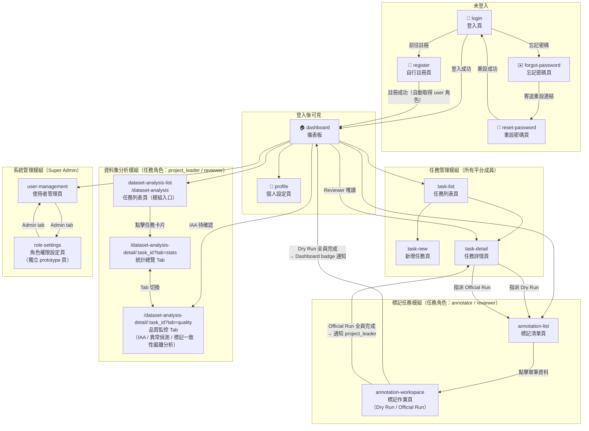
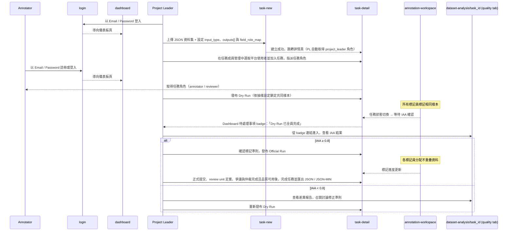
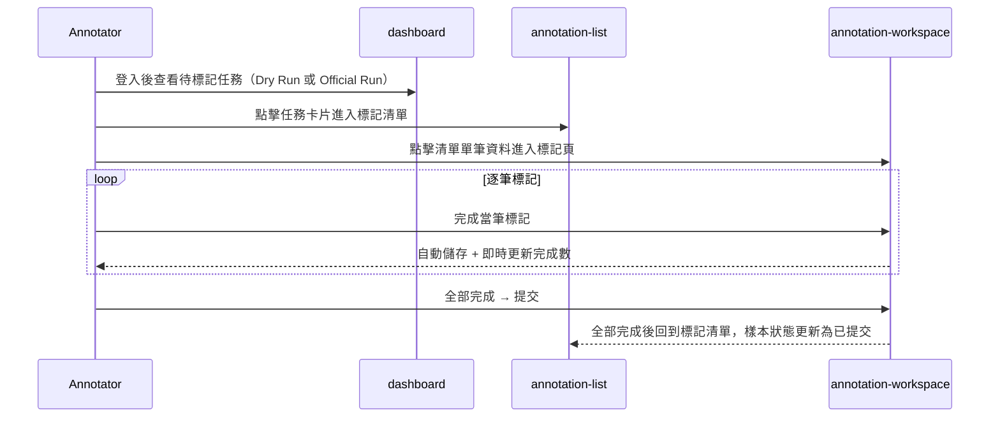
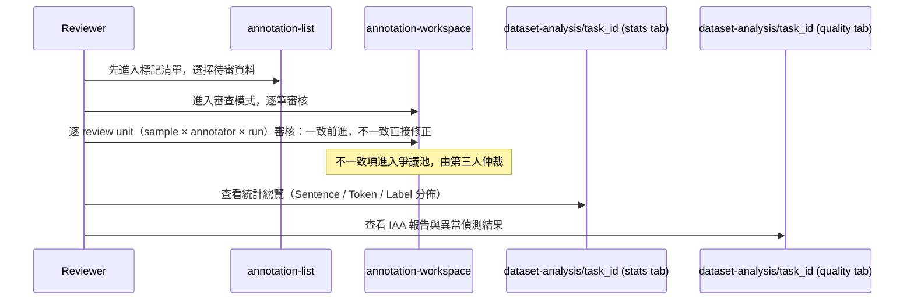
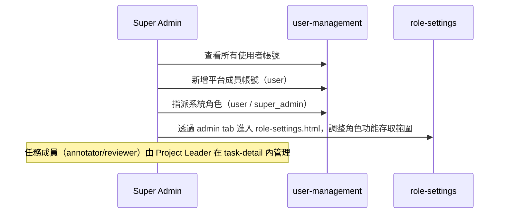

# Label Suite — 資訊架構

> **用途：** 作為 SDD 開發的參考基準。每份 `spec.md` 撰寫前，應先對照本文件確認頁面歸屬、使用者角色、進入條件與導覽關係。
>
> **正典來源：** [`specs/STATUS.md`](../../../specs/STATUS.md) 與 active feature specs；[`functional-map.md`](../functional-map/functional-map.md) 僅為非權威視覺索引
> **版本：** 1.6.0（2026-08-19）

---

## 1. 使用者角色

本系統採用**雙層角色模型**：系統角色（System Role）決定平台存取權；任務角色（Task Role）決定任務內的操作權限。

### 系統角色（System Role）— JWT 單值，平台層級

| 角色 | 識別碼 | 主要職責 | 指派方式 |
|------|--------|----------|----------|
| 平台成員 | `user` | 使用平台所有功能、建立任務、被邀請加入任務 | 自行註冊後自動取得 |
| 系統管理員 | `super_admin` | 平台維護、跨專案使用者管理、系統角色指派 | Super Admin 指派 |

> **Account prototype 邊界：** 本節帳號流程描述 prototype 合約；Email / Password 自行註冊（`/register`）後取得 `user` 系統角色，Google SSO 僅為可操作入口與未來整合預留，點擊為 no-op，不代表 OAuth 已可登入。

### 任務角色（Task Role）— `task_membership` 表，任務層級

| 任務角色 | 識別碼 | 職責 | 指派方式 |
|----------|--------|------|----------|
| 專案負責人 | `project_leader` | 管理任務設定、指派成員、發布 Dry Run / Official Run、匯出資料 | 建立任務時**自動指派**給任務建立者 |
| 審核員 | `reviewer` | 逐標記員審核標記結果、不一致時直接修正標籤、查看品質報告 | 由任務 `project_leader` 指派 |
| 標記員 | `annotator` | 執行標記作業（試標 / 正式標）、查看個人進度 | 由任務 `project_leader` 指派 |

> **Task Role 重點：** 同一使用者可在任務 A 擔任 `project_leader`，同時在任務 B 擔任 `annotator`。任務層級的授權透過查詢 `task_membership(task_id, user_id, task_role)` 表決定，不依賴 JWT 系統角色。系統角色不再有繼承關係。

---

## 2. 頁面清單與角色存取矩陣

| 頁面 ID | 頁面名稱 | 所屬模組 | user（系統）| super_admin | 任務角色限制 | 備註 |
|---------|----------|----------|:----------------:|:-----------:|-------------|------|
| `login` | 登入頁 | 帳號模組 | ✅ | ✅ | — | 未登入入口；含「前往註冊」連結 |
| `register` | 自行註冊頁 | 帳號模組 | ✅ | ✅ | — | 未登入可進入；填寫名稱、Email、密碼，建立後立即取得 `user` 系統角色 |
| `forgot-password` | 忘記密碼頁 | 帳號模組 | ✅ | ✅ | — | 未登入可進入；填寫 Email，系統寄送重設連結（Resend）|
| `reset-password` | 重設密碼頁 | 帳號模組 | ✅ | ✅ | — | 未登入可進入；prototype 預設 `valid` 並可切換 `expired/used` 狀態，錯誤時引導回 `forgot-password` |
| `profile` | 個人設定頁 | 帳號模組 | ✅ | ✅ | — | 個人資料、偏好設定、密碼設定、通知設定；Email 變更為同頁狀態切換 |
| `dashboard` | 儀表板 | — | ✅ | ✅ | — | 內容依任務角色動態調整 |
| `task-list` | 任務列表頁 | 任務管理模組 | ✅ | ✅ | — | `user` 僅顯示自己有成員資格的任務；`super_admin` 預設顯示全平台任務；每列含「操作」欄（編輯 / 刪除） |
| `task-new` | 新增任務頁 | 任務管理模組 | ✅ | ✅ | — | 四步驟建立流程；建立後自動成為任務 `project_leader` |
| `task-detail` | 任務詳情頁 | 任務管理模組 | ✅ | ✅ | `project_leader` 或 `reviewer`（任務） | 含「任務概覽」、「標記結果」、「標記進度」、「工時紀錄」、「成員管理」五個 tab，預設停留在「任務概覽」tab；`annotator` 不得進入，只能從 dashboard 進入 `annotation-list` |
| `annotation-list` | 標記清單頁 | 標記任務模組 | ✅ | ✅ | `annotator` 或 `reviewer`（任務） | 標記模組入口頁；顯示可執行任務與資料筆次清單，點擊單筆後進入 `annotation-workspace` |
| `annotation-workspace` | 標記作業頁 | 標記任務模組 | ✅ | ✅ | `annotator` 或 `reviewer`（任務）| 單筆標記工作區；模式依任務角色切換 |
| `dataset-analysis-list` (`/dataset-analysis`) | 資料集分析任務列表頁（模組入口） | 資料集分析模組 | ✅ | ✅ | — | 僅列出具 `project_leader` 或 `reviewer` membership 的任務；僅具 `annotator` membership 時顯示空狀態 |
| `/dataset-analysis-detail/:task_id` | 任務分析詳情頁（統計總覽 / 品質監控雙 Tab） | 資料集分析模組 | ✅ | ✅ | `project_leader` 或 `reviewer`（任務） | Tab 由 `?tab=stats`/`?tab=quality` 標示；task_id 無效導回 `/dataset-analysis` |
| `user-management` | 使用者管理頁 | 系統管理模組 | ❌ | ✅ | — | 平台級系統角色管理；頁首 admin tabs 可導向 `role-settings` |
| `role-settings` | 角色權限設定頁 | 系統管理模組 | ❌ | ✅ | — | Prototype 為獨立頁 `role-settings.html`；與 `user-management` 透過 admin tabs 互相連結 |

---

## 2.1 Sidebar Navbar（跨模組共用）

> 本節定義「登入後」全站共用的側欄導覽 IA。未登入頁（`login` / `register` / `forgot-password` / `reset-password`）不使用 Sidebar，僅保留品牌列與語言切換。

### A. 導覽層級模型

| 層級 | 說明 | 例子 |
|------|------|------|
| L0 | 全域主導覽（Sidebar Navbar） | 儀表板、任務管理、標記作業、資料集分析、系統管理、個人設定 |
| L1 | 模組入口頁（Landing） | `task-list`、`annotation-list`、`dataset-analysis-list` (`/dataset-analysis`)、`user-management` |
| L2 | 模組內次層頁（Contextual Navigation） | `task-new`（4 steps）/ `task-detail`（含 5 個 tab）、`annotation-workspace`、`/dataset-analysis-detail/:task_id`（含雙 Tab）、`role-settings` |

### B. L0 主導覽群組（Sidebar）

| 群組 | 導覽項 | 目標頁 | 所屬模組 |
|------|--------|--------|----------|
| Core | 儀表板 | `dashboard` | dashboard |
| Work | 任務管理 | `task-list` | task-management |
| Work | 標記作業 | `annotation-list` | annotation |
| Work | 資料集分析 | `dataset-analysis-list` (`/dataset-analysis`) | dataset |
| Admin | 系統管理 | `user-management` | admin |
| Account | 個人設定 | `profile` | account |

> `annotation-list`、`annotation-workspace`、`/dataset-analysis-detail/:task_id`、`task-detail` 皆屬「任務上下文頁」，進入時若缺少任務上下文（task_id / membership）需導回對應 Landing（通常為 `task-list`、`/dataset-analysis` 或 `dashboard`）。

### C. 角色可見性矩陣（L0）

| 導覽項 | user（系統） | super_admin | 任務角色 gating 規則 |
|--------|:-------------:|:-----------:|----------------------|
| 儀表板（`dashboard`） | ✅ | ✅ | 無 |
| 任務管理（`task-list`） | ✅ | ✅ | 無 |
| 標記作業（`annotation-list`） | ✅ | ✅ | 需為當前任務 `annotator` 或 `reviewer`，否則導回 `dashboard` |
| 資料集分析（`/dataset-analysis`） | ✅ | ✅ | 列表僅顯示具 `project_leader` 或 `reviewer` membership 的任務；詳情頁無資格時導回列表 |
| 系統管理（`user-management`） | ❌ | ✅ | 僅 `super_admin` 可見 |
| 個人設定（`profile`） | ✅ | ✅ | 無 |

### D. Active 狀態規則（L0 與 L2）

| 目前頁面 | L0 Active 項 | L2 / 頁內次導覽規則 |
|----------|-------------|----------------------|
| `dashboard` | 儀表板 | 依角色顯示對應區塊（User / PL / Annotator / Reviewer / Super Admin） |
| `profile` | 個人設定 | 個人資料 / 偏好設定 / 密碼設定 / 通知設定；Email 變更為同頁狀態 |
| `task-list` | 任務管理 | 任務列表篩選（狀態 / 搜尋） |
| `task-new` | 任務管理 | Step 1 基本資料 / Step 2 標記設定檔 / Step 3 啟動設定 / Step 4 標記說明 |
| `task-detail` | 任務管理 | 任務概覽 tab（預設）/ 標記結果 tab / 標記進度 tab / 工時紀錄 tab / 成員管理 tab |
| `annotation-list` | 標記作業 | 標記任務清單（篩選 / 搜尋 / 完成狀態） |
| `annotation-workspace` | 標記作業 | 單筆作業操作區（Annotator / Reviewer 模式切換） |
| `dataset-analysis-list` (`/dataset-analysis`) | 資料集分析 | 任務列表（依角色篩選） |
| `/dataset-analysis-detail/:task_id?tab=stats` | 資料集分析 | 共用摘要 + `outputs[]` 逐型統計 |
| `/dataset-analysis-detail/:task_id?tab=quality` | 資料集分析 | IAA / 異常偵測 / 標記一致性偏離分析 / 速度統計 |
| `user-management` | 系統管理 | 使用者管理頁；admin tab 可導向 `role-settings` |
| `role-settings` | 系統管理 | 角色權限設定頁；admin tab 可返回 `user-management` |

### E. Desktop / Mobile 導覽 IA

| 規格 | Desktop（`> MOBILE_BP`） | Mobile（`<= MOBILE_BP`） |
|------|---------------------------|---------------------------|
| 導覽型態 | 左側固定 Sidebar | 上方品牌列 + 下方橫向主導覽 |
| 可見資訊 | Logo、語言切換、L0 項目、使用者資訊、登出 | Logo、語言切換、使用者名稱、登出、L0 精簡主導覽 |
| Active 呈現 | 左側 item 高亮 + `aria-current` | 底部 item 高亮 + `aria-current` |
| 內容區避讓 | 內容區向右避讓 Sidebar 寬度 | 內容區需避讓頂部與底部導覽高度 |

### F. 模組導覽責任分工（資訊架構層）

| 模組 | L0 責任 | L2 / 內部導覽責任 |
|------|---------|--------------------|
| account | 提供 `profile` 入口與一致 user chip | profile 頁內分段（個人資料 / 偏好設定 / 密碼設定 / 通知設定）與 Email 變更狀態 |
| dashboard | 提供全站入口與角色落地 | 角色視圖切換（由資料驅動，不新增 L0 項） |
| task-management | 任務主流程入口（`task-list`） | 新增任務四步驟精靈（L2 獨立頁）、任務詳情 tab 切換（任務概覽 / 標記結果 / 標記進度 / 工時紀錄 / 成員管理） |
| annotation | 標記/審查入口（需任務上下文） | `annotation-list` 清單導向與 `annotation-workspace` 單筆作業提交路徑 |
| dataset | 分析模組入口（`/dataset-analysis` 任務列表） | `?tab=stats` ↔ `?tab=quality` 雙 Tab 頁內切換（`/dataset-analysis-detail/:task_id`） |
| admin | 平台管理入口（僅 super_admin） | `user-management.html` ↔ `role-settings.html` 透過 admin tabs 切換 |

### G. 一致性原則（Navbar IA Contract）

- 同一語系下，`dashboard` 與 `profile` 的 Sidebar Navbar 結構、順序、命名與互動位置必須一致。
- 新增模組時僅能擴充 L0 導覽項，不得覆寫既有項目的語意。
- 任務上下文頁可作為 L0 功能入口，但必須先執行 task context resolve；缺少 task_id / membership 時，導回該模組 Landing（通常為 `task-list` 或 `dashboard`）。
- 權限不足時採「可見但導回＋提示」或「直接隱藏」策略，需在 spec 明確定義，不可混用。

---

## 3. 頁面導覽結構圖


```mermaid
flowchart TD
  subgraph 未登入
    LOGIN["🔐 login\n登入頁"]
    REGISTER["📝 register\n自行註冊頁"]
    FORGOT["✉️ forgot-password\n忘記密碼頁"]
    RESET["🔑 reset-password\n重設密碼頁"]
  end

  subgraph 登入後可見
    DASH["🏠 dashboard\n儀表板"]
    PROFILE["👤 profile\n個人設定頁"]
  end

  subgraph 任務管理模組["任務管理模組（所有平台成員）"]
    TLIST["task-list\n任務列表頁"]
    TNEW["task-new\n新增任務頁"]
    TDETAIL["task-detail\n任務詳情頁"]
  end

  subgraph 標記任務模組["標記任務模組（任務角色：annotator / reviewer）"]
    ALIST["annotation-list\n標記清單頁"]
    ANNOT["annotation-workspace\n標記作業頁\n（Dry Run / Official Run）"]
  end

  subgraph 資料集分析模組["資料集分析模組（任務角色：project_leader / reviewer）"]
    DA_LIST["dataset-analysis-list\n/dataset-analysis\n任務列表頁（模組入口）"]
    STATS["/dataset-analysis-detail/:task_id?tab=stats\n統計總覽 Tab"]
    QUALITY["/dataset-analysis-detail/:task_id?tab=quality\n品質監控 Tab\n（IAA / 異常偵測 / 標記一致性偏離分析）"]
  end

  subgraph 系統管理模組["系統管理模組（Super Admin）"]
    USERS["user-management\n使用者管理頁"]
    ROLES["role-settings\n角色權限設定頁\n（獨立 prototype 頁）"]
  end

  LOGIN -->|"登入成功"| DASH
  LOGIN -->|"前往註冊"| REGISTER
  LOGIN -->|"忘記密碼"| FORGOT
  FORGOT -->|"寄送重設連結"| RESET
  RESET -->|"重設成功"| LOGIN
  REGISTER -->|"註冊成功（自動取得 user 角色）"| DASH
  DASH --> PROFILE
  DASH --> TLIST
  DASH --> ALIST
  DASH --> DA_LIST
  DA_LIST -->|點擊任務卡片| STATS
  DASH -->|IAA 待確認| QUALITY
  DASH --> USERS

  TLIST --> TNEW
  TLIST --> TDETAIL
  DASH -->|Reviewer 唯讀| TDETAIL
  TDETAIL -->|指派 Dry Run| ALIST
  TDETAIL -->|指派 Official Run| ALIST
  ALIST -->|點擊單筆資料| ANNOT
  ANNOT -->|Dry Run 全員完成\n→ Dashboard badge 通知| DASH
  ANNOT -->|Official Run 全員完成\n→ 通知 project_leader| TDETAIL

  USERS -->|Admin tab| ROLES
  ROLES -->|Admin tab| USERS

  STATS <-->|Tab 切換| QUALITY
```

---

## 4. 模組詳細說明

### 帳號模組

#### `login` 登入頁
- **進入方式：** 未登入時唯一可見頁面；所有未授權跳轉均導回此頁
- **功能：** Google SSO 入口、Email / Password 登入、「前往註冊」連結（→ `register`）
- **語言切換：** 導覽列語言按鈕採單一語言代碼顯示（`ZH` 或 `EN`），切換後即時更新文案與 `aria-label`
- **離開方式：** 登入成功 → `dashboard`

#### `register` 自行註冊頁
- **進入方式：** `login` → 「前往註冊」連結；未登入時可直接訪問
- **功能：** 填寫名稱、Email、密碼，建立 Email / Password 帳號；建立後自動取得 `user` 系統角色
- **語言切換：** 導覽列語言按鈕採單一語言代碼顯示（`ZH` 或 `EN`），切換後即時更新文案與 `aria-label`
- **離開方式：** 註冊成功 → `dashboard`；取消 → `login`

#### `forgot-password` 忘記密碼頁
- **進入方式：** `login` → 「忘記密碼」連結；未登入時可直接訪問
- **功能：** 填寫 Email 送出後顯示通用成功提示（不揭露 Email 是否存在）；prototype 以成功面板模擬寄信結果
- **語言切換：** 導覽列語言按鈕採單一語言代碼顯示（`ZH` 或 `EN`），切換後即時更新文案與 `aria-label`
- **離開方式：** 送出後停留並顯示「若 Email 存在，重設信已寄出」（不揭露 Email 是否存在）；「返回登入」→ `login`

#### `reset-password` 重設密碼頁
- **進入方式：** 正式流程由 Email 重設連結進入；prototype 可直接開啟頁面並透過狀態切換模擬 token 情境
- **功能：** 輸入並確認新密碼；prototype 支援 `valid / expired / used` 三種 token 狀態切換，用於驗證成功與錯誤路徑
- **語言切換：** 導覽列語言按鈕採單一語言代碼顯示（`ZH` 或 `EN`），切換後即時更新文案與 `aria-label`
- **離開方式：** 重設成功 → `login`；token 無效或已過期 → 顯示錯誤並提示重新申請 → `forgot-password`

#### `profile` 個人設定頁
- **進入方式：** Navbar 使用者頭像 → `profile`
- **功能：** 修改姓名、修改聯絡方式、上傳大頭照、遮罩顯示 Email 並同頁執行 Email 變更流程、調整外觀偏好、修改或設定密碼、調整通知偏好
- **頁內結構（依最新 prototype）：**
  - **個人資料：** 大頭照、姓名、聯絡方式、Email 遮罩顯示與「變更」入口
  - **偏好設定：** 外觀三態切換（跟隨系統 / 淺色 / 深色）
  - **密碼設定：** Email / Password 帳號顯示現有密碼 + 新密碼 + 確認密碼；Google SSO 帳號顯示設定密碼流程
  - **通知設定：** 以表格列出通知事件，欄位為 `事件` / `站內通知` / `電子郵件`，每個事件各有兩個 toggle
- **通知事件：** `標記員完成標記作業`、`審核員完成審核`、`試標全員完成`、`正式標記全員完成`、`你被分配標記清單`、`你被分配審核清單`
- **Email 變更：** 留在 `/profile`，以 `emailChangeState` / `emailSentState` 呈現輸入新 Email 與寄送驗證信狀態
- **語言切換：** 導覽列語言按鈕採單一語言代碼顯示（`ZH` 或 `EN`），切換後即時更新文案與 `aria-label`
- **離開方式：** 儲存成功 → 停留；Navbar Logo → `dashboard`；Email 驗證成功 → `login`

---

### 儀表板

#### `dashboard` 儀表板
- **進入方式：** 登入後預設落地頁；Navbar Logo 點擊
- **離開方式：** 導覽列 → 各模組；卡片快捷入口 → 對應頁面

**角色分流邏輯（與 spec 012 一致）：**
- 先讀取 `system role`
  - `super_admin`：顯示 Super Admin Dashboard
  - `user`：再讀取 `task_membership` 判斷主視圖
    - 無任務關係：一般使用者 Dashboard
    - 有 `project_leader` 任務：Project Leader Dashboard
    - 有 `annotator` 任務：Annotator Dashboard
    - 有 `reviewer` 任務：Reviewer Dashboard
- 若 `role` 無效：導回 `/login`
- **備註：** 當 `user` 同時具多種 task role 時，依產品規則選擇單一主視圖呈現（不再採區塊拼接）

**一般使用者視角（`user` + 無任務關係）：**
- **歡迎區塊：** 歡迎文案 +「建立第一個任務」主 CTA
- **指標卡（4 張）：** 目前角色、我建立的任務、我被指派的任務、我被指派的審核
- **引導區塊：** 3 張角色轉換引導卡（Project Leader / Annotator / Reviewer）

**Project Leader 視角（任務角色：`project_leader`）：**
- **任務概況：** 總任務、進行中、等待 IAA 確認、速度異常
- **任務列表：** 任務名稱、摘要、Task Type / Run Type / Status badge、進度條、查看全部

**Annotator 視角（任務角色：`annotator`）：**
- **標記概況：** 待標記、今日完成、平均速度
- **任務列表：** 任務名稱、進度摘要、Task Type / Run Type / Status badge、進度條、快速繼續

**Reviewer 視角（任務角色：`reviewer`）：**
- **審核概況：** 待審總數、今日已審、IAA 摘要
- **任務列表：** 任務名稱、審查摘要、Task Type / Run Type / Status badge、進度條、快速審核

**Super Admin 視角（系統角色：`super_admin`）：**
- **平台使用者統計：** 總用戶、專案負責人、標記員、審核員
- **任務概況：** 總任務、進行中、等待 IAA 確認、速度異常
- **最近提醒：** 系統提醒清單
- **任務列表：** 任務名稱、摘要、Task Type / Run Type / Status badge、進度條、查看全部

**導覽與語言切換（RWD）：**
- `> MOBILE_BP`：左側側邊欄；語言切換按鈕位於品牌列（Logo + Label Suite）右側，顯示單一語言代碼（`ZH` 或 `EN`）
- `<= MOBILE_BP`：側邊欄轉底部橫向導覽；頂部品牌列保留語言切換、當前人員名稱與登出按鈕
- 語言切換需即時更新文案與可存取屬性（`aria-label` / `title`），不重新載入頁面

---

### 任務管理模組

#### `task-list` 任務列表頁
- **進入方式：** Navbar → 任務管理
- **功能：** 依角色顯示可見任務（含狀態 badge）、搜尋 / 篩選、進入任務詳情
  - `user`：僅可見自己有任務成員資格的任務
  - `super_admin`：預設顯示全平台任務
- **操作欄：** 每列提供 `編輯` / `刪除`
  - `編輯`：導向 `task-detail`（帶入 `task_id`）
  - `刪除`：執行軟刪除（soft delete），任務從預設列表隱藏，不做物理刪除
- **離開方式：** 點選任務或 `編輯` → `task-detail`；「新增任務」按鈕 → `task-new`

#### `task-new` 新增任務頁
- **進入方式：** `task-list` → 新增任務
- **流程：** 分四步驟完成（Step 1 → Step 2 → Step 3 → Step 4）
- **Step 1 — 基本資料：**
  - 填寫任務名稱
  - 上傳 JSON 資料集
  - 選擇 `input_type` 與 `outputs[]`（決定 Step 2 的標記設定檔內容）
- **Step 2 — 標記設定檔（介面輔助設定，無需手寫 config）：**
  - **架構原則：** `input_type` + `outputs[]` 組合由 registry / schema 驅動，不得寫死於前端流程；新增輸出類型不得要求修改核心流程或路由
  - 提供「從範本開始」入口：常用任務類型的預設 config（如多標籤分類、VA 評分、醫療 NER、關係抽取），可直接套用後微調，降低設定門檻
  - **Visual 模式（預設）：**
    - **單句分類型（示例）：** 新增 / 編輯標籤清單（Label Name + 說明），支援多標籤 / 單標籤切換（對應 MultiLabel 實務）
    - **單句評分 / 回歸型（示例）：** 設定分數範圍（最小值 / 最大值）、刻度單位、介面顯示方式（滑桿 / 數字輸入 / 選項按鈕）（對應 VA 實務）
    - **序列標記型（示例）：** 新增 / 編輯實體類型清單（Entity Name + 顏色 + 說明），支援 Aspect 抽取 / NER 類情境
    - **關係抽取型（示例）：** 設定實體類型清單（同 NER）+ 關係類型清單（Relation Name + 說明），標記介面呈現 Entity List / Relation Type / Triple List 三區（可擴充至五元組流程）
    - **句對型（示例，非當前研究主力）：** 選擇關係類型（相似度 / 蘊含 / 自訂），設定評分或分類標籤
  - **Code 模式（進階）：** 直接檢視 / 編輯系統產生的 YAML/JSON config 原始碼，供技術人員驗證或手動調整；Visual 與 Code 模式可互相切換
- **Step 3 — 啟動設定：**
  - 設定每回合試標抽樣筆數
  - 設定資料隔離開關；預設啟用，停用需在任務詳情調整時二次確認並留下審計紀錄
  - 此步驟不處理成員邀請；成員加入與角色指派於任務建立後在 `task-detail` 的成員管理 tab 完成
- **Step 4 — 標記說明（選填）：**
  - 分別維護「提供給標記員」與「提供給審核員」的說明內容與附件
  - 上傳標記範本 / 說明文件（PDF / 圖片 / Markdown），顯示於 `annotation-workspace` 的「說明與檔案」區
  - 可設定「開始標記前強制顯示」：Annotator 首次進入該任務標記介面時先跳出說明 modal，確認後才進入標記介面；同一使用者已確認後不因重新整理重複彈出
- **輸出類型組合（`input_type` + `outputs[]`）：**
  - 由 `outputs[]` registry 決定可選輸出類型與對應 config schema；`input_type`（`single_item` / `item_pair`）決定輸入結構
  - **研究情境必備預設：** `single_label`（含多標籤 `multi_label`）、`single_dim` / `multi_dim` 評分、`sequence_tagging`（含 Aspect 抽取）、`entity_recognition` + `relation_identification`（含 Triple）
  - **延伸預設：** `item_pair` 輸入型任務（相似度 / 蘊含，搭配 `single_label` / `multi_label`）
  - 新增輸出類型時應透過 registry / schema 擴充，不修改核心流程（Step 1–4）、核心路由或權限框架
  - **研究生目前使用情境覆蓋檢核：**
    - MultiLabel 勾選分類 → `multi_label`（已覆蓋）
    - VA 分數標記 → `multi_dim`（已覆蓋）
    - Aspect 抽取 / 校正 → `sequence_tagging`（已覆蓋）
    - Entity + Relation + Triple（五元組流程）→ `entity_recognition` + `relation_identification`（已覆蓋；五元組由 relation schema 擴充欄位承接）
- **空狀態：** 不適用（此頁為建立流程，永遠有內容）
- **任務建立完成：** 系統自動在 `task_membership` 建立一筆紀錄，任務建立者的任務角色設為 `project_leader`
- **離開方式：** 建立成功 → `task-detail`；取消 → `task-list`

#### `task-detail` 任務詳情頁（含 5 個 tab）

- **進入方式：** `task-list` 點選任務（僅任務 `project_leader` 或 `reviewer` 可進入）
- **Tab 結構：**
  - **任務概覽 tab（預設）：** 查看與編輯任務基本資料、標記設定、雙角色說明文件、抽樣設定、任務狀態與執行控制；Overview 固定為 5 區塊，不再承載匯出功能
  - **標記結果 tab：** 逐筆查看標記員提交內容與審核決定；提供標記階段 / 提交狀態 / 標記員篩選、結果表分頁、匯出記錄與 JSON / JSON-MIN 匯出
  - **標記進度 tab：** 各標記員完成數、速度、Dry Run / Official Run 分階段進度
  - **工時紀錄 tab：** 工時與標記活動紀錄（日期、時長、完成筆數、平均速度）
    - `project_leader`：可依成員、日期區間、任務階段篩選
    - `reviewer`：僅可檢視自己資料，可依日期區間、任務階段篩選
  - **成員管理 tab：** 檢視成員清單（含角色與狀態）、搜尋平台成員或以 Email 邀請加入、指派任務角色（`reviewer` / `annotator`）、移除或停用成員；僅該任務 `project_leader` 可編輯
- **Tab 切換：** 頁內切換，不觸發路由跳轉
- **Overview IA 結構：**
  - `基本資料`：任務名稱、任務類型、資料集總筆數、建立者、建立/更新時間；資料集檔案清單只在編輯模式揭露
  - `標記設定`：依 `outputs[]` registry / schema 動態顯示摘要與編輯欄位，不顯示與目前輸出類型無關的固定欄位
  - `說明文件上傳`：分為 `提供給標記員` 與 `提供給審核員` 兩個角色區塊，並共用「開始標記前強制顯示」狀態
  - `抽樣設定`：管理每回合抽樣筆數、IAA 計算方式、目標 IAA、最少標記者數與資料隔離；固定筆數模式，不提供百分比抽樣
  - `任務狀態與執行控制`：顯示任務階段、試標回合、樣本池分配、達標條件、回合歷程與下一步操作
- **Overview 編輯入口：**
  - 僅 `task_role = project_leader` 且 `task_status = draft` 可編輯 Overview 可編輯欄位
  - 非 `draft` 或非 `project_leader` 時，Overview 顯示唯讀狀態並提供不可編輯原因提示
  - 成員異動維持在 `member-management` tab；Overview 不提供成員調整
- **試標抽樣設定契約（任務概覽）：**
  - Dry Run 抽樣由任務概覽的 `每回合抽樣筆數` 決定，不得在 annotation-workspace 端重算
  - 抽樣設定變更後需即時反映「總筆數 / 已用試標 / 可進正式」
  - 任務建立時不得預建標記清單；每次 `新增試標回合 R{n}` 才建立該回合 `sampling_value` 筆 Dry Run 清單
  - `開始正式標記` 時才以扣除所有試標回合後的剩餘樣本建立 Official Run 清單
  - 首次發布 Dry Run 時需凍結 sample snapshot（不可變 `sample_snapshot_id`），後續以同一快照作為 Dry/Official 切分依據
- **任務狀態轉換：**
  - 系統狀態機：`draft` → `dry_run_in_progress` → `waiting_iaa_confirmation` → `official_run_in_progress` → `completed`
  - IA 顯示階段：stepper 維持 `draft` → `trial stage` → `official_run_in_progress` → `completed`；`dry_run_in_progress` 與 `waiting_iaa_confirmation` 皆屬 `trial stage`
  - **Dry Run 完成通知：** 僅當任務內每位 `active annotator` 都滿足 `assigned_count == completed_count`，系統才可自動切換至 `waiting_iaa_confirmation`，並在 Dashboard 待處理事項區新增 badge 提醒任務 `project_leader`
  - **Official Run 完成 gate：** 正式標記全數提交後，仍須所有應完成 review unit 定案、無未解爭議、應仲裁項目完成且品質指標可用，才可切換至 `completed`
  - 任務狀態轉換需留下 `RunStateTransition` 紀錄，至少包含 `from_status`、`to_status`、`triggered_by`、`triggered_at`
- **任務狀態與執行控制（Overview 區塊）：**
  - 頂層階段只由 stepper 表示，不另以 `草稿` / `已隔離` badge 或 stage meta pills 重複呈現
  - 單一執行判定 banner 僅顯示最近試標回合或正式標記的判定標題與下一步說明；不得再顯示額外「目前任務階段」標題/描述，也不得另設獨立「正式標記判定」卡
  - 試標回合摘要需包含目前回合、已完成試標回合、最新回合 IAA 與正式標記池資訊；判定依據由摘要卡、達標條件 pills 與試標回合歷程共同承載
  - 樣本池分配摘要固定呈現 `總筆數 / 已用試標 / 可進正式`；進度條依回合動態切分，每個試標回合與正式標記池使用可區分顏色，圖例需呈現如 `R1 10 筆`、`R2 10 筆`、`正式 3180 筆`
  - `draft` 狀態僅顯示資料集總筆數，不預先占用任何試標區段，且不顯示試標歷程 item
  - 試標回合歷程從建立 `R1` 後才開始累積；timeline item 之間不使用垂直連接線，日期維持單行
  - 達標條件 pills 至少承載 IAA、標準差、最少標記者；主操作按鈕需與達標條件位於同一操作列，desktop 右對齊，mobile 可換行但仍屬同一區塊
- **執行控制按鈕規則：**
  - `draft`：顯示 `新增試標回合 R1`
  - `dry_run_in_progress`：顯示 `新增試標回合 R{n}`，用於建立下一個獨立試標回合
  - `waiting_iaa_confirmation`：顯示 `開始正式標記`
  - `official_run_in_progress`：顯示 `標記完成`
  - `completed`：不提供推進狀態的主操作
  - 同一時間不得顯示語意衝突的執行操作；`reviewer` 一律只能看到唯讀/disabled 狀態
- **角色可見性：**
  - `project_leader`：五個 tab 均可存取；成員管理 tab 可編輯；概覽可在符合狀態條件時編輯
  - `reviewer`：任務概覽（唯讀）/ 標記結果（唯讀）/ 標記進度 / 工時紀錄（僅自己）可見；不可見成員管理 tab
  - `annotator`：不可進入任務詳情，僅能從 dashboard 進入 `annotation-list`，再點選單筆進入 `annotation-workspace`
- **限制：** `project_leader` 僅能管理自己所屬任務的成員，不得跨任務異動；成員角色為任務層級，不影響系統角色
- **資料隔離原則：**
  - 預設啟用資料隔離（Dry Run / Official Run）
  - 啟用時 Dry Run 資料與 Official Run 資料不得混入正式標記集
  - 若關閉資料隔離，發布前需二次風險確認並留下審計紀錄（操作者 / 時間 / 設定值）
- **離開方式：** 返回 → `task-list`；匯出為 `annotation-results` tab 內操作（Toast 提示下載），不觸發頁面跳轉

---

### 標記任務模組

#### `annotation-list` 標記清單頁
- **定位：** 標記模組入口頁；先完成「任務 / 資料筆次選擇」，再進入單筆作業頁
- **進入方式（Annotator）：** `dashboard` 任務卡片「開始 / 繼續標記」按鈕；Navbar → 標記作業
- **進入方式（Reviewer）：** `dashboard` 待審查任務列表中的任務卡；Navbar → 標記作業
- **主要內容：**
  - 任務切換與 run_type 切換（Dry Run / Official Run）
  - 可標記資料清單（ID、完成時間、狀態、指派者/標記者、文本摘要）
  - 篩選 / 排序 / 搜尋（完成狀態、關鍵字、更新時間）
- **互動規則：**
  - 點擊清單任一筆資料後，導向 `annotation-workspace` 並帶入 `task_id` + `sample_id` + `run_type`
  - 回到清單時保留上次篩選與捲動位置，避免中斷連續標記
  - 若該筆資料已被鎖定（他人正在編輯）需顯示狀態提示，並提供「唯讀檢視 / 稍後再試」
- **離開方式：** 點擊單筆 → `annotation-workspace`；返回 `dashboard`

#### `annotation-workspace` 標記作業頁
- **進入方式（Annotator / Reviewer）：** 由 `annotation-list` 點擊單筆資料進入
- **兩種模式（run_type）：**
  - **Dry Run（試標）：** 所有標記員標記相同樣本，結果不計入正式資料，用於計算 IAA 與討論標記準則
  - **Official Run（正式標記）：** 每位標記員分配不重疊的資料，結果計入正式資料集
- **樣本來源契約：** annotation-workspace 僅可讀取 task-detail 發布時鎖定的 sample snapshot（`sample_snapshot_id`）；不得在 workspace 端重新抽樣或覆寫 Dry/Official 切分
- **介面骨架（Desktop，`> MOBILE_BP`）：**
  - **上方任務目標列（固定顯示）：** 左側顯示任務目標與當前操作指引；右側顯示「已標記數量 / 本輪總量 / 階段（Dry Run / Official Run）」與小型進度視覺
  - **三欄工作區：**
    - 左欄：標記清單與目前定位（可快速跳筆、顯示完成狀態）
    - 中欄：當前樣本內容與依 `outputs[]` registry 動態渲染的標記操作主區
    - 右欄：`說明與檔案`（預設頁）與 `History`（次頁）兩個 panel
- **說明與檔案常駐規則（本模組強制）：**
  - 每一筆標記頁都必須顯示任務說明摘要與說明檔案清單（不可僅在進入前 modal 顯示）
  - 切換到下一筆/上一筆時，右欄 `說明與檔案` 內容必須持續可見，不可因翻筆被收起或清空
  - 說明檔案至少支援快速預覽（圖片/Markdown）與新分頁開啟（PDF）
- **功能（Annotator）：** 標記操作區、說明與範例、進度指示器（即時顯示完成數）、儲存 / 提交
  - **標記說明強制顯示：** 若 Project Leader 在任務設定中啟用，Annotator 首次進入該任務時先顯示一次說明 modal；確認後不因重新整理重複彈出，進入後右欄仍持續顯示說明與檔案
- **功能（Reviewer）：** 逐標記員審核模式，一致 → 下一筆；不一致 → 當場直接修改或刪除錯誤標記；不一致項進入爭議池由第三人仲裁
- **標記歷程（History）：** 每筆資料的所有標記修改紀錄（誰、何時、改成什麼），Reviewer 可追溯標記變更歷程
- **介面骨架（Mobile，`<= MOBILE_BP`）：**
  - 保留上方任務目標列（精簡版）與中欄主操作區
  - `說明與檔案` 改為底部抽屜（預設收合，可展開），每次切筆後維持目前開合狀態；`History` 以分頁切換
- **離開方式：** 提交 → 停留並載入下一筆；全部完成 → 返回 `annotation-list`；中途離開 → 自動儲存草稿

---

### 資料集分析模組

> 本模組以任務 `outputs[]` 動態呈現內容。使用者先在列表選取任務，再於同一詳情頁的雙 Tab 查看統計總覽與品質監控；行為分別以 [016](../../../specs/dataset/016-dataset-analysis-list/spec.md) 與 [017](../../../specs/dataset/017-dataset-analysis-detail/spec.md) 為準。

#### `dataset-analysis-list` 任務列表頁（模組入口；產品路由 `/dataset-analysis`）

- **進入方式：** Navbar → 資料集分析
- **顯示：** 列出使用者具 `project_leader` 或 `reviewer` membership 的任務（含任務名稱、所有 `outputs[].type` tags、完成率、IAA 狀態徽章、成員角色）
- **操作：** 關鍵字搜尋、輸出類型篩選、IAA 狀態篩選與分頁
- **空狀態（無任務）：** 說明文字「尚無可分析的任務」
- **離開方式：** 點擊任務列 → `/dataset-analysis-detail/:task_id?tab=stats`

#### `/dataset-analysis-detail/:task_id` 任務分析詳情頁（雙 Tab）

- **進入方式：** 任務列表點入任務（預設統計總覽 tab）；Dashboard 待處理事項區「IAA 待確認」連結（直接進入品質監控 tab，`?tab=quality`）
- **Tab 切換：** 頁內切換，不觸發路由跳轉；`?tab=stats`（預設）/ `?tab=quality` 標示 active tab，供 deep link 使用
- **Tab 結構：**
  - **統計總覽 tab（`?tab=stats`，預設）：**
    - 共用指標（所有任務）：Sentence 數量、Token 數量、整體完成率
    - 依 `outputs[]` 原順序逐型呈現 017 定義的統計區塊；複合任務不得壓縮成單一固定類型，`item_pair` 仍依實際 output 統計
    - 空狀態（尚無標記資料）：說明文字「尚無標記資料，請先發布 Dry Run」與「前往任務詳情」次要按鈕（→ `task-detail`）
  - **品質監控 tab（`?tab=quality`）：**
    - 逐 output type 顯示 017 registry 的 IAA 結果與任務層級摘要；`free_text` 不計自動 IAA 並顯示 `not_applicable`，本 IA 不複製指標或 threshold
    - 共用品質監控功能（所有任務）：
      - 異常偵測：標記速度異常、離群標記值
      - 標記一致性偏離分析：每位標記員在可比較單位中的群體偏離次數與比例，至少顯示可比較單位數、`離群值(1.5xSTD)筆數`、`離群值(1.5xSTD)比例`、`離群值(2xSTD)筆數`、`離群值(2xSTD)比例`；作為觀測訊號，不直接等同風險等級
      - 標記員分析：個別速度、個別 IAA vs 群體平均
    - 空狀態（Dry Run 尚未完成）：說明文字「IAA 報告將在 Dry Run 完成後產生」與「前往任務詳情」次要按鈕（→ `task-detail`）
- **離開方式：** 麵包屑返回任務列表；空狀態按鈕跳轉至 `task-detail`；無符合資格的任務 membership 時導回 `/dataset-analysis`

---

### 系統管理模組

> 本模組僅 `super_admin` 可存取。`project_leader` 的任務成員異動在 `task-detail` 的「任務成員管理」內進行。

#### `user-management` 使用者管理頁

- **進入方式：** Navbar → 系統管理；進入 `user-management.html`
- **功能：** 查看所有平台使用者（跨專案）、新增 / 編輯 / 停用帳號、指派**系統**角色（`user` / `super_admin`）；`project_leader` / `reviewer` / `annotator` 為任務角色，於 `task-detail` 管理，不在此頁指派
- **Admin tabs：** 頁首提供「使用者管理」與「角色設定」兩個 tab；點擊「角色設定」會導向 `role-settings.html`
- **離開方式：** Navbar 導覽至其他模組

#### `role-settings` 角色權限設定頁

- **進入方式：** `user-management.html` → 「角色設定」tab；或直接開啟 `role-settings.html`（僅 `super_admin`）
- **功能：** 檢視並維護角色權限矩陣；系統角色為 `user` / `super_admin`，任務角色為 `project_leader` / `reviewer` / `annotator`
- **Admin tabs：** 點擊「使用者管理」tab 會導向 `user-management.html`
- **離開方式：** Navbar 導覽至其他模組，或 admin tab 返回 `user-management`

---

## 5. 核心使用者旅程

### 旅程 A — 完整專案生命週期（Project Leader 視角）


```mermaid
sequenceDiagram
  participant AN as Annotator
  participant LOGIN as login
  participant DASHBOARD as dashboard
  participant PL as Project Leader
  participant TN as task-new
  participant TD as task-detail
  participant AW as annotation-workspace
  participant DQ as dataset-analysis/task_id (quality tab)

  PL->>LOGIN: 以 Email / Password 登入
  LOGIN-->>DASHBOARD: 導向儀表板頁
  PL->>TN: 上傳 JSON 資料集 + 設定 input_type、outputs[] 與 field_role_map
  TN-->>TD: 建立成功，跳轉詳情頁（PL 自動取得 project_leader 角色）
  PL->>TD: 在任務成員管理中選取平台使用者並加入任務，指派任務角色
  AN->>LOGIN: 以 Email / Password 註冊或登入
  LOGIN-->>DASHBOARD: 導向儀表板頁
  TD-->>AN: 取得任務角色（annotator / reviewer）
  PL->>TD: 發布 Dry Run（依抽樣設定鎖定共同樣本）
  Note over AW: 所有標記員標記相同樣本
  AW-->>TD: 任務狀態切換 → 等待 IAA 確認
  TD-->>PL: Dashboard 待處理事項 badge：「Dry Run 已全員完成」
  PL->>DQ: 從 badge 連結進入，查看 IAA 結果
  alt IAA ≥ 0.8
    PL->>TD: 確認標記準則，發布 Official Run
    Note over AW: 各標記員分配不重疊資料
    AW-->>TD: 標記進度更新
    PL->>TD: 正式提交、review unit 定案、爭議與仲裁完成且品質可用後，完成任務並匯出 JSON / JSON-MIN
  else IAA < 0.8
    PL->>DQ: 查看差異報告，召開討論修正準則
    PL->>TD: 重新發布 Dry Run
  end
```

### 旅程 B — 標記員完成標記作業


```mermaid
sequenceDiagram
  participant AN as Annotator
  participant D as dashboard
  participant AL as annotation-list
  participant AW as annotation-workspace

  AN->>D: 登入後查看待標記任務（Dry Run 或 Official Run）
  AN->>AL: 點擊任務卡片進入標記清單
  AN->>AW: 點擊清單單筆資料進入標記頁
  loop 逐筆標記
    AN->>AW: 完成當筆標記
    AW-->>AN: 自動儲存 + 即時更新完成數
  end
  AN->>AW: 全部完成 → 提交
  AW-->>AL: 全部完成後回到標記清單，樣本狀態更新為已提交
```

### 旅程 C — 審核員審查並查看品質報告

> 審核員（`reviewer`）是任務角色（task role），透過 `task_membership` 表在任務層級指派，與系統角色（system role）無關、無繼承關係。同一使用者可在同一任務同時被指派為 `project_leader` 與 `reviewer`，但這是兩筆獨立的 `task_membership` 記錄，而非角色繼承。


```mermaid
sequenceDiagram
  participant R as Reviewer
  participant AL as annotation-list
  participant AW as annotation-workspace
  participant DS as dataset-analysis/task_id (stats tab)
  participant DQ as dataset-analysis/task_id (quality tab)

  R->>AL: 先進入標記清單，選擇待審資料
  R->>AW: 進入審查模式，逐筆審核
  R->>AW: 逐 review unit（sample × annotator × run）審核：一致前進，不一致直接修正
  Note over AW: 不一致項進入爭議池，由第三人仲裁
  R->>DS: 查看統計總覽（Sentence / Token / Label 分佈）
  R->>DQ: 查看 IAA 報告與異常偵測結果
```

### 旅程 D — Super Admin 使用者管理


```mermaid
sequenceDiagram
  participant SA as Super Admin
  participant UM as user-management
  participant RS as role-settings

  SA->>UM: 查看所有使用者帳號
  SA->>UM: 新增平台成員帳號（user）
  SA->>UM: 指派系統角色（user / super_admin）
  SA->>RS: 透過 admin tab 進入 role-settings.html，調整角色功能存取範圍
  Note over SA: 任務成員（annotator/reviewer）由 Project Leader 在 task-detail 內管理
```

---

## 6. 與 SDD 的對應關係

每次執行 `/speckit.specify` 前，對照以下欄位確認範圍：

| SDD 問題 | 本文件對應位置 |
|----------|----------------|
| 這個 spec 屬於哪個模組？ | § 4 模組詳細說明 |
| 哪些角色會用到這個功能？ | § 2 頁面清單與角色存取矩陣 |
| 這個頁面從哪裡進入？ | § 4 各頁面「進入方式」 |
| 完成後去哪裡？ | § 4 各頁面「離開方式」 |
| 這個功能跑完整 user journey 是什麼？ | § 5 核心使用者旅程 |
| 有沒有跨模組的資料依賴？ | § 3 頁面導覽結構圖 |
| 有沒有共同工程基準或架構約束？ | § 6.1 Foundation Spec 關係 |

---

## 6.1 Foundation Spec 關係

Foundation Spec 是所有功能 spec 的上游工程基準，不取代本 IA，也不定義單一使用者頁面。

| 文件 | 責任範圍 |
|------|----------|
| 本 IA | 定義產品資訊架構：角色、頁面、導覽、進入條件、模組歸屬與 user journey |
| Foundation Spec | 定義工程基準：架構邊界、API 慣例、錯誤格式、測試策略、task config extensibility、安全約束 |
| Feature Spec | 定義單一功能或操作流程，且必須同時符合本 IA 與 Foundation Spec |

產製任何 feature spec 前，應先確認 Foundation Spec 是否已覆蓋該功能需要的共同約束；若缺少共同約束，應先補 Foundation Spec，再產製 feature spec。若本 IA、Foundation Spec 與 Constitution 之間出現衝突，應以 Constitution 為最高準則，並更新衝突文件使規則一致。

建議 Foundation Spec 位置：

```text
specs/foundation/000-foundation/
```

---

## 7. Spec 清單

### 拆分原則

| 原則 | 說明 |
|------|------|
| **獨立可測試** | 該 spec 完成後能獨立驗收，不依賴其他 spec |
| **同一操作流程** | 多個頁面屬於同一個連續操作（如精靈步驟），合為一個 spec |
| **多角色整合** | 同一頁面不同角色視圖若共用大量邏輯，合為一個 spec，以角色分 User Story |

> **注意：** 此清單為實際建立的 spec 檔案清單，以 `specs/STATUS.md` 為真值。  
> 各 spec 的詳細開發狀態（branch、進行中、已完成）請查 `specs/STATUS.md`。

### Spec 清單

#### foundation

- `000` Foundation — 工程基準與共同約束：全 codebase，非單一頁面；全部頁面 mapping 的交付狀態見 [`specs/STATUS.md`](../../../specs/STATUS.md)。

#### shared

- `008` Sidebar Navbar：所有登入後頁面；`018` Help Button：deferred，尚非目前交付能力。

#### account

- `001`／`002` → `login`（Google SSO 為 no-op 入口）；`003` → `register`；`004` → `forgot-password`／`reset-password`；`005` → `profile`。

#### dashboard

- `012` → `dashboard`（User／PL／Annotator／Reviewer／Super Admin 角色視圖）。

#### task-management

- `010` → `task-list`；`013` → `task-new`（4 steps）；`014` → `task-detail`（5 tabs）。

#### annotation

- `015` → `annotation-list` + `annotation-workspace`（Annotator／Reviewer）。

#### dataset

- `016` → `/dataset-analysis` 列表；`017` → `/dataset-analysis-detail/:task_id` 的 stats／quality 雙 Tab。

#### admin

- `006` → `user-management`；`007` → `role-settings`，兩頁以 Admin tabs 互連。

---

## 8. Changelog

| 版本 | 日期 | 變更摘要 |
|------|------|---------|
| 1.6.0 | 2026-08-19 | 對齊 active specs 的導覽、角色 gating、outputs-driven Dataset 分析與完整 review／completion journey；移除自管 P1/P2 與交付狀態快照 |
| 1.5.0 | 2026-08-19 | 同步審核員模型（逐標記員審核 + 當場直接修正 + 爭議池第三人仲裁，取代通過/退回聚合語意，含旅程 C 序列圖）、`task-new` 任務類型敘述改為 `input_type` + `outputs[]` 組合模型（取代固定 `task_type` registry 語意，`dataset-analysis` 統計/品質章節不在本次調整範圍）；依 issue #202 |
| 1.4.3 | 2026-05-29 | 補充 Foundation Spec 與 IA / SDD 的關係：Foundation 作為所有 feature spec 的上游工程基準，新增 P0 Foundation 開發批次與 `000-foundation` spec 條目 |
| 1.4.2 | 2026-05-19 | 同步通知設定 IA：`profile` 納入通知設定區塊，通知欄位改為「電子郵件」，事件增為六項並新增「正式標記全員完成」；Official Run 全員完成時通知 `project_leader` |
| 1.4.1 | 2026-05-19 | 依 `014-task-detail` 最新規格同步 `task-detail` IA：補齊 Overview 5 區塊、`draft → dry_run_in_progress → waiting_iaa_confirmation → official_run_in_progress → completed` 狀態機、stepper 顯示階段、單一執行判定 banner、樣本池分配、試標回合歷程、執行控制按鈕對應與標記清單建立時機 |
| 1.4.0 | 2026-05-19 | 以最新 prototype 為準同步 IA：`task-new` 改 4 steps、`task-detail` 改 5 tabs 並補 `annotation-results`、`profile` 補偏好設定與 Email 變更狀態、dataset 入口統一為 `/dataset-analysis`、admin `role-settings` 改為獨立 prototype 頁、Help Button 標記為 deferred |
| 1.3.2 | 2026-04-24 | 資料集分析模組改採任務列表入口（`dataset-analysis-list`）+ 雙 Tab 詳情頁架構（`/dataset-analysis-detail/:task_id`）；同步更新 §2 頁面矩陣、§2.1 各節（Sidebar 目標頁、角色矩陣、Active 規則、層級模型、模組分工）、§3 流程圖、§5 旅程 A/C、§7 Spec 清單 |
| 1.3.1 | 2026-04-23 | 標記模組 IA 調整為「先 `annotation-list` 清單頁，再進入 `annotation-workspace` 單筆作業頁」；同步更新導覽層級、流程圖、旅程與 spec 範圍 |
| 1.3.0 | 2026-04-22 | `task-list` 補充每列「操作」欄位（`編輯` / `刪除`）；`編輯` 導向 `task-detail`，`刪除` 定義為軟刪除（soft delete）並自預設列表隱藏 |
| 1.2.0 | 2026-04-20 | IA 結構與頁面導覽整理（角色存取矩陣、模組詳述、核心旅程與 spec 清單） |
