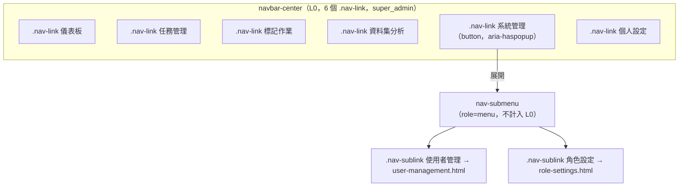

# Design: admin-role-settings-nav-shortcut

## Context（脈絡）

本設計服務 `specs/shared/008-sidebar-navbar-shared/spec.md` 的新增能力（issue #725）：`super_admin` 目前必須先點側欄「系統管理」進入 `user-management.html`，再點頁內 admin-tabs 才能到達 `role-settings.html`，命中 issue #645 使用者到達路徑圖的 F1（點擊數超標）。

維護者已針對「新增側欄一級項目 vs. 展開次選單」的架構衝突做出裁示：採用**方案 (b)** ——「系統管理」保持為唯一一個 L0 項目，改為可展開次選單，不新增/移除 L0 項目，因此不觸碰已鎖定的 FR-002／FR-003A／SC-003（`super_admin` L0 可見項目數 = 6、`user` = 5）。`sidebar.js`／`sidebar.css` 是 14 個消費頁面共用的元件（`specs/shared/008` Prototype Traceability），因此本設計只能新增能力，不能改變既有 L0 契約、既有頁面呼叫 `mountSidebar()` 的參數介面，也不能引入需要逐頁修改才能生效的新必要選項。

## Goals / Non-Goals

**Goals：**

- `super_admin` 在 Desktop（`> MOBILE_BP`）且 Sidebar 未收合時，可用一次點擊「系統管理」+ 一次點擊「角色設定」直達 `role-settings.html`，不需先落地 `user-management.html`。
- 次選單子項不計入 L0 導覽項目與計數（FR-002／FR-003A／SC-003 逐字不變）。
- `roleSettingsHref` 由 `sidebar.js` 內部從既有 `adminHref` 字串推導，零逐頁改動（14 個消費頁面的 `mountSidebar()` 呼叫參數不需新增任何欄位）。
- Mobile 與 Desktop 收合（icon-only）狀態維持「點擊系統管理直接導向 `user-management`」的既有行為，不因本次變更產生互動落差或死角。
- `user-management.html` 既有 admin-tabs（使用者管理／角色設定）導覽與行為不變，兩者為互補入口。

**Non-Goals：**

- 不新增第三個 admin 子頁或子選單項目；日後新增需另行提出規格變更。
- 不在 Mobile 底部導覽或 Desktop 收合狀態下實作浮動次選單／彈出層；這兩種受限版面留待未來需求出現時再評估。
- 不修改 `specs/admin/006-user-management/spec.md` 或 `specs/admin/007-role-settings/spec.md` 的既有 FR/AC。
- 不修改任何 API、DB schema 或後端授權邏輯。
- 不新增 hover-only 觸發方式（保持與 Sidebar 既有互動元件一致的點擊觸發語意，見 Decision 2）。

## Decisions

### 1. 次選單為「系統管理」既有 L0 項目的展開內容，不是新的 L0 節點

`renderSidebar()` 中 `navItems` 陣列的 `admin` 條目維持在既有位置（第 5 項），`.navbar-center .nav-link` 選擇器命中的節點數維持 `super_admin`=6／`user`=5。次選單容器（`role="menu"`）與子項（`role="menuitem"`，class `.nav-sublink`）刻意使用與 L0 `.nav-link` 不同的 class，避免任何既有或未來以 `.navbar-center .nav-link` 計數的測試誤將子項算作 L0 項目。

### 2. 觸發方式為點擊（click-to-toggle），與 Sidebar 既有互動元件一致

Sidebar 既有的快捷鍵總覽、通知鈴鐺、外觀切換皆為點擊觸發／點擊外部或 `Esc` 關閉的語意（`shortcutHelpBtn`、`notificationBellBtn` 既有模式）。次選單沿用同一套語意，不採用 hover-only 觸發，以維持觸控裝置可用性與跨元件行為一致性；也避免與 Desktop Sidebar 收合功能既有的「點擊空白區收合」手勢（FR-014A）產生手勢衝突。

### 3. `roleSettingsHref` 由 `adminHref` 字串推導，不新增逐頁選項

目前 14 個消費頁面呼叫 `mountSidebar({ adminHref: '...user-management.html', ... })`，字串樣式固定為 `.../admin/user-management.html` 或 `user-management.html`。`sidebar.js` 新增純函式 `getRoleSettingsHref(adminHref)`，以 `String.prototype.replace('user-management.html', 'role-settings.html')` 推導，不需任何頁面新增 `roleSettingsHref` 選項即可運作。若未來 admin 路由改名，需同步調整此推導函式（風險：與逐頁字串常數的隱性耦合；緩解：Red 測試涵蓋所有既有消費頁面路徑樣式的 href 斷言）。

### 4. Mobile／Desktop 收合狀態維持既有單一連結行為，不做浮動彈出層

次選單只在 `isDesktopViewport() && !document.body.classList.contains('sidebar-collapsed')` 為真時可展開；其餘情況點擊直接以 `window.location.href = 既有 adminHref` 導頁，與變更前完全一致。原因：

- Mobile 底部導覽為橫向排列、`icon-only` 高密度版面，浮動選單需要額外的定位與遮擋計算，非本 issue 明確要求（issue #725 描述的路徑問題以 Desktop prototype 檔案行號為依據）。
- Desktop 收合（`SIDEBAR_COLLAPSED_WIDTH`）狀態下側欄本身即為 icon-only，展開次選單需要脫離主線 flex 版面的絕對定位彈出層，複雜度與本次「單一 PR、單一目的」的規模不成比例。
- 兩種情境的既有行為（直達 `user-management`）本來就滿足 FR-011／FR-014 既有 RWD 契約，不需要為了本次優化而重新設計。

CSS 以 `@media (max-width: 767px)` 與 `body.sidebar-collapsed` 兩個既有選擇器強制隱藏 `.nav-submenu`／`.nav-caret`，作為 JS 判斷之外的 defense-in-depth，避免任何時序競態下次選單意外可見。

### 5. 目前子項標示（current sub-item）以 `window.location.pathname` 判斷，不新增頁面選項

`getCurrentAdminSubKey()` 檢查目前路徑是否包含 `role-settings.html` 或 `user-management.html`，據以在對應子項加上 `.current` class 與 `aria-current="page"`。此標示與既有 L0「系統管理」active 狀態（FR-006，`role-settings`／`user-management` 皆映射為系統管理 active）為互補關係：L0 層級的 active 由 `activeNav` 參數決定（不變），次選單層級的「目前項」由路徑動態判斷（新增），兩者不互斥、不重複渲染。

## Open Questions

無；本次變更範圍明確（新增次選單能力，不涉及 API/DB/其他規格），且維護者已就架構衝突（L0 計數 vs. 次選單）做出裁示，不留待實作階段決議的開放問題。
