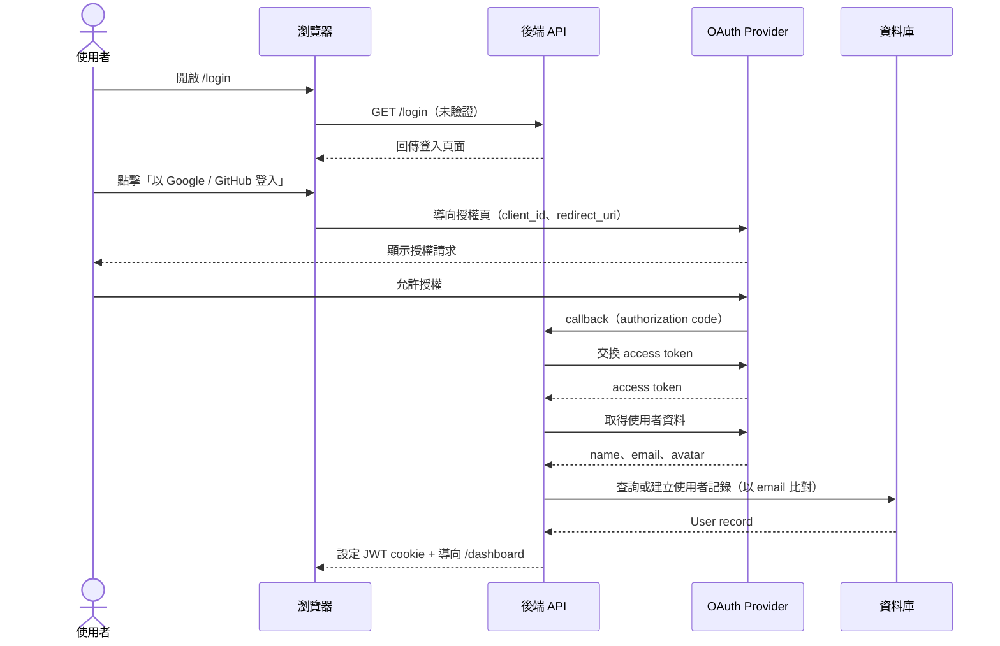
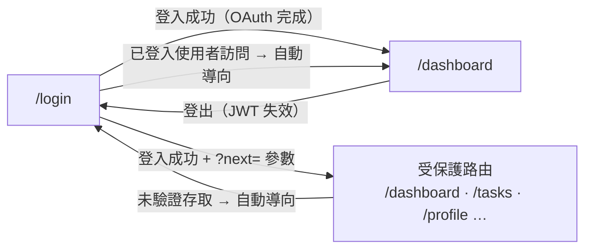

# 功能規格：SSO 登入

**功能分支**：`001-sso-login`
**建立日期**：2026-03-25
**狀態**：Clarified
**需求來源**：「先做一個簡單的登入畫面，需要串接 Google、GitHub 登入的 SSO 功能」

## Process Flow

OAuth 登入涉及四個系統角色，以下為完整業務流程：

| 步驟 | 角色 | 動作 | 系統回應 |
|------|------|------|---------|
| 1 | 使用者 | 開啟 `/login` | 回傳登入頁面 |
| 2 | 使用者 | 點擊 OAuth 按鈕 | 導向 Provider 授權頁 |
| 3 | OAuth Provider | 使用者授權後回調 | 後端接收 `code` |
| 4 | 後端 | 交換 token + 取得資料 | 查詢或建立 User 記錄 |
| 5 | 後端 | 簽發 JWT | 導向 `/dashboard` |
| E1 | 使用者 | 取消授權 | 停留 `/login` 並顯示錯誤 |
| E2 | 後端 | JWT 過期 | 導向 `/login`，不靜默更新 |

---

## 使用者情境與測試 *(必填)*

### User Story 1 — 使用 Google 或 GitHub 登入（優先級：P1）

使用者（研究生或工讀生）進入 Label Suite 入口，看到簡潔的登入頁面。
點擊「以 Google 登入」或「以 GitHub 登入」，完成 OAuth 流程後，
系統完成身份驗證並導向儀表板。

**此優先級原因**：身份驗證是所有功能的入口，沒有登入就無法使用任何功能。Google 與 GitHub 是目標使用者（NLP 研究者與工程師）最熟悉的兩個身份提供者。

**獨立測試方式**：進入 `/login`，點擊身份提供者按鈕，完成 OAuth，驗證導向 `/dashboard` 並存有有效 session token。

**驗收情境**：

1. **Given** 未登入使用者在 `/login`，**When** 點擊「以 Google 登入」並完成 Google OAuth，**Then** 導向 `/dashboard` 且 session token 已儲存。
2. **Given** 未登入使用者在 `/login`，**When** 點擊「以 GitHub 登入」並完成 GitHub OAuth，**Then** 導向 `/dashboard` 且 session token 已儲存。
3. **Given** 使用者取消或拒絕 OAuth 授權，**When** 被導回，**Then** 停留在 `/login` 並顯示明確的錯誤訊息。
4. **Given** 已登入使用者，**When** 導向 `/login`，**Then** 自動導向 `/dashboard`。

---

### User Story 2 — 首次使用者帳號建立（優先級：P2）

從未登入過的使用者透過 Google 或 GitHub 完成身份驗證。
系統自動使用身份提供者的個人資料（姓名、Email、頭像）建立新帳號，
不需要額外填寫任何註冊表單。

**此優先級原因**：流暢的首次使用體驗很重要，但核心登入流程（P1）必須先完成。自動開通帳號可降低新使用者的操作摩擦。

**獨立測試方式**：以新的 OAuth 身份登入，驗證資料庫中建立了正確個人資料的使用者記錄。

**驗收情境**：

1. **Given** 首次使用者完成 Google OAuth，**When** callback 處理完成，**Then** 建立包含 Google 個人資料的 `name`、`email`、`avatar_url` 使用者記錄。
2. **Given** 首次使用者完成 GitHub OAuth，**When** callback 處理完成，**Then** 建立包含 `login`、`email`（若為公開）、`avatar_url` 的使用者記錄。
3. **Given** 回訪使用者（email 已存在），**When** 再次登入，**Then** 不建立重複帳號，回傳既有帳號的 session。

---

### User Story 3 — 受保護路由強制驗證（優先級：P3）

任何未登入使用者嘗試存取受保護頁面（如 `/dashboard`、`/tasks`），
系統導向 `/login`，並在登入成功後返回原始目標頁面。

**此優先級原因**：路由保護是安全需求，但可在登入流程確認可用後再實作。

**獨立測試方式**：在無 session 狀態下直接導向 `/dashboard`，驗證被導向 `/login?next=/dashboard`。

**驗收情境**：

1. **Given** 未登入使用者，**When** 直接導向 `/dashboard`，**Then** 被導向 `/login`。
2. **Given** 從 `/tasks` 被導向 `/login` 的使用者，**When** 成功登入，**Then** 返回 `/tasks`。

---

### User Story 4 — 登出（優先級：P2）

已登入使用者可以在應用程式任何頁面登出。
登出後，session 失效並導向 `/login`。
登出後存取受保護路由需重新驗證。

**此優先級原因**：登出是基本的安全需求，在多人共用機器的實驗室環境中尤為重要。

**獨立測試方式**：登入後點擊登出按鈕，驗證導向 `/login`，並確認舊的 session token 不再被接受。

**驗收情境**：

1. **Given** 已登入使用者，**When** 點擊「登出」按鈕，**Then** JWT 失效並導向 `/login`。
2. **Given** 已登出使用者，**When** 直接存取 `/dashboard`，**Then** 被導向 `/login`。
3. **Given** 已登出使用者，**When** 使用瀏覽器返回按鈕進入快取的受保護頁面，**Then** 頁面不顯示已登入內容（重新驗證或顯示登入頁）。

---

### 邊界情況

- OAuth 身份提供者暫時無法使用時？→ 在登入頁顯示友善的錯誤訊息。
- GitHub 使用者沒有公開 Email 時？→ 使用 GitHub username 建立帳號，email 欄位為 null。
- 相同 Email 同時連結 Google 與 GitHub 時？→ 靜默合併（silent merge）：視為同一帳號（以 email 比對），兩個 provider 均可登入同一使用者記錄，不需使用者確認。
- JWT 在工作階段中途過期時？→ 導向 `/login`，不進行靜默更新（silent refresh），使用者必須重新驗證。

## 需求規格 *(必填)*

### 功能需求

- **FR-001**：系統必須提供含「以 Google 登入」與「以 GitHub 登入」按鈕的 `/login` 頁面。
- **FR-002**：系統必須對 Google 與 GitHub 實作 OAuth 2.0 授權碼流程。
- **FR-003**：系統必須在成功驗證後簽發 JWT session token。
- **FR-004**：系統必須在首次登入時使用身份提供者個人資料自動開通使用者記錄。
- **FR-005**：系統必須將已登入使用者從 `/login` 導向 `/dashboard`。
- **FR-006**：系統必須保護所有非登入路由，將未驗證存取導向 `/login`。
- **FR-007**：登入頁面必須具備響應式設計，支援行動裝置瀏覽器。
- **FR-008**：OAuth 客戶端憑證必須儲存於環境變數，絕不硬編碼。
- **FR-009**：系統必須在所有已登入頁面提供可存取的登出操作（按鈕或連結）。
- **FR-010**：登出時，系統必須使 JWT 失效並清除所有客戶端 session 儲存。
- **FR-011**：資料庫 migration seed 必須建立一個預設 admin 帳號，確保首次部署時有 admin 可指派其他使用者的角色。
- **FR-012**：JWT 過期時，系統必須將使用者導向 `/login`，不支援靜默更新 token。
- **FR-013**：當使用者以某個身份提供者登入，且 email 已對應另一個身份提供者的帳號時，系統必須靜默合併兩個 provider 至既有帳號，不需使用者確認。
- **FR-014**：登入頁面必須支援 zh-TW / en 語言切換，與應用程式其他頁面一致。

### User Flow & Navigation

| From | Trigger | To |
|------|---------|-----|
| `/login` | OAuth 登入成功 | `/dashboard` |
| `/login` | 已登入使用者訪問 | `/dashboard`（自動導向）|
| `/login` | 登入成功 + `?next=` 參數 | 原始目標路由 |
| 任意已登入頁面 | 點擊登出 | `/login` |
| 任意受保護路由 | 未驗證存取 | `/login?next=[原始路徑]` |

**Entry points**：`/login` 是系統唯一的未驗證入口。
**Exit points**：所有受保護路由均可透過登出按鈕返回 `/login`。

### 關鍵實體

- **User（使用者）**：代表已驗證身份。關鍵屬性：`id`、`email`、`name`、`avatar_url`、`provider`（google | github）、`provider_id`、`role`（annotator | researcher | admin）、`created_at`。
  - 首次登入預設 `role = annotator`。角色升級（researcher / admin）須由既有 admin 透過管理介面執行。
- **Session / JWT**：OAuth callback 成功後簽發的短效存取 token。包含 `user_id`、`role`、`exp`。過期後系統導向 `/login`，不進行靜默更新。

## 成功標準 *(必填)*

- **SC-001**：使用者可在 30 秒內完成完整登入流程（點擊 → OAuth → 儀表板）。
- **SC-002**：API 回應與前端 bundle 中不暴露任何使用者憑證或 token。
- **SC-003**：登入頁面在視窗寬度 375px、768px、1440px 下均正確渲染。
- **SC-004**：對任何受保護路由的未驗證請求回傳 HTTP 401 或導向 `/login`。
- **SC-005**：首次登入建立唯一一筆使用者記錄；重複登入不建立重複記錄。
- **SC-006**：登出後，已失效的 JWT 被所有受保護 API 端點拒絕（回傳 HTTP 401）。
- **SC-007**：登入頁面正確顯示 zh-TW 與 en 兩種語言；語言切換立即生效，不需重新載入頁面。
- **SC-008**：執行資料庫 migration 後，全新部署環境中存在一個預設 admin 帳號。
- **SC-009**：使用者以 Google 登入後，再以相同 email 的 GitHub 登入，最終只有一筆使用者記錄並連結兩個 provider。
