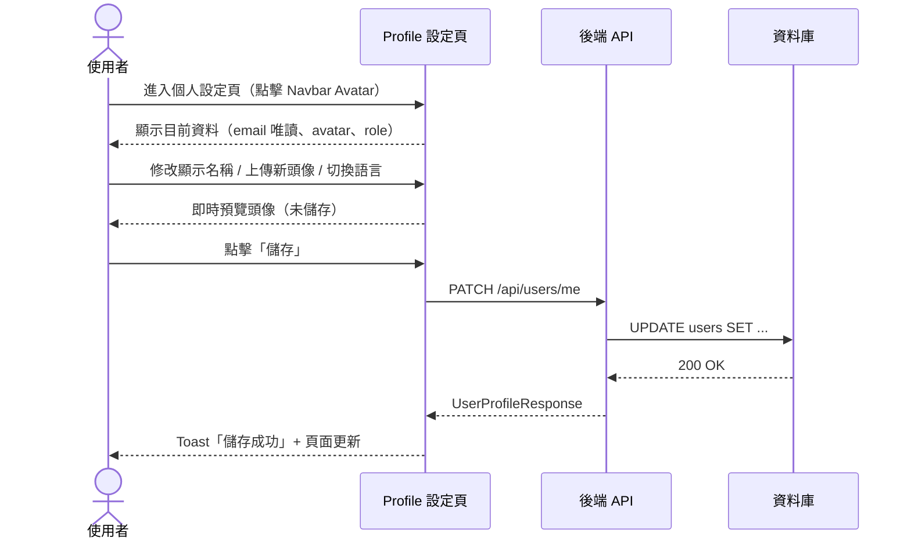
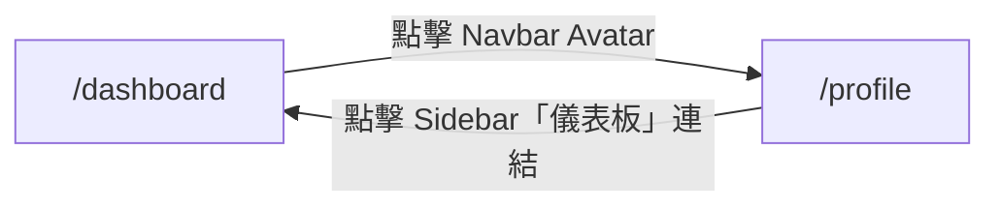

# Feature Specification: Profile Settings Page

**Feature Branch**: `002-profile-settings`
**Created**: 2026-03-27
**Status**: Draft
**Input**: User description: "個人設定頁（M1b）：登入後的使用者個人資料設定頁面。使用者可以查看與編輯自己的帳號資訊，包含顯示名稱、Email（唯讀，來自 SSO）、頭像、介面語言切換（ZH/EN）。"

## Process Flow

單一角色操作流程（使用者在個人設定頁查看與更新資料）：

| 步驟 | 角色 | 動作 | 系統回應 |
|------|------|------|---------|
| 1 | 使用者 | 進入個人設定頁 | 顯示目前資料（email 唯讀）|
| 2 | 使用者 | 修改欄位 / 上傳頭像 | 即時預覽（未儲存）|
| 3 | 使用者 | 點擊「儲存」 | PATCH API → DB 更新 |
| 4 | 系統 | 儲存成功 | Toast 通知 + 頁面更新 |
| E1 | 使用者 | 顯示名稱為空 | 拒絕儲存 + inline 錯誤 |
| E2 | 使用者 | 上傳檔案過大或格式錯誤 | 拒絕上傳 + 顯示錯誤訊息 |
| E3 | 系統 | 網路中斷 | Toast「儲存失敗」+ 保留表單 |

---

## User Scenarios & Testing *(required)*

### User Story 1 - View and Edit Profile Info (Priority: P1)

登入後的使用者（Project Leader、標記員、審核員、Super Admin）可以在個人設定頁查看自己的帳號資訊，並編輯顯示名稱與頭像，讓平台上的其他使用者能識別自己。

**Why this priority**: 所有角色都需要基本的個人資料管理，是帳號模組的核心功能，且不依賴任何其他模組。

**Independent Test**: 登入後進入個人設定頁，修改顯示名稱並儲存，再重新整理頁面確認名稱已更新。

**Acceptance Scenarios**:

1. **Given** 使用者已登入，**When** 進入個人設定頁，**Then** 頁面顯示目前的顯示名稱、Email（唯讀）、頭像、角色。
2. **Given** 使用者在個人設定頁，**When** 修改顯示名稱並點擊儲存，**Then** 系統顯示儲存成功提示，頁面更新為新名稱。
3. **Given** 使用者在個人設定頁，**When** 上傳新頭像，**Then** 頭像預覽即時更新，儲存後全站導覽列顯示新頭像。
4. **Given** 使用者嘗試修改 Email 欄位，**When** 點擊 Email 輸入框，**Then** 欄位維持唯讀狀態，並顯示「Email 由 SSO 帳號管理」提示。

---

### User Story 2 - Switch Interface Language (Priority: P2)

使用者可以在個人設定頁切換介面語言（ZH 繁體中文 / EN English），切換後全站 UI 文字立即反映新語言設定。

**Why this priority**: 語言切換增強使用體驗但不影響核心標注功能，屬於增強功能，可在 P1 完成後獨立交付。

**Independent Test**: 在個人設定頁將語言從 ZH 切換為 EN，確認頁面標題、按鈕文字、導覽列全部切換為英文。

**Acceptance Scenarios**:

1. **Given** 使用者介面語言為 ZH，**When** 在個人設定頁切換為 EN 並儲存，**Then** 全站 UI 立即切換為英文，頁面不重新整理。
2. **Given** 使用者已設定語言偏好，**When** 登出後重新登入，**Then** 系統套用上次儲存的語言設定。

---

### Edge Cases

- 顯示名稱為空白時，系統應拒絕儲存並顯示驗證錯誤。
- 上傳的頭像超過檔案大小限制（5MB）時，系統應顯示錯誤提示並拒絕上傳。
- 上傳非圖片格式時，系統應顯示「僅支援 JPG、PNG、WebP」錯誤。
- 儲存時網路中斷，系統應顯示失敗提示並保留表單內容。

## Requirements *(required)*

### Functional Requirements

- **FR-001**: 系統必須在個人設定頁顯示使用者目前的顯示名稱、Email（唯讀）、頭像與角色。
- **FR-002**: 系統必須允許使用者更新顯示名稱（不可為空，最多 50 個字元）。
- **FR-003**: 系統必須允許使用者上傳新頭像（JPG／PNG／WebP，最大 5MB），並在儲存前提供即時預覽。
- **FR-004**: 系統必須鎖定 Email 欄位為唯讀，並顯示提示說明「Email 由 SSO 帳號管理」。
- **FR-005**: 使用者必須能在個人設定頁切換介面語言（ZH 繁體中文 ／ EN English）。
- **FR-006**: 系統必須跨 session 保存語言偏好設定。
- **FR-007**: 系統必須在儲存操作後顯示成功／失敗的 Toast 通知。

### User Flow & Navigation

| From | Trigger | To |
|------|---------|-----|
| `/dashboard` | 點擊 Navbar Avatar（使用者名稱）| `/profile` |
| `/profile` | 點擊 Sidebar「儀表板」連結 | `/dashboard` |

**Entry points**：`/dashboard` Navbar 的 Avatar 是唯一入口。
**Exit points**：`/profile` Sidebar 可導回 `/dashboard`。

### Key Entities

- **UserProfile**：代表已登入使用者的個人資料。主要屬性：`id`、`display_name`、`email`（來自 SSO，唯讀）、`avatar_url`、`role`（annotator | project_leader | reviewer | super_admin）、`language_preference`（zh｜en）。

## Success Criteria *(required)*

- **SC-001**: 使用者可在 30 秒內完成個人資料的查看與更新。
- **SC-002**: 語言切換立即生效，不需重新整理頁面。
- **SC-003**: 所有表單驗證錯誤在送出前即時顯示於欄位旁。
- **SC-004**: 頭像上傳與預覽功能對 JPG、PNG、WebP 格式（5MB 以內）正常運作。
