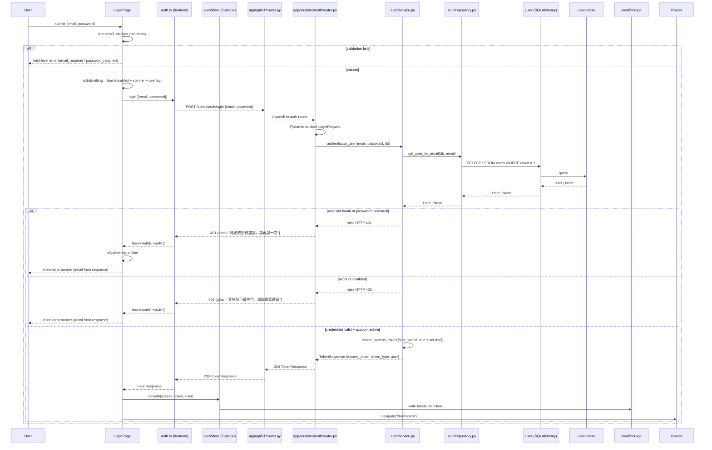

# 實作計畫：登入 — Email / Password + 頁面 UI

**規格**: [specs/account/001-login-email-password/spec.md](spec.md)

## 功能目標

> 摘自 spec.md v1.2.2

使用者能透過 Email / Password 登入 Label Suite，並從登入頁導向 dashboard，或前往註冊、忘記密碼頁面。

完整行為：

- 未登入使用者開啟 `/login`，見到完整登入表單（導覽列 + Google 按鈕 + Email/Password 欄位 + 導流連結）。
- 填妥 Email/Password 送出後，後端驗證憑證，成功回傳 JWT；前端存入 `authStore`（Zustand + localStorage），導向 `/dashboard`。
- Email/Password 任一缺漏時顯示欄位錯誤；憑證錯誤（401）或帳號停用（403）顯示 inline error banner。
- 頁面支援 zh/en 雙語切換，語言狀態透過 `localStorage['labelsuite.lang']` 持久化並跨頁維持。
- RWD：支援 375px / 768px / 1440px 三種視口，`MOBILE_BP = 767px`。

**Spec 擴展說明**：spec.md v1.2.2 將 JWT 與後端 API 列為「不在本版範圍」（prototype 確認階段）。本 plan 擴展至真實實作範圍，補充後端 API 設計與 token 管理。

## 技術方向

本功能同時觸及後端與前端。後端採 FastAPI module-first 架構（`app/modules/auth/`），以 `passlib[bcrypt]` 驗證密碼後簽發 JWT（`app/core/security.py`）；前端為 React 18 + Vite vertical-slice 架構（`src/features/account/`），`LoginPage` 呼叫真實 API，成功後將 JWT 存入 Zustand `authStore` + localStorage 並導向 `/dashboard`。失敗路徑（401/403）顯示 inline error banner，語言與 token 狀態透過 shared hooks/stores 跨頁持久化。

## 技術脈絡

**語言 / 版本**: Python 3.12+ / TypeScript 5+
**主要相依套件**: FastAPI / React 18 + Vite 5 / react-router-dom v6 / react-i18next / TanStack Query v5 / Zustand v5 / shadcn/ui / passlib[bcrypt] / python-jose[cryptography]
**儲存**: PostgreSQL（prod）/ SQLite（local dev，ADR-024）/ 無 Redis（無需 token blacklist）
**測試**: pytest + pytest-asyncio / Vitest + Testing Library + MSW / Playwright
**效能目標**: `POST /api/v1/auth/login` P95 < 500ms（bcrypt cost=12 約 100ms）
**限制**: 不涉及 task type 邏輯；JWT secret 從環境變數讀取；HttpOnly cookie defer 至 security spec；i18n 邊界：前端 locale 檔僅含 UI 字串，後端 `detail` 依 `Accept-Language` 回傳

**前置條件**: 本 feature 依賴 Foundation-Core（`specs/foundation/000-foundation`）骨架已實作：`app/core/`、`app/api/v1/router.py`、`AppBaseModel`、`ErrorResponse`、`PaginatedResponse`、`conftest.py`、Vite + React 環境、`shared/api/apiClient.ts`、Docker Compose 服務。Foundation tasks.md 必須先完成後，方可開始本 feature 實作。

## 憲章檢查

- [x] 功能目標：本計畫的功能目標與 spec.md 一致（plan 擴展後端範圍已說明）
- [x] I. Spec-First：spec.md 狀態 Clarified v1.2.2；plan 擴展範圍已說明
- [x] II. Generalization-First：登入邏輯不涉及 NLP task type，無 hardcoded task logic
- [x] III. Data Fairness：無 test set 或 ground truth 資料
- [x] IV. Test-First：測試計畫已列於 Phase 1 步驟 5；TDD 順序寫入 Phase 2
- [x] V. Code Quality & Simplicity：controlled components（2 欄位，簡單驗證）；bcrypt 業界標準；入口點 LoginPage → LoginForm → submit → auth.ts → POST /auth/login，兩層內可定位
- [x] VI. English-First：程式碼/commit 用英文；specs/prototype 允許繁體中文
- [x] VII. Design Consistency：UI 對齊 `design/prototype/pages/account/login.html`；shadcn/ui + MASTER.md tokens；非 page 元件均規劃 Storybook story；符合 WCAG 2.1 AA（keyboard navigable、`aria-describedby` on inputs、eye toggle aria-label 同步）
- [x] VIII. Performance Baseline：`POST /auth/login` P95 < 500ms；前端 FCP ≤ 3s；互動反饋 ≤ 100ms；`LoginPage` 使用 route-level lazy loading
- [x] IX. No Silent Failure：全 error case 定義（401/403/422/5xx）；loading overlay 防重複提交；API error 顯示 inline banner；`catch` 不靜默吞噬
- [x] XI. Security & Privacy Baseline：密碼 bcrypt hash；JWT secret 從 env；login 失敗統一 401（防 user enumeration）；`hashed_password` 不出現於任何 response schema；CORS 明確 origins（Foundation 已設定）

### 領域憲章載入

- [x] 後端（touches `backend/`）：已讀取 `.specify/memory/backend-constitution.md`；本 plan 符合其所有適用規則
- [x] 前端（touches `frontend/`）：已讀取 `.specify/memory/frontend-constitution.md`；本 plan 符合其所有適用規則
- [x] 測試（所有 task）：已讀取 `.specify/memory/testing-constitution.md`；本 plan 符合其所有適用規則

## 專案結構

### 文件（本功能）

```text
specs/account/001-login-email-password/
├── spec.md
├── plan.md
├── tasks.md
├── checklists/
│   ├── ac-checklist.md
│   └── security-checklist.md
└── contracts/
    └── auth-login.md
```

### 原始碼

```text
frontend/
├── src/
│   ├── features/
│   │   └── account/
│   │       ├── components/
│   │       │   └── login/
│   │       │       ├── AccountNavbar.tsx
│   │       │       ├── AccountNavbar.stories.tsx
│   │       │       ├── LoginCard.tsx
│   │       │       ├── LoginCard.stories.tsx
│   │       │       ├── LoginForm.tsx
│   │       │       ├── LoginForm.stories.tsx
│   │       │       ├── PasswordField.tsx
│   │       │       ├── PasswordField.stories.tsx
│   │       │       ├── GoogleLoginButton.tsx
│   │       │       └── GoogleLoginButton.stories.tsx
│   │       ├── pages/
│   │       │   └── LoginPage.tsx
│   │       ├── services/
│   │       │   └── auth.ts             # POST /api/v1/auth/login wrapper
│   │       ├── types/
│   │       │   └── auth.ts             # LoginFormState, AuthResponse, UserInfo
│   │       └── __tests__/
│   │           ├── LoginForm.test.tsx
│   │           └── LoginPage.test.tsx
│   ├── shared/                         # Foundation 建立骨架（components/, hooks/, stores/, constants/, types/, api-types/, utils/, styles/, i18n/）
│   │   ├── components/
│   │   │   ├── LanguageToggle.tsx      # 2+ modules → shared/
│   │   │   └── LanguageToggle.stories.tsx
│   │   ├── hooks/
│   │   │   └── useLanguage.ts          # localStorage-backed，全站語言 hook
│   │   ├── stores/
│   │   │   └── authStore.ts            # Zustand: {token, user, setAuth, clearAuth}
│   │   └── __tests__/
│   │       └── useLanguage.test.ts
│   └── locales/
│       ├── zh-TW/
│       │   └── account.json
│       └── en/
│           └── account.json
└── e2e/
    └── account/
        └── login.spec.ts

backend/
├── app/
│   ├── core/                           # Foundation 已建立（config.py, schemas.py, errors.py）
│   │   ├── security.py                 # bcrypt hash/verify, JWT create/decode
│   │   └── deps.py                     # get_current_user dependency（Foundation 骨架 or auth task）
│   ├── api/
│   │   └── v1/
│   │       └── router.py               # Foundation 已建立；須 include auth router
│   └── modules/
│       └── auth/
│           ├── router.py               # login + me endpoints
│           ├── service.py              # authenticate_user
│           ├── repository.py           # get_user_by_email, get_user_by_id
│           ├── models.py               # User SQLAlchemy model
│           ├── schemas.py              # LoginRequest, TokenResponse, UserBase, UserResponse, UserRole
│           ├── dependencies.py         # re-export get_current_user from core/deps.py
│           ├── constants.py            # ACCESS_TOKEN_EXPIRE_MINUTES default
│           └── exceptions.py           # AuthError helpers（薄包裝 HTTPException）
├── alembic/
│   └── versions/
│       └── [hash]_create_users_table.py
├── tests/
│   ├── conftest.py                     # Foundation 已建立；補充 auth fixtures
│   ├── factories/
│   │   └── user_factory.py
│   └── auth/
│       ├── test_auth_core.py           # unit: hash/JWT
│       └── test_auth_routes.py         # integration: POST /login, GET /me
└── bruno/
    └── account/
        └── 001-login-email-password/
            ├── post-auth-login.bru
            └── get-auth-me.bru
```

> **拆分慣例**：auth module 各檔案預計均低於 300 行，維持單一檔案。若未來擴展超過 300 行，依 plan-template 拆分慣例改為同名子目錄，`__init__.py` 負責彙總對外介面。

## 系統流程與資料流



| 層 | 元件 | 職責 |
|----|------|------|
| Frontend Page | `LoginPage` | 表單狀態、語言 init、mutation、錯誤顯示、導頁 |
| Frontend Service | `auth.ts` | fetch wrapper，回傳 `TokenResponse` 或拋出 `AuthError` |
| Frontend Store | `authStore` | Zustand: 存取 token + user；同步至 localStorage |
| Route | `app/api/v1/router.py` | API v1 路由彙整（Foundation 已建立） |
| Controller boundary | `app/modules/auth/router.py` | 請求驗證（Pydantic）、委派 service、包裝 HTTP response |
| Service | `app/modules/auth/service.py` | 查找 user、驗證密碼、簽發 JWT |
| Repository | `app/modules/auth/repository.py` | DB 查詢：get_user_by_email、get_user_by_id |
| Model | `app/modules/auth/models.py` | User SQLAlchemy ORM 定義 |
| DB | `users` table | 持久化 |

---

## Phase 0：研究

> Spec 狀態 Clarified，所有 UI 問題已解答；後端技術選型完整，無 NEEDS CLARIFICATION。

**技術決策：**

| 決策項目 | 選擇 | 原因 |
|---------|------|------|
| 密碼 hash | `passlib[bcrypt]` cost=12 | 業界標準；FastAPI 生態推薦；支援 future hash upgrade |
| JWT | `python-jose[cryptography]` | FastAPI 官方文件採用；支援 HS256；足夠輕量 |
| Token 儲存（前端） | Zustand store + `localStorage` | 跨 session 持久化；XSS 風險已記錄於複雜度追蹤 |
| Access token 有效期 | 30 分鐘（env: `ACCESS_TOKEN_EXPIRE_MINUTES`） | 平衡安全性與 UX；refresh token defer |
| i18n library | `react-i18next` | 符合 Foundation 建立的 namespace 規範；成熟的 lazy 支援 |
| 路由守衛策略 | `PrivateRoute` wrapper：未登入 → `/login?redirect_to=...` | 簡單 HOC，後續可擴展 role-based guard |
| 後端模組 | `app/modules/auth/` | 對齊 Foundation module-first 架構 |

**Exception 設計：**

| 操作 | Error 情境 | Exception Class | HTTP Status | Response body |
|------|-----------|----------------|-------------|---------------|
| `POST /auth/login` | email 不存在 / 密碼錯誤 | `HTTPException` | 401 | `{detail: i18n("auth.invalid_credentials")}` |
| `POST /auth/login` | 帳號停用 (`is_active=False`) | `HTTPException` | 403 | `{detail: i18n("auth.account_disabled")}` |
| `GET /auth/me` | token 過期 | `HTTPException` | 401 | `{detail: i18n("auth.token_expired")}` |
| `GET /auth/me` | token 無效 / 缺少 | `HTTPException` | 401 | `{detail: i18n("auth.token_invalid")}` |

> 注意：login 失敗一律回 401（不區分「email 不存在」vs「密碼錯誤」），防止 user enumeration 攻擊。

---

## Phase 1：設計與契約

### 1. 實體與資料模型 → `data-model.md`

**User 實體**：

| 欄位 | 型別 | 說明 |
|------|------|------|
| `id` | `UUID` PK | 主鍵（server-side generated） |
| `email` | `String(254)` UNIQUE NOT NULL | 登入識別 |
| `hashed_password` | `String` NOT NULL | bcrypt hash；不得出現於任何 response schema |
| `role` | `Enum('user', 'super_admin')` DEFAULT `'user'` | 系統角色 |
| `is_active` | `Boolean` DEFAULT `True` | 帳號啟用狀態 |
| `created_at` | `DateTime(timezone=True)` | 建立時間（auto utcnow） |
| `updated_at` | `DateTime(timezone=True)` | 更新時間（auto utcnow onupdate） |

**狀態轉換**：本功能無多狀態實體。User `is_active` 僅 True/False，由 admin-006 管理，不在本 spec 範圍。

**DB Index 分析**：

| 查詢 | 篩選欄位 | Index 策略 | Loading Strategy | 風險 |
|------|---------|-----------|-----------------|------|
| 登入查詢 | `email` | `UNIQUE INDEX users(email)` | 直接查詢，無 relationship | — |
| JWT 驗證（GET /me） | `id` | Primary key（UUID） | 直接查詢，無 relationship | — |

> `lazy="raise"` 設於所有 relationship（本 model 目前無 relationship），防止未來新增欄位後產生隱性 N+1。

---

### 2. 後端 API 清單

| Method | Path | System Role | Task Role | Auth Dependency | 說明 | Bruno 檔案 |
|--------|------|-------------|-----------|----------------|------|-----------|
| POST | `/api/v1/auth/login` | 無（公開） | 無 | 無 | Email/password 驗證，回傳 JWT | `backend/bruno/account/001-login-email-password/post-auth-login.bru` |
| GET | `/api/v1/auth/me` | user / super_admin | 無 | `get_current_user` | 取得目前登入用戶資訊 | `backend/bruno/account/001-login-email-password/get-auth-me.bru` |

完整契約 → `contracts/auth-login.md`

**事務邊界設計**：兩個端點均為單一 DB 讀取，無複合寫入操作。本端點無複合事務。

---

### 2b. Pydantic Schema 層次設計

| Schema | 繼承自 | 用途 | 需排除的敏感欄位 |
|--------|-------|------|----------------|
| `UserRole` | `str, Enum` | 角色枚舉：`'user'`, `'super_admin'` | — |
| `LoginRequest` | `AppBaseModel` | POST /auth/login body：`email: EmailStr`、`password: str (min_length=1)` | — |
| `UserBase` | `AppBaseModel` | 共用欄位：`id: UUID`、`email: EmailStr`、`role: UserRole`、`is_active: bool` | — |
| `UserResponse` | `UserBase` | API 回應（含 `created_at: datetime`） | `hashed_password` |
| `TokenResponse` | `AppBaseModel` | 登入成功回應：`access_token: str`、`token_type: str = "bearer"`、`user: UserResponse` | `hashed_password`（透過 UserResponse 排除） |

> `AppBaseModel` 繼承自 Foundation 建立的 `app/core/schemas.py`（設有 `model_config = ConfigDict(from_attributes=True)`）。

---

### 3. 前端切版分析

| 區塊 | 元件名稱 | 職責 | 資料來源 | Stories 狀態 | ARIA / 鍵盤需求 | 響應式行為 |
|------|---------|------|---------|------------|----------------|----------|
| 頁面容器 | `LoginPage` | 路由入口、語言 init、mutation、導頁 | `useMutation`、`authStore` | — (page 層不寫 story) | — | — |
| 導覽列 | `AccountNavbar` | 品牌 Logo + 語言切換（account 頁共用） | `useLanguage` | Default | `role="banner"` | height: 64px → 56px at ≤767px |
| 語言切換 | `LanguageToggle` | zh/en 切換，寫 localStorage | `useLanguage` | ZH, EN | `aria-label` 隨語言切換 | 不變 |
| 登入卡片 | `LoginCard` | 卡片容器 + header（logo/title/subtitle）+ 底部導流 | props | Default | `role="region" aria-label="登入"` | padding 縮小 at ≤767px |
| 登入表單 | `LoginForm` | 2 欄位、欄位驗證、submit、API error banner | `useState`（controlled） | Default, Loading, EmailError, PasswordError, BothErrors, APIError | `novalidate`、`aria-describedby` on inputs | 全寬 |
| Password 欄位 | `PasswordField` | password input + eye toggle + error span | controlled | Default, Visible, Hidden, WithError | eye button `aria-label` 隨狀態切換 | — |
| Google 按鈕 | `GoogleLoginButton` | no-op prototype（UI only） | — | Default, Hover | `aria-label="使用 Google 帳號繼續登入"` | 全寬 |

**元件層次**：

```text
LoginPage
├── AccountNavbar
│   └── LanguageToggle (shared/)
└── LoginCard
    ├── CardHeader (內嵌：logo + title + subtitle)
    ├── GoogleLoginButton
    ├── DividerWithText (內嵌)
    ├── LoginForm
    │   ├── EmailField (內嵌)
    │   ├── PasswordField
    │   └── LoginButton (內嵌)
    └── RegisterPrompt (內嵌)
```

**shared/ 資格判斷**：

- `LanguageToggle` → account + dashboard+ 等 2+ modules → **shared/components/**
- `useLanguage` → 全站語言 hook → **shared/hooks/**
- `authStore` → 全站 auth 狀態 → **shared/stores/**
- `AccountNavbar` → 僅 account module 內部（login/register/forgot-pw）→ **features/account/components/**

**畫面狀態轉換**：

| 當前畫面狀態 | 觸發條件 | 下一狀態 | UI 呈現 |
|------------|---------|---------|--------|
| LoginForm Default | 提交空白欄位 | LoginForm FieldError | 欄位紅框 + error span 顯示 |
| LoginForm Default | 填妥欄位送出 | LoginForm Loading | button disabled + spinner + 全頁 overlay（pointer-events: none） |
| LoginForm Loading | API 401 / 403 | LoginForm APIError | overlay 移除 + button 恢復 + inline error banner（顯示後端 `detail`） |
| LoginForm Loading | API 200 | 導向 /dashboard | navigate('/dashboard') |
| LoginForm FieldError | 使用者重新輸入 | 對應欄位清除錯誤 | 單欄位即時清除，不影響其他欄位 |

**畫面 × API 對應**（必填）：

| 畫面 / 元件 | 觸發時機 | Method | Endpoint | TanStack Query key |
|------------|---------|--------|----------|--------------------|
| `LoginPage` 掛載 | 頁面初始化（已登入 redirect check） | GET | `/api/v1/auth/me` | `QUERY_KEYS.auth.me` = `['auth', 'me']` |
| `LoginForm` 送出 | 使用者操作 | POST | `/api/v1/auth/login` | — (mutation，onSuccess invalidates `QUERY_KEYS.auth.me`) |

> `QUERY_KEYS` 集中宣告於 `src/shared/constants/queryKeys.ts`（Foundation 已建立此常數檔結構）。

**前端技術決策**：

```text
型別策略（擇一）：
- [x] 手寫 interface（src/features/account/types/auth.ts）
      原因：無 OpenAPI spec 可生成；型別數量少且穩定

表單策略（擇一）：
- [x] controlled component（欄位 ≤ 3 個的簡單表單）
      原因：僅 2 欄位（email + password）；驗證為 non-empty + trim；react-hook-form 屬過度工程

TanStack Query 策略：
- queryKey 格式：QUERY_KEYS.auth.me = ['auth', 'me']（從 shared/constants/queryKeys.ts 匯入）
- mutation：useMutation for POST /auth/login → onSuccess: setAuth(token, user) + invalidate QUERY_KEYS.auth.me
- 無 optimistic update（登入操作為 all-or-nothing）

API 錯誤處理策略：
- 401/403 server error → inline error banner（LoginForm 內，直接顯示後端回傳的 detail）
- 422 validation error（Pydantic）→ 前端已驗證故不應出現 → Error Boundary fallback
- 5xx → Error Boundary（LoginPage 層）

Loading 策略（對應 TanStack Query 狀態欄位）：
- mutation.isPending → button disabled + spinner + 全頁 pointer-events: none overlay
- GET /me isLoading → 不顯示明顯 loading（redirect check 快速完成）
- isError && !data (GET /me 5xx) → Error Boundary
```

**路由分析**：

| Path | 元件 | 是否需要 Route Guard | 重導向規則 | Guard 失敗行為 |
|------|------|-------------------|-----------|--------------|
| `/login` | `LoginPage` | ❌ 公開（但已登入則 redirect） | authStore.token 存在 → `/dashboard` | — |
| `/` | — | — | redirect to `/login`（或 `/dashboard` 若已登入） | — |

**i18n Key 清單**（namespace: `account`）：

| Key | zh-TW 預設值 | en 值 | 出現位置 |
|-----|------------|------|---------|
| `login.page_title` | `Label Suite — 登入` | `Label Suite — Sign In` | `<title>` / LoginPage |
| `login.subtitle` | `登入你的帳號` | `Sign in to your account` | LoginCard header |
| `login.google_btn` | `使用 Google 帳號繼續` | `Continue with Google` | GoogleLoginButton text |
| `login.google_btn_aria` | `使用 Google 帳號繼續登入` | `Continue with Google account` | GoogleLoginButton aria-label |
| `login.divider` | `或` | `or` | DividerWithText |
| `login.email_label` | `電子郵件` | `Email` | EmailField label |
| `login.email_placeholder` | `name@example.com` | `name@example.com` | EmailField placeholder |
| `login.password_label` | `密碼` | `Password` | PasswordField label |
| `login.forgot_password` | `忘記密碼？` | `Forgot password?` | PasswordField forgot link |
| `login.submit_btn` | `登入` | `Sign In` | LoginButton text |
| `login.register_prompt` | `還沒有帳號？` | `Don't have an account?` | RegisterPrompt text |
| `login.register_link` | `前往註冊` | `Register` | RegisterPrompt link |
| `login.email_required` | `請輸入電子郵件` | `Email is required` | EmailField error span |
| `login.password_required` | `請輸入密碼` | `Password is required` | PasswordField error span |
| `login.eye_show` | `顯示密碼` | `Show password` | PasswordField eye toggle aria-label |
| `login.eye_hide` | `隱藏密碼` | `Hide password` | PasswordField eye toggle aria-label |
| `login.loading` | `載入中` | `Loading` | LoginButton spinner aria-label |
| `login.card_region` | `登入` | `Sign in` | LoginCard aria-label |
| `login.nav_aria` | `Label Suite 首頁` | `Label Suite home` | AccountNavbar brand aria-label |
| `login.lang_toggle_aria` | `切換語言` | `Switch language` | LanguageToggle aria-label |

> 前端 i18n 檔案路徑：`frontend/src/locales/zh-TW/account.json` 與 `frontend/src/locales/en/account.json`
>
> **i18n 邊界（ADR-026）**：此表僅記錄前端 UI 字串。後端 API response 的 `detail` 訊息由後端依 `Accept-Language` header 回傳，**不得**放入前端 locale 檔；前端元件直接顯示 `error.response?.data?.detail`，不做額外 key 對映。

**後端 i18n Key 清單**：

| Key | zh-TW 預設值 | en 值 | 出現端點 |
|-----|------------|------|---------|
| `auth.invalid_credentials` | `帳號或密碼錯誤，請再試一次` | `Invalid email or password` | `POST /api/v1/auth/login` |
| `auth.account_disabled` | `此帳號已被停用，請聯繫管理員` | `This account has been disabled` | `POST /api/v1/auth/login` |
| `auth.token_expired` | `登入已過期，請重新登入` | `Session expired, please sign in again` | `GET /api/v1/auth/me` |
| `auth.token_invalid` | `驗證失敗，請重新登入` | `Authentication failed, please sign in` | `GET /api/v1/auth/me` |

> 後端 i18n 檔案路徑：`backend/app/i18n/zh_TW/auth.py` 與 `backend/app/i18n/en/auth.py`

---

### 5. 測試情境（依層分類）

| 情境 | 測試層 | 工具 | 路徑 |
|------|-------|------|------|
| `hash_password` / `verify_password` 正確性 | 單元測試 | pytest | `tests/auth/test_auth_core.py` |
| `create_access_token` / `decode_access_token` | 單元測試 | pytest | `tests/auth/test_auth_core.py` |
| `POST /auth/login` 成功（200 + TokenResponse） | 整合測試 | pytest + httpx | `tests/auth/test_auth_routes.py` |
| `POST /auth/login` 錯誤密碼 → 401 | 整合測試 | pytest + httpx | `tests/auth/test_auth_routes.py` |
| `POST /auth/login` email 不存在 → 401（防 enumeration） | 整合測試 | pytest + httpx | `tests/auth/test_auth_routes.py` |
| `POST /auth/login` 帳號停用 → 403 | 整合測試 | pytest + httpx | `tests/auth/test_auth_routes.py` |
| `GET /auth/me` 有效 token → UserResponse（無 hashed_password） | 整合測試 | pytest + httpx | `tests/auth/test_auth_routes.py` |
| `GET /auth/me` 無效 token → 401 | 整合測試 | pytest + httpx | `tests/auth/test_auth_routes.py` |
| `GET /auth/me` 過期 token → 401 | 整合測試 | pytest + httpx | `tests/auth/test_auth_routes.py` |
| `GET /auth/me` 回應不含 `hashed_password`（security gate） | 安全測試 | pytest (`@pytest.mark.security`) | `tests/auth/test_auth_routes.py` |
| `LoginForm` email 空白送出 → 錯誤顯示 | 元件測試 | Vitest + Testing Library | `src/features/account/__tests__/LoginForm.test.tsx` |
| `LoginForm` password 空白送出 → 錯誤顯示 | 元件測試 | Vitest + Testing Library | `src/features/account/__tests__/LoginForm.test.tsx` |
| `LoginForm` 重新輸入後錯誤即時清除 | 元件測試 | Vitest + Testing Library | `src/features/account/__tests__/LoginForm.test.tsx` |
| `PasswordField` eye toggle 切換 type + aria-label | 元件測試 | Vitest + Testing Library | `src/features/account/__tests__/LoginForm.test.tsx` |
| `LoginForm` API 401 → 顯示 error banner（含 detail） | 元件測試 | Vitest + Testing Library + MSW | `src/features/account/__tests__/LoginForm.test.tsx` |
| `LoginForm` 送出後 button disabled + spinner + overlay | 元件測試 | Vitest + Testing Library + MSW | `src/features/account/__tests__/LoginForm.test.tsx` |
| `useLanguage` 讀/寫 localStorage；語言切換持久化 | 單元測試 | Vitest | `src/shared/__tests__/useLanguage.test.ts` |
| `LoginPage` 完整登入流程 → 導向 `/dashboard` | E2E | Playwright | `e2e/account/login.spec.ts` |
| `LoginPage` i18n 切換後語言持久化（跨頁） | E2E | Playwright | `e2e/account/login.spec.ts` |
| `LoginPage` RWD 375px / 768px / 1440px | E2E | Playwright | `e2e/account/login.spec.ts` |
| 登入頁原型 UI presence + SC-001~SC-006 | 原型測試 | Playwright | `design/prototype/tests/account/login.spec.ts` |

---

## Phase 2：任務規劃方式

*本節描述 `/speckit.tasks` 將執行的內容 — 不得在 `/speckit.plan` 期間執行*

**任務產生策略**：

- 以 `.specify/templates/tasks-template.md` 為基礎
- **前置確認**：列出需確認 Foundation-Core 骨架已完成的 verification task（不重複建立已有任務）
- **Phase 1 — Auth Backend Core（對應 US3）**：
  - `app/core/security.py`（bcrypt hash/verify + JWT create/decode）→ 單元測試 [P] + 實作
  - `app/modules/auth/models.py`（User model + UserRole enum）→ 模型任務 [P]
  - Alembic migration：upgrade() / downgrade() / roundtrip 三個嚴格順序任務
  - `app/modules/auth/repository.py`（get_user_by_email / get_user_by_id）→ 整合測試 [P] + 實作
  - `app/modules/auth/service.py`（authenticate_user）→ 整合測試 [P] + 實作
  - Backend i18n：`backend/app/i18n/zh_TW/auth.py` + `backend/app/i18n/en/auth.py`（各一任務）
- **Phase 2 — Auth API（對應 US3）**：
  - `app/modules/auth/schemas.py`（LoginRequest / TokenResponse / UserBase / UserResponse）→ 測試 [P] + 實作
  - `app/core/deps.py`（get_current_user dependency）→ 整合測試 [P] + 實作
  - `app/modules/auth/router.py`（POST /login + GET /me）→ 整合測試 [P] + 實作
  - `contracts/auth-login.md` 契約文件任務
  - Bruno `.bru` skeleton 任務（post-auth-login + get-auth-me）
- **Phase 3 — Shared 前端基礎（對應 US4）**：
  - `features/account/types/auth.ts`（型別定義）
  - `shared/stores/authStore.ts` → 單元測試 [P] + 實作
  - `shared/hooks/useLanguage.ts` → 單元測試 [P] + 實作
  - `shared/components/LanguageToggle.tsx` → 元件測試 [P] + 實作 + story [P]
  - `features/account/services/auth.ts` → 測試 [P] + 實作
  - i18n：`frontend/src/locales/zh-TW/account.json` + `frontend/src/locales/en/account.json`（各一獨立任務）
- **Phase 4 — Login UI 元件（對應 US1/US2）**：
  - `AccountNavbar.tsx` → 元件測試 [P] + 實作 + story [P]
  - `LoginCard.tsx` → 元件測試 [P] + 實作 + story [P]
  - `GoogleLoginButton.tsx` → 元件測試 [P] + 實作 + story [P]
  - `PasswordField.tsx` → 元件測試 [P] + 實作 + story [P]
  - `LoginForm.tsx`（欄位驗證 + API error banner）→ 元件測試 [P] + 實作 + story [P]
- **Phase 5 — LoginPage 組裝（對應 US3/US4/US5）**：
  - Route 註冊：`/login`、`/`（redirect）
  - `LoginPage.tsx`（mutation 串接 + auth check redirect + RWD）
  - `LoginPage.test.tsx`（整合）
- **Phase 6 — E2E + Prototype Tests（對應 SC-001~006）**：
  - `design/prototype/tests/account/login.spec.ts` [P]
  - `e2e/account/login.spec.ts`（完整流程 + i18n 持久化 + RWD）

**排序策略**：

- TDD 順序：測試任務在實作任務前，各自獨立 commit，先確認失敗再實作
- 相依順序：User model + migration → core/security → auth repository → auth service → auth schemas → auth routes → 前端 auth.ts types → authStore → useLanguage → LanguageToggle → AccountNavbar / LoginCard / GoogleLoginButton / PasswordField / LoginForm → LoginPage
- 後端 Phase 1/2 與前端 Phase 3/4 大量平行（[P]）
- Migration 三任務必須嚴格順序（upgrade → downgrade → roundtrip）
- Storybook story 任務永遠為獨立 [P] 任務（testing-constitution II）

**預估產出**：`tasks.md` 中約 55–65 個有序任務

**重要**：此階段由 `/speckit.tasks` 執行，不由 `/speckit.plan` 執行

---

## 複雜度追蹤

| 違反項目 | 需要原因 | 拒絕更簡單替代方案的理由 |
|---------|---------|----------------------|
| Token 儲存於 localStorage（XSS 風險） | MVP 首版；HttpOnly cookie 需要後端 CORS 同步設定，defer 至安全加固 spec | 短期 XSS 風險可接受；HttpOnly 遷移為已知技術債，待 security spec 解決 |
| Plan 擴展 spec 001 未定義的後端範圍 | 使用者明確指示依真實系統撰寫；spec 001 的原型限制僅適用於 prototype 確認階段 | 若僅實作 prototype 行為，系統永遠無法進入 production |
| `auth` module 擁有 User model（可能被 admin-006 共用） | 目前僅 auth 需要 User；YAGNI 不預建 shared user module | admin-006 實作時如有需要，可依 plan-template 拆分慣例遷移 User model |

---

## 進度追蹤

**階段狀態**：

- [x] Phase 0：研究完成（無 NEEDS CLARIFICATION）
- [x] Phase 1：設計完成（契約、資料模型、系統流程）
- [x] Phase 2：任務規劃方式已描述
- [ ] Phase 3：任務已產生（`/speckit.tasks`）
- [ ] Phase 4：實作完成（`/speckit.implement`）
- [ ] Phase 5：驗證通過（`/speckit.analyze` 零發現）

**把關狀態**：

- [x] 初始憲章檢查：PASS
- [x] 設計後憲章檢查：PASS
- [x] 所有 NEEDS CLARIFICATION 已解決
- [x] 複雜度偏差已記錄（localStorage token、spec 擴展、User model 歸屬）

---

## Changelog

| 版本 | 日期 | 變更摘要 |
|------|------|---------|
| 2.0.0 | 2026-06-09 | 完整對齊 plan-template v1.13.6：補齊 功能目標、技術方向、DB index 分析、狀態轉換、Pydantic 2b schema 表、切版分析（Stories/ARIA/響應式欄）、畫面狀態轉換、畫面×API 對應、前端技術決策、後端/前端 i18n key 清單；系統流程圖改為 module-first 架構（app/modules/auth/）含 Repository 層；Exception 設計表使用 i18n key；安全測試情境新增；憲章更新至 v1.31.0（補齊 IX、XI 檢查項；領域憲章載入節） |
| 1.0.0 | 2026-05-28 | 初版 plan：涵蓋真實前後端實作（JWT auth、LoginPage API 串接），擴展 spec 001 的 prototype-only 範圍 |
