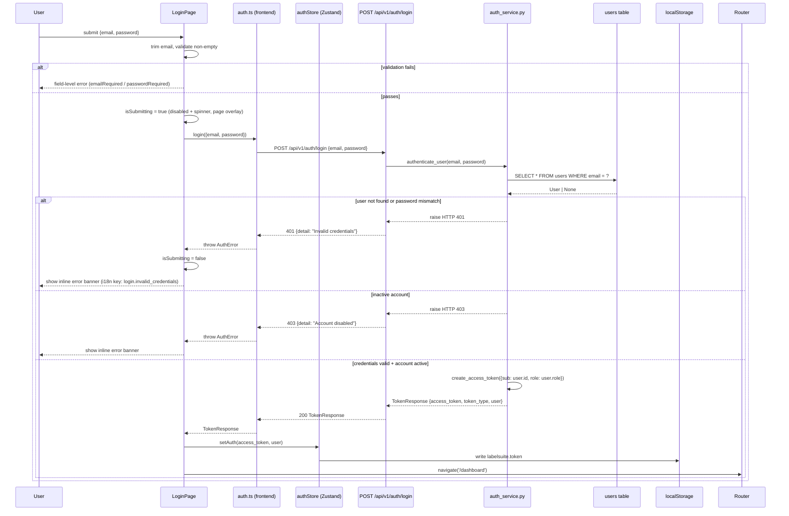

# 實作計畫：登入 — Email / Password + 頁面 UI

**規格**: [specs/account/001-login-email-password/spec.md](spec.md)
**輸入**: `specs/account/001-login-email-password/spec.md`

## 執行流程（/speckit.plan 範圍）

```text
1. 從輸入路徑載入功能規格
   → 若未找到：ERROR "No feature spec at {path}"
2. 填寫技術脈絡
3. 評估下方憲章檢查
   → 若存在違反項目：記錄至複雜度追蹤
   → 若無正當理由：ERROR "Simplify approach first"
4. 執行 Phase 0 → 研究（若有未知事項）
   → 若仍有 NEEDS CLARIFICATION：ERROR "Resolve unknowns before proceeding"
5. 執行 Phase 1 → 契約、資料模型、系統流程
6. 重新評估憲章檢查
   → 若發現新違反：重構設計，返回 Phase 1
7. 描述任務產生方式（不得建立 tasks.md）
8. 停止 — 準備好進入 /speckit.tasks
```

**重要**：/speckit.plan 在第 7 步停止。任務建立由 /speckit.tasks 負責。

---

## 摘要

登入頁（Email / Password）是 Label Suite 的第一個入口點，涵蓋：

- **後端**：`POST /api/v1/auth/login`，以 bcrypt 驗證密碼後簽發 JWT access token；`GET /api/v1/auth/me` 取得目前用戶資訊；依賴 `User` 模型。
- **前端**：LoginPage 呼叫真實 API，成功後將 JWT 存入 Zustand authStore + localStorage，導向 `/dashboard`；失敗顯示 inline 錯誤訊息。
- **UI**：對齊 prototype [design/prototype/pages/account/login.html](../../../design/prototype/pages/account/login.html) — 表單驗證、密碼顯示切換、zh/en 雙語（localStorage 持久化）、RWD（MOBILE_BP = 767px）。

> **Spec 擴展說明**：spec.md v1.2.2 將 JWT 與後端 API 列為「不在本版範圍」（prototype 確認階段）。本 plan 擴展至真實實作範圍，補充後端 API 設計與 token 管理。Spec 無需更新版本；下游規格（002 Google SSO、spec 004 Forgot/Reset Password 中的 token 失效邏輯）保持依賴關係不變。

---

## 技術脈絡

**語言 / 版本**: Python 3.12+ / TypeScript 5+
**主要相依套件**: FastAPI / React 18 + Vite 5 / react-router-dom v6 / react-i18next / TanStack Query v5 / Zustand v5
**儲存**: PostgreSQL（User table）/ 無 Redis（此 feature 無需 refresh token blacklist）
**測試**: pytest + pytest-asyncio / Vitest + Testing Library / Playwright + Storybook
**目標平台**: Web（瀏覽器 + REST API）
**效能目標**: `POST /auth/login` P95 < 500ms（密碼 hash 為主要瓶頸，bcrypt cost factor 12 在現代硬體約 100ms）
**限制**: 不涉及 task type 邏輯，不影響 config-driven architecture；JWT secret 必須從環境變數讀取

---

## 憲章檢查

- [x] I. Spec-First：spec.md 狀態 Clarified v1.2.2；plan 擴展範圍已說明
- [x] II. Generalization-First：登入邏輯不涉及 NLP task type，無 hardcoded task logic
- [x] III. Data Fairness：無 test set 或 ground truth 資料
- [x] IV. Test-First：測試計畫已列於 Phase 1 步驟 5；TDD 順序寫入 Phase 2
- [x] V. Code Quality & Simplicity：controlled components（2 欄位，簡單驗證）；無 react-hook-form 過度工程；bcrypt 為標準做法
- [x] VI. English-First：程式碼/commit 用英文；specs/prototype 允許繁體中文
- [x] VII. Design Consistency：前端 token 對齊 `design/system/MASTER.md`；prototype 為 UI source of truth
- [x] VIII. Performance Baseline：登入無列表端點；API P95 目標已設定；無 N+1 風險

---

## 專案結構

### 文件（本功能）

```text
specs/account/001-login-email-password/
├── spec.md
├── plan.md
├── tasks.md
├── data-model.md
├── contracts/
│   └── auth-login.md
└── checklists/
    ├── ac-checklist.md
    └── security-checklist.md
```

### 原始碼

```text
backend/
├── app/
│   ├── api/
│   │   └── routes/
│   │       └── auth.py                 # login + me endpoints
│   ├── core/
│   │   ├── auth.py                     # JWT sign/verify, password hash/verify
│   │   ├── config.py                   # JWT_SECRET, ALGORITHM, TOKEN_EXPIRE_MINUTES
│   │   └── deps.py                     # get_current_user dependency
│   ├── models/
│   │   └── user.py                     # User SQLAlchemy model
│   └── schemas/
│       ├── auth.py                     # LoginRequest, TokenResponse
│       └── user.py                     # UserBase, UserResponse
└── tests/
    ├── unit/
    │   └── test_auth_core.py           # hash/verify, token create/decode
    └── integration/
        └── test_auth_routes.py         # POST /login, GET /me

frontend/
├── src/
│   ├── features/
│   │   └── account/
│   │       ├── components/
│   │       │   └── login/
│   │       │       ├── LoginCard.tsx
│   │       │       ├── LoginForm.tsx
│   │       │       ├── PasswordField.tsx
│   │       │       ├── GoogleLoginButton.tsx
│   │       │       └── AccountNavbar.tsx   # account pages only, stays in account/
│   │       ├── pages/
│   │       │   └── LoginPage.tsx
│   │       ├── services/
│   │       │   └── auth.ts             # API call: POST /api/v1/auth/login
│   │       ├── types/
│   │       │   └── auth.ts             # LoginFormState, AuthResponse, UserInfo
│   │       └── __tests__/
│   │           ├── LoginForm.test.tsx
│   │           └── LoginPage.test.tsx
│   └── shared/
│       ├── components/
│       │   └── LanguageToggle.tsx      # 2+ modules: account + dashboard+
│       ├── hooks/
│       │   └── useLanguage.ts          # localStorage-backed, cross-module
│       └── stores/
│           └── authStore.ts            # Zustand: {token, user, setAuth, clearAuth}
├── locales/
│   ├── zh-TW/
│   │   └── account.json
│   └── en/
│       └── account.json
└── e2e/
    └── account/
        └── login.spec.ts
```

---

## 系統流程與資料流



| 層 | 元件 | 職責 |
|----|------|------|
| Frontend Page | `LoginPage` | 表單狀態、語言 init、API 呼叫、錯誤顯示、導頁 |
| Frontend Service | `auth.ts` | fetch wrapper，回傳 `TokenResponse` 或拋出 `AuthError` |
| Frontend Store | `authStore` | Zustand: 存取 token + user；同步至 localStorage |
| API | `routes/auth.py` | 請求驗證（Pydantic），委派 auth_service，回傳 TokenResponse |
| Service | `auth_service.py` | 查找 user、驗證密碼、簽發 JWT |
| DB | `models/user.py` | 持久化 User 實體 |

---

## Phase 0：研究

> Spec 狀態 Clarified，所有 UI 問題已解答。後端技術選型如下，無 NEEDS CLARIFICATION：

**技術決策：**

| 決策項目 | 選擇 | 原因 |
|---------|------|------|
| 密碼 hash | `passlib[bcrypt]` with cost=12 | 業界標準；passlib 已是 FastAPI 生態推薦 |
| JWT | `python-jose[cryptography]` | FastAPI 官方文件採用；支援 HS256 |
| Token 儲存（前端） | Zustand store + `localStorage` | localStorage 持久化，app reload 後維持登入；XSS 風險可接受（本階段無 HttpOnly cookie，defer 至安全加固 spec） |
| Access token 有效期 | 30 分鐘（env: `ACCESS_TOKEN_EXPIRE_MINUTES`） | 平衡安全性與 UX；refresh token 機制 defer 至 002 後 |
| i18n library | `react-i18next` | 符合現有 namespace 命名規範；成熟的 SSR/lazy 支援 |
| 路由守衛策略 | `PrivateRoute` wrapper：未登入 → `/login` | 簡單 HOC，後續可擴展 role-based guard |

**Exception 設計：**

| 操作 | Error 情境 | Exception Class | HTTP Status | Response body |
|------|-----------|----------------|-------------|---------------|
| `POST /auth/login` | email 不存在 / 密碼錯誤 | `HTTPException` | 401 | `{detail: "Invalid credentials"}` |
| `POST /auth/login` | 帳號停用 (`is_active=False`) | `HTTPException` | 403 | `{detail: "Account disabled"}` |
| `GET /auth/me` | token 過期 | `HTTPException` | 401 | `{detail: "Token expired"}` |
| `GET /auth/me` | token 無效 | `HTTPException` | 401 | `{detail: "Invalid token"}` |

> 注意：login 失敗一律回 401（不區分「email 不存在」vs「密碼錯誤」），防止 user enumeration 攻擊。

**產出**：無需建立 research.md（已無 NEEDS CLARIFICATION）

---

## Phase 1：設計與契約

### 1. 實體與資料模型 → `data-model.md`

**User 實體**：

| 欄位 | 型別 | 說明 |
|------|------|------|
| `id` | `UUID` PK | 主鍵 |
| `email` | `String(254)` UNIQUE NOT NULL | 登入識別 |
| `hashed_password` | `String` NOT NULL | bcrypt hash |
| `role` | `Enum('user', 'super_admin')` DEFAULT 'user' | 系統角色 |
| `is_active` | `Boolean` DEFAULT True | 帳號啟用狀態 |
| `created_at` | `DateTime` | 建立時間（auto） |
| `updated_at` | `DateTime` | 更新時間（auto） |

**DB Index 分析**：

| 查詢 | 篩選欄位 | Index 策略 | Loading Strategy | 風險 |
|------|---------|-----------|-----------------|------|
| 登入查詢 | `email` | `UNIQUE INDEX users(email)` | 直接查詢，無 relationship | — |
| JWT 驗證 | `id` | Primary key (UUID) | 直接查詢，無 relationship | — |

> `lazy="raise"` 設於所有 relationship（此 model 目前無 relationship），防止未來新增欄位後產生隱性 N+1。

---

### 2. 後端 API 清單

| Method | Path | System Role | Task Role | Auth Dependency | 說明 |
|--------|------|-------------|-----------|----------------|------|
| POST | `/api/v1/auth/login` | 無（公開） | 無 | 無 | Email/password 驗證，回傳 JWT |
| GET | `/api/v1/auth/me` | user / super_admin | 無 | `get_current_user` | 取得目前登入用戶資訊 |

完整契約 → `contracts/auth-login.md`

---

### 2b. Pydantic Schema 層次設計

| Schema | 繼承自 | 用途 | 需排除的敏感欄位 |
|--------|-------|------|----------------|
| `LoginRequest` | `BaseModel` | POST /auth/login body：`email: EmailStr`、`password: str` | — |
| `TokenResponse` | `BaseModel` | 登入成功回應：`access_token: str`、`token_type: str = "bearer"`、`user: UserResponse` | `hashed_password` |
| `UserBase` | `BaseModel` | 共用欄位：`id: UUID`、`email: EmailStr`、`role: UserRole`、`is_active: bool` | — |
| `UserResponse` | `UserBase` | API 回應（含 `created_at`） | `hashed_password` |

---

### 3. 前端切版分析

| 區塊 | 元件名稱 | 職責 | 資料來源 | Stories 狀態 | ARIA / 鍵盤需求 | 響應式行為 |
|------|---------|------|---------|------------|----------------|----------|
| 頁面容器 | `LoginPage` | 路由入口、i18n init、mutation、導頁 | `useMutation`、`authStore` | — (page 層不寫 story) | — | — |
| 導覽列 | `AccountNavbar` | 品牌 + 語言切換（account 頁共用） | `useLanguage` | Default | `role="banner"` | height: 64px → 56px |
| 語言切換 | `LanguageToggle` | zh/en 切換，寫 localStorage | `useLanguage` | ZH, EN | `aria-label="切換語言"` | 不變 |
| 登入卡片 | `LoginCard` | 卡片容器 + header | props | Default | `role="region" aria-label` | padding 縮小 |
| 登入表單 | `LoginForm` | 2 欄位、驗證、submit | `useState`（controlled） | Default, Loading, EmailError, PasswordError, BothErrors, APIError | `novalidate`，`aria-describedby` on inputs | 全寬 |
| Email 欄位 | 內嵌於 `LoginForm` | email input + error span | controlled | — | `aria-describedby="emailError"` | — |
| Password 欄位 | `PasswordField` | password input + eye toggle + error | controlled | Default, Visible, Hidden, WithError | `aria-label` 切換（眼睛按鈕） | — |
| Google 按鈕 | `GoogleLoginButton` | no-op prototype（UI only） | — | Default, Hover | `aria-label="使用 Google 帳號繼續登入"` | 全寬 |

**元件層次**：

```text
LoginPage
├── AccountNavbar
│   └── LanguageToggle (shared/)
└── LoginCard
    ├── CardHeader (logo + title + subtitle — 內嵌於 LoginCard)
    ├── GoogleLoginButton
    ├── DividerWithText (內嵌於 LoginCard)
    ├── LoginForm
    │   ├── EmailField (內嵌於 LoginForm)
    │   ├── PasswordField
    │   └── LoginButton (內嵌於 LoginForm)
    └── RegisterPrompt (內嵌於 LoginCard)
```

**shared/ 資格判斷**：

- `LanguageToggle` → 2+ modules（account + dashboard/task-management 等）→ **shared/components/**
- `useLanguage` → 全站語言 hook → **shared/hooks/**
- `authStore` → 全站 auth 狀態 → **shared/stores/**
- `AccountNavbar` → 僅 account module 內部（login/register/forgot-pw）→ **features/account/components/**

**前端技術決策**：

```text
型別策略：
- [x] 手寫 interface（src/features/account/types/auth.ts）
  原因：無 OpenAPI spec 可生成；型別少且穩定

表單策略：
- [x] controlled component（2 欄位：email + password）
  原因：僅 2 欄位，驗證邏輯為 non-empty + trim；react-hook-form 屬過度工程

TanStack Query 策略：
- queryKey：['auth', 'me']（GET /auth/me 快取）
- mutation：useMutation for POST /auth/login（無 queryKey）
- mutationFn 成功 → invalidate ['auth', 'me']
- 無 optimistic update（登入操作為 all-or-nothing）

API 錯誤處理策略：
- 401/403 server error → inline error banner（matches prototype pattern，不用 toast）
- 422 validation error（Pydantic）→ 一般不出現（前端已驗證）→ Error Boundary fallback
- 5xx → Error Boundary（頁面層）

Loading 策略：
- 登入提交中 → button disabled + spinner + 全頁 pointer-events: none overlay（spec FR-010）
- 無首次資料載入（login 頁無需 prefetch）
```

**路由分析**：

| Path | 元件 | Route Guard | 重導向規則 |
|------|------|-------------|----------|
| `/login` | `LoginPage` | ❌ 公開 | 若已登入（authStore.token 存在）→ `/dashboard` |
| `/` | — | — | 重導向 `/login`（或 `/dashboard` 若已登入） |

---

**i18n Key 清單**（namespace: `account`）：

| Key | zh-TW 預設值 | en 預設值 | 出現位置 |
|-----|------------|---------|---------|
| `login.page_title` | `Label Suite — 登入` | `Label Suite — Sign In` | `<title>` |
| `login.subtitle` | `登入你的帳號` | `Sign in to your account` | `LoginCard` header |
| `login.google_btn` | `使用 Google 帳號繼續` | `Continue with Google` | `GoogleLoginButton` text |
| `login.google_btn_aria` | `使用 Google 帳號繼續登入` | `Continue with Google account` | `GoogleLoginButton` aria-label |
| `login.divider` | `或` | `or` | Divider |
| `login.email_label` | `電子郵件` | `Email` | EmailField label |
| `login.email_placeholder` | `name@example.com` | `name@example.com` | EmailField placeholder |
| `login.password_label` | `密碼` | `Password` | PasswordField label |
| `login.forgot_password` | `忘記密碼？` | `Forgot password?` | PasswordField forgot link |
| `login.submit_btn` | `登入` | `Sign In` | LoginButton text |
| `login.register_prompt` | `還沒有帳號？` | `Don't have an account?` | RegisterPrompt text |
| `login.register_link` | `前往註冊` | `Register` | RegisterPrompt link |
| `login.email_required` | `請輸入電子郵件` | `Email is required` | EmailField error |
| `login.password_required` | `請輸入密碼` | `Password is required` | PasswordField error |
| `login.invalid_credentials` | `帳號或密碼錯誤，請再試一次` | `Invalid email or password` | Error banner |
| `login.account_disabled` | `此帳號已被停用` | `This account has been disabled` | Error banner |
| `login.eye_show` | `顯示密碼` | `Show password` | PasswordField eye toggle aria-label |
| `login.eye_hide` | `隱藏密碼` | `Hide password` | PasswordField eye toggle aria-label |
| `login.loading` | `載入中` | `Loading` | LoginButton spinner aria-label |
| `login.card_region` | `登入` | `Sign in` | LoginCard aria-label |
| `login.nav_aria` | `Label Suite 首頁` | `Label Suite home` | AccountNavbar brand aria-label |
| `login.lang_toggle_aria` | `切換語言` | `Switch language` | LanguageToggle aria-label |

> i18n 檔案路徑：`frontend/locales/zh-TW/account.json` 與 `frontend/locales/en/account.json`

---

### 4. 系統流程圖（更新）

> 見「系統流程與資料流」章節（已包含完整 mermaid 圖）。

**Celery 分析**：本功能無非同步任務需求。

- 密碼驗證（bcrypt）同步執行，P95 約 100ms，遠低於觸發 Celery 的門檻（> 1s）。

---

### 5. 測試情境（依層分類）

| 情境 | 測試層 | 工具 | 路徑 |
|------|-------|------|------|
| `hash_password` / `verify_password` 正確性 | 單元測試 | pytest | `tests/unit/test_auth_core.py` |
| `create_access_token` / `decode_access_token` | 單元測試 | pytest | `tests/unit/test_auth_core.py` |
| `POST /auth/login` 成功（回傳 token） | 整合測試 | pytest + httpx | `tests/integration/test_auth_routes.py` |
| `POST /auth/login` 錯誤密碼 → 401 | 整合測試 | pytest + httpx | `tests/integration/test_auth_routes.py` |
| `POST /auth/login` 帳號停用 → 403 | 整合測試 | pytest + httpx | `tests/integration/test_auth_routes.py` |
| `GET /auth/me` 有效 token → UserResponse | 整合測試 | pytest + httpx | `tests/integration/test_auth_routes.py` |
| `GET /auth/me` 無效 token → 401 | 整合測試 | pytest + httpx | `tests/integration/test_auth_routes.py` |
| LoginForm：email 空白送出 → 錯誤 | 元件測試 | Vitest + Testing Library | `src/features/account/__tests__/LoginForm.test.tsx` |
| LoginForm：password 空白送出 → 錯誤 | 元件測試 | Vitest + Testing Library | `src/features/account/__tests__/LoginForm.test.tsx` |
| LoginForm：重新輸入後錯誤清除 | 元件測試 | Vitest + Testing Library | `src/features/account/__tests__/LoginForm.test.tsx` |
| PasswordField：eye toggle 切換 type + aria-label | 元件測試 | Vitest + Testing Library | `src/features/account/__tests__/LoginForm.test.tsx` |
| LoginForm：API 401 → 顯示 error banner | 元件測試 | Vitest + Testing Library + msw | `src/features/account/__tests__/LoginForm.test.tsx` |
| LoginForm：送出後 button disabled + spinner | 元件測試 | Vitest + Testing Library + msw | `src/features/account/__tests__/LoginForm.test.tsx` |
| useLanguage：讀/寫 localStorage | 單元測試 | Vitest | `src/shared/__tests__/useLanguage.test.ts` |
| LoginPage：完整登入流程 → 導向 `/dashboard` | E2E | Playwright | `e2e/account/login.spec.ts` |
| LoginPage：i18n 切換後語言持久化 | E2E | Playwright | `e2e/account/login.spec.ts` |
| LoginPage：RWD 375px / 768px / 1440px | E2E | Playwright | `e2e/account/login.spec.ts` |

---

## Phase 2：任務規劃方式

*本節描述 `/speckit.tasks` 將執行的內容 — 不得在 `/speckit.plan` 期間執行*

**任務產生策略**：

- 以 `.specify/templates/tasks-template.md` 為基礎
- **Phase 1 — Setup**：greenfield 專案，必須先建立前後端骨架（Vite + React + Tailwind + pytest 環境），以及設計系統 token 設定
- **Phase 2 — Foundational**：`authStore`（Zustand）、`useLanguage` hook（localStorage）、`LanguageToggle`（shared）、`User` model + migration、`core/auth.py`（hash/JWT）
- **Phase 3 — US1**（登入頁完整呈現）：AccountNavbar、LoginCard、GoogleLoginButton、RegisterPrompt → 元件測試 [P] + 實作 + story
- **Phase 4 — US2**（表單互動與錯誤）：LoginForm、PasswordField → 元件測試 [P] + 實作 + story
- **Phase 5 — US3**（登入送出與導頁）：`auth.ts` service、`POST /auth/login` 後端路由 + service + schema → 整合測試 [P] + 實作；LoginPage mutation 串接
- **Phase 6 — US4**（i18n + a11y）：`locales/zh-TW/account.json`、`locales/en/account.json`、i18n 整合至 LoginForm + PasswordField
- **Phase 7 — US5**（RWD）：Tailwind responsive 調整 + Playwright RWD E2E
- **Final Phase — Polish**：`GET /auth/me` 實作、PrivateRoute guard、Security checklist、AC checklist

**排序策略**：

- TDD 順序：`tests/unit/test_auth_core.py` → `core/auth.py`；`test_auth_routes.py` → `routes/auth.py`；`LoginForm.test.tsx` → `LoginForm.tsx`
- 相依順序：`User` model + migration → `core/auth.py` → `auth_service.py` → `routes/auth.py` → 前端 `auth.ts` → `LoginForm` mutation
- 前後端獨立任務可標記 [P]（model 建立與 LoginCard 元件測試可平行）

**預估產出**：`tasks.md` 中約 45–55 個有序任務

**重要**：此階段由 `/speckit.tasks` 執行，不由 `/speckit.plan` 執行

---

## 複雜度追蹤

| 違反項目 | 需要原因 | 拒絕更簡單替代方案的理由 |
|---------|---------|----------------------|
| Token 儲存於 localStorage（XSS 風險） | 本 spec 為 prototype → 真實系統首版；HttpOnly cookie 需要後端 CORS 設定同步更新，defer 至安全加固 spec | 短期內 XSS 風險可接受；HttpOnly 遷移為已知技術債，待後續 security spec 解決 |
| Plan 擴展 spec 001 未定義的後端範圍 | 使用者明確指示依真實系統撰寫；spec 001 的原型限制僅適用於 prototype 確認階段 | 若僅實作 prototype 行為，系統永遠無法進入 production |

---

## 進度追蹤

**階段狀態**：

- [x] Phase 0：研究完成（無 NEEDS CLARIFICATION）
- [x] Phase 1：設計完成（契約、資料模型、系統流程）
- [x] Phase 2：任務規劃方式已描述
- [ ] Phase 3：任務已產生（`/speckit.tasks`）
- [ ] Phase 4：實作完成（`/speckit.implement`）
- [ ] Phase 5：驗證通過（`/speckit.analyze` 零發現）

**把關狀態**：

- [x] 初始憲章檢查：PASS
- [x] 設計後憲章檢查：PASS
- [x] 所有 NEEDS CLARIFICATION 已解決
- [x] 複雜度偏差已記錄（localStorage token 儲存、spec 擴展）

---

## Changelog

| 版本 | 日期 | 變更摘要 |
|------|------|---------|
| 1.0.0 | 2026-05-28 | 初版 plan：涵蓋真實前後端實作（JWT auth、LoginPage API 串接），擴展 spec 001 的 prototype-only 範圍 |
