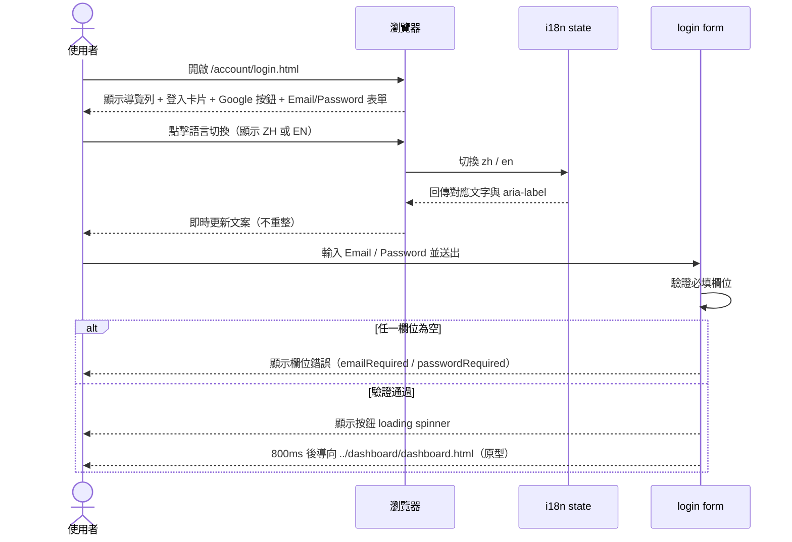
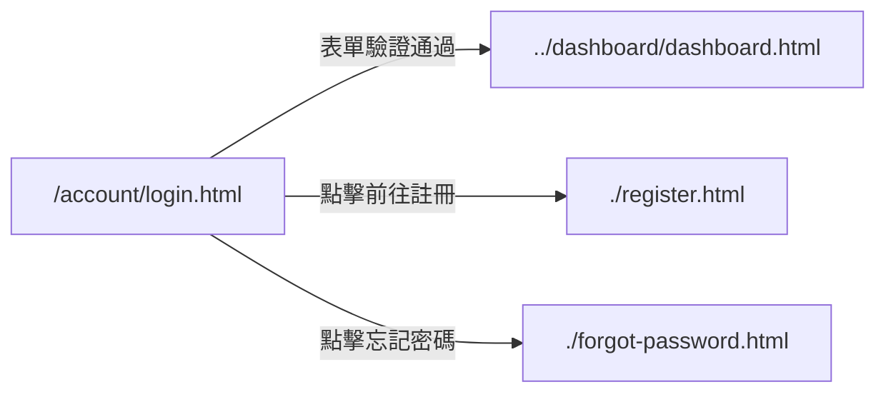

# 功能規格：登入 — Email / Password + 頁面 UI

**功能分支**：`001-login-email-password`
**建立日期**：2026-04-05
**版本**：1.2.0
**狀態**：Clarified
**需求來源**：最新原型 [`design/prototype/pages/account/login.html`](../../../design/prototype/pages/account/login.html)

## 規格常數

- `MOBILE_BP = 767px`
- `RWD_VIEWPORTS = 375px / 768px / 1440px`

## Process Flow

| 步驟 | 角色 | 動作 | 系統回應 |
|------|------|------|---------|
| 1 | 使用者 | 開啟 `/account/login.html` | 顯示導覽列、登入卡片、Google 按鈕、Email/Password 表單、註冊與忘記密碼連結 |
| 2 | 使用者 | 點擊語言切換按鈕（`ZH` / `EN`） | 即時切換所有文案與 `aria-label` |
| 3 | 使用者 | 點擊密碼眼睛圖示 | 切換密碼顯示/隱藏，並同步更新按鈕 `aria-label` |
| 4 | 使用者 | 不填完整欄位直接送出 | 顯示欄位錯誤，停留在登入頁 |
| 5 | 使用者 | 填寫 Email/Password 並送出 | 按鈕進入 loading 狀態，約 800ms 後導向 `../dashboard/dashboard.html`（原型） |
| 6 | 使用者 | 點擊「忘記密碼？」 | 導向 `./forgot-password.html` |
| 7 | 使用者 | 點擊「前往註冊」 | 導向 `./register.html` |

---

## 使用者情境與測試 *(必填)*

### User Story 1 — 登入頁完整呈現（優先級：P1）

未登入使用者進入 `/account/login.html` 時，頁面必須完整呈現登入所需元件與導覽連結。

**此優先級原因**：登入頁是帳號流程入口，若元件缺漏會直接阻斷登入與註冊/找回密碼導流。

**獨立測試方式**：直接開啟登入頁，逐項確認元件存在與文案正確。

**驗收情境**：

1. **Given** 使用者進入登入頁，**When** 頁面載入完成，**Then** 顯示導覽列（Logo + Label Suite + 語言切換）。
2. **Given** 使用者進入登入頁，**When** 檢視登入卡片，**Then** 顯示標題、副標、Google 按鈕、Email 欄、Password 欄、登入按鈕。
3. **Given** 使用者進入登入頁，**When** 檢視底部導流，**Then** 顯示「忘記密碼？」與「前往註冊」連結。

---

### User Story 2 — 表單互動與錯誤顯示（優先級：P1）

使用者送出表單時，系統先驗證必填欄位，並在欄位層級顯示錯誤。

**此優先級原因**：欄位驗證是登入前的最小防呆，直接影響可用性。

**獨立測試方式**：分別提交空 Email、空 Password、兩者皆空，確認欄位錯誤與樣式正確顯示。

**驗收情境**：

1. **Given** Email 為空，**When** 點擊登入，**Then** Email 欄位顯示必填錯誤訊息。
2. **Given** Password 為空，**When** 點擊登入，**Then** Password 欄位顯示必填錯誤訊息。
3. **Given** 任一欄位曾報錯，**When** 使用者重新輸入，**Then** 對應欄位錯誤即時清除。
4. **Given** 使用者點擊密碼眼睛圖示，**When** 反覆切換，**Then** 密碼欄位在 `password` / `text` 間切換且 `aria-label` 同步更新。

---

### User Story 3 — 登入送出與導頁（優先級：P1）

使用者填妥 Email/Password 後送出，系統顯示 loading 後導向 dashboard 原型頁。

**此優先級原因**：成功導頁是登入流程的核心完成訊號。

**獨立測試方式**：輸入任意非空 Email/Password 送出，確認按鈕 loading 與導頁路徑正確。

**驗收情境**：

1. **Given** Email/Password 皆為非空，**When** 送出表單，**Then** 登入按鈕切為 disabled + spinner。
2. **Given** 表單驗證通過，**When** 約 800ms 後，**Then** 導向 `../dashboard/dashboard.html`（原型行為）。
3. **Given** 使用者點擊 Google 按鈕，**When** 觸發事件，**Then** 不導頁、無錯誤（原型 no-op）。

---

### User Story 4 — i18n 與可存取屬性同步（優先級：P2）

登入頁支援 zh / en 切換，且同步更新畫面文字與輔助屬性。

**此優先級原因**：語言切換是核心 UI 要求，且需兼顧可存取性。

**獨立測試方式**：切換語言後逐一檢查文字節點與 `aria-label` 是否同步更新。

**驗收情境**：

1. **Given** 預設語言為 `zh`，**When** 點擊語言切換，**Then** 切換為 `en` 並更新頁面標題、欄位標籤、按鈕文案。
2. **Given** 語言切換後，**When** 檢查互動元件，**Then** `lang-toggle`、Google 按鈕、導覽品牌連結與密碼切換按鈕 `aria-label` 皆同步切換。
3. **Given** 表單曾出現錯誤，**When** 切換語言，**Then** 既有錯誤狀態會被清除。

---

### User Story 5 — 響應式版面（優先級：P2）

登入頁在手機、平板、桌機皆維持可讀且可操作。

**此優先級原因**：登入頁會在多種裝置進入，RWD 破版會直接阻斷使用。

**獨立測試方式**：在 `RWD_VIEWPORTS` 檢視導覽列、卡片間距、按鈕與輸入欄對齊。

**驗收情境**：

1. **Given** `<= MOBILE_BP`，**When** 開啟登入頁，**Then** 導覽列高度為 56px、左右內距為 16px。
2. **Given** `<= MOBILE_BP`，**When** 檢視登入卡片，**Then** 卡片內距縮小（28/20/24）且內容不溢出。
3. **Given** `RWD_VIEWPORTS` 任一寬度，**When** 操作完整流程，**Then** 無文字重疊、無元件遮擋、無水平捲軸。

---

### 邊界情況

- 僅填空白字元（Email）後送出？→ Email 會先 `trim()`，視為空值並顯示必填錯誤。
- 語言切換發生在密碼顯示狀態下？→ 保留目前顯示狀態，只更新對應 `aria-label`。
- 已顯示錯誤後再次送出成功？→ 先清除錯誤，再進入 loading 與導頁流程。
- 目前原型是否已串接真實 `/auth/login` 與 JWT？→ 尚未；現階段為前端互動原型，成功送出後固定導向 dashboard 原型頁。

---

## 需求規格 *(必填)*

### 功能需求

- **FR-001**：系統必須提供 `/account/login.html` 登入頁，包含導覽列、登入卡片、Google 按鈕、Email/Password 表單與導流連結。
- **FR-002**：導覽列必須包含品牌區塊（Logo + Label Suite）與語言切換按鈕（單一語言代碼：`ZH` 或 `EN`）。
- **FR-003**：頁面必須支援 `zh` / `en` 雙語切換，且不需重新整理頁面。
- **FR-004**：語言切換時，必須同步更新文字節點與可存取屬性（至少包含 `aria-label` 與 `document.title`）。
- **FR-005**：表單送出前必須驗證 Email 與 Password 為必填。
- **FR-006**：Email 驗證必須以 `trim()` 後結果判定是否為空。
- **FR-007**：欄位驗證失敗時，必須在對應欄位顯示錯誤訊息與錯誤樣式。
- **FR-008**：使用者於錯誤欄位重新輸入時，系統必須即時清除該欄位錯誤狀態。
- **FR-009**：Password 欄位必須提供顯示/隱藏切換按鈕，且按鈕 `aria-label` 必須依狀態切換。
- **FR-010**：表單驗證通過後，登入按鈕必須進入 disabled + spinner 的 loading 狀態。
- **FR-011**：原型模式下，表單驗證通過後必須於約 800ms 內導向 `../dashboard/dashboard.html`。
- **FR-012**：Google 按鈕在原型模式必須可點擊且不報錯，但不觸發導頁（no-op）。
- **FR-013**：忘記密碼連結必須導向 `./forgot-password.html`。
- **FR-014**：註冊連結必須導向 `./register.html`。
- **FR-015**：頁面必須具備響應式設計，至少支援 `RWD_VIEWPORTS`。
- **FR-015A**：在 `<= MOBILE_BP` 時，導覽列必須改為 56px 高並使用 16px 左右內距。
- **FR-015B**：在 `<= MOBILE_BP` 時，登入卡片必須套用手機內距與尺寸設定，避免欄位、按鈕與文字擠壓。

### User Flow & Navigation

| From | Trigger | To |
|------|---------|-----|
| `/account/login.html` | Email/Password 非空並送出 | `../dashboard/dashboard.html`（原型） |
| `/account/login.html` | 點擊「前往註冊」 | `./register.html` |
| `/account/login.html` | 點擊「忘記密碼？」 | `./forgot-password.html` |

**Entry points**：`/account/login.html`。
**Exit points**：`../dashboard/dashboard.html`、`./register.html`、`./forgot-password.html`。

### 關鍵實體

- **LoginFormState**：登入表單狀態。關鍵欄位：`email`、`password`、`emailError`、`passwordError`、`isSubmitting`。
- **LanguageState**：語言狀態。關鍵欄位：`lang`（`zh` / `en`）。
- **I18nDictionary**：語系字典。關鍵欄位：`pageTitle`、欄位文案、按鈕文案、錯誤訊息、`aria-label` 文案。
- **PrototypeRedirectState**：原型導頁狀態。關鍵欄位：`targetPath = ../dashboard/dashboard.html`、`delayMs = 800`。

---

## 規格相依性 *(本功能依賴其他規格，或被其他規格依賴時填寫)*

### 上游（本規格依賴的規格）

| 規格編號 | 功能 | 本規格需要的內容 |
|---------|------|----------------|
| — | — | — |

### 下游（依賴本規格的規格）

| 規格編號 | 功能 | 依賴本規格的內容 |
|---------|------|----------------|
| 002 | Login — Google SSO | `/account/login.html` 的 Google 按鈕位置、雙語文案與可存取屬性 |
| 003 | Register — Email / Password | `/account/login.html` 的「前往註冊」導流路徑與入口文案 |
| 004 | Forgot / Reset Password | `/account/login.html` 的「忘記密碼」導流路徑與入口文案 |
| 012 | Dashboard | 登入成功後導向 dashboard（原型路徑與最終產品路徑對應） |

---

## 成功標準 *(必填)*

- **SC-001**：登入頁首屏完整顯示核心元件（導覽列、登入卡片、雙登入入口、兩個導流連結）。
- **SC-002**：Email/Password 任一缺漏時會顯示欄位錯誤，且不進入導頁流程。
- **SC-003**：Email/Password 皆非空送出後，按鈕進入 loading 並於約 800ms 導向 `../dashboard/dashboard.html`。
- **SC-004**：語言切換可在 1 秒內完成主要文案與 `aria-label` 更新（不重新整理頁面）。
- **SC-005**：Password 顯示/隱藏切換後，欄位 type 與眼睛按鈕 `aria-label` 一致。
- **SC-006**：在 `RWD_VIEWPORTS` 下無破版、無水平捲軸、無關鍵互動元件遮擋。

---

## Changelog

| 版本 | 日期 | 變更摘要 |
|------|------|---------|
| 1.2.0 | 2026-04-15 | 語言切換按鈕規格改為單一語言代碼顯示（`ZH` / `EN`），移除 `ZH \| EN` 寫法 |
| 1.1.0 | 2026-04-15 | 參照 dashboard 規格寫法重整章節；全面對齊最新 login 原型（i18n、欄位驗證、密碼顯示切換、原型導頁路徑） |
| 1.0.0 | 2026-04-05 | Initial spec |
